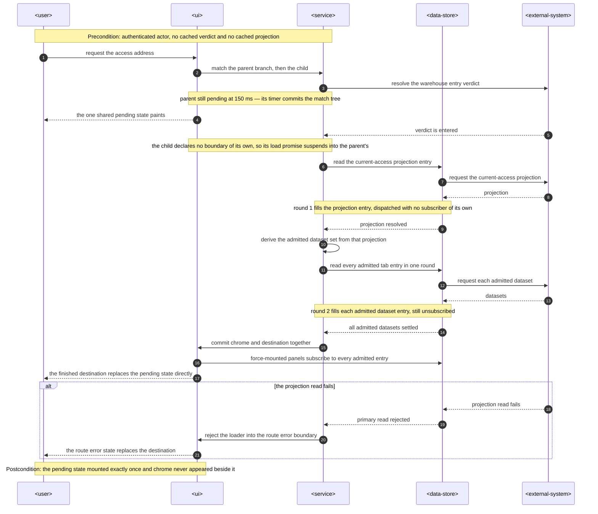
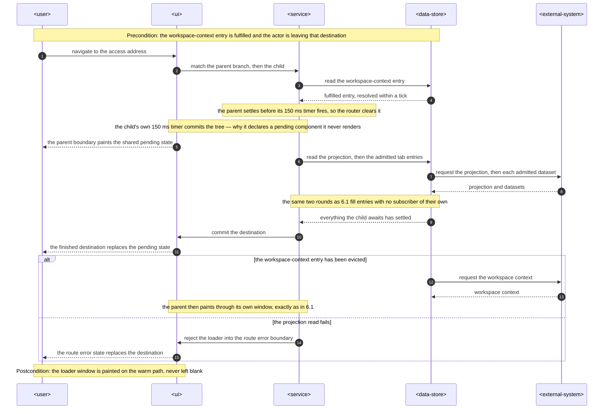
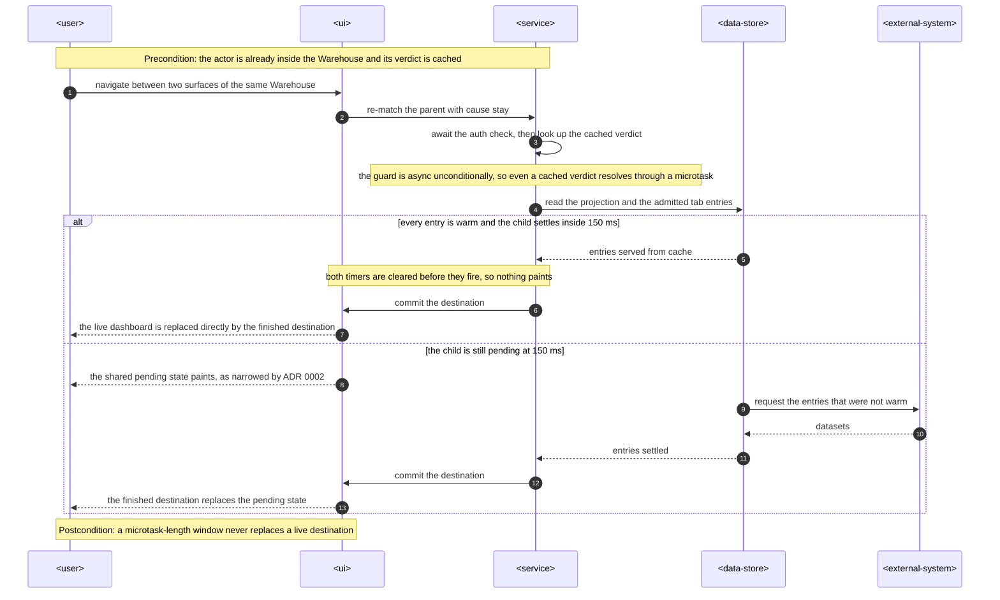
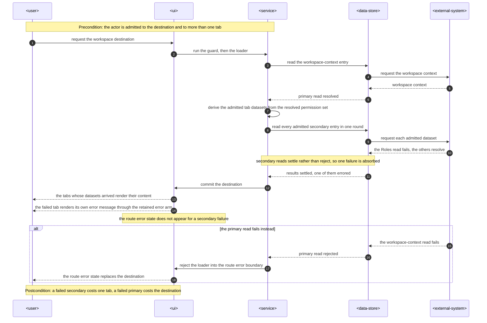
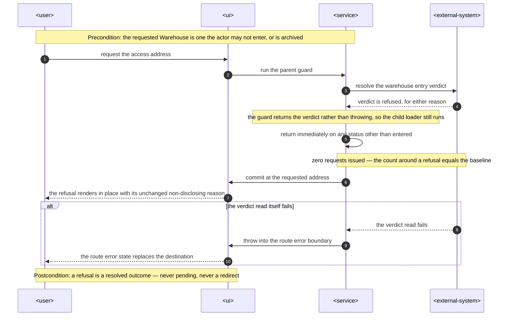
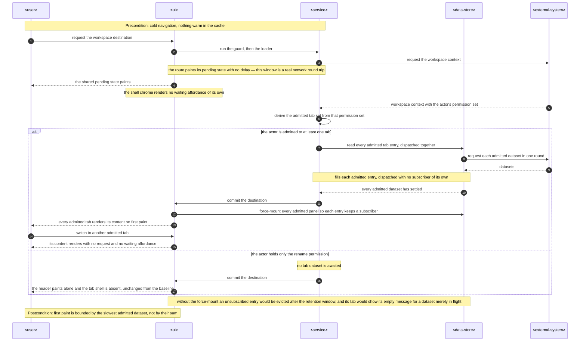
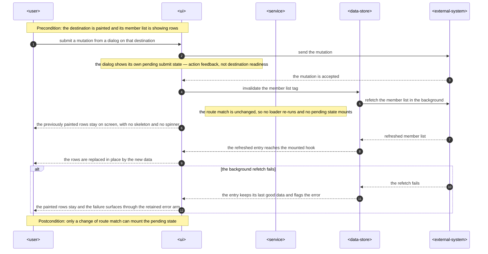
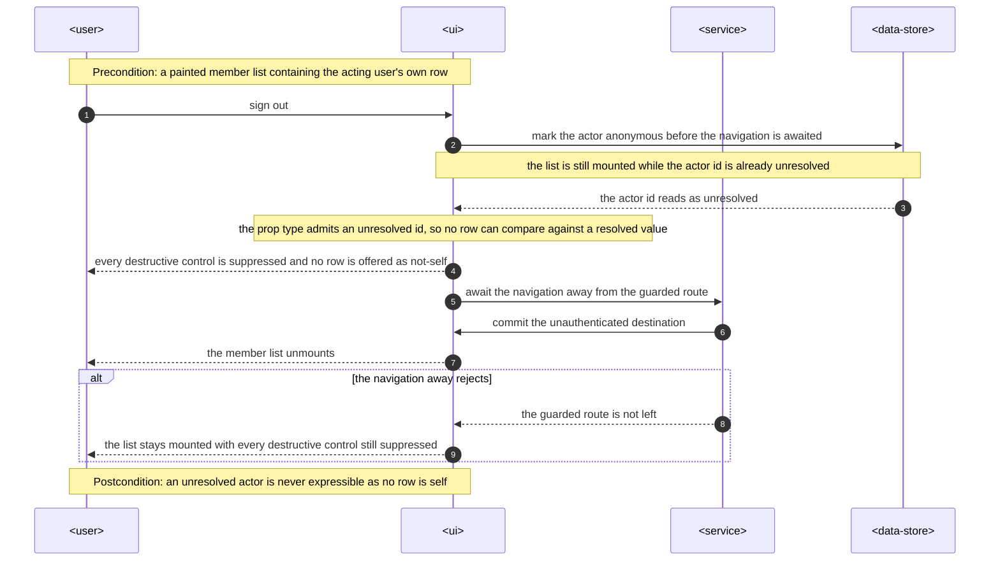

# Software Architecture Description — change-request: global-loader

## 1. Context and quality goals

### Current behavior

`apps/web` answers "what does the actor see while this data is on its way?" in seven places
([`change.md` §1.1](./change.md#11-the-baseline-enumeration)). Each answer is a component-level
branch over a readiness value that a hook publishes: `AccessDataset.isLoading` / `.isFetching` /
`.isReady`, `CurrentPermissions.isLoading`, `CurrentWorkspaceContext.isLoading`,
`WorkspaceRoleChoices.isReady`, `WorkspacePermissionCatalogue.isReady`. Seven such fields exist
across five contract files, and six more readiness values sit in component props
(`DatasetCardProps.loading`/`.loadingLabel`, `MemberListProps.isLoading`,
`MemberDirectoryProps.isRefreshing`, `WarehouseListProps.isLoading`, `WarehousesTab`'s derived
`isLoading`).

At the router boundary the picture is inverted. `homeRoute` declares
`pendingComponent: RoutePendingState` with `pendingMs: 0` / `pendingMinMs: 0`
(`modules/home/route.tsx:23,29-30`) and paints the window during which
`resolveLandingContext` awaits the network. The other three authenticated routes declare nothing:
`workspaceRoute` awaits `requireWorkspaceCapability`, `warehouseRoute` awaits
`resolveWarehouseEntry`, and `accessRoute` awaits nothing at all because it has neither `beforeLoad`
nor `loader`. During those windows the actor sits on the page they came from with no signal.

One of the seven affordances is unreachable. `guards/workspace.guard.ts:19-25` unwraps
`getWorkspaceContext` inside `workspaceRoute.beforeLoad`, so RTK Query serves a fulfilled cache
entry on `WorkspaceAdministration`'s first render and `isLoading` reads `false` — the `Spinner`
branch at `WorkspaceAdministration.tsx:78-85`, and the `if (!workspaceContext) return null` at
`:87-89` below it, are dead.

Four `docs/system` passages instruct the arrangement this request replaces:
[`frontend-architecture.md`](../../system/frontend-architecture.md) §Page ("the narrowest owner that
can coordinate the complete loading, error, empty, and success behavior") and
[`writing-web-components.md`](../../system/guides/writing-web-components.md) §1 (which names
`DatasetSkeleton` as its private-helper example), §3 (the Tab/panel container "resolves capabilities
and datasets"), §4 ("callers just read `.items` and `.isReady`") and §6 (whose early-return example
branches on `!members.isReady`).

### Target behavior

The **route** owns first-paint readiness of its destination. Each of the four authenticated routes
declares `RoutePendingState` as the affordance for its own await window, and `workspaceRoute` and
`accessRoute` gain loaders that await every dataset the actor's admitted surfaces would fetch. No
component branches on readiness, no hook publishes a readiness value, and the destination paints
complete or does not paint.

Error, empty and search-empty behavior stays exactly where it is — component-owned, unchanged
([`spec.md` CR-RG-05](./spec.md#cr-rg-05--error-empty-and-search-empty-states-are-unchanged)). The
narrowest-owner rule keeps governing those three; only loading moves.

`RoutePendingState` already exists, is already wired on `homeRoute`, and is not redesigned. Seven
waiting affordances become one; seven readiness fields in hook contracts and six in component
contracts become zero; three unpainted route windows become zero; two unreachable branches become
zero.

### Quality goals, in priority order

1. **The wrong thing is unwritable, not merely undone.** After CH-09 there is no `isLoading` on a
   dataset contract to branch on. A contributor who wants a component-level loading state has to
   re-add a field to a hook contract, which is a visible act rather than a local convenience.
2. **Moving _when_ data is fetched must not move _who may receive it_.** CR-RG-02's ten-row
   enumeration is the contract, and both directions are regressions — a widened loader leaks a
   dataset, a narrowed one silently withdraws Roles from a `ROLES:ASSIGN`-only actor and breaks the
   Members list's Role-name lookup (`MemberList.tsx:116`).
3. **Exactly one pending affordance per navigation, and never over a live destination.** CR-AC-13
   and CR-AC-16 are the two observables that decide the router wiring, and they are what
   [ADR 0002](./adr/0002-one-pending-boundary-per-route-branch.md) exists to reconcile.
4. **A partial destination is worse than a late one.** A tab whose dataset failed shows its own
   error message beside tabs that arrived (CH-15); only a failed _primary_ read replaces the
   destination with `RouteErrorState`.
5. **Nothing crosses a module boundary that does not already cross one.** The loaders need the
   exact Permission sets the hooks apply; they get them by sharing the named constant, not by
   copying it and not by exporting a module's internals to the composition layer.

## 2. Constraints inherited from `docs/system`

Linked, not restated. Each row names the rule this change is bound by and how it is honored.

| Inherited rule                                                                                                                                                                                                                                                                                   | Binding on this change                                                                                                                                                                                                                                           |
| ------------------------------------------------------------------------------------------------------------------------------------------------------------------------------------------------------------------------------------------------------------------------------------------------ | ---------------------------------------------------------------------------------------------------------------------------------------------------------------------------------------------------------------------------------------------------------------- |
| [`frontend-architecture.md`](../../system/frontend-architecture.md) §Route — a route owns "parent and path; lazy page import; route access guard; route-specific search validation or loader wiring when needed" and "contains no feature JSX, form handling, RTK dispatch, or direct API calls" | The routes gain `loader:` **wiring**; every dispatch lives in a named function outside `route.tsx`. This is the constraint [ADR 0001](./adr/0001-module-owned-route-loaders.md) resolves.                                                                        |
| [`frontend-architecture.md`](../../system/frontend-architecture.md) §Page — narrowest owner coordinates loading/error/empty/success                                                                                                                                                              | **Amended by CH-01, at ship.** Loading leaves the narrowest-owner rule; error, empty and success stay under it. Until the reconciliation lands, this SAD is the record of the deviation.                                                                         |
| [`frontend-architecture.md`](../../system/frontend-architecture.md) §Source structure                                                                                                                                                                                                            | `modules/<module>/loaders/` is **not** in the documented tree. Proposed deviation, recorded in [ADR 0001](./adr/0001-module-owned-route-loaders.md) and reconciled at ship (§11).                                                                                |
| [`frontend-architecture.md`](../../system/frontend-architecture.md) §Redux Toolkit — "guards and other non-React workflows dispatch the same endpoint's `initiate` thunk and await `unwrap()`"                                                                                                   | The loaders are exactly that workflow. They dispatch with `subscribe: false`, mirroring `guards/workspace.guard.ts:19-25` and `guards/warehouse-entry.guard.ts:19-25`.                                                                                           |
| [`frontend-architecture.md`](../../system/frontend-architecture.md) §Guards — guards are plain functions that return or throw a redirect                                                                                                                                                         | Unchanged. No guard gains a data responsibility and no loader gains an access responsibility; CH-16's `entered` check reads the verdict the guard already published, it does not re-derive it.                                                                   |
| [ADR 19-08-2026 — declarative permission gates](../../system/adr/19-08-2026-declarative-permission-gates.md)                                                                                                                                                                                     | No gate, descriptor or capability boolean changes (CR-RG-07). A Permission is still read as a boolean only where it decides a request. The loaders are that same "decides a request" case, moved to the route; they read the **same named sets** the hooks read. |
| [ADR 02-08-2026 — RTK Query for web API calls](../../system/adr/02-08-2026-rtk-query-for-web-api-calls.md)                                                                                                                                                                                       | One shared API slice, one base query. The loaders add no client and no endpoint — they dispatch the existing `initiate` thunks.                                                                                                                                  |
| [ADR 18-08-2026 — scope-of-exercise placement tiebreak](../../system/adr/18-08-2026-scope-of-exercise-placement-tiebreak.md)                                                                                                                                                                     | A loader belongs to the module whose datasets it awaits. `modules/workspace` owns the `/workspace` loader; the three Workspace-administration datasets `modules/access` owns are contributed through that module's declared surface (§5.4).                      |
| [`writing-web-components.md`](../../system/guides/writing-web-components.md) §1, §3, §4, §6                                                                                                                                                                                                      | All four passages break against the post-CH-09 contract and are on `change.md` §8's reconciliation list.                                                                                                                                                         |
| [`writing-web-components.md`](../../system/guides/writing-web-components.md) §9 — "delete dead branches"                                                                                                                                                                                         | CH-05/CH-13 remove the two unreachable branches §1 identifies, rather than leaving them behind the new route boundary.                                                                                                                                           |
| [`placing-web-hooks.md`](../../system/guides/placing-web-hooks.md) §2–§3                                                                                                                                                                                                                         | `useWorkspaceAdministrationContext` is a **projection** (derives from state already loaded). The Permission-set constants declare no hook and go to `utils/`.                                                                                                    |
| [`placing-web-tests.md`](../../system/guides/placing-web-tests.md)                                                                                                                                                                                                                               | Loader specs sit beside their loader. The CR-RG-02 drift check spans four owners and goes in its own directory under `src/test/`.                                                                                                                                |
| [`adding-and-maintaining-web-localization.md`](../../system/guides/adding-and-maintaining-web-localization.md)                                                                                                                                                                                   | CH-12 removes 7 keys per language. Both languages must carry the identical key set afterwards.                                                                                                                                                                   |
| `AGENTS.md` — no telemetry                                                                                                                                                                                                                                                                       | No metric, span or counter is added. §10's measurement is structural plus `/run`.                                                                                                                                                                                |

**Deviations proposed by this change**, both of which need a `docs/system` edit at ship and neither
of which is applied at merge:

1. `modules/<module>/loaders/` joins the documented `src/` tree
   ([ADR 0001](./adr/0001-module-owned-route-loaders.md)).
2. §Page's narrowest-owner sentence loses `loading` (CH-01, already on `change.md` §8's list).

## 3. Scope and target surfaces

`target_surfaces: ['web-frontend']`.

`apps/server`, `packages/contracts`, `packages/shared-types` and `packages/utils` are untouched.
No endpoint, request shape, response shape or persisted value changes.

### UI-design gate

This change is user-visible but draws nothing new. `RoutePendingState` is the already-approved
landing pending affordance, rendered unchanged at three additional addresses; every surviving
error/empty/search-empty message is an already-approved frame (CR-RG-05); everything else is
removal. **Recommendation: no new `.pen` frame and no `design-ui` pass.** The route from here is
`sequences` → `plan-tests` → `tasks`. If the reviewer judges "seven affordances become one" a
visual change requiring approval, that gate runs before `tasks` and blocks nothing else in this
document.

### In scope

- `pendingComponent` / `errorComponent` / `pendingMs` / `pendingMinMs` / `wrapInSuspense` on the
  four authenticated routes (CH-02, CH-02a, CR-AC-16).
- Two new route loaders and their failure semantics (CH-03, CH-04, CH-15, CH-16).
- Removal of seven waiting affordances, seven hook-contract readiness fields, six component-contract
  readiness values, two dead branches and fourteen translation keys (CH-05 – CH-14).
- One enumerated Permission-condition widening: `useAccessPermissions`'s skip set (CR-RG-02).
- Force-mounting the admitted tab panels so a loader-filled cache entry keeps a subscriber
  (CR-AC-03).
- The structural tests and module-boundary declarations that name a deleted file.

### Out of scope

- Tabs becoming routes; the URLs are unchanged (`spec.md` §3).
- Any Suspense migration. RTK Query has no suspense integration; the router's pending contract is
  the mechanism.
- Any new Redux slice, in-flight counter or `RootLayout` overlay.
- `modules/auth`, `modules/home` and every mutation/submit affordance (CR-RG-06).
- `warehouseDashboardRoute`, which gains no loader: `WarehousePage` renders `DesignSystemExample`
  and reads no dataset, so the parent's pending contract is the whole of its readiness (CR-AC-15).

### Questions closed here

`spec.md` §8 left three questions due at `design`. All three are answered:

- **The CR-AC-13 mechanism** — [ADR 0002](./adr/0002-one-pending-boundary-per-route-branch.md).
  `accessRoute` owns no Suspense boundary; its loader's pending window suspends into
  `warehouseRoute`'s, so one `RoutePendingState` spans both.
- **`subscribe: false`** — yes, both loaders, mirroring the two existing guards. CR-AC-03's
  force-mounted panels are what make it safe (§4.4).
- **`WarehousesTab`'s query-ordering comment** — superseded. The loader issues both reads before the
  tab mounts, so the ordering the comment protects no longer has an owner; it is removed with CH-14.

## 4. Solution strategy

### 4.1 The route declares readiness; the loader function owns the reads

`route.tsx` gains one line per concern — `pendingComponent`, `errorComponent`, `pendingMs`,
`pendingMinMs`, `loader` — and no dispatch. Every `store.dispatch(...initiate(...)).unwrap()` lives
in a named async function under `modules/<module>/loaders/`, which is the shape
`frontend-architecture.md` §Route already requires of guards and the reason
[ADR 0001](./adr/0001-module-owned-route-loaders.md) exists.

### 4.2 Primary reads reject; secondary reads settle

CH-15's rule becomes a two-phase loader body with no per-dataset error handling:

```ts
const access = await store
  .dispatch(getCurrentAccess.initiate(warehouseId, { subscribe: false }))
  .unwrap();
// a rejection here propagates out of the loader -> RouteErrorState  (CR-AC-15)

await Promise.allSettled(
  admittedDatasets.map((dispatchDataset) => dispatchDataset()),
);
// a rejection here is absorbed; the dataset renders its own error message
```

`Promise.allSettled` is the whole of the settle semantics — no `catch` per dataset, nothing swallowed
silently, and the failed entry is already in the RTK Query cache with `isError: true`, which is why
`AccessDataset.isError` survives CH-09 (CR-AC-09).

`allSettled` also bounds the wait by the **slowest** admitted dataset rather than their sum, which
is the `/workspace` non-functional target in `spec.md` §6.

### 4.3 The access loader is two rounds, deliberately

Every access skip set is derived from `getCurrentAccess`'s `permissionIds`
(`useAccessRoles.ts:35` → `useHasPermission` → `usePermissions.ts:48-59`), so the projection must
resolve before the tab datasets can be selected. CR-RG-02 forbids flattening that by fetching
unconditionally. Two rounds is the accepted cost; a third would fail `spec.md` §6 row 2.

`/workspace` is one round: `getWorkspaceContext` is already fulfilled by
`requireWorkspaceCapability` in `beforeLoad`, so the loader's own `initiate` resolves from that
cache entry without a second request, and all admitted datasets dispatch together.

### 4.4 `subscribe: false` plus force-mounted panels

The loaders mirror the guards and dispatch with `subscribe: false`, so a loader-filled entry has no
subscriber of its own. RTK Query starts its 60-second `keepUnusedDataFor` timer immediately for such
an entry. Left alone, an admitted-but-unopened tab's entry would be evicted after a minute's dwell,
and — with no readiness term left to distinguish "in flight" from "empty" — that tab would then
render `workspaceRoles.empty` / `members.empty` for a dataset that is merely loading.

`Tabs.Panel shouldForceMount` closes this. React Aria's `TabPanel` mounts a force-mounted panel
inert but present, so every admitted tab's own query hook mounts on first paint and holds the entry
the loader filled for the destination's lifetime. This is CR-AC-03's third clause and it is what
makes `subscribe: false` safe; the two decisions are one decision.

Consequence, recorded in §11: all admitted tabs' content is in the DOM simultaneously, so a spec
querying by role and accessible name may now match across tabs.

### 4.5 A Permission set is declared once and read by both the hook and the loader

CR-RG-02's failure mode is drift between a hook's `skip` and the loader's map. The structural answer
is that neither owns the set — a named constant does, and both read it.

`modules/access/utils/access-permission-sets.ts` (a lookup table, so `utils/` per
[`placing-web-hooks.md`](../../system/guides/placing-web-hooks.md) §3) holds
`rolesTabPermissions`, `rolesReadPermissions` and `membersReadPermissions`. The gate itself does not
move: `useAccessRoles` still applies its own `skip` (`placing-web-hooks.md` §2, "a gate belongs to
the read it gates"), it just names the set from one place.

**The one intended widening becomes structural.** `useAccessPermissions`'s set is redefined as
`rolesTabPermissions` itself — the same six Permissions that put the Roles tab on the bar. The old
three (`ROLES:WATCH`, `ROLES:CREATE`, `ROLES:UPDATE`) are a subset, so this widens by
`ROLES:ASSIGN`, `ROLES:DELETE` and `WAREHOUSE_MANAGER_ROLE:REASSIGN` exactly as CR-RG-02 permits,
and it makes **"tab admission implies the dataset arrives"** an identity a reader can see rather
than an invariant a comment claims. That identity is the reachability argument CR-RG-05 rests on.

Where no constant exists — `useListWorkspaceWarehousesQuery` is ungated at the hook and gated by the
tab descriptor's `WAREHOUSES:WATCH` — the backstop is the dedicated drift spec in §10.

### 4.6 The non-optional Workspace context is route-scoped, not contract-wide

CR-AC-05 asks for a `WorkspaceContext` that is non-optional at the type level. Narrowing
`CurrentWorkspaceContext.workspaceContext` cannot deliver that honestly: `WarehouseSwitcher.tsx:164`
and `RetainedContextMessage.tsx:49` read the same contract from the **shell**, where no route has
awaited the context, and CR-RG-08 requires the shell to keep observing that absence without a
skeleton.

So the narrow type is delivered where the guarantee actually holds. A new projection,
`modules/workspace/hooks/projections/useWorkspaceAdministrationContext.ts`, reads the Workspace
match by route id — the pattern `shared/hooks/projections/useEnteredWarehouse.ts` established and
documents — and returns `WorkspaceContext`. `requireWorkspaceCapability` unwrapping
`getWorkspaceContext` in `beforeLoad` is what makes that type true, and the one place that says so
is the projection, beside the guard that guarantees it, rather than every call site.

`CurrentWorkspaceContext.workspaceContext` stays `WorkspaceContext | undefined`; only
`CurrentWorkspaceContext.isLoading` is removed by CH-09. **CR-AC-05's second sub-clause is amended
by this SAD** (§11).

### 4.7 A mutation cannot reach a route loader

CH-10 asks that a cache invalidation never re-run a loader. Nothing couples them: TanStack re-runs a
loader on navigation or `router.invalidate()`, and RTK Query tag invalidation refetches subscribed
queries in place. The force-mounted hooks are those subscribers, so an invalidated members list
refetches with `isFetching: true` and its `data` retained — the rows stay on screen (CR-AC-10) —
while the loader is not involved.

The one call to `router.invalidate()` in the app is `RouteErrorState.tsx:32`'s retry, which is
deliberate and unrelated. §10 pins the absence of any other coupling.

### 4.8 What replaces each collapsed guard

CH-14 amends nine call sites, and the rule for each is the same: **keep the permission arm, keep the
error arm, drop the readiness term.**

- Where a tab's admitting Permission is inside its dataset's gate, the not-permitted arm is
  unreachable and no branch replaces it (CR-RG-05's reachability argument): `PermissionsTab`,
  `MembersTab`, `WorkspaceMembersTab`, `WorkspaceRolesTab`, `WorkspaceMemberList`.
- `RolesTab.tsx:46` keeps its genuine alternative-surface arm — a `ROLES:WATCH`-only actor gets the
  read-only card. That is a permission distinction, not a readiness one.
- The error arm is always explicit. `RolesTab` and `MembersTab` reach `RolesDatasetCard` /
  `MembersDatasetCard` through their `!isReady` term today; the surviving condition is
  _not-permitted **or** errored_, never the permission term alone, or a permitted actor whose read
  failed would be told "no roles are available" (CR-AC-15).
- `empty` becomes `items.length === 0` everywhere, and no `?? []` default is introduced where a hook
  still returns `undefined` — defaulting would render `workspaceMembers.empty` as a false statement
  after a failed or evicted read (CR-RG-05).

### 4.9 The unresolved actor is carried by a type, not a branch

CH-11 removes `MemberDirectory.tsx:122`'s `isLoading={isRefreshing || actor === null}` guard, which
is **live** — `SignOutButton.tsx:26-27` dispatches `authBecameAnonymous()` before awaiting
`navigate`, so `selectCurrentUser` is `null` while the list is still mounted.

`MemberListProps.actorUserId` widens from `string` to `string | undefined`, the `?? ''` fallback at
`MemberDirectory.tsx:121` goes, and `MemberRow` suppresses every destructive control while it is
undefined. Widening the type is the mechanism: leaving it `string` would let
`MemberList.tsx:114`'s `isSelf={member.userId === actorUserId}` keep type-checking while evaluating
`false` for every row — CR-RG-01's exact forbidden outcome, reached silently. `MemberListStatus`
gains no state for it (CR-AC-08 narrows it to three).

## 5. Building blocks and ownership

### 5.1 Route declarations after the change

| Route                     | File                          | `pendingComponent`    | `errorComponent`    | `pendingMs` | `pendingMinMs` | `wrapInSuspense` | `loader`                        |
| ------------------------- | ----------------------------- | --------------------- | ------------------- | ----------- | -------------- | ---------------- | ------------------------------- |
| `homeRoute`               | `modules/home/route.tsx`      | `RoutePendingState` ✓ | `RouteErrorState` ✓ | `0` ✓       | `0` ✓          | default          | none                            |
| `workspaceRoute`          | `modules/workspace/route.tsx` | `RoutePendingState` + | `RouteErrorState` + | `0` +       | `0` +          | default          | `loadWorkspaceAdministration` + |
| `warehouseRoute`          | `routes/warehouse.route.tsx`  | `RoutePendingState` + | `RouteErrorState` ✓ | `150` +     | `0` +          | default          | none                            |
| `accessRoute`             | `modules/access/route.tsx`    | `RoutePendingState` + | `RouteErrorState` + | `150` +     | `0` +          | **`false`** +    | `loadAccessSurface` +           |
| `warehouseDashboardRoute` | `modules/warehouse/route.tsx` | none                  | none                | —           | —              | default          | none                            |

`✓` already present at `baseline_revision`; `+` added by this change.

Three values need their reason stated at the declaration, because none is self-evident:

- **`pendingMs: 150` on `warehouseRoute`** — `warehouse.route.tsx:44-54` is `async` unconditionally
  and awaits `requireAuth` before its `lastVerdictByStore` lookup, so even a cached verdict resolves
  through a microtask on every navigation inside a Warehouse. 150 ms is what keeps that microtask
  from painting over a live destination (CR-AC-16).
- **`pendingMs: 150` on `accessRoute`** — the same guard, one level down, and the router clears a
  parent's pending timer as soon as the parent's own match settles. Without a timer of its own the
  access loader's window would go unpainted whenever the parent resolves from cache — the common
  `/workspace` → `/access` path. See [ADR 0002](./adr/0002-one-pending-boundary-per-route-branch.md).
- **`wrapInSuspense: false` on `accessRoute`** — the route declares a `pendingComponent` that it
  never renders. The declaration registers the router's commit timer
  (`setupPendingTimeout` gates on `pendingComponent` being present); `wrapInSuspense: false`
  suppresses the route's own Suspense boundary so the loader's pending window suspends into
  `warehouseRoute`'s and one `RoutePendingState` spans both (CR-AC-13). Both lines carry a comment
  saying so; neither is inferable from the option name.

`pendingMinMs: 0` is explicit on all four. TanStack's default is `500`, which would hold a fallback
on screen after its data arrived.

### 5.2 New files

| File                                                                             | Kind       | Owns                                                                                                                            |
| -------------------------------------------------------------------------------- | ---------- | ------------------------------------------------------------------------------------------------------------------------------- |
| `modules/workspace/loaders/workspace-administration.loader.ts`                   | loader     | `/workspace`'s primary read and the Warehouses + Workspace-users datasets, composed with the access contribution below          |
| `modules/workspace/loaders/workspace-administration.loader.spec.ts`              | spec       | CR-AC-03, CR-AC-15, CR-RG-02's five `workspaceRoute` rows                                                                       |
| `modules/access/loaders/access-surface.loader.ts`                                | loader     | `/warehouses/$id/access`'s verdict guard, primary read and three tab datasets                                                   |
| `modules/access/loaders/access-surface.loader.spec.ts`                           | spec       | CR-AC-04, CR-AC-14, CR-AC-15, CR-RG-02's four `accessRoute` rows                                                                |
| `modules/access/loaders/workspace-administration-datasets.loader.ts`             | loader     | The three Workspace-administration datasets `modules/access` owns; the **only** new `MODULE_SURFACE.access` entry               |
| `modules/access/utils/access-permission-sets.ts`                                 | lookup     | `rolesTabPermissions`, `rolesReadPermissions`, `membersReadPermissions` — read by the hooks, the loader and `AccessWorkspace`   |
| `modules/workspace/hooks/projections/useWorkspaceAdministrationContext.ts`       | projection | The non-optional `WorkspaceContext` inside the guarded route (§4.6)                                                             |
| `modules/workspace/hooks/projections/useWorkspaceAdministrationContext.spec.tsx` | spec       | CR-AC-05's type guarantee                                                                                                       |
| `src/test/route-readiness/route-readiness.spec.tsx`                              | spec       | CR-AC-02, CR-AC-13, CR-AC-16, CR-AC-10's no-reload clause — spans four routes, so its own directory (`placing-web-tests.md` §4) |
| `src/test/loader-permission-parity/loader-permission-parity.spec.ts`             | spec       | CR-RG-02's drift check: every loader dispatch condition against the hook `skip` or tab descriptor it reproduces                 |

### 5.3 Deleted files

- `modules/access/components/workspace-administration/WorkspaceListSkeleton.tsx`
- `modules/workspace/components/workspace-administration/warehouses/WarehouseListSkeleton.tsx`

### 5.4 Dependency direction across the module boundary

`/workspace` is composed from two modules: the destination and the Warehouses tab belong to
`modules/workspace`, and the Roles, Members and Permissions tabs are imported from `modules/access`
through the surface entries `MODULE_SURFACE.access` already declares. Its loader has the same shape:

```text
modules/workspace/route.tsx
  └─ loaders/workspace-administration.loader.ts        (modules/workspace, intra-module)
       ├─ getWorkspaceContext                          (shared/api/workspace)      primary
       ├─ listWorkspaceWarehouses                      (modules/workspace/api)     intra-module
       ├─ listWorkspaceUsers                           (shared/api/workspace)      shared
       └─ loadWorkspaceAdministrationAccessDatasets    (modules/access, SURFACE)
            ├─ listWorkspaceMembers                    (modules/access/api)
            ├─ listWorkspaceRoles                      (modules/access/api)
            └─ listWorkspacePermissions                (modules/access/api)
```

`modules/workspace` never learns which Permissions gate the access module's datasets; it passes the
resolved `workspacePermissionIds` and the access module applies its own gates — the same division
the tab components already have. One new surface entry, no inverted dependency, and no Permission
set copied across the boundary.

`listWorkspaceUsers` is dispatched **once**, by the workspace side. It is one cache entry serving
both `WarehousesTab.tsx:66`'s people counts and `useWorkspaceUsers`'s candidate list, which is why
CR-RG-02 lists it as one row.

`accessRoute`'s loader is entirely intra-`modules/access`; `modules/access/route` is already on the
surface and no entry is added for it.

### 5.5 What each loader awaits

**`loadWorkspaceAdministration({ context: { store } })`** — one round after the primary.

| Dataset                    | Gate                                   | Gate kind      | Phase     |
| -------------------------- | -------------------------------------- | -------------- | --------- |
| `getWorkspaceContext`      | none — `beforeLoad` already awaited it | unconditional  | primary   |
| `listWorkspaceWarehouses`  | `WAREHOUSES:WATCH`                     | tab descriptor | secondary |
| `listWorkspaceUsers`       | `WORKSPACE_MEMBERS:WATCH`              | hook skip      | secondary |
| `listWorkspaceMembers`     | `WORKSPACE_MEMBERS:WATCH`              | hook skip      | secondary |
| `listWorkspaceRoles`       | `WORKSPACE_ROLES:WATCH`                | hook skip      | secondary |
| `listWorkspacePermissions` | `WORKSPACE_ROLES:WATCH`                | hook skip      | secondary |

An actor holding only `WORKSPACE:RENAME` is admitted to the destination and to no tab: the loader
awaits nothing secondary, the header paints alone, and the tab shell is absent — unchanged from
`baseline_revision` (`WorkspaceAdministration.tsx:113-117`, CR-AC-03).

**`loadAccessSurface({ context })`** — two rounds, or none.

| Dataset                 | Gate                                          | Gate kind | Phase      |
| ----------------------- | --------------------------------------------- | --------- | ---------- |
| _(everything)_          | `context.status === 'entered'`                | verdict   | CH-16 gate |
| `getCurrentAccess`      | the verdict above                             | verdict   | primary    |
| `listAccessRoles`       | `rolesReadPermissions` (8)                    | hook skip | secondary  |
| `listAccessMembers`     | `membersReadPermissions` (7)                  | hook skip | secondary  |
| `listAccessPermissions` | `rolesTabPermissions` (6) — **widened**, §4.5 | hook skip | secondary  |

`getCurrentAccess` is issued with the identical argument `useEnteredWarehouse()` supplies to
`useCurrentPermissions`, so `AccessPage` reads the entry the loader filled rather than opening a
second one (CR-AC-04).

### 5.6 Contracts after CH-09

| Contract                                                 | Removed                                                      | Retained                                                               |
| -------------------------------------------------------- | ------------------------------------------------------------ | ---------------------------------------------------------------------- |
| `AccessDataset<TItem>` (`access-dataset.ts`)             | `isFetching`, `isLoading`, `isReady`                         | `items`, **`isError`** — CR-AC-15's error promise rests on it          |
| `CurrentPermissions` (`usePermissions.ts`)               | `isLoading`                                                  | `access`, `permissionIds`; `currentData` read unchanged (CR-RG-03)     |
| `CurrentWorkspaceContext` (`useWorkspacePermissions.ts`) | `isLoading`                                                  | `workspaceContext` **stays optional** (§4.6), `workspacePermissionIds` |
| `WorkspaceRoleChoices` (`useWorkspaceRoles.ts`)          | `isReady`                                                    | `roles`, `customRoles`                                                 |
| `WorkspacePermissionCatalogue`                           | `isReady`                                                    | `permissions`                                                          |
| `DatasetCardProps`                                       | `loading`, `loadingLabel`, and the private `DatasetSkeleton` | `children`, `empty`, `emptyLabel`, `error`, `errorLabel`, `title`      |
| `MemberListProps`                                        | `isLoading`                                                  | `actorUserId` **widened to `string \| undefined`** (§4.9)              |
| `MemberDirectoryProps`                                   | `isRefreshing`                                               | `members`                                                              |
| `WarehouseListProps`                                     | `isLoading`                                                  | the rest unchanged                                                     |

The identifiers `isLoading`/`isFetching`/`isReady` remain legal elsewhere: RTK Query's own query
results, `router.state.isLoading`, `mutation-feedback.middleware.ts` and the CR-RG-06 components
(CR-AC-09's scope bound).

### 5.7 Boundary declarations to update

- `MODULE_SURFACE.access` **+** `modules/access/loaders/workspace-administration-datasets.loader`,
  annotated with its importer (`modules/workspace/loaders/workspace-administration.loader.ts`), as
  every entry there is.
- `WORKSPACE_MODULE_MANIFEST` **+** `hooks/projections/useWorkspaceAdministrationContext.ts`,
  `hooks/projections/useWorkspaceAdministrationContext.spec.tsx`,
  `loaders/workspace-administration.loader.ts`, `loaders/workspace-administration.loader.spec.ts`;
  **−** `components/workspace-administration/warehouses/WarehouseListSkeleton.tsx`.
- `test/warehouse-administration-split/warehouse-administration-split.spec.ts:40,108,139` and
  `test/warehouses-tab-case-inventory/warehouses-tab-case-inventory.spec.ts:137` stop naming a
  deleted file and a deleted case (CR-AC-08).

### 5.8 Retained unchanged

`RoutePendingState`, `RouteErrorState`, `WarehouseEntryRefusal`, `WarehouseLayout`, all four guards,
every `WarehousePermissionGate` / `WorkspacePermissionGate` / `usePermittedItems` /
`useWorkspacePermittedItems` call site, `mutationFeedbackMiddleware`, every dialog and form, and
`usePermissions`'s `currentData` read (CR-RG-03).

## 6. Runtime view

Eight flows are drawn here: the five this SAD fixed (§6.1–§6.5, each keeping the observable it pins
verbatim) and three added by `sequences` because no runtime path covered them — §6.6 (CR-AC-03),
§6.7 (CR-AC-10, CR-US-04) and §6.8 (CR-RG-01).

Every flow is **synchronous** — request to response. This change introduces no webhook, schedule,
queue or third-party callback, so no idempotency key, retry note or dead-letter branch applies to any
diagram below.

**Participants.** The diagrams use the generic runtime vocabulary; this is how it reads for a
`web-frontend` change:

| Participant         | Reads as                                                                     |
| ------------------- | ---------------------------------------------------------------------------- |
| `<user>`            | the authenticated actor                                                      |
| `<ui>`              | the shell chrome plus the routed destination and its components              |
| `<service>`         | the route branch — its guards, its `pendingComponent` timers and its loaders |
| `<data-store>`      | the client query cache the loaders fill and the mounted hooks read           |
| `<external-system>` | `apps/server`, which this change does not touch                              |

The persist notes name the **cache entry a loader fills**, not a row: §7 records no schema change and
no flow below writes to `apps/server` except the mutation in §6.7, which by §4.7 cannot reach a route
loader at all.

### 6.1 Cold navigation to `/warehouses/$id/access` (CR-AC-13, CR-AC-02)

`warehouseRoute.beforeLoad` awaits `resolveWarehouseEntry` (network). At 150 ms its pending timer
commits the match tree; `warehouseRoute` is still pending, so its Suspense boundary shows
`RoutePendingState`. The verdict resolves; `WarehouseLayout` renders into that boundary's children
and its `<Outlet>` reaches `accessRoute`, which has **no boundary of its own** and throws its load
promise into `warehouseRoute`'s. The same boundary keeps the same fallback element mounted. When the
access loader settles, chrome and destination commit together.

Observable: `RoutePendingState` mounts once; `WarehouseLayout` is never on screen beside a pending
state.

Consequence worth stating: `useRecordWarehouseEntry` fires when `WarehouseLayout` mounts, which is
now after the access loader settles rather than after the verdict. The ordering guarantee is
unchanged — it still runs only on an `entered` verdict — but the write is one round later on this
route.



### 6.2 `/workspace` → `/access`, Workspace context warm (CR-AC-02)

`warehouseRoute.beforeLoad` resolves from the fulfilled `getWorkspaceContext` entry in a tick, so
its 150 ms timer is cleared before it fires. `accessRoute`'s own 150 ms timer then commits the tree,
and the parent boundary paints. This is the path that would go unpainted if `accessRoute` declared
no `pendingComponent` — the reason it declares one it never renders.



### 6.3 Dashboard → `/access`, `cause === 'stay'` (CR-AC-16)

`warehouseRoute` returns its cached verdict through a microtask and its timer is cleared. If the
access loader settles inside 150 ms — a warm return to a tab already loaded — nothing paints and the
live dashboard is never replaced. Beyond 150 ms the pending state paints, which is CR-AC-16 as
narrowed by [ADR 0002](./adr/0002-one-pending-boundary-per-route-branch.md).



### 6.4 A secondary dataset fails on `/workspace` (CR-AC-15, CR-RG-05)

`getWorkspaceContext` resolves; `listWorkspaceRoles` rejects; `allSettled` absorbs it; the loader
returns. The destination paints, the Warehouses and Members tabs render their content, and the Roles
tab renders `roles.error` through the error arm CH-14 preserved. `RouteErrorState` does not appear.
Had the **primary** read rejected instead, the loader would have rejected and `RouteErrorState`
would have replaced the destination.



### 6.5 A refused Warehouse (CR-AC-14, CR-RG-04)

`warehouseRoute.beforeLoad` **returns** a `refused` verdict rather than throwing, so `accessRoute`'s
loader still runs. CH-16's first line returns immediately on any status other than `entered`: zero
requests, matching `baseline_revision`. `WarehouseLayout` renders `WarehouseEntryRefusal` at the
requested address with its unchanged non-disclosing reason. A refusal is a resolved outcome — it
never presents as pending and never becomes a redirect.



### 6.6 Cold navigation to `/workspace` (CR-AC-03, CR-RG-08)

The guard resolves the primary read; the loader derives the admitted tab set from that permission set
and dispatches every admitted dataset **together**, in one round rather than in sequence. The
destination commits when the slowest of them settles, and each admitted panel is force-mounted so its
entry keeps a subscriber for the destination's lifetime. An actor holding only `WORKSPACE:RENAME` is
admitted to the destination and to no tab: nothing secondary is awaited, the header paints alone and
the tab shell is absent, unchanged from `baseline_revision`.

Observable: switching between admitted tabs issues no request and shows no waiting affordance, and
first paint is bounded by the slowest admitted dataset rather than by their sum.



### 6.7 A background refetch on a painted destination (CR-AC-10, CR-RG-06)

A mutation invalidates a tag the painted destination reads. The refetch runs against the cache entry
the mounted hook already holds; the route match does not change, so no loader re-runs and no pending
state mounts. The dialog's own submit state is action feedback, not destination readiness.

Observable: the rows an actor is scanning stay on screen for the whole refetch, and
`RoutePendingState` never mounts.



### 6.8 Sign-out while a member list is mounted (CR-RG-01, CR-AC-11)

Sign-out marks the actor anonymous **before** the navigation away is awaited, so the list is still
mounted for a window in which the acting user's id is unresolved. The guarantee is carried by the
prop type, not by a list-level branch: an unresolved id is representable, and the row suppresses every
destructive control while it is.

Observable: no row is ever rendered as not-self against an unresolved actor, and no destructive
control is offered during that window.



### Flagged for `design` / `data-model`

- **A participant §5 does not name.** `<data-store>` above is the **client query cache**. §5 names the
  loaders that fill it and the contracts that read it, but never the cache itself as a building block,
  even though `subscribe: false`, the force-mounted panels and the eviction argument in CR-AC-03 all
  turn on its retention behavior. Worth one line in §5 so the diagrams and the building-block view
  agree. Flagged, not written.
- **No schema change.** No flow above persists to `apps/server`; every persist note names a cache
  entry. `data-model`'s N/A condition (§7 records no entity, column, index or migration) is met.
- **No new ADR is implied.** [ADR 0001](./adr/0001-module-owned-route-loaders.md) covers the loader
  ownership shown in §6.1–§6.6 and [ADR 0002](./adr/0002-one-pending-boundary-per-route-branch.md)
  covers the boundary and timer behavior in §6.1–§6.3. The sync-only finding above needs no ADR.

## 7. Data and interface impact

- **Persistence** — none. No entity, column, index or migration. `apps/server` is not touched.
- **HTTP interface** — no endpoint, path, request shape or response shape changes, and
  `packages/contracts` is unchanged. The same endpoints are called from a different place. Request
  **count per destination** does change and is bounded by CR-RG-02, not held equal: the loader
  awaits every admitted tab's dataset, where React Aria mounted only the selected panel at
  `baseline_revision`. Around a refusal the count is zero.
- **Authorization interface** — one enumerated change, `useAccessPermissions`'s skip set (§4.5).
  Everything else is byte-identical: no gate, no descriptor, no capability boolean, and
  ADR 19-08-2026 needs no amendment (CR-RG-07). Route guards stay advisory; the server independently
  authorizes every request, so the widening cannot admit an actor the server would refuse.
- **Localization interface** — 7 keys per language removed, 14 total: `access.json` → `loading`,
  `members.loading`, `workspaceRoles.loading`, `workspaceMembers.loading`,
  `workspacePermissions.loading`; `warehouse.json` → `warehouses.loading`; `workspace.json` →
  `loading`. Verified present in `en` at `access.json:4,31,171,228,286`, `warehouse.json:6`,
  `workspace.json:2`, and mirrored in `uk`. `common.json`'s `shell.landing.pendingLabel`, which
  `RoutePendingState.tsx:22` already reads, becomes the application's only waiting copy.
  (`change.md` CH-12 cites `:21`; the key is on line 22 at `baseline_revision`.)
- **Module-surface interface** — one entry added, one manifest amended (§5.7).
- **Router interface** — five new route options across four routes (§5.1). No path, no search param,
  no route id.

## 8. Cross-cutting concerns

- **Authorization** — §7. The loaders are a second place where a Permission decides a request, so
  §4.5 makes the sets single-sourced and §10 pins parity by test.
- **Error handling** — unchanged at the RTK Query boundary
  ([`web-error-handling.md`](../../system/guides/web-error-handling.md)). What is new is a second
  destination for a normalized failure: a primary read now reaches `RouteErrorState` through the
  route rather than a component's error arm. Component-owned error copy is untouched (CR-RG-05).
- **Localization** — the pending affordance's copy consolidates onto one existing `common.json` key.
  Both language files must carry the identical key set after CH-12; the loader introduces no copy.
- **Accessibility** — `RoutePendingState` is unchanged. Force-mounted panels are `inert` per React
  Aria, so an unselected tab's content is not reachable by keyboard or screen reader (§4.4). The
  removed skeletons took their `aria-label`s with them; no accessible name that survives changes.
- **Performance** — the accepted trade in `spec.md` §6: later first paint, complete first paint,
  zero layout shift for destination data. `Promise.allSettled` fan-out keeps each round bounded by
  its slowest member. The lazy `import('./page')` chunk boundary is unaffected — loaders are
  imported by `route.tsx`, which is already in the router chunk, so they must not import a page.
- **Observability** — none added, per `AGENTS.md`. No logging, metric or alert changes.
- **Security/privacy** — no data classification, credential path or authorization boundary changes.
  CR-RG-01 is a correctness boundary, not a security one; the actor id it protects is already
  client-side state.

## 9. ADR index

| ADR                                                                                                 | Status   | Decides                                                                                                                                       |
| --------------------------------------------------------------------------------------------------- | -------- | --------------------------------------------------------------------------------------------------------------------------------------------- |
| [0001 — Module-owned route loaders](./adr/0001-module-owned-route-loaders.md)                       | Accepted | Where a route's data-loading function lives, and how a destination composed from several modules assembles one without inverting a dependency |
| [0002 — One pending boundary per route branch](./adr/0002-one-pending-boundary-per-route-branch.md) | Accepted | A child route suspends into its parent's pending boundary rather than owning one, and what `pendingMs` each route carries                     |

Inherited decisions that this change applies without re-deciding, and which are **not** ADRs here:
RTK Query as the only server-state mechanism (02-08-2026), declarative permission gating
(19-08-2026), placement by scope of exercise (18-08-2026), centralized public translations
(27-07-2026). CH-01 amends a `docs/system` document rather than adding a decision record, and is
reconciled at ship.

## 10. Verification strategy

Every criterion is falsifiable by a test or by `/run`; no criterion is verified by inspection alone.
`plan-tests` expands this into the per-criterion table.

### Structural, by test

| Criterion                     | Check                                                                                                                                                            |
| ----------------------------- | ---------------------------------------------------------------------------------------------------------------------------------------------------------------- |
| CR-AC-05 – CR-AC-09, CR-AC-11 | A repository scan asserting each named file contains no readiness branch, no `Spinner` import, and no removed prop; and that the two skeleton files do not exist |
| CR-AC-08                      | `module-surface.ts`, `warehouse-administration-split.spec.ts`, `warehouses-tab-case-inventory.spec.ts` and `Sidebar.spec.tsx` name no deleted file or case       |
| CR-AC-12                      | Both `en` and `uk` lack all seven keys and carry the identical key set                                                                                           |
| CR-RG-02                      | `test/loader-permission-parity/` — each loader dispatch condition compared against the hook `skip` or tab descriptor it reproduces, in **both** directions       |
| CR-AC-09                      | `AccessDataset.isError` still present; the `isLoading`/`isReady` identifiers still legal at the four allowed sites                                               |

### Behavioral, by test

| Criterion | Falsifier                                                                                                                                                                                                                     |
| --------- | ----------------------------------------------------------------------------------------------------------------------------------------------------------------------------------------------------------------------------- |
| CR-AC-02  | Each of the three routes: assert `RoutePendingState` on screen before the route settles, and the destination — or `RouteErrorState` on a primary failure — after                                                              |
| CR-AC-03  | Every admitted tab renders content on first paint; switching tabs issues no request; **and** the dwell case — dwell past `keepUnusedDataFor`, switch tab, assert no request and no empty message                              |
| CR-AC-03  | The `WORKSPACE:RENAME`-only actor: no secondary dataset awaited, header alone, no tab shell                                                                                                                                   |
| CR-AC-04  | `getCurrentAccess` resolves before any tab dataset is dispatched; `AccessPage` opens no second cache entry                                                                                                                    |
| CR-AC-10  | Invalidate the members tag on a painted access destination; assert rows persist **and** `RoutePendingState` never mounts                                                                                                      |
| CR-AC-13  | Cold navigation: count `RoutePendingState` mounts — exactly one — and assert `WarehouseLayout` never commits beside a pending state                                                                                           |
| CR-AC-14  | A `refused` verdict, both reasons: zero requests from the loader                                                                                                                                                              |
| CR-AC-15  | Primary succeeds, one secondary rejects: destination paints, the failed tab shows its own error, `RouteErrorState` absent. And the inverse for a primary failure                                                              |
| CR-AC-16  | `cause === 'stay'` with a warm access cache: `RoutePendingState` never mounts                                                                                                                                                 |
| CR-RG-01  | Drive the sign-out window specifically — dispatch `authBecameAnonymous()` with the list mounted, assert no row renders as not-self and no destructive control is offered. `requireAuth` covers route entry, not this teardown |
| CR-RG-03  | `usePermissions.spec.tsx` retains its argument-change case and fails if `currentData` becomes `data`                                                                                                                          |
| CR-RG-04  | `WarehouseEntryRefusal` at the requested address, same non-disclosing reason, never pending and never a redirect                                                                                                              |
| CR-RG-05  | Each of the six messages still renders in its own case; the not-permitted actor is not told "no members"                                                                                                                      |
| CR-RG-06  | The eight named components still show `isPending`; `mutationFeedbackMiddleware` unchanged                                                                                                                                     |
| CR-RG-08  | `Sidebar.spec.tsx:227,404` continue to pass unchanged                                                                                                                                                                         |

### By `/run`, on Chrome DevTools _Fast 3G_

`/workspace` and `/warehouses/$id/access` paint `RoutePendingState` and then the complete
destination with no intermediate layout shift; the network panel's request set for a given actor
equals CR-RG-02's enumeration for that actor; `/workspace` shows one round and the access surface
two, never three. The two regressions to watch, per `change.md` §6: a destination that reaches a
permanent pending state, and a mutation that paints pending over a live destination.

### Gate

```sh
pnpm --filter @warehouser/web lint
pnpm --filter @warehouser/web test
pnpm --filter @warehouser/web build
```

CR-AC-01 is verified at **ship**, against `change.md` §8's reconciliation table plus the two rows
§11 adds.

## 11. Risks and open questions

### Risks

| Risk                                                                                                                                                                                                              | Mitigation                                                                                                                                                                                                 |
| ----------------------------------------------------------------------------------------------------------------------------------------------------------------------------------------------------------------- | ---------------------------------------------------------------------------------------------------------------------------------------------------------------------------------------------------------- |
| **CR-AC-13 rests on React keeping a Suspense fallback mounted when the same boundary re-suspends.** True for the same element at the same position, but it is a framework behavior, not a contract this repo owns | The mount-count assertion in `test/route-readiness/` is the falsifier, and it must run against the installed React and router versions rather than being reasoned about                                    |
| **`wrapInSuspense: false` plus a `pendingComponent` that never renders is a non-obvious pairing.** A future contributor deleting either line breaks a different criterion                                         | Both lines carry a comment naming the criterion they serve; [ADR 0002](./adr/0002-one-pending-boundary-per-route-branch.md) is the record; CR-AC-13 and CR-AC-02's tests each fail on a different deletion |
| **Force-mounted panels put every admitted tab's content in the DOM at once**, so a spec querying by role and accessible name may now match across tabs                                                            | Expected fallout of CR-AC-03, surfaced by the suite. Queries scope to the panel; no accessible name is renamed to disambiguate                                                                             |
| **`useRecordWarehouseEntry` fires one round later on the access route** (§6.1)                                                                                                                                    | The guarantee it carries — only on an `entered` verdict — is unchanged. Recorded rather than mitigated                                                                                                     |
| **CR-RG-01 is the one override that is unsafe if unproven.** CH-11 removes a live guard                                                                                                                           | The sign-out-window test is a merge blocker, not a nice-to-have. `change.md` §6's abort threshold already names it                                                                                         |
| **The loaders are a second place a Permission decides a request**, and drift between a loader and its hook is silent                                                                                              | §4.5 single-sources every set that has a constant; `test/loader-permission-parity/` covers the one that does not (`WAREHOUSES:WATCH`, a tab-descriptor gate)                                               |
| **`/workspace` and the access surface fetch more than baseline** for an actor who would not have opened every admitted tab                                                                                        | Accepted and bounded by CR-RG-02 and `spec.md` §6 row 3. Not a regression against CR-RG-08, which is the shell-affordance boundary                                                                         |

### Amendments this SAD proposes to `spec.md`

Both were decided with the owner during this pass. Neither is applied to `spec.md` by this document.

1. **CR-AC-05's second sub-clause.** "`CurrentWorkspaceContext.workspaceContext` is narrowed to
   non-optional" is replaced by "a route-scoped projection returns a non-optional `WorkspaceContext`
   inside the guarded route; the shared contract keeps its optional field for the shell". Reason:
   `WarehouseSwitcher.tsx:164` and `RetainedContextMessage.tsx:49` read that contract where no route
   has awaited the context, and CR-RG-08 requires the shell to keep observing that absence. The
   criterion's substance — `WorkspaceAdministration` returns `ReactElement`, holds no readiness
   branch and no `if (!workspaceContext) return null` — is unaffected (§4.6).
2. **CR-AC-16's scope.** "`RoutePendingState` does not replace the live destination" on a
   `cause === 'stay'` navigation narrows to "does not paint for a wait shorter than 150 ms". Reason:
   the criterion's own rationale is the parent's microtask, and 150 ms suppresses it; holding the
   literal form would also suppress the paint on `/workspace` → `/access` with a warm context,
   leaving CR-AC-02 unmet on the common path
   ([ADR 0002](./adr/0002-one-pending-boundary-per-route-branch.md)).

### Additions to `change.md` §8's reconciliation table

Two rows beyond the seven already listed, both at ship:

| Canonical owner                                          | Required edit                                                                                         |
| -------------------------------------------------------- | ----------------------------------------------------------------------------------------------------- |
| `docs/system/frontend-architecture.md` §Source structure | Add `loaders/` to the `modules/<module>/` tree, described as plain route data functions, per ADR 0001 |
| `docs/system/guides/adding-a-web-module.md`              | State when a new route declares a loader and where that loader's file goes                            |

### Open questions

- [ ] Does the UI-design gate apply? §3 recommends no new `.pen` frame, because nothing is drawn
      that is not already approved. — owner: Tech Lead, due: before `tasks`
- [ ] Is 150 ms the right threshold, or does `/run` on _Fast 3G_ show a shorter value that still
      suppresses the microtask? The value is one constant on two routes and is cheap to change; the
      structure does not depend on it. — owner: Tech Lead, due: `/run` verification
- [ ] Should the workspace-side tab-descriptor Permissions be extracted to a constant the way the
      access sets are (§4.5), retiring half of `test/loader-permission-parity/`? Deferred because
      the descriptors also carry translated labels, so the extraction is not free. — owner: Tech
      Lead, due: `tasks`
