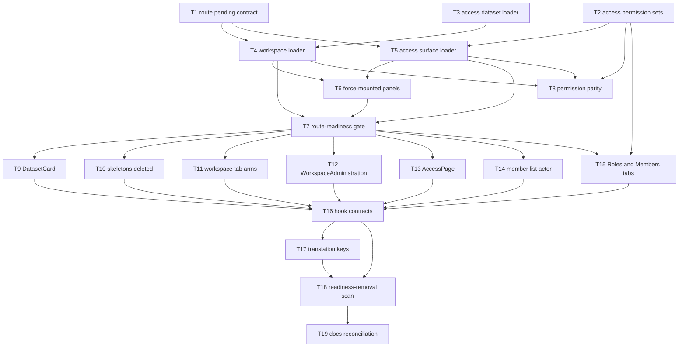

# Epic — change-request: global-loader

> **Change record:** [change.md](../change.md) · **Spec:** [spec.md](../spec.md) · **Design:** [sad.md](../sad.md) · **Test plan:** [test-plan.md](../test-plan.md) · **ADRs:** [adr/](../adr/)
>
> Size `L` · route `full` · `target_surfaces: ['web-frontend']`. No data model and no API contract:
> [`sad.md` §7](../sad.md#7-data-and-interface-impact) records no entity, column, index, migration or
> endpoint change, so `data-model`'s and `api`'s N/A conditions are met.

## Goal

Make **the route** the owner of destination readiness. Each of the four authenticated routes declares
the one shared `RoutePendingState` for its own await window, `workspaceRoute` and `accessRoute` gain
loaders that await every dataset the actor's admitted surfaces would fetch, and the seven
component-level waiting affordances, seven hook-contract readiness fields and six component-contract
readiness values are removed — so a destination paints complete or does not paint, and there is no
`isLoading` left to branch on ([spec.md §2](../spec.md#2-goals)).

## Scope

- **In:** the four authenticated route declarations; two new route loaders plus the access module's
  dataset contribution; removal of seven affordances, seven hook-contract fields, six component
  values, two dead branches and fourteen translation keys; one enumerated Permission widening
  (`useAccessPermissions`'s skip set); force-mounted admitted tab panels; and CH-01's nine
  `docs/system` reconciliation rows.
- **Out:** `apps/server`, `packages/contracts`, `packages/shared-types`, `packages/utils` — untouched.
  Tabs do not become routes; mutation and submit feedback is untouched (CR-RG-06); no Suspense
  migration; no new global state; authorization is unchanged apart from the one enumerated widening
  (CR-RG-07); error, empty and search-empty states are not redesigned (CR-RG-05).
  [spec.md §3](../spec.md#3-non-goals).

## Task map

The DAG follows [`change.md` §6](../change.md#6-rollout)'s rollout order, whose whole point is that
no commit leaves a window painted by neither model. **T7 is the phase gate:** every removal task
depends on it, because rollout step 3 may only remove component readiness once the routes
demonstrably cover the window.

**Parallel branches.** T1, T2 and T3 start together with no dependency between them. T8 runs beside
the whole removal phase. After T7 the seven removal tasks T9–T15 fan out in parallel — capped at
three concurrent by `max_parallel_agents` in `.ai/sdd.local.md`.

## Tasks

See [tracker.md](./tracker.md) for status. Machine contract: [tasks.json](../tasks.json).

| #   | Task                                                                                                     | Layer  | Blocked by | DoD (short)                                                                               |
| --- | -------------------------------------------------------------------------------------------------------- | ------ | ---------- | ----------------------------------------------------------------------------------------- |
| T1  | [Declare the pending and error contract on the three unpainted routes](./route-pending-contract.md)      | wiring | —          | Three routes carry sad §5.1's values; `cause === 'stay'` paints nothing; refusal in place |
| T2  | [Single-source the access Permission sets and apply the one widening](./access-permission-sets.md)       | ui     | —          | Three constants read by three hooks and the tab descriptor; catalogue set widens to six   |
| T3  | [Add the access module's Workspace-administration dataset loader](./access-workspace-datasets-loader.md) | ui     | —          | Three gated dispatches behind one surface entry; `module-boundaries.spec.ts` green        |
| T4  | [Add `loadWorkspaceAdministration` and give `workspaceRoute` its loader](./workspace-loader.md)          | ui     | T1, T3     | Primary awaited, five secondaries in one `allSettled` round under §5.5's gates            |
| T5  | [Add `loadAccessSurface` and give `accessRoute` its loader](./access-surface-loader.md)                  | ui     | T1, T2     | Zero requests on a refusal; two rounds, never three; same `getCurrentAccess` argument     |
| T6  | [Force-mount every admitted tab panel](./force-mount-tab-panels.md)                                      | ui     | T4, T5     | Unopened admitted tab's entry survives `keepUnusedDataFor`; panels stay inert             |
| T7  | [Pin route readiness across the four routes](./route-readiness-gate.md)                                  | tests  | T4, T5, T6 | Eight criteria green before any readiness is removed — the phase gate                     |
| T8  | [Pin loader and hook Permission parity in both directions](./loader-permission-parity.md)                | tests  | T2, T4, T5 | All ten CR-RG-02 rows fail on drift either way                                            |
| T9  | [Remove `DatasetCard`'s loading contract and update its three callers](./dataset-card-loading.md)        | ui     | T7         | No `loading`/`loadingLabel`, no `DatasetSkeleton`; `empty` is `items.length === 0`        |
| T10 | [Delete the two skeleton components and the Warehouses-side branches](./delete-skeletons.md)             | ui     | T7         | Both files gone; five boundary declarations name no deleted file or case                  |
| T11 | [Drop the four Workspace-administration tab readiness arms](./workspace-tab-readiness-arms.md)           | ui     | T7         | Four arms gone with no `?? []` default introduced                                         |
| T12 | [Give `WorkspaceAdministration` a route-scoped projection](./workspace-administration-context.md)        | ui     | T7         | Both dead branches gone; returns `ReactElement`; projection typed non-optional            |
| T13 | [Remove `AccessPage`'s loading branch, keeping its denial branch](./access-page-loading.md)              | ui     | T7         | No loading branch, no `Spinner`; denial branch unchanged and still reachable              |
| T14 | [Carry the unresolved actor in the type](./member-list-actor.md)                                         | ui     | T7         | `actorUserId` widened; destructive controls suppressed; sign-out window pinned            |
| T15 | [Collapse the `RolesTab` and `MembersTab` guards](./roles-members-tab-guards.md)                         | ui     | T2, T7     | Surviving condition is _not-permitted **or** errored_, never permission alone             |
| T16 | [Remove the seven readiness fields from the five hook contracts](./hook-contracts.md)                    | ui     | T9–T15     | Five contracts narrowed; `isError` and `currentData` survive; build type-checks           |
| T17 | [Remove the fourteen orphaned translation keys](./translation-keys.md)                                   | ui     | T16        | Seven keys per language absent; `en` and `uk` key sets identical                          |
| T18 | [Add the readiness-removal repository scan](./readiness-removal-scan.md)                                 | tests  | T16, T17   | Structural absence proven across every named file and the four route declarations         |
| T19 | [Reconcile the nine `docs/system` rows](./docs-reconciliation.md)                                        | docs   | T18        | All nine rows applied; `readiness-documentation` gate green                               |

**Total:** 19 tasks, ~16.5 person-days.

## Risks / Hard rules

Every row below is a constraint a task must not violate. Sources:
[`spec.md` §5.1](../spec.md#51-regression-boundaries), [`spec.md` §6](../spec.md#6-non-functional-requirements),
[`sad.md` §11](../sad.md#11-risks-and-open-questions), [`change.md` §6](../change.md#6-rollout).

- **Rollout order is a hard rule, not a preference.** T9–T15 must not start before T7 is green.
  Landing them earlier removes component readiness before the routes demonstrably cover the window
  — the one thing `change.md` §6 exists to prevent.
- **Three merge blockers**, named by `change.md` §6's abort threshold. If any cannot be pinned by a
  test the change aborts rather than ships: **CR-RG-01**'s sign-out row (T14 — CH-11 removes a
  _live_ guard, and this is the one override in the request that is unsafe if unproven),
  **CR-RG-02**'s parity rows (T8), **CR-RG-04**'s refusal row (T1, T7).
- **CR-AC-01's gate is red for the whole implementation, by design.** T19 reconciles `docs/system`
  at ship. `readiness-documentation.spec.ts` must not be weakened or skipped to buy an earlier green
  ([test-plan.md § Sequencing](../test-plan.md#sequencing)).
- **No telemetry** (`AGENTS.md`). §6's measurement is structural plus `/run`; no metric, span or
  counter is added by any task.
- **CR-RG-07 — no capability boolean.** No gate, descriptor or `PermissionGate` call site changes,
  and `PermissionsTab` in particular must not gain a Permission read it does not have today. T2's
  widening of `useAccessPermissions`'s skip set is the **only** Permission-condition change in the
  request.
- **CR-RG-05 — no `?? []` defaults.** Where a hook still returns `undefined` after CH-09, defaulting
  it would render `workspaceMembers.empty` as a false statement after a failed or evicted read. The
  guarantee is reachability (T2, T6), not a branch at every site.
- **`wrapInSuspense: false` beside a `pendingComponent` that never renders is deliberate** (T1).
  Deleting either line breaks a different criterion; both carry a comment naming it. See
  [ADR 0002](../adr/0002-one-pending-boundary-per-route-branch.md).
- **T6's expected fallout:** force-mounted panels put every admitted tab's content in the DOM at
  once, so specs querying by role and accessible name may now match across tabs. Scope queries to
  the panel; do not rename an accessible name to disambiguate.
- **`spec.md` is one revision behind.** [`sad.md` §11](../sad.md#amendments-this-sad-proposes-to-specmd)
  records two amendments decided with the owner and not yet applied — CR-AC-05's second sub-clause
  (T12) and CR-AC-16's scope (T1). Tasks implement the **amended** form, which is what `test-plan.md`
  tests. Apply both to `spec.md` §5 at the next spec touch.

## Decisions taken at this stage

Both open questions that [`sad.md` §11](../sad.md#open-questions) and
[`test-plan.md` § Open items](../test-plan.md#open-items) assigned to `tasks` are closed here:

1. **The UI-design gate does not apply.** Confirmed with the owner, per
   [`sad.md` §3](../sad.md#ui-design-gate): nothing is drawn that is not already approved —
   `RoutePendingState` is the existing landing affordance rendered at three more addresses, every
   surviving error/empty message is an already-approved frame (CR-RG-05), and everything else is
   removal. No `.pen` frame, no `design-ui` pass, no `design-handoff.md`. No task in this epic draws
   a new component.
2. **CH-01's reconciliation is a task on this branch** (T19), last in the DAG, so CR-AC-01 is covered
   by `tasks.json` and its documentation gate goes green with the branch's final commit rather than
   after merge.

Still open and **deliberately not** turned into a task — [`sad.md` §11](../sad.md#open-questions)
defers it because the workspace tab descriptors also carry translated labels, so the extraction is
not free: whether the workspace-side tab-descriptor Permissions should be extracted to a constant the
way T2 extracts the access sets. If it lands later, half of T8 retires. Owner: Tech Lead.
