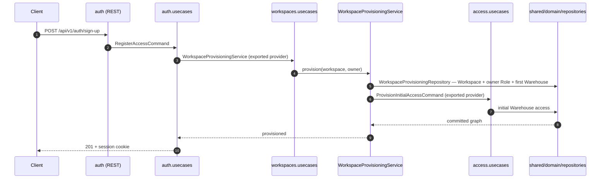

# Software Architecture Description — change-request: modules-level-refactor

## 1. Context and quality goals

### Current behavior

Code for a domain entity lands in the module of the entity that **contains** it. On the server,
`apps/server/src/` has four feature modules — `access`, `auth`, `users`, `workspaces` — and no
`warehouses`. `src/workspaces/` holds 79 files spanning three subjects: the Workspace record, the
Warehouse record (four lifecycle commands, `list-workspace-warehouses.query.ts`,
`WarehouseController`, `warehouse-mutation.dto.ts`) and the workspace scope of Access (eleven of
`WorkspaceController`'s fourteen handlers, seven role/member/owner commands, four list queries,
`workspace-authority.predicates.ts`, `workspace-role-deletion.service.ts`). `src/access/` is
warehouse-scoped exclusively. `workspaces/domain/errors/workspace.errors.ts` carries nineteen error
factories serving all three subjects from one file.

On the web, `modules/warehouse/` is a four-file stub (`route.tsx`, `page.tsx`,
`components/DesignSystemExample.tsx`, `hooks/useRecordWarehouseEntry.ts`). The Warehouse domain —
twelve administration components, `workspace-warehouses-api.ts`, six hooks,
`warehouse-name-form.schema.ts` and `WarehousesTab.spec.tsx` — lives under `modules/workspace/`,
which is 79 files. `modules/access/` is warehouse-scoped exclusively, while a near-duplicate
workspace-scoped implementation of the same capability sits in `modules/workspace/` down to its own
`MutationOutcome`, `useFormFieldErrors`, mutation adapter, feedback adapter and permission-label
hook.

Boundaries are enforced asymmetrically. The server has five static-source-scan specs
(`users/module-boundaries.spec.ts`, `workspaces/domain/module-boundaries.spec.ts`,
`workspaces/module-wiring.spec.ts`, `shared/domain/repositories/repository-boundaries.spec.ts`,
`tests/access/authorization-coverage.spec.mjs`), each holding path-valued literals that encode
today's layout. The web has none: its boundaries are prose in
[`frontend-architecture.md`](../../system/frontend-architecture.md), and `apps/web/eslint.config.mjs`
carries no `no-restricted-paths` or `no-restricted-imports` rule. No canonical document states which
module owns Warehouse or workspace-level Access; one document
([`placing-web-components.md`](../../system/guides/placing-web-components.md) §"When not to nest")
instructs the opposite of what this request approves.

### Target behavior

Every domain entity owns exactly one top-level module per application. `apps/server/src/warehouses/`
is created and owns the Warehouse record; `apps/server/src/access/` owns Access at both scopes;
`apps/server/src/workspaces/` retains the Workspace record and the member's position within it. On
the web, `modules/warehouse/` owns the Warehouse domain, `modules/access/` owns both Access scopes
and carries the views for both, and `modules/workspace/` retains the `/workspace` route, its
administration shell and Workspace naming — composing its four tabs from the two owning modules.

Cross-module reach is stated once and enforced by executable specs in both applications: a file may
reach into a module only through that module's declared public surface. On the server that surface
is the providers a module's `usecases/usecase.module.ts` exports plus its `index.ts` barrel,
extended by this request to make error factories, domain predicates and DTOs module-private. On the
web it is an enumerated per-module export list the boundary spec reads as data, binding sibling
modules and the composition layer alike — they differ in reach, not in exemption.

No user-observable behavior changes. Every HTTP method, path, guard, permission metadata, DTO,
response shape, permission, invariant, translated string value and rendered screen is identical
before and after.

### Quality goals, in priority order

1. **Behavior preservation is provable, not asserted.** A captured route table, an unchanged locale
   value set and a suite that goes green with zero changed _behavioral_ assertions are the evidence
   a reviewer approves a ~150-file diff on (CR-RG-01, CR-AC-11).
2. **Ownership is derivable from the entity name alone**, without reading surrounding code
   (CR-AC-01, CR-AC-02, CR-AC-05, CR-AC-06).
3. **The rule outlives this change.** It is written into three guides plus one system ADR and
   enforced by boundary specs, not review memory (CR-AC-10, CR-AC-12).
4. **The boundary rule has zero per-file exceptions.** A declared surface entry is the rule's input;
   an exception is an import permitted despite violating it, and this request admits none
   (CR-AC-04, spec.md §6).
5. **Every commit builds and passes on its own.** A module move has no dual-running state, so the
   unit of safety is the commit, not the branch (change.md §6).
6. **Build, test and bundle cost stay flat** — ≤110% of baseline wall-clock, no new eager chunk
   (spec.md §6).

## 2. Constraints inherited from `docs/system`

- The containers are fixed: `apps/web`, `apps/server`, `packages/{contracts,shared-types,utils}`
  ([architecture map](../../system/architecture-map.md)). This request moves code **within** two
  containers and changes no container boundary. `packages/contracts` export subpaths are untouched
  (CR-RG-03).
- The server stays a NestJS modular monolith of entity-related feature modules with inward-pointing
  dependencies, thin transport adapters, and command/query use cases
  ([server architecture](../../system/server-architecture.md)). `warehouses` is created under those
  exact rules; §"Source structure" already says "a module is named for the business entity or
  cohesive business capability it owns" — this request applies that sentence rather than inventing a
  rule.
- Modules communicate through exported use-case modules, explicit services or events, never another
  module's controller or persistence implementation
  ([server architecture](../../system/server-architecture.md) §"Dependency direction"). Circular
  imports are forbidden and `forwardRef()` may not conceal an ownership problem — the binding
  constraint on the new module graph (CR-AC-09).
- TypeORM persistence entities and specialized concrete repositories stay in `shared/domain/`;
  shared repositories must not know about feature modules
  ([server architecture](../../system/server-architecture.md) §"Domain",
  [PostgreSQL/TypeORM ADR](../../system/adr/21-07-2026-postgresql-with-typeorm.md)). All 13 entities
  and 17 repositories stay put and no migration is added (CR-RG-03, CR-RG-06).
- NestJS authentication/authorization guards live in `shared/guards/` and must not be placed inside
  feature modules ([server architecture](../../system/server-architecture.md) §"REST"). This is the
  system rule behind CR-RG-06's management-versus-enforcement split, and it is why `access` gaining
  both scopes does not pull a guard with it.
- REST request/response shapes are Zod schemas in `packages/contracts` adapted by thin `createZodDto`
  files in `rest/dtos/`
  ([contracts guide](../../system/guides/adding-and-using-contracts.md),
  [Zod ADR](../../system/adr/12-07-2026-schema-validation-with-zod.md)). Moving a DTO adapter between
  modules changes no network shape.
- Typed errors, named predicates and one global exception filter own failure mapping
  ([server error handling](../../system/guides/server-error-handling.md),
  [error-handling ADR](../../system/adr/24-07-2026-server-error-handling.md)). Error **codes** are
  the filter's input, so relocating a factory is invisible to HTTP as long as its code is unchanged.
- The web is organized by route-owned feature modules plus explicit platform infrastructure; logic
  stays in one module until another genuinely needs it, then is promoted to `shared/`
  ([frontend architecture](../../system/frontend-architecture.md) §"Source structure",
  [placing web components](../../system/guides/placing-web-components.md) §"When not to nest"). This
  request **keeps** the ancestor rule and uses it to place every multi-consumer file (§5.3); it
  amends only the clause that forces a cross-module _page-level view_ into `shared/components/`
  (CH-D3).
- Routes are registered manually in `src/router.ts`; RTK Query owns server state through one injected
  API slice; Redux Toolkit owns cross-module client state and guards read it through selectors
  ([frontend architecture](../../system/frontend-architecture.md),
  [RTK Query ADR](../../system/adr/02-08-2026-rtk-query-for-web-api-calls.md)). Unchanged — no slice,
  endpoint, tag or guard changes owner.
- Module copy lives in a module-named i18next namespace served from
  `public/locales/<language>/<namespace>.json`, and every configured language/namespace pair needs a
  matching file ([localization guide](../../system/guides/adding-and-maintaining-web-localization.md),
  [translations ADR](../../system/adr/27-07-2026-bundled-centralized-web-translations.md),
  [sad.md](../../system/sad.md) §"Known risks"). Adding the `warehouse` namespace is that rule
  applied, not an exception to it.
- Coding agents must not add telemetry, and structured Pino logs are the only diagnostic mechanism
  ([logging-instead-of-telemetry ADR](../../system/adr/03-08-2026-structured-logging-instead-of-telemetry.md)).
  The route-table gate (§5.4) is a build-time static analysis, not runtime instrumentation.
- `AGENTS.md` requires that adding a document under `docs/system` updates the corresponding index in
  the same change — so CH-D4 and CH-D5 are one commit, never two.

No deviation from `docs/system` is proposed. Two documents are **amended by this request** as
deliverables (CH-D3's narrowing, CH-D6's one pulled-forward sentence); until those land, §4.6 fixes
the ordering so no contributor ever reads two canonical documents that disagree.

## 3. Scope and target surfaces

`target_surfaces: ['web-frontend', 'backend-service']`

Both surfaces change source layout only. There is no `worker`, `cli` or `library-sdk` impact: BullMQ
handlers do not exist yet, no CLI exists, and `packages/*` are untouched. **The `web-frontend`
surface does not require the `design-ui` approval gate** — CR-RG-01 and CR-RG-04 make every rendered
screen and every translated value byte-identical, so there is no visual intent to approve. This is
recorded explicitly because `web-frontend` normally routes to `design-ui`.

### In scope

- Creating `apps/server/src/warehouses/` and moving the Warehouse record into it (CH-S1).
- Moving both scopes of Access into `apps/server/src/access/` (CH-S2, CH-S3).
- Trimming `apps/server/src/workspaces/` to the Workspace record and the member's position (CH-S4).
- Splitting `workspaces/domain/errors/` by the reachability-plus-ownership rule fixed in §5.4.
- Re-wiring the NestJS module graph and registering `WarehousesRestModule` (CH-S5).
- Updating five boundary specs and adding two server module boundary specs (CH-S6).
- Moving the Warehouse domain into `apps/web/src/modules/warehouse/` (CH-W1).
- Moving the workspace scope of Access into `apps/web/src/modules/access/` (CH-W2).
- Composing the administration shell across modules and placing the multi-consumer residue (CH-W3).
- Registering the `warehouse` i18n namespace and re-homing the moved copy blocks (CH-W4).
- Adding the web boundary spec and its surface declaration (CH-W5).
- Amending three guides, adding one system ADR, updating both indexes (CH-D1–CH-D5) and pulling one
  `frontend-architecture.md` sentence forward (CH-D6, partial).

### Out of scope

- Any product behavior change (spec.md §3, CR-RG-01).
- Changing URLs to match modules. `@Controller` prefixes stay byte-identical (spec.md §3, §4.5).
- Moving authorization enforcement into `access` — guards, principal shapes, denial errors and
  permission decorators stay in `shared/` (CR-RG-06).
- Moving anything out of the web composition layer, with one named addition to `src/test/setup.ts`
  (CR-RG-07).
- Moving `set-active-warehouse` out of `workspaces` (CH-S4).
- Folding `src/users/` into `access`; renaming modules for singular/plural symmetry; moving
  `packages/contracts` subpaths (§3.1).
- Adding an import-boundary ESLint plugin (spec.md §3).
- Merging the two mutation/feedback adapters into one runner (§5.3, §11 R4).

### Open questions closed here

| change.md | Question                                                                                                       | Resolution                                                                                                                                                                                                                                                                                                                                                                                                                                                                                             |
| --------- | -------------------------------------------------------------------------------------------------------------- | ------------------------------------------------------------------------------------------------------------------------------------------------------------------------------------------------------------------------------------------------------------------------------------------------------------------------------------------------------------------------------------------------------------------------------------------------------------------------------------------------------ |
| §9.1      | Where do the multi-consumer web helpers land, and what happens to `modules/access`'s pre-existing near-copies? | §5.3. The stated default is **overridden on evidence**: `runWorkspaceMutation`, `alertWorkspaceAction` and `MutationOutcome` each have consumers in all three destination modules, so parking them in `modules/access` would create the `modules/warehouse` → `modules/access` imports CR-AC-04 forbids. All five go to `shared/`. `access`'s near-copies of `useFormFieldErrors` and `MutationOutcome` collapse onto the shared supersets; its mutation/feedback adapters are single-module and stay. |
| §9.2      | Does `src/users/` fold into `access`?                                                                          | No. Default confirmed — not requested, has a shipped deliberate boundary, and would triple the server surface. CH-S6 instead _tightens_ the `users` boundary by adding `warehouses/` and `workspaces/` to its forbidden-import list.                                                                                                                                                                                                                                                                   |
| §9.3      | Singular or plural module names?                                                                               | Leave both conventions. Web stays singular (`modules/warehouse`), server stays plural (`src/warehouses`). Each is internally consistent; renaming for symmetry adds churn to an already large diff for no navigational gain. Stated as a convention in CH-D4.                                                                                                                                                                                                                                          |
| §9.4      | Do `packages/contracts` subpaths follow the modules?                                                           | No. A contracts subpath is a published export; moving it is a separate breaking change and would violate CR-RG-03. Warehouse schemas stay at `@warehouser/contracts/workspaces`.                                                                                                                                                                                                                                                                                                                       |
| §9.5      | What exactly is each web module's declared public surface?                                                     | §5.2 and [ADR 0001](./adr/0001-enumerated-web-module-surface-declaration.md). The change.md default listed three composition-layer targets; the real import graph has **six more** (every module's `route`, plus `modules/auth/store/auth.slice`), all of which are declared.                                                                                                                                                                                                                          |
| §9.6      | How is the route table captured for CR-AC-11?                                                                  | §5.4. A committed static extractor under `tests/`, mirroring `authorization-coverage-classifier.mjs`, plus a committed baseline and a `node:test` spec that diffs against it.                                                                                                                                                                                                                                                                                                                          |

## 4. Solution strategy

### 4.1 One rule, two enforcement mechanisms

The ownership rule is a single sentence — _code lives in the module of the entity whose invariants it
enforces, and reaches other modules only through their declared surface_ — but the two applications
already enforce boundaries differently, and this request does **not** unify the mechanism. The server
keeps its static-source-scan Jest specs (`readdirSync`/`readFileSync` + regex, the pattern
`users/module-boundaries.spec.ts` established) and its NestJS module-export boundary. The web gets a
spec in that same style reading an enumerated declaration. Introducing a third mechanism (an ESLint
boundary plugin, a dependency-graph tool) is explicitly out of scope: spec.md §3 rules it out, and
the existing pattern already fails loudly with a file name and a rule.

### 4.2 The move is decomposed by module, never by layer

Each commit moves one module's worth of code **and** updates the boundary specs it invalidates, so
every commit compiles and passes alone. The alternative — move all files, then fix all specs — has no
green intermediate state and makes bisecting a behavior regression impossible. This is why CH-S6 and
CH-W5 are distributed across the five server and five web commits rather than trailing them.

### 4.3 Structural and behavioral assertions are separated before the first move

Every test assertion in the affected suites is classified once, up front, into _behavioral_ (what the
system does — may not change) and _structural_ (a file path, an import specifier, a handler
inventory, a `readFileSync` target, a path-valued exemption key — changes by definition). That
classification is the artifact `plan-tests` produces, and it is what makes the §6 abort threshold
mechanical rather than a judgement call at review time. Without it, "the suite is green" and "the
suite was made green" are indistinguishable.

### 4.4 Multi-consumer files are placed by the rule that already exists

Nothing new is invented for the six web files two or three modules share. `placing-web-components.md`
already says a file with more than one consumer moves to the shared ancestor, and
`frontend-architecture.md` §"Source structure" already says to promote to `shared/` once reuse
exists. §5.3 applies that rule to the post-move consumer graph rather than the pre-move one — which
is the whole reason §9.1's stated default inverts.

### 4.5 Source layout and URL layout are deliberately decoupled

Controllers change module while their `@Controller` prefixes stay byte-identical, so after the move
two prefixes are each served by two controllers: `api/v1/workspace` (`workspaces`
`WorkspaceController` + `access` `WorkspaceAccessController`) and `api/v1/workspace/warehouses`
(`warehouses` `WarehouseController` + `access` `WarehouseAccessController`). NestJS supports this
because no two handlers claim the same method+path, and CR-AC-11 asserts no path is shadowed or
unreachable. Renaming URLs in the same change would convert a behavior-preserving refactor into a
breaking API change and make a refactor bug indistinguishable from an intended one.

### 4.6 Documentation lands before the code it governs

CH-D3 (the `placing-web-components.md` narrowing), CH-D4 (the ADR), the two guide extensions and the
one `frontend-architecture.md` sentence CH-D6 pulls forward are written in step 4, **before any file
moves**. Two of them currently instruct the opposite of what this request approves, and CR-US-03
promises a contributor that no two canonical documents disagree _at any point during the rollout_.
Writing them last would document whatever the refactor happened to produce.

### 4.7 Flatness is a property of module identity, not of directory depth

`modules/auth/` already contains `login/`, `sign-up/` and `sign-out/` sub-trees, each with its own
`route.tsx`, `page.tsx`, `components/` and `schemas/`. A naive "a directory holding `route.tsx` is a
module" test would fail `auth` on day one and turn CR-AC-04 into an allowlist immediately. So the
rule is stated on identity: **the module list is exactly the directories directly under `modules/`;
only those have a name, a public surface and an entry in the surface declaration.** A module may
organize routes of _its own entity_ into sub-directories. What flatness forbids is a _second domain
entity_ acquiring a home inside another module's tree — precisely today's
`modules/workspace/components/workspace-administration/warehouses/`. That distinction is not
statically decidable, which CR-AC-12 already concedes: the mechanical checks are the surface
declaration, the import graph and the `modules/workspace` file manifest; _whose invariants does this
file enforce?_ stays a human review test that the manifest forces someone to answer.

## 5. Building blocks and ownership

### 5.1 Server modules after the move

| Module                 | Owns                                                                                                                                                                                                                                                                                                                                                                                                     | Public surface                                                 | Imports                                                                                                  |
| ---------------------- | -------------------------------------------------------------------------------------------------------------------------------------------------------------------------------------------------------------------------------------------------------------------------------------------------------------------------------------------------------------------------------------------------------- | -------------------------------------------------------------- | -------------------------------------------------------------------------------------------------------- |
| `warehouses` (**new**) | Warehouse record: `create`/`rename`/`archive`/`restore-warehouse.command.ts`, `list-workspace-warehouses.query.ts`, `WarehouseController` (`GET`, `POST`, `PATCH :warehouseId`, `PUT :warehouseId/archival`), `warehouse-mutation.dto.ts`, `domain/errors/warehouse.errors.ts`                                                                                                                           | `index.ts` → `WarehousesUsecaseModule`, `WarehousesRestModule` | `AccessUsecaseModule` (`CreateWarehouseCommand` needs `ProvisionInitialAccessCommand`), `shared/*`       |
| `access`               | Access at both scopes: existing warehouse-scoped commands/queries + workspace role CRUD, workspace membership, owner transfer, the four workspace list queries, `workspace-authority.predicates.ts`, `workspace-role-deletion.service.ts`, warehouse-membership assign/revoke and assignable-roles, `WorkspaceAccessController`, `WarehouseAccessController`, `domain/errors/workspace-access.errors.ts` | `index.ts` → `AccessUsecaseModule`, `AccessRestModule`         | `shared/*` only — **stays the leaf of the feature graph** (CR-AC-09)                                     |
| `workspaces`           | Workspace record and the member's position: `rename-workspace.command.ts`, `read-workspace-context.query.ts`, `set-active-warehouse.command.ts`, `WorkspaceController` (`GET context`, `PUT active-warehouse`, `PATCH`), the workspace half of `workspace-mutation.dto.ts`, `workspace-provisioning.service.ts`                                                                                          | `index.ts` → `WorkspacesUsecaseModule`, `WorkspacesRestModule` | `AccessUsecaseModule` (`WorkspaceProvisioningService` needs `ProvisionInitialAccessCommand`), `shared/*` |
| `users`                | unchanged — warehouse-scoped member lifecycle                                                                                                                                                                                                                                                                                                                                                            | unchanged                                                      | unchanged; boundary **tightened** to forbid `warehouses/` and `workspaces/` too                          |
| `auth`                 | unchanged                                                                                                                                                                                                                                                                                                                                                                                                | unchanged                                                      | `WorkspacesUsecaseModule` (registration bootstrap)                                                       |

**Corrected dependency graph.** change.md CH-S5 predicts `workspaces.usecases → access.usecases +
warehouses.usecases`. The call graph does not support the second edge: `WorkspaceProvisioningService`
imports only `ProvisionInitialAccessCommand` and `WorkspaceProvisioningRepository`, and
`read-workspace-context.query.ts` reads through `WorkspaceReadRepository` — no retained `workspaces`
use case invokes a `warehouses` use case. The target graph is therefore narrower than predicted:

```text
auth.usecases ──▶ workspaces.usecases ──▶ access.usecases
                                              ▲
warehouses.usecases ──────────────────────────┘
```

Acyclic, three edges, no `forwardRef()`. `usecase.module.di.spec.ts` and the `warehouses` equivalent
verify it statically (CR-AC-09). If implementation discovers a fourth edge, that is a finding to
record, not a licence to add `forwardRef`.

**Guard registration.** `WorkspacesRestModule` registers `WorkspaceAccessGuard` today so Nest can
construct it for that module's routes. `AccessRestModule` currently registers only
`WarehouseAccessGuard`; because `WorkspaceAccessController` and `WarehouseAccessController` are
guarded by `WorkspaceAccessGuard`, `AccessRestModule` must register **both**. Registering a guard is
not owning it — the classes stay in `shared/guards/` (CR-RG-06).

**Test harness.** `warehouse-http-contract.harness.ts` moves from
`workspaces/rest/controllers/` to `apps/server/src/test/harnesses/` (a new directory under the
`src/test/` reserved for reusable test support), because `warehouses` and `access` both consume it
and neither may import the other (CR-AC-05).

### 5.2 Web modules after the move

| Module      | Owns                                                                                                                                                                                                                                                                                                                                                                                                                        | Declared public surface                                                                                                            |
| ----------- | --------------------------------------------------------------------------------------------------------------------------------------------------------------------------------------------------------------------------------------------------------------------------------------------------------------------------------------------------------------------------------------------------------------------------- | ---------------------------------------------------------------------------------------------------------------------------------- |
| `warehouse` | Warehouse domain: the 12 administration components + `WarehousesTab.spec.tsx`, `api/warehouse-api.ts` (from `workspace-warehouses-api.ts`), `useCreateWarehouse`, `useRenameWarehouse`, `useSetWarehouseArchival`, `useAssignWarehouseMembership`, `useRevokeWarehouseMembership`, `warehouse-name-validation`, `schemas/warehouse-name-form.schema.ts`, the warehouse half of `name-validation.spec.ts`, plus today's stub | `route`, `components/.../WarehousesTab`, `hooks/useRecordWarehouseEntry`                                                           |
| `access`    | Access at both scopes: the existing `AccessWorkspace` tree + `members/`, `roles/`, `permissions/` component trees (26 files), `workspace-members-api.ts`, `workspace-roles-api.ts`, thirteen workspace hooks, `useWorkspacePermissionLabel`, `workspace-permission-groups`, `workspace-role-name-validation`, `schemas/workspace-role-form.schema.ts`, the workspace-role half of `name-validation.spec.ts`                 | `route`, `components/.../WorkspaceRolesTab`, `.../WorkspaceMembersTab`, `.../WorkspacePermissionsTab`                              |
| `workspace` | `/workspace` route, `page.tsx`, `WorkspaceAdministration.tsx` + its 511-line spec, `NameWorkspaceAction.tsx`, `NameWorkspaceDialog.tsx`, `schemas/name-workspace-form.schema.ts`, `useRenameWorkspace`                                                                                                                                                                                                                      | `route`                                                                                                                            |
| `auth`      | unchanged                                                                                                                                                                                                                                                                                                                                                                                                                   | `login/route`, `sign-up/route`, `session/session`, `sign-out/components/SignOutButton`, `store/auth.selectors`, `store/auth.slice` |
| `home`      | unchanged                                                                                                                                                                                                                                                                                                                                                                                                                   | `route`                                                                                                                            |

**The declared surface is larger than change.md predicted.** change.md §2.1 names three
composition-layer imports of module internals. The actual production import graph has nine:

| Importer                                                   | Target                                                                                              | Why it is declared surface                                                                                                                                                                  |
| ---------------------------------------------------------- | --------------------------------------------------------------------------------------------------- | ------------------------------------------------------------------------------------------------------------------------------------------------------------------------------------------- |
| `router.ts`                                                | `modules/{home,warehouse,workspace,access}/route`, `modules/auth/{login,sign-up}/route`             | Manual route registration is the documented pattern ([frontend architecture](../../system/frontend-architecture.md) §"Runtime foundation"); a route object is a module's most public export |
| `store/index.ts`                                           | `modules/auth/store/auth.slice`                                                                     | `store/index.ts` is the composition root that registers feature reducers ([adding a web module](../../system/guides/adding-a-web-module.md) §6)                                             |
| `test/{access,workspace}-fixtures.ts`                      | `modules/auth/store/auth.slice`                                                                     | Test fixtures dispatch the real action creator rather than hand-building state                                                                                                              |
| `guards/{auth,anonymous-user}.guard.ts`                    | `modules/auth/store/auth.selectors`, `modules/auth/session/session`                                 | Guards read the live store through selectors, never `state.auth` directly                                                                                                                   |
| `shared/layouts/RootLayout.tsx`                            | `modules/auth/sign-out/components/SignOutButton`                                                    | change.md §2.2                                                                                                                                                                              |
| `shared/layouts/WarehouseLayout.tsx`                       | `modules/warehouse/hooks/useRecordWarehouseEntry`                                                   | change.md §2.2                                                                                                                                                                              |
| `modules/{access,workspace}/…` (3 sites)                   | `modules/auth/store/auth.selectors`                                                                 | The only module→module imports today                                                                                                                                                        |
| `modules/workspace/components/WorkspaceAdministration.tsx` | `modules/warehouse/.../WarehousesTab`, `modules/access/.../Workspace{Roles,Members,Permissions}Tab` | **New** — the cross-module view import CH-W3 legalizes and CH-D3 unblocks                                                                                                                   |

Every one resolves to a declared entry. The rule still passes with an **empty exception list**
(CR-AC-04): declaring `route` and `store/` as surface is the rule's input, not an allowlist of
violations. The declaration lives at `apps/web/src/test/module-surface.ts` and the spec at
`apps/web/src/modules/module-boundaries.spec.ts` — mirroring the server's colocated
`module-boundaries.spec.ts` naming, with the data in `src/test/` where
[frontend architecture](../../system/frontend-architecture.md) §"Testing" puts cross-cutting test
support. See [ADR 0001](./adr/0001-enumerated-web-module-surface-declaration.md).

### 5.3 Web multi-consumer residue — disposition (closes change.md §9.1)

Consumer counts below are **post-move** destination modules, computed from the current import graph.

| File                                                                                | Post-move consumers                                                                                                                                       | Destination                                           | Rationale                                                                                                                                                                                                                                                                                                                                                                                                      |
| ----------------------------------------------------------------------------------- | --------------------------------------------------------------------------------------------------------------------------------------------------------- | ----------------------------------------------------- | -------------------------------------------------------------------------------------------------------------------------------------------------------------------------------------------------------------------------------------------------------------------------------------------------------------------------------------------------------------------------------------------------------------- |
| `modules/workspace/hooks/useFormFieldErrors.ts`                                     | `workspace` (NameWorkspaceDialog), `access` (CreateWorkspaceRoleDialog, WorkspaceRoleEditor), `warehouse` (AddWarehouseDialog, WarehouseNameForm) — **3** | `shared/hooks/useFormFieldErrors.ts`                  | Ancestor rule. **Merged with `modules/access/hooks/useFormFieldErrors.ts`**: the access copy is a strict superset (adds `FieldErrorCodes` + `setFieldErrors`) whose `setFieldError` body is byte-identical to the workspace copy — only doc comments differ. The shared file is the access superset; both module copies are deleted. Zero behavioral assertion changes.                                        |
| `modules/workspace/hooks/useReturnFocusOnClose.ts`                                  | `access` (5 action components), `warehouse` (`WarehouseLifecycleActions`) — **2**                                                                         | `shared/hooks/useReturnFocusOnClose.ts`               | Ancestor rule. Only one copy exists; nothing to merge.                                                                                                                                                                                                                                                                                                                                                         |
| `MutationOutcome` in `modules/workspace/types/workspace.types.ts`                   | all **3**                                                                                                                                                 | `shared/api/mutation-outcome.ts`                      | Ancestor rule. **Merged with `modules/access/types/access.types.ts`'s copy**: the workspace version is a superset by one optional `code?: string`; widening access outcomes with an optional field is type-compatible and unobserved. Placed beside the runner that returns it rather than creating a new `shared/types/` directory. `access.types.ts` retains `AccessMember`/`AccessPermission`/`AccessRole`. |
| `modules/workspace/api/workspace-mutation.ts`                                       | all **3**                                                                                                                                                 | `shared/api/workspace-mutation.ts`                    | **Overrides change.md §9.1's default.** `runWorkspaceMutation` is called by five warehouse hooks, seven access hooks and one workspace hook. Placing it in `modules/access` would make `modules/warehouse` import an `access` module file — exactly what CR-AC-04 forbids and what §9.5 already used to send `workspace-users-api.ts` to `shared/api/`.                                                        |
| `modules/workspace/alerts/workspace-feedback.ts`                                    | all **3**                                                                                                                                                 | `shared/alerts/workspace-feedback.ts`                 | Same. Its `WorkspaceSuccessAction` union literally spans all three destinations (`createWarehouse`, `createWorkspaceRole`, `renameWorkspace`). `shared/alerts/` is documented as "presentation behavior that applies across feature modules" — which this now is.                                                                                                                                              |
| `modules/workspace/api/workspace-users-api.ts`                                      | `access` (1), `warehouse` (3) — **2**                                                                                                                     | `shared/api/workspace-users-api.ts`                   | Already settled in change.md §9.5; recorded here for completeness.                                                                                                                                                                                                                                                                                                                                             |
| `modules/workspace/hooks/useWorkspacePermissionLabel.ts`                            | `access` only (`WorkspacePermissionsTab`, `WorkspacePermissionCheckbox`) — **1**                                                                          | `modules/access/hooks/useWorkspacePermissionLabel.ts` | Single destination — it is not shared. Lives beside `usePermissionLabel.ts` as the scope-named second file §2.1 sanctions.                                                                                                                                                                                                                                                                                     |
| `modules/access/api/access-mutation.ts`, `modules/access/alerts/access-feedback.ts` | `access` only                                                                                                                                             | stay in `modules/access`                              | Single-module consumers; not shared functionality. **Not merged** with the workspace runners — see §11 R4.                                                                                                                                                                                                                                                                                                     |

**Symbol and i18n-key names are not changed by the move.** `runWorkspaceMutation`,
`alertWorkspaceAction` and `WorkspaceSuccessAction` keep their names, and `alertWorkspaceAction`
keeps reading ``i18n.t(`workspace.${action}`, { ns: 'pending' | 'success' })``. The `workspace.`
prefix is a live key path into the `pending` and `success` namespaces; renaming it would change which
key is read and breach CR-RG-04. A rename for readability is a separate, later change.

### 5.4 Error module split (closes change.md §6 step 2)

The split rule as CR-AC-06 states it is pure reachability. Applying it to the real call graph leaves
one factory misplaced: `workspaceWarehouseArchivedError` enforces a **Warehouse** invariant but its
only caller is `set-active-warehouse.command.ts`, which stays in `workspaces` — so reachability sends
a Warehouse rule into the Workspace module. The rule is therefore **extended by one clause**:

> A member of `workspaces/domain/errors/` follows the destination module that is its only reachable
> consumer. It is promoted to `shared/errors/` when it is reachable from two or more destination
> modules, **or** when the entity whose invariant it names and its only consumer resolve to different
> modules.

The second clause is a deviation from CR-AC-06's literal wording and requires a spec amendment
(§11 O1). The alternative — moving it to `warehouses` — would make `workspaces` deep-import
`warehouses/domain/errors`, which CR-AC-08 and the §6 abort threshold forbid.

| Destination                                                | Members                                                                                                                                                                                                                                                                                                                                                                                                                                                                                                                                       | Only-consumer evidence                                                                                                             |
| ---------------------------------------------------------- | --------------------------------------------------------------------------------------------------------------------------------------------------------------------------------------------------------------------------------------------------------------------------------------------------------------------------------------------------------------------------------------------------------------------------------------------------------------------------------------------------------------------------------------------- | ---------------------------------------------------------------------------------------------------------------------------------- |
| `warehouses/domain/errors/warehouse.errors.ts` (**3**)     | `workspaceLastUnarchivedWarehouseError`, `workspaceWarehouseCreationUnavailableError`, `workspaceArchivalUnavailableError`                                                                                                                                                                                                                                                                                                                                                                                                                    | `archive-warehouse`; `create-warehouse`; `archive`+`restore-warehouse`                                                             |
| `access/domain/errors/workspace-access.errors.ts` (**14**) | `workspaceProtectedRoleError`, `workspaceSystemManagedPermissionError`, `workspaceRoleNameConflictError`, `workspaceReplacementRoleRequiredError`, `workspaceOwnerTransferRequiredError`, `workspaceSelfActionDeniedError`, `workspaceManagerTransferRequiredError`, `workspaceMembershipExistsError`, `workspaceRoleAssignmentRequiredError`, `workspaceMemberExistsError`, `workspaceWarehouseMembershipRequiredError`, `workspaceConcurrentChangeError`, `workspaceRoleDeletionUnavailableError`, `workspaceOwnerTransferUnavailableError` | every caller is a role/member/owner-transfer/warehouse-membership use case or `workspace-role-deletion.service.ts`, all → `access` |
| `shared/errors/cross-module.errors.ts` (**2**)             | `workspaceTargetUnavailableError`, `workspaceWarehouseArchivedError`                                                                                                                                                                                                                                                                                                                                                                                                                                                                          | 17 call sites across all three destinations; and the ownership clause above                                                        |
| `shared/errors/unavailable-outcome.ts` (**1 helper**)      | `withUnavailableOutcome`                                                                                                                                                                                                                                                                                                                                                                                                                                                                                                                      | `create`/`archive`/`restore-warehouse` → `warehouses`; `delete-workspace-role`/`transfer-workspace-owner` → `access`               |

19 factories + 1 helper, fully assigned. **`workspaces/domain/errors/` is left empty and is deleted
outright** — no re-export shim, because a shim is the deep import the rule exists to prevent
(CR-AC-07). `workspace.errors.spec.ts` splits three ways alongside its subjects. Every **error code**
is unchanged, so `shared/errors/global-http-exception.filter.ts`'s mapping tables are untouched.
Factory **symbol names** are unchanged too (CR-AC-05 names them in their new home), even where the
`workspace*` prefix now reads oddly in `warehouses` — renaming 19 exported symbols across ~40 call
sites would add churn and a rename-typo class of failure to a diff whose entire claim is that nothing
changed.

### 5.5 Route-table identity gate (closes change.md §9.6)

CR-AC-11 needs a route table captured at `baseline_revision` and again after the last server move.
The repository has no `@nestjs/swagger` and no route-listing code, and a runtime capture would need
the application to bootstrap, which needs a database the unit tier does not have. The existing
release-gate precedent is static: `tests/access/authorization-coverage-classifier.mjs` parses
controller **source** with `globSync` + regex and never loads Nest.

**Added:** `tests/refactor/route-table.mjs` (extractor), `tests/refactor/route-table.baseline.json`
(committed capture at `baseline_revision`) and `tests/refactor/route-table.spec.mjs` (a `node:test`
spec asserting current == baseline). The `.spec.mjs` suffix is load-bearing: the root `test` script is
`node --test tests/**/*.spec.mjs && turbo run test`, so the gate runs with the existing release gates
and needs no new script. The extractor emits, sorted:

```text
METHOD  full path (@Controller prefix + handler path)  guard classes  permission decorator + argument  DTO class
```

Request/response **schemas** are TypeScript types erased at runtime and cannot be captured this way;
they are covered instead by the existing `*-http-contract.integration.spec.ts` suites, which assert
real payloads (CR-AC-11's third clause). The gate is kept permanently after ship, not deleted:
regenerating the baseline becomes a deliberate, reviewable act whenever a route legitimately changes.

### 5.6 Retained unchanged

- All 13 TypeORM entities in `shared/domain/entities/` and all 17 repositories in
  `shared/domain/repositories/`; the eight files under `apps/server/migrations/` (CR-RG-03).
- `shared/guards/`, `shared/access/`, `shared/decorators/`, `shared/domain/security/` — every guard,
  principal shape, denial error and permission decorator (CR-RG-06).
- `access.controller.ts` and `users.controller.ts` and their routes.
- The entire web composition layer: `shared/layouts/{WarehouseSwitcher,WarehouseLayout,Sidebar,RootLayout}.tsx`,
  `shared/api/{warehouse-path,access-permissions-api,workspace-context-api}.ts`,
  `shared/hooks/{useEnteredWarehouse,useEnteredContext,usePermissions,useWorkspacePermissions}.ts`,
  `shared/components/{WarehouseEntryRefusal,RetainedContextMessage,PermissionGate,WorkspaceGate}.tsx`,
  `guards/warehouse-entry.guard.ts`, `router.ts`, `store/` (CR-RG-07). Content changes only where an
  import specifier names a moved file — with one named exception, `src/test/setup.ts` (§7.3).
- `packages/contracts` export subpaths `./access`, `./auth`, `./users`, `./workspaces` (CR-RG-03).
- The `no-restricted-syntax` `effectiveWarehouseId` configuration in `apps/web/eslint.config.mjs`,
  including all six `ignores` entries — none of the three production paths moves (CR-RG-05).

## 6. Runtime view

A behavior-preserving refactor adds no runtime flow. The diagrams below record the three flows whose
**participants change module**, which is what a reviewer needs to confirm the graph is still acyclic
and the wire is still identical.

### 6.1 Registration provisioning across three modules (CR-AC-07, CR-RG-01)



Every hop crosses a module boundary through an **exported use-case module provider**, never a deep
file path (CR-AC-08). The order Workspace → owner Role → first Warehouse → initial access is
unchanged; only `Prov`'s file path changes. `register-access.integration.spec.ts` passes with import
specifier changes only.

### 6.2 One prefix, two controllers (CR-AC-11, CR-RG-02)

```mermaid
sequenceDiagram
    autonumber
    participant Client
    participant Nest as Nest router
    participant WsCtl as workspaces WorkspaceController
    participant AccCtl as access WorkspaceAccessController
    participant Guards as shared/guards
    participant UC as owning use case

    Note over Nest: prefix api/v1/workspace is claimed by two controllers;<br/>no two handlers claim the same method+path
    Client->>Nest: GET /api/v1/workspace/context
    Nest->>WsCtl: readContext
    WsCtl->>Guards: SessionAuthGuard
    Guards-->>WsCtl: principal
    WsCtl->>UC: ReadWorkspaceContextQuery (workspaces)
    UC-->>Client: 200 context

    Client->>Nest: POST /api/v1/workspace/roles
    Nest->>AccCtl: createRole
    AccCtl->>Guards: SessionAuthGuard + WorkspaceAccessGuard<br/>@RequiredWorkspacePermission(ROLES_MANAGE)
    Guards-->>AccCtl: workspace principal
    AccCtl->>UC: CreateWorkspaceRoleCommand (access)
    UC-->>Client: 201 role
```

Both handlers keep their exact method, path, guard set, permission metadata, DTO and response shape;
only the class and module that declare them change. The same shape holds for
`api/v1/workspace/warehouses`, served by `warehouses` `WarehouseController` (4 record handlers) and
`access` `WarehouseAccessController` (3 membership handlers).

### 6.3 Cross-module tab composition on the web (CR-AC-03, CR-AC-04)

```mermaid
sequenceDiagram
    autonumber
    participant Router as router.ts
    participant WsRoute as modules/workspace/route
    participant Shell as WorkspaceAdministration
    participant WhTab as modules/warehouse WarehousesTab
    participant AccTab as modules/access Workspace*Tab
    participant Perms as shared/hooks/useWorkspacePermissions

    Router->>WsRoute: registered route (declared surface)
    WsRoute->>Shell: lazy page component
    Shell->>Perms: hasWorkspacePermission(...) per tab
    Perms-->>Shell: admitted tab set
    Shell->>WhTab: render (declared surface of warehouse)
    Shell->>AccTab: render x3 (declared surface of access)
    Note over Shell,AccTab: tab set, order and gating predicates unchanged;<br/>only the import specifiers move
```

The shell imports four page-level views across module boundaries — legal because each is a declared
surface entry, and unblocked because CH-D3 lands first (§4.6).

## 7. Data and interface impact

### 7.1 Persistence

**None.** No migration is added, altered or run; no column, index, constraint or semantic changes;
runtime schema synchronization stays disabled. All 13 entities and 17 repositories keep their
location and content apart from import specifiers naming a moved file (CR-RG-03, CR-RG-06).

### 7.2 HTTP interface

|                                                                | Before                              | After                                                                                                        |
| -------------------------------------------------------------- | ----------------------------------- | ------------------------------------------------------------------------------------------------------------ |
| Handlers                                                       | 21 across 2 controllers in 1 module | 21 across 4 controllers in 3 modules                                                                         |
| Stay in place                                                  | —                                   | 3 (`GET context`, `PUT active-warehouse`, `PATCH`)                                                           |
| Change module only                                             | —                                   | 4 (warehouse-record handlers, with their controller)                                                         |
| Change module **and** controller class                         | —                                   | 14 (11 workspace-access → `WorkspaceAccessController`, 3 warehouse-membership → `WarehouseAccessController`) |
| Method, path, guards, permission metadata, DTO, response shape | —                                   | **identical** — asserted by §5.5's captured table                                                            |

`packages/contracts` is untouched, so nothing outside this repository observes the change. No event
exists in the system to change.

### 7.3 Localization interface

| Namespace                               | Change                                                                                                                                                                                                                                                                                                                                                                            |
| --------------------------------------- | --------------------------------------------------------------------------------------------------------------------------------------------------------------------------------------------------------------------------------------------------------------------------------------------------------------------------------------------------------------------------------- |
| `warehouse.json` (**new**, `en` + `uk`) | Carries today's `workspace.json#warehouses` block verbatim, **still nested under a `warehouses` key** — not hoisted — so every `t('warehouses.…')` key path is byte-identical and only the namespace argument moves                                                                                                                                                               |
| `access.json`                           | Gains `workspaceRoles`, `workspaceMembers`, `workspacePermissions` parents carrying today's `workspace.json` `workspaceRoles`/`members`/`permissions` blocks at identical values. Scope-naming is forced: `access.json` already holds top-level `roles`, `members`, `permissions` for the warehouse scope, so merging under the incoming names would overwrite one scope outright |
| `workspace.json`                        | Retains `loading`, `placeholder`, `nameWorkspace`, `states`, and deliberately `tabs.*` and `descriptions.*` — the shell's own copy, read through the computed key ``t(`descriptions.${openSection}`)`` from a file that stays in `modules/workspace`                                                                                                                              |
| `pending.json`, `success.json`          | **Unchanged.** `alertWorkspaceAction` moves to `shared/alerts/` but keeps reading the `workspace.` key prefix (§5.3)                                                                                                                                                                                                                                                              |

`src/i18n.ts` registers `warehouse` in `namespaces`. `src/test/setup.ts` hard-codes one static import
and one path→module map entry per namespace, so it gains a `warehouse` entry in both languages — the
one named carve-out CR-RG-07 permits, without which no moved component's spec can resolve a string.
Every namespace change lands in `en` and `uk` together; no key exists in one language and not the
other (CR-RG-04).

### 7.4 Boundary-spec interface

| Spec                                                                                 | Change                                                                                                                                                                                                                                                                                             |
| ------------------------------------------------------------------------------------ | -------------------------------------------------------------------------------------------------------------------------------------------------------------------------------------------------------------------------------------------------------------------------------------------------- |
| `users/module-boundaries.spec.ts`                                                    | Forbidden list extended from `access/`, `auth/` to also include `warehouses/`, `workspaces/` — a genuinely **new** constraint (CR-AC-08)                                                                                                                                                           |
| `workspaces/domain/module-boundaries.spec.ts`                                        | Rule intact (no NestJS/HTTP/TypeORM in `domain/`, no `access/domain/` internals); scanned directory shrinks with the module                                                                                                                                                                        |
| `workspaces/module-wiring.spec.ts`                                                   | Controller inventory becomes `[WorkspaceController]`; joined by a `warehouses` equivalent                                                                                                                                                                                                          |
| `shared/domain/repositories/repository-boundaries.spec.ts`                           | Rule intact; re-pathed                                                                                                                                                                                                                                                                             |
| `tests/access/authorization-coverage.spec.mjs`                                       | `INFRASTRUCTURE_EXEMPT` and `SELF_PROJECTION_READS` keys re-pathed (both still point at `workspaces/.../workspace.controller.ts` — those two handlers stay); the `workspaces/domain/**` glob and the `access` ⊄ `workspaces` assertion preserved, the latter now **load-bearing** for §5.4's split |
| `warehouses/module-boundaries.spec.ts`, `access/module-boundaries.spec.ts` (**new**) | Module contains only its own entity's concerns; imports siblings only through exported use-case modules — extended to error factories, predicates and DTOs (CR-AC-08)                                                                                                                              |
| `apps/web/src/modules/module-boundaries.spec.ts` (**new**)                           | §5.2's rule over every importer of `modules/**`, plus the `modules/workspace` file manifest and the flat-module check of §4.7                                                                                                                                                                      |

Every path-valued literal in these specs is a **structural** assertion and changes by definition; no
spec's _rule_ may weaken (§6 abort threshold).

## 8. Cross-cutting concerns

**Security and privacy.** No authentication, authorization, session, credential, transport or
data-exposure behavior changes. Same routes, same guards, same permission metadata, same denial
errors, same `shared/domain/security/` primitives; the attack surface after equals the attack surface
before. A security review is **N/A**, conditional on CR-RG-02 and CR-RG-06 passing — if either fails,
the change has altered authorization and a review becomes required (spec.md §6.1). The one structural
risk worth naming is that `authorization-coverage.spec.mjs`'s exemption keys are path-valued: a
handler must not move from covered to exempt or exempt to covered while its path is being rewritten.
CR-RG-02 asserts exactly that.

**Accessibility.** No rendered output changes, so there is no accessibility delta. Moved specs keep
their accessible-name and keyboard assertions unchanged — those are behavioral.

**Internationalization.** §7.3. Value identity is the contract; namespace membership is what moves.
The one permitted key-path change (`access.json`'s three scope-named parents) exists only because the
alternative is silently overwriting one scope's values.

**Performance and bundle.** No runtime path changes. Build and test wall-clock must stay ≤110% of
baseline (same machine, same cache state, median of 3). The bundle risk is real but bounded: web
imports resolve through `baseUrl: ./src` with no tsconfig `paths`, and the surface declaration is
data read only by a spec, so no production import site gains a barrel that would pull a module's
whole graph into a lazy route chunk — the decisive argument in
[ADR 0001](./adr/0001-enumerated-web-module-surface-declaration.md). `WorkspaceAdministration.tsx`
newly imports three `modules/access` and one `modules/warehouse` view, but the `/workspace` route
already loaded all four tab components; only their file paths change, so the chunk graph is
equivalent. Verified against the `baseline_revision` build output.

**Observability.** No telemetry is added or removed (repository policy). Pino calls move with their
use cases keeping identical messages, fields and class contexts. No new service, process, queue or
background work.

**Testing.** Colocation is preserved: every moved file's spec moves with it. Four specs split because
their subject splits (`name-validation.spec.ts`, `warehouse.controller.spec.ts`,
`workspace.controller.spec.ts`, `workspace-http-contract.integration.spec.ts`), and the union of
cases after must equal the set before. `workspace.errors.spec.ts` splits three ways (§5.4). Neither
application has tsconfig `paths` or a `nest-cli.json`, so every import specifier naming a moved file
is rewritten by hand or codemod with no alias indirection to absorb it — the single largest source of
mechanical error in this change.

## 9. ADR index

| ADR                                                                                                         | Status   | Scope               | Why it clears the blast-radius gate                                                                                                                                                                                                                                         |
| ----------------------------------------------------------------------------------------------------------- | -------- | ------------------- | --------------------------------------------------------------------------------------------------------------------------------------------------------------------------------------------------------------------------------------------------------------------------- |
| [0001 — Enumerated web module surface declaration](./adr/0001-enumerated-web-module-surface-declaration.md) | Accepted | This change request | Costly to reverse (every cross-module import site and the boundary spec would be rewritten); spans all five web modules plus the composition layer; two legitimate options survive `docs/system` — an enumerated declaration read as data, or per-module `index.ts` barrels |

**Not ADRs here.**

- **CH-D4, the system ADR `docs/system/adr/14-08-2026-domain-owned-flat-modules.md`, is a
  deliverable of this request, not a design decision of it.** It records the repository-wide
  ownership rule for both applications and is authored in rollout step 4, before any code moves, with
  its index entries in the same commit (CH-D5, `AGENTS.md`). Its content is fixed by CR-AC-10 and by
  §4.7's flatness formulation; its consequences must state honestly that cross-module view imports
  become legal on web, that two modules may serve one URL prefix, and that a wrongly-placed module is
  expensive to move because neither application has path aliases.
- The error-split rule (§5.4), the route-table mechanism (§5.5) and the helper dispositions (§5.3)
  are recorded inline: each is reversible file placement below the gate's first criterion.
- Every server module, dependency-direction, persistence, guard-placement and contracts rule is
  **inherited** from [server architecture](../../system/server-architecture.md) and the accepted
  system ADRs. This request adds one stricter clause (error factories, predicates and DTOs are
  module-private) which CH-D2 and CH-D6 record in the canonical documents.

## 10. Verification strategy

| Criterion                    | How it is verified                                                                                                                                                                                                                           |
| ---------------------------- | -------------------------------------------------------------------------------------------------------------------------------------------------------------------------------------------------------------------------------------------- |
| CR-AC-01, CR-AC-02, CR-AC-03 | `apps/web/src/modules/module-boundaries.spec.ts` file manifest + directory assertions; `i18n.spec.ts` for the `warehouse` namespace                                                                                                          |
| CR-AC-04, CR-AC-12 (web)     | The same spec's import-graph assertion against `module-surface.ts`, run with an **empty exception list**; a fixture importing an undeclared path must fail                                                                                   |
| CR-AC-05, CR-AC-06, CR-AC-07 | `warehouses/module-boundaries.spec.ts`, `access/module-boundaries.spec.ts`, `workspaces/domain/module-boundaries.spec.ts`; `tests/access/authorization-coverage.spec.mjs`'s `access` ⊄ `workspaces` assertion is the executable form of §5.4 |
| CR-AC-08                     | `users/module-boundaries.spec.ts` (extended), the two new module boundary specs, `repository-boundaries.spec.ts`                                                                                                                             |
| CR-AC-09                     | `workspaces/usecases/usecase.module.di.spec.ts` + `warehouses` equivalent; `workspaces-load-smoke.integration.spec.ts` + `warehouses` equivalent; a repository-wide grep for `forwardRef(` returning zero hits                               |
| CR-AC-10                     | Documentation review at step 4, before the first move; both indexes updated in the same commit                                                                                                                                               |
| CR-AC-11                     | §5.5's captured route table diffed against the committed baseline; the existing `*-http-contract.integration.spec.ts` suites for payload identity                                                                                            |
| CR-RG-01                     | Full suite green with the §4.3 structural/behavioral classification attached to the PR; case-count equality across the four splitting specs                                                                                                  |
| CR-RG-02                     | `tests/access/authorization-coverage.spec.mjs` and every release-gate suite under `tests/` with rules unchanged                                                                                                                              |
| CR-RG-03                     | `git diff --stat apps/server/migrations packages/contracts` is empty; entity/repository counts unchanged                                                                                                                                     |
| CR-RG-04                     | Locale value diff between `baseline_revision` and the post-move tree: every key's value identical, key-path changes limited to `access.json`'s three scope-named parents, `en`/`uk` symmetric                                                |
| CR-RG-05                     | `apps/web/eslint.config.mjs` diff is empty; `pnpm --filter @warehouser/web lint` green                                                                                                                                                       |
| CR-RG-06                     | `git diff` over `shared/guards/`, `shared/access/`, `shared/decorators/`, `shared/domain/{security,entities,repositories}/` shows import-specifier changes only                                                                              |
| CR-RG-07                     | `git diff --name-status` over `apps/web/src/{shared,guards,routes,store,test}` shows no rename out; `src/test/setup.ts` is the one content addition                                                                                          |
| spec.md §6 NFRs              | Median-of-3 build/test wall-clock vs baseline; `pnpm --filter @warehouser/web build` chunk-graph comparison                                                                                                                                  |

Gate commands per application, run at **every** commit, not only at the end:

```sh
pnpm --filter @warehouser/server lint && pnpm --filter @warehouser/server test && pnpm --filter @warehouser/server build
pnpm --filter @warehouser/web    lint && pnpm --filter @warehouser/web    test && pnpm --filter @warehouser/web    build
node --test 'tests/**/*.spec.mjs'
```

Plus the integration tier against a disposable database, run serially, after CH-S1–CH-S5:

```sh
DATABASE_NAME=warehouser_test RUN_INTEGRATION=1 pnpm --filter @warehouser/server exec jest --runInBand
```

Finally, manual verification in a browser per the repository's `run` practice: `/workspace` renders
the same four tabs in the same order, the warehouse view and the access surface are unchanged.

## 11. Risks and open questions

### Risks

| ID  | Risk                                                                                                                                                                                                                                                            | Mitigation                                                                                                                                                                                                                                                                                                                                 |
| --- | --------------------------------------------------------------------------------------------------------------------------------------------------------------------------------------------------------------------------------------------------------------- | ------------------------------------------------------------------------------------------------------------------------------------------------------------------------------------------------------------------------------------------------------------------------------------------------------------------------------------------ |
| R1  | **Import rewriting is unassisted.** No tsconfig `paths`, no `nest-cli.json` — every specifier naming a moved file is rewritten by hand across ~150 files. A single wrong specifier that still type-checks (two same-named exports) is a silent behavior change. | Per-commit `build` + `test` + `lint`; the boundary specs catch a specifier that crosses a module wrongly; §5.4's rule guarantees no two files export the same factory name                                                                                                                                                                 |
| R2  | **A behavioral assertion is quietly reclassified as structural** to make a suite green. This is the failure mode that would let a real regression ship under a "nothing changed" claim.                                                                         | §4.3's classification is produced by `plan-tests` **before** the first move and reviewed as an artifact; the §6 abort threshold blocks release on any behavioral change                                                                                                                                                                    |
| R3  | **Two controllers on one prefix shadow a path.** NestJS resolves by registration order; a handler could become unreachable without any test noticing.                                                                                                           | CR-AC-11's captured table asserts every method+full-path pair is present exactly once; the HTTP-contract integration suites exercise real requests                                                                                                                                                                                         |
| R4  | **Residual duplication survives the change.** `runAccessMutation`/`runWorkspaceMutation` and `alertAccessAction`/`alertWorkspaceAction` remain two implementations of one capability, against spec.md §7's "1 implementation per capability" KPI.               | Deliberate. They differ behaviorally (`params` interpolation, `code` propagation, different i18n key prefix) and `access-mutation.spec.ts` asserts exact outcome shapes with `toEqual`, so merging would change a behavioral assertion — a release blocker under CR-RG-01. Recorded as accepted debt with a named follow-up change request |
| R5  | **The web boundary spec is only as good as its declaration.** Someone can widen `module-surface.ts` instead of fixing a misplaced import.                                                                                                                       | The declaration is one reviewed file, diffed in every PR; CR-AC-12 makes the `modules/workspace` manifest fail on any addition, forcing the ownership question to be answered explicitly                                                                                                                                                   |
| R6  | **`modules/auth`'s route sub-trees look like nested modules.** A future contributor reading "modules are flat" may split `auth` or, worse, treat the sub-tree pattern as licence to nest a second entity.                                                       | §4.7's identity-based formulation goes into CH-D4 and CH-D1 verbatim, with `auth` named as the sanctioned example and `workspace-administration/warehouses/` named as the violation                                                                                                                                                        |
| R7  | **The branch has in-flight `WarehouseSwitcher.tsx` work.** Uncommitted changes would contaminate the "before" side of every identity comparison.                                                                                                                | `baseline_revision` is re-pinned to the branch tip at the moment implementation starts, after that work lands (CR-RG-07)                                                                                                                                                                                                                   |

### Open questions

- [x] **O1 — CR-AC-05 and CR-AC-06 disagree, and this design resolves it by extending CR-AC-06.**
      **Closed at `tasks` (2026-08-14): `spec.md` amended as required** — CR-AC-05 now enumerates
      three factories, and CR-AC-06's split rule carries the second clause verbatim. The task cards
      below encode the amended contract, so no contradiction reaches implementation.
      CR-AC-05 enumerates four factories for `warehouses/domain/errors/warehouse.errors.ts`;
      reachability gives three, because `workspaceWarehouseArchivedError`'s only caller
      (`set-active-warehouse.command.ts`) stays in `workspaces`. §5.4 promotes it to `shared/errors/`
      under a new ownership clause. **`spec.md` must be amended** — CR-AC-05's list reduced to three,
      CR-AC-06's rule extended with the second clause — before `tasks` runs, or the task cards will
      encode a contradiction. — owner: Tech Lead, due: before `tasks`
- [x] **O2 — change.md CH-W1/CH-W2's target lists are stale in three places. Closed at `tasks`
      (2026-08-14): all three corrected in `change.md` in place, each marked as an O2 correction.** `useReturnFocusOnClose`
      is described as consumed by `AddWarehouseDialog`, `WarehouseNameForm`,
      `CreateWorkspaceRoleDialog` and `NameWorkspaceDialog`; the actual consumers are six _Action_
      components. CH-S5's predicted `workspaces → warehouses` module edge does not exist (§5.1). The
      declared composition-layer surface is nine entries, not three (§5.2). None changes the shape of
      the work; all three should be corrected in `change.md` at `tasks` so the task cards cite
      accurate call graphs. — owner: Tech Lead, due: `tasks`
- [ ] **O3 — Does the `pending`/`success` `workspace.` key prefix stay after ship?** §5.3 keeps it
      because renaming it would breach CR-RG-04 inside this change. Once shipped, the prefix names a
      module that no longer owns the adapter. A follow-up copy-only change request should decide
      whether to rename it (and `runWorkspaceMutation`/`alertWorkspaceAction` with it) or to leave it.
      — owner: Tech Lead, due: after ship
- [ ] **O4 — Verify, do not assume, that no feature acceptance criterion constrains file location.**
      `docs/features/{workspaces,access,users-management}` and
      `docs/change-requests/{workspace-warehouse,web-shell-navigation}` name paths that move.
      change.md §8 requires this be verified rather than assumed; if any AC does constrain a path, it
      becomes a spec amendment rather than a path correction. — owner: Tech Lead, due: ship
