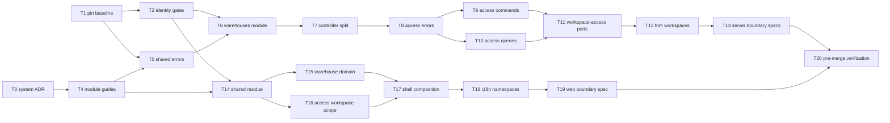

# Epic — change-request: modules-level-refactor

> **Change record:** [change.md](../change.md) · **Spec:** [spec.md](../spec.md) · **Design:** [sad.md](../sad.md) · **Test plan:** [test-plan.md](../test-plan.md) · **ADRs:** [adr/](../adr/)
> **Data model:** N/A — persistence is untouched ([CR-RG-03](../spec.md#cr-rg-03--persistence-and-published-contracts-are-untouched)). **API contract:** N/A — the wire is unchanged; identity is asserted by the route-table gate ([sad §5.5](../sad.md#55-route-table-identity-gate-closes-changemd-96)).

## Goal

Every domain entity owns exactly one top-level module per application: `warehouses`/`warehouse` gets
created and takes the Warehouse record, `access` takes both of its scopes, and `workspaces`/`workspace`
keeps the Workspace record and the shell that composes the others. The rule is written into three
guides plus one system ADR and made executable by boundary specs in both applications. No
user-observable behavior changes — that claim is the substance of the work, so the identity gates land
before the first move and the documentation lands before the code it governs.

## Scope

- **In:** `apps/server/src/{warehouses,access,workspaces,users}`, `apps/web/src/modules/{warehouse,access,workspace}`,
  the web composition layer's `shared/` receiving six multi-consumer files, i18n namespaces,
  five updated plus three new boundary specs, `tests/refactor/` identity gates, and six `docs/system`
  documents.
- **Out:** any product behavior change; URL changes (`@Controller` prefixes stay byte-identical);
  moving authorization enforcement into `access`; moving anything _out_ of the web composition layer
  (one named `src/test/setup.ts` addition excepted); moving `set-active-warehouse`; folding
  `src/users/` into `access`; renaming modules for singular/plural symmetry; moving
  `packages/contracts` subpaths; an import-boundary ESLint plugin; merging the two mutation/feedback
  adapters ([sad §11 R4](../sad.md#risks)).

## Task map

Two independent branches after the gates: the server lane `T5→T13` and the web lane `T14→T19`.
[change.md §7](../change.md#7-rollback) makes the two applications independently revertible, which is
why they are separate branches rather than one chain. Within an application the moves are strictly
ordered — a half-moved module graph does not compile.

## Tasks

See [tracker.md](./tracker.md) for status. Machine contract: [tasks.json](../tasks.json).

| #   | Task                                                                                              | Layer  | Blocked by | DoD (short)                                                                |
| --- | ------------------------------------------------------------------------------------------------- | ------ | ---------- | -------------------------------------------------------------------------- |
| T1  | [Pin `baseline_revision` on a clean tree](./pin-baseline-revision.md)                             | docs   | —          | Clean tree, branch-tip SHA in `change.md` frontmatter                      |
| T2  | [Commit the three identity baselines and their gates](./commit-identity-baselines.md)             | tests  | T1         | Route-table, split-case and locale gates green at baseline                 |
| T3  | [Add the system ADR and both index entries](./add-flat-modules-adr.md)                            | docs   | —          | ADR Accepted, both indexes updated in the same commit                      |
| T4  | [State the ownership rule in the three module guides](./amend-module-guides.md)                   | docs   | T3         | Four rules stated; no guide contradicts CR-AC-04; no new guide file        |
| T5  | [Promote the three cross-destination error members](./promote-shared-errors.md)                   | domain | T1, T4     | Three members resolve from `shared/errors/`, codes unchanged               |
| T6  | [Create the `warehouses` module](./create-warehouses-module.md)                                   | app    | T2, T5     | Four commands + list query + three factories run from `warehouses`         |
| T7  | [Split `warehouse.controller.ts` across two modules](./split-warehouse-controller.md)             | ports  | T6         | Route-table diff empty; harness shared; coverage gate re-pathed            |
| T8  | [Move the fourteen access factories, delete the old directory](./split-workspace-errors.md)       | domain | T7         | Fourteen factories in `access`; `workspaces/domain/errors/` gone, no shim  |
| T9  | [Move the seven workspace role/member/owner commands](./move-workspace-access-commands.md)        | app    | T8         | Seven commands in `access`; no `access` production import of `workspaces`  |
| T10 | [Move the four list queries, predicates and deletion service](./move-workspace-access-queries.md) | app    | T8         | Queries, predicates and service run from `access`                          |
| T11 | [Move the eleven handlers onto `WorkspaceAccessController`](./add-workspace-access-controller.md) | ports  | T9, T10    | Route-table diff empty; two controllers on one prefix; specs split         |
| T12 | [Trim `workspaces` and prove the graph acyclic](./trim-workspaces-module.md)                      | wiring | T11        | CR-AC-07 manifest exact; DI + smoke green; zero `forwardRef(`              |
| T13 | [Add the two server boundary specs, tighten `users`](./add-server-boundary-specs.md)              | tests  | T12        | New specs fail on a foreign import; `users` forbids all four; rules intact |
| T14 | [Promote the six multi-consumer web files](./promote-web-shared-residue.md)                       | ui     | T2, T4     | Six files in `shared/`; duplicates deleted; specifier-only spec diffs      |
| T15 | [Move the Warehouse domain into `modules/warehouse`](./move-warehouse-domain-web.md)              | ui     | T14        | Components, API slice, hooks and schema run from `modules/warehouse`       |
| T16 | [Move the workspace scope of Access into `modules/access`](./move-workspace-access-web.md)        | ui     | T14        | 26 components, both slices and 13 hooks run from `modules/access`          |
| T17 | [Compose the shell across modules](./compose-administration-shell.md)                             | ui     | T15, T16   | Same four tabs, same order, same gating; CR-AC-03 manifest exact           |
| T18 | [Register the `warehouse` namespace, re-home the copy](./register-warehouse-namespace.md)         | ui     | T17        | Every locale value identical; key paths move only for three parents        |
| T19 | [Declare each web module's surface and enforce it](./add-web-boundary-spec.md)                    | tests  | T18        | Empty exception list; fixture rejected by name; manifest held              |
| T20 | [Run the pre-merge verification](./pre-merge-verification.md)                                     | tests  | T13, T19   | Zero behavioral assertions changed; ≤110% cost; no new eager chunk         |

## Risks / Hard rules

Every task inherits these. A task that cannot meet one is a finding to record, never a rule to bend.

- **Zero behavioral assertions may change.** Only the diffs enumerated in
  [test-plan.md § Assertion classification](../test-plan.md#assertion-classification) are permitted,
  per suite. Any other assertion diff is evidence the refactor altered behavior and blocks release
  ([change.md §6](../change.md#6-rollout) abort threshold, [CR-RG-01](../spec.md#cr-rg-01--product-behavior-is-byte-identical)).
  The classification table is never widened to absorb a diff that already happened.
- **Every commit builds, lints and passes on its own** — a module move has no dual-running state, so
  the unit of safety is the commit ([sad §1](../sad.md#quality-goals-in-priority-order) goal 5). This is
  why each move task updates the boundary specs it invalidates rather than deferring them.
- **No `forwardRef()`.** If the NestJS graph needs one, that is an ownership problem to report, not to
  work around ([CR-AC-09](../spec.md#cr-ac-09-cr-us-01-ch-s5--boundary), [sad §5.1](../sad.md#51-server-modules-after-the-move)).
- **No boundary spec's _rule_ may weaken.** Path-valued literals are structural and change by
  definition; a deleted or relaxed rule is a refactor failure ([CH-S6](../change.md#3-override-map)).
- **No per-file exception list on the web boundary spec.** A surface _declaration_ is the rule's input;
  an _exception_ is an import permitted despite violating the rule, and this request admits none
  ([CR-AC-04](../spec.md#cr-ac-04-cr-us-01-cr-us-02-ch-w3-ch-w5-ch-d3--boundary), [ADR 0001](../adr/0001-enumerated-web-module-surface-declaration.md)).
- **Error codes and factory symbol names are unchanged** even where a `workspace*` prefix reads oddly
  in its new home — renaming 19 symbols across ~40 call sites adds a rename-typo failure class to a
  diff whose whole claim is that nothing changed ([sad §5.4](../sad.md#54-error-module-split-closes-changemd-6-step-2)).
- **Documentation precedes the code it governs** (T3, T4 before T5 and T14). Two canonical documents
  currently instruct the opposite of what this request approves, and CR-US-03 promises a contributor
  they never disagree _at any point_ during the rollout ([sad §4.6](../sad.md#46-documentation-lands-before-the-code-it-governs)).
- **Import rewriting is unassisted** — no tsconfig `paths`, no `nest-cli.json`. A wrong specifier that
  still type-checks is a silent behavior change; the per-commit gate and the boundary specs are the
  only net ([sad §11 R1](../sad.md#risks)).
- **Cost budget:** build and test wall-clock ≤110% of baseline, no new eager web chunk
  ([spec §6](../spec.md#6-non-functional-requirements)).
- **`packages/contracts`, `apps/server/migrations/`, the 13 entities, the 17 repositories,
  `shared/guards/` and `apps/web/eslint.config.mjs` are not touched** beyond import specifiers
  (CR-RG-03, CR-RG-05, CR-RG-06).
