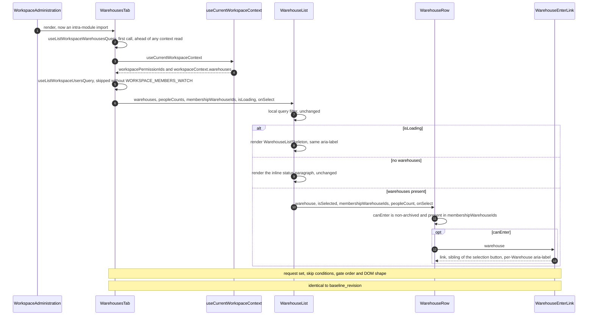
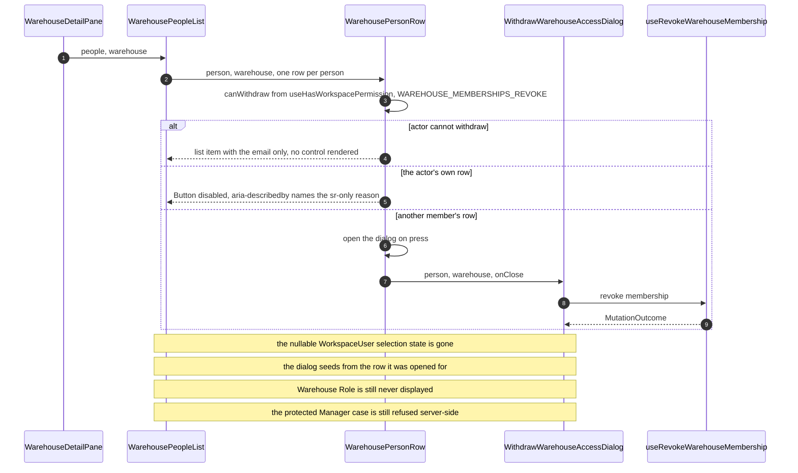

# Software Architecture Description — change-request: refactor-warehouse-components

## 1. Context and quality goals

### Current behavior

`apps/web/src/modules/warehouse/` holds 28 files across two unrelated concerns. Six serve the
in-Warehouse destination (`route.tsx`, `page.tsx`, `components/DesignSystemExample.tsx` and its
spec, `hooks/useRecordWarehouseEntry.ts` and its spec). The other twenty-two serve the **Warehouses
tab of Workspace administration**: thirteen files under
`components/workspace-administration/warehouses/`, plus `api/warehouse-api.ts`, five mutation
hooks, `hooks/warehouse-name-validation.ts` (+ spec) and `schemas/warehouse-name-form.schema.ts`.

That second group has exactly one consumer —
`modules/workspace/components/WorkspaceAdministration.tsx:10`, which imports `WarehousesTab`
across a module boundary through the declared surface entry
`modules/warehouse/components/workspace-administration/warehouses/WarehousesTab`. An import scan at
`baseline_revision` confirms the boundary buys nothing: **no file outside the moving set imports any
of the twenty-two**, except two test-only references (`modules/access/hooks/workspace-role-name-validation.spec.ts`
and the boundary spec's own scan-scope comment) that the production import graph never sees.

The placement is not accidental. [ADR 14-08-2026](../../system/adr/14-08-2026-domain-owned-flat-modules.md)
decided it four commits ago, and three system documents now instruct it:
[`placing-web-components.md`](../../system/guides/placing-web-components.md) §"When not to nest"
uses this exact arrangement as its worked example of a legal cross-module surface import;
[`adding-a-web-module.md`](../../system/guides/adding-a-web-module.md) §1 states "Warehouse
administration belongs to `modules/warehouse` even when the only page rendering it today is the
workspace page", and its §"Common failures" names the opposite arrangement as a failure.

Two components carry more than one reason to change. `WarehouseList.tsx` (157 lines) owns the
search affordance, the loading/empty/list branch and row rendering.
`WarehousePeopleList.tsx` (101 lines) owns the pane chrome, the row and the withdraw workflow,
holding a `WorkspaceUser | null` selection in the list rather than at the button that sets it.
`WarehousesTab.spec.tsx` (1122 lines, 39 cases across ten `describe` blocks) covers all twelve
components from one harness.

`apps/web/src/shared/api/` is nine flat files mixing transport primitives (`api-client.ts`,
`mutation-outcome.ts`) with domain endpoint slices (`workspace-context-api.ts`,
`workspace-users-api.ts`, `access-permissions-api.ts`) and a path builder. Sixty-eight files
reference a `shared/api/…` specifier: **62 outside the directory and 6 inside it**. (`change.md`
§3.2.3's "68 importing files" counts both; CR-AC-05's "every importer resolves through the new
path" binds all 68.)

### Target behavior

The Warehouse administration slice becomes intra-module material of `modules/workspace`. All 22
moving files land under `modules/workspace/`, the tab's import becomes intra-module, and
`MODULE_SURFACE.warehouse` shrinks to the two entries a real importer still needs. No new surface
entry is created anywhere, because the moving set has no consumer outside itself.

The placement rule that produced the current layout is **narrowed, not replaced**. CH-D2's ADR keeps
ADR 14-08's owning-entity rule as the default and adds one tiebreak: where a slice's **sole**
consumer exercises its capabilities at another scope, placement follows the scope of exercise. The
three guides stop contradicting it.

`WarehouseList` and `WarehousePeopleList` each keep one reason to change, with five new sibling
components and three new colocated specs carved out of them. `shared/api` gains four
directories that name the domain their endpoints address.

No user-observable behavior changes. Every rendered element, accessible name, network request,
permission check, translated value, route and chunk boundary is identical before and after —
which is what §5.1 of [`spec.md`](./spec.md#51-regression-boundaries) puts under test.

### Quality goals, in priority order

1. **"Nothing changed" is provable by diff, not asserted.** The move commit contains no content edit
   beyond import specifiers, the surface declaration and the manifest (§4.3). Every later commit is
   read against that fixed point.
2. **One placement answer, reachable from one document.** A contributor following `web-index.md`
   lands on CH-D2 and finds no guide that still instructs the opposite (§4.1, §4.2).
3. **Zero boundary exceptions.** The surface declaration keeps admitting inputs only. An import that
   must be permitted _despite_ the rule aborts the request (`change.md` §6).
4. **Each file answers one question.** The splits are sized by
   [`writing-web-components.md`](../../system/guides/writing-web-components.md)'s budgets, not by
   line count alone (§5.3).
5. **The spec split cannot hide a regression.** Test movement is governed by a subject rule that
   makes CR-RG-01's assertion-drift definition mechanically checkable (§4.6, §5.4).

## 2. Constraints inherited from `docs/system`

| Constraint                                                                                                                                         | Source                                                                                                                                               | How this request obeys it                                                                                                                                  |
| -------------------------------------------------------------------------------------------------------------------------------------------------- | ---------------------------------------------------------------------------------------------------------------------------------------------------- | ---------------------------------------------------------------------------------------------------------------------------------------------------------- |
| A module is named for the domain entity that owns the behavior it contains                                                                         | [ADR 14-08-2026](../../system/adr/14-08-2026-domain-owned-flat-modules.md) §Decision                                                                 | **Narrowed by CH-D2**, not discarded. The default stands; a sole-consumer slice exercised at another scope follows the scope. §4.1                         |
| Modules are flat by identity: a second domain entity never acquires a home inside another module's tree                                            | ADR 14-08 §Decision; [`adding-a-web-module.md`](../../system/guides/adding-a-web-module.md) §1                                                       | Preserved. §4.2 fixes the test for "a home" so the target directory is decidably a component grouping, not a module                                        |
| A module reaches another module only through its declared public surface; the composition layer differs in reach, not exemption                    | ADR 14-08 §"Public surface"; `adding-a-web-module.md` §2                                                                                             | Preserved with zero exceptions. The move **removes** one surface entry and adds none (§5.6)                                                                |
| Nest owned components one level down; group an owner's components by the domain they act on, not by UI shape                                       | [`placing-web-components.md`](../../system/guides/placing-web-components.md)                                                                         | §4.4. The split components stay flat inside the `warehouses/` domain group, exactly as `MemberRow.tsx` sits flat beside `MemberList.tsx` inside `members/` |
| One exported component per file; ~100-line, 7-prop, 5-hook, 2-nesting budgets; transient UI state owned by its trigger; flat branching             | [`writing-web-components.md`](../../system/guides/writing-web-components.md) §§1–8                                                                   | §5.3 sizes every new file against these and records the numbers                                                                                            |
| Server-owned resource data belongs to an RTK Query API slice, not an ordinary state slice; add a slice only for cross-module or route-global state | [`frontend-architecture.md`](../../system/frontend-architecture.md) §"Redux Toolkit infrastructure"                                                  | CR-AC-06 audit stands unchanged: no slice qualifies, no `store/` scaffolding is created (§8)                                                               |
| One shared RTK Query API slice with a shared base query; owning modules add endpoints with `injectEndpoints`                                       | [ADR 02-08-2026](../../system/adr/02-08-2026-rtk-query-for-web-api-calls.md)                                                                         | `warehouse-api.ts` changes directory only. Its `injectEndpoints` call, tags, cache keys and base query are untouched (§7.2)                                |
| Module copy stays in a module-named namespace served from `public/locales/<language>/`                                                             | [ADR 27-07-2026](../../system/adr/27-07-2026-bundled-centralized-web-translations.md); `frontend-architecture.md` §"Validation and server contracts" | `warehouse.json` keeps its name. CH-D2 states the rule that makes this consistent (§4.5, §8)                                                               |
| Browser-only validation lives in `modules/<module>/schemas/`; contract schemas live in `packages/contracts`                                        | `frontend-architecture.md`; [`adding-and-using-contracts.md`](../../system/guides/adding-and-using-contracts.md)                                     | `warehouse-name-form.schema.ts` moves module, stays a browser-only schema. `@warehouser/contracts/workspaces` is untouched                                 |
| Colocate component, page, hook, schema and slice tests with their owner; keep cross-cutting setup in `src/test`                                    | `frontend-architecture.md` §"Testing"                                                                                                                | §5.4. `module-surface.ts` stays under `src/test/` for the reason its own docblock gives                                                                    |
| Routes are registered manually in `src/router.ts`; lazy `import('./page')` boundaries are the chunk seams                                          | `frontend-architecture.md` §"Runtime foundation"                                                                                                     | No route changes. CR-RG-05's manifest comparison is the evidence (§10)                                                                                     |
| UI-changing work requires the Pencil approval gate                                                                                                 | `frontend-architecture.md` §"UI design boundary"                                                                                                     | **Not required here** — see §3                                                                                                                             |

No deviation from `docs/system` is proposed. CH-D2 is an amendment _of_ `docs/system`, authored by
this request and reviewed as its deliverable, not a local exemption from it.

## 3. Scope and target surfaces

`target_surfaces: ['web-frontend']`

`apps/server`, `packages/contracts` and every `packages/*` are untouched, so no `backend-service`,
`worker`, `cli` or `library-sdk` surface participates. **The `web-frontend` surface does not require
the `design-ui` approval gate** — CR-RG-01 through CR-RG-04 make every rendered element, accessible
name and translated value identical, so there is no visual intent to approve. This is stated
explicitly because `web-frontend` normally routes to `design-ui`
([`../_shared/surfaces.md`](../../../.claude/skills/_shared/surfaces.md)).

### In scope

- Moving the 13 CH-W1 component files and the 9 CH-W2 hook/api/schema files into `modules/workspace`
  (§5.1), and re-pointing `WorkspaceAdministration.tsx:10` intra-module.
- Rewriting `MODULE_SURFACE`, `WORKSPACE_MODULE_MANIFEST` and every stale path or identifier in the
  boundary machinery (§5.6).
- Splitting `WarehouseList.tsx` and `WarehousePeopleList.tsx` into the file set §5.3 fixes.
- Re-splitting `WarehousesTab.spec.tsx` by the subject rule §4.6 states, into the file set §5.4 fixes.
- Reorganizing `shared/api` into `client/`, `workspace/`, `access/`, `warehouse/` and rewriting all
  68 referencing files (§5.5).
- Superseding ADR 14-08-2026, adding CH-D2's ADR, and reconciling `placing-web-components.md`,
  `adding-a-web-module.md` and `web-index.md` (§4.1, §4.2).
- Renaming `modules/auth/store/authSlice.spec.ts` → `auth.slice.spec.ts` and recording the CR-AC-06
  audit.

### Out of scope

- Any behavior change, including the selected Warehouse surviving navigation (`spec.md` §3).
- Moving `modules/access/components/workspace-administration/*`. Unconditional intake decision,
  reaffirmed at `/clarify` (`spec.md` §3).
- `docs/system/frontend-architecture.md` (CH-D5 is a ship step) and both server-facing citations of
  ADR 14-08 (`server-index.md`, `adding-a-server-module.md`) — accepted consequence, `spec.md` §3.
- Removing `modules/warehouse`, adding a Redux slice, or creating `store/` scaffolding.
- Fixing the known-red server spec CR-RG-06 pins.
- Introducing an ESLint boundary plugin, a module barrel, or a tsconfig path alias.

### Open questions closed here

| Source                                     | Question                                                                                                  | Resolution                                                                                                                                                                                                                                                                                                                                                |
| ------------------------------------------ | --------------------------------------------------------------------------------------------------------- | --------------------------------------------------------------------------------------------------------------------------------------------------------------------------------------------------------------------------------------------------------------------------------------------------------------------------------------------------------- |
| `spec.md` §8 (due `/design`)               | Does `shared/api/warehouse/warehouse-path.ts` keep a domain-named directory inside the composition layer? | **Yes, and the oddness dissolves.** §5.5. `warehouse-path.ts` has four consumers in three trees (`modules/access`, `shared/api`, `test/`, `routes/`), so CH-D2's sole-consumer tiebreak never reaches it. The directory names **the domain the endpoints address**, not the module that owns them — the same rule CH-D2 states for i18n namespaces (§4.5) |
| `change.md` §3.2.2 (deferred to `/design`) | What is the exact `WarehouseList` / `WarehousePeopleList` split?                                          | §5.3 fixes five new components; CR-AC-04's "resulting file set" is that list                                                                                                                                                                                                                                                                              |
| `change.md` §3.2.2 (deferred to `/design`) | How is the 1122-line spec re-split?                                                                       | §4.6 states the subject rule; §5.4 fixes three new spec files and the per-`describe` assignment                                                                                                                                                                                                                                                           |
| Implied by CR-AC-01                        | Where inside `modules/workspace` does the slice land?                                                     | §4.2, §4.4. `components/workspace-administration/warehouses/`, mirroring `modules/access`'s three sibling groups                                                                                                                                                                                                                                          |

## 4. Solution strategy

### 4.1 The rule is narrowed by one clause, and the guides are reconciled to that clause

CH-D2 does not restate module ownership from scratch. It keeps ADR 14-08's rule — _code lives in the
module of the entity whose invariants it enforces_ — as the default, and adds a tiebreak that fires
only in a decidable situation:

> Where a slice's **sole** consumer exercises its capabilities at a different scope than the entity
> that owns them, placement follows the scope of exercise.

Three properties make this reviewable rather than a rationalization of one move:

- **It is falsifiable by a scan.** "Sole consumer" is an import-graph fact, and this request's
  own §1 scan is the evidence. A slice with two consumers stays where ADR 14-08 puts it.
- **It answers ADR 14-08's rejection on its own terms.** That ADR rejected "organize modules by
  consumer — nest a module under the screen that uses it" because it makes ownership a function of
  the current UI. CH-D2 concedes the rejection holds for _nesting_, which this request does not do:
  `modules/warehouse` and `modules/workspace` both remain flat top-level siblings, both keep a
  route, a page and a surface entry. The rejection does not reach a tiebreak between two existing
  flat modules, and CH-D2 does not deny that its own basis is a consumer argument.
- **It claims no domain asymmetry.** The `domain-expert` gate returned `ESCALATION_REQUIRED` against
  `change.md` §3.1.1 and the canonical glossaries refuse the cross-cutting-capability vs.
  subordinate-entity distinction (`spec.md` §1). CH-D2 records that finding and states plainly that
  the access tabs stay put on a placement decision, not a domain one — their three views are not a
  sole-consumer slice by the same scan, because `modules/access` owns Warehouse-scoped views of the
  same capabilities.

The three guides are then edited so no document instructs the opposite. `adding-a-web-module.md`
needs **four** reconciled statements, not the three CR-AC-03 enumerates — see §11 O1.

### 4.2 The flatness test becomes "is it a home?", not "does its name mention another entity?"

This is the resolution the design exists to supply, because the request as written walks into a
contradiction with its own acceptance criterion.

ADR 14-08 §Decision states: _"What flatness forbids is a second domain entity acquiring a home
inside another module's tree, as in `modules/workspace/components/workspace-administration/warehouses/`."_
That is the **exact path** CH-W1 restores. Meanwhile CR-AC-03 requires CH-D2 to preserve "flat
modules, one entity per top-level module, no nested submodules". Both cannot hold under a reading in
which the directory _name_ is the evidence of a home.

CH-D2 must therefore state the test explicitly:

> A directory is a module's **home** when it has module identity — a name in the module list, an
> entry in the surface declaration, and its own `route.tsx`/`page.tsx`. A directory named for an
> entity that has none of those is a **component grouping**, which
> [`placing-web-components.md`](../../system/guides/placing-web-components.md) §"Grouping owned
> components by domain" not only permits but prescribes.

Applied: `modules/workspace/components/workspace-administration/warehouses/` holds no route, no
page, no surface entry and no module name. It is `WorkspaceAdministration.tsx`'s owned-component
grouping — structurally identical to `modules/access/components/workspace-administration/members|roles|permissions/`,
which ADR 14-08 has never called a flatness violation. ADR 14-08 read the directory name as evidence
of a home because it believed the _contents_ were Warehouse-owned; once CH-D2 decides the contents
are Workspace-scoped, the name stops carrying that evidence.

The consequence for CH-D1 is important and narrow: ADR 14-08's body is preserved **verbatim** as
`change.md` §3.1 requires — including that sentence — because a superseded ADR is a historical
record. CH-D2 carries the retraction of the _example_ (not of the flatness rule), and
`adding-a-web-module.md` §1's flatness paragraph gains the home-vs-grouping test so a live guide
does not leave the ambiguity open. That fourth edit is the O1 spec amendment.

### 4.3 The move commit is content-free, so CR-RG-01 is checkable by diff

`change.md` §6 step 2 lands CH-W1 + CH-W2 + CH-W3 + CH-W4 as one commit whose only edits are import
specifiers, the surface declaration and the manifest. This design holds that line absolutely and
makes it mechanical: after the move, every moved file must satisfy

```sh
git diff -M --find-copies-harder <baseline_revision> -- <old-path> <new-path>
```

with **every hunk an import specifier**. The splits (CH-W5) are applied in a later commit, to
already-moved files, so a reviewer never has to separate "the file moved" from "the file changed"
inside one diff. The same rename-detection evidence discharges CR-AC-05's explicit-equivalence
clause for the seven `shared/api` modules.

### 4.4 Split components stay flat inside the domain group

`placing-web-components.md`'s nesting rule, read alone, would put `WarehouseRow.tsx` at
`warehouses/warehouse-list/components/WarehouseRow.tsx` — six directory levels below `modules/`. The
guide's own worked example refutes that reading: `AccessWorkspace.tsx`'s components are grouped into
`members/`, `roles/` and `permissions/`, and **inside** `members/` the ten files are flat —
`MemberRow.tsx` sits beside `MemberList.tsx`, not beneath it.

So the recursion terminates at the domain group. `warehouses/` **is** the group; every component the
tab and its children own is a flat sibling inside it. This also means the move target and the split
target are the same directory, and CH-W5 adds no directory at all.

`NameWorkspaceAction.tsx` and `NameWorkspaceDialog.tsx` stay flat at `workspace-administration/`
rather than acquiring a `workspace-name/` group of their own: the guide says to skip subgrouping for
"few enough to read at a glance (roughly under half a dozen)", and moving them is not in scope.

### 4.5 A directory names the domain its contents address, not the module that renders them

One rule covers three otherwise-unrelated decisions this request would otherwise take three ways:

| Artifact                                                            | Name it keeps | Because                                                           |
| ------------------------------------------------------------------- | ------------- | ----------------------------------------------------------------- |
| `public/locales/{en,uk}/warehouse.json`                             | `warehouse`   | The copy describes Warehouses (settled at `/clarify`, CR-AC-03)   |
| `shared/api/warehouse/warehouse-path.ts`                            | `warehouse/`  | It builds `/api/v1/warehouses/{id}/…` paths (closes `spec.md` §8) |
| `modules/workspace/components/workspace-administration/warehouses/` | `warehouses/` | The views act on Warehouses (§4.4)                                |

Stating it once in CH-D2 is what stops "the directory says `warehouse` but lives under `workspace`"
from reading as an unresolved smell in three separate places. It is also why none of the three is
evidence of module ownership — §4.2's test is.

### 4.6 Test movement is governed by subject, not by `describe` block

`WarehousesTab.spec.tsx` is 39 cases in ten `describe` blocks, all mounted through the tab. CR-RG-01
permits re-scoped describes, per-file harnesses and isolated child mounts, and forbids any
expectation whose subject or expected value changes. The rule that keeps those two compatible:

> A case moves to a component's colocated spec when the **subject its expectations name** is that
> component, _and_ it can be re-mounted on that component with every expectation's subject and
> expected value byte-identical. A case that asserts an orchestration outcome — a request that fires
> or does not fire, a mutation, a toast, a cross-pane effect, a navigation — stays in
> `WarehousesTab.spec.tsx`.

Two `describe` blocks therefore split across files rather than moving whole (§5.4). That is the
"re-scoped `describe` blocks" CR-RG-01 explicitly permits, and it is preferable to the alternative:
moving a whole block would drag orchestration cases onto a child mount, where the only way to make
them pass is to change what they assert — the abort condition.

**Case-count identity is the gate.** The ten blocks contain 39 cases before; the four files must
contain all 39 after — none deleted, none renamed — plus any case admitted by name in the gate's
`ADDED_CASES`. At `HEAD` that is the three cases review S3/S4/S5 required, for a total of 42.

### 4.7 Documentation lands before the code it governs

`change.md` §6 orders documentation last (step 5). This design moves CH-D1–CH-D4 and CH-D6 to
**step 0**, ahead of CH-W6, for the reason its own §2 gives: `placing-web-components.md` currently
uses the pre-move arrangement as its worked example of correct placement, and
`adding-a-web-module.md` §"Common failures" names the post-move arrangement as a failure. A
contributor or reviewer reading `docs/system` between step 1 and step 5 is instructed to reject the
change in progress. The predecessor request adopted the same ordering rule
([`modules-level-refactor/sad.md`](../modules-level-refactor/sad.md) §4.6).

Documentation-first also costs nothing to revert: CH-D1–CH-D6 are doc-only, and §7 of `change.md`
already accepts that the documentation rollback is the expensive half either way.

Resulting order — otherwise `change.md` §6 unchanged:

| Step | Content                                                                         | Independently revertible |
| ---- | ------------------------------------------------------------------------------- | ------------------------ |
| 0    | CH-D1, CH-D2, CH-D3, CH-D4, CH-D6 (documentation)                               | yes                      |
| 1    | CH-W6 (`shared/api`) — proves the 68-file rewrite before the move depends on it | yes                      |
| 2    | CH-W1 + CH-W2 + CH-W3 + CH-W4 (the move; content-free, §4.3)                    | yes                      |
| 3    | CH-W5 (the component splits, then the spec re-split)                            | yes                      |
| 4    | CH-W7 (the audit record and the `auth.slice.spec.ts` rename)                    | yes                      |

CH-D5 (`frontend-architecture.md`) remains a ship step.

## 5. Building blocks and ownership

### 5.1 `modules/workspace` after the move — the CR-AC-01 manifest

38 files. `WORKSPACE_MODULE_MANIFEST` must list exactly this set; anything else fails CR-AC-01.

```text
modules/workspace/
├── route.tsx                                             retained
├── page.tsx                                              retained
├── api/
│   └── warehouse-api.ts                                  CH-W2
├── schemas/
│   ├── name-workspace-form.schema.ts                     retained
│   └── warehouse-name-form.schema.ts                     CH-W2
├── hooks/
│   ├── useRenameWorkspace.ts                             retained
│   ├── useAssignWarehouseMembership.ts                   CH-W2
│   ├── useCreateWarehouse.ts                             CH-W2
│   ├── useRenameWarehouse.ts                             CH-W2
│   ├── useRevokeWarehouseMembership.ts                   CH-W2
│   ├── useSetWarehouseArchival.ts                        CH-W2
│   ├── warehouse-name-validation.ts                      CH-W2
│   └── warehouse-name-validation.spec.ts                 CH-W2
└── components/
    ├── WorkspaceAdministration.tsx                       retained (import at :10 becomes intra-module)
    ├── WorkspaceAdministration.spec.tsx                  retained
    └── workspace-administration/
        ├── NameWorkspaceAction.tsx                       retained
        ├── NameWorkspaceDialog.tsx                       retained
        └── warehouses/
            ├── WarehousesTab.tsx                         CH-W1
            ├── WarehousesTab.spec.tsx                    CH-W1, reduced by CH-W5
            ├── WarehouseDetailPane.tsx                   CH-W1
            ├── WarehouseList.tsx                         CH-W1, reduced by CH-W5
            ├── WarehouseList.spec.tsx                    CH-W5 (new)
            ├── WarehouseSearchField.tsx                  CH-W5 (new)
            ├── WarehouseListSkeleton.tsx                 CH-W5 (new)
            ├── WarehouseRow.tsx                          CH-W5 (new)
            ├── WarehouseRow.spec.tsx                     CH-W5 (new)
            ├── WarehouseEnterLink.tsx                    CH-W5 (new)
            ├── WarehousePeopleList.tsx                   CH-W1, reduced by CH-W5
            ├── WarehousePeopleList.spec.tsx              CH-W5 (new)
            ├── WarehousePersonRow.tsx                    CH-W5 (new)
            ├── WarehouseNameForm.tsx                     CH-W1
            ├── WarehouseLifecycleActions.tsx             CH-W1
            ├── AddWarehouseAction.tsx                    CH-W1
            ├── AddWarehouseDialog.tsx                    CH-W1
            ├── ArchiveWarehouseDialog.tsx                CH-W1
            ├── GiveWarehouseAccessAction.tsx             CH-W1
            ├── GiveWarehouseAccessDialog.tsx             CH-W1
            └── WithdrawWarehouseAccessDialog.tsx         CH-W1
```

8 retained + 13 CH-W1 + 9 CH-W2 + 5 new components + 3 new specs = 38.

### 5.2 `modules/warehouse` after the move

Six files, per CR-AC-01. Nothing is deleted; the specs stay colocated.

```text
modules/warehouse/
├── route.tsx
├── page.tsx
├── components/DesignSystemExample.tsx
├── components/DesignSystemExample.spec.tsx
├── hooks/useRecordWarehouseEntry.ts          consumed by shared/layouts/WarehouseLayout.tsx
└── hooks/useRecordWarehouseEntry.spec.tsx
```

`useRecordWarehouseEntry` stays because it serves **entering** a Warehouse, not administering the
set of them — the boundary CH-D2 draws — and because its single outside consumer,
`shared/layouts/WarehouseLayout.tsx`, is the composition layer rather than a view, route or handler
of another entity's module, so the tiebreak's second condition fails and it does not fire on the
hook either. (`store/middleware/api-error.middleware.ts` names the hook in a comment and imports
nothing from it.) It imports `shared/api/workspace-context-api`
and `shared/hooks/useEnteredWarehouse`, never the moving set.

`spec.md` §3 corrects `change.md` §4.1's defence of this residual: future in-Warehouse entities
become flat top-level sibling modules, not growth inside `modules/warehouse`. This design records
that the residual is justified by its two current consumers, not by a promised future.

### 5.3 The CH-W5 component split — fixes CR-AC-04's file set

**`WarehouseList.tsx` (157 → ~70 lines).** Retains `query`, the filter and the three-way
`content` assignment, which CR-AC-04 explicitly protects as flat branching. Only branch bodies and
the search affordance extract.

| File                        | Shape               | Props                                                                              | Owns                                                                                                        | Reads                                                        |
| --------------------------- | ------------------- | ---------------------------------------------------------------------------------- | ----------------------------------------------------------------------------------------------------------- | ------------------------------------------------------------ |
| `WarehouseList.tsx`         | Directory           | 7 (unchanged)                                                                      | `query`; the filter; the 3-way branch; the `<ul aria-label>`                                                | `useTranslation('warehouse')`, `useTranslation('workspace')` |
| `WarehouseSearchField.tsx`  | Presentational leaf | 2 (`value`, `onChange`)                                                            | the `SearchField` group markup                                                                              | `useTranslation('warehouse')`                                |
| `WarehouseListSkeleton.tsx` | Presentational leaf | 0                                                                                  | the labelled 3-skeleton placeholder                                                                         | `useTranslation('warehouse')`                                |
| `WarehouseRow.tsx`          | Presentational leaf | 5 (`warehouse`, `isSelected`, `membershipWarehouseIds`, `peopleCount`, `onSelect`) | the card, the selection `<button>`, the meta line, the archived `Chip`; derives `isArchived` and `canEnter` | `useTranslation('warehouse')`                                |
| `WarehouseEnterLink.tsx`    | Presentational leaf | 1 (`warehouse`)                                                                    | the `RouterLink`, its per-Warehouse `aria-label`, its `buttonVariants` styling                              | `useTranslation('warehouse')`                                |

The empty-state branch body stays inline — one `<p role="status">` is below the threshold at which
`writing-web-components.md` §8 says indirection pays. That is a deliberate reading of `spec.md`
CR-AC-04's "the skeleton, the list and its rows"; see §11 O3.

Budgets, counted from `WarehouseList` as CR-AC-04 requires: `warehouse` travels list → row (1) →
link (2) — at budget, never past it. `membershipWarehouseIds` stops at the row, which derives
`canEnter` and renders `{canEnter ? <WarehouseEnterLink … /> : null}` — a single inline guard, which
§6 of the guide permits, and which keeps CR-RG-02's _hidden-never-disabled_ rule beside the control.
No new hook, context or store read is introduced at any leaf.

CR-RG-02's structural obligations land in named files: the `canEnter` derivation and its docblock in
`WarehouseRow.tsx`; the sibling-not-nested constraint and the `aria-label` rationale in
`WarehouseEnterLink.tsx`. Each existing explanatory docblock is carried to the file that inherits
its subject, per `change.md` §3.2.2.

**`WarehousePeopleList.tsx` (101 → ~35 lines).** One extraction, matching `change.md` §3.2.2's
stated preference.

| File                      | Shape        | Props                     | Owns                                                                                                                                                                                       | Reads                                                                                           |
| ------------------------- | ------------ | ------------------------- | ------------------------------------------------------------------------------------------------------------------------------------------------------------------------------------------ | ----------------------------------------------------------------------------------------------- |
| `WarehousePeopleList.tsx` | Directory    | 2 (unchanged)             | the heading, the description, the `<ul aria-label>` and its `map`                                                                                                                          | `useTranslation('warehouse')`                                                                   |
| `WarehousePersonRow.tsx`  | Action + row | 2 (`person`, `warehouse`) | the `<li>`, the email, the `WAREHOUSE_MEMBERSHIPS_REVOKE` gate, the `isSelf` disabled state with its `aria-describedby` sr-only reason, the open flag, and `WithdrawWarehouseAccessDialog` | `useTranslation('warehouse')`, `useAppSelector(selectCurrentUser)`, `useHasWorkspacePermission` |

This is what removes `WorkspaceUser | null` from the list: the row is mounted per person, so the
dialog seeds itself from the person it was opened for and the flag is a boolean — `writing-web-components.md`
§7 ("transient UI state lives with the control that owns it", and the sanctioned pattern for
"several dialogs sharing one trigger surface — the rows of a list"). Rendered DOM is unchanged:
the gate's `<>…</>` fragment produces no element, so the `<span class="sr-only">` remains the
`Button`'s sibling inside the same `<li>` (CR-RG-03).

Hop budget counted from `WarehousePeopleList`: `warehouse` travels list → row (1) → dialog (2). A
three-file shape that also extracted a `WithdrawWarehouseAccessAction` would push it to three hops
and is rejected for that reason.

`selectCurrentUser` call-site count is unchanged at three — `MemberDirectory.tsx` in
`modules/access`, and `GiveWarehouseAccessDialog.tsx` + `WarehousePersonRow.tsx` in
`modules/workspace` — so `MODULE_SURFACE.auth`'s comment stays accurate once its module names are
corrected (§5.6).

### 5.4 The CH-W5 spec split — fixes the CR-RG-01 drift boundary

Four files, the baseline's 39 cases, none deleted, plus the three enumerated additions — 42.

| `describe` in `WarehousesTab.spec.tsx`                    | Cases | Destination                                                                                                                                                                                                                                                                                                               |
| --------------------------------------------------------- | ----- | ------------------------------------------------------------------------------------------------------------------------------------------------------------------------------------------------------------------------------------------------------------------------------------------------------------------------- |
| the Warehouse list (AC-33, AC-12a)                        | 6     | → `WarehouseList.spec.tsx` (all six)                                                                                                                                                                                                                                                                                      |
| the detail pane and the level boundary (AC-33)            | 3     | split: the people-pane read and the level-boundary line → `WarehousePeopleList.spec.tsx`; the "omits the people list without `WORKSPACE_MEMBERS:WATCH` and never requests it" case **stays** (asserts a request that must not fire)                                                                                       |
| adding a Warehouse (AC-06, AC-08)                         | 4     | stays — mutation, field-error mapping, toast                                                                                                                                                                                                                                                                              |
| renaming a Warehouse (AC-09)                              | 4     | stays — mutation and dimming across panes                                                                                                                                                                                                                                                                                 |
| archiving and restoring (AC-11, AC-11a, AC-12a)           | 5     | stays — mutation, dialog copy, last-non-archived rule                                                                                                                                                                                                                                                                     |
| giving warehouse access (AC-23, AC-23a)                   | 3     | stays — two narrow reads, mutation, committed outcome                                                                                                                                                                                                                                                                     |
| withdrawing warehouse access (AC-25b, AC-25c)             | 3     | split: the disabled-own-row case → `WarehousePeopleList.spec.tsx`; the mutation and the server-denial cases **stay**                                                                                                                                                                                                      |
| responsive behaviour (desktop 1440 / mobile 390)          | 2     | stays — spans both panes                                                                                                                                                                                                                                                                                                  |
| accessibility                                             | 3     | split: "exposes the list as a labelled list of buttons that report their selected state" → `WarehouseList.spec.tsx`; the two dialog focus cases **stay**                                                                                                                                                                  |
| the Enter action (CR-AC-04, CR-AC-13, CR-AC-14, CR-RG-02) | 6     | split: the four row-scoped cases (renders Enter, per-Warehouse accessible name, omits on three non-qualifying row kinds, selection-button-before-Enter focus order) → `WarehouseRow.spec.tsx`; "navigates to that Warehouse's view" and "leaves rename/archive/grant reachable on a row that also renders Enter" **stay** |

Resulting counts: `WarehousesTab.spec.tsx` 25, `WarehouseList.spec.tsx` 7,
`WarehouseRow.spec.tsx` 4, `WarehousePeopleList.spec.tsx` 3. Total 39. At `HEAD`, after the three
additions review S3/S4/S5 required, the distribution is 27 / 7 / 4 / 4 — total 42.

The four new leaves — `WarehouseSearchField`, `WarehouseListSkeleton`, `WarehouseEnterLink`,
`WarehousePersonRow` — get **no** new spec. Their behavior is already pinned by the cases above, and
CR-RG-01 forbids deleting an expectation, not adding a file. Writing fresh cases for them would add
assertions this request has no criterion for.

Each new file carries its own harness (`renderWithProviders`, `stubWorkspaceServer`, a memory
router). The `vi.mock('shared/alerts/toast')` hoist and the fixtures from `test/workspace-fixtures`
are needed only where a mutation or toast is asserted, so `WarehouseRow.spec.tsx` and
`WarehouseList.spec.tsx` mount their subject with plain props and no server stub — permitted setup
change, not drift.

### 5.5 `shared/api` after CH-W6 — closes `spec.md` §8

Seven modules and two colocated specs; nothing left at the root.

```text
shared/api/
├── client/                       transport primitives — no domain endpoint
│   ├── api-client.ts             15 referencing files
│   └── mutation-outcome.ts       37 referencing files
├── workspace/                    Workspace-scope endpoints and the Workspace mutation runner
│   ├── workspace-context-api.ts  12
│   ├── workspace-context-api.spec.ts
│   ├── workspace-users-api.ts    4
│   └── workspace-mutation.ts     12
├── access/
│   ├── access-permissions-api.ts 3
│   └── access-permissions-api.spec.ts
└── warehouse/
    └── warehouse-path.ts         4
```

`warehouse-path.ts` keeps a one-file directory deliberately. Its consumers are
`modules/access/api/access-api.ts`, `shared/api/access-permissions-api.ts`,
`test/workspace-fixtures.ts` and `routes/warehouse.route.spec.tsx` — four consumers in three trees,
none of them `modules/workspace` or `modules/warehouse`. CH-D2's sole-consumer tiebreak therefore
never reaches it, the existing promotion rule that put it in `shared/` is untouched, and §4.5's
naming rule explains the directory: it builds `/api/v1/warehouses/{id}/…`, so `warehouse/` names the
domain the paths address. **Rejected alternative:** filing it under `client/` as a transport
primitive would leave `warehouse/` empty and contradict CR-AC-05, which enumerates four
destinations by name.

Rewrite scope: 68 referencing files — 62 outside `shared/api` and 6 inside it, distributed
`modules/access` 33, `modules/warehouse` 12 (→ `modules/workspace` after step 2),
`shared/hooks` 3, `modules/auth` 2, `modules/workspace` 1, `guards/` 3, `store/` 2, `shared/`
3, `routes/` 1, `router.spec.tsx` 1, `test/workspace-fixtures.ts` 1. Path-only: no exported symbol,
signature, endpoint, tag or cache key changes, and §4.3's rename-detected diff is the evidence
CR-AC-05 requires rather than a green build.

### 5.6 Boundary machinery after the move

**`MODULE_SURFACE`** — one entry is deleted, none added, no exception introduced.

| Module      | Before | After                                                                                                                                                                      |
| ----------- | ------ | -------------------------------------------------------------------------------------------------------------------------------------------------------------------------- |
| `access`    | 4      | 4 — unchanged                                                                                                                                                              |
| `auth`      | 6      | 6 — unchanged; the `auth.selectors` comment's "`modules/access` and `modules/warehouse`" becomes "`modules/access` and `modules/workspace`" (still three call sites, §5.3) |
| `home`      | 1      | 1 — unchanged                                                                                                                                                              |
| `warehouse` | 3      | **2** — `…/warehouses/WarehousesTab` is deleted; `route` and `hooks/useRecordWarehouseEntry` remain, each still required by a real importer                                |
| `workspace` | 1      | 1 — `modules/workspace/route`. `WarehousesTab` is **not** declared: its only importer is now intra-module                                                                  |

**`WORKSPACE_MODULE_MANIFEST`** — from 8 entries to the 38 of §5.1. Its docblock's `per CR-AC-03`
citation is a `modules-level-refactor` identifier and is qualified, not renumbered (CR-AC-02).

**Stale references.** CR-AC-02 names two classes; the scan at `baseline_revision` finds a third
site outside the boundary machinery.

| Site                                                                                                                | Stale after the move                                                                                | Class                                                                |
| ------------------------------------------------------------------------------------------------------------------- | --------------------------------------------------------------------------------------------------- | -------------------------------------------------------------------- |
| `modules/module-boundaries.spec.ts` SCAN SCOPE comment                                                              | names `modules/warehouse/hooks/warehouse-name-validation.spec.ts`                                   | moved path (CR-AC-02)                                                |
| `test/module-surface.ts` `MODULE_SURFACE.auth` comment                                                              | names `modules/warehouse` as a `selectCurrentUser` call site                                        | moved path (CR-AC-02)                                                |
| `modules/module-boundaries.spec.ts` header `(CH-W5)`, `SURFACE_RULE` `(CR-AC-04)`, manifest docblock `per CR-AC-03` | predecessor identifiers this request re-uses for other things                                       | qualified with the owning request (CR-AC-02)                         |
| `modules/access/hooks/workspace-role-name-validation.spec.ts:17-18`                                                 | names `modules/warehouse/hooks/warehouse-name-validation.spec.ts` as where its Warehouse half lives | **outside CR-AC-02's scope, and forbidden by CR-RG-07** — see §11 O2 |

`SURFACE_RULE`'s message text is edited freely: CR-AC-02 states that editing a rule description is
not assertion drift, and `module-boundaries.spec.ts` is not a moved spec.

The test-only coupling the SCAN SCOPE comment describes survives the move unchanged in kind: the
moved `warehouse-name-validation.spec.ts` still imports `modules/access/hooks/workspace-role-name-validation`,
now from `modules/workspace`. It stays outside the production scan, so it needs no surface entry —
the scan scope is a scope, not an exception.

### 5.7 Retained unchanged

`modules/access` (33 `shared/api` import specifiers only), `modules/home` (byte-identical),
`modules/auth` (2 import specifiers plus the CR-AC-06 rename), `apps/server`, `packages/contracts`,
`shared/{components,constants,errors,icons,layouts,alerts,hooks}`, `guards/`, `routes/`,
`router.ts`, `store/`, every route path and every `WorkspacePermissionId`.

## 6. Runtime view

### 6.1 The Warehouses tab after the split (CR-RG-01, CR-RG-02, CR-RG-04)

Establishes that the split changes who _renders_ what, never what is _requested_ or _gated_.



The ordering constraint documented on `WarehousesTab.tsx:41-46` — the Warehouse list query is
declared before the single context read, so no descendant races it with a second context request —
survives because no split component adds a query. `WarehouseRow` and `WarehouseEnterLink` read only
`useTranslation`.

### 6.2 Withdrawing access after the row split (CR-RG-03)



## 7. Data and interface impact

### 7.1 Persistence

**None.** No migration, entity, column, index or stored shape participates. `apps/server` and
`packages/contracts` are byte-identical (CR-RG-07).

### 7.2 HTTP interface

**None.** `warehouse-api.ts` changes directory. Its `injectEndpoints` registration, every endpoint
path, every `providesTags`/`invalidatesTags` value, every cache key and the shared base query are
untouched — which is exactly what CR-AC-05's rename-detected diff proves for the `shared/api`
modules and what §4.3's diff proves for this one. No `@Controller` prefix, route path or permission
identifier changes.

### 7.3 Localization interface

**Unchanged.** `public/locales/{en,uk}/warehouse.json` keeps its namespace and every key. The moved
components keep both `useTranslation('warehouse')` and, in `WarehouseList`, the deliberate second
read of `workspace` for `tabs.warehouses` — the shell reads the same key, so it stays in
`workspace.json`. The split preserves which namespace each string is read from: no key moves
between namespaces and no key is added.

### 7.4 Module-surface interface

The declaration's shape is unchanged — an enumerated list read as data, no barrel, no
`index.ts` — per [ADR 0001](../modules-level-refactor/adr/0001-enumerated-web-module-surface-declaration.md)
and CR-RG-05's no-new-eager-chunk requirement. Only its contents change (§5.6). Total declared
entries drop from 15 to 14.

## 8. Cross-cutting concerns

| Concern                         | Disposition                                                                                                                                                                                                                                                                                                                                                                                         |
| ------------------------------- | --------------------------------------------------------------------------------------------------------------------------------------------------------------------------------------------------------------------------------------------------------------------------------------------------------------------------------------------------------------------------------------------------- |
| **Authorization**               | Every client-side `WorkspacePermissionId` check moves verbatim. `WarehousesTab` keeps all six derivations; `WarehousePersonRow` inherits the `WAREHOUSE_MEMBERSHIPS_REVOKE` gate from the list. The client gate stays an affordance; server-side enforcement is untouched (`spec.md` §6.1)                                                                                                          |
| **Accessibility**               | The obligations §5.3 assigns to named files are the CR-RG-02/CR-RG-03 boundaries: `canEnter` hidden-never-disabled, the per-Warehouse Enter `aria-label`, Enter as a sibling of the selection button, the `isSelf` `aria-describedby` sr-only reason, and the deliberate absence of Warehouse Role from the people pane. Every list keeps its `aria-label`; the skeleton keeps `warehouses.loading` |
| **State**                       | No slice, no context, no `store/` scaffolding (CR-AC-06). `useState` count drops by one: `WarehousePeopleList`'s `WorkspaceUser                                                                                                                                                                                                                                                                     | null`becomes a boolean at the row.`frontend-architecture.md`'s slice test is re-applied in §4.2 of `change.md` and its conclusion is unchanged |
| **Error handling and feedback** | Untouched. Mutations keep running through `runWorkspaceMutation` → `alertWorkspaceAction`; no new failure path, toast or field-error map is introduced. `web-error-handling.md` needs no edit                                                                                                                                                                                                       |
| **Bundle**                      | No barrel, no eager import, no new route boundary. `WarehousesTab` moves from the `warehouse` module's graph to the `workspace` module's — both already reachable from the same lazy `import('./page')`. CR-RG-05's normalized module→chunk manifest is the evidence, and an unproducible baseline build leaves it **unverified**, not satisfied                                                    |
| **Lodash / HeroUI**             | `countBy`/`flatMap` stay direct imports in `WarehousesTab`; every HeroUI component and `buttonVariants` call moves with its file. No new UI dependency                                                                                                                                                                                                                                              |
| **Telemetry**                   | None added — repository rule (`AGENTS.md`)                                                                                                                                                                                                                                                                                                                                                          |

## 9. ADR index

**None.** No decision of this design clears the
[blast-radius gate](../../../.claude/skills/design/references/blast-radius.md).

- **CH-D2's system ADR is a deliverable of this request, not a design decision of it.** Its content
  is fixed by CR-AC-03 and extended by §4.2 (the home-vs-grouping test) and §4.5 (the naming rule).
  It is authored in step 0, before any code moves, with its `web-index.md` entry in the same commit.
  Recording the same rule a second time as a feature ADR would duplicate the authority.
- **The split shapes (§5.3), the spec-split rule (§4.6) and the `shared/api` layout (§5.5)** are
  recorded inline. Each is reversible file placement, and after applying `placing-web-components.md`
  and `writing-web-components.md` no second legitimate option survives — the gate's third criterion
  fails.
- **The enumerated-surface mechanism** is inherited from
  [`modules-level-refactor` ADR 0001](../modules-level-refactor/adr/0001-enumerated-web-module-surface-declaration.md),
  unchanged. **RTK Query, Zod and the locale-serving decisions** are inherited from the accepted
  system ADRs, unchanged.

## 10. Verification strategy

| Criterion          | How it is verified                                                                                                                                                                                                                                                                                                                                                                                                                                                                                                         |
| ------------------ | -------------------------------------------------------------------------------------------------------------------------------------------------------------------------------------------------------------------------------------------------------------------------------------------------------------------------------------------------------------------------------------------------------------------------------------------------------------------------------------------------------------------------- |
| CR-AC-01           | `module-boundaries.spec.ts`'s manifest assertion against the 38 files of §5.1; a directory listing of `modules/warehouse` returning the six files of §5.2                                                                                                                                                                                                                                                                                                                                                                  |
| CR-AC-02           | `pnpm --filter @warehouser/web test` runs the boundary spec green with an **empty exception list**; the negative fixtures under `modules/fixtures/` still fail as intended; a grep for `modules/warehouse/hooks/warehouse-name-validation` and `modules/warehouse/components/workspace-administration` across `src/` returns zero hits                                                                                                                                                                                     |
| CR-AC-03           | Documentation review at step 0, before any code moves: ADR 14-08 `Superseded by …` with a forward link and a verbatim body; CH-D2 `Accepted` carrying the narrowing, the answer to the "organize by consumer" rejection, the no-domain-asymmetry record, §4.2's home-vs-grouping test and §4.5's naming rule; `placing-web-components.md` §"When not to nest" no longer using the warehouses tab; `adding-a-web-module.md` reconciled at **four** locations (§11 O1); `web-index.md` listing both ADRs with correct status |
| CR-AC-04           | The realized file set diffed against §5.3's table; `writing-web-components.md` §9 checklist per new file; hop budgets counted from `WarehouseList` and `WarehousePeopleList` as §5.3 records them                                                                                                                                                                                                                                                                                                                          |
| CR-AC-05           | The §5.5 tree enumerated; `pnpm --filter @warehouser/web build` clean; and — the clause a green build cannot discharge — `git diff -M --find-copies-harder <baseline> -- <old> <new>` per moved module, with the review recording that every hunk is an import specifier                                                                                                                                                                                                                                                   |
| CR-AC-06           | The §4.2 audit table of `change.md` re-run over the three modules at `HEAD`; `find modules -type d -name store` returning only `modules/auth/store`; `auth.slice.spec.ts` present, `authSlice.spec.ts` absent, assertions diff-identical                                                                                                                                                                                                                                                                                   |
| CR-RG-01           | §4.3's content-free move diff; then §4.6's case-count identity — the baseline's 39 all present after, plus the three enumerated additions, distributed 27/7/4/4 — with every moved expectation's subject and expected value diff-identical. Any expectation edited to pass is an abort, not a finding                                                                                                                                                                                                                      |
| CR-RG-02, CR-RG-03 | The four Enter cases in `WarehouseRow.spec.tsx` and the disabled-own-row case in `WarehousePeopleList.spec.tsx`, unchanged in content; plus manual verification of focus order in the running app                                                                                                                                                                                                                                                                                                                          |
| CR-RG-04           | The four permission cases that **stay** in `WarehousesTab.spec.tsx` ("omits the people list … and never requests it", "omits the add control entirely", "offers no editable name", "omits both lifecycle controls"); the tab shell disappearing for an actor with no admitted tab is covered by `WorkspaceAdministration.spec.tsx`, which this request does not touch                                                                                                                                                      |
| CR-RG-05           | Build at `baseline_revision` and at `HEAD`; emit the Rollup output map, strip content hashes, rewrite moved source paths to their post-move form, sort, diff → empty apart from the five enumerated CH-W5 components, each required to land in its parent component's chunk, with the chunk-key set and every `isEntry`/`isDynamicEntry` flag identical to baseline. A baseline build that cannot be produced leaves this **unverified**                                                                                   |
| CR-RG-06           | `RUN_INTEGRATION=1` server suite; the manager-transfer concurrency case must fail identically (403 where 409 is expected). Without a container runtime this is **blocked, not satisfied**; CR-RG-07's evidence bounds but does not discharge it                                                                                                                                                                                                                                                                            |
| CR-RG-07           | `git diff --name-status <baseline> -- apps/server packages/contracts apps/web/src/modules/home` empty; `git diff <baseline> -- apps/web/src/modules/access` showing import-specifier hunks only, **except** the one comment hunk O2 covers; `modules/auth` showing 2 import specifiers plus the rename                                                                                                                                                                                                                     |
| `spec.md` §6 NFRs  | `lint`, `test`, `build` green at **every** step, not only at the end; the boundary spec's exception list empty at every step                                                                                                                                                                                                                                                                                                                                                                                               |

Gate command, run after each of steps 0–4:

```sh
pnpm --filter @warehouser/web lint && \
pnpm --filter @warehouser/web test && \
pnpm --filter @warehouser/web build
```

Plus manual verification per the repository's `run` practice: `/workspace` renders the same four
tabs in the same order; the Warehouses tab lists, filters, selects, enters, creates, renames,
archives, restores, grants and withdraws exactly as at `baseline_revision`, at both the desktop and
mobile widths the responsive cases pin.

## 11. Risks and open questions

### Risks

| ID  | Risk                                                                                                                                                                                                                                                                       | Mitigation                                                                                                                                                                                                                                                                                                                      |
| --- | -------------------------------------------------------------------------------------------------------------------------------------------------------------------------------------------------------------------------------------------------------------------------- | ------------------------------------------------------------------------------------------------------------------------------------------------------------------------------------------------------------------------------------------------------------------------------------------------------------------------------- |
| R1  | **The spec re-split is where a regression can hide.** 39 cases move or re-mount; an expectation quietly weakened to make an isolated mount pass would ship a real behavior change under a "nothing changed" claim. This is the largest single piece of work in the request | §4.6's subject rule decides movement mechanically; §5.4's per-`describe` table is fixed before implementation; case-count identity (39 baseline names, none lost; 42 total at `HEAD`) and per-expectation diff review are the gate; any expectation edited to pass is an abort under `change.md` §6                             |
| R2  | **The same files are moved twice in one branch.** `modules-level-refactor` moved them out of `modules/workspace` four commits ago; a reviewer reading the branch sees churn with no behavior delta, and ADR authority is weakened either way the episode ends              | Recorded openly in `change.md` §1.2 and §7. §4.1 requires CH-D2 to answer the predecessor's objection rather than ignore it, and §4.7 lands the documentation first so no window exists in which `docs/system` contradicts the tree                                                                                             |
| R3  | **Import rewriting is unassisted.** No tsconfig `paths`; 68 files for CH-W6 and every specifier naming the 22 moved files for step 2. A wrong specifier that still type-checks is a silent change                                                                          | Step 1 (`shared/api`) proves the rewrite on 68 files before step 2 depends on it; `build` + `test` + `lint` after every step; the boundary spec catches any specifier that crosses a module wrongly; §4.3's rename-detected diff catches any hunk that is not an import specifier                                               |
| R4  | **`modules/warehouse` shrinks to six files, two of which are a demo.** A reviewer may reasonably read this as dissolving the module rather than relocating a slice — `change.md` §4.1 calls this the strongest argument against the request                                | §5.2 replaces `change.md` §4.1's defence (which `spec.md` §3 already corrected) with a current-consumer one: `useRecordWarehouseEntry` has two consumers outside the module, so the module is not a shell. The decision to keep it is the Product Owner's, closed at `/clarify`                                                 |
| R5  | **CR-RG-05 and CR-RG-06 can both end "unverified" rather than "satisfied"** — one needs a baseline build, the other a container runtime                                                                                                                                    | Both criteria already state the failure mode as blocked-not-satisfied. Neither may be marked passing on a green unit suite alone; the review records the actual status                                                                                                                                                          |
| R6  | **A future contributor over-applies CH-D2's tiebreak** and moves any single-consumer slice to its consumer's module, re-deriving the layout ADR 14-08 was written to correct                                                                                               | The tiebreak is scoped to a _sole_ consumer exercising capabilities at a _different scope_, both of which are import-graph facts. §4.2's home-vs-grouping test and CR-AC-02's zero-exception surface declaration are the mechanical backstops; the ownership judgment remains a human review step, as ADR 14-08 already records |

### Open questions

- [x] **O1 — RESOLVED at `tasks` (2026-08-18): the amendment was applied.** `spec.md` CR-AC-03 now
      reads "Four locations" and names §1's flatness paragraph with §4.2's home-vs-grouping test.
      Original text follows. **`adding-a-web-module.md` needs a fourth reconciled statement, so
      `spec.md` CR-AC-03 must be amended before `tasks`.** CR-AC-03 enumerates three locations ("Three locations require
      reconciliation, not one"). §1's flatness paragraph — _"a second domain entity never acquires a
      home inside another module's tree"_ — is a fourth: read with ADR 14-08's example, it names this
      request's target directory. §4.2 supplies the fix (the home-vs-grouping test), but CR-AC-03 as
      written does not require it, so a conforming implementation could leave a live guide
      contradicting CH-D2. Recommended amendment: change "Three locations" to "Four locations" and
      add the flatness paragraph with §4.2's test. — owner: Tech Lead, due: before `tasks`
- [x] **O2 — RESOLVED at `tasks` (2026-08-18): the amendment was applied.** CR-RG-07's
      `modules/access` row now permits the single comment hunk at
      `hooks/workspace-role-name-validation.spec.ts:17-18`. Original text follows. **CR-RG-07
      forbids the comment fix CR-AC-02's intent requires, so `spec.md` must be amended before
      `tasks`.** `modules/access/hooks/workspace-role-name-validation.spec.ts:17-18`
      names `modules/warehouse/hooks/warehouse-name-validation.spec.ts` as where its Warehouse half
      lives; step 2 makes that path dangling. Fixing it is a comment hunk in `modules/access`, and
      CR-RG-07's table permits only `shared/api` import-specifier hunks there — "Any hunk in these
      trees that is not an import specifier … is a CR-RG-07 failure". Leaving it stale contradicts
      CR-AC-02's "no stale reference survives". Recommended amendment: CR-RG-07's `modules/access`
      row gains "plus the single comment hunk at
      `hooks/workspace-role-name-validation.spec.ts:17-18` re-pointing a moved path". — owner: Tech
      Lead, due: before `tasks`
- [ ] **O3 — confirm §5.3's reading of CR-AC-04's "the skeleton, the list and its rows".** This
      design extracts the skeleton and the row, and keeps the `<ul aria-label>` shell **inside**
      `WarehouseList` — because a `WarehouseList` that delegates its own `<ul>` is a branch selector
      wearing a list's name, and `writing-web-components.md` §8 warns against indirection for a
      handful of cases. The alternative reading extracts a sixth component around the `map`.
      CR-AC-04 grants the design artifact the deciding vote, so this proceeds unless review objects.
      — owner: Tech Lead, due: `review`
- [x] **O4 — RESOLVED at `tasks` (2026-08-18): the Tech Lead adopted §4.7's order.** The task DAG
      encodes documentation as step 0. Original text follows. **The `change.md` §6 rollout order is
      amended by §4.7** (documentation moves from step 5
      to step 0). Everything else in §6 — the step contents, the monitoring signals and all three
      abort thresholds — is unchanged. Flagged rather than silently applied because §6 is
      `change.md`'s decision. — owner: Tech Lead, due: `tasks`
