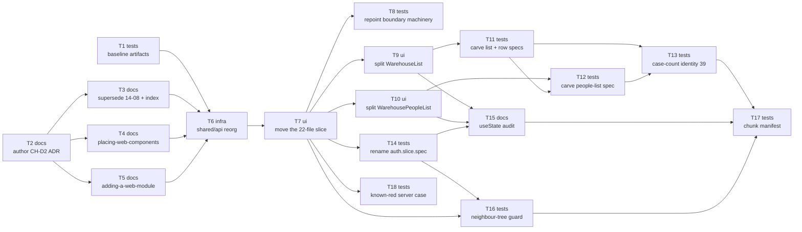

# Epic — change-request: refactor-warehouse-components

> **Change record:** [change.md](../change.md) · **Spec:** [spec.md](../spec.md) · **Design:** [sad.md](../sad.md) · **Test plan:** [test-plan.md](../test-plan.md) · **ADRs:** none — [sad.md §9](../sad.md#9-adr-index) records that no decision of this design clears the blast-radius gate; CH-D2's system ADR is a _deliverable_ (T2), not a design decision.

> **Baseline:** `baseline_revision = 42f1205d552f8284f8ec57358ad9022340b5f76e`. Every regression boundary is measured against it.

## Goal

Move the 22-file Warehouse administration slice from `modules/warehouse` into `modules/workspace`,
supersede the ADR that put it where it is, split two oversized components, and give `shared/api`
four domain directories — with **no observable behavior change**. Shipping this epic gives a
contributor one Accepted placement decision that the guides agree with, and a self-contained
administration slice whose components, hooks, API slice and schema live in one module
([spec.md §2](../spec.md#2-goals)).

## Scope

- **In:** `docs/system` (one new ADR, one superseded, three guides/index reconciled);
  `apps/web/src/shared/api`; `apps/web/src/modules/{warehouse,workspace}`; the boundary machinery in
  `apps/web/src/modules/module-boundaries.spec.ts` and `apps/web/src/test/module-surface.ts`; the
  `modules/auth` spec rename; the committed baseline artifacts.
- **Out:** any behavior change, including the selected Warehouse surviving navigation;
  `modules/access/components/workspace-administration/*` (unconditional, [spec.md §3](../spec.md#3-non-goals));
  `apps/server` and `packages/contracts`; `frontend-architecture.md` (CH-D5 is a ship step); the two
  server-facing citations of ADR 14-08; fixing the known-red server spec; any Redux slice, barrel,
  tsconfig path alias or ESLint boundary plugin.

## Task map

Documentation is **step 0**, ahead of all code — [sad.md §4.7](../sad.md#47-documentation-lands-before-the-code-it-governs),
adopted at `tasks` (closes O4). Between the old step 1 and step 5 the guides instruct a reviewer to
reject the change in progress, so every code task is gated on the reconciled guides.

**Parallel branches:** T1 runs alongside the entire documentation lane. T3/T4/T5 fan out from T2.
After T7, four branches open at once — T8, the two component splits (T9 ‖ T10), T14 and T18.

## Tasks

See [tracker.md](./tracker.md) for status. Machine contract: [tasks.json](../tasks.json).

| #   | Task                                                                                                | Layer | Blocked by     | DoD (short)                                                                                               |
| --- | --------------------------------------------------------------------------------------------------- | ----- | -------------- | --------------------------------------------------------------------------------------------------------- |
| T1  | [Capture the three `baseline_revision` comparison artifacts](./t1-capture-baseline-artifacts.md)    | tests | —              | Three artifacts committed, each reproducible from `42f1205` alone                                         |
| T2  | [Author CH-D2's system ADR](./t2-author-chd2-adr.md)                                                | docs  | —              | Accepted ADR carrying all four CR-AC-03 clauses plus the home-vs-grouping and naming rules                |
| T3  | [Supersede ADR 14-08-2026 and re-list both in `web-index.md`](./t3-supersede-adr-14-08.md)          | docs  | T2             | Status block only; body byte-identical; index lists both with correct status                              |
| T4  | [Reconcile `placing-web-components.md`](./t4-reconcile-placing-web-components.md)                   | docs  | T2             | Warehouses tab gone as the worked example; replacement still exists after T7                              |
| T5  | [Reconcile `adding-a-web-module.md` at four locations](./t5-reconcile-adding-a-web-module.md)       | docs  | T2             | No statement in the guide contradicts CH-D2                                                               |
| T6  | [Reorganize `shared/api` and rewrite its 68 importers](./t6-reorganize-shared-api.md)               | infra | T1, T3, T4, T5 | Four domain dirs, empty root, every moved module's diff is import specifiers only                         |
| T7  | [Move the 22-file administration slice, content-free](./t7-move-administration-slice.md)            | ui    | T6             | 22 files under `modules/workspace`, six left in `warehouse`, surface drops to 14 entries, zero exceptions |
| T8  | [Repoint the boundary machinery's stale paths and identifiers](./t8-repoint-boundary-machinery.md)  | tests | T7             | Zero stale-path hits; each re-used identifier names its owning request                                    |
| T9  | [Split `WarehouseList.tsx` into five flat siblings](./t9-split-warehouse-list.md)                   | ui    | T7             | Five one-component files matching sad §5.3; two-hop budget held                                           |
| T10 | [Split `WarehousePeopleList.tsx` into `WarehousePersonRow`](./t10-split-warehouse-people-list.md)   | ui    | T7             | Two one-component files; `WorkspaceUser \| null` becomes a boolean; DOM unchanged                         |
| T11 | [Carve `WarehouseList.spec.tsx` and `WarehouseRow.spec.tsx` out](./t11-carve-list-and-row-specs.md) | tests | T9             | 7 + 4 cases, every expectation diff-identical, none deleted                                               |
| T12 | [Carve `WarehousePeopleList.spec.tsx` out](./t12-carve-people-list-spec.md)                         | tests | T10, T11       | 3 cases moved; the orchestration cases stay behind                                                        |
| T13 | [Assert case-count identity — 39, distributed 25/7/4/3](./t13-assert-case-count-identity.md)        | tests | T11, T12       | Union equals the baseline's 39 names; exact per-file distribution                                         |
| T14 | [Rename `authSlice.spec.ts` and guard `store/` absence](./t14-rename-auth-slice-spec.md)            | tests | T7             | Pure rename; only `modules/auth/store` exists                                                             |
| T15 | [Re-run and record the CR-AC-06 `useState` audit](./t15-record-usestate-audit.md)                   | docs  | T9, T10, T14   | Every occurrence accounted for; net change exactly −1                                                     |
| T16 | [Guard the CR-RG-07 neighbour trees](./t16-guard-neighbour-trees.md)                                | tests | T7, T14        | Only the table's permitted hunks admitted; fails on anything else                                         |
| T17 | [Produce and compare the CR-RG-05 chunk manifest](./t17-compare-chunk-manifest.md)                  | tests | T13, T15, T16  | Normalized manifest diffs empty — or is recorded `unverified`                                             |
| T18 | [Record CR-RG-06's known-red server case](./t18-record-known-red-server-case.md)                    | tests | T7             | Identical 403-where-409 failure — or recorded `blocked`                                                   |

## Risks / Hard rules

**Abort thresholds** — any one of these stops the request rather than being worked around
([change.md §6](../change.md#6-rollout)):

1. **An import that must be permitted despite the surface rule.** The declaration admits inputs, not
   exceptions; a needed exception means CH-D2's rule is wrong. Owned by T7, re-checked by T8.
2. **A moved spec that requires an assertion change to pass.** Drift is _an expectation whose subject
   or expected value changes_. Permitted: re-scoped `describe`s, per-file harnesses, isolated child
   mounts, new setup-level assertions. Forbidden: an existing expectation rewritten or deleted to
   make a split work. Owned by T11 and T12, backstopped by T13.
3. **A placement rule a contributor cannot apply without re-deciding per case.** Owned by T2.

**Hard rules carried into individual tasks:**

- **T7 must stay content-free** ([sad.md §4.3](../sad.md#43-the-move-commit-is-content-free-so-cr-rg-01-is-checkable-by-diff)) —
  every hunk an import specifier, the surface declaration or the manifest. This is what makes CR-RG-01
  checkable by diff rather than asserted. The splits land in T9–T12, against already-moved files.
- **Zero boundary exceptions**, at every step, not only at the end ([spec.md §6](../spec.md#6-non-functional-requirements)).
- **No barrel, no `index.ts`, no tsconfig path alias** — the enumerated surface declaration stays the
  mechanism (CR-RG-05).
- **Committed baselines are compared, never regenerated** to make a gate pass
  ([test-plan.md §Test data](../test-plan.md#test-data)).
- **CR-RG-05 and CR-RG-06 may legitimately end `unverified` / `blocked`** rather than satisfied
  ([sad.md R5](../sad.md#risks)). Neither may be marked passing on a green unit suite. T17 and T18
  record the actual status.
- **`modules/access` gets exactly one comment hunk** (T8) on top of `shared/api` import specifiers.
  Nothing executable changes there (CR-RG-07, as amended per sad §11 O2).

**Open question still live:** [sad.md §11 **O3**](../sad.md#open-questions) — whether `WarehouseList`
keeps its own `<ul>` (this design's reading) or a sixth component is extracted around the `map`.
CR-AC-04 grants the design artifact the deciding vote, so T9 proceeds unless review objects.

**Design-ui gate:** not required. `target_surfaces: ['web-frontend']` normally routes to `design-ui`,
but [sad.md §3](../sad.md#3-scope-and-target-surfaces) waives it explicitly — CR-RG-01 through
CR-RG-04 make every rendered element, accessible name and translated value identical, so there is no
visual intent to approve. No `design-handoff.md` exists and none is needed.
