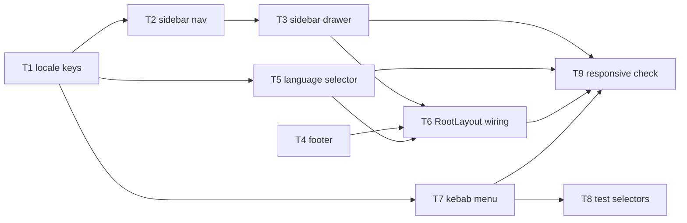

# Epic — change-request: web-shell-navigation

> **Change record:** [change.md](../change.md) · **Spec:** [spec.md](../spec.md) · **Design:** [sad.md](../sad.md) · **Design handoff:** [design-handoff.md](../design-handoff.md)

## Goal

Ship the persistent header + sidebar + footer authenticated shell, the single kebab action menu
per member row, and the header language selector described in `spec.md` §2, replacing the
header-only shell, the three per-row icon buttons, and the absence of a language control.

## Scope

- **In:** `apps/web/src/shared/layouts/` (new `Sidebar.tsx`, `Footer.tsx`, `LanguageSelector.tsx`,
  amended `RootLayout.tsx`), `MemberList.tsx` row actions, `en`/`uk` `common`/`access` locale keys.
- **Out:** any backend, contract, or persisted-data surface (spec.md §4: N/A); `apps/web/src/i18n.ts`
  and `shared/constants/routes.ts` (consumed read-only); the auth-route and chrome-less `RootLayout`
  branches (CR-RG-03, CR-RG-04); `EditEmailDialog`/`ResetPasswordDialog`/`DeleteMemberDialog`
  internals (only their trigger affordance moves); a new active-route visual indicator (spec.md §3).
- **Explicitly deferred to `ship`, not this task set:** CR-AC-08's canonical reconciliation of
  `docs/features/users-management/design-handoff.md` and `docs/features/access/design-handoff.md`.
  Per `spec.md` §5 CR-AC-08 and `change.md` §6 step 6/§8, that edit is a post-PASS shipping step and
  the work-item invariants (`work-item.md`) forbid a change request from touching feature-canonical
  documentation before review PASS — so no task here performs it. The five named frames it requires
  already exist and are approved in `design-handoff.md` at this work-item root.

## Task map

## Tasks

See [tracker.md](./tracker.md) for status. Machine contract: [tasks.json](../tasks.json).

| #   | Task                                      | Layer | Blocked by     | DoD (short)                                                       |
| --- | ----------------------------------------- | ----- | -------------- | ----------------------------------------------------------------- |
| T1  | Shell/menu/selector locale keys           | ui    | —              | New keys added, obsolete keys removed, en/uk parity holds         |
| T2  | Sidebar persistent nav list               | ui    | T1             | Dashboard always, Access gated, loading-window behavior preserved |
| T3  | Sidebar off-canvas drawer                 | ui    | T2             | Drawer traps focus, dismisses 3 ways, returns focus to toggle     |
| T4  | Footer landmark                           | ui    | —              | Non-interactive `<footer>` landmark renders at every breakpoint   |
| T5  | LanguageSelector component                | ui    | T1             | Reflects `i18n.resolvedLanguage`, calls `changeLanguage()`        |
| T6  | RootLayout authenticated-branch wiring    | ui    | T3, T4, T5     | New shell composes only in the authenticated branch               |
| T7  | MemberList kebab trigger and menu         | ui    | T1             | One trigger per eligible row, same handlers/dialogs fire          |
| T8  | AccessAdministration test selector update | tests | T7             | Existing regression suite passes against the new trigger          |
| T9  | Responsive/hit-target verification        | tests | T3, T5, T6, T7 | 390px/640px/1440px NFR table rows verified                        |

## Risks / Hard rules

- Server-side authorization, capability projection, and dialog/handler wiring must not change
  (CR-RG-01, CR-RG-02) — every kebab-menu selection must invoke the exact existing callback.
- The auth-route and chrome-less `RootLayout` branches must render byte-for-byte as today
  (CR-RG-03, CR-RG-04) — no task may touch those branches.
- No new Redux slice, no new i18next namespace, and no telemetry (sad.md §2) — drawer/menu/selector
  open state stays local `useState`.
- CR-AC-08 has no task here by design (see Scope above) — do not add one during implementation.
