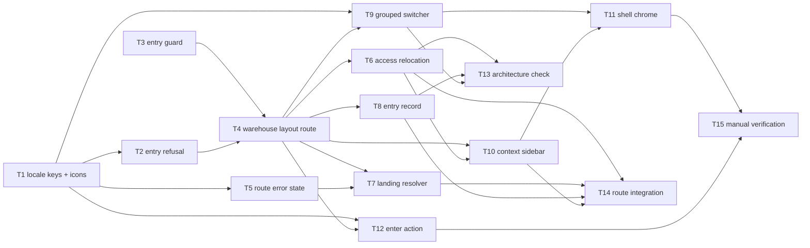

# Epic — change-request: workspace-warehouse

> **Change record:** [change.md](../change.md) · **Spec:** [spec.md](../spec.md) · **Design:** [sad.md](../sad.md) · **ADR:** [0001](../adr/0001-warehouse-view-as-a-route-established-context.md) · **Design handoff:** [design-handoff.md](../design-handoff.md)

## Goal

Separate the web surface along the shipped Workspace boundary: a Workspace view at `/workspace` and a
Warehouse view entered explicitly at `/warehouses/:warehouseId/…`, chosen through one grouped
switcher, with `/` becoming the landing resolver. The Warehouse every Warehouse-scoped screen
operates on stops being the stored `effectiveWarehouseId` and becomes the address, so an actor always
knows which site they are acting on and can link to it (spec.md §2).

## Scope

- **In:** `apps/web/src` only — the route tree (`router.ts`, `shared/constants/routes.ts`,
  `routes/warehouse.route.tsx`, `routes/catch-all.route.tsx`, `modules/{access,home,warehouse}`),
  entry and landing rules (`guards/warehouse-entry.guard.ts`, `guards/landing.guard.ts`), Warehouse
  resolution (`shared/hooks/useEnteredWarehouse.ts`, `usePermissions.ts`), the shell
  (`RootLayout.tsx`, `Sidebar.tsx`, `WarehouseSwitcher.tsx`, `WarehouseLayout.tsx`), the two refusal
  and error states, the entry record and its middleware allowlist, the Workspace warehouses tab's
  Enter action, `en`/`uk` `common`/`workspace` keys, and the `effectiveWarehouseId` architecture
  check.
- **Out:** `apps/server` and `packages/*` in full — no endpoint, contract, schema or migration
  changes (sad.md §3, §7); `PUT /workspace/active-warehouse`, its column and the server's derivation
  of `effectiveWarehouseId`; the `/workspace` destination's content, tabs and route guard
  (CR-RG-05); the access surface's internals — it moves address, not shape;
  `PermissionGate`/`WorkspaceGate` (consumed, not modified); `WarehouseDetailPane.tsx` (sad.md §5);
  header chrome, footer, language selector and drawer behavior beyond the two stated overrides
  (CR-RG-06); any new Warehouse-level capability, and any `/access` redirect shim (spec.md §3).
- **Explicitly deferred to `ship`, not this task set:** **CR-AC-15**, the canonical reconciliation of
  the seven rows of [`change.md` §8](../change.md#8-canonical-reconciliation-after-pass) —
  `workspaces/spec.md`, `web-shell-navigation/spec.md`, the two feature `design-handoff.md` files and
  `frontend-architecture.md`. Per CR-AC-15 itself and `change.md` §6 step 9 this is a post-PASS
  shipping action, and the work-item invariants forbid a change request from editing feature-canonical
  documentation before review PASS. No task here performs it. The twelve frames it references are
  already approved in [`design-handoff.md`](../design-handoff.md) at this work-item root.

## Task map

Three branches start in parallel: T1 (presentation assets), T3 (the pure entry guard), and — once T4
lands — the four independent consumers T6, T7, T8 and T9. T12 is independent of the whole shell
branch.

## Tasks

See [tracker.md](./tracker.md) for status. Machine contract: [tasks.json](../tasks.json).

| #   | Task                                                                                      | Layer  | Blocked by      | DoD (short)                                                                          |
| --- | ----------------------------------------------------------------------------------------- | ------ | --------------- | ------------------------------------------------------------------------------------ |
| T1  | [Locale keys + two icons](./locale-keys-and-icons.md)                                     | ui     | —               | New `common`/`workspace` keys in `en`+`uk` with parity; `log-in`/`layout-grid` icons |
| T2  | [WarehouseEntryRefusal](./warehouse-entry-refusal.md)                                     | ui     | T1              | Both refusals by `reason`; non-disclosing branch identical whatever the id           |
| T3  | [resolveWarehouseEntry guard](./warehouse-entry-guard.md)                                 | app    | —               | Four refusal cases identical, archived distinguished, never throws a redirect        |
| T4  | [Warehouse layout route](./warehouse-layout-route.md)                                     | wiring | T2, T3          | Layout resolves entry once, publishes the verdict; three router behaviors pinned     |
| T5  | [RouteErrorState](./route-error-state.md)                                                 | ui     | T1              | Standard route error state with a retry that re-runs the failed load                 |
| T6  | [Access relocation + addressed permissions](./relocate-access-and-address-permissions.md) | app    | T4              | `useCurrentPermissions` reads the address; `ROUTES.ACCESS` removed                   |
| T7  | [Landing resolver + not-found](./landing-resolver-and-not-found.md)                       | app    | T4, T5          | Three rules in order, one navigation, error state ≠ no-context state                 |
| T8  | [Entry record](./record-warehouse-entry.md)                                               | app    | T4              | Writes only on a changed entry; a failed write never blocks or alerts                |
| T9  | [Grouped context switcher](./grouped-context-switcher.md)                                 | ui     | T1, T4          | Grouped rows navigate; inert Workspace row; messages render beside the control       |
| T10 | [Context-selected sidebar](./context-selected-sidebar.md)                                 | ui     | T4, T6          | Warehouse list / Workspace list / no list, with the predicate reused verbatim        |
| T11 | [Shell chrome wiring](./shell-chrome-wiring.md)                                           | ui     | T9, T10         | No drawer toggle without a list; every other chrome control unchanged                |
| T12 | [Warehouses-tab Enter action](./warehouses-tab-enter-action.md)                           | ui     | T1, T4          | Enter on membership rows only, hidden elsewhere, outside the selection button        |
| T13 | [Architecture check](./effective-warehouse-architecture-check.md)                         | wiring | T6, T8, T9      | ESLint fails on a fourth `effectiveWarehouseId` reference                            |
| T14 | [Route-integration coverage](./route-integration-coverage.md)                             | tests  | T6, T7, T8, T10 | Two tabs, refusals, not-found, no-eviction and admitted-member cases pass            |
| T15 | [Responsive + latency verification](./responsive-and-entry-latency-verification.md)       | tests  | T11, T12        | 390px fit and five entry runs ≤ 250 ms recorded                                      |

## Risks / Hard rules

- **No authorization rule, Permission set, guard predicate, endpoint or server behavior may change**
  (CR-RG-01, CR-RG-05, spec.md §3). `workspaceAdministrationPermissionIds`, `hasWorkspacePermission`,
  the `ROLES_WATCH ∪ USERS_WATCH` `PermissionGate`, `requireAuth` and `requireWorkspaceCapability`
  are consumed exactly as they exist (sad.md §4.9). Any task that rewrites one has gone wrong.
- **A refusal never redirects and never discloses** (CR-AC-07). The four non-membership cases must be
  byte-identical, `:warehouseId` must not be shape-validated before the membership lookup, and no
  refusal may reach the landing resolver. Abort threshold in `change.md` §6.
- **Entry is resolved at entry, not continuously** (ADR 0001, CR-AC-20). Turning
  `useEnteredWarehouse` into a cache-derived hook would silently evict an actor working inside an
  Warehouse that was just archived. T14 pins this with a refetch test.
- **Exactly one navigation resolves landing, and nobody bounces between `/` and `/workspace`**
  (CR-AC-08, CR-RG-05). The landing rule and the Workspace guard read the identical Permission set.
- **The stored selection is presentation state** (CR-AC-09): never an authorization input, never a
  row marker, never a screen's Warehouse, and its write can never block or reverse the entry it
  records. T13's allowlist is what keeps this true over time.
- **Two compile-coupled lanes.** T4 and T6 share `shared/constants/routes.ts` and `router.ts` — T4
  only adds constants, T6 removes `ROUTES.ACCESS` together with every reference in the same change,
  so neither lands red. T6 and T10 share `Sidebar.tsx`: T6 re-addresses the Access link so the file
  compiles, T10 makes the list context-selected. `implement` serializes both lanes on the overlapping
  `files_hint`.
- **HeroUI v3 plus `@heroui/styles` tokens only** (sad.md §2). No parallel component system and no
  detached lookalike of the switcher, its rows or the sidebar items.
- **No new namespace, no new design variable, no telemetry** (spec.md §6, design-handoff.md §Tokens,
  `AGENTS.md`).
- **Do not edit any canonical feature document.** `workspaces/spec.md`,
  `web-shell-navigation/spec.md`, the two feature `design-handoff.md` files and
  `frontend-architecture.md` are reconciled at ship (CR-AC-15), and the two `supersedes_at_ship`
  frames in `app.pen` are archived then, not now.
