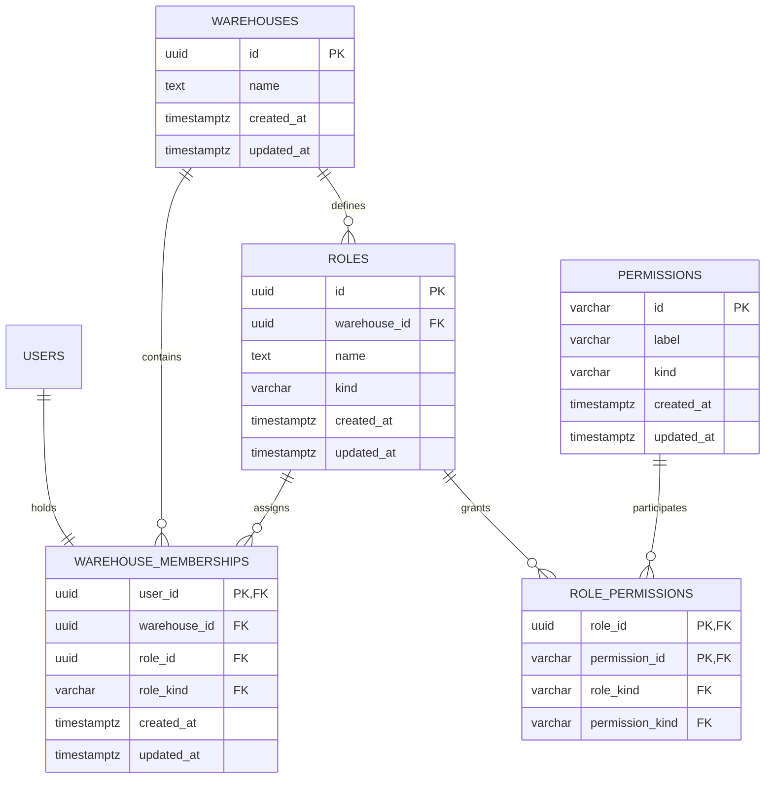

# Data model — access

This model specializes the PostgreSQL/TypeORM baseline in
[`docs/system/server-architecture.md`](../../system/server-architecture.md), the system
[`sad.md`](../../system/sad.md), and the accepted
[`PostgreSQL/TypeORM ADR`](../../system/adr/21-07-2026-postgresql-with-typeorm.md). TypeORM entities
and specialized repositories remain under `apps/server/src/shared/domain`, feature mappers remain
above the repository boundary, schema changes use reviewed migrations, and runtime `synchronize`
remains `false`.

Access uses a dedicated one-to-one membership table rather than adding `warehouse_id` and
`role_id` to `users`. The table makes the membership aggregate explicit and permits composite
foreign keys to prove that a selected Role belongs to the same Warehouse. The approved deployment
precondition says no existing production Users require backfill. Promotion must verify
`SELECT count(*) FROM users` returns zero before applying the live form of this migration; if it
does not, implementation must replace this migration with an expand/backfill/contract rollout.

## ER diagram

## Entities

All entity IDs are application-generated UUIDs, matching the implemented auth schema. Warehouse
and Role names use PostgreSQL `text COLLATE "C"`: equality and uniqueness are bytewise,
case-sensitive, and do not normalize submitted Unicode. The server value object remains
authoritative for trimming, rejecting control/format characters, and counting at most 100
user-perceived characters with `Intl.Segmenter` grapheme segmentation. Database checks backstop
non-empty, already-trimmed storage but deliberately do not substitute code-point length for the
specified grapheme count.

### `warehouses`

| Column       | Type        | Constraints                              | Notes                                               |
| ------------ | ----------- | ---------------------------------------- | --------------------------------------------------- |
| `id`         | UUID        | PK                                       | Application-generated Warehouse identity.           |
| `name`       | TEXT        | NOT NULL, `COLLATE "C"`, non-empty CHECK | Submitted Unicode after application-level trimming. |
| `created_at` | TIMESTAMPTZ | NOT NULL, DEFAULT `CURRENT_TIMESTAMP`    | Registration provisioning time.                     |
| `updated_at` | TIMESTAMPTZ | NOT NULL, DEFAULT `CURRENT_TIMESTAMP`    | Set explicitly by persistence writes.               |

**Aggregate root:** root.

**Access patterns:** lock one Warehouse by ID before Role replacement or manager transfer →
primary key `warehouses_pkey`.

**Constraints:** Warehouse names are intentionally not unique. `name` must be non-empty and equal
to `btrim(name)`; full Unicode validation is performed before persistence.

### `permissions`

| Column       | Type         | Constraints                                 | Notes                                            |
| ------------ | ------------ | ------------------------------------------- | ------------------------------------------------ |
| `id`         | VARCHAR(64)  | PK, stable identifier CHECK                 | For example `ROLES:CREATE`; never user-editable. |
| `label`      | VARCHAR(100) | NOT NULL, non-empty CHECK                   | System-managed catalogue label.                  |
| `kind`       | VARCHAR(16)  | NOT NULL, CHECK in `assignable`, `reserved` | Governs custom-Role eligibility.                 |
| `created_at` | TIMESTAMPTZ  | NOT NULL, DEFAULT `CURRENT_TIMESTAMP`       | Catalogue introduction time.                     |
| `updated_at` | TIMESTAMPTZ  | NOT NULL, DEFAULT `CURRENT_TIMESTAMP`       | Set by explicit catalogue migrations.            |

**Aggregate root:** system Permission catalogue.

**Access patterns:** resolve or validate submitted Permission identifiers → primary key; list
assignable catalogue entries ordered by identifier → index `idx_permissions_kind_id`.

**Constraints:** IDs are uppercase namespace/action pairs (`^[A-Z][A-Z0-9_]*:[A-Z][A-Z0-9_]*$`).
The composite uniqueness on `(id, kind)` supports a foreign key that carries catalogue
classification into Role membership.

### `roles`

| Column         | Type        | Constraints                                      | Notes                                               |
| -------------- | ----------- | ------------------------------------------------ | --------------------------------------------------- |
| `id`           | UUID        | PK                                               | Application-generated Role identity.                |
| `warehouse_id` | UUID        | NOT NULL, FK → `warehouses(id)`                  | Immutable owning Warehouse.                         |
| `name`         | TEXT        | NOT NULL, `COLLATE "C"`, non-empty CHECK         | Exact, case-sensitive Warehouse-local display name. |
| `kind`         | VARCHAR(24) | NOT NULL, CHECK in `custom`, `warehouse_manager` | Protected lifecycle discriminator.                  |
| `created_at`   | TIMESTAMPTZ | NOT NULL, DEFAULT `CURRENT_TIMESTAMP`            | Role creation time.                                 |
| `updated_at`   | TIMESTAMPTZ | NOT NULL, DEFAULT `CURRENT_TIMESTAMP`            | Permission or name update time.                     |

**Aggregate root:** `warehouses`.

**Access patterns:** list current-Warehouse Roles ordered by name and ID → unique index
`uq_roles_warehouse_name`; resolve a Role under actor scope → unique constraint
`uq_roles_id_warehouse_kind`; find the protected Role → partial unique index
`uq_roles_one_manager_per_warehouse`.

**Constraints:** `(warehouse_id, name)` is bytewise unique, preserving differently-cased and
differently-normalized names as distinct. A partial unique index permits at most one protected
manager Role per Warehouse. Creation provisioning supplies one; a database constraint cannot
require at least one child row for every parent, so manager Role deletion is also rejected by the
domain and checked by reconciliation.

### `role_permissions`

| Column            | Type        | Constraints                                | Notes                                   |
| ----------------- | ----------- | ------------------------------------------ | --------------------------------------- |
| `role_id`         | UUID        | PK, composite FK → `roles(id, kind)`       | Grant-owning Role.                      |
| `permission_id`   | VARCHAR(64) | PK, composite FK → `permissions(id, kind)` | Granted catalogue Permission.           |
| `role_kind`       | VARCHAR(24) | NOT NULL                                   | Constraint-carried Role classification. |
| `permission_kind` | VARCHAR(16) | NOT NULL                                   | Constraint-carried Permission class.    |

**Aggregate root:** `roles`.

**Access patterns:** resolve whether a Role grants one required Permission → primary key
`role_permissions_pkey`; list Permission membership for Roles → the same role-leading primary key;
find all protected Roles affected by an explicit catalogue update → index
`idx_role_permissions_permission_id` plus `role_kind` predicate.

**Constraints:** composite foreign keys prevent the carried classifications from drifting. CHECK
`role_kind = 'warehouse_manager' OR permission_kind = 'assignable'` prevents a reserved Permission
from ever being granted to a custom Role. Catalogue migrations explicitly add new Permissions to
all protected Roles; completeness of every manager Permission set is verified operationally
because it is a cross-row, release-specific rule.

### `warehouse_memberships`

| Column         | Type        | Constraints                                              | Notes                                    |
| -------------- | ----------- | -------------------------------------------------------- | ---------------------------------------- |
| `user_id`      | UUID        | PK, FK → `users(id)`                                     | Exactly zero or one membership per User. |
| `warehouse_id` | UUID        | NOT NULL, FK → `warehouses(id)`                          | Member scope.                            |
| `role_id`      | UUID        | NOT NULL                                                 | Assigned Role.                           |
| `role_kind`    | VARCHAR(24) | NOT NULL, composite FK → `roles(id, warehouse_id, kind)` | Proves same-Warehouse Role assignment.   |
| `created_at`   | TIMESTAMPTZ | NOT NULL, DEFAULT `CURRENT_TIMESTAMP`                    | Initial assignment time.                 |
| `updated_at`   | TIMESTAMPTZ | NOT NULL, DEFAULT `CURRENT_TIMESTAMP`                    | Latest assignment/manager-transfer time. |

**Aggregate root:** `warehouses` membership aggregate; `users` owns the one-to-one identity edge.

**Access patterns:** fresh access-principal lookup by authenticated User → primary key; list
members and assignments for the current Warehouse in deterministic User order → index
`idx_warehouse_memberships_warehouse_user`; lock/reassign every member of a deleted Role → index
`idx_warehouse_memberships_role_id`; resolve or lock the current manager → partial unique index
`uq_warehouse_memberships_one_manager`.

**Constraints:** the composite Role foreign key proves Role and membership Warehouse equality.
The partial unique index allows at most one manager assignment per Warehouse. Registration creates
the first manager membership in the same transaction. Manager transfer locks the Warehouse row,
then performs a single `UPDATE ... CASE` over the two memberships so the statement transitions
directly between valid states. Domain rules forbid ordinary reassignment of either side of the
protected assignment; reconciliation detects the unexpressible zero-manager case.

## Indexes

Unique constraints create their corresponding PostgreSQL indexes.

| Index                                      | Columns / predicate                                    | Query it serves                                                             |
| ------------------------------------------ | ------------------------------------------------------ | --------------------------------------------------------------------------- |
| `idx_permissions_kind_id`                  | `kind, id`                                             | Bounded assignable-catalogue read in SAD §6.5 and AC-20.                    |
| `uq_roles_warehouse_name`                  | `warehouse_id, name` (unique)                          | Exact duplicate check and deterministic Role listing in AC-03–AC-06b/AC-20. |
| `uq_roles_id_kind`                         | `id, kind` (unique)                                    | Classification-safe Role-Permission foreign key.                            |
| `uq_roles_id_warehouse_kind`               | `id, warehouse_id, kind` (unique)                      | Same-Warehouse assignment lookup and foreign key in SAD §6.2–6.4.           |
| `uq_roles_one_manager_per_warehouse`       | `warehouse_id` where `kind = 'warehouse_manager'`      | Protected Role lookup and at-most-one invariant in AC-07/AC-13.             |
| `idx_role_permissions_permission_id`       | `permission_id, role_id`                               | Catalogue-update reconciliation and reverse Permission membership lookup.   |
| `idx_warehouse_memberships_warehouse_user` | `warehouse_id, user_id`                                | Member/assignment read under `USERS:WATCH` in AC-21.                        |
| `idx_warehouse_memberships_role_id`        | `role_id`                                              | Lock and replace all assignments during Role deletion in SAD §6.3.          |
| `uq_warehouse_memberships_one_manager`     | `warehouse_id` where `role_kind = 'warehouse_manager'` | Manager lookup, transfer locking, and at-most-one assignment in SAD §6.4.   |

The membership primary key serves the authorization hot path: User → membership → Role → the
required `(role_id, permission_id)` grant. Every foreign key is indexed either by a primary/unique
index or an explicit serving index. All new tables are empty except the nine-row system catalogue,
so concurrent index creation is unnecessary and the staged migration stays transactional.

## Repository boundaries and transaction behavior

- `AccessPrincipalRepository.resolveRequiredPermission` joins membership, Role, and the requested
  Role-Permission row from the `user_id` primary key and returns only persistence-oriented scope.
- `AccessReadRepository.listRolesAndPermissions` and `listMembersAndAssignments` constrain every
  query by `warehouse_id`, apply deterministic ordering, and implement the bounds chosen by API.
- `RoleLifecycleRepository` owns scoped Role creation/update, member assignment, and the atomic
  assigned-Role replacement operation; it never exposes TypeORM query builders.
- `ManagerTransferRepository.transfer` locks the Warehouse row first, locks both membership rows,
  rechecks their composite Role relations, and updates both assignments in one statement.
- `AccessProvisioningRepository.provisionInitialAccess` joins the outer registration transaction
  and inserts Warehouse, protected Role, its catalogue grants, and membership. It fails if any
  required Permission identifier is absent.

All lifecycle commands use the existing complete-use-case transaction context. Operations that
can contend on access lifecycle state lock the Warehouse row first, establishing one lock order.
Role deletion then locks source/replacement Roles and affected memberships; transfer locks the
manager/recipient memberships and replacement Role. Foreign-key or uniqueness conflicts map to
stable application errors. No migration step is non-transactional.

## Test fixtures

- `buildWarehouse(overrides)` — creates a valid Warehouse with a Unicode-safe name.
- `buildPermission(overrides)` — creates an assignable catalogue Permission by default.
- `buildRole(overrides)` — creates a Warehouse-local custom Role; protected kind is explicit.
- `buildWarehouseMembership(overrides)` — pairs a User with a same-Warehouse Role.
- `persistWarehouseAccessGraph(overrides)` — persists Warehouse, Roles, grants, and memberships in
  one integration-test transaction using synthetic IDs and `example.test` identities.

Fixtures belong in colocated tests or `apps/server/src/test/factories`; no personal data or
real-looking identity is placed in migrations.
