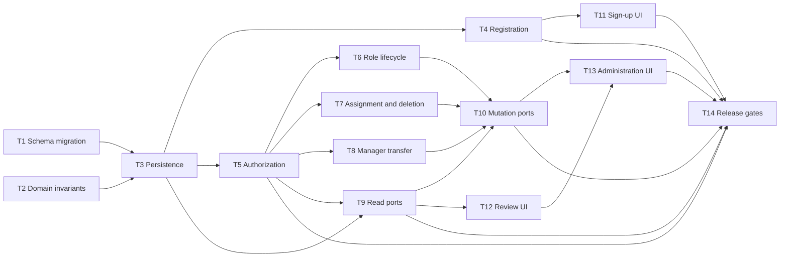

# Epic — access

> **Spec:** [spec.md](../spec.md) · **Design:** [sad.md](../sad.md) · **Data model:** [data-model.md](../data-model.md) · **API:** [openapi.yaml](../contracts/openapi.yaml) · **UI:** [design-handoff.md](../design-handoff.md) · **ADRs:** none required by [sad.md §9](../sad.md)

## Goal

Deliver Warehouse-scoped authorization, custom Role administration, and protected manager transfer across the server and approved web experience. Registration becomes one atomic identity-and-access outcome, while every subsequent decision uses fresh Permission and Warehouse ownership data.

## Scope

- **In:** access schema and catalogue, domain rules, persistence, registration provisioning, authorization guard, access REST contracts, responsive access administration UI, and security/performance gates.
- **Out:** member creation, Location authorization, user-managed Permission definitions, multiple Warehouse memberships, and multiple concurrent Roles, per [spec.md §3](../spec.md).

## Task map

## Tasks

See [tracker.md](./tracker.md) for status. Machine contract: [tasks.json](../tasks.json).

| #   | Task                                                         | Layer     | Blocked by                | DoD (short)                                           |
| --- | ------------------------------------------------------------ | --------- | ------------------------- | ----------------------------------------------------- |
| T1  | Promote the access schema and Permission catalogue migration | migration | —                         | Migration and catalogue constraints apply and revert. |
| T2  | Implement access domain invariants and Unicode names         | domain    | —                         | Domain invariant tests pass.                          |
| T3  | Implement access persistence entities and repositories       | infra     | T1, T2                    | Scoped and atomic repository integration tests pass.  |
| T4  | Extend registration with atomic Warehouse provisioning       | app       | T3                        | Registration commits or rolls back the full outcome.  |
| T5  | Enforce fresh Warehouse-scoped authorization                 | wiring    | T3                        | Fresh authority and coverage tests pass.              |
| T6  | Implement custom Role lifecycle commands                     | app       | T3, T5                    | Role lifecycle command tests pass.                    |
| T7  | Implement member assignment and atomic Role deletion         | app       | T3, T5                    | Assignment/deletion transaction tests pass.           |
| T8  | Implement atomic Warehouse Manager transfer                  | app       | T3, T5                    | Manager transfer concurrency tests pass.              |
| T9  | Expose scoped access read endpoints                          | ports     | T3, T5                    | Read contract and REST tests pass.                    |
| T10 | Expose access mutation endpoints and normalized failures     | ports     | T6, T7, T8, T9            | Mutation contract and REST tests pass.                |
| T11 | Add Warehouse registration to the approved sign-up UI        | ui        | T4                        | Approved responsive registration tests pass.          |
| T12 | Build the approved access review workspace                   | ui        | T9                        | Partial-authority responsive route tests pass.        |
| T13 | Build approved access administration workflows               | ui        | T10, T12                  | Approved responsive workflow tests pass.              |
| T14 | Gate access security, atomicity, and performance             | tests     | T4, T5, T9, T10, T11, T13 | All release thresholds pass.                          |

## Risks / Hard rules

- Permission never overrides Warehouse ownership; actor scope is server-derived and cross-Warehouse failures do not disclose resource existence ([spec.md §6.1](../spec.md), [sad.md §8](../sad.md)).
- Do not store effective Permission sets in sessions, cookies, or process caches; revocation affects the next decision ([sad.md §4 and §8](../sad.md)).
- Registration, assigned-Role deletion, and manager transfer each have one complete-use-case transaction boundary ([sad.md §6](../sad.md)).
- The protected manager Role and reserved Permission cannot enter ordinary Role mutation or assignment paths ([spec.md §5](../spec.md)).
- UI work must reuse the approved frames `f4Icg`, `jtBOB`, `W48Rk`, and `G0Yvp`, HeroUI primitives, semantic tokens, existing feedback adapters, and centralized i18n; route visibility is advisory only ([design-handoff.md](../design-handoff.md)).
- Coding agents must add no telemetry; the NFR gate may use existing structured logging and test-side measurements only.
