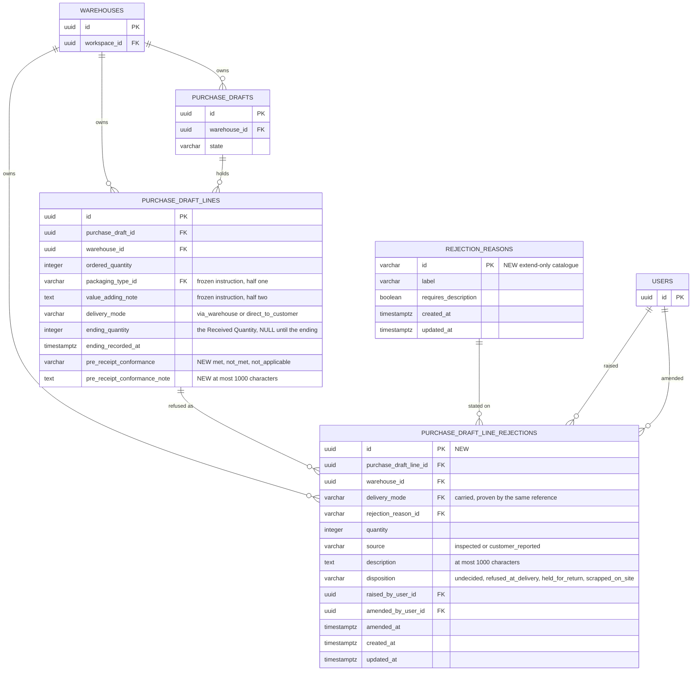

# Data model — arrival-inspection

Two new relations, two columns and one composite reference target added to a shipped relation that
already carries rows, and **no new member-writable quantity anywhere**. This model inherits the
persistence architecture in
[`docs/system/server-architecture.md`](../../system/server-architecture.md) and
[ADR 21-07 PostgreSQL persistence with TypeORM](../../system/adr/21-07-2026-postgresql-with-typeorm.md)
without specialising it: PostgreSQL, TypeORM entities in `shared/domain/entities/`, specialized
concrete repositories in `shared/domain/repositories/`, reviewed forward-only migration classes, and
`synchronize` disabled in every environment. Feature domain objects never carry TypeORM decorators
and repositories never return them; mapping happens in each module's `domain/mappers/` above the
repository boundary, per
[Creating a server repository](../../system/guides/creating-a-server-repository.md).

Staged migrations live in [`./migrations/`](./migrations/) and are **not** in the live tree. They
were applied over seeded pre-release rows, reverted with this release's own rows present, and
replayed against a real PostgreSQL server; every constraint below was probed with representative
rows — 41 probes, 41 as expected. See
[`_audit/data-model-2026-09-07.md`](./_audit/data-model-2026-09-07.md), which also records the one
verification this environment could not perform.

Three questions the upstream artifacts routed to this stage are answered here rather than deferred:

- **`spec.md` §8, tenth question — endings recorded before this release.** Its stated default is
  taken and it costs **no branch and no migration**: nothing is backfilled, the Accepted Quantity's
  derivation reads `received − COALESCE(SUM(rejections), 0)` and a historic ending simply has no
  rejections to sum, and the read's one discriminator for "this line carries no Condition Split" is
  `pre_receipt_conformance IS NULL`. Verified on a seeded pre-release ending: `received=100`,
  `accepted=100`, `has_condition_split=false`. See
  [Derived quantities](#derived-quantities-accepted-and-rejected).
- **`sad.md` §11 — `requires_description` as catalogue data or a hard-coded identifier.** Catalogue
  data, as `sad.md` §4 recommends. See [`rejection_reasons`](#rejection_reasons).
- **`sad.md` §7 — whether the derived Accepted Quantity is materialized.** It is not. See
  [Derived quantities](#derived-quantities-accepted-and-rejected).

One rule this model expresses that `sad.md` §7 listed only as something to express **or reject**
turned out to be expressible, and it is the schema's main contribution: a Rejection's Source is
proven to agree with its line's Delivery Mode by the reference itself (AC-25), not by a rule the
command has to remember.

## ER diagram

Only the relations this feature creates or changes are drawn, with the parents each one needs.
`items`, `packaging_types`, `customers`, `purchase_draft_line_links`, `arrival_allocations` and
`purchase_draft_demand_snapshots` are untouched and are omitted; `customer_orders` is untouched too,
its Allocation bound narrowing inside a service rather than in the schema (`sad.md` §4).

## Entities

### `rejection_reasons`

| Column                 | Type         | Constraints                 | Notes                                                        |
| ---------------------- | ------------ | --------------------------- | ------------------------------------------------------------ |
| `id`                   | VARCHAR(32)  | PK, migration-seeded        | The identifier a Rejection **names**; never a copied wording |
| `label`                | VARCHAR(100) | NOT NULL, trimmed non-empty | The catalogue's own wording (AC-06)                          |
| `requires_description` | BOOLEAN      | NOT NULL DEFAULT false      | AC-07 as data, not as a hard-coded identifier                |
| `created_at`           | timestamptz  | NOT NULL DEFAULT now()      |                                                              |
| `updated_at`           | timestamptz  | NOT NULL DEFAULT now()      |                                                              |

**Aggregate root:** root. Workspace-wide system reference data taking no Warehouse scope, exactly as
`packaging_types` does (`sad.md` §6.5).
**Access patterns:** the catalogue whole, ordered by `id` → the primary key. Nothing filters it.
**Constraints:** `chk_rejection_reasons_label_stored_trimmed`.

Ten rows are seeded, from `CONTEXT.md` §Glossary "Rejection Reason": `damaged_in_transit`,
`damaged_by_packing`, `quality_defect`, `wrong_item_supplied`, `short_within_packaging`,
`packaging_not_as_instructed`, `value_adding_note_not_applied`, `shelf_life_insufficient`,
`documentation_missing`, `unfit_other`. `unfit_other` is the only one carrying
`requires_description`.

**This is the `packaging_types` shape with one rule added and one removed.** The rule added is
extend-only, and it is why a Rejection stores the identifier rather than a snapshot of the wording:
because no wording ever changes beneath a recorded Rejection, AC-23a needs no frozen column, which is
the exact opposite of the Packaging Type — frozen by value onto a line _precisely because_ it can be
reworded. The rule removed is that nothing freezes this catalogue anywhere.

**`requires_description` is data, and this is the decision `sad.md` §11 asked to be confirmed here.**
It is confirmed. `spec.md` AC-07 names only "unfit — other", so a hard-coded `unfit_other` in domain
code would pass every test written today; it would also make an extend-only catalogue half data and
half code, and would make the next prose-requiring Reason a code change and a release rather than one
migration row. The cost is one boolean column and one catalogue read the ending command already
makes for AC-06.

**Extend-only is a migration convention, and half of it is a database rule anyway.** The half that
is: `fk_purchase_draft_line_rejections_reason` is `ON DELETE RESTRICT`, so a Reason any Rejection
names cannot be deleted by anything — including a migration. _Probed: deleting `damaged_in_transit`
with a Rejection naming it is refused; deleting an unused Reason is permitted._ The half that is not:
nothing in PostgreSQL stops an `UPDATE … SET label = …`, and the only mechanisms that would are a
trigger or a revoked privilege. **This repository has no trigger and one database role**, so adding
either here would be its first, for a rule whose sole author is the migration directory. The
enforcement stays where `sad.md` §10 puts it — an architecture check asserting that no migration
updates or deletes a `rejection_reasons` row — and this is recorded as a deliberate rejection rather
than an omission.

### `purchase_draft_line_rejections`

| Column                   | Type        | Constraints                                                                                                   | Notes                                                      |
| ------------------------ | ----------- | ------------------------------------------------------------------------------------------------------------- | ---------------------------------------------------------- |
| `id`                     | UUID        | PK, app-generated                                                                                             |                                                            |
| `purchase_draft_line_id` | UUID        | NOT NULL                                                                                                      | The line whose ending this refusal is part of              |
| `warehouse_id`           | UUID        | NOT NULL                                                                                                      | Carried for the composite reference and for §6.4's resolve |
| `delivery_mode`          | VARCHAR(24) | NOT NULL                                                                                                      | Carried, and proven by the same reference (AC-25)          |
| `rejection_reason_id`    | VARCHAR(32) | NOT NULL, FK → `rejection_reasons(id)` RESTRICT                                                               | AC-06 as referential integrity                             |
| `quantity`               | INTEGER     | NOT NULL, `> 0`                                                                                               | AC-03; the integer type carries the whole-number half      |
| `source`                 | VARCHAR(24) | NOT NULL, `IN ('inspected','customer_reported')`                                                              | AC-24, AC-25                                               |
| `description`            | TEXT        | NULL, trimmed non-empty when present, `char_length ≤ 1000`                                                    | AC-13, AC-14. Amendable (AC-18b)                           |
| `disposition`            | VARCHAR(24) | NOT NULL DEFAULT `'undecided'`, `IN ('undecided','refused_at_delivery','held_for_return','scrapped_on_site')` | AC-19. Amendable (AC-18)                                   |
| `raised_by_user_id`      | UUID        | NOT NULL, FK → `users(id)` RESTRICT                                                                           | The member who refused                                     |
| `amended_by_user_id`     | UUID        | NULL, FK → `users(id)` RESTRICT                                                                               | Paired with `amended_at`                                   |
| `amended_at`             | timestamptz | NULL                                                                                                          | Paired with `amended_by_user_id`                           |
| `created_at`             | timestamptz | NOT NULL DEFAULT now()                                                                                        | **Is** the time the refusal was raised                     |
| `updated_at`             | timestamptz | NOT NULL DEFAULT now()                                                                                        |                                                            |

**Aggregate root:** `purchase_draft_lines` — a Rejection has no life apart from the line's ending
that carries it, which is why `purchase-drafts` owns it and no second module exists (`sad.md` §4).
**Constraints:**

- Composite FK `(purchase_draft_line_id, warehouse_id, delivery_mode)` →
  `purchase_draft_lines(id, warehouse_id, delivery_mode)` RESTRICT. **One reference proves three
  things**: the line exists, it belongs to the acting Warehouse (AC-26), and its Delivery Mode is the
  one this row claims. It is the shape `ordering` used for
  `uq_purchase_draft_lines_id_draft_warehouse` and `delivery-addresses` for
  `uq_customer_delivery_addresses_id_warehouse`, with one column more.
- `chk_purchase_draft_line_rejections_source_matches_mode` — Inspected with `via_warehouse`,
  Customer-reported with `direct_to_customer`, and nothing else. **This is AC-25 as a schema fact.**
  Together with the reference above, a refusal cannot claim a Source its line's mode does not admit
  and cannot lie about the mode to get one: `spec.md` §7's "0 Rejections carrying the
  customer-reported source on lines delivered to our own dock, at all times" is structural rather than
  a tolerance to monitor. The shape is `chk_purchase_draft_lines_ending_matches_mode`'s, one relation
  further out.
- `uq_purchase_draft_line_rejections_line_reason` UNIQUE `(purchase_draft_line_id,
rejection_reason_id)` — **at most one Rejection per Reason per line** (AC-09), so the quantities
  for a Reason belong together. It is also the access path §6.3 reads a line's Rejections by.
- `chk_purchase_draft_line_rejections_quantity_positive`, `…_source`, `…_disposition` — the value
  domains (AC-03, AC-19).
- `chk_purchase_draft_line_rejections_description_stored_trimmed` and `…_description_length` — two
  checks rather than one, so an over-long description and a blank one are refused by differently
  named constraints and the refusal can be attributed. The bound is `char_length`, not
  `octet_length`: `spec.md` AC-14 says "characters", and a Ukrainian description must not be refused
  at 500 characters for costing two bytes each. _Probed at exactly 1 000 and 1 001 Cyrillic
  characters._
- `chk_purchase_draft_line_rejections_amendment_attribution` — the amending member and the time
  arrive together or not at all (AC-18, AC-18b), the shape
  `chk_purchase_draft_lines_ending_attribution` established.

**Access patterns:** one line's Rejections for §6.3 → `uq_purchase_draft_line_rejections_line_reason`
(verified `Index Scan`); one Rejection by identifier within one Warehouse, `FOR UPDATE`, for §6.4 →
the primary key with `warehouse_id` as a filter (verified `LockRows → Index Scan`).

**`created_at` is the raising time, and there is no `raised_at`.** This follows
`arrival_allocations.allocated_by_user_id`/`created_at` and
`item_stock_adjustments.adjusted_by_user_id`/`created_at`, the repo's two existing attributed rows.
Both columns are NOT NULL, so "the member who raised it and the time they did" needs no pairing
check — unlike the amendment, which is optional and therefore does.

**`amended_at` is not `updated_at` and both are kept.** They hold the same instant on an amended row.
`updated_at` is the ordinary row-touch column every table here carries and is non-null from insert,
which is exactly why it cannot express "this row has been amended, by someone, at a known time".
The pair does, as a check, in the same way the line's ending attribution does.

**Two carried columns, and neither can drift.** `warehouse_id` and `delivery_mode` duplicate the
line's, and both are held honest by the one reference that reads them — the same bargain
`purchase_draft_line_links.purchase_draft_id` already makes and documents. Changing a line's
`delivery_mode` while a Rejection names it is refused by that reference, which is the correct answer:
Rejections exist only after the ending, and an ending is recorded once.

**`purchase_draft_id` is deliberately not carried.** No read named in `sad.md` §6 reaches a Rejection
by draft: §6.3 aggregates per line inside the query that already assembles each line, and §6.4
resolves one row by identifier. A fourth carried column would buy nothing and would need a fourth
column in the composite reference to stay honest.

### `purchase_draft_lines` (changed)

| Column                         | Type        | Constraints                                                         | Notes                        |
| ------------------------------ | ----------- | ------------------------------------------------------------------- | ---------------------------- |
| `pre_receipt_conformance`      | VARCHAR(24) | **New.** NULL, `IN ('met','not_met','not_applicable')`              | AC-15, AC-15a, AC-17, AC-17a |
| `pre_receipt_conformance_note` | TEXT        | **New.** NULL, trimmed non-empty when present, `char_length ≤ 1000` | AC-15, AC-15b. Never amended |

Every other column is exactly as `ordering` and `delivery-addresses` shipped it. **Nothing is
backfilled**, so every ending recorded before this release carries `NULL` in both.

**Constraints:**

- `chk_purchase_draft_lines_pre_receipt_conformance` — the three verdicts the column admits.
- `chk_purchase_draft_lines_pre_receipt_conformance_instruction` — **AC-17 and AC-17a as one schema
  fact.** A line frozen carrying a Packaging Type, a Value-adding Note, or both is judged Met or Not
  met; Not applicable belongs only to a line given neither. Both halves of the frozen instruction
  live on this same row, so the rule is decidable without reading anything else — which is exactly
  why `sad.md` §6.1 step 3 widens the locked-line projection by `packaging_type_id` and
  `value_adding_note` and by nothing else.
- `chk_purchase_draft_lines_conformance_requires_ending` — a judgement exists only where an ending
  recorded something (`ending_recorded_at IS NOT NULL AND ending_quantity > 0`), which is AC-04a's
  "a line where nothing was received records neither" for the conformance half.
- `chk_purchase_draft_lines_conformance_note_shape` — the note never stands without a verdict, and is
  trimmed non-empty when present.
- `chk_purchase_draft_lines_conformance_note_length` — AC-15b, in characters.
- `uq_purchase_draft_lines_id_warehouse_mode` UNIQUE `(id, warehouse_id, delivery_mode)` — the
  composite reference target a Rejection points at. `id` leads, so the constraint is unique by the
  primary key alone and **cannot fail on the populated table**.

**The converse of `…_conformance_requires_ending` is deliberately not a constraint.** "Every ending
that received something carries a judgement" is what `spec.md` §7's first KPI measures, and it is
exactly what the schema must **not** assert: every ending recorded before this release received
something and carries no judgement, and `spec.md` §8's tenth question leaves them untouched. A
constraint stating the converse would refuse the shipped rows the moment it was added. Going forward
the rule is the ending command's, and `spec.md` §7 reads the result as a percentage rather than
assuming it.

## Derived quantities: Accepted and Rejected

**Neither is a column, and this is the decision `sad.md` §7 hands to this stage.** The Rejected
Quantity is `SUM(quantity)` over the line's Rejections; the Accepted Quantity is
`ending_quantity − COALESCE(that sum, 0)`, computed inside the ending command from input it has
already validated, and re-derived on read inside the query that already assembles the line.

Not materialized, for three reasons and one that decides it:

- A Rejection's quantity is immutable and no Rejection may be added after the ending
  (`CONTEXT.md` §Invariants), so the figure is stable the instant it is written. There is no drift
  for a job to repair and no reconciliation to schedule — `sad.md` §8 says so and this model does not
  create the thing it says does not exist.
- The read that needs it is a per-line aggregate over at most ten rows, in a query that is already
  aggregating each line's links and drift (`sad.md` §8). It is not the 250 ms p95 target's cost.
- A stored copy is a second figure that can disagree with the Rejections beside it, and the integrity
  check in `spec.md` §6 would then be checking the copy rather than the split.

And the one that decides it: `spec.md` §6.1's **"Refusal as a route around the Allocation bound"** is
a property precisely because no column holds the Accepted Quantity. A materialized column is a column
that some future write path can set, and the guarantee stops being structural the day it exists.

**The absent case has no branch.** `spec.md` §8's tenth question and `sad.md` §7 both warn that a
pre-release ending carries no Condition Split, so AC-21's read has a case `spec.md` §5 never
describes. In the arithmetic it needs nothing: such a line has no Rejections, the `COALESCE` sums to
zero, and the Accepted Quantity equals the Received Quantity — which is exactly the treatment the
Allocation bound was told to give it. _Verified on the seeded pre-release ending: `received=100`,
`rejected=0`, `accepted=100`._ What the read does need is one discriminator between "no Condition
Split was ever recorded" and "a Condition Split was recorded and refused nothing", and it is
**`pre_receipt_conformance IS NULL`** — not the absence of Rejections, which both cases share. A
nothing-received ending, old or new, also reads as no Condition Split, which is correct for both
(AC-04a). `plan-tests` owns covering the case; `api` owns the shape it takes in the response.

## Indexes

Every index is justified by a named query from `sad.md` §6, and each was confirmed to be the plan
PostgreSQL actually chooses (`_audit` § Plan checks).

| Index                                                    | Columns                                       | Query it serves                                                                                           |
| -------------------------------------------------------- | --------------------------------------------- | --------------------------------------------------------------------------------------------------------- |
| `uq_purchase_draft_line_rejections_line_reason` (unique) | `purchase_draft_line_id, rejection_reason_id` | §6.3 one line's Rejections, inside the query already assembling the line; and AC-09's one-per-Reason rule |
| `uq_purchase_draft_lines_id_warehouse_mode` (unique)     | `id, warehouse_id, delivery_mode`             | Composite reference target only (AC-25, AC-26)                                                            |

Two indexes, and one of them exists to be pointed at. That is the whole addition: §6.4 resolves one
Rejection by identifier on the primary key, and §6.5 reads the catalogue whole.

### Indexes deliberately **not** added

- **`purchase_draft_line_rejections.rejection_reason_id`.** No read filters on it. The catalogue is
  extend-only so no Reason is ever deleted in production, and the only reverse scan is the staged
  migration's own `down`, against a table this release starts empty. `spec.md` §7's "reason
  concentration" and "specific reason" figures are **operator queries** read monthly against the
  deployment's own records — explicitly not instrumentation and bound by no latency target. Add it
  when a product surface filters by Reason; the Rejection Register that would is deferred (`sad.md`
  §3).
- **The attribution foreign keys** `raised_by_user_id` and `amended_by_user_id`. No read filters on
  them, `users` rows are never deleted, and the repo already leaves such foreign keys unindexed —
  the same reasoning `ordering` and `delivery-addresses` recorded.
- **`purchase_draft_lines.pre_receipt_conformance`.** No read filters on it; it is projected with the
  line and used as the read's discriminator once the row is already in hand.

## Constraints the model deliberately does **not** express

Named here so a later reviewer does not "fix" their absence. `sad.md` §7 asks for each of its listed
constraints to be expressed **or explicitly rejected as inexpressible**; these are the rejections,
and each names what enforces it instead.

- **"A line's Rejections never total more than its Received Quantity" (AC-02).** A cross-row
  aggregate, which no `CHECK` can compute. Enforced in the ending command against the line under the
  lock §6.1 step 3 already takes, in the same pass that collects every other Condition Split
  violation. _Probed: the schema accepts refusals totalling more than the ending quantity; the
  refusal is the command's._
- **"A Rejection exists only on a line whose ending is recorded, and is never added afterwards"
  (AC-04).** Cross-row: the ending lives on `purchase_draft_lines` and a `CHECK` on the Rejection
  cannot read it. Denormalizing the ending onto every Rejection to make it expressible would buy one
  check at the cost of a copy every write would have to keep true. Both halves are the ending
  command's: the Rejections are written in the same transaction and statement set as the ending, and
  the ending's own `ending_recorded_at IS NULL` predicate makes "a line admits one ending" a property
  of the write.
- **"A Rejection's quantity, Reason, Source and line are unwritable after insert."** Column-level
  immutability needs a trigger, and **this repository has none** — introducing the first one for this
  would put a rule in a place no reviewer of this codebase currently reads. Enforced by the narrow
  conditional `UPDATE` in `PurchaseDraftRejectionRepository`, which sets only the description, the
  Disposition and the amendment attribution, plus `sad.md` §10's repository-integration and
  architecture checks.
- **"A Disposition once decided is never returned to Undecided" (AC-18a).** A transition rule: a
  `CHECK` sees only the new row. Enforced as the conditional update `sad.md` §6.4 specifies —
  `… WHERE id = :id AND warehouse_id = :warehouseId AND (disposition = 'undecided' OR
:disposition <> 'undecided')` — whose zero-row result is a typed refusal rather than a silent
  no-op. _Probed: decided → another decision affects one row; decided → undecided affects zero._
- **"A Reason the catalogue marks `requires_description` carries one" (AC-07).** Cross-table: a
  `CHECK` cannot read `rejection_reasons`. Enforced in `ArrivalInspectionService` against the
  catalogue read it already makes for AC-06, which is what keeps the rule data-driven.
- **"A verdict of Met never coexists with a packaging or value-adding-note refusal on the same line"
  (AC-16).** Cross-row, between the line and its Rejections, and evaluated over **the same
  submission** rather than over stored rows. Enforced in the ending command, which holds both halves
  before either is written.
- **"Every ending that received something carries a judgement."** Deliberately absent, and the reason
  is above under [`purchase_draft_lines`](#purchase_draft_lines-changed): the shipped rows would fail
  it.
- **"A note only under a Not met verdict."** Expressible on this row and still not expressed. The
  approved design shows the note field only under Not met
  ([`design-handoff.md`](./design-handoff.md)), and no `AC-*` in `spec.md` §5 names a refusal for a
  note beside Met — so a constraint here would produce an unnamed constraint violation where
  [server error handling](../../system/guides/server-error-handling.md) requires a named predicate
  and a stable `ErrorCode`. The natural home is the request schema, and it is handed to `api`.
- **A database rule making `rejection_reasons` extend-only.** Rejected, with reasoning, under
  [`rejection_reasons`](#rejection_reasons).
- **Nothing connects a Rejection to `items.on_hand_quantity`.** That is `CONTEXT.md`'s last invariant
  expressed as an absence, and it is unchanged from `ordering`.

## Concurrency, locks and transactions

The lock order is `delivery-addresses`', extended rather than replaced (`sad.md` §8): the Purchase
Draft row, then its line, then **that line's Rejections**, then the Customer Orders in ascending
identifier order. This is repository behaviour, not schema, but the two indexes above are what make
each step an indexed lookup rather than a scan.

- Every multi-step outcome is owned by one `@Transactional()` command; repositories join the shared
  transaction context and open none of their own. The ending's transaction is the one it has today,
  widened in what it writes and not split.
- Conditions are re-evaluated against locked rows at the moment the change is recorded: the ending's
  admissibility, the Condition Split, the conformance rules against the frozen instruction, the
  assignment bounds against the derived Accepted Quantity, and the Disposition's eligibility.
- The ending, the last-line closure and the Disposition change are each conditional updates on the
  prior state. Zero affected rows is a typed concurrency refusal, never a silent no-op.
- Database constraints are the final arbiter under concurrency, and
  `uq_purchase_draft_line_rejections_line_reason` especially: two concurrent endings cannot both
  write a Rejection for one Reason on one line, whatever the commands read first.
- Derivation stays write-time-computed and read-time-recomputed with no stored copy, so nothing needs
  reconciliation and no background job exists to write one.
- **PGlite cannot prove any of this.** The integration tier has one backend, so the lock order and the
  conditional-update races are asserted by _shape_. `sad.md` §11 already records that the true races
  stay unproven until a real-PostgreSQL tier exists; this model does not improve on it.

## Repository boundaries

Repositories are specialized around a cohesive persistence operation, live in
`shared/domain/repositories/`, contain no private methods, import nothing from a feature module, and
accept and return shared persistence entities and persistence-oriented values only. `sad.md` §5 names
them; three are worth calling out against the anti-patterns:

- `RejectionReasonCatalogueRepository` **(new)** — lists the catalogue and resolves a stated set of
  identifiers against it in one read, rather than a read per identifier. The
  `PackagingTypeCatalogueRepository` shape with one method more, which is what the ending command's
  AC-06/AC-07 assertion needs.
- `PurchaseDraftRejectionRepository` **(new)** — resolves one Rejection in the acting Warehouse under
  lock **and** applies the amendment as one conditional update whose predicate excludes a return to
  Undecided. The two cannot be separated by another transaction, which is the whole point; a
  zero-row result is the typed refusal AC-18a needs.
- `ArrivalConfirmationRepository` **(extended)** — `lockDraftLineForEnding`'s projection gains
  `packaging_type_id` and `value_adding_note` and **nothing else**. `ordered_quantity` stays
  withheld, which is what keeps `spec.md` §6.1's "Refusal as a route around the Allocation bound" a
  property of the write path; `sad.md` §10's architecture check asserts it. `recordLineEnding` writes
  the ending, the Pre-receipt Conformance and every Rejection of that submission in one statement
  set, keeping the existing `recorded`/`closed` answers and the fixed lock order.
- `PurchaseDraftReadRepository` **(extended)** — each line's Rejections and its Pre-receipt
  Conformance join the correlated per-line aggregation the drift and by-line reads already build, and
  the Accepted and Rejected Quantities are derived in that same query rather than in a second one.

New persistence entities are `RejectionReasonEntity` and `PurchaseDraftLineRejectionEntity`;
`PurchaseDraftLineEntity` gains the two columns above. Following the repo's convention, entities
carry column names and types only — every `CHECK`, `DEFAULT` and collation lives in the migration.
`delivery_mode` and `source` are typed as string unions declared beside their columns, as
`PurchaseDraftLineDeliveryMode` and `CustomerOrderState` already are, so both
`shared/domain/repositories/` and `purchase-drafts` read them without either depending on the other.
Mapping to feature domain objects belongs in `purchase-drafts/domain/mappers/`.

## Security

`spec.md` §6.1 classifies a Rejection confidential: it states that a named Warehouse refused specific
goods on a specific order for a stated reason. Four consequences for this model:

- **Redaction is not a schema concern and must not become one.** `REJECTIONS:WATCH` shapes the
  _projection_ (`sad.md` §4), and the withheld form omits the rejections array **as a property**.
  Nothing here stores a redacted copy, no column exists whose only purpose is to be withheld, and no
  count or total is materialized that could survive a withholding — which is what `spec.md` §6.1
  protects. A `rejection_count` column would be exactly the probeable placeholder the specification
  forbids, and its absence here is deliberate.
- **No index or constraint keys on member-supplied prose.** Neither `description` nor
  `pre_receipt_conformance_note` appears in a unique constraint or an index, so neither can leak
  through an error message naming one. The only uniqueness constraint this feature adds names a line
  identifier and a catalogue identifier, disclosing nothing a reader of the line does not already
  hold.
- **Free text is text.** Both prose columns are stored as submitted and rendered as text, never as
  markup and never as a link. The schema trims them, rejects blanks and bounds them at one thousand
  characters; it does not attempt to police their content. A member who types a driver's name into a
  description puts personal data where `spec.md` §6.1 does not expect it — the classification, not a
  column, is what covers that.
- **Attribution is the audit, and it is the only one.** `raised_by_user_id` with `created_at`, and
  `amended_by_user_id` with `amended_at`, are what make `spec.md` §6.1's "condition as unaudited
  fiction" answerable. `CONTEXT.md` is explicit that this is not a full audit trail, and no history
  relation is introduced to imply one.
- **Test fixtures use `example.test` addresses and placeholder names only.** The staged verification
  used `Acme Ltd`, `1 Depot Road, Springfield` and `member@example.test`; no real-looking name,
  address or contact entered a seed, a fixture or this document.

## Test fixtures

Factories belong in `apps/server/test/factories/`, not in `migrations/`.

- `aRejection(overrides)` — an Inspected refusal of a given Via Warehouse line, Undecided, with a
  catalogue Reason that does not require prose, defaulting to that line's Warehouse and Delivery Mode
  so a cross-Warehouse or wrong-Source case must be written deliberately.
  `aCustomerReportedRejection` takes the Direct to Customer pairing, and `anAmendedRejection` carries
  a decided Disposition with its attribution — so AC-18a's refusal starts from a row that is already
  decided rather than one a test has to decide first.
- `aRejectionReason(overrides)` — a catalogue entry; `aProseRequiringReason` sets
  `requires_description`, so AC-07 is tested against the flag rather than against `unfit_other` by
  name. Neither is used to _add_ a Reason in a test that then asserts the catalogue's contents.
- `aJudgedLine(overrides)` — a line with an ending, a Condition Split and a Pre-receipt Conformance
  consistent with its frozen instruction; `anUninstructedLine` freezes neither a Packaging Type nor a
  Value-adding Note so `not_applicable` is the only legal verdict, and `anInstructedLine` freezes one
  so it is not.
- `aPreReleaseEnding(overrides)` — **the absent case as a first-class factory**: an ending with a
  quantity, a kind and its attribution, and `NULL` in both conformance columns and no Rejections.
  Having it as a factory is what stops AC-21's absent branch from being tested only by accident.
- `aNothingReceivedEnding(overrides)` — `ending_quantity = 0` with neither judgement (AC-04a).

## Migrations

| Staged file                                                                                             | Class                                            | What it does                                                                                                                 |
| ------------------------------------------------------------------------------------------------------- | ------------------------------------------------ | ---------------------------------------------------------------------------------------------------------------------------- |
| [`01-create-arrival-inspection-schema.ts`](./migrations/01-create-arrival-inspection-schema.ts)         | `CreateArrivalInspectionSchema1786800000000`     | 2 tables, 10 seeded catalogue rows, 2 added columns on a populated relation, 13 checks, 4 foreign keys, 2 unique constraints |
| [`02-grant-arrival-inspection-permissions.ts`](./migrations/02-grant-arrival-inspection-permissions.ts) | `GrantArrivalInspectionPermissions1786800100000` | 3 Warehouse Permissions, each `assignable`, granted idempotently to every protected `warehouse_manager` Role                 |

Neither is in the live tree. Promotion is a rename to
`1786800000000-CreateArrivalInspectionSchema.ts` and
`1786800100000-GrantArrivalInspectionPermissions.ts`; the class names already carry those timestamps,
which sort after the last shipped migration (`1786700300000-DropReceivedQuantity`). **No shipped
migration is edited.**

`02` follows `apps/server/migrations/README.md` § Extending a Permission catalogue exactly, and
`1786700200000-GrantDeliveryAddressPermissions` as its model: insert the catalogue rows, then grant
them to the protected Roles that already exist with a `NOT EXISTS`-guarded `INSERT … SELECT`, because
provisioning only granted the set known when each Role was created. All three are `assignable` — none
is reserved, because a Workspace Owner must be able to delegate each to a custom Role. **No Workspace
Permission is added**; nothing here touches the Warehouse record itself.

### Safe evolution against populated relations

`purchase_draft_lines` carries rows. Every change to it here is widening, and none needs
expand / backfill / contract:

1. **The two conformance columns are added nullable and are not backfilled.** That is `spec.md` §8's
   tenth question at its stated default, and it is the reason there is no third migration: every
   ending recorded before this release keeps `NULL` in both, and the Accepted Quantity's derivation
   reads them correctly without a branch.
2. **The five conformance checks are all vacuously true over the shipped rows**, because each is
   guarded by `pre_receipt_conformance IS NULL`. `ADD CONSTRAINT` validates the existing rows and
   passes. _Verified against a populated table, not assumed._
3. **`uq_purchase_draft_lines_id_warehouse_mode` cannot fail**, because `id` leads it and `id` is the
   primary key. Building it takes a brief `SHARE` lock on a populated table — acceptable at the
   `spec.md` §1 scale and inside the migration transaction, the alternative having to run outside it.
   No `CREATE INDEX CONCURRENTLY` is used, and the two indexes on the new relations are created on
   empty tables in the same migration.
4. **Order matters inside `01`.** The unique constraint on the shipped relation is created before
   `purchase_draft_line_rejections`, because it is that Rejection's reference target; the catalogue is
   created and seeded before it too, for the same reason. The `down` reverses exactly, dropping the
   Rejection relation before both.

Nothing is renamed, nothing is dropped, and no column becomes `NOT NULL`. This release therefore has
no counterpart to `delivery-addresses`' deferred contract half, and no migration is held back for a
later task.

### What a revert costs

Both `down` methods fully reverse their `up`, and both were verified by applying, reverting and
replaying against a real server with rows present on both sides. **Neither repairs any data on the way
back**, and that is a property rather than an omission:

- `01`'s revert drops the two relations and the two columns, discarding every judgement this release
  recorded. No shipped row is touched, because none was ever written by it — verified: the seeded
  pre-release ending still reads `100 / arrival` after the revert, and all three seeded lines survive.
- `02`'s revert deletes the grants before the catalogue rows, because `role_permissions` references
  `permissions` with `ON DELETE RESTRICT`. Verified: zero `REJECTIONS:*` rows in either relation
  afterwards.

The cost is stated plainly: reverting `01` **loses the condition data**. It is not recoverable from
anything else in the schema, because nothing else stores it — which is the same trade every
first-release relation in this repository makes.

### Never run `migration:generate` in this repository

`apps/server/package.json` exposes it, and running it against the shipped entities and the shipped
schema produces a migration that **drops every `chk_*` constraint, every column `DEFAULT` and every
`C` collation in the database**. That is not drift: it is the repo's convention that constraints,
defaults and collations live in migrations while entities carry only column names and types.
Migrations here are written by hand — both of these were. `delivery-addresses`' audit records the
scan behind this claim and this release did not re-run it.
