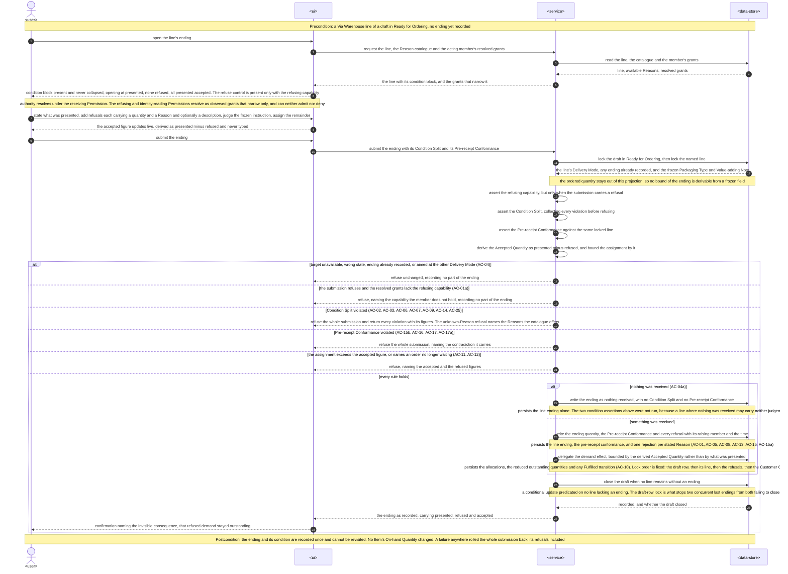
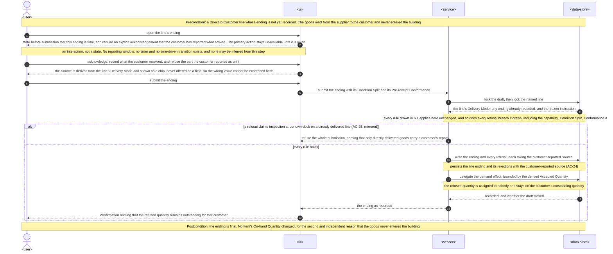
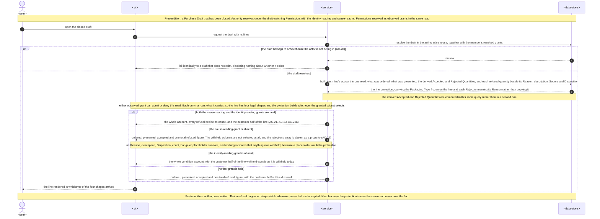
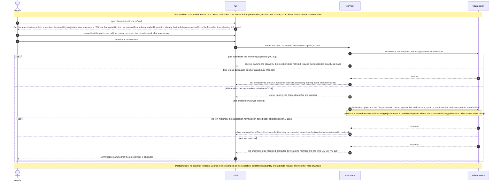
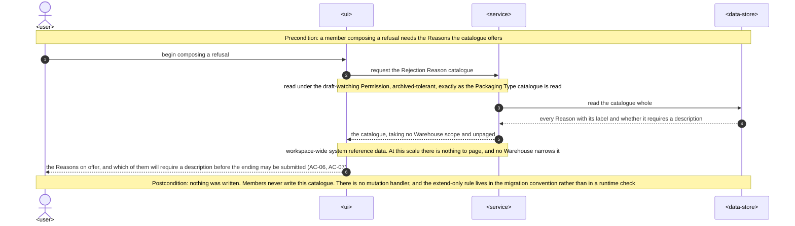

# Software Architecture Description — arrival-inspection

## 1. Context and quality goals

`delivery-addresses` shipped the record this feature attaches to, and it shipped it two releases ago.
`apps/server/src` holds `purchase-drafts` beside `customers`, `customer-orders`, `items`, `access`,
`auth`, `users`, `warehouses` and `workspaces`. A Purchase Draft Line carries an Item, an ordered
quantity, a Packaging Type, a Value-adding Note, a Delivery Mode, a frozen destination and **its own
ending** — `ending_quantity`, `ending_kind`, `ending_recorded_by_user_id`, `ending_recorded_at`,
written once by `ConfirmPurchaseDraftLineArrivalCommand` or `RecordPurchaseDraftLineDeliveryCommand`
inside one transaction that also delegates the demand effect to `customer-orders`'
`DemandAllocationService` and closes the draft on its last line
([ADR 0002](../delivery-addresses/adr/0002-per-line-purchase-draft-endings.md)). What that ending
records is **how much**. Nothing anywhere in the product records **in what state**.

This feature adds the condition dimension to that ending and nowhere else. It introduces one piece of
system reference data (the Rejection Reason catalogue), one child record of a line (the Rejection,
with its Rejection Record), and two judgements written with the ending (the Condition Split and the
Pre-receipt Conformance); it narrows the bound every Allocation draws on from the Received Quantity
to the derived Accepted Quantity; and it adds the first write this product has ever made to a
**Closed** Purchase Draft — the amendment of a Rejection's description or Disposition.

It also does three things this repository has not done before, and each is a reason a rule below is
stated rather than assumed. It is the **first authorization rule whose required Permission set is
decided by what is being written** (`spec.md` §6.1, AC-01a/AC-01b), which
[ADR 0001](./adr/0001-payload-conditional-permission.md) resolves. It is the **first read carrying
two independent observed Permissions** — `CUSTOMERS:WATCH` and `REJECTIONS:WATCH` — and therefore the
first projection with four legal shapes. And it is the **first bound of the ending write path derived
from a frozen field**, which `arrival-confirmation.repository.ts` deliberately made unreachable; §5
and §8 state exactly how much of that deliberate withholding is given up and how much survives.

The architecture must satisfy these quality goals, in priority order:

1. **No refused quantity ever reduces a customer's Outstanding Quantity.** The Accepted Quantity is
   derived — Received Quantity less every Rejection on the line — never stated, and it is the only
   figure an Allocation may draw on. There is no field a member can raise to assign more; the only
   way to assign more is to have refused less, which is recorded and attributable (`spec.md` AC-10,
   AC-11, §6 "Condition-split integrity", §6.1 "Refusal as a route around the Allocation bound";
   `CONTEXT.md` §Invariants).
2. **The ending stays one atomic act.** One line's ending quantity, its Condition Split, its
   Pre-receipt Conformance, every Rejection, every Allocation and every resulting Outstanding
   Quantity are written together or not at all, and a refused submission records **no part** of
   itself (`spec.md` AC-01a, AC-02, §6 "Ending atomicity").
3. **Condition is recorded exactly once, with the ending, and its fixed part never moves.** A
   Rejection's quantity, Reason, Source and line are immutable after recording; no Rejection is
   raised against a line whose ending exists; a Disposition once decided never returns to Undecided;
   and every amendment of a description or Disposition records the acting member and the time
   (`spec.md` AC-04, AC-18, AC-18a, AC-18b, §6 "Condition immutability").
4. **The cause of a refusal is readable only under `REJECTIONS:WATCH`, and its withholding leaves no
   trace.** A member holding `PURCHASE_DRAFTS:WATCH` without it reads ordered, presented, accepted
   and **one** total refused quantity — every Reason, description and Disposition withheld, and with
   them the division of that total into separate refusals, with no count, no placeholder and no
   indication that anything was withheld (`spec.md` AC-22, §6.1 "Supplier and customer disclosure
   through a refusal").
5. **Every capability this feature introduces declares an explicit Permission rule and a Warehouse
   ownership check, reads included** — and that includes the conditional rule whose required set
   depends on what is being written (`spec.md` AC-01a, AC-20, AC-26, §6 "Authorization coverage";
   [ADR 0001](./adr/0001-payload-conditional-permission.md)).
6. **A conformance judgement and a packaging refusal can never disagree, and a line's judgement
   matches the instruction it was frozen with.** Both rules are decided from the line's own locked
   row at the moment the ending is written (`spec.md` AC-16, AC-17, AC-17a, §6 "Conformance
   consistency").
7. **The Rejection Reason catalogue is extended only.** No entry is ever reworded or retired, so a
   Rejection **names** its Reason rather than copying it and a closed draft always reads as the
   catalogue reads (`spec.md` AC-23a, §6 "Catalogue integrity").
8. **The reads stay within `spec.md` §6's targets at the volumes `ordering` already assumes**, with
   every list returned whole; this release adds no list of its own (`spec.md` §1 sixth boundary, §6).

The specification is `Draft` and carries eleven open questions (`spec.md` §8). Four are due **before
`design`** and are treated here: the two-Permission stage question is **resolved in §4 and
[ADR 0001](./adr/0001-payload-conditional-permission.md)**; the post-arrival-damage question and the
existing-Roles question take their stated defaults (§3, §7); and the six-amendments change request
was due before this stage and **has not been raised** — §11 records it as an outstanding gate rather
than treating it as done. Three more are due before `design-ui` and are already answered by the
approved design (§8 "Web state, freshness and accessibility"). All eleven are restated in §11.

The UI approval gate the `web-frontend` surface requires is already satisfied:
[`design-handoff.md`](./design-handoff.md) records **five frames approved on 2026-09-07** with five
published HTML previews ([frontend architecture](../../system/frontend-architecture.md) §"UI design
boundary"). Design ran ahead of this stage; §5, §8 and §11 reconcile its constraints against the
module layout the repository actually ships, and record the one place it left open for `tasks`.

## 2. Constraints inherited from `docs/system`

- The repository stays a browser SPA plus a NestJS modular monolith with shared boundary schemas in
  `packages/contracts` ([architecture map](../../system/architecture-map.md)). **No new container, no
  new runtime, no new deployable, no new third-party dependency, and no new contracts subpath.**
- Server code follows the entity-related module, flat-module, inward-dependency, command/query,
  service-as-extraction and thin-controller boundaries in
  [server architecture](../../system/server-architecture.md) and
  [adding a server module](../../system/guides/adding-a-server-module.md). A module is named for the
  entity whose invariants it enforces, modules never nest, and placement follows the owning-entity
  rule with the scope-of-exercise tiebreak
  ([scope-of-exercise ADR](../../system/adr/18-08-2026-scope-of-exercise-placement-tiebreak.md),
  [domain-owned flat modules](../../system/adr/14-08-2026-domain-owned-flat-modules.md)).
- Authentication and transport-level authorization stay in `shared/guards/`. This feature reuses
  `SessionAuthGuard`, `WarehouseAccessGuard`, `@RequiredPermission`, `@ObservedPermission`,
  `@ArchivedTolerantRead` and `@WriteRateLimited` **unchanged**. It adds **no guard, no decorator, no
  metadata key, no principal field and no second authority vocabulary**; the two-level model is
  untouched ([workspaces ADR 0001](../workspaces/adr/0001-two-level-request-authorization.md),
  [server request authorization](../../system/guides/server-request-authorization.md)). What it does
  change is what a handler's own rules may do with a field the guard already attaches — a proposed
  deviation, recorded below and in [ADR 0001](./adr/0001-payload-conditional-permission.md).
- Exactly one `@RequiredPermission` per handler; a second identifier is silently ignored by the guard
  ([server request authorization](../../system/guides/server-request-authorization.md) §"Declare the
  Permission a handler requires"). This constraint is why §4's central decision exists.
- Persistence stays PostgreSQL through TypeORM. Shared TypeORM entities live in
  `shared/domain/entities/`; specialized concrete repositories live in `shared/domain/repositories/`,
  are shaped around a cohesive persistence operation rather than a table, hold no private methods,
  and never import a feature module
  ([creating a server repository](../../system/guides/creating-a-server-repository.md)). Every schema
  change is a reviewed forward-only migration with runtime synchronization disabled
  ([PostgreSQL/TypeORM ADR](../../system/adr/21-07-2026-postgresql-with-typeorm.md)).
- An atomic operation is owned by one `@Transactional()` command; repositories obtain their manager
  from the shared transaction context and open none of their own.
- Zod owns validation. Web/server shapes live in `packages/contracts/<module>` and are consumed
  through the module subpath; `rest/dtos/` files are thin `createZodDto` adapters that redefine
  nothing ([Zod ADR](../../system/adr/12-07-2026-schema-validation-with-zod.md),
  [adding and using contracts](../../system/guides/adding-and-using-contracts.md)).
- Refusals are named predicates plus named error factories under `<module>/domain/errors/`, asserted
  with `assert`, propagated without local `try/catch`, and mapped once at the global exception filter
  into the shared envelope with a stable `ErrorCode`
  ([server error handling](../../system/guides/server-error-handling.md),
  [error-handling ADR](../../system/adr/24-07-2026-server-error-handling.md)). **No layer catches,
  enriches and rethrows** ([use case boundaries](../../system/guides/server-use-case-boundaries.md)),
  which is why AC-11's message is produced by the bound that refuses it rather than mapped afterwards
  (§4).
- A use case is never a pass-through and a service is an extraction, never a default layer; a service
  exactly one command calls is forbidden, and a stateless helper stays a module-level function
  ([server architecture](../../system/server-architecture.md) §Services,
  [use case boundaries](../../system/guides/server-use-case-boundaries.md)).
- RTK Query owns all server state through the one injected API slice and its shared base query; a
  route awaits the data its destination paints through a module-owned loader that imports no page and
  no component ([frontend architecture](../../system/frontend-architecture.md),
  [RTK Query ADR](../../system/adr/02-08-2026-rtk-query-for-web-api-calls.md)).
- Every web control that depends on authority is a `WarehousePermissionGate`, or a descriptor
  carrying a `permission` field filtered by `usePermittedItems` inside a React Aria collection. There
  is no capability table and no component takes a capability as a prop
  ([declarative permission gates ADR](../../system/adr/19-08-2026-declarative-permission-gates.md)).
- Components call the generated `use<Endpoint>Mutation` hook directly; success toasts are registry
  entries in `shared/alerts/mutation-actions.ts` raised by `mutationFeedbackMiddleware`; the
  field-error policy is the endpoint's `transformErrorResponse`
  ([generated mutation hooks ADR](../../system/adr/19-08-2026-generated-mutation-hooks-in-components.md)).
- A validated modal is `FormModalDialog` and a single-decision modal is `ConfirmAlertDialog`
  ([web dialogs](../../system/guides/web-dialogs.md)); a dialog opened **from a row** goes through
  `useActionDialog` + `ActionDialogHost` with the surface's own `Kind` union
  ([reducer-driven action dialogs ADR](../../system/adr/27-08-2026-reducer-driven-action-dialogs.md),
  [web action dialogs](../../system/guides/web-action-dialogs.md)).
- Components follow one-component-per-file, ownership nesting and the two-hop prop budget, and every
  conditional follows [writing web components](../../system/guides/writing-web-components.md) §6 — no
  `if`/`else if` chain and no element ternary, with `shared/components/Conditional` the only in-JSX
  form ([placing web components](../../system/guides/placing-web-components.md),
  [writing web conditional components](../../system/guides/writing-web-conditional-components.md),
  [placing web hooks](../../system/guides/placing-web-hooks.md),
  [placing web tests](../../system/guides/placing-web-tests.md)).
- User-visible copy lives in module-named namespaces served from `public/locales/<language>/` with
  en/uk parity ([localization ADR](../../system/adr/27-07-2026-bundled-centralized-web-translations.md),
  [localization guide](../../system/guides/adding-and-maintaining-web-localization.md)); HeroUI v3 and
  the `HeroUI v3 · Design System` board are the visual foundation
  ([HeroUI design principles](../../system/guides/heroui-design-principles.md)).
- Structured Pino logs are the only diagnostic and measurement mechanism. This feature adds **no
  telemetry** SDK, tracing, metrics exporter, collector or feature-specific telemetry abstraction,
  and `spec.md` §7 is explicit that every KPI is an operator query
  ([Pino ADR](../../system/adr/27-07-2026-structured-logging-with-pino.md),
  [logging-instead-of-telemetry ADR](../../system/adr/03-08-2026-structured-logging-instead-of-telemetry.md)).
- BullMQ and Redis are **not installed** and must not be treated as available
  ([server architecture](../../system/server-architecture.md) §"Runtime applications"). This feature
  introduces no asynchronous work, so it adds no `handlers/` layer, no event schema under
  `shared/events/` and no worker dependency, and stays compatible with the later
  `main.rest.ts`/`main.worker.ts` split.

### Proposed deviation

**One narrowing-only read of `AccessCurrentUser.observedPermissionIds`, in a command.**
[Server request authorization](../../system/guides/server-request-authorization.md) confines the
resolved-grant set to one use — "The set is a projection input and nothing else" — and forbids
deriving a required Permission from it. AC-01a needs that same set read to **refuse a write** whose
payload carries a Rejection the actor may not raise. §4 and
[ADR 0001](./adr/0001-payload-conditional-permission.md) take that option, under one property stated
as a rule: the set may be read to **narrow** what an already-admitted request may do, never to
**widen** anything. No guard, decorator, principal or repository changes, and
`WarehouseAccessGuard.canActivate` still never consults the set — so the structural claim that an
observed Permission can neither admit nor deny _at the guard_ stays literally true.

Because this widens shared authorization semantics, it **must be promoted to `docs/system` in this
same change**, not the next: a reader of `server-request-authorization.md` alone would find the rule
stated too narrowly and would classify a conforming handler as a violation. §11 carries it.

### Three consequences that are easy to mistake for deviations

- **A shipped write path's deliberate withholding is narrowed.**
  `arrival-confirmation.repository.ts`'s locked-line projection withholds `ordered_quantity`,
  `packaging_type_id` and `value_adding_note` on purpose, so that "no bound of this operation is
  derived from a frozen field". AC-16/AC-17/AC-17a make the Pre-receipt Conformance a bound derived
  from exactly two of those columns, so the projection gains `packaging_type_id` and
  `value_adding_note`. **`ordered_quantity` stays withheld**, which is what keeps `spec.md` §6.1's
  "Refusal as a route around the Allocation bound" a property of the write path rather than a check
  on it (§5, §8).
- **A shipped exported service's bound is renamed, not replaced.** `DemandAllocationService`'s
  line-wide bound is already "assignable quantity"; today the caller passes the received figure into
  a field named `receivedQuantity`. This feature passes the **accepted** figure and renames the field
  and its violation to say so. That is ordinary honest naming inside one exported service with two
  callers, not a new coordination mechanism (§4, §5).
- **Existing shipped tables and contracts change.** Columns are added to `purchase_draft_lines`, a
  relation is added, and the two shipped ending request/response schemas gain properties. That is
  ordinary forward-only migration and contract work under the
  [PostgreSQL/TypeORM ADR](../../system/adr/21-07-2026-postgresql-with-typeorm.md); existing
  migrations are still never edited.

## 3. Scope and target surfaces

`target_surfaces: ['web-frontend', 'backend-service']`. No `worker`, `cli`, `mobile-app`,
`desktop-app` or `library-sdk` surface is touched. The 390 px frames in
[`design-handoff.md`](./design-handoff.md) are the responsive rendering of the same `web-frontend`
surface, not a `mobile-app` surface; the two review boards (`W6TARi`, `N4IoNS`) are not viewports at
all and render inside the desktop and mobile shells.

### In scope

| Surface           | Change                                                                                                                                                                                                                                                                                                                                                                                                                             |
| ----------------- | ---------------------------------------------------------------------------------------------------------------------------------------------------------------------------------------------------------------------------------------------------------------------------------------------------------------------------------------------------------------------------------------------------------------------------------- |
| `backend-service` | Extend `purchase-drafts` only: the Rejection Reason catalogue query, the Condition Split and Pre-receipt Conformance rules on both ending commands, the Rejection amendment command, and the condition breakdown on both read projections. Extend `customer-orders` in one place: `DemandAllocationService`'s line-wide bound becomes the accepted figure and its violation names accepted and rejected. **No new server module.** |
| Shared server     | New TypeORM entities and one new specialized repository in `shared/domain/`; `ArrivalConfirmationRepository` and `PurchaseDraftReadRepository` extended. **No guard, decorator or principal change.**                                                                                                                                                                                                                              |
| `web-frontend`    | Extend `modules/purchase-draft` only: the condition and conformance blocks inside `LineEndingFieldset.tsx`, the refusal rows, the condition summary live region, the closed line's condition block, and one new row-opened amend dialog. **No route, no `ROUTE_SEGMENTS` entry, no nav item, no new module.**                                                                                                                      |
| Shared boundary   | Extend the existing `packages/contracts/purchase-drafts` subpath. Three `PermissionId` members and the feature's stable `ErrorCode` members in `packages/shared-types`. **No new contracts subpath**, so the two-alias `vite.config.ts` trap is not tripped (§10).                                                                                                                                                                 |
| Persistence       | Forward-only migrations for the Rejection relation, the Pre-receipt Conformance columns on `purchase_draft_lines`, the seeded Rejection Reason catalogue, and a catalogue/grant migration inserting the three new Permissions and granting them to every protected `warehouse_manager` Role, following `1786700200000-GrantDeliveryAddressPermissions`.                                                                            |

### Out of scope

- Everything `spec.md` §3 and `CONTEXT.md` §"Out of scope" exclude: suppliers as records and supplier
  scorecards; claims, debit notes, chargebacks and any financial recovery; returning refused goods as
  a modelled movement, quarantine areas and put-away; accepting refused goods at a reduction;
  photographic evidence; automatic re-ordering of a refused shortfall.
- **Raising a Rejection after a line's ending has been recorded**, including damage found days later.
  `spec.md` §8 (fourth question, due before `design`) takes its stated default: accepted for one
  release, revisited when the Stock Movement ledger lands. The consequence is real and named — such
  damage will be written into an On-hand adjustment's free text where no reading of this feature
  finds it (§11).
- **The Rejection Register and the Rejection Marker.** Both are read surfaces over records this
  release creates, deferred to an immediate follow-up. Until then a refusal's Reason reaches only a
  member who opens the closed Purchase Draft it lives on.
- Any change to the Workspace/Warehouse authority **model**, to Warehouse archival, or to who may
  grant the three new Permissions. They are ordinary assignable Permissions administered by the
  shipped `access` and `workspaces` surfaces.
- Any change to On-hand Quantity, the Transit Zone, or Item stock in any form. Nothing in this
  feature writes stock.
- Migrating endings recorded before this release. `spec.md` §8 (tenth question, due before
  `data-model`) takes its stated default: leave them untouched carrying neither a Condition Split nor
  a Pre-receipt Conformance, treat their Accepted Quantity as equal to their Received Quantity for
  the Allocation bound, and exclude them from every §7 reading (§7, §11).
- A house character limit across the three prose fields `ordering` already shipped unbounded
  (`spec.md` §8, eleventh question). Only the two fields this feature introduces are bounded.
- Any asynchronous work, queue, scheduled job or third-party integration. Any paging.

## 4. Solution strategy

**Everything is `purchase-drafts`; no module is created on either side.** A Rejection has its own
identifier, its own attribution and its own amendable part, and it is still not a second module. Its
every rule is a rule about one Purchase Draft Line's Condition Split — its quantity is bounded by
that line's Received Quantity, its Reason is unique within that line, its Source follows that line's
Delivery Mode, and it may exist only as part of that line's ending. It has no life apart from the
line that owns it. That is the owning-entity rule in
[ADR 14-08](../../system/adr/14-08-2026-domain-owned-flat-modules.md) applied as written, and the
[scope-of-exercise tiebreak](../../system/adr/18-08-2026-scope-of-exercise-placement-tiebreak.md)
does not fire: the entity whose invariants the slice enforces is the Purchase Draft Line, and the
scope at which the slice is exercised is that same line's ending — the two agree, so there is nothing
to break. It is the identical shape `delivery-addresses` settled for the Delivery Address inside
`customers`. The `REJECTIONS:` Permission prefix names a **capability**, not a module, exactly as
`ITEM_STOCK:ADJUST` does inside `items`; reading the prefix as a module boundary would invert the
rule. On the web the conclusion is already the approved design's: everything lands in
`modules/purchase-draft/`, with no route and no nav entry.

**The Accepted Quantity is derived and never stored as a member-writable figure.** It is the Received
Quantity less every Rejection on the line, computed inside the ending command from the input it has
already validated — no extra read, and no column a member can raise. Because a Rejection's quantity
is immutable and no Rejection may be added after the ending, the derived figure is stable the instant
it is written: there is no drift for a job to repair and no reconciliation to schedule. This is what
makes quality goal 1 structural rather than enforced, and it is why `spec.md` §6.1's "Refusal as a
route around the Allocation bound" is a property rather than a check.

**The Allocation bound narrows inside the service that already owns it.**
`DemandAllocationService.allocate` already enforces a line-wide bound; `purchase-drafts` simply hands
it the accepted figure instead of the received one. The field and its violation are renamed to say
what they now mean — `assignableQuantity`, and `allocations_exceed_accepted_quantity` carrying the
accepted **and** rejected figures AC-11's message needs. The alternative — leaving the service
untouched and enriching its refusal in `purchase-drafts` — is illegal here:
[use case boundaries](../../system/guides/server-use-case-boundaries.md) forbids mapping an error to
another type before the global filter, so the bound that refuses must be the bound that can name what
it refused. Ownership is unchanged from
[ordering ADR 0002](../ordering/adr/0002-arrival-confirmation-ownership.md): the ending, the state
guard and the condition are `purchase-drafts`; the demand effect is `customer-orders`, invoked inside
the one transaction the ending owns.

**The Rejection-carrying ending is refused from the resolved-grant set, not from a second required
Permission.** The guard evaluates exactly one required Permission and silently ignores a second, so
"`PURCHASE_DRAFTS:RECEIVE` **and** `REJECTIONS:CREATE`, but only when the ending refuses something"
cannot be declared. The ending routes therefore declare `PURCHASE_DRAFTS:RECEIVE` as required and
`REJECTIONS:CREATE` as **observed**; the guard resolves it in the membership read it already issues,
and the ending command asserts the grant **only when its input carries at least one Rejection**,
refusing with a typed error before any write. AC-01b is then unreachable by that rule rather than
passing through a permissive branch, and AC-01a's refusal can name the capability the guard's
deliberately non-enumerating denial cannot. See
[ADR 0001](./adr/0001-payload-conditional-permission.md), which also records why splitting the route
into four was refused.

**The cause of a refusal is redacted at the projection, exactly as customer identity already is.**
AC-22 is not "require both Permissions": a member without `REJECTIONS:WATCH` still reads the draft,
the line, the ordered, presented and accepted figures and one total refused figure. So the reads
declare `@ObservedPermission(PermissionId.CUSTOMERS_WATCH, PermissionId.REJECTIONS_WATCH)` — the
decorator is variadic and the guard widens one `IN` list, so a second observed Permission costs no
round trip — and each projection builds its shape from the granted subset. The withheld form is a
**distinct contract shape** in which the rejections array is _absent as a property_, not empty and
not null: a leak is then a contract violation rather than a rendering artefact, and no count, badge
or total survives to answer "does this exist" (`spec.md` §6.1). Redaction is achieved by **not
selecting** the withheld columns, never by fetching and deleting them
([server request authorization](../../system/guides/server-request-authorization.md) §"Consume the
observed set in the projection"). The line now has four legal shapes — identity × cause — which §10
requires be tested as four, not as two.

**The Rejection Reason catalogue is the Packaging Type catalogue's shape, with one rule added.**
System-managed reference data, seeded by migration, served read-only at its own top-level segment
under `PURCHASE_DRAFTS:WATCH` and `@ArchivedTolerantRead()`, with no mutation handler anywhere — the
`PackagingTypesController` pattern reused rather than re-decided. The rule added is **extend-only**:
no migration ever updates or deletes a catalogue row, so a Rejection storing the Reason's identifier
can never have its wording change beneath it and AC-23a holds structurally rather than by a snapshot
column. That is the one place this catalogue differs from the Packaging Type it copies, which is
frozen by value onto a line precisely because it _can_ be reworded.

**The "unfit — other needs a description" rule is catalogue data, not a hard-coded identifier.** A
`requires_description` flag on the catalogue row keeps AC-07 true for every future Reason added under
the extend-only rule; hard-coding `unfit_other` in domain code would make an extend-only catalogue
half data and half code, and the next Reason needing prose would be a code change. `data-model` owns
the column; §11 records the alternative it may reject.

**The two judgements are recorded once, with the ending, and are decidable from the locked line.**
The Pre-receipt Conformance is a verdict plus an optional note on the line itself, written by the
ending command and never afterwards. AC-16 compares that verdict against the Reasons of the
Rejections in the **same submission**; AC-17/AC-17a compare it against the Packaging Type and
Value-adding Note **frozen on the line**. Both are therefore decided inside the ending's transaction
from rows it already holds, which is why the locked-line projection must widen by those two columns
and by nothing else (§2, §5). AC-04a is a guard in front of both: a line where nothing was received
records neither judgement, so the absent case is a rule rather than an empty value.

**The Rejection's amendable part is a second, much smaller write path — and the first this product
has ever aimed at a Closed draft.** Amending a description or a Disposition touches one Rejection
row, changes no quantity, no Reason, no Source and no line, and records the acting member and the
time. It is its own command under `REJECTIONS:UPDATE`, opened from a row, and its state precondition
is deliberately **not** the draft's state: a Rejection is amendable whether its draft is Ready for
Ordering or Closed, because AC-18's telephone call happens after closure. Every "frozen after Ready
for Ordering" statement in `ordering` and `delivery-addresses` therefore gains one more permitted
addition, which §11 records as part of the change request this feature owes.

**Permission is necessary, never sufficient — unchanged.** `WarehouseAccessGuard` proves the actor
holds the declared Permission in the Warehouse the route names; the command and query then prove that
each draft, line and Rejection they touch belongs to `principal.warehouseId`, and a target in another
Warehouse produces the same non-enumerating failure as one that does not exist (AC-26). This is the
rule `access`, `workspaces`, `ordering` and `delivery-addresses` already apply, reused rather than
re-decided.

**Archiving withdraws writes and leaves reads exactly as they were — unchanged.** Every read handler
this feature adds declares `@ArchivedTolerantRead()`; no mutating handler does. The narrow class
admitted by
[workspaces ADR 0003](../workspaces/adr/0003-archived-tolerant-membership-edge-mutations.md) gains no
member.

## 5. Building blocks and ownership

### Server and shared boundary

| Building block                                                                | Ownership and responsibility                                                                                                                                                                                                                                                                                                                                                                                                                                                                                                                                                                                                                                                                                                                                     |
| ----------------------------------------------------------------------------- | ---------------------------------------------------------------------------------------------------------------------------------------------------------------------------------------------------------------------------------------------------------------------------------------------------------------------------------------------------------------------------------------------------------------------------------------------------------------------------------------------------------------------------------------------------------------------------------------------------------------------------------------------------------------------------------------------------------------------------------------------------------------- |
| `purchase-drafts/domain/predicates` (extended)                                | Pure, domain-named predicates for the Condition Split and the conformance rules: refusals totalling more than what was presented; a Reason repeated on one line; the `unfit — other` description requirement expressed against the catalogue's `requiresDescription` flag; a Source disagreeing with the line's Delivery Mode; a Met verdict beside a packaging or value-adding-note refusal; a verdict of Not applicable on a line frozen with an instruction, and Met/Not met on a line frozen with none; a line where nothing was received carrying either judgement. No NestJS, HTTP or TypeORM imports.                                                                                                                                                     |
| `purchase-drafts/domain/errors` (extended)                                    | Named error factories for each refusal above, plus the Rejection-capability refusal ([ADR 0001](./adr/0001-payload-conditional-permission.md)), the unknown-Reason refusal carrying the catalogue so AC-06 can list what is available, and the disposition-to-Undecided refusal. Each maps to a stable `ErrorCode` at the global filter; none is caught, enriched or rethrown.                                                                                                                                                                                                                                                                                                                                                                                   |
| `purchase-drafts/domain/services/arrival-inspection.service.ts`               | **New.** The rules both ending commands share, and only those. Injectable for the one that needs a collaborator — asserting every stated Reason is in the catalogue, reading `RejectionReasonCatalogueRepository` once per ending. The rest are **module-level functions** beside it, because they need no collaborator and putting them on the class would force a command that needs only them to take the whole service ([server architecture](../../system/server-architecture.md) §Services): the Condition Split assertion, the Pre-receipt Conformance assertion, the Rejection-capability assertion, and the derivation of the Accepted Quantity. Two callers each, which is the extraction trigger; registered on `UsecaseModule` and **not** exported. |
| `purchase-drafts/usecases/commands` (extended)                                | `ConfirmPurchaseDraftLineArrivalCommand` and `RecordPurchaseDraftLineDeliveryCommand` gain the condition half of the ending, in one order: lock, `assertAdmitsEnding` (unchanged), the Rejection-capability assertion, the Condition Split and Pre-receipt Conformance assertions, the writes, then the delegation to `customer-orders` bounded by the derived Accepted Quantity. Each keeps its own single `@Transactional()` boundary and its own input type.                                                                                                                                                                                                                                                                                                  |
| `purchase-drafts/usecases/commands/amend-purchase-draft-rejection.command.ts` | **New.** AC-18/AC-18a/AC-18b/AC-19/AC-20. Resolves one Rejection in the acting Warehouse under lock, refuses a return to Undecided, writes the new description and/or Disposition with the acting member and the time, and touches no quantity, Reason, Source or line. Its precondition is the Rejection, **not** the draft's state — a Closed draft's Rejection is amendable.                                                                                                                                                                                                                                                                                                                                                                                  |
| `purchase-drafts/usecases/queries` (extended)                                 | `ReadPurchaseDraftQuery` and `ListPurchaseDraftLinesQuery` build the condition breakdown per line and choose one of **four** shapes from `observedPermissionIds` (identity × cause). A new `ListRejectionReasonsQuery` serves the catalogue — a thin read of workspace-wide reference data taking no Warehouse scope, exactly as `ListPackagingTypesQuery` does.                                                                                                                                                                                                                                                                                                                                                                                                 |
| `purchase-drafts/rest` (extended)                                             | The two ending routes gain the condition payload and declare `@ObservedPermission(REJECTIONS:CREATE, CUSTOMERS:WATCH)` beside their unchanged `@RequiredPermission(PURCHASE_DRAFTS:RECEIVE)`; the two read routes add `REJECTIONS:WATCH` to their observed list; one new `PATCH` amendment route under `@RequiredPermission(REJECTIONS:UPDATE)` with `@WriteRateLimited()`; one new `RejectionReasonsController` at its own top-level segment, read-only and archived-tolerant, mirroring `PackagingTypesController`. DTOs stay `createZodDto` adapters that redefine nothing.                                                                                                                                                                                   |
| `customer-orders/domain/services/demand-allocation.service.ts` (extended)     | The line-wide bound's input field becomes `assignableQuantity` and its violation becomes `allocations_exceed_accepted_quantity`, carrying the accepted and rejected figures AC-11's message names. The two other bounds, the lock order, the Fulfilled transition and the absence of a transaction of its own are unchanged. It remains the only exported member of `customer-orders`' use-case module.                                                                                                                                                                                                                                                                                                                                                          |
| `shared/domain/entities`                                                      | **New:** `RejectionReasonEntity` (identifier, label, `requiresDescription`, timestamps — the `PackagingTypeEntity` shape plus one flag), `PurchaseDraftLineRejectionEntity` (line, Warehouse, quantity, Reason reference, Source, description, Disposition, raising member and time, amending member and time). **Extended:** `PurchaseDraftLineEntity` gains the Pre-receipt Conformance verdict and note. Each new relation carries the `warehouse_id` its ownership rule needs.                                                                                                                                                                                                                                                                               |
| `shared/domain/repositories/purchase-draft-rejection.repository.ts`           | **New.** The amendment: resolve one Rejection in the acting Warehouse under lock, and apply the description/Disposition change as a conditional update whose predicate excludes a return to Undecided — so a zero-row result is a typed refusal rather than a silent no-op. Persistence entities and persistence-oriented values only; no private methods; no feature imports.                                                                                                                                                                                                                                                                                                                                                                                   |
| `shared/domain/repositories/rejection-reason-catalogue.repository.ts`         | **New.** Listing the catalogue and resolving a stated set of identifiers against it in one read — the `PackagingTypeCatalogueRepository` shape.                                                                                                                                                                                                                                                                                                                                                                                                                                                                                                                                                                                                                  |
| `shared/domain/repositories/arrival-confirmation.repository.ts` (extended)    | `lockDraftLineForEnding`'s projection gains **`packaging_type_id` and `value_adding_note`** and nothing else — `ordered_quantity` stays withheld (§2). `recordLineEnding` writes the ending, the Pre-receipt Conformance and every Rejection of that submission in one operation, keeping the existing `recorded`/`closed` answers and the fixed lock order.                                                                                                                                                                                                                                                                                                                                                                                                     |
| `shared/domain/repositories/purchase-draft-read.repository.ts` (extended)     | Each line's Rejections and its Pre-receipt Conformance join the projection the drift and by-line reads already build, and the derived Accepted and Rejected Quantities are computed in that same query rather than in a second one.                                                                                                                                                                                                                                                                                                                                                                                                                                                                                                                              |
| `packages/shared-types`                                                       | Three `PermissionId` members (`REJECTIONS:CREATE`, `REJECTIONS:WATCH`, `REJECTIONS:UPDATE`) and stable `ErrorCode` members under `purchase_drafts.*` for each named refusal in `domain/errors` above. Reason and Disposition labels stay catalogue data and translated copy respectively, never enum members.                                                                                                                                                                                                                                                                                                                                                                                                                                                    |
| `packages/contracts/purchase-drafts` (extended)                               | The two ending request schemas gain `rejections` and `preReceiptConformance`; a new amendment request schema; the line projection gains the condition breakdown in **four** shapes, the two cause-withheld ones omitting the rejections array as a property; a Rejection Reason schema. **The existing subpath is extended — no new subpath, so no `vite.config.ts` alias is required** (§10).                                                                                                                                                                                                                                                                                                                                                                   |
| `apps/server/migrations`                                                      | One schema migration for the Rejection relation, the Rejection Reason catalogue and its seed rows, and the two Pre-receipt Conformance columns; one catalogue/grant migration inserting the three Permissions and granting them to every protected `warehouse_manager` Role, following `1786700200000-GrantDeliveryAddressPermissions`. Existing migrations are not edited, and **no migration ever updates or deletes a catalogue row** (§4).                                                                                                                                                                                                                                                                                                                   |

### Web

| Building block                                                        | Ownership and responsibility                                                                                                                                                                                                                                                                                                                                                                                                                        |
| --------------------------------------------------------------------- | --------------------------------------------------------------------------------------------------------------------------------------------------------------------------------------------------------------------------------------------------------------------------------------------------------------------------------------------------------------------------------------------------------------------------------------------------- |
| `.../line-ending-dialog/components/LineEndingFieldset.tsx` (extended) | Hosts the condition block and the conformance block between the presented quantity and the assignments, in the approved order presented → condition → conformance → assign. Owns no server call; the dialog above it does. Frames `W6TARi` cells `H0jcSr`/`Q1Fnj`, `kejd2`.                                                                                                                                                                         |
| `.../line-ending-dialog/components/` (new children)                   | The refusal editor row (quantity, Reason, description, remove) and the condition summary live region. Both are owned exclusively by the fieldset, so they nest one level under it per [placing web components](../../system/guides/placing-web-components.md). The Rejection Source is derived from the line's Delivery Mode and rendered as a chip — **never a field** (AC-25 is the server's rule; the UI simply cannot express the wrong value). |
| `modules/purchase-draft/components/` (new, unnested)                  | The closed line's condition block, its read-only refusal row and the condition summary — each has more than one consumer (the detail pane and the by-line view), so each stays unnested. Delivery mode, Source, Disposition and the conformance verdict are total `Record<State, ReactElement>` render lookups, never `if`/`else if` chains or ternary ladders ([writing web components](../../system/guides/writing-web-components.md) §6).        |
| Amend-refusal dialog                                                  | Opened **from a row**, so it takes `useActionDialog` + `ActionDialogHost` with the closed-line surface's own `Kind` union; it validates a description and a Disposition, so it is a `FormModalDialog` and never a `ConfirmAlertDialog` ([web dialogs](../../system/guides/web-dialogs.md) §1, [web action dialogs](../../system/guides/web-action-dialogs.md)). No surface hands it an `onClose` or keeps an `isOpen`.                              |
| `.../line-ending-dialog/components/EndingRefusalAlert.tsx` (extended) | Stays the one place a refused submission is explained; extended with this feature's new refusal codes. Each names the rule it broke and states that nothing of the submission was recorded.                                                                                                                                                                                                                                                         |
| `modules/purchase-draft/api`, `hooks/queries`, `hooks/mutations`      | The catalogue read and the amendment mutation injected into the shared API slice; components call the generated `use<Endpoint>Mutation` hooks directly.                                                                                                                                                                                                                                                                                             |
| `shared/alerts/mutation-actions.ts`                                   | Success-toast registry entries stating what committed **and** its invisible consequence — that refused demand stayed outstanding, that a draft closed itself, that an amendment is attributed.                                                                                                                                                                                                                                                      |
| `shared/icons/`                                                       | Three hand-rolled Lucide-geometry icons — `circle-x`, `package-x`, `clipboard-check` — following the existing pattern, as `workspaces`, `ordering` and `delivery-addresses` each did. **None is load-bearing**: each accompanies text carrying the same meaning.                                                                                                                                                                                    |
| `public/locales/{en,uk}/{purchase-draft,validation}.json`             | Additions to two shipped namespaces with full en/uk key parity. Reason labels are **server data**, not translated client copy; Disposition and verdict labels are client copy.                                                                                                                                                                                                                                                                      |
| Permission gating                                                     | `WarehousePermissionGate` at each control, naming `PermissionId` members at the surface that needs them. The refuse control is **absent, not disabled**, without `REJECTIONS:CREATE`; the row menu offers nothing without `REJECTIONS:UPDATE`; and a decided Disposition drops `Undecided` **from the list** rather than showing it disabled. There is no capability table and no component takes a capability as a prop.                           |

`AccessCurrentUser` is never returned to the browser, and `observedPermissionIds` remains a
server-side input only. The web reads the actor's own capability projection through
`useHasPermission`/`WarehousePermissionGate` exactly as it does today; the three new keys flow through
that unchanged mechanism with no new client concept. **The UI's hiding of the refuse control is
defence in depth; the server's assertion is the guarantee** — a hand-written client aiming a
Rejection-carrying payload at the route without the grant is refused before any write.

## 6. Runtime view

Participants are generic: `<user>` (the acting member), `<ui>` (the browser application), `<service>`
(the server building blocks of §5) and `<data-store>` (the persistent store). Concrete modules,
guards, tables and technologies are named in §4, §5 and §7, not here. Every mutating step carries a
persist note so `data-model` can derive the constraints, indexes and locks it must express. The
feature introduces no asynchronous work — no queue, event, scheduled job or third-party callback
(§2, §3) — so every flow is a synchronous request → response and none carries an idempotency key, a
retry note or a dead-letter branch.

Authority resolves through the spine
[`delivery-addresses` sad.md §6.1](../delivery-addresses/sad.md) already documents and this feature
does not change; the flows below state which Permission they resolve under rather than repeating its
steps. **The Mermaid `sequenceDiagram` block for each flow is drawn below its heading**; the numbered
steps that follow each block are the source it was drawn from and remain the normative detail.

### 6.1 Record a line's ending with its condition, at the dock

1. `<user>` opens the ending for a Via Warehouse line whose draft is in Ready for Ordering. The
   surface offers the refuse control only to a member the capability projection says may refuse; the
   condition block is present and never collapsed, opening at "presented · 0 refused · presented
   accepted". Authority resolves under `PURCHASE_DRAFTS:RECEIVE`, with `REJECTIONS:CREATE` and
   `CUSTOMERS:WATCH` resolved as observed grants in the same read.
2. `<user>` states what the supplier presented, refuses part of it as one or more refusals each
   carrying a Reason and optionally a description, judges the supplier's frozen instruction, and
   assigns what remains across the line's linked demand. The accepted figure updates live and is
   derived, never typed.
3. `<service>` resolves the draft in Ready for Ordering under lock, then the named line, projecting
   its Delivery Mode, any ending already recorded, **and the Packaging Type and Value-adding Note it
   was frozen with** — and nothing else the ending's bounds could be derived from. Target
   unavailable, wrong state, ending already recorded, or an ending aimed at the other Delivery Mode →
   refused unchanged, exactly as today (AC-04).
4. **The submission carries at least one refusal and the actor's resolved grants do not include the
   refusing capability** → refused, naming the capability, recording no part of the ending (AC-01a).
   A submission carrying none never reaches this rule (AC-01b).
5. `<service>` checks the Condition Split against the line: a refused quantity that is not a whole
   number of at least one (AC-03), refusals totalling more than what was presented (AC-02), two
   refusals on one line carrying the same Reason (AC-09), a Reason the catalogue does not offer —
   refused with the available Reasons named (AC-06), a Reason the catalogue marks as requiring prose
   submitted without it (AC-07), a description beyond one thousand characters (AC-14), or a Source
   disagreeing with how the line's goods travelled (AC-25). Every failure blocks the whole
   submission.
6. `<service>` checks the Pre-receipt Conformance against the same locked line: a verdict of Met
   beside a refusal for packaging not as instructed or a value-adding note not applied (AC-16); a
   verdict of Not applicable on a line frozen carrying either instruction (AC-17a); a verdict of Met
   or Not met on a line frozen carrying neither (AC-17); a note beyond one thousand characters
   (AC-15b). A Not met verdict carries the member's note naming which of the two failed — one
   judgement covers both (AC-15, AC-15a).
7. **Nothing was received** → the ending records nothing received, no Condition Split and no
   Pre-receipt Conformance, and the two checks above are not run (AC-04a).
8. `<service>` writes the line's ending quantity, its Pre-receipt Conformance and every refusal with
   the raising member and the time, then delegates the demand effect — the assignment bounds, the
   reduction of Outstanding Quantity and the Fulfilled transition — to the demand capability
   `customer-orders` exports, **bounded by the accepted figure derived in step 2** rather than by
   what was presented. Assigning more than was accepted is refused, naming the accepted and refused
   figures (AC-11); assigning to a cancelled or Fulfilled order is refused as it already is (AC-12).
   _(Persist note: one transaction; the draft row, then its line, then the refusals, then the
   Customer Orders in ascending identifier order — the fixed lock order `ordering` established and
   `delivery-addresses` extended, extended once more by the refusal rows. A failure anywhere rolls
   back everything, including the refusals: `spec.md` §6 "Ending atomicity".)_
9. The draft stays in Ready for Ordering while any line has no ending, and moves to Closed in the
   same transaction as the ending of its **last** line. _(Persist note: unchanged — the closure stays
   a conditional update predicated on no line remaining without an ending, and the draft-row lock is
   what stops two concurrent last endings from both failing to close it.)_
10. No Item's On-hand Quantity changes. Neither the ending nor the refusals write stock, and refused
    goods were never counted into it in the first place.

### 6.2 Record a directly delivered line's ending, from the customer's account

1. `<user>` opens the ending for a Direct to Customer line. The surface states before submission that
   the ending is final and requires an explicit acknowledgement that the customer has reported what
   arrived; the primary action stays unavailable until it is given. **No reporting window and no
   time-driven state exists** — the member alone judges when the account is settled (`spec.md` §8,
   ninth question, at its stated default).
2. `<user>` records what the customer received and refuses the part the customer reported as unfit,
   stating that the customer reported it.
3. Steps 3–10 of §6.1 apply identically, with one difference the rules already carry: every refusal
   on this line takes the customer-reported Source and a refusal claiming to have been inspected at
   the dock is refused (AC-25, mirrored). The refused quantity is assigned to nobody and stays on the
   customer's Outstanding Quantity (AC-24).
4. The goods never entered the building, so no Item's On-hand Quantity changes for a second,
   independent reason.

### 6.3 Read a closed draft's condition, in four shapes

1. `<user>` opens a Purchase Draft that has been closed. Authority resolves under
   `PURCHASE_DRAFTS:WATCH`, with `CUSTOMERS:WATCH` and `REJECTIONS:WATCH` resolved as observed
   grants in the same read. Neither can admit or deny the read; each only narrows what it carries.
2. `<service>` builds each line's account: what was ordered, what the supplier presented, the derived
   Accepted Quantity and the derived Rejected Quantity, with each refused quantity beside its Reason,
   description, Source and Disposition (AC-21). The Packaging Type shown is the one **frozen on the
   line** when it was ordered, whatever the catalogue reads now (AC-23); the Reason shown is the one
   the member stated, unchanged by any later extension, because the Rejection names its Reason rather
   than copying it (AC-23a).
3. **Without the cause-reading grant**, the projection is built by not selecting the withheld columns
   at all: it carries ordered, presented, accepted and **one** total refused figure, and the
   rejections array is absent as a property. No Reason, description, Disposition, count, badge or
   placeholder survives, and nothing indicates that anything was withheld (AC-22). That a refusal
   happened stays visible, because presented and accepted differ; the protection is over the cause,
   never over the fact.
4. **Without the identity-reading grant**, the customer half of the line is withheld exactly as it is
   today. The two withholdings are independent, so the line has four legal shapes and the projection
   builds whichever the granted subset selects.
5. A read of a draft belonging to a Warehouse the actor is not acting in fails identically to a read
   of one that does not exist, disclosing nothing (AC-26).

### 6.4 Amend a refusal's disposition or description, after closure

1. `<user>` opens the actions of one refusal on a closed draft's line. The menu is offered only to a
   member the capability projection says may amend; without that capability it offers nothing
   (AC-20). Authority resolves under `REJECTIONS:UPDATE`.
2. `<user>` records that the goods are held for return, or corrects the description of what was
   wrong.
3. `<service>` resolves that one refusal in the acting Warehouse under lock. A refusal of another
   Warehouse fails identically to one that does not exist (AC-26).
4. A Disposition already decided being returned to Undecided → refused; a Disposition the system does
   not offer → refused, naming those it does (AC-18a, AC-19). A decided Disposition may be corrected
   to another decision, and no decision is terminal.
5. `<service>` writes the new Disposition or description together with the acting member and the
   time, and changes **no** quantity, Reason, Source or line (AC-18, AC-18b). _(Persist note: a
   conditional update whose predicate excludes the return to Undecided, so a zero-row result is a
   typed refusal rather than a silent no-op. The draft's state is deliberately **not** a
   precondition — a Closed draft's refusal is amendable, which is the first write this product aims
   at a Closed draft.)_
6. Nothing about the line's quantities moves, so no Allocation, Outstanding Quantity or draft state
   is touched and no other read changes.

### 6.5 Read the Rejection Reason catalogue

1. `<user>` composes a refusal. `<ui>` reads the catalogue under `PURCHASE_DRAFTS:WATCH`, archived-
   tolerant, exactly as it reads the Packaging Type catalogue.
2. `<service>` returns the catalogue whole — it is workspace-wide system reference data and takes no
   Warehouse scope, and at this scale there is nothing to page.
3. Members never write it. There is no mutation handler, and the extend-only rule lives in the
   migration convention rather than in a runtime check (§4, §10).

### Flags raised while drawing these flows

- **§6.1 step 3 narrows a deliberate withholding.** The locked-line projection was built to make no
  bound of the ending derivable from a frozen field. AC-16/AC-17/AC-17a make exactly two frozen
  columns load-bearing. `data-model` and `tasks` must keep `ordered_quantity` out of that projection;
  it is what keeps `spec.md` §6.1's "Refusal as a route around the Allocation bound" structural.
- **§6.1 step 8 adds a third write path over the same Customer Order rows.** The fixed lock order is
  not optional, and the refusal rows join it between the line and the orders. A fourth path adopting
  a different order reintroduces the deadlock.
- **§6.1 steps 5–6 must collect before they refuse.** `spec.md` §6 "Ending atomicity" and the
  approved design both require the member's whole submission to be judged in one pass and returned
  with every figure intact. `data-model` and `api` must not let the first failing rule short-circuit
  the rest — the shipped allocation bound already collects every violation before asserting, and
  these follow it.
- **§6.3 has four shapes, not two.** A test matrix covering only "with and without the cause grant"
  leaves half the projection unproven. §10 requires all four.
- **§6.4 is the first write to a Closed draft in this product.** Any repository-wide assertion that a
  Closed draft is immutable — in a spec, a check, or a reviewer's memory — is now wrong, and §11
  carries it into the change request this feature owes.
- **§6.2's finality acknowledgement is an interaction, not a state.** No column, no timer and no
  scheduled transition is introduced by it. `data-model` must not infer one.

## 7. Data and interface impact

### Data

- **New durable concepts.** Rejection Reason (system-wide reference data: identifier, label, whether
  it requires the member's prose); Rejection (line-scoped and therefore Warehouse-scoped: quantity,
  Reason reference, Source, description, Disposition, raising member and time, amending member and
  time).
- **Existing concepts that change.** The Purchase Draft Line gains its Pre-receipt Conformance
  verdict and note, both null until an ending records them and both null forever on a line where
  nothing was received. Its Accepted and Rejected Quantities are **derived, not stored as
  member-writable figures**; whether the derivation is materialized for the integrity check in
  `spec.md` §6 is `data-model`'s call, and either way no member-facing write targets it.
- **Endings recorded before this release are left untouched** — neither a Condition Split nor a
  Pre-receipt Conformance — and their Accepted Quantity is treated as equal to their Received
  Quantity for the Allocation bound (`spec.md` §8, tenth question, at its stated default). `AC-21`'s
  read therefore has an **absent case `spec.md` §5 never describes**, and the condition-split
  integrity check needs a branch for a line carrying no Condition Split. Both are named here so
  `data-model` and `plan-tests` do not discover them late; §11 carries the question.
- **Constraints `data-model` must express or explicitly reject as inexpressible:** a Rejection
  belonging to exactly one Purchase Draft Line of exactly one Warehouse; **at most one Rejection per
  Reason per line**; a Rejection quantity that is a whole number of at least one; the sum of a line's
  Rejections never exceeding its ending quantity; a Rejection's Source agreeing with its line's
  Delivery Mode; a Rejection existing only on a line whose ending is recorded, and never added
  afterwards; a Rejection's quantity, Reason, Source and line unwritable after insert; a Disposition
  never returning to Undecided; the description and the conformance note each within one thousand
  characters; a conformance verdict of Met never coexisting with a packaging or value-adding-note
  refusal on the same line; a verdict of Not applicable only on a line frozen with neither
  instruction; a line with no ending quantity carrying neither judgement; and every amendment
  recording its acting member and time together.
- **Catalogue integrity is a migration-convention rule, not a runtime one.** No migration ever
  updates or deletes a `rejection_reasons` row. `data-model` decides whether that is additionally
  enforced by a database rule; §10 requires the check either way.
- **Indexes** follow the reads: a Rejection is fetched by its line for §6.3 and by its own identifier
  for §6.4, both within one Warehouse.

### HTTP and shared contracts

| Change                                                                                                        | Shape                                                                                                                                                                                                                                                                                                              |
| ------------------------------------------------------------------------------------------------------------- | ------------------------------------------------------------------------------------------------------------------------------------------------------------------------------------------------------------------------------------------------------------------------------------------------------------------ |
| `POST /api/v1/warehouses/{warehouseId}/purchase-drafts/{purchaseDraftId}/lines/{purchaseDraftLineId}/arrival` | **Extended.** Request gains `rejections` (quantity, Reason identifier, Source, optional description) and `preReceiptConformance` (verdict, optional note). Required `PURCHASE_DRAFTS:RECEIVE`; observed `REJECTIONS:CREATE` and `CUSTOMERS:WATCH`. Rate-limited.                                                   |
| `POST .../lines/{purchaseDraftLineId}/direct-delivery`                                                        | **Extended** identically.                                                                                                                                                                                                                                                                                          |
| `PATCH .../purchase-drafts/{purchaseDraftId}/lines/{purchaseDraftLineId}/rejections/{rejectionId}`            | **New.** Amends the description and/or Disposition. Required `REJECTIONS:UPDATE`. Rate-limited. A sub-resource of the line, mirroring the shape `ordering` §7 established for links and endings.                                                                                                                   |
| `GET /api/v1/warehouses/{warehouseId}/rejection-reasons`                                                      | **New.** The catalogue, whole. Required `PURCHASE_DRAFTS:WATCH`, archived-tolerant, no mutation handler. Its own top-level segment — not nested under `/purchase-drafts` — so no literal segment competes with a `{purchaseDraftId}` parameter, which is why `PackagingTypesController` is its own controller too. |
| `GET .../purchase-drafts/{purchaseDraftId}` and `GET .../purchase-draft-lines`                                | **Extended.** Each line carries the condition breakdown; observed list gains `REJECTIONS:WATCH`; the response models **four** shapes, the two cause-withheld ones omitting the rejections array as a property rather than emptying it.                                                                             |

- No shipped route is withdrawn and no path changes, so the route-table baseline gains **two** rows
  and loses none (§10).
- The Accepted Quantity, the Rejected Quantity, the raising member and the time are **derived or
  attributed, never accepted as input**. No endpoint accepts a count, a derived figure or an
  attribution. The **Rejection Source is accepted as input**: the member states where the refusal was
  observed (AC-24), and AC-25 — which refuses a customer's report on goods that arrived at our own
  dock — cannot refuse a value the request has no way to express. Its legality against the line's
  Delivery Mode is asserted by the server, in both directions, not by the schema. Adjudicated in
  [`contracts/api-sync-report.md`](contracts/api-sync-report.md) § "Finding 1".
- Contract schemas stay `z.strictObject`, so an unknown property is a validation failure rather than
  a silently ignored one. Reason identifiers are validated against the catalogue by the server, not
  by the schema, because the catalogue is data (AC-06).
- No queue, event, CLI, SDK or worker interface is introduced.

## 8. Cross-cutting concerns

### Security and privacy

- **Quality goal 4 is a security control.** `REJECTIONS:WATCH` is a new confidentiality boundary over
  data this release creates, and the withholding must leave **no trace at all** — no count, no
  placeholder, no greyed row, no "hidden" chip. A placeholder is itself a disclosure that can be
  probed, and the number of distinct refusals on a line is exactly what `spec.md` §6.1 protects. The
  mechanism is one field on the principal read by both projections (§4); the evidence is a projection
  test per shape (§10), not a review pass.
- **An observed Permission can never widen access**, including under this feature's new use of it. It
  is consulted only after the required Permission has admitted the request, it is resolved from the
  store on that same request, and `canActivate` does not read it. Reading it to **refuse** a write can
  only make the system stricter; the worst a mistake there produces is an operation refused to
  someone entitled to it — visible and reportable, never a disclosure
  ([ADR 0001](./adr/0001-payload-conditional-permission.md)).
- **Confidential, and about two parties at once.** A Rejection states that a named Warehouse refused
  specific goods on a specific order for a stated reason — commercially sensitive about the operator
  and about the supplier a reader can often infer. It is never logged, never in an error detail,
  never in a denial payload and never in a toast. The global filter's existing rule against logging
  unrestricted request bodies covers the ending write path and must be verified for the amendment.
- **Free text is text.** The Rejection description and the conformance note are stored as submitted
  and rendered as text, never as markup and never as a link. A member who types a driver's or a
  customer contact's name into one puts personal data somewhere this specification does not expect;
  both fields are handled at the classification of the record carrying them (`spec.md` §6.1).
- **Cross-Warehouse targets** return the same non-enumerating failure as a missing target and never
  disclose that a Rejection exists elsewhere, including where the actor holds a membership and the
  matching Permission in that other Warehouse (AC-26).
- **Condition cannot become unaudited fiction.** A Rejection's quantity, Reason, Source and line are
  unwritable after recording, and every amendment records the acting member and the time — so a
  refusal later disputed can at least be attributed. This release keeps no fuller audit trail, which
  `CONTEXT.md` states outright.
- **Rate limiting.** The amendment declares the shipped `@WriteRateLimited()`, inheriting the limit
  and per-instance gap recorded in
  [ordering ADR 0003](../ordering/adr/0003-per-member-write-rate-limit.md). The two ending routes
  already declare it. No second mechanism is added.
- **The security review `spec.md` §6.1 requires** must cover: the four projection shapes, proving the
  cause-withheld ones carry no Reason, description, Disposition, count or structural hint; the
  conditional two-Permission rule exercised on both sides of the grant, and proof that no branch
  treats the observed grant as substituting for the required one; a Rejection's Reason or description
  in a log line, error detail, denial payload or toast; a cross-Warehouse read and amendment; the
  amendment reaching a Rejection of a Closed draft **and nothing else on that draft**; and the
  unknown-Reason refusal, which deliberately returns the catalogue and must not return anything else.

### Authorization coverage

Every handler this feature adds or changes falls into class 2 of the classification `workspaces` §8
established — **Warehouse-Permission**: a `PermissionId` declared together with a `warehouseId` route
parameter, resolved by `WarehouseAccessGuard`. None belongs to the infrastructure-exempt, session-only
or self-projection classes, and none is an archived-tolerant **mutation**, so
[workspaces ADR 0003](../workspaces/adr/0003-archived-tolerant-membership-edge-mutations.md)'s narrow
class gains no member. `@ObservedPermission` **adds no class**, here as before: it never decides
admission, so a handler's class is still fixed by the Permission it requires — and
[ADR 0001](./adr/0001-payload-conditional-permission.md) does not change that, because the rule it
adds runs after admission and can only narrow.

Handler metadata is asserted in each controller's own spec, not by a repository-wide check. This
feature therefore **adds** the one check its goals 4 and 5 depend on (§10, Architecture): every ending
route whose request schema carries a `rejections` property declares
`@ObservedPermission(REJECTIONS:CREATE)`, and every read whose response schema can carry a Rejection's
cause declares `@ObservedPermission(REJECTIONS:WATCH)`. Metadata coverage is not sufficient evidence
on its own; §10 also requires an integration test per endpoint proving the denial and a projection
test per shape proving the withholding.

### Consistency and concurrency

- Every multi-step outcome is owned by one `@Transactional()` command composed of specialized
  repository operations that join the shared transaction context. Nothing opens its own transaction,
  and the ending's transaction is the same one it has today — widened in what it writes, not split.
- **The lock order is `delivery-addresses`', extended rather than replaced:** the Purchase Draft row,
  then its line, then that line's refusals, then the Customer Orders it touches in ascending
  identifier order.
- **Conditions are re-evaluated against locked rows at the moment the change is recorded**, never
  against what the member composed against: the ending's admissibility, the Condition Split, the
  conformance rules against the frozen instruction, the assignment bounds against the derived
  accepted figure, and the Disposition's eligibility.
- **State transitions are conditional updates, not read-then-write.** The ending, the last-line
  closure and the Disposition change each resolve their subject only in the state they are legal
  from; an update affecting zero rows is a typed concurrency refusal rather than a silent no-op.
- **The derived Accepted Quantity cannot drift.** A Rejection's quantity is immutable and none may be
  added after the ending, so nothing can move the figure an Allocation was bounded by after the fact
  — there is no reconciliation and no repair job, and none may be introduced.
- Database constraints are the final arbiter under concurrency — the one-Rejection-per-Reason-per-line
  rule especially — and expected conflicts map to stable application errors with no layer catching,
  logging and rethrowing.
- **PGlite cannot prove any of the concurrency claims above.** The integration tier has one backend
  ([server architecture](../../system/server-architecture.md) §"What this tier cannot test"), so the
  lock order and the conditional-update races are asserted by **shape** — the statements issued and
  the zero-row refusal path — and the true race stays unproven until a real-PostgreSQL tier exists.
  §11 records this rather than letting a green suite imply otherwise.

### Performance and diagnostics

- The authorization stage stays one indexed membership point lookup, one bounded grant read and one
  Warehouse lookup. Adding observed Permissions widens the grant read's `IN` list by at most two
  identifiers and adds **no round trip**, and the command's capability assertion is an array
  membership test over a frozen field — so `spec.md` §6's 50 ms p95 target holds by construction even
  for the ending that requires two Permissions together.
- The ending gains one catalogue read (bounded by the distinct Reasons in one submission) and N
  refusal inserts, N being small by nature. The line lock and the delegation are unchanged, so the
  500 ms p95 target is met by the same path that meets it today.
- The closed-draft read gains the refusals of each line in the query that already assembles the
  line's links and drift, not a second query — which is what keeps the 250 ms p95 target honest.
- The amendment is one locked point read and one conditional update (300 ms p95).
- **`spec.md` §6 names "structured server timing logs" as the measurement for four of its targets,
  and that mechanism does not exist and may not be built.**
  [Use case boundaries](../../system/guides/server-use-case-boundaries.md) §2 prohibits "timing,
  duration, counting, latency, throughput, or any other measurement" in production server code and
  any helper that produces one — "the mechanism is irrelevant, the measurement itself is what is not
  allowed" — following the
  [logging-instead-of-telemetry ADR](../../system/adr/03-08-2026-structured-logging-instead-of-telemetry.md).
  `AppLoggerModule` sets `autoLogging: false`, so there is not even a per-request duration line to
  read, and `shared/logger/with-operation-timing.ts` does not exist. The four p95 targets are
  therefore **design budgets, met by construction and argued above — not measured in production**.
  §11 carries the conflict; this design does not add a timing helper that `code-review-back-end`
  would correctly reject.
- The one measurement that is permitted is a **load or performance test**, which "may time the code it
  exercises — that measurement lives in the test and never in production code". No such tier exists in
  this repository today (§10), so the targets stay unmeasured rather than falsely reported as met.
- **No telemetry is added.** Every `spec.md` §7 KPI is an operator query against the deployment's own
  records read on a stated cadence — nothing is collected continuously and no metric is emitted.

### Web state, freshness and accessibility

- RTK Query tags connect drafts, lines and refusals, so an amendment refreshes the closed draft that
  carries it. Warehouse-scoped entries stay keyed by Warehouse; switching refetches rather than
  reusing another Warehouse's data.
- Loading is the route's `pendingComponent`; error, empty and success stay with the narrowest
  component that can coordinate them, so a permitted actor whose read failed reaches that component's
  error arm rather than an empty surface.
- **The approved design answers `spec.md` §8's three `design-ui` questions**, and each answer is a
  decision this document inherits rather than re-opens: refusing costs one always-visible neutral
  control and two fields, with the accepted figure derived so a refusal makes nobody retype anything
  (second question); the conformance judgement has **no default selection**, so the fastest path
  through the dock still requires looking at the goods (second question's honesty half); condition is
  stated **before** assignment and the assignment head names the accepted figure, so the conflict the
  third question warns about cannot arise in the order the member works; and the direct-delivery
  ending is gated on an explicit finality acknowledgement with no reporting window and no time-driven
  state (ninth question).
- The approved design's states are the contract: the always-present condition block, the no-default
  radiogroup, the derived accepted figure, the source-as-chip rule, every blocked submission naming
  its rule and stating that nothing was recorded, the nothing-arrived line with both blocks absent,
  the trace-free withheld read, the cross-warehouse refusal, the amendment limits, and the success
  toasts.
- Accessibility follows [`design-handoff.md`](./design-handoff.md) § Accessibility in full: the
  condition summary is a live region announced as figures change, alongside the assignment summary
  the shipped modal already announces; the judgement is a real `radiogroup` whose unavailable option
  exposes its reason **once for the group**; the remove and kebab controls each name their subject;
  **nothing is communicated by colour alone** — refused and accepted carry their own labels and the
  verdict carries its wording beside its icon; a member's prose is wrapped, never truncated into
  ambiguity; and both prose fields render as text, never as markup or a link.

### Naming

- The server module is **`purchase-drafts`** and the web module is **`modules/purchase-draft`** — the
  modules the repository ships. No `rejections` module is created on either side (§4); the
  `REJECTIONS:` Permission prefix names a capability, not a module.
- The i18n namespaces are the shipped `purchase-draft.json` and `validation.json`. **Rejection Reason
  labels are server data, not translated client copy** — the catalogue is extended by the team, so a
  new Reason must not require a client release.
- `Received Quantity` is the presented figure and keeps its shipped column and contract names;
  **`Accepted Quantity` is the derived figure and is the one the Allocation bound is named after**,
  which is why `DemandAllocationService`'s field becomes `assignableQuantity` rather than staying
  `receivedQuantity` (§4).

## 9. ADR index

| ADR                                                  | Decision                                                                                                                                                                                                                                                                                                                                      | Status   |
| ---------------------------------------------------- | --------------------------------------------------------------------------------------------------------------------------------------------------------------------------------------------------------------------------------------------------------------------------------------------------------------------------------------------- | -------- |
| [0001](./adr/0001-payload-conditional-permission.md) | Express the payload-conditional two-Permission rule by declaring `REJECTIONS:CREATE` as an observed Permission and refusing a Rejection-carrying ending from the resolved-grant set inside the command, under a narrowing-only rule — rather than by widening `@RequiredPermission` to a conjunction or splitting the ending into four routes | Accepted |

Inherited system decisions — flat domain-owned module placement and the scope-of-exercise tiebreak,
two-level request authorization and the shared guards, PostgreSQL/TypeORM persistence and reviewed
migrations, Zod contracts, typed errors behind a global filter, structured logging without telemetry,
RTK Query data flow, declarative permission gates, generated mutation hooks in components, HeroUI
`Table` for tabular data, reducer-driven action dialogs, and the UI approval workflow — are **not
re-decided here**. Inherited **feature** decisions reused unchanged: `ordering`'s entity-owned module
split (ADR 0001), its Arrival-Confirmation ownership split between `purchase-drafts` and
`customer-orders` (ADR 0002) and its write rate limit (ADR 0003); `delivery-addresses`' observed
Permissions (ADR 0001) and per-line endings (ADR 0002).

The remaining feature choices do not pass the
[blast-radius gate](../../../ai/skills/design/references/blast-radius.md) and are recorded inline:
Rejections owned by `purchase-drafts` rather than a module of their own (§4 — the owning-entity rule
applied as written, with the tiebreak not firing, and the shape `delivery-addresses` already settled
for the Delivery Address); the Accepted Quantity derived rather than stored (§4 — fixed by
`CONTEXT.md`); narrowing the bound inside `DemandAllocationService` (§4 — the only legal option, since
enriching its refusal downstream is forbidden); the catalogue as extend-only reference data (§4 — the
Packaging Type shape plus one rule); `requires_description` as catalogue data rather than a hard-coded
identifier (§4 — one column, one downstream stage); the amendment as a line sub-resource (§7 — the
shape `ordering` §7 established); and the four-shape projection (§4 — the mechanism
`delivery-addresses` shipped, applied twice).

## 10. Verification strategy

| Level                  | Required evidence                                                                                                                                                                                                                                                                                                                                                                                                                                                                                                                                                                                                                                                                                  |
| ---------------------- | -------------------------------------------------------------------------------------------------------------------------------------------------------------------------------------------------------------------------------------------------------------------------------------------------------------------------------------------------------------------------------------------------------------------------------------------------------------------------------------------------------------------------------------------------------------------------------------------------------------------------------------------------------------------------------------------------- |
| Domain unit            | Every Condition Split and conformance predicate in isolation: the whole-number and at-least-one rule; refusals totalling more than presented; a repeated Reason on one line; the description requirement driven by the catalogue flag; the Source/Delivery Mode agreement in both directions; Met beside a packaging or value-adding-note refusal; Not applicable on an instructed line and Met/Not met on an uninstructed one; a nothing-received line carrying neither judgement; the derivation of the Accepted Quantity, including a line with no refusals and a line refused entirely.                                                                                                        |
| Use-case unit          | Both ending commands over controlled repository doubles: the capability refusal on a Rejection-carrying submission and its **absence** on a refusal-free one; every Condition Split and conformance refusal recording nothing; the accepted figure — not the presented one — reaching the demand delegation; the unknown-Reason refusal carrying the available Reasons. The amendment command: the Undecided refusal, the unknown-Disposition refusal, the correction between two decisions, attribution written on every amendment, and **no quantity, Reason, Source or line touched**.                                                                                                          |
| Redaction unit         | **One test per projection shape — four per line-bearing read, not two**: cause and identity granted, cause only, identity only, neither. Withheld means the property is **absent**, no count or total survives, nothing indicates a withholding, and everything the actor may read is unchanged.                                                                                                                                                                                                                                                                                                                                                                                                   |
| Authorization unit     | The narrowing-only read from [ADR 0001](./adr/0001-payload-conditional-permission.md): a granted observed Permission never admits anything the required one did not; an ungranted one never denies at the guard; the command's assertion fires only on a Rejection-carrying input. The guard's own shipped cases are unchanged and must stay green.                                                                                                                                                                                                                                                                                                                                                |
| Repository integration | The one-Rejection-per-Reason-per-line constraint under a concurrent second insert; the sum-of-refusals bound; the immutability of a Rejection's fixed part; the Disposition's refusal to return to Undecided; the conditional updates affecting zero rows; the ending writing its refusals and conformance in the same statement set; the catalogue resolving a stated set in one read.                                                                                                                                                                                                                                                                                                            |
| Command integration    | One ending writing its quantity, its conformance, every refusal, every Allocation and every resulting Outstanding Quantity **together or not at all**, including an injected failure mid-way and including a failure raised by a Condition Split rule; the draft closing exactly when the last line's ending lands; a second ending on one line refused; an amendment against a **Closed** draft succeeding and touching nothing else on it.                                                                                                                                                                                                                                                       |
| REST contract          | Every endpoint validates its shared schema and maps stable errors; every mutating endpoint is denied on an archived Warehouse and every read succeeds on one; every endpoint is denied without its Permission and permitted with it; no denial discloses existence; the two extended ending endpoints accept the condition payload and reject unknown properties; the amendment endpoint reaches only a Rejection of the acting Warehouse.                                                                                                                                                                                                                                                         |
| Architecture           | **Every ending route whose request schema carries `rejections` declares `@ObservedPermission(REJECTIONS:CREATE)`, and every read whose response schema can carry a Rejection's cause declares `@ObservedPermission(REJECTIONS:WATCH)`** — the check that makes goals 4 and 5 mechanical rather than remembered. Plus: no migration updates or deletes a `rejection_reasons` row; controllers call use cases only; `purchase-drafts` domain code imports no framework; shared repositories import no feature module; the locked-line projection does **not** carry `ordered_quantity`.                                                                                                              |
| Web                    | The refuse control absent — not disabled — without `REJECTIONS:CREATE`, and an ending that refuses nothing still recording; the row menu offering nothing without `REJECTIONS:UPDATE`; `Undecided` absent from a decided Disposition's list; the withheld read rendering no placeholder, count or hint; the condition block present and un-collapsed on every received line and absent on a nothing-received one; the conformance radiogroup with no default and the submission blocked until it is answered; the finality acknowledgement gating the direct-delivery primary; the live-region announcement of the derived figures; en/uk parity; the approved responsive layouts at 1440 and 390. |
| Performance/operations | Migrations applied **and reverted** against the real development database with pre-existing endings present, proving the tenth open question's default — untouched historic endings — actually holds. **The four p95 targets have no suite to run in**: production timing is forbidden (§8) and no performance tier exists, so they are recorded as unverified design budgets rather than as passing checks (§11).                                                                                                                                                                                                                                                                                 |

Trace every check to an `AC-*` in `spec.md` during `plan-tests`. Migrations are verified against the
real development database rather than by tests. The security review required by `spec.md` §6.1 is a
release gate; the UI approval gate is already satisfied by
[`design-handoff.md`](./design-handoff.md).

**Repository-level gates this feature will trip and must reconcile in the same change:**

1. `tests/refactor/route-table.spec.mjs` compares the resolved HTTP route table against
   `tests/refactor/route-table.baseline.json`. **Two added routes and no withdrawn one** require a
   deliberate, reviewed baseline regeneration; it may never be silenced.
2. `apps/web/src/i18n.spec.ts` asserts the flattened locale key set against
   `apps/web/src/test/locale-baseline.json`, so **every new translation key fails it** until that
   capture is regenerated. Regenerate it in the existing file's key order — sorting is functionally
   equivalent but buries the real change in a whole-file reordering diff — and verify the diff removes
   no key and changes no value.
3. **The two-alias `vite.config.ts` trap is not tripped**, because this feature adds no contracts
   subpath and extends `@warehouser/contracts/purchase-drafts`, which is already aliased twice. That is
   worth stating rather than assuming: the failure it produces breaks **only**
   `pnpm --filter @warehouser/web build` while the entire test suite stays green. The build command
   remains part of this feature's definition of done.
4. `apps/web` has **no integration-test script**, so an "integration tier" verdict for the web half is
   recorded as non-red rather than green. The web evidence above is the vitest tier.
5. `tests/delivery-addresses/identity-coverage.spec.mjs` — `delivery-addresses`' repository-wide
   observed-Permission coverage gate — parses every `apps/server/**/*.controller.ts` handler's
   decorators and declared types from source text. T13's `@ObservedPermission(REJECTIONS:CREATE,
CUSTOMERS:WATCH)` declarations (multi-argument, several of them multi-line) exposed a latent
   parsing defect in that gate — a decorator's arguments were captured only when the whole call fit
   on one line, and a handler's return-type annotation could be mis-attributed to a _later_ handler's
   signature when the search window was not anchored to this handler's own parameter list — which had
   nothing to do with this feature's own correctness but turned the gate false-positive the moment
   any observed declaration on this subpath became multi-argument. T14 fixed the parser in place
   (both defects were pre-existing, not introduced by this feature) and reconciled the pinned parsed-
   handler count from 76 to 78 for the two routes T13 added outside the gate's own identity-bearing
   set (the amendment route and the Rejection Reasons catalogue route). This item is listed here
   because reconciling it was necessary in this change even though the identity-coverage suite is not
   itself an artifact this feature owns.

## 11. Risks and open questions

| Risk or question                                                                                                                                                                                                                                                                                                                                              | Treatment / owner                                                                                                                                                                                                                                                                                                                                                                                                                                                                                                                                                                          |
| ------------------------------------------------------------------------------------------------------------------------------------------------------------------------------------------------------------------------------------------------------------------------------------------------------------------------------------------------------------- | ------------------------------------------------------------------------------------------------------------------------------------------------------------------------------------------------------------------------------------------------------------------------------------------------------------------------------------------------------------------------------------------------------------------------------------------------------------------------------------------------------------------------------------------------------------------------------------------ |
| `spec.md` §8 (1st, due **before `design`**): the six amendments to `ordering` and `delivery-addresses` were to be raised as their own change request, after `ordering-amendments` is reconciled. **No such change request exists**, and `docs/change-requests/ordering-amendments/` is still `Draft` with its canonical reconciliation into `ordering` unrun. | **Outstanding gate.** This design proceeds under the stated default: `spec.md`'s wording is the proposed amendment and this SAD implements it. A reviewer reading `ordering` or `delivery-addresses` alone still finds them contradicted. **The request must also carry a seventh item this design surfaced**: §6.4 is the first write this product aims at a **Closed** draft, which every "frozen after Ready for Ordering" statement now under-describes. Raise before `tasks`, and reconcile `ordering-amendments` first so one paragraph never carries two unreconciled overlays. PM. |
| `spec.md` §8 (6th, before `design`): is the authorization stage extended to evaluate two required Permissions, or is the pair expressed some other way?                                                                                                                                                                                                       | **Resolved in §4 and [ADR 0001](./adr/0001-payload-conditional-permission.md)** — not by composing two required Permissions, which the guard cannot express and which AC-01b does not want, but by a narrowing-only read of the resolved-grant set inside the command. Tech Lead.                                                                                                                                                                                                                                                                                                          |
| **[ADR 0001](./adr/0001-payload-conditional-permission.md) widens shared authorization semantics for one feature** (§2 proposed deviation). `server-request-authorization.md` currently states "the set is a projection input and nothing else", which would classify the conforming handler as a violation.                                                  | Promote to `docs/system` **in this change**, not the next: amend §"Declare the Permissions a projection observes", §"Why an observed Permission cannot deny" and §"Rules" with the narrowing-only rule, and route through `/system-docs`. Until that lands, `code-review-back-end` will correctly report the ending command as non-conformant. Tech Lead + Security Lead.                                                                                                                                                                                                                  |
| `spec.md` §8 (5th, before `design`): how are Roles that exist before this ships brought to the three new Permissions?                                                                                                                                                                                                                                         | Stated default taken: the protected `warehouse_manager` Role receives all three by migration, exactly as `ordering`'s and `delivery-addresses`' keys were granted; every custom Role is an administrator's decision. The consequence is named in `spec.md` §8 and is real — on deployment morning a member on a custom Role can record only an ending that refuses nothing, which is indistinguishable from the feature working. Security Lead.                                                                                                                                            |
| `spec.md` §8 (4th, before `design`): damage found after an ending has no home this release.                                                                                                                                                                                                                                                                   | Stated default taken: accepted for one release, revisited with the Stock Movement ledger. The likely outcome — a shadow record of damage in an On-hand adjustment's free text that no reading of this feature finds — is accepted knowingly, not overlooked. PM.                                                                                                                                                                                                                                                                                                                           |
| `spec.md` §8 (10th, before `data-model`): endings recorded before this release carry no Condition Split, so AC-21's read has an **absent case §5 never describes** and the condition-split integrity check needs a branch for a line with no Accepted Quantity.                                                                                               | Default taken and handed to `data-model` in §7 with the shape it implies. `plan-tests` must cover the absent case explicitly; §10 requires the migration to be applied **and reverted** with pre-existing endings present. Tech Lead.                                                                                                                                                                                                                                                                                                                                                      |
| `spec.md` §8 (11th, before `ship`): the two prose fields this feature bounds at 1 000 characters sit beside three shipped fields bounded by nothing.                                                                                                                                                                                                          | Default taken: bound only the two new fields; a house limit is its own change request needing a data check first. The product's free-text fields therefore disagree from the day this lands, which is a known inconsistency rather than an oversight. Tech Lead.                                                                                                                                                                                                                                                                                                                           |
| `spec.md` §8 (7th, before `ship`): deferring the Rejection Register and the Rejection Marker means a refusal's reason never reaches the member re-ordering the shortfall.                                                                                                                                                                                     | Default taken: registered as the immediate next feature, not bundled. The cost is exactly the problem `spec.md` §1 opens with, solved at the dock and not at the point of re-ordering. PM.                                                                                                                                                                                                                                                                                                                                                                                                 |
| `spec.md` §8 (8th, before the deferred follow-up): whether a minimal Supplier record deserves its own feature.                                                                                                                                                                                                                                                | Default taken: no. A portfolio decision, not this feature's. PM.                                                                                                                                                                                                                                                                                                                                                                                                                                                                                                                           |
| **The Pre-receipt Conformance makes two frozen columns load-bearing in the ending's write path**, narrowing a withholding `arrival-confirmation.repository.ts` documents as deliberate.                                                                                                                                                                       | Bounded and stated: `packaging_type_id` and `value_adding_note` join the locked projection; **`ordered_quantity` does not**, and §10's architecture check asserts it. `data-model` and `tasks` must not widen it further. Backend Lead.                                                                                                                                                                                                                                                                                                                                                    |
| **`DemandAllocationService` is `customer-orders`' only exported provider and this feature changes its input field and one violation shape.**                                                                                                                                                                                                                  | Deliberate and paired: the rename, the violation payload, both ending commands and the web copy that reads the refusal change in one task. `tasks` must not land the server half first. Backend Lead.                                                                                                                                                                                                                                                                                                                                                                                      |
| **The line projection now has four shapes, not two.** A test matrix covering two leaves half of it unproven, and a leak in the untested half is silent and permanent.                                                                                                                                                                                         | §10 requires four redaction tests per line-bearing read, and §7 makes each withheld form a distinct contract shape so a leak fails validation rather than rendering. Security Lead + Backend Lead.                                                                                                                                                                                                                                                                                                                                                                                         |
| **The concurrency claims in §8 cannot be proven by the automated suite.** PGlite has one backend, and the real-PostgreSQL tier and its load smokes were removed by decision.                                                                                                                                                                                  | Recorded rather than hidden. The lock order and the conditional-update refusals are asserted by statement shape and zero-row behaviour; the true races stay unproven until a real-PostgreSQL tier is reintroduced, which [server architecture](../../system/server-architecture.md) requires before either kind of spec returns. Do not add specs that would pass for the wrong reason, and do not report the §6 latency targets as met from the unit tier. Backend Lead + Tech Lead.                                                                                                      |
| **`requires_description` as catalogue data** is this design's recommendation, not a stated criterion. `spec.md` names only "unfit — other".                                                                                                                                                                                                                   | Confirm at `data-model`. If it is rejected in favour of a hard-coded identifier, record why, because it makes the extend-only catalogue half code and the next prose-requiring Reason a code change. Tech Lead.                                                                                                                                                                                                                                                                                                                                                                            |
| `design-handoff.md` § Open questions: whether the closed line is one React component with a mode lookup or two, and whether the two `* Mobile` counterparts are one responsive component.                                                                                                                                                                     | Both are source-layout choices with no server consequence and no acceptance criterion. Decide at `tasks`; the frames constrain the resulting information hierarchy, not the component count. Frontend Lead.                                                                                                                                                                                                                                                                                                                                                                                |
| `design-handoff.md` § Open questions: the finality checkbox can be ticked reflexively, and AC-22's withheld read gives its reader no signal that anything was withheld.                                                                                                                                                                                       | Both are accepted trades this design inherits rather than re-opens — the second is what `spec.md` §6.1 requires, because a placeholder is probeable. Confirm before `implement`. PM + Security Lead.                                                                                                                                                                                                                                                                                                                                                                                       |
| `design-handoff.md` § Preview evidence: whole-frame canvas verification is missing for `kejd2` and `N4IoNS`; three icons must be hand-rolled.                                                                                                                                                                                                                 | Both are recorded in the handoff with owners and are visual-verification items, not architectural ones. Frontend Lead.                                                                                                                                                                                                                                                                                                                                                                                                                                                                     |
| **`spec.md` §6 measures four of its targets with "structured server timing logs", which [use case boundaries](../../system/guides/server-use-case-boundaries.md) §2 forbids production code to produce**, and which no shipped helper provides (`autoLogging: false`; no timing wrapper exists). The specification and `docs/system` disagree.                | **Recorded, not resolved by silently building the forbidden thing.** The four p95 figures are treated as design budgets argued in §8, unmeasured in production. Either `spec.md` §6's measurement column is corrected to name the test tier, or a real-PostgreSQL performance tier is reintroduced to hold the measurement where the guide permits it. Decide before `ship`; do not report the targets as met meanwhile. Tech Lead + Backend Lead.                                                                                                                                         |
| The `spec.md` §1 scale bounds every unpaged list this feature reads. This release adds no list of its own, so it inherits `ordering`'s assumption unchanged.                                                                                                                                                                                                  | Outgrowing it is the explicit trigger to revisit `spec.md` §6 and introduce paging, not a silent regression. Tech Lead.                                                                                                                                                                                                                                                                                                                                                                                                                                                                    |
| The repository still runs one REST bootstrap despite the documented two-runtime target.                                                                                                                                                                                                                                                                       | This feature adds no asynchronous work, no `handlers/` layer and no queue dependency, so it stays compatible with the later split. Tech Lead.                                                                                                                                                                                                                                                                                                                                                                                                                                              |
