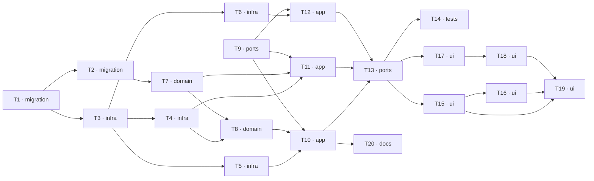

# Epic — arrival-inspection

> **Spec:** [spec.md](../spec.md) · **Design:** [sad.md](../sad.md) · **Data model:** [data-model.md](../data-model.md) · **API:** [openapi.yaml](../contracts/openapi.yaml) · **ADRs:** [adr/](../adr/) · **UI:** [design-handoff.md](../design-handoff.md) · **Glossary:** [CONTEXT.md](../CONTEXT.md)

**Size:** `L` · **Route:** `full` · **Surfaces:** `web-frontend`, `backend-service`

## Goal

Add the condition dimension to a Purchase Draft Line's ending: the member recording what a supplier
presented refuses part of it as one or more Rejections, each naming a Reason from a team-maintained
catalogue, and judges whether the frozen Pre-receipt Requirement was honoured. The Accepted Quantity
is what remains, derived and never typed, and it becomes the only quantity an Allocation may draw on
— so a refusal leaves the customer's Outstanding Quantity where it was instead of silently satisfying
it ([spec.md §2](../spec.md)).

## Scope

- **In:** `apps/server/src/purchase-drafts` extended (the catalogue query, the condition rules on both
  ending commands, the amendment command, the condition breakdown on both read projections);
  `customer-orders` extended in one place (`DemandAllocationService`'s bound becomes the accepted
  figure); two new shared entities and two new specialized repositories with two extended ones; the
  existing `@warehouser/contracts/purchase-drafts` subpath, three `PermissionId` members and the
  feature's `ErrorCode` members; two forward-only migrations, one against a populated relation;
  `apps/web/src/modules/purchase-draft` extended with the condition and conformance blocks, the
  refusal rows, the closed line's condition account and one amend dialog; and the promotion of the
  narrowing-only observed-Permission rule into `docs/system`.
  **No new module on either side, no route, no `ROUTE_SEGMENTS` entry, no nav item.**
- **Out:** raising a Rejection after a line's ending has been recorded, including damage found days
  later; the Rejection Register and the Rejection Marker; suppliers as records and supplier
  scorecards; claims, debit notes and any financial recovery; returning refused goods as a modelled
  movement, quarantine and put-away; accepting refused goods at a reduction; photographic evidence;
  automatic re-ordering of a refused shortfall; migrating endings recorded before this release; a
  house character limit across the three prose fields `ordering` already shipped unbounded; any
  asynchronous work, queue, scheduled job or paging
  ([spec.md §3](../spec.md), [sad.md §3](../sad.md)).

## Task map

Two independent roots — the migration chain at `T1` and the shared contract at `T9`, which depends on
nothing and can start on day one. The widest parallel branch is the one after `T3`: `T4`, `T5` and
`T6` are three separate repositories touching three separate files, and `T7` runs beside all of them
off the migration chain. After `T13` the web splits again into the ending dialog (`T15` → `T16`) and
the closed-draft surface (`T17` → `T18`).

Two lanes are serialized by overlapping `files_hint` rather than by a stated dependency, and this is
deliberate:

- **`layer: migration`** — `T1` and `T2` are an ordered migration sequence.
- **The web locale lane** — every `ui` task adds copy, and `apps/web/src/i18n.spec.ts` asserts the
  flattened key set against `apps/web/src/test/locale-baseline.json`, so each one regenerates that
  capture ([sad.md §10](../sad.md), gate 2). `T15` and `T17` are otherwise independent component
  trees.

## Tasks

See [tracker.md](./tracker.md) for status. Machine contract: [tasks.json](../tasks.json).

| #   | Task                                                                                                                                                                                                                 | Layer       | Blocked by    | DoD (short)                                                                                                    |
| --- | -------------------------------------------------------------------------------------------------------------------------------------------------------------------------------------------------------------------- | ----------- | ------------- | -------------------------------------------------------------------------------------------------------------- |
| T1  | [Promote the arrival-inspection schema migration: two relations, ten seeded Reasons, two conformance columns and their thirteen checks](./promote-arrival-inspection-schema-migration.md)                            | `migration` | —             | Two relations and two columns apply **and revert** with pre-existing endings present and untouched             |
| T2  | [Promote the Permission grant migration and add the three PermissionId members with every arrival-inspection ErrorCode](./grant-arrival-inspection-permissions-migration.md)                                         | `migration` | T1            | Three assignable Permissions granted idempotently to every protected `warehouse_manager` Role                  |
| T3  | [Add the two new shared persistence entities and give PurchaseDraftLineEntity its two conformance columns](./rejection-persistence-entities.md)                                                                      | `infra`     | T1            | Two new and one changed entity resolve on `DomainModule` and round-trip a row each                             |
| T4  | [Add the Rejection Reason catalogue repository and the Rejection repository with its conditional amendment update](./rejection-repositories.md)                                                                      | `infra`     | T3            | The set resolve is one read; an amendment aimed back at Undecided affects zero rows                            |
| T5  | [Extend ArrivalConfirmationRepository: widen the locked-line projection by exactly two frozen columns and write the conformance and every Rejection with the ending](./arrival-confirmation-repository-condition.md) | `infra`     | T3            | Two frozen columns join the locked projection, `ordered_quantity` does not, and refusals write with the ending |
| T6  | [Extend PurchaseDraftReadRepository so each line carries its Rejections, its conformance and the derived Accepted and Rejected Quantities in one query](./purchase-draft-read-repository-condition.md)               | `infra`     | T3            | One query, not two; a pre-release ending reads as its absent case                                              |
| T7  | [Add the Condition Split and Pre-receipt Conformance predicates and every named error factory to the purchase-drafts domain](./arrival-inspection-domain.md)                                                         | `domain`    | T2            | Every rule decides in isolation with no NestJS, HTTP or TypeORM import                                         |
| T8  | [Add ArrivalInspectionService with the catalogue assertion, and the four module-level functions both ending commands share](./arrival-inspection-service.md)                                                         | `domain`    | T4, T7        | One catalogue read per ending; every assertion collects before it refuses                                      |
| T9  | [Extend @warehouser/contracts/purchase-drafts with the condition payload, the amendment request and the Rejection Reason schema](./arrival-inspection-contracts.md)                                                  | `ports`     | —             | Strict schemas accept no derived figure, count or attribution; no new subpath                                  |
| T10 | [Give both ending commands the condition half of the ending and narrow the Allocation bound to the derived Accepted Quantity](./line-ending-condition-commands.md)                                                   | `app`       | T5, T8, T9    | The accepted — not the presented — figure bounds the delegation; the ending is all-or-nothing                  |
| T11 | [Add AmendPurchaseDraftRejectionCommand, the first write this product aims at a Closed draft](./amend-rejection-command.md)                                                                                          | `app`       | T4, T7, T9    | A Closed draft's Rejection is amendable; no quantity, Reason, Source or line moves                             |
| T12 | [Build the four-shape condition projection and the Rejection Reason catalogue query](./condition-read-projections.md)                                                                                                | `app`       | T6, T9        | Four shapes, one test each; withheld means the property is **absent**, with no count surviving                 |
| T13 | [Serve the REST surface: the two extended ending routes, the amendment route, the Rejection Reasons controller and the regenerated route-table baseline](./arrival-inspection-rest-surface.md)                       | `ports`     | T10, T11, T12 | Every endpoint denies without its Permission and discloses nothing; the baseline gains exactly two rows        |
| T14 | [Add the three architecture checks that make the condition guarantees mechanical rather than remembered](./condition-architecture-checks.md)                                                                         | `tests`     | T13           | Each check is proven by a non-conforming fixture, not only by the conforming corpus                            |
| T15 | [Build the always-present condition block: the refuse control, the refusal editor rows and the condition summary live region](./condition-block-ui.md)                                                               | `ui`        | T13           | The block is never collapsed; the refuse control is **absent**, not disabled, without the Permission           |
| T16 | [Build the conformance block with its un-defaulted radiogroup and the direct-delivery finality acknowledgement](./conformance-and-finality-ui.md)                                                                    | `ui`        | T15           | No default judgement; the finality checkbox gates the direct primary and introduces no timer                   |
| T17 | [Render the closed line's condition account in all four shapes, with the withheld shape leaving no trace](./closed-line-condition-ui.md)                                                                             | `ui`        | T13           | No placeholder, chip, count or greyed row survives a withholding                                               |
| T18 | [Add the amend-refusal dialog, opened from the read row under REJECTIONS:UPDATE](./amend-refusal-dialog-ui.md)                                                                                                       | `ui`        | T17           | `useActionDialog` + `ActionDialogHost`; `Undecided` **absent** from a decided Disposition's list               |
| T19 | [Explain every new refusal in EndingRefusalAlert and register the three success toasts with their invisible consequence](./condition-copy-and-alerts-ui.md)                                                          | `ui`        | T15, T16, T18 | Each refusal names its rule and states that nothing was recorded; each toast names its consequence             |
| T20 | [Promote the narrowing-only observed-Permission rule into docs/system in this same change](./observed-permission-system-docs.md)                                                                                     | `docs`      | T10           | `server-request-authorization.md` no longer classifies a conforming ending command as a violation              |

## Risks / Hard rules

No task may violate these. Each is a [spec.md §6](../spec.md) target or a
[sad.md §11](../sad.md) constraint, and each names the task that carries it.

1. **`ordered_quantity` stays out of the locked-line projection** (T5, asserted by T14). Widening it
   by `packaging_type_id` and `value_adding_note` is the whole permitted narrowing; anything more
   makes an Allocation bound derivable from a frozen field and turns
   [spec.md §6.1](../spec.md)'s "Refusal as a route around the Allocation bound" from a property into
   a check.
2. **Ending atomicity** ([spec.md §6](../spec.md)). One ending writes its quantity, its conformance,
   every Rejection, every Allocation and every resulting Outstanding Quantity together or writes none
   of them. One `@Transactional()` boundary, not two (T10).
3. **The lock order is fixed and extended, never replaced**: the draft row, then its line, then that
   line's refusals, then the Customer Orders in ascending identifier order (T5, T10). A fourth write
   path adopting a different order reintroduces the deadlock.
4. **The Condition Split and conformance assertions collect every violation before refusing** (T8).
   The first failing rule must not short-circuit the rest — the member's whole submission is judged in
   one pass and returned with every figure intact.
5. **AC-22's withholding is trace-free** (T12, T17). The rejections array is absent _as a property_,
   never empty and never null; the withheld columns are **not selected**, never fetched and deleted;
   no count, badge, total or placeholder survives, because a placeholder is itself probeable.
6. **Four shapes, not two** (T12, T17). Identity × cause. A matrix covering only "with and without the
   cause grant" leaves half the projection unproven.
7. **The catalogue is extend-only** (T1, asserted by T14). No migration ever updates or deletes a
   `rejection_reasons` row, which is what makes AC-23a structural rather than a snapshot column.
8. **`requires_description` is catalogue data, never a hard-coded `unfit_other`** (T7, T8).
9. **The two-Permission rule narrows, never widens** (T10, documented by T20). The resolved-grant set
   is read inside the command to refuse a Rejection-carrying payload; `WarehouseAccessGuard` still
   never consults it. AC-01b is unreachable by that rule rather than passing through a permissive
   branch ([ADR 0001](../adr/0001-payload-conditional-permission.md)).
10. **No telemetry, and no timing helper** ([sad.md §8](../sad.md)). The four p95 targets in
    [spec.md §6](../spec.md) are design budgets met by construction, not measured — production timing
    is prohibited and no performance tier exists. No task adds one.

### Outstanding gates this epic does not close

- **The change request `sad.md` §11 owes is not raised.** Six amendments to `ordering` and
  `delivery-addresses` — plus a seventh this design surfaced, that T11 makes the first write this
  product aims at a **Closed** draft — remain unwritten, and
  `docs/change-requests/ordering-amendments/` is still `Draft` with its reconciliation unrun. Until
  it lands, a reviewer reading `ordering` alone finds it contradicted. **Owner: PM. Due before
  `implement`.**
- **The security review [spec.md §6.1](../spec.md) requires is a release gate**, not a task here.
- **PGlite cannot prove the concurrency claims.** The lock order and the conditional-update races are
  asserted by shape — the statements issued and the zero-row refusal path — and the true race stays
  unproven until a real-PostgreSQL tier exists ([sad.md §8](../sad.md)). No task may report otherwise.
- **`apps/web` has no integration-test script**, so the web half's integration verdict is recorded as
  non-red rather than green ([sad.md §10](../sad.md), gate 4).
