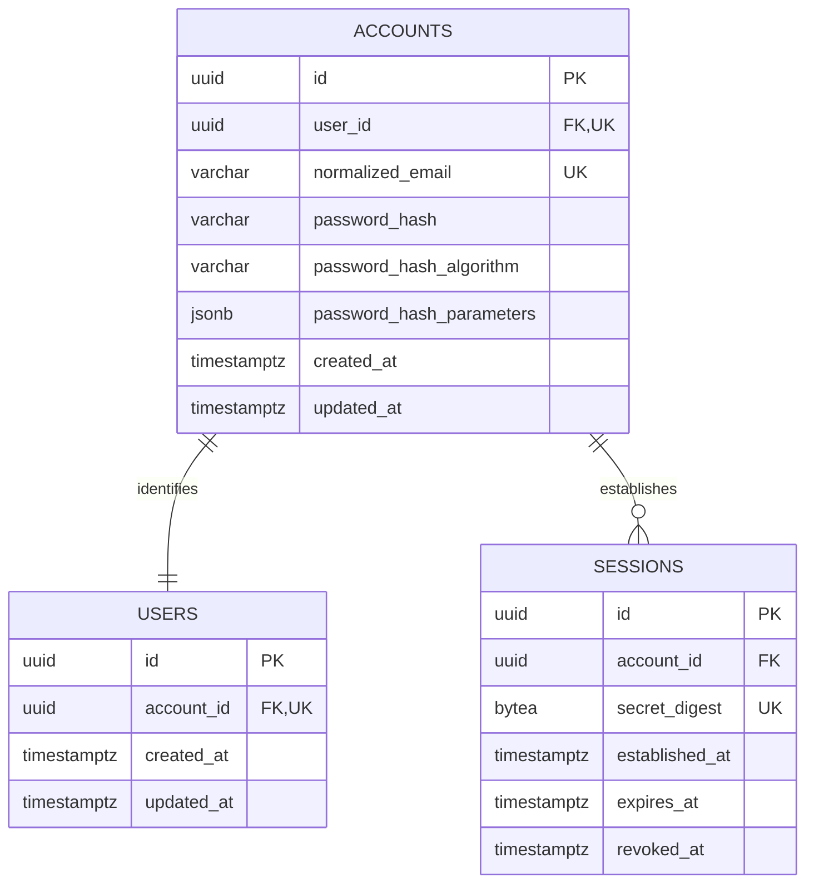

# Data model — auth

This model specializes the PostgreSQL/TypeORM baseline in
[`docs/system/server-architecture.md`](../../system/server-architecture.md) and the accepted
[`PostgreSQL/TypeORM ADR`](../../system/adr/21-07-2026-postgresql-with-typeorm.md). TypeORM records
and mapping remain inside the auth infrastructure adapter, repository ports remain framework-free,
schema changes use reviewed migrations, and runtime `synchronize` remains `false`.

Repository evidence contains no implemented `User`, `Account`, `Session`, seed, TypeORM entity, or
migration class. The staged migration therefore creates a fresh auth schema and does not backfill a
legacy identity. Deployment owners must still confirm that the target database has no out-of-band
`users`, `accounts`, or `sessions` tables before promoting this staged design into a timestamped
live migration.

## ER diagram

## Entities

All IDs are application-generated UUIDs so the domain can construct the complete Account/User/
Session graph before the atomic repository operation. An Account and its User share the same
identity UUID; the checked shared-key convention makes the cyclic foreign keys prove the intended
pairing instead of allowing mismatched cycles. Session IDs are independent. UUID version selection
is an implementation choice; persistence requires only valid, globally unique UUID values.

### `accounts`

| Column                     | Type         | Constraints                                               | Notes                                                                          |
| -------------------------- | ------------ | --------------------------------------------------------- | ------------------------------------------------------------------------------ |
| `id`                       | UUID         | PK                                                        | Application-generated shared Account/User identity UUID.                       |
| `user_id`                  | UUID         | NOT NULL, UNIQUE, CHECK = `id`, deferred FK → `users(id)` | One half of the database-enforced bijection.                                   |
| `normalized_email`         | VARCHAR(254) | NOT NULL, UNIQUE, normalized-value CHECK                  | Trimmed, lower-case ASCII sign-in identifier; never used as a telemetry label. |
| `password_hash`            | VARCHAR(512) | NOT NULL                                                  | Encoded memory-hard password hash; never plaintext.                            |
| `password_hash_algorithm`  | VARCHAR(32)  | NOT NULL                                                  | Algorithm identifier used for verification and upgrade decisions.              |
| `password_hash_parameters` | JSONB        | NOT NULL, object CHECK                                    | Non-secret algorithm/cost parameters needed to verify or upgrade the hash.     |
| `created_at`               | TIMESTAMPTZ  | NOT NULL, DEFAULT `CURRENT_TIMESTAMP`                     | Identity creation time.                                                        |
| `updated_at`               | TIMESTAMPTZ  | NOT NULL, DEFAULT `CURRENT_TIMESTAMP`                     | Set explicitly by persistence writes; no database trigger.                     |

**Aggregate root:** root.

**Access patterns:** normalize a submitted email and fetch one credential record for sign-up
duplicate detection or sign-in → unique index `uq_accounts_normalized_email`; load the linked User
after credential verification → unique index backing `uq_accounts_user_id`.

**Constraints:** the normalized email is unique and must equal its lower-cased, trimmed value; the
password parameter JSON must be an object; `user_id` is unique and participates in a deferred
foreign key. The shared-key check and `users.account_id` constraint prevent mismatched pair cycles
and prevent either side of the Account/User pair from being committed as an orphan. Registration
must run in one transaction with constraints checked at commit.

### `users`

| Column       | Type        | Constraints                                                  | Notes                                                                            |
| ------------ | ----------- | ------------------------------------------------------------ | -------------------------------------------------------------------------------- |
| `id`         | UUID        | PK                                                           | Stable shared Account/User identity UUID exposed as the authenticated principal. |
| `account_id` | UUID        | NOT NULL, UNIQUE, CHECK = `id`, deferred FK → `accounts(id)` | Reverse half of the Account/User bijection.                                      |
| `created_at` | TIMESTAMPTZ | NOT NULL, DEFAULT `CURRENT_TIMESTAMP`                        | Created atomically with the Account.                                             |
| `updated_at` | TIMESTAMPTZ | NOT NULL, DEFAULT `CURRENT_TIMESTAMP`                        | Set explicitly by persistence writes; no database trigger.                       |

**Aggregate root:** `accounts`.

**Access patterns:** resolve the safe User projection from an Account or Session → unique index
backing `uq_users_account_id`.

**Constraints:** `account_id` is unique, equals `id`, and its deferred foreign key is checked at
transaction commit. No authentication data or authorization grants are stored on `users`.

### `sessions`

| Column           | Type        | Constraints                     | Notes                                                                                            |
| ---------------- | ----------- | ------------------------------- | ------------------------------------------------------------------------------------------------ |
| `id`             | UUID        | PK                              | Application-generated internal identifier; never used as the cookie secret.                      |
| `account_id`     | UUID        | NOT NULL, FK → `accounts(id)`   | Owning authenticated identity.                                                                   |
| `secret_digest`  | BYTEA       | NOT NULL, UNIQUE, 32-byte CHECK | SHA-256 digest of a cryptographically random opaque secret; the reusable secret is never stored. |
| `established_at` | TIMESTAMPTZ | NOT NULL                        | Successful sign-up/sign-in time.                                                                 |
| `expires_at`     | TIMESTAMPTZ | NOT NULL, expiry-order CHECK    | Fixed at `established_at + 30 days` by the domain; activity never extends it.                    |
| `revoked_at`     | TIMESTAMPTZ | NULL, revocation-order CHECK    | Set once when the current browser session signs out.                                             |

**Aggregate root:** `accounts`.

**Access patterns:** digest the opaque cookie, then fetch exactly one Session and its Account/User
while applying `revoked_at IS NULL AND expires_at > now()` → unique index
`uq_sessions_secret_digest`; create or reconcile sessions for an Account → index
`idx_sessions_account_id`; revoke the current Session → `uq_sessions_secret_digest`.

**Constraints:** the digest is exactly 32 bytes; expiry is later than establishment; revocation
cannot predate establishment; `account_id` uses `ON DELETE RESTRICT` because Account deletion is
outside this feature's lifecycle.

## Indexes

Unique constraints create their corresponding PostgreSQL unique indexes.

| Index                          | Columns                     | Query it serves                                                                                  |
| ------------------------------ | --------------------------- | ------------------------------------------------------------------------------------------------ |
| `uq_accounts_normalized_email` | `normalized_email` (unique) | Sign-up duplicate check and sign-in Account lookup in SAD §6.1–6.2.                              |
| `uq_accounts_user_id`          | `user_id` (unique)          | Traverse Account → User for the authenticated projection in SAD §6.1–6.3.                        |
| `uq_users_account_id`          | `account_id` (unique)       | Traverse Account/Session → User in SAD §6.1–6.5 and enforce one-to-one ownership.                |
| `uq_sessions_secret_digest`    | `secret_digest` (unique)    | Restore or revoke the exact cookie Session in SAD §6.3–6.4.                                      |
| `idx_sessions_account_id`      | `account_id`                | Account-scoped session persistence and integrity reconciliation; it also indexes the Session FK. |

No expiry-cleanup index is introduced: cleanup is explicitly outside the feature and expiry is
checked only after the selective digest lookup. No concurrent index build is needed because the
staged migration creates empty tables; the live promotion may run in its normal transaction.

## Repository boundaries and transaction behavior

- `AccountRepository.findByNormalizedEmail` uses `uq_accounts_normalized_email` and returns a
  domain credential projection, never a TypeORM record.
- `AuthRegistrationRepository.registerIdentity` accepts the complete Account, User, and initial
  Session and commits all three in one PostgreSQL transaction. It is the only registration
  persistence boundary and never exposes `EntityManager` or `QueryRunner` to the use case.
- `SessionRepository.create`, `findValidByDigest`, and `revokeByDigest` own session persistence.
  `findValidByDigest` joins through Account to User and applies expiry/revocation server-side.
- Mappers keep TypeORM column names, `Buffer` digest values, JSONB values, and persistence
  timestamps inside `auth/infrastructure`; domain/application code remains TypeORM-independent.

Concurrent duplicate registrations are decided by `uq_accounts_normalized_email`; the losing
transaction maps the constraint violation to the approved duplicate-email outcome. The cyclic
Account/User foreign keys are `DEFERRABLE INITIALLY DEFERRED`, so the complete pair is inserted
inside the registration transaction and validated at commit.

## Test fixtures

- `buildAccount(overrides)` — creates a valid domain Account with an `@example.test` normalized
  email and non-plaintext test hash metadata.
- `buildUser(overrides)` — creates a User paired to a supplied Account ID.
- `buildSession(overrides)` — creates a fixed-expiry Session with a synthetic 32-byte digest.
- `persistRegisteredIdentity(overrides)` — integration helper that atomically persists a matched
  Account/User/Session graph through the repository boundary.

Fixtures belong in colocated tests or `apps/server/src/test/factories`; no seed or fixture data is
placed in migrations.
