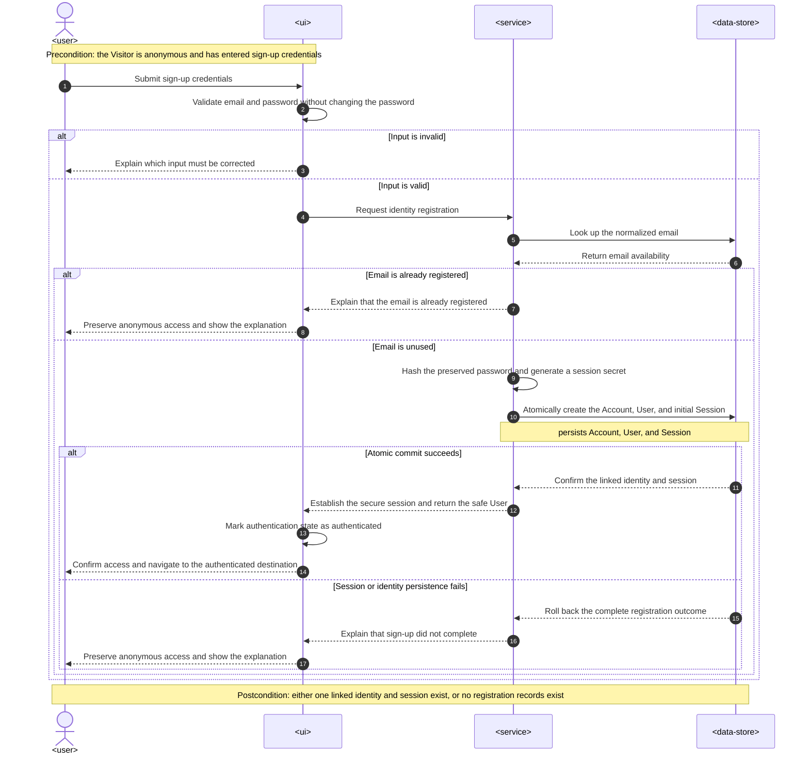
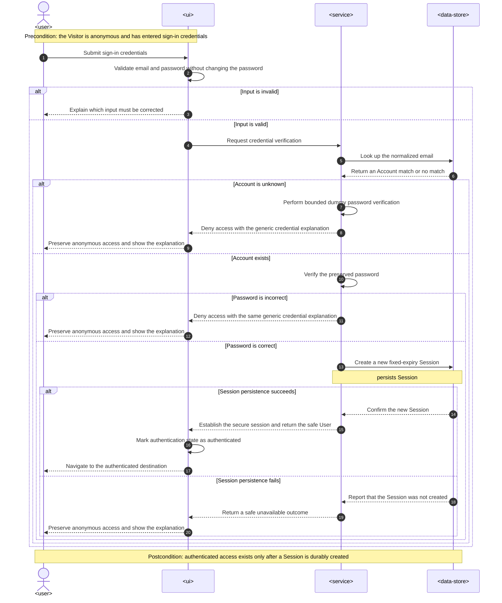
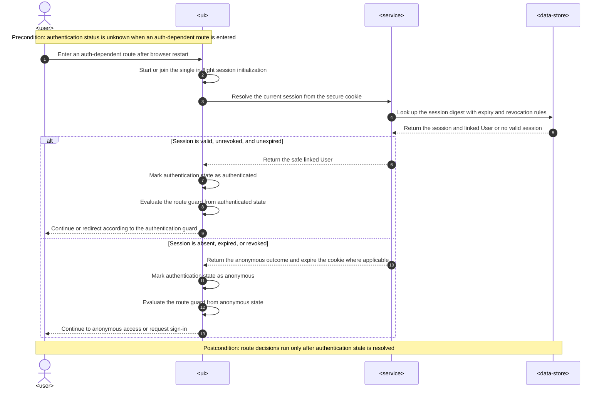
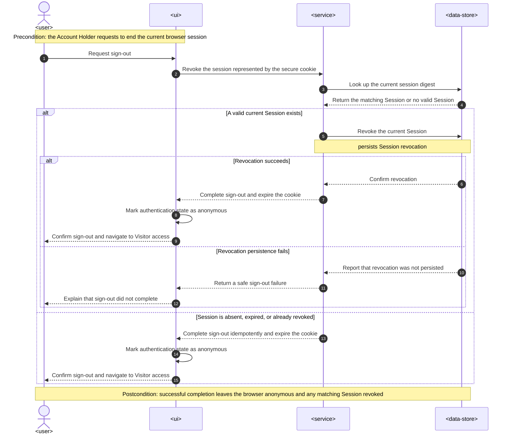
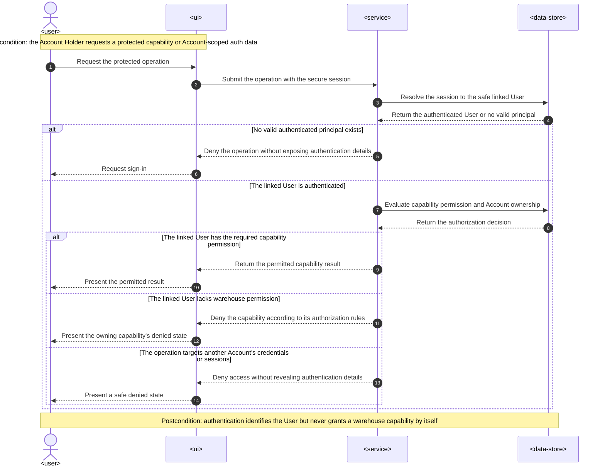

# Software Architecture Description — auth

## 1. Context and quality goals

The existing web authentication flow stores a mock token in the in-memory Redux auth slice. This
feature replaces that placeholder with durable email/password authentication backed by the server,
while keeping authentication separate from warehouse authorization.

The architecture must satisfy these quality goals, in priority order:

1. Passwords and reusable session secrets are never exposed to browser JavaScript, durable logs, or
   plaintext storage.
2. Account, linked User, and initial session creation is atomic.
3. A session is revocable, survives a browser restart, and expires at a fixed instant 30 days after
   sign-up or sign-in.
4. The web application resolves session state before protected or anonymous-only route guards make
   a navigation decision.
5. Sign-in does not reveal whether an email is registered, and authentication never grants a
   warehouse permission by itself.

The approved UI source and implementation constraints are recorded in
[`design-handoff.md`](./design-handoff.md). The feature specification is still `Draft`; product and
security approval remain gates before implementation begins.

## 2. Constraints inherited from `docs/system`

- The repository remains a web SPA plus NestJS modular monolith, with shared boundary schemas in
  `packages/contracts` ([architecture map](../../system/architecture-map.md)).
- The server feature follows domain/application/transport separation. REST controllers invoke
  commands or queries, persistence implements repository ports, and TypeORM details do not escape
  the adapter ([server architecture](../../system/server-architecture.md)).
- PostgreSQL and TypeORM are the persistence baseline; schema changes use reviewed migrations and
  runtime synchronization stays disabled
  ([PostgreSQL/TypeORM ADR](../../system/adr/21-07-2026-postgresql-with-typeorm.md)).
- Zod schemas in `packages/contracts/auth` own all web/server request and response shapes. Web-only
  display state remains local
  ([Zod ADR](../../system/adr/12-07-2026-schema-validation-with-zod.md)).
- Redux Toolkit remains the browser source of truth for cross-route authentication state.
  TanStack Router guards read named selectors from that store; no parallel authentication context
  or local-storage token persistence is introduced
  ([frontend architecture](../../system/frontend-architecture.md)).
- Server failures use typed application/system errors and the single global NestJS exception
  filter. Public failures expose stable codes and safe details only
  ([server error-handling ADR](../../system/adr/24-07-2026-server-error-handling.md)).
- The web normalizes API failures once, maps field failures into HeroUI controls, deduplicates error
  toasts, and translates visible copy
  ([web error-handling guide](../../system/guides/web-error-handling.md)).
- Production UI must implement the approved HeroUI flow, node IDs, responsive behavior,
  accessibility rules, and visual invariants in [`design-handoff.md`](./design-handoff.md).

## 3. Scope and target surfaces

### In scope

| Surface           | Change                                                                                                                                                                                                                                            |
| ----------------- | ------------------------------------------------------------------------------------------------------------------------------------------------------------------------------------------------------------------------------------------------- |
| `web-frontend`    | Add separate sign-up and sign-in routes, replace mock credential state with a session-status model, restore the session before route decisions, submit credential workflows through the API boundary, and revoke the current session on sign-out. |
| `backend-service` | Add the authentication module, credential verification, atomic identity registration, server-side sessions, REST adapters, authentication guard/strategy, and audit-safe telemetry.                                                               |
| Shared boundary   | Add auth request/response and safe error-envelope schemas under `packages/contracts/auth`; add stable public auth error codes to `packages/shared-types` where required.                                                                          |
| Persistence       | Add Account, User, and Session records with relational constraints and reversible TypeORM migrations. Exact columns and indexes belong to the data-model stage.                                                                                   |

### Out of scope

Email verification, password recovery, email changes, MFA, external identity providers, account
lifecycle states, other-device session management, and automatic attempt limiting remain excluded
by the specification. No worker or queue is required for this synchronous flow.

## 4. Solution strategy

Use a server-managed opaque session carried only in a secure cookie:

- After successful sign-up or sign-in, the server creates a cryptographically random session
  secret. Only a one-way digest is stored in PostgreSQL.
- The browser receives the secret in a `HttpOnly`, `SameSite=Lax`, `Path=/` cookie. Production uses
  `Secure`; the cookie has a fixed 30-day expiry and is not readable by JavaScript.
- The client sends requests with credentials enabled. A session query restores the linked User's
  safe identity projection; no token is copied into Redux or browser storage.
- Sign-out revokes the matching server record and expires the cookie. Missing, expired, or already
  revoked sessions produce the same anonymous end state.
- State-changing auth requests accept only configured application origins. Credentialed CORS is an
  explicit allowlist rather than the current unrestricted bootstrap default. `SameSite=Lax` is a
  defense-in-depth boundary, not the sole cross-site request defense.

Passwords are hashed using a memory-hard password-hashing implementation with parameters owned by
server configuration and reviewed by the Security Lead. The implementation stores the algorithm
and parameters with the hash so they can be upgraded after a successful verification. Passwords
are never normalized or trimmed; emails are trimmed and normalized to one canonical,
case-insensitive lookup value before uniqueness checks.

The server `auth` feature module owns the Account credential, linked User identity record, and
Session lifecycle for this release. This keeps the registration invariant and transaction inside
one cohesive boundary. Other warehouse modules consume only the authenticated `userId` and apply
their own authorization rules; they do not read Account credentials or Session persistence.

## 5. Building blocks and ownership

### Web

| Building block                           | Ownership and responsibility                                                                                                                                                                                      |
| ---------------------------------------- | ----------------------------------------------------------------------------------------------------------------------------------------------------------------------------------------------------------------- |
| `modules/auth/sign-up`                   | Approved create-account page, React Hook Form component, and workflow orchestration.                                                                                                                              |
| `modules/auth/sign-in`                   | Replaces the mock login page with the approved sign-in flow and generic credential-failure behavior.                                                                                                              |
| `modules/auth/api`                       | Module-owned sign-up, sign-in, session-status, and sign-out calls using the shared API boundary.                                                                                                                  |
| Shared auth presentation                 | Reused labeled email/password controls and auth shell only where both approved flows have identical behavior; routing and workflows remain separate.                                                              |
| `store/slices/authSlice.ts`              | Holds `unknown`, `anonymous`, or `authenticated` status plus the safe current-User projection. It never holds a reusable session secret.                                                                          |
| Session bootstrap                        | One idempotent initialization operation, owned at the application/router platform boundary, resolves the session before auth-dependent route guards complete. Concurrent callers share the same in-flight result. |
| Route guards                             | `requireAuth` and `requireAnonymous` await initialization when status is `unknown`, then redirect from named selectors. Authorization guards remain separate.                                                     |
| Shared API/error/feedback infrastructure | Credentialed fetch policy, contract parsing, normalized failures, one toast container, deduplication, and translated messages as required by the system guide.                                                    |

All application paths, including the new sign-up path, remain in `shared/constants/routes.ts`.
Routes are registered manually in `router.ts`. Pages own request → Redux update → navigation;
forms own fields, accessible validation, and submission state.

### Server

| Building block                | Ownership and responsibility                                                                                                                                              |
| ----------------------------- | ------------------------------------------------------------------------------------------------------------------------------------------------------------------------- |
| `auth/domain`                 | Account, User identity, and Session invariants; normalized-email and session-expiry value rules; repository ports. No NestJS, HTTP, TypeORM, or password-library imports. |
| `auth/services`               | Credential hashing/verification and opaque session-secret generation/digesting behind narrow server-local ports.                                                          |
| `auth/usecases/commands`      | Register identity atomically, sign in and establish a session, and revoke the current session.                                                                            |
| `auth/usecases/queries`       | Resolve a valid session to the minimum safe current-User projection.                                                                                                      |
| `auth/rest`                   | Thin controllers and Zod DTO adapters for registration, sign-in, current session, and sign-out. Cookie issuance/expiry stays at this transport boundary.                  |
| `auth/infrastructure`         | TypeORM records/mappers, repository implementation, transaction boundary, password hasher, session-secret generator, and clock adapter.                                   |
| Authentication guard/strategy | Reads the opaque cookie, resolves the session through the auth application boundary, and attaches only authenticated `userId`/safe principal data to the request.         |
| Global exception filter       | Maps auth application failures, validation failures, and unexpected errors to the shared safe envelope without logging credentials or cookies.                            |

The atomic registration repository operation persists Account, User, and initial Session in one
database transaction. Its port describes the business outcome rather than exposing a TypeORM
transaction manager to the use case.

## 6. Runtime view

### 6.1 Sign-up

1. The sign-up form validates the shared request shape while preserving the password exactly.
2. The page calls the auth API adapter with credentials enabled.
3. The REST controller delegates to the register command.
4. The command normalizes the email, rejects a duplicate, hashes the password, creates the Account,
   linked User, and initial Session, and asks the repository to commit all three atomically.
5. The controller sets the opaque session cookie and returns the safe current-User projection.
6. The page marks Redux authenticated, emits the approved action-specific success feedback, and
   navigates to the authenticated destination.
7. If the transaction cannot durably create all three records, it rolls back and the web remains
   anonymous.

For AC-01b, “establish the initial persistent session” means durably creating the Account, User,
and usable Session record in the same server transaction. Cookie-header construction is a pure
transport step after that commit. Delivery of the response over the network cannot participate in
the database transaction: if the connection is lost after commit, the server has established the
identity/session but the browser has an indeterminate outcome and must not automatically replay the
registration. This distinguishes a failed session creation, which rolls back, from a lost success
response, which no HTTP architecture can make atomic with PostgreSQL.

Concurrent registrations of case variants of the same normalized email are serialized by the
database uniqueness constraint. The losing request is mapped to the intentional duplicate-sign-up
outcome.

### 6.2 Sign-in

1. The page submits normalized-email credentials while preserving the password byte-for-byte.
2. The command performs a credential verification path that does not expose whether the Account
   exists. Unknown email and incorrect password return the same public error code and response.
3. On success, the command stores a new fixed-expiry Session, and the controller sets its opaque
   cookie.
4. The page marks Redux authenticated and navigates without a success toast.

The implementation should use a bounded dummy password verification for unknown emails so the two
publicly identical failures do not have an obvious computational timing split.

### 6.3 Browser restart and route entry

1. Authentication state begins as `unknown`.
2. Before an auth-dependent route decision completes, the bootstrap operation requests the current
   session using the cookie.
3. A valid, unrevoked, unexpired digest resolves to the same linked User and Redux becomes
   `authenticated`.
4. An absent, expired, or revoked session clears/expunges the cookie where applicable and Redux
   becomes `anonymous`.
5. Only then does the route guard allow navigation or redirect. A protected capability performs
   its own authorization after authentication.

### 6.4 Sign-out

1. The authenticated page requests sign-out.
2. The command revokes only the Session represented by the current cookie.
3. The controller expires the cookie even when the session is already absent or invalid.
4. The web marks Redux anonymous, emits sign-out success feedback after completion, and navigates
   to Visitor access.

### 6.5 Authentication and authorization boundary

Authentication resolves only the linked User identity. The capability-owning service remains
responsible for warehouse authorization, while the authentication boundary exposes no operation
for reading or controlling another Account's credentials or sessions.

### 6.6 Runtime coverage

| Requirement         | Runtime coverage                                                                     |
| ------------------- | ------------------------------------------------------------------------------------ |
| Email input rule    | Sign-up and sign-in input-validation branches                                        |
| Password input rule | Sign-up and sign-in input-validation branches preserve the password exactly          |
| US-01 / AC-01       | Sign-up atomic-commit success branch                                                 |
| US-01 / AC-01b      | Sign-up identity-or-session persistence failure and rollback branch                  |
| US-01 / AC-02       | Sign-up invalid-input branch                                                         |
| US-01 / AC-03       | Sign-up duplicate normalized-email branch                                            |
| US-02 / AC-04       | Sign-in matching-credentials and session-persistence success branch                  |
| US-02 / AC-05       | Sign-in unknown-Account and incorrect-password branches with the same public outcome |
| US-03 / AC-07       | Session-restoration valid-session branch                                             |
| US-03 / AC-08       | Session-restoration absent, expired, or revoked branch                               |
| US-04 / AC-09       | Sign-out revocation-success and idempotent-completion branches                       |
| US-05 / AC-10       | Authorization-boundary missing-permission branch                                     |
| US-05 / AC-11       | Authorization-boundary cross-Account denial branch                                   |

All five runtime flows were confirmed on 2026-07-25. No acceptance criterion is classified as
non-runtime or left uncovered.

## 7. Data and interface impact

### Data

- `Account` stores the normalized unique email, password hash metadata, identity timestamps, and
  the one-to-one User association.
- `User` provides the stable warehouse-domain identity referenced by authenticated requests.
- `Session` belongs to one Account/User identity and stores only the secret digest, establishment
  time, fixed expiry, optional revocation time, and minimal security audit metadata.
- Foreign keys and uniqueness constraints enforce one Account ↔ one User and globally unique
  normalized email. Session cleanup is not required for correctness; expired rows may be removed by
  a later operational policy without changing authentication behavior.
- The data-model stage must first resolve the specification's seeded/deployed User migration
  question, then define exact identifiers, columns, indexes, transaction behavior, and reversible
  migration order.

### HTTP boundary

The API contract stage defines four operations:

| Operation       | Input              | Successful result                                | Important failures                                             |
| --------------- | ------------------ | ------------------------------------------------ | -------------------------------------------------------------- |
| Register        | Email and password | Safe current-User projection plus session cookie | Field validation, duplicate email, unavailable/atomic rollback |
| Sign in         | Email and password | Safe current-User projection plus session cookie | One generic invalid-credentials outcome                        |
| Current session | Cookie only        | Safe current-User projection or anonymous result | Malformed/expired/revoked session never reveals secret details |
| Sign out        | Cookie only        | Idempotent completion plus expired cookie        | Infrastructure failure remains a safe normalized API failure   |

The public identity projection contains only fields required by the web to identify the current
User. Password hashes, session digests, Account internals, and authorization grants are never
returned. The API contract must map every public failure to the shared error envelope and every
visible code to translated web copy.

## 8. Cross-cutting concerns

### Security and privacy

- Redact password fields, cookie values, authorization material, and unrestricted request bodies
  at every log and telemetry boundary.
- Compare password and session digests using library primitives suitable for secret verification.
- Prevent session fixation by issuing a new secret after every successful sign-up/sign-in; never
  accept a caller-selected session identifier.
- Enforce expiry and revocation on the server for every authenticated request. Browser cookie
  expiry is not an authorization decision.
- Apply an explicit credentialed-origin allowlist and validate origins for state-changing auth
  operations. Production cookies are `Secure`, `HttpOnly`, `SameSite=Lax`, and host-only.
- Return generic sign-in failures, retain the approved duplicate-sign-up disclosure, and expose no
  endpoint for another Account's credentials or sessions.
- Automated rate limiting is deliberately not introduced because it is a specification non-goal.
  Emit privacy-safe attempt/outcome metrics sufficient to evaluate the deferred abuse-control work.

### Reliability and performance

- Registration commits identity and session as one transaction; no compensating cleanup is an
  accepted substitute for AC-01b.
- Session reads use the digest lookup and expiry/revocation predicates required by the data-model
  plan. The API and database design must be load-tested against the specification's latency and
  throughput targets.
- Auth bootstrap is idempotent and coalesces concurrent callers to prevent duplicate restoration
  traffic and redirect races.
- Logout is idempotent from the user's perspective, but an infrastructure failure is not reported
  as a successful revocation.

### Observability

Record terminal sign-up/sign-in outcomes, latency, availability classification, session
restoration outcomes, revocations, and Account/User integrity metrics. Use correlation IDs and
stable outcome codes. Never use raw email, password, session cookie, password hash, or session
digest as a metric label or log field.

### Accessibility and UI fidelity

The implementation must satisfy all component, responsive, keyboard, focus, validation, and
screen-reader behavior in [`design-handoff.md`](./design-handoff.md), and compare both viewports and
required states with the approved preview evidence before completion.

## 9. ADR index

- [0001 — Server-managed opaque cookie sessions](./adr/0001-server-managed-opaque-cookie-sessions.md)

## 10. Verification strategy

- **Domain/unit:** email normalization, password length without trimming, fixed session expiry,
  revocation, Account/User cardinality, and authorization separation.
- **Service/security:** password hash/verify and upgrade behavior, random session-secret generation,
  digest-only persistence, dummy verification for unknown email, and constant public failures.
- **Persistence integration:** atomic commit/rollback, normalized-email uniqueness under
  concurrency, one-to-one foreign keys, digest lookup, expiry, and revocation using PostgreSQL.
- **REST integration:** shared Zod validation, cookie attributes, origin/CORS policy, generic
  sign-in failure, safe error envelopes, redacted logs, idempotent logout, and session restoration.
- **Web:** separate routes, form validation, submission orchestration, tri-state bootstrap, guard
  behavior, API-error mapping/deduplication, approved success-feedback exceptions, accessibility,
  and absence of session secrets from Redux/storage.
- **End to end:** sign-up → immediate authenticated access; restart → restored User; sign-out →
  revoked access; expired/revoked cookie → sign-in prompt; authenticated-but-unauthorized User →
  owning capability's denied state.
- **Quality gates:** load smoke tests against all `spec.md` §6 NFR targets, Account/User reconciliation,
  secret-leak checks, dependency vulnerability checks, and the required Security Lead review.
- **Visual:** desktop/mobile screenshot comparison and keyboard/focus review against every approved
  frame named in the design handoff.

## 11. Risks and open questions

| Item                                                                                                                                                                                                                                      | Owner                           | Due / effect                                                                         |
| ----------------------------------------------------------------------------------------------------------------------------------------------------------------------------------------------------------------------------------------- | ------------------------------- | ------------------------------------------------------------------------------------ |
| The feature spec is still `Draft`. Product and Security Lead approval is required.                                                                                                                                                        | Product Manager + Security Lead | Before implementation starts.                                                        |
| Existing or seeded User records may require a one-to-one Account migration. Repository evidence currently shows no implemented User persistence, but deployed/seeded state must be confirmed.                                             | Tech Lead                       | Before `sdd:data-model auth`; blocks final migration design.                         |
| The password-hashing library and reviewed memory/cost parameters must be selected against the deployment runtime and latency target.                                                                                                      | Security Lead + Backend Lead    | During task planning, before implementation; must preserve the memory-hard strategy. |
| Cookie `Secure` behavior and the credentialed origin allowlist need environment-specific configuration using documented placeholders only.                                                                                                | Platform Owner                  | Before deployment; no secret values belong in tracked design artifacts.              |
| The existing server bootstrap enables unrestricted CORS and lacks the documented global error filter implementation. Auth cannot ship until those platform boundaries are made credential-safe and contract-compliant.                    | Backend Lead                    | During implementation, verified by REST integration tests.                           |
| i18next, React-Toastify, and a shared domain API client are documented target behavior but not currently installed/implemented. Auth tasks must include the minimum platform infrastructure rather than invent feature-local substitutes. | Frontend Lead                   | During implementation planning.                                                      |
