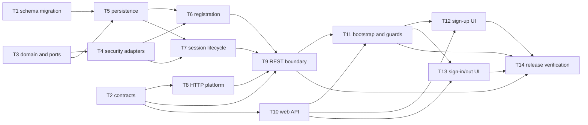

# Epic — auth

> **Spec:** [spec.md](../spec.md) · **Design:** [sad.md](../sad.md) · **UI handoff:** [design-handoff.md](../design-handoff.md) · **Data model:** [data-model.md](../data-model.md) · **API:** [openapi.yaml](../contracts/openapi.yaml) · **ADR:** [0001](../adr/0001-server-managed-opaque-cookie-sessions.md)

## Goal

Replace the mock browser identity with durable email/password authentication backed by an atomic Account/User/Session model. Deliver approved sign-up, sign-in, restoration, and sign-out experiences while keeping authentication separate from warehouse authorization.

## Scope

- **In:** Shared contracts, PostgreSQL migration, auth domain/application/infrastructure/REST layers, credential-safe server wiring, Redux session state, route guards, and the approved web UI.
- **Out:** Email verification, password recovery, email changes, social/enterprise/MFA providers, automated attempt limiting, cross-device session management, and warehouse permission policy.

## Task map

## Tasks

See [tracker.md](./tracker.md) for status. Machine contract: [tasks.json](../tasks.json).

| #   | Task                                                                                          | Layer     | Blocked by        | DoD (short)                                      |
| --- | --------------------------------------------------------------------------------------------- | --------- | ----------------- | ------------------------------------------------ |
| T1  | [Promote and verify the auth schema migration](./promote-auth-schema-migration.md)            | migration | —                 | Migration and constraint integration tests pass. |
| T2  | [Publish shared auth boundary schemas](./publish-auth-contracts.md)                           | ports     | —                 | Auth contract tests pass.                        |
| T3  | [Model auth domain invariants and repository ports](./model-auth-domain.md)                   | domain    | —                 | Domain invariant tests pass.                     |
| T4  | [Implement credential and opaque-session security adapters](./implement-security-adapters.md) | infra     | T3                | Security adapter tests pass.                     |
| T5  | [Implement TypeORM auth persistence adapters](./implement-auth-persistence.md)                | infra     | T1, T3            | PostgreSQL persistence tests pass.               |
| T6  | [Implement atomic registration use case](./implement-registration.md)                         | app       | T3, T4, T5        | Registration application tests pass.             |
| T7  | [Implement sign-in, restoration, and sign-out use cases](./implement-session-lifecycle.md)    | app       | T3, T4, T5        | Session lifecycle application tests pass.        |
| T8  | [Harden credentialed HTTP platform boundaries](./harden-http-platform.md)                     | wiring    | T2                | HTTP safety integration tests pass.              |
| T9  | [Expose and wire the auth REST boundary](./expose-auth-rest.md)                               | ports     | T2, T6, T7, T8    | Auth REST integration tests pass.                |
| T10 | [Build the credentialed web API and feedback boundary](./build-web-auth-boundary.md)          | infra     | T2                | Web boundary tests pass.                         |
| T11 | [Replace mock auth state with session bootstrap and guards](./replace-auth-state.md)          | wiring    | T9, T10           | Redux/bootstrap/router tests pass.               |
| T12 | [Implement the approved create-account experience](./implement-sign-up-ui.md)                 | ui        | T10, T11          | Accessible sign-up UI tests pass.                |
| T13 | [Implement the approved sign-in and sign-out experience](./implement-sign-in-out-ui.md)       | ui        | T10, T11          | Accessible sign-in/out UI tests pass.            |
| T14 | [Verify auth journeys and release quality gates](./verify-auth-release.md)                    | tests     | T9, T11, T12, T13 | Cross-surface release checks pass.               |

## Risks / Hard rules

- The feature specification remains `Draft`; Product and Security approval is required before implementation begins ([sad.md §11](../sad.md)).
- Select and review the memory-hard password algorithm and parameters before T4; do not substitute reversible or fast password storage.
- Never persist or log plaintext passwords, raw session secrets, cookies, hashes, digests, or raw email telemetry labels.
- Registration must commit Account, User, and initial Session in one transaction; compensating cleanup is not an acceptable substitute.
- Cookie authentication requires an explicit credentialed-origin allowlist and server-side expiry/revocation checks.
- Authentication exposes only the linked `userId`; capability-owning modules retain authorization responsibility.
- T12 and T13 reuse HeroUI, React Hook Form, semantic tokens, `ROUTES`, and approved Pencil nodes; no second UI/state/token system is introduced.
