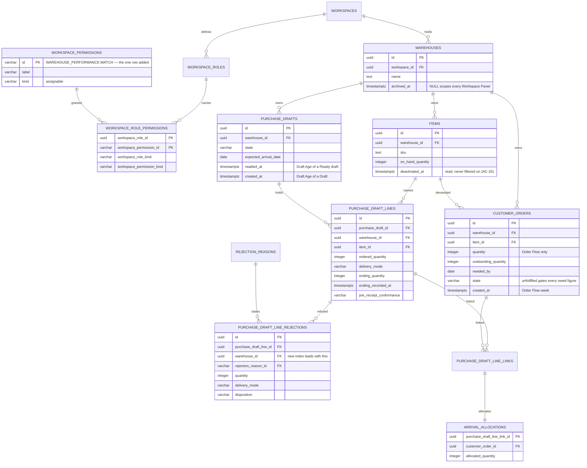

# Data model — dashboards

**No new relation, no new column, no new state transition, and no write path.** This feature adds
one row to the Workspace Permission catalogue and one index to a shipped relation. Everything else
it presents is derived on read, inside PostgreSQL, from records `ordering`, `delivery-addresses` and
`arrival-inspection` own and continue to own (`spec.md` §1, first boundary; `CONTEXT.md`
§ Invariants).

It inherits the persistence architecture in
[`docs/system/server-architecture.md`](../../system/server-architecture.md) and
[ADR 21-07 PostgreSQL persistence with TypeORM](../../system/adr/21-07-2026-postgresql-with-typeorm.md)
without specialising it: PostgreSQL, TypeORM entities in `shared/domain/entities/`, specialized
concrete repositories in `shared/domain/repositories/`, reviewed migration classes, and
`synchronize` disabled everywhere. No entity is added, because no relation is; the four new
repositories named in `sad.md` §5 read the entities that already exist.

Staged migrations live in [`./migrations/`](./migrations/) and are **not** in the live tree. Both
were applied, reverted and replayed against a real PostgreSQL server holding 238 950 Customer
Orders, 120 000 Purchase Draft Lines, 40 000 Purchase Drafts and 19 306 Rejections across 40
Warehouses — the `spec.md` §1 scale — and every Panel's read had its plan checked there. See
[`_audit/data-model-2026-09-21.md`](./_audit/data-model-2026-09-21.md), which records the probes,
the plans, what this environment could not prove, and **one shipped defect the scale seeding
uncovered that has nothing to do with this feature and blocks it anyway**
([§ Drift](#drift-detected)).

Three questions the upstream artifacts routed to this stage are answered here rather than deferred,
and one ruling from `sad.md` §5 is overturned:

- **`spec.md` §8, eighth question — one Workspace Permission or one per record family.** One, at its
  stated default. See [The one catalogue row](#workspace_permissions-one-row-added).
- **`spec.md` §8, fifth question — the index `arrival-inspection` deferred.** Yes, and it is the
  only index added. See [Indexes](#indexes).
- **`spec.md` §8, fourth question + `sad.md` §11 — the deployment timezone and the week start.** The
  week start needs no configuration at all; the timezone needs one value and one home. See
  [Time, timezone and the week](#time-timezone-and-the-week).
- **`sad.md` §5's working Permission name `WAREHOUSE_PERFORMANCE:OBSERVE` is not taken.** The
  identifier is `WAREHOUSE_PERFORMANCE:WATCH`, because `WATCH` is the read verb of both catalogues
  without exception.

`sad.md` §7 also asked whether the existing indexes suffice at the §1 scale. They do, for seven of
the eight Panels, and the eighth had no access path at all. Both halves are measured, not asserted.

## ER diagram

The read set, with the one catalogue row this feature adds. Nothing drawn below is created or
altered except `workspace_permissions`, which gains a row, and
`purchase_draft_line_rejections`, which gains an index. Attributes are limited to the columns the
Dashboards actually read — the relations carry many more.

## Entities

### `workspace_permissions` (one row added)

| Column  | Type         | Value                         | Notes                                                |
| ------- | ------------ | ----------------------------- | ---------------------------------------------------- |
| `id`    | VARCHAR(64)  | `WAREHOUSE_PERFORMANCE:WATCH` | PK. Satisfies `chk_workspace_permissions_identifier` |
| `label` | VARCHAR(100) | `View warehouse performance`  | The catalogue's terse imperative style               |
| `kind`  | VARCHAR(16)  | `assignable`                  | AC-21 requires it be delegable to a custom Role      |

**Aggregate root:** root — system-managed catalogue data, seeded by migration and written by no
application code (`workspaces` AC-18).

**One entry, not one per record family.** `spec.md` §8's eighth question at its stated default. The
surface is read as a whole: `spec.md` §6's one-screen target and the fixed four-Panel layout mean a
reader holding three of four keys would see a grid with a hole in it, which AC-13's reflow rule
exists to prevent and which no user story asks for. One key is also the only shape under which
AC-15's denial — "reveals nothing about how many Warehouses the Workspace holds" — is a property of
the guard rather than of four separate partial answers.

**`WATCH`, not `OBSERVE`.** `sad.md` §5 offered `WAREHOUSE_PERFORMANCE:OBSERVE` as a working name.
Every read Permission in _both_ catalogues uses `WATCH` without exception — `WAREHOUSES:WATCH`,
`WORKSPACE_ROLES:WATCH`, `WORKSPACE_MEMBERS:WATCH`, `ITEMS:WATCH`, `CUSTOMER_ORDERS:WATCH`,
`PURCHASE_DRAFTS:WATCH`, `REJECTIONS:WATCH`, `CUSTOMERS:WATCH`, `USERS:WATCH`, `ROLES:WATCH` — so
`OBSERVE` would introduce a second verb meaning the same thing, in a vocabulary whose whole value is
that the verb is predictable. The subject carries the distinction from the `WAREHOUSES:WATCH` that
already exists at this level and means seeing that the Warehouses exist and what they are called.

**Access patterns:** none new. `WorkspaceAccessGuard` resolves it through the grant read
`workspace-current-user.repository.ts` already performs, served by
`idx_workspace_role_permissions_permission_id` and the `workspace_role_permissions` primary key.

**Constraints inherited, none added:** PK on `id`; `uq_workspace_permissions_id_kind`, which is the
composite `workspace_role_permissions` references; `chk_workspace_permissions_identifier`
(`^[A-Z][A-Z0-9_]*:[A-Z][A-Z0-9_]*$`); `chk_workspace_permissions_kind`;
`chk_workspace_role_permissions_reserved_exclusive`, which admits this row on a custom Role because
it is `assignable`.

### `workspace_role_permissions` (rows added by the release, none by the application)

One row per Workspace Owner Role that existed when the release was applied (AC-21a), written by the
`INSERT … SELECT` in migration `02` and by nothing else. Afterwards the shipped Workspace Role
Editor writes the same shape when an Owner delegates the Permission to a custom Role (AC-21) — the
single write anywhere in this feature's flows, and it belongs to `workspaces`, not here
(`sad.md` §6.7).

### `purchase_draft_line_rejections` (one index added)

No column changes. The index is in [Indexes](#indexes); the relation's shape, constraints and
reference set are `arrival-inspection`'s and are unchanged.

One schema fact this feature leans on and does not restate as a rule:
`chk_purchase_draft_line_rejections_source_matches_mode` makes `source` a function of
`delivery_mode` — `inspected` ⟺ `via_warehouse`, `customer_reported` ⟺ `direct_to_customer`. So
AC-12's "quantity refused by the end customer rather than at the dock" is decidable from either
column, and Reason Concentration reads `delivery_mode`, which is already on the Rejection row and
needs no join to the line.

### Relations read and not changed

`warehouses`, `items`, `customer_orders`, `purchase_drafts`, `purchase_draft_lines`,
`arrival_allocations`, `purchase_draft_line_links`, `rejection_reasons`, `workspace_roles`. Every
column each Panel reads is listed in [The read model](#the-read-model) below; none is added,
widened, backfilled or dropped.

## The read model

Eight reads, one per Panel, each one statement. The table states what each reads so `/api` and
`implement` do not re-derive it from prose, and so the [Indexes](#indexes) section has a concrete
query behind every row.

**The aggregation rule governs all eight** (AC-06a, `spec.md` §6 "Aggregation integrity"): where a
read combines two independent one-to-many relationships, each is aggregated in its own CTE and the
CTEs are joined on a key afterwards. A single fan-out join multiplies one quantity by the other's
row count, which is the defect this rule exists to prevent and the headline integration case in
`sad.md` §10.

### Warehouse surface — scoped `warehouse_id = $1`

| Panel                    | Relations                                                              | Predicates                                                                                                                                                                            | Columns read                                                                                  |
| ------------------------ | ---------------------------------------------------------------------- | ------------------------------------------------------------------------------------------------------------------------------------------------------------------------------------- | --------------------------------------------------------------------------------------------- |
| **Coverage Gap**         | `customer_orders` ⧸ `purchase_draft_lines`+`purchase_drafts` ⧸ `items` | `state = 'unfulfilled'` ⧸ draft `state IN ('draft','ready_for_ordering')`, **both** Delivery Modes ⧸ no filter — `deactivated_at` is read, never applied                              | `outstanding_quantity`, `item_id` ⧸ `ordered_quantity`, `item_id` ⧸ `on_hand_quantity`, `sku` |
| **Arrival Timing**       | `customer_orders` ⧸ `purchase_draft_lines`+`purchase_drafts`           | `state = 'unfulfilled'`, bucketed by `needed_by` ⧸ draft `state = 'ready_for_ordering'` **at read time**, `expected_arrival_date IS NOT NULL`, line `delivery_mode = 'via_warehouse'` | `outstanding_quantity`, `needed_by`, `id` ⧸ `ordered_quantity`, `expected_arrival_date`       |
| **Purchasing Pipeline**  | `purchase_drafts`                                                      | `state IN ('draft','ready_for_ordering')`                                                                                                                                             | `state`, `created_at`, `readied_at` — counts of drafts, never quantities                      |
| **Reason Concentration** | `purchase_draft_line_rejections` ⧸ `rejection_reasons`                 | none beyond the Warehouse — **both** Rejection Sources, every Disposition ⧸ joined on `rejection_reason_id`                                                                           | `rejection_reason_id`, `quantity`, `disposition`, `delivery_mode` ⧸ `label`                   |

Reason Concentration's join to `rejection_reasons` is the one the contract needed and this table did
not record. `openapi.yaml`'s `ReasonConcentrationRow.label` carried an `# unresolved` note saying so
and directing the source to be fixed first, and
[`contracts/api-sync-report.md`](./contracts/api-sync-report.md) § Finding 1 filed it. The label is
read **live** from the catalogue rather than copied onto the Rejection, exactly as
`arrival-inspection` reads it, so the current wording follows a catalogue edit; `rejection_reasons`
is extend-only and the foreign key is `ON DELETE RESTRICT`, so the join can never drop a row that
has Rejections. § Indexes measured the plan before this join was recorded — the join is a primary-key
lookup against a ten-row catalogue, so it does not change the access path
`idx_purchase_draft_line_rejections_warehouse_reason` provides.

Three exclusions are columns of the same statement rather than second reads, because `spec.md` §6
sets exclusion accounting at 100% and a client that subtracts cannot hold it: Arrival Timing's four
(demand beyond the eighth week with the Customer Orders it covers, undated Ready drafts, dated
drafts still in Draft, drafts since Closed or Discarded), and Coverage Gap's Remainder Row count.

### Workspace surface — scoped to the Workspace's **active** Warehouses

Every Workspace read first resolves `warehouses WHERE workspace_id = $1 AND archived_at IS NULL`
and reports the archived count as a field of its own (`spec.md` §8 default). The Workspace is
resolved from the session and never from the request (AC-22), so no read takes a Workspace
identifier as input.

| Panel                   | Relations                                 | Predicates                                                                                                                                  | Columns read                                                                                                 |
| ----------------------- | ----------------------------------------- | ------------------------------------------------------------------------------------------------------------------------------------------- | ------------------------------------------------------------------------------------------------------------ |
| **Demand Pressure**     | `customer_orders`                         | `state = 'unfulfilled'`; Urgency Band from `needed_by` against today                                                                        | `warehouse_id`, `outstanding_quantity`, `needed_by`                                                          |
| **Order Flow**          | `customer_orders` ⧸ `arrival_allocations` | `created_at >= twelve weeks ago`; **every** state including cancelled (the one exception, AC-04/AC-16) ⧸ joined per Customer Order, own CTE | `quantity`, `outstanding_quantity`, `state`, `created_at` ⧸ `allocated_quantity`                             |
| **Purchasing Spread**   | `purchase_drafts`                         | none — the one Panel counting `closed` and `discarded` too (AC-18)                                                                          | `warehouse_id`, `state`                                                                                      |
| **Receipt Reliability** | `purchase_draft_lines`+`purchase_drafts`  | whole retained record, no period bound; the rate predicates below                                                                           | `delivery_mode`, `ending_quantity`, `ending_recorded_at`, `pre_receipt_conformance`, `expected_arrival_date` |

Three things about Order Flow the schema decides, not the contract:

- **The week is `created_at`'s, never the allocation's or the cancellation's** (AC-17). The
  allocation CTE groups by `customer_order_id` and is joined back, so several allocations against
  one order add up in that order's own recording week and a Customer Order with three allocations
  reports the same recorded quantity as one with none (AC-06a).
- **`quantity` is read as it stands** (AC-17a). Nothing stores what a Customer Order asked for at
  any earlier moment, so a past week legitimately moves.
- **The withdrawn part is a cancelled order's retained `outstanding_quantity`.** That is the only
  reading the schema supports: `chk_customer_orders_state_outstanding` keeps the quantity a
  cancellation left uncovered, and no column records what was assigned before it. Stating the whole
  `quantity` as withdrawn would double-count the part already allocated. `/api` owns how the field
  is named; it does not get to pick a different column.

And two about Receipt Reliability:

- **The two rates have different denominators and different Delivery Mode rules.** The On-time
  Arrival Rate is Via Warehouse lines only (AC-20b). The Conformance Rate is **not** restricted by
  Delivery Mode — neither the glossary nor AC-20 restricts it — so a Direct to Customer line
  carrying `met` or `not_met` counts in it. This is easy to get wrong in both directions.
- **Both of the Conformance Rate's exclusions are schema-decidable.**
  `chk_purchase_draft_lines_conformance_requires_ending` makes a verdict exist only where
  `ending_recorded_at IS NOT NULL AND ending_quantity > 0`, and
  `chk_purchase_draft_lines_pre_receipt_conformance_instruction` makes `not_applicable` exactly the
  lines frozen carrying neither a Packaging Type nor a Value-adding Note. Neither needs a rule the
  query has to remember.

## Time, timezone and the week

`spec.md` §8's fourth question and `sad.md` §11's fourth item, answered in two halves.

**The week start needs no configuration.** PostgreSQL's `date_trunc('week', …)` is ISO-8601 and
begins the week on Monday, which is exactly `spec.md` §8's stated default. _Verified on the server:_
`date_trunc('week', DATE '2026-09-20')` — a Sunday — returns Monday 14 September. Nothing is
configured, and no application code computes a week boundary.

**The timezone needs one value and it is load-bearing.** Three figures cannot be computed without
one, and all three shift a whole calendar day across an offset:

| Figure                                          | Expression                                                             |
| ----------------------------------------------- | ---------------------------------------------------------------------- |
| Order Flow's week (AC-16)                       | `date_trunc('week', created_at AT TIME ZONE $tz)`                      |
| On-time Arrival Rate's verdict (AC-20b)         | `(ending_recorded_at AT TIME ZONE $tz)::date <= expected_arrival_date` |
| Overdue, the Urgency and Age Bands, the horizon | `(now() AT TIME ZONE $tz)::date`                                       |

_Verified on the server:_ the instant `2026-09-21 23:30:00+00` is `2026-09-22` in `Europe/Kyiv` and
`2026-09-21` in `UTC`. A Customer Order recorded at that moment belongs to a different week, and an
ending recorded at it is on time or late, depending on nothing but this value.

**Decision — the home is one server configuration value, read from the environment and bound as a
query parameter.** `APP_TIMEZONE`, an IANA zone name, `UTC` in `apps/server/.env.example`, read
through `ConfigService` exactly as `LOG_LEVEL` is, and passed as a bound parameter to every one of
the three expressions above.

- It is **not** a column. Nothing in the product records a per-Warehouse, per-Workspace or per-user
  timezone, and adding one would be a business decision `spec.md` §3 puts out of scope.
- It is **not** the session's `TimeZone` setting. Relying on the connection's implicit zone would
  make the same query answer differently depending on how the pool was opened, and would be
  untestable: a bound parameter is what lets an integration test assert the boundary from both
  sides.
- It is `UTC` by default and stated wherever a week is labelled, per `spec.md` §8.

This is a `tasks` / `implement` item, not a staged change: **no migration is involved**, and this
stage does not edit live configuration. The exact line owed is
`APP_TIMEZONE=UTC` in `apps/server/.env.example`.

## Indexes

Every index is justified by a named read above, and its plan was confirmed on a real PostgreSQL
server at the `spec.md` §1 scale (`_audit` § Plan checks). **One is added.**

| Index                                                 | Columns                             | Query it serves                                                                           | Status   |
| ----------------------------------------------------- | ----------------------------------- | ----------------------------------------------------------------------------------------- | -------- |
| `idx_purchase_draft_line_rejections_warehouse_reason` | `warehouse_id, rejection_reason_id` | Reason Concentration — one Warehouse's Rejections summed by Reason (AC-12)                | **new**  |
| `idx_customer_orders_unfulfilled_demand` (partial)    | `warehouse_id, item_id, needed_by`  | Coverage Gap's outstanding CTE; Arrival Timing's demand; Demand Pressure                  | existing |
| `idx_customer_orders_warehouse_created`               | `warehouse_id, created_at, id`      | Order Flow's twelve-week window                                                           | existing |
| `idx_purchase_drafts_warehouse_state_created`         | `warehouse_id, state, created_at`   | Purchasing Pipeline; Purchasing Spread; the draft side of Coverage Gap and Arrival Timing | existing |
| `idx_purchase_draft_lines_draft_id`                   | `purchase_draft_id`                 | The line side of every draft-driven read                                                  | existing |
| `idx_arrival_allocations_customer_order_id`           | `customer_order_id`                 | Order Flow's allocation CTE                                                               | existing |
| `idx_warehouses_workspace_name`                       | `workspace_id, name, id`            | The active-Warehouse scope of all four Workspace Panels                                   | existing |

### Why the one new index

`purchase_draft_line_rejections` carries exactly one index today —
`uq_purchase_draft_line_rejections_line_reason`, led by `purchase_draft_line_id` — so a
Warehouse-wide read has **no access path at all**. It is also the only relation either Dashboard
reads that is cumulative _and_ unfiltered by state: nothing is ever deleted from it and no predicate
narrows it, so the scan grows with the deployment while the result stays ten rows.
`arrival-inspection`'s data model deferred the index in as many words — "Add it when a product
surface filters by Reason" — and this is that surface.

_Measured, at 19 306 Rejections:_

|         | Plan                                 | Shared buffers | Execution |
| ------- | ------------------------------------ | -------------- | --------- |
| Without | Seq Scan                             | 464            | 1.84 ms   |
| With    | Bitmap Index Scan → Bitmap Heap Scan | 217            | 0.54 ms   |

The 1.84 ms is the figure that grows; the 0.54 ms is not. Build cost on that table: **11.6 ms, 168
kB**.

`rejection_reason_id` follows `warehouse_id` because it is the grouping key, so the index hands back
the Warehouse's rows already in Reason order.

**No `INCLUDE`.** `quantity`, `disposition` and `delivery_mode` are the three columns the aggregate
measures, and covering them would make the index most of the row. The repository uses `INCLUDE`
nowhere, the index-only scan it would enable needs a visibility map the amendment path
(`amended_at`) dirties, and the measured 217 buffers is already well inside budget.

### Indexes deliberately **not** added

- **`purchase_draft_lines (warehouse_id, purchase_draft_id)`, for Receipt Reliability.** This was
  staged, measured, and **withdrawn** — the honest outcome rather than a decision not taken.
  Receipt Reliability is the heaviest read on either surface and the only one with no period bound,
  and no existing index leads with `purchase_draft_lines.warehouse_id` (both composite uniques lead
  with `id`), so the case looked strong. The server disagreed: reading a whole 20-Warehouse
  Workspace, the planner **rejects** the index and parallel-seq-scans, in **15 ms** — sixty times
  inside the 900 ms budget for all four Workspace Panels together. It is chosen only at low
  selectivity: with three Warehouses (7.5% of the relation) the plan is a Bitmap Index Scan on it.
  So it earns its place only where one Workspace is a small fraction of a large multi-tenant
  deployment, which is a shape this evidence cannot reach, and adding it now would be the
  speculative index this repository's own guide forbids. **Trigger to revisit:** a measured miss of
  the §6 Workspace budget on a real deployment, or one where a Workspace holds well under a third of
  `purchase_draft_lines`. It costs nothing to defer — it is a `CREATE INDEX CONCURRENTLY` with no
  data change and no code change.
- **`outstanding_quantity` added to `idx_customer_orders_unfulfilled_demand`.** It is the one column
  Coverage Gap, Arrival Timing and Demand Pressure all heap-fetch. Making the partial index covering
  would turn three reads index-only, but it means **replacing a shipped index** used by `ordering`'s
  own reads, for a measured 8.2 ms that is already inside a 600 ms budget. Not now; named as the
  first lever if the Warehouse budget is ever missed.
- **`purchase_draft_line_rejections.rejection_reason_id` alone.** Subsumed by the new composite,
  whose leading column every read of this relation supplies.

### One thing `implement` must get right, or no index is reached

The Workspace scope has to be bound as an **explicit `uuid[]`**, not left as a correlated subquery.
_Measured, on Order Flow's window:_ written as `warehouse_id IN (SELECT id FROM warehouses WHERE …)`
the planner seq-scans `customer_orders`; written as `warehouse_id = ANY($1::uuid[])` over the
already-resolved active-Warehouse set, it uses `idx_customer_orders_warehouse_created` with **both**
columns in the index condition. The active-Warehouse set is read anyway — every Workspace Panel
reports the archived count — so binding it costs nothing and is the difference between an index
scan and a full scan.

## Concurrency, locks and transactions

There is nothing to serialize: the feature opens no transaction and writes nothing.

- **No `@Transactional()` anywhere.** Every query is read-only and takes the connection's default
  `READ COMMITTED` snapshot. `spec.md` §6's read-only guarantee (0 writes) is therefore a structural
  property, asserted by the architectural tier rather than by a test that counts writes.
- **Each Panel is its own statement and its own snapshot.** Four parallel reads of one surface can
  legitimately disagree by a write that landed between them. This is accepted rather than fixed: the
  Panels report different subjects, no figure on one is derived from a figure on another, and the
  alternative — one repeatable-read transaction spanning four endpoints — is not available across
  four HTTP requests and would buy consistency nobody can observe.
- **Nothing is materialized, so nothing can drift.** No figure is cached, precomputed or written
  back (`CONTEXT.md` § Invariants), so there is no reconciliation job and no stored copy to go stale.
- **The one write in the feature's flows is the Workspace Role Editor's** (`sad.md` §6.7), which is
  shipped code under its own transaction and is not touched here.
- **The migration's lock.** `CREATE INDEX` takes a `SHARE` lock on
  `purchase_draft_line_rejections` for the duration of the build, blocking writes to that one
  relation — a Rejection being raised or amended. Measured at 11.6 ms over 19 306 rows; see
  [Safe evolution](#safe-evolution-against-populated-relations) for the size at which that stops
  being acceptable.

## Repository boundaries

`sad.md` §5 names four new repositories. All four are read-only, live in
`shared/domain/repositories/`, hold no private methods, import nothing from a feature module, and
accept and return persistence-oriented values only
([Creating a server repository](../../system/guides/creating-a-server-repository.md)):

- `WarehouseDemandCoverageRepository` — Coverage Gap and Arrival Timing. Grouped together because
  both read `customer_orders`, `purchase_drafts` and `purchase_draft_lines` under one Warehouse
  predicate; two public methods, one statement each.
- `WarehousePurchasingReadRepository` — the Purchasing Pipeline. One statement over
  `purchase_drafts`.
- `WarehouseRejectionReadRepository` — Reason Concentration. One statement over
  `purchase_draft_line_rejections`, and the sole consumer of the new index.
- `WorkspacePerformanceReadRepository` — the four Workspace Panels, which share the active-Warehouse
  scope that bounds every one of them.

Three boundary rules this feature's shape makes easy to break:

- **No new persistence entity, so no new mapper.** Nothing is added to `shared/domain/entities/` and
  `shared/database/entities.ts` is untouched, so `entity-registry.architectural.spec.ts` has nothing
  to notice. The queries compose their responses inline (`sad.md` §5); a **named** conversion, if one
  appears, goes to `dashboards/rest/mappers/`, never to a repository and never to `shared/`.
- **The bucket axes belong to the SQL, not to the application.** Every week boundary, Urgency Band
  and Age Band is computed in the statement, so no repository returns a row set the use case then
  buckets in memory — which is both the performance point and the one that keeps
  `spec.md` §6's row-bounding honest.
- **The Permission conjunction is not a repository concern.** The two conjunction Panels assert it
  in the query, before any read is issued ([ADR 0001](./adr/0001-conjunction-gated-panel-reads.md)).
  A repository that knew about `observedPermissionIds` would be importing a feature concept.

## Security

`spec.md` §6.1 classifies both surfaces confidential. Four consequences for this model:

- **No Customer identity is selected or keyed on, and the schema makes that checkable.**
  `customer_orders` carries `customer_id`, `customer_delivery_address_id` and `customer_name`;
  `purchase_draft_lines` carries `frozen_customer_name` and `customer_delivery_address_id`. None
  appears in any column list above, in any `GROUP BY`, or in any index this feature adds. The
  `/api` contract and the per-query check in `sad.md` §10 assert it; the read model is where the
  list of forbidden columns is written down.
- **The one added Permission admits eight reads and nothing else.** It appears in no other handler's
  metadata, and it is the only catalogue row this feature writes. `chk_workspace_role_permissions_reserved_exclusive`
  admits it on a custom Role precisely because it is `assignable` — _verified by probe_ — which is
  AC-21 as a schema fact rather than as a rule the Role Editor remembers.
- **The new index keys on nothing member-supplied.** `warehouse_id` is a system identifier and
  `rejection_reason_id` a catalogue identifier, so neither can surface member prose in a constraint
  error. The Rejection's `description` is not indexed, and this feature never reads it.
- **Exclusion counts are aggregates over the reader's own Warehouse.** Every count a Panel states —
  undated drafts, unjudged lines, Warehouses with no rate — is bounded by the same Warehouse or
  Workspace predicate as the figure beside it, so no count can disclose a record outside the scope
  the guard already admitted.

## Test fixtures

No new entity, so no new factory. The integration tier seeds the _shapes_ the reads must survive,
through the builders `ordering`, `delivery-addresses` and `arrival-inspection` already provide —
`apps/server/src/test/` fixtures, extended, not replaced:

- `anItemWithSeveralOrdersAndSeveralLines(...)` — the AC-06a case: one Item, several Unfulfilled
  Customer Orders **and** several open Purchase Draft Lines. The headline integration assertion is
  that its quantities equal those of an Item with one of each.
- `aCancelledOrderWithRetainedOutstanding(...)` — AC-04 and AC-16 together: contributes to no owed
  figure, stays in its Order Flow week as the withdrawn part.
- `aWarehouseWithNoAdmissibleLine(...)` — AC-20a: every line undated, unjudged or Direct to
  Customer, so the Warehouse reports no rate rather than zero.
- `aDraftReadiedAfterALongDraftPeriod(...)` — AC-10: `created_at` a month back, `readied_at`
  yesterday, so the Draft Age reads as a day.
- `aRejectionOfEachSource(...)` — AC-12: `inspected` on a Via Warehouse line and
  `customer_reported` on a Direct to Customer one, which the schema's
  `chk_purchase_draft_line_rejections_source_matches_mode` already forces to agree.

PII guard: every seeded Customer name and address is `example.test` material, and no fixture in this
feature reads a Customer column at all.

## Migrations

| Staged file                                                                                 | Class                                      | What it does                                                                                         |
| ------------------------------------------------------------------------------------------- | ------------------------------------------ | ---------------------------------------------------------------------------------------------------- |
| [`01-add-reason-concentration-index.ts`](./migrations/01-add-reason-concentration-index.ts) | `AddReasonConcentrationIndex1786900000000` | One index on a populated relation. No data change                                                    |
| [`02-grant-dashboard-permissions.ts`](./migrations/02-grant-dashboard-permissions.ts)       | `GrantDashboardPermissions1786900100000`   | One `assignable` Workspace Permission, granted idempotently to every existing `workspace_owner` Role |

Neither is in the live tree. Promotion is a rename to
`1786900000000-AddReasonConcentrationIndex.ts` and `1786900100000-GrantDashboardPermissions.ts`; the
class names already carry those timestamps, which sort after the last shipped migration
(`1786800100000-GrantArrivalInspectionPermissions`). **No shipped migration is edited.**

**Two files rather than the one `sad.md` §7 describes.** Every feature in this repository ships its
schema change and its catalogue grant separately, and `1786025100000-GrantUsersManagementPermissions`
is a standalone grant. The split is also operationally real: reverting a Permission grant touches
production authority and reverting an index touches none, and a reviewer looking for catalogue
changes finds them by file name. `sad.md` §7's "both in one migration" is superseded by this,
recorded in the audit as a deviation.

`02` follows `apps/server/migrations/README.md` § Extending a Permission catalogue exactly, with
`1786700200000-GrantDeliveryAddressPermissions` as its model: insert the catalogue row, then grant
it to every protected Role that already exists with a `NOT EXISTS`-guarded `INSERT … SELECT`,
because provisioning only granted the set known when each Role was created. The insert goes through
`queryRunner.manager.insert`, which maps **entity property names**, while the grant is raw SQL in
snake_case — the mismatch `sad.md` §7 warns about, kept apart deliberately.

### Safe evolution against populated relations

Both relations carry production rows. Neither change needs expand / backfill / contract:

1. **Nothing is added, widened, renamed, dropped or made `NOT NULL`.** There is no column change in
   this release at all, so no existing row is read, rewritten or validated by either migration.
2. **The index build is the only lock.** `CREATE INDEX` — not `CREATE INDEX CONCURRENTLY`, which
   cannot run inside a transaction while every migration here runs inside one — takes a `SHARE` lock
   on `purchase_draft_line_rejections`, blocking Rejections being raised or amended for the duration.
   _Measured: 11.6 ms over 19 306 rows._ Extrapolating linearly, it stays under a second to roughly
   1.5 million Rejections. **The threshold is stated so it can be checked:** a deployment past that
   size should take this index out of the migration and build it concurrently by hand, and the same
   arithmetic is what `spec.md` §1's never-fixed Rejection volume was needed for.
3. **The catalogue insert fails loudly rather than duplicating.** The primary key makes a repeated
   apply an error, which is what `apps/server/migrations/README.md` relies on; the grant is
   `NOT EXISTS`-guarded, so re-applying it is a no-op. _Both verified by probe._
4. **Order matters inside `02`.** The catalogue row is inserted before the grant that references it,
   and `down` reverses exactly.

### What a revert costs

Both `down` methods fully reverse their `up`, verified by applying, reverting and replaying against
a real server with rows present on both sides.

- **`01`'s revert costs nothing.** Dropping an index discards no data; the 19 306 seeded Rejections
  were intact afterwards and the reads fall back to the seq scan they perform today.
- **`02`'s revert removes the Permission from every Role that holds it**, Workspace Owner Roles and
  any custom Role an Owner had since granted it to — the `DELETE` keys on the Permission, not on the
  Role kind, which is what makes the revert complete rather than partial. _Verified: after a revert
  taken with a custom Role holding it, zero rows in either relation and the pre-release grant count
  restored exactly._ The cost is that a Workspace Owner's deliberate delegation is undone silently;
  that is inherent to reverting a catalogue row and is the same trade every Permission migration in
  this repository makes.
- **The ordering is load-bearing.** Grants go before the catalogue row because
  `fk_workspace_role_permissions_permission` is `ON DELETE RESTRICT`. _Verified by probe:_ deleting
  the catalogue row while a grant stands raises that constraint by name.

### Never run `migration:generate` in this repository

`apps/server/package.json` exposes it, and against the shipped entities and schema it emits a
migration that **drops every `chk_*` constraint, every column `DEFAULT` and every `C` collation in
the database**. That is not drift: constraints, defaults and collations live in migrations by
convention while entities carry only column names and types. Both migrations here were written by
hand, and this release did not re-run the scan `delivery-addresses`' audit records.

## Drift detected

The documented model, the TypeORM entities and the shipped migrations agree on every column, type,
nullability, relation, constraint and index this feature reads. No drift was found between them.

One defect was found **in the shipped schema**, by seeding to the `spec.md` §1 scale. It is not this
feature's to fix and it is recorded here because this feature's premise runs into it:

> **`purchase_drafts.reference` collides permanently from the 10 000th Purchase Draft.** The column
> DEFAULT is `'PD-' || lpad(nextval('purchase_draft_reference_seq')::text, 4, '0')`, and PostgreSQL's
> `lpad` **truncates** a string longer than its target width. So `nextval` 10000 mints `PD-1000`,
> 10001 mints `PD-1000`, 12345 mints `PD-1234` — each colliding with a reference already issued —
> and `uq_purchase_drafts_reference` rejects the insert. _Reproduced:_ the 10 000th draft fails, and
> every draft after it fails, deployment-wide, because the sequence is global rather than
> per-Warehouse. No Purchase Draft can ever be created again.

Why it belongs in _this_ document: `spec.md` §1 fixes 250 **open** drafts per Warehouse and up to 20
Warehouses per Workspace, and Receipt Reliability reads the **whole retained record** — every draft
ever closed or discarded. The 10 000-draft ceiling is reached by a single mid-sized deployment
within a year or two of normal use, which is inside the horizon this feature's unbounded reads are
designed for. The fix is a one-line migration widening the pad; it is owed by whoever owns
`ordering`, and it is listed in [Carried forward](#carried-forward) with an owner.

## Questions answered here

- `spec.md` §8 fourth — timezone and week start → [Time, timezone and the week](#time-timezone-and-the-week).
  Week start needs no configuration; the timezone is `APP_TIMEZONE`, one bound parameter, default
  `UTC`.
- `spec.md` §8 fifth — the deferred Rejection index → [Indexes](#indexes). Added, measured. The
  Rejection **volume** the question said was needed to size it turned out to be needed for something
  else: not the index's shape, which is decided by the query, but the migration's lock window, which
  is why [Safe evolution](#safe-evolution-against-populated-relations) states a row-count threshold
  instead of leaving the volume open.
- `spec.md` §8 eighth — one Permission or several → [`workspace_permissions`](#workspace_permissions-one-row-added).
  One.
- `sad.md` §11 — the Permission's catalogue key → `WAREHOUSE_PERFORMANCE:WATCH`, not the working
  `…:OBSERVE`.
- `sad.md` §7 — whether the existing indexes suffice → [Indexes](#indexes). Seven of eight Panels
  yes, measured; the eighth had no access path and now has one.

## Carried forward

- [ ] **`purchase_drafts.reference` collides from the 10 000th draft** ([§ Drift](#drift-detected)).
      A one-line migration widening the `lpad` target, plus a decision on the references already
      minted. — owner: `ordering` owner (Tech Lead), due: **before this feature ships**, because its
      reads assume a retained record that the defect caps.
- [ ] **`APP_TIMEZONE` is decided but not added.** This stage writes no live configuration. The line
      owed is `APP_TIMEZONE=UTC` in `apps/server/.env.example`, plus the `ConfigService` read and the
      bound parameter in all three expressions. — owner: Backend Lead, due: `tasks`
- [ ] **The Permission catalogue's hand-enumerated gate must be extended.**
      `packages/shared-types/src/enums/workspace-permission-vocabulary.spec.ts` pins
      `MIGRATION_WORKSPACE_PERMISSION_CATALOGUE` as a literal list and asserts it matches
      `WorkspacePermissionId` exactly. Adding the enum entry without adding the literal **fails**
      that test; adding neither passes it silently. Both are owed together, and `apps/server`
      resolves `@warehouser/shared-types` through `dist`, so the package needs rebuilding before
      server tests see the new entry. — owner: Backend Lead, due: `implement`
- [ ] **The `purchase_draft_lines` index was withdrawn on evidence this environment can produce, not
      on evidence from production.** If the Workspace surface misses its 900 ms p95 on a real
      deployment, that index is the first thing to reconsider
      ([Indexes deliberately not added](#indexes-deliberately-not-added)). — owner: Backend Lead,
      due: after the first real-PostgreSQL measurement
- [ ] **The p95 targets remain unproven and this stage did not change that.** The plan checks here
      ran on PostgreSQL 14 with a synthetic distribution; production targets `postgres:17-alpine`.
      Every figure quoted in this document is directional evidence about _plans_, not a latency
      measurement. — owner: Tech Lead, due: before `ship`
