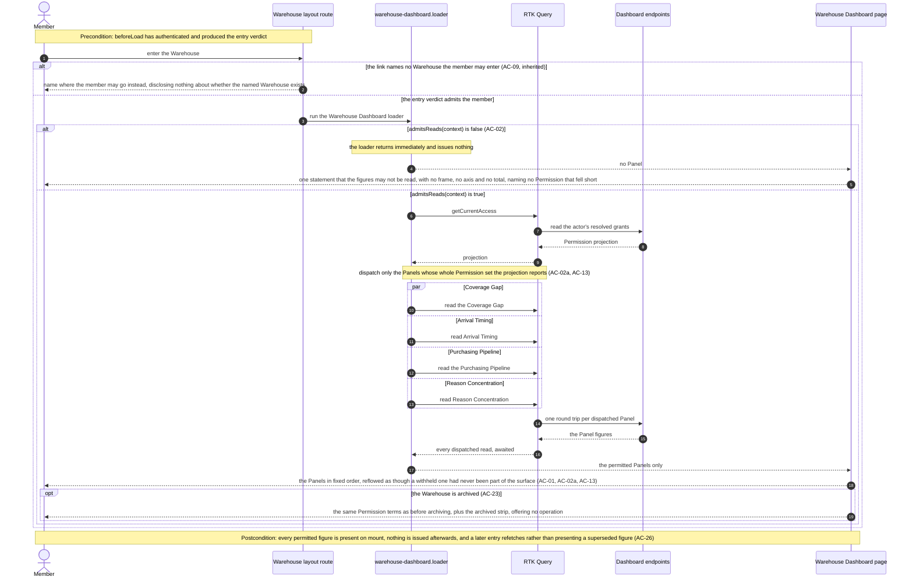
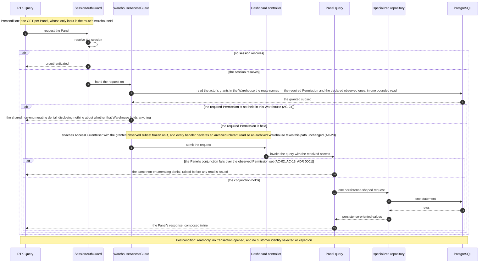
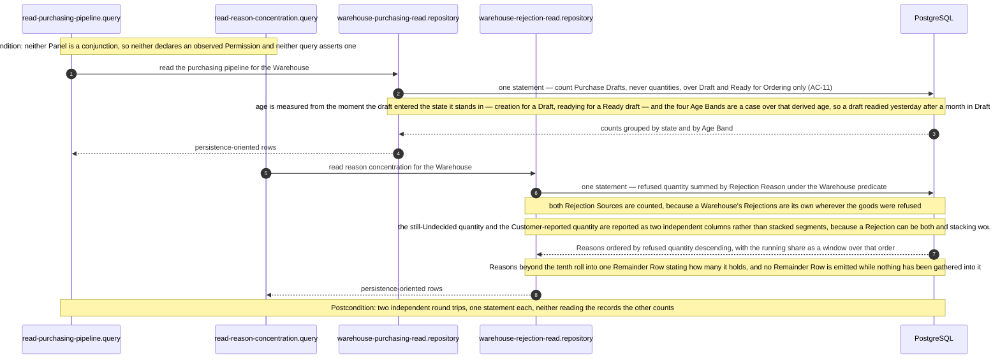
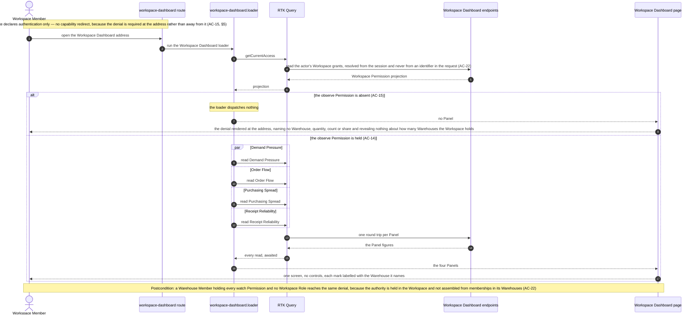
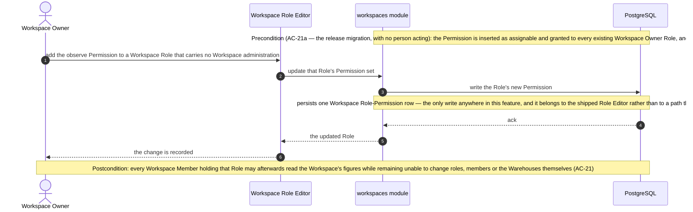

# Software Architecture Description — dashboards

## 1. Context and quality goals

Every record these surfaces read already exists and is already owned. `apps/server/src` holds
`customer-orders`, `items`, `purchase-drafts`, `customers`, `access`, `auth`, `users`, `warehouses`
and `workspaces`; `purchase_draft_line_rejections` shipped with `arrival-inspection` two releases
ago and `arrival_allocations` with `ordering` before it. What none of them holds is a read **across**
them. This feature adds eight such reads and one Workspace Permission, and stores nothing else.

Two facts about the existing system shape everything below.

**The Warehouse's landing view is already this feature's route.** `modules/warehouse`'s
`warehouseDashboardRoute` is the index child of the Warehouse layout, its component is
`WarehousePage`, and that page renders `DesignSystemExample`. The approved design replaces exactly
that page; no route is created on the Warehouse side.

**The Workspace level has no vocabulary for this read.** Every `WorkspacePermissionId` today is
administrative — renaming, roles, members, the Warehouse lifecycle, the Warehouse's delivery
address. `WorkspaceAccessGuard` resolves a single required Workspace Permission from the session and
names no target, and it carries no observed-Permission mechanism at all. The one entry this feature
adds to the catalogue is therefore the whole of its stored-data footprint.

The quality goals that actually constrain the design are the measurable ones in `spec.md` §6, and
each is traced to the structure that serves it:

| Goal                                    | What it forces                                                                                             |
| --------------------------------------- | ---------------------------------------------------------------------------------------------------------- |
| ≤ 1 round trip per chart, 0 after paint | One endpoint per Panel, every one awaited in a route loader                                                |
| Aggregation integrity                   | Each aggregate computed in its own CTE and joined on a key, never a single fan-out join                    |
| Exclusion accounting (100%)             | Every excluded count is a **field of the Panel's response**, not a second read and not a client derivation |
| Demand-figure honesty                   | `state = 'unfulfilled'` is a predicate of the read, with Order Flow the one named exception                |
| Authority staleness (0)                 | The guards' existing per-request grant read; no authority cached anywhere                                  |
| Read-only guarantee (0 writes)          | Queries only; the feature owns no command and no handler module                                            |
| Read freshness (0 superseded reads)     | Refetch on entry rather than tag invalidation — §8 "Freshness"                                             |

## 2. Constraints inherited from `docs/system`

Linked, not restated. Each row is a rule this feature obeys as written.

| Constraint                                                                                                                                                                                      | Source                                                                                                 |
| ----------------------------------------------------------------------------------------------------------------------------------------------------------------------------------------------- | ------------------------------------------------------------------------------------------------------ |
| Modules are named for the entity or cohesive business capability they own; modules are flat and do not nest                                                                                     | [Domain-owned flat modules](../../system/adr/14-08-2026-domain-owned-flat-modules.md)                  |
| Persistence access lives in specialized concrete repositories in `shared/domain/repositories/`, shaped around a cohesive operation, knowing nothing of feature modules, with no private methods | [Creating a server repository](../../system/guides/creating-a-server-repository.md)                    |
| A query is a class named `*Query` in `<module>/usecases/queries/`, one per file, carrying only its class and its input/result types                                                             | [Server architecture](../../system/server-architecture.md) § Use cases, § architectural tier           |
| A use case is never a pass-through; a service is an extraction, never a default layer                                                                                                           | [Server architecture](../../system/server-architecture.md) § Services, § Use cases                     |
| Authorization is declarative: `SessionAuthGuard` then one level guard; one `@RequiredPermission`; `@ObservedPermission` narrows and never widens; authority is re-read per request              | [Server request authorization](../../system/guides/server-request-authorization.md)                    |
| The two authority levels never meet; a Workspace Permission on a Warehouse-guarded handler resolves nothing                                                                                     | [workspaces ADR 0001](../workspaces/adr/0001-two-level-request-authorization.md)                       |
| Every branch asks a named predicate; predicates live in `<module>/domain/predicates/`                                                                                                           | [Server error handling](../../system/guides/server-error-handling.md) §1–2                             |
| Every boundary shape is a Zod schema in `packages/contracts`, adapted with `createZodDto`                                                                                                       | [Adding and using contracts](../../system/guides/adding-and-using-contracts.md)                        |
| Schema changes are reviewed TypeORM migrations; runtime synchronization stays disabled                                                                                                          | [PostgreSQL/TypeORM ADR](../../system/adr/21-07-2026-postgresql-with-typeorm.md)                       |
| Structured Pino logs only; no telemetry SDK, tracing, metrics exporter or feature telemetry                                                                                                     | [Logging instead of telemetry](../../system/adr/03-08-2026-structured-logging-instead-of-telemetry.md) |
| A route owns first-paint readiness and awaits its data through a module-owned loader; a loader dispatches and does not decide access                                                            | [Frontend architecture](../../system/frontend-architecture.md) § Route, § Source structure             |
| RTK Query owns server state through one shared API slice; modules inject endpoints                                                                                                              | [RTK Query ADR](../../system/adr/02-08-2026-rtk-query-for-web-api-calls.md)                            |
| Conditional rendering is `shared/components/Conditional`; no element ternary, no `&&` gate; no `if`/`else if` chain                                                                             | [Writing web components](../../system/guides/writing-web-components.md) §6–§7                          |
| All paths are declared in `shared/constants/routes.ts`                                                                                                                                          | [Frontend architecture](../../system/frontend-architecture.md) § Guards and paths                      |
| All user-visible copy is i18next namespaces under `public/locales/<language>/`                                                                                                                  | [Localization guide](../../system/guides/adding-and-maintaining-web-localization.md)                   |
| HeroUI v3 components and the tokens `@heroui/react/styles` supplies; `global.css` does not redeclare them                                                                                       | [Frontend architecture](../../system/frontend-architecture.md) § Components, `styles/global.css`       |
| The approved design controls visual intent and authorizes no architectural bypass                                                                                                               | [Frontend architecture](../../system/frontend-architecture.md) § UI design boundary                    |

### Proposed deviation

**`apps/web/src/styles/global.css` gains ten `--chart-*` custom properties.** The file's token policy
forbids redeclaring a HeroUI variable with a hand-picked value, and that prohibition is kept in full:
none of the ten is a HeroUI variable, and no HeroUI variable is redeclared. They are new product
variables for a role HeroUI has none for — categorical and ordinal chart series — derived from
`--accent`'s own hue rather than picked by eye, validated in both modes, and mirrored from the
`chart/*` variables the approved `.pen` now carries (`design-handoff.md` § Tokens). They are
declared in the same two scopes HeroUI uses for its own, so the theme toggle and the OS setting keep
working unchanged.

This is recorded as a deviation rather than an unremarkable addition because the policy comment in
that file is absolute about what may be written there, and a reader who finds ten new variables
should find the reasoning beside them. The alternative — a second stylesheet the charts import —
would create the parallel token layer the policy exists to prevent.

### Three consequences that are easy to mistake for deviations

- **A server module that owns no table.** `dashboards` has no `domain/entities/` because it stores
  nothing. [ADR 14-08](../../system/adr/14-08-2026-domain-owned-flat-modules.md) names a module for
  "the business entity **or cohesive business capability** it owns", and this one owns a capability
  with its own glossary and its own invariants — Coverage Gap, Uncovered Quantity, Urgency Band, Age
  Band, Draft Age, Remainder Row, Recorded Quantity (`CONTEXT.md`). Those rules belong to nothing
  else, and spreading them across `customer-orders`, `items` and `purchase-drafts` would give three
  modules a read that enforces none of their invariants.
- **A query that refuses.** Coverage Gap and Arrival Timing assert a Permission conjunction from
  `observedPermissionIds` and raise the shared non-enumerating denial. That is a narrowing read of
  the principal, in the same family as `readsRejectionCause` withholding a line's Rejections — not a
  guard decision, and not admission. [ADR 0001](./adr/0001-conjunction-gated-panel-reads.md) records
  it.
- **Four endpoints where one surface is rendered.** `spec.md` §6 fixes "≤ 1 round trip per chart",
  so the per-Panel endpoint is the specification's own transport, not a decomposition added here.

## 3. Scope and target surfaces

`target_surfaces: ['web-frontend', 'backend-service']` — the surfaces `spec.md` §1 and the
[architecture map](../../system/architecture-map.md) admit. No worker, no CLI, no SDK: the feature
adds no asynchronous work and BullMQ remains uninstalled.

### In scope

- A new server module `dashboards` with eight queries and two REST controllers.
- Four new specialized repositories in `shared/domain/repositories/`.
- One new `WorkspacePermissionId` catalogue entry, its migration, and its grant to every existing
  Workspace Owner Role.
- One new index on `purchase_draft_line_rejections`, if `/data-model` confirms it (§11).
- A new `packages/contracts/src/dashboards` subpath.
- The Warehouse Dashboard replacing `modules/warehouse`'s placeholder page.
- A new flat web module `modules/workspace-dashboard` owning `/workspace/dashboard`, and the
  Workspace rail's second entry.
- Chart presentation primitives in `apps/web/src/shared/components/charts/` and scale helpers in
  `apps/web/src/shared/utils/`.
- Ten `--chart-*` variables in `apps/web/src/styles/global.css`.

### Out of scope

- Every non-goal in `spec.md` §3: configuration, filters, date ranges, drill-through, export,
  alerts, thresholds, monetary figures, stock history, cross-Warehouse Item identity.
- Any write path. The feature owns no command, no event use case and no handler module.
- Caching or materialization of any figure. Every number is derived on read (`CONTEXT.md`
  § Invariants).
- Read rate limiting. None exists in the application today and this feature does not introduce it
  (§8 "Security and privacy").
- The three `spec.md` §8 amendments to `ordering`, `delivery-addresses` and `workspaces`. They are
  documentation changes owed alongside this feature and are tracked in §11, not performed here.
- **AC-09, the stale Warehouse link.** It is already served by shipped code this feature does not
  touch: `guards/landing.guard.ts` resolves where an actor belongs, `routes/warehouse.route.tsx`
  produces the entry verdict, and `shared/components/WarehouseEntryRefusal` renders the
  non-disclosing refusal. `design-handoff.md` § States records the same conclusion. The criterion
  holds by inheritance; no code here implements it and §10 adds no test for it.

## 4. Solution strategy

**One module, eight queries, four repositories, two controllers, two surfaces.**

1. **Derive on read, in the database.** Every Panel is one repository method issuing one SQL
   statement. No figure is cached, materialized, precomputed or written back
   (`CONTEXT.md` § Invariants; `spec.md` §6 "Read-only guarantee").

2. **One aggregate per context, joined on a key.** AC-06a forbids any quantity being multiplied by
   the row count beside it, which is exactly what a naive join across two one-to-many relationships
   produces. Every statement that combines independent aggregations does so as CTEs — one per
   relationship, each grouped in its own context — joined afterwards on `item_id` or
   `warehouse_id`. This is an invariant of the SQL, asserted by integration tests that seed an Item
   with several Customer Orders _and_ several Purchase Draft Lines and assert the quantities do not
   move (§10).

3. **Exclusions are fields, not inference.** Every count a Panel leaves out — demand beyond the
   eighth week and the Customer Orders it covers, undated drafts, drafts still in Draft, drafts
   since Closed or Discarded, lines with no ending, unrecorded and not-applicable conformance
   verdicts, the Warehouse with no rate, the archived Warehouses not shown — is a named field of the
   same response, computed by the same statement. `spec.md` §6 sets that at 100%, and the only way
   to hold it is to make the exclusion count a column rather than something the client subtracts.

4. **Authorization is the existing stage, used twice.** The Warehouse Panels compose
   `SessionAuthGuard` + `WarehouseAccessGuard` with `@ArchivedTolerantRead()`; the conjunction
   Panels add `@ObservedPermission` and assert it in the query
   ([ADR 0001](./adr/0001-conjunction-gated-panel-reads.md)). The Workspace Panels compose
   `SessionAuthGuard` + `WorkspaceAccessGuard` with the one new Permission. Nothing new is built.

5. **The client asks only for what it may read.** The route loader reads the Permission projection
   it already fetches and dispatches only the permitted Panel reads, so an absent Panel is produced
   by not asking — which is what makes AC-13's "no frame, no title and no count" a property of the
   layout rather than of a response.

6. **The charts are components, not a library.** Every mark is a positioned box over a linear scale
   ([ADR 0002](./adr/0002-charting-without-a-charting-dependency.md), Proposed).

## 5. Building blocks and ownership

### Server

```text
apps/server/src/dashboards/
├── domain/
│   └── predicates/
│       ├── panel-access.predicates.ts        # readsCoverageGap, readsArrivalTiming (over observedPermissionIds)
│       └── dashboard-week.predicates.ts      # isWithinHorizon, isDatedReadyDraft, …
├── usecases/
│   ├── queries/
│   │   ├── read-coverage-gap.query.ts
│   │   ├── read-arrival-timing.query.ts
│   │   ├── read-purchasing-pipeline.query.ts
│   │   ├── read-reason-concentration.query.ts
│   │   ├── read-demand-pressure.query.ts
│   │   ├── read-order-flow.query.ts
│   │   ├── read-purchasing-spread.query.ts
│   │   └── read-receipt-reliability.query.ts
│   └── usecase.module.ts
├── rest/
│   ├── controllers/
│   │   ├── warehouse-dashboard.controller.ts
│   │   └── workspace-dashboard.controller.ts
│   ├── dtos/                                  # createZodDto adapters over the contracts subpath
│   └── rest.module.ts
└── index.ts                                   # DashboardsUsecaseModule, DashboardsRestModule
```

No `domain/entities/`, no `domain/services/`, no `handlers/`. A service would be an extraction with
no second caller — each Panel's rules are its own — and
[Server architecture](../../system/server-architecture.md) § Services forbids a service exactly one
use case calls. No `domain/mappers/`: a query composing its own response inline is the query, and
the architectural tier's mapper detector excludes an anonymous inline composition. A **named**
conversion, if one appears, goes to `dashboards/rest/mappers/`.

The queries are not pass-throughs: each holds the Panel's own rules — which states count, which
exclusions are stated, how buckets are bounded, and (for two of them) the Permission conjunction —
and hands the repository a persistence-shaped request.

### Shared persistence

```text
apps/server/src/shared/domain/repositories/
├── warehouse-demand-coverage.repository.ts    # Coverage Gap, Arrival Timing
├── warehouse-purchasing-read.repository.ts    # Purchasing Pipeline
├── warehouse-rejection-read.repository.ts     # Reason Concentration
└── workspace-performance-read.repository.ts   # Demand Pressure, Order Flow, Purchasing Spread, Receipt Reliability
```

Grouped by the cohesive persistence operation each provides rather than one class per Panel: the two
Warehouse demand Panels read the same three tables under the same Warehouse predicate, and the four
Workspace Panels share the active-Warehouse set that scopes every one of them. Each is a concrete
class with public methods only, accepting and returning persistence-oriented values, importing
nothing from a feature module
([Creating a server repository](../../system/guides/creating-a-server-repository.md)).

### Shared catalogue

One entry added to `packages/shared-types/src/enums/workspace-permission-id.ts`. Its key is owed by
`/data-model` (§11); `WAREHOUSE_PERFORMANCE:OBSERVE` is the working name, following the
`SUBJECT:VERB` shape of every existing entry.

### Web

```text
apps/web/src/
├── shared/
│   ├── components/charts/          # PanelCard, ChartLegend, StackedBarRow, ColumnPlot,
│   │                               # HeatGrid, BubblePlot, PanelFootnote  (two consumers, no entity owner)
│   ├── utils/chart-scale.ts        # linearScale, bucketOffset — pure, unit-tested directly
│   └── constants/routes.ts         # + WORKSPACE_DASHBOARD
├── modules/warehouse/              # unchanged home: its route.tsx IS the Warehouse Dashboard route
│   ├── page.tsx                    # replaces DesignSystemExample with the Warehouse Dashboard
│   ├── loaders/warehouse-dashboard.loader.ts
│   ├── api/warehouse-dashboard-api.ts
│   └── components/dashboard/       # CoverageGapPanel, ArrivalTimingPanel,
│                                   # PurchasingPipelinePanel, ReasonConcentrationPanel, the grid
├── modules/workspace-dashboard/    # new flat module: one route, one page
│   ├── route.tsx                   # ROUTES.WORKSPACE_DASHBOARD, a root child beside /workspace
│   ├── page.tsx
│   ├── loaders/workspace-dashboard.loader.ts
│   ├── api/workspace-dashboard-api.ts
│   └── components/                 # DemandPressurePanel, OrderFlowPanel,
│                                   # PurchasingSpreadPanel, ReceiptReliabilityPanel, the grid
└── shared/layouts/sidebar/components/WorkspaceNavEntries.tsx   # + the gated Dashboard entry
```

**Why the two surfaces are placed asymmetrically.** Every module in `apps/web/src/modules/` has
exactly one `route.tsx` and one `page.tsx`, and `frontend-architecture.md` § Source structure
declares both singular. So a module cannot own two routes, and the two Dashboards cannot share one.

- The **Warehouse Dashboard needs no new module**: `modules/warehouse/route.tsx` is already the
  Warehouse Dashboard's route — it is named `warehouseDashboardRoute` and is the index child of the
  Warehouse layout — and its page is the placeholder this feature replaces. Moving it to a new
  module would take the route out of the module whose name matches it and leave `modules/warehouse`
  with a hook and no route, which is no longer a module home at all.
- The **Workspace Dashboard needs one**, because `/workspace` is a flat root child owned by
  `modules/workspace` and already occupied by administration. `modules/workspace-dashboard` is a new
  flat sibling named for the glossary term it owns, which is ADR 14-08's promotion rule applied as
  written — a new capability becomes a flat top-level module rather than growing inside another.

The `components/dashboard/` directory inside `modules/warehouse` is a **component grouping**, not a
module home — no `route.tsx`, no `page.tsx`, no entry in the module list — which
[the scope-of-exercise ADR](../../system/adr/18-08-2026-scope-of-exercise-placement-tiebreak.md)
§ "Home versus grouping" permits and
[Placing web components](../../system/guides/placing-web-components.md) prescribes.

The chart primitives are promoted to `shared/` on the stated test: two modules consume them and no
single domain entity owns a stacked bar.

**No new route guard.** `requireWorkspaceCapability` redirects an actor without administration away
from `/workspace`; the Dashboard must not copy it, because AC-15 and the approved design (frame
`ujNPP` tile 1) require a **denial rendered at the address**, not a redirect. So
`modules/workspace-dashboard/route.tsx` declares `requireAuth` only, its loader dispatches nothing
when the Permission is absent, and the page renders the denial — the shape `ItemPage` already uses
for a permission-less actor. The rail entry is gated, so the address is reached only by an actor who
already had it.

### Contracts

`packages/contracts/src/dashboards/` — eight response schemas and the two shared value shapes
(a bucket, an exclusion count). No request bodies: every read is a `GET` whose only input is the
route's `warehouseId` or the session's Workspace.

## 6. Runtime view

Participants of the diagrams below: **Member** · **Web route + loader** ·
**RTK Query** · **`SessionAuthGuard`** · **`WarehouseAccessGuard` / `WorkspaceAccessGuard`** ·
**Dashboard controller** · **Panel query** · **specialized repository** · **PostgreSQL**.

### 6.1 Enter a Warehouse and read the Dashboard (AC-01, AC-02, AC-02a, AC-09, AC-13, AC-23, AC-26)



The Warehouse layout route's `beforeLoad` has already authenticated and produced the entry verdict.
`warehouse-dashboard.loader.ts` then runs and, exactly as `loaders/item.loader.ts` does: returns
immediately unless `admitsReads(context)` — so a refusal issues nothing; awaits
`accessPermissionsApi.getCurrentAccess`; and dispatches **only** the Panel reads whose whole
Permission set the projection reports. Each dispatched read is awaited, so the page mounts with
every permitted figure present and issues nothing afterwards (`spec.md` §6 read shape). The page
renders the Panels that returned, in the fixed order, under the reflow rule in
`design-handoff.md` § Information architecture. An archived Warehouse takes the same path:
`admitsReads` is true for `entered-read-only`, every handler declares `@ArchivedTolerantRead()`, and
the page adds the `ArchivedWarehouseChip` strip.

### 6.2 Serve one Warehouse Panel (AC-02, AC-13, AC-23, AC-24, ADR 0001)



`SessionAuthGuard` resolves the session. `WarehouseAccessGuard` takes the target from the route's
`warehouseId`, re-reads the actor's grants for the required Permission **and** the declared observed
ones in one bounded read, and attaches `AccessCurrentUser` with the granted observed subset frozen
on it. A membership held in another Warehouse denies here, which is AC-24 by construction. The
controller invokes the query with `request.access!`. A conjunction Panel's query asserts its
predicate over `observedPermissionIds` and raises the shared non-enumerating denial before issuing
any read. Otherwise it calls one repository method, which issues one statement.

### 6.3 Compute the Coverage Gap (AC-03, AC-04, AC-05, AC-06, AC-06a, AC-08, AC-11, AC-25)

```mermaid
sequenceDiagram
    autonumber
    participant PQ as read-coverage-gap.query
    participant R as warehouse-demand-coverage.repository
    participant DB as PostgreSQL

    Note over PQ,R: Precondition: the conjunction over CUSTOMER_ORDERS, ITEMS and PURCHASE_DRAFTS has already been asserted (ADR 0001)
    PQ->>R: read the coverage gap for the Warehouse
    R->>DB: one statement, four CTEs joined on item_id
    Note over R,DB: outstanding — summed over Unfulfilled Customer Orders, grouped by Item, so a cancelled order's retained quantity is excluded by the state predicate (AC-04)
    Note over R,DB: inbound — the quantity ordered on the lines of Purchase Drafts in Draft or Ready for Ordering, grouped by Item, both Delivery Modes counted, never a link's stated quantity (AC-06, AC-08, AC-11)
    Note over R,DB: on hand — read directly from the Item, with deactivation applied as no filter at all (AC-25)
    Note over R,DB: the three aggregates are independently grouped, so no quantity is multiplied by the number of records counted beside it (AC-06a)
    DB-->>R: per-Item rows carrying uncovered as outstanding less on hand less inbound, floored at nothing (AC-05)
    Note over R,DB: ordered by uncovered descending, then total outstanding descending, then SKU; ten rows kept and every remaining Item rolled into one Remainder Row stating how many it holds (AC-03)
    R-->>PQ: persistence-oriented rows
    PQ-->>PQ: compose the response inline
    Note over PQ,DB: Postcondition: derived on read and stored nowhere, so two members reading the same Warehouse at the same moment see the same ten Items in the same order
```

One statement, four CTEs, joined on `item_id`:

- `outstanding` — `SUM(outstanding_quantity)` over `customer_orders` where
  `warehouse_id = $1 AND state = 'unfulfilled'`, grouped by `item_id`. The state predicate is what
  excludes a cancelled order's retained quantity (AC-04).
- `inbound` — `SUM(ordered_quantity)` over `purchase_draft_lines` joined to `purchase_drafts` where
  the draft's `state IN ('draft','ready_for_ordering')`, grouped by `item_id`, **both** delivery
  modes counted (AC-08). Read from the line's ordered quantity, never from a link's stated quantity
  (AC-06).
- `on_hand` — `items.on_hand_quantity`, read directly; `deactivated_at` is not a filter (AC-25).
- The outer select computes `GREATEST(outstanding - on_hand - inbound, 0)` as Uncovered (AC-05),
  orders by uncovered desc, total outstanding desc, SKU asc (AC-03's stable order), takes ten, and
  a second CTE rolls the remainder into one row with its Item count.

The three aggregates are independently grouped, which is the whole of AC-06a: an Item with three
Customer Orders and two Purchase Draft Lines reports the same quantities as one with one of each.

### 6.4 Compute Arrival Timing (AC-07, AC-08, AC-08a)

```mermaid
sequenceDiagram
    autonumber
    participant PQ as read-arrival-timing.query
    participant R as warehouse-demand-coverage.repository
    participant DB as PostgreSQL

    Note over PQ,R: Precondition: the conjunction over CUSTOMER_ORDERS and PURCHASE_DRAFTS has already been asserted (ADR 0001)
    PQ->>R: read arrival timing for the Warehouse
    R->>DB: one statement — two independent series over one Overdue bucket and eight weeks, plus four exclusion counts as columns of the same result
    Note over R,DB: demand — outstanding quantity on Unfulfilled Customer Orders, bucketed by needed-by; the two series are never netted against one another
    Note over R,DB: supply — Purchase Drafts standing in Ready for Ordering at the moment of the read, bucketed by Expected Arrival Date, counting Via Warehouse lines only (AC-08)
    DB-->>R: the two series and the four exclusions
    Note over R,DB: excluded with their own stated counts — demand owed beyond the eighth week with the Customer Orders it covers, undated Ready drafts, dated drafts still in Draft, and drafts since Closed or Discarded (AC-07, AC-08a)
    R-->>PQ: persistence-oriented rows
    opt a Ready draft's Expected Arrival Date has already passed
        PQ-->>PQ: place it in the first bucket beside the Overdue demand
        Note over PQ: a ruling the specification does not make, carried in §11
    end
    PQ-->>PQ: compose the response inline
    Note over PQ,DB: Postcondition: every series states what it left out, so neither is read as the whole of what is owed or on order, and the difference from the Coverage Gap's Inbound Quantity is accounted for
```

Two independent series over the same bucket axis — one Overdue bucket and eight weeks — plus four
exclusion counts, in one statement. Demand comes from Unfulfilled Customer Orders bucketed by
`needed_by`; supply from `purchase_drafts` standing in `ready_for_ordering` **at read time**,
bucketed by `expected_arrival_date`, counting Via Warehouse lines only (AC-08). The series are never
netted. The four exclusions — beyond-horizon demand with its order count, undated Ready drafts,
dated drafts still in Draft, and drafts since Closed or Discarded — are columns of the same result.
A Ready draft whose Expected Arrival Date has already passed falls in the first bucket beside the
Overdue demand; §11 carries that as a ruling the specification does not make.

### 6.5 Compute the two single-Permission Warehouse Panels (AC-10, AC-11, AC-12)



Neither needs a conjunction, so neither declares an observed Permission and neither query asserts
one.

**Purchasing Pipeline** counts `purchase_drafts` — never quantities — grouped by `state` and by Age
Band, over `state IN ('draft','ready_for_ordering')` only (AC-11). The age is measured from the
moment the draft entered the state it is in, which is two different columns in one statement:
`created_at` for a Draft and `readied_at` for a Ready for Ordering draft, so a draft readied
yesterday after a month in Draft reads as a day old (AC-10). The four bands are a `CASE` over that
derived age.

**Reason Concentration** sums `purchase_draft_line_rejections.quantity` grouped by
`rejection_reason_id` under the Warehouse predicate, ordered by refused quantity descending, with
the running share computed as a window function over that order. It counts **both** Rejection
Sources, because a Warehouse's Rejections are its own wherever the goods were refused — which is
why the Direct to Customer exclusion that governs the dock figures does not govern this one
(`CONTEXT.md` § Invariants). Within each Reason it reports two independent subsets as their own
columns: the quantity still Undecided, and the quantity whose Source is Customer-reported. They are
columns rather than stacked segments because a Rejection can be both, and stacking them would
double-count it (AC-12, `design-handoff.md` § Panel specifications). Reasons beyond the tenth roll
into one Remainder Row that states how many it holds, and no Remainder Row is emitted when nothing
was gathered into it.

### 6.5a Enter the Workspace Dashboard and read it (AC-14, AC-15, AC-22)



The rail entry is gated on the same Permission, so in practice the address is reached only by an
actor who already holds it; the denial is what a stale link, a bookmark or a revoked grant meets.

### 6.6 Compute the Workspace Panels (AC-04, AC-14, AC-15, AC-16, AC-17, AC-17a, AC-18, AC-19, AC-20, AC-20a, AC-20b, AC-22)

```mermaid
sequenceDiagram
    autonumber
    participant WG as WorkspaceAccessGuard
    participant C as Dashboard controller
    participant PQ as the four Workspace Panel queries
    participant R as workspace-performance-read.repository
    participant DB as PostgreSQL

    Note over WG,C: Precondition: the Workspace is resolved from the session, because no Workspace route carries an identifier (AC-22)
    WG->>DB: read the actor's Workspace grants
    DB-->>WG: the granted subset
    alt the observe Permission is absent (AC-15)
        WG-->>C: the shared non-enumerating denial, raised before any figure is read
    else the Permission is held
        WG->>C: attach the resolved access
        C->>PQ: invoke each permitted query
        Note over PQ,R: every query scopes itself to the Workspace's active Warehouses and reports the archived count as a field of its own
        PQ->>R: one persistence-shaped request per Panel
        R->>DB: Demand Pressure — outstanding quantity per Warehouse split into Overdue, due soon and due later, on a scale of quantities (AC-14)
        R->>DB: Order Flow — twelve weeks pooled across the Workspace, bucketed by when each Customer Order was recorded, reading the quantity it asks for now (AC-17a), adding every allocation against that same week rather than the week the goods arrived (AC-17), and presenting the cancelled part as withdrawn from the week (AC-04, AC-16)
        R->>DB: Purchasing Spread — draft counts per Warehouse in every state, the one Panel that counts a Closed or Discarded draft (AC-18)
        R->>DB: Receipt Reliability — both rates over the whole retained record, the mark sized by the quantity that Warehouse received (AC-19)
        Note over R,DB: a recorded ending is judged by the moment it was recorded against its draft's Expected Arrival Date; a line with no ending, an ending that received nothing, and a Direct to Customer line each enter neither part of the rate (AC-20b)
        Note over R,DB: undated lines, lines with no recorded conformance and Not-applicable lines are excluded with their own stated counts rather than counted as having failed (AC-20)
        DB-->>R: per-Warehouse and per-week rows
        R-->>PQ: persistence-oriented values
        opt a Warehouse admits no line into either rate (AC-20a)
            PQ->>PQ: report it as having no rate rather than placing it at nothing or at everything
        end
        PQ-->>C: the four responses, composed inline
    end
    Note over WG,DB: Postcondition: a Workspace Permission has authorized a read of aggregates over Warehouse-owned records and no operation inside any Warehouse
```

`WorkspaceAccessGuard` resolves the actor's Workspace from the session — the Workspace is never
named by the request, which is AC-22 and the cross-Workspace abuse case by construction. Each query
scopes itself to the Workspace's **active** Warehouses (`archived_at IS NULL`) and reports the
archived count as a field (`spec.md` §8 default). Order Flow buckets by `customer_orders.created_at`
and reads `quantity` as it stands (AC-17a), adding every `arrival_allocations.allocated_quantity`
against the week the order was recorded rather than the week the allocation happened (AC-17).
Purchasing Spread counts drafts in every state, the one Panel that does (AC-18). Receipt Reliability
computes both rates over the whole retained record, excluding undated lines, lines with no ending,
endings that received nothing, Direct to Customer lines, and unrecorded or Not-applicable
conformance verdicts — each with its own stated count — and reports a Warehouse with no admissible
line as having no rate rather than as zero (AC-20a). The line-level rules are all predicates of the
same statement: a recorded ending is judged by `ending_recorded_at` against its draft's
`expected_arrival_date`; a line with no ending enters neither part of the rate, because nothing has
yet said the goods reached the dock; an ending that recorded nothing received enters neither part,
because no arrival happened that could be timely or late; and a Direct to Customer line enters
neither, because those goods never reach the dock at all (AC-20b).

### 6.7 Grant the observation Permission (AC-21, AC-21a)



No new flow. The release migration inserts one `workspace_permissions` row as `assignable` and
grants it to every existing `workspace_owner` Role, following
`1786700200000-GrantDeliveryAddressPermissions.ts` exactly. Afterwards a Workspace Owner assigns it
to a custom Workspace Role through the shipped Workspace Role Editor, which gains one row and no
code.

### Flags raised while drawing these flows

- **AC-07 has no home for a late Ready draft.** Resolved above by placing it in the first bucket;
  recorded in §11 because the specification does not say so.
- **The week boundary is undecided.** Every bucketing statement needs `date_trunc('week', ts AT TIME
ZONE :tz)`. `:tz` is a single deployment configuration value and `spec.md` §8's default of
  Monday-start matches PostgreSQL's own `date_trunc('week', …)`. The value's home is owed to
  `/data-model`.
- **Receipt Reliability's size dimension needs a denominator per Warehouse.** "Quantity received" is
  `SUM(ending_quantity)` over Via Warehouse lines whose ending recorded something; the design scales
  the mark's area by it relative to the largest in the set, which is a client computation over a
  server-supplied absolute.

Three further notes belong to the diagrams themselves rather than to the design:

- **No diagram carries a persist note, because the feature has no write path.** The one exception
  is §6.7, whose write belongs to the shipped Workspace Role Editor. What `/data-model` needs from
  these flows is therefore not a list of persisted entities but the read predicates and bucket axes
  the notes carry — the Warehouse and active-Workspace-Warehouse scopes, the four draft states, the
  `needed_by` / `expected_arrival_date` / `created_at` / `ending_recorded_at` bucket columns, and
  the `rejection_reason_id` grouping.
- **No flow is asynchronous.** There is no queue, scheduler, webhook or third-party callback
  anywhere in this feature (§3: BullMQ remains uninstalled), so no diagram carries an idempotency
  key, a retry note or a dead-letter branch, and none should be read as missing one.
- **Two criteria are drawn but not owned here.** AC-09 appears as the first branch of §6.1 marked
  inherited — §3 places it out of scope and no code here implements it — and AC-21a appears as the
  precondition note of §6.7, the release migration being a step with no actor rather than a runtime
  flow.

## 7. Data and interface impact

### Data

**No new business table, column, or state transition.** The feature reads
`customer_orders`, `items`, `purchase_drafts`, `purchase_draft_lines`,
`purchase_draft_line_rejections`, `arrival_allocations` and `warehouses` and writes none of them.

Two schema changes, both in one migration:

1. One `workspace_permissions` row (`kind = 'assignable'`), plus the `workspace_role_permissions`
   grant to every `workspace_owner` Role (AC-21a). The precedent migration is
   `1786700200000-GrantDeliveryAddressPermissions.ts`; its `queryRunner.manager.insert` form maps
   entity property names, so the insert object uses `{ id, label, kind }` and the raw grant SQL uses
   snake_case columns — mixing them is the failure that passes the PGlite tier and vanishes in
   production.
2. One index on `purchase_draft_line_rejections`. The table carries only
   `uq_purchase_draft_line_rejections_line_reason` today, and Reason Concentration groups by
   `rejection_reason_id` under a `warehouse_id` predicate over a cumulative, never-deleted table.
   `arrival-inspection` deferred exactly this index until "a product surface filters by Reason";
   this is that surface. The shape — most likely `(warehouse_id, rejection_reason_id)` — is owed to
   `/data-model`, which also owns the Rejection volume `spec.md` §1 never fixed (§11).

Existing indexes the reads lean on: `idx_customer_orders_unfulfilled_demand`,
`idx_customer_orders_warehouse_created`, `idx_purchase_drafts_warehouse_state_created`,
`idx_purchase_draft_lines_item_id`, `idx_arrival_allocations_customer_order_id`,
`idx_warehouses_workspace_name`. Whether they suffice at the §1 scale is a `/data-model` question,
not an assumption of this document.

### HTTP and shared contracts

Eight `GET` endpoints, one per Panel, each returning one Panel's figures and its exclusion counts.

Two controllers, whose `@Controller` prefixes follow the ones already in the tree —
`api/v1/warehouses/:warehouseId/<resource>` and `api/v1/workspace/<resource>`:

| Surface   | Route                                                           | Required Permission     | Observed                                         |
| --------- | --------------------------------------------------------------- | ----------------------- | ------------------------------------------------ |
| Warehouse | `api/v1/warehouses/:warehouseId/dashboard/coverage-gap`         | `ITEMS:WATCH`           | `CUSTOMER_ORDERS:WATCH`, `PURCHASE_DRAFTS:WATCH` |
| Warehouse | `api/v1/warehouses/:warehouseId/dashboard/arrival-timing`       | `CUSTOMER_ORDERS:WATCH` | `PURCHASE_DRAFTS:WATCH`                          |
| Warehouse | `api/v1/warehouses/:warehouseId/dashboard/purchasing-pipeline`  | `PURCHASE_DRAFTS:WATCH` | —                                                |
| Warehouse | `api/v1/warehouses/:warehouseId/dashboard/reason-concentration` | `REJECTIONS:WATCH`      | —                                                |
| Workspace | `api/v1/workspace/dashboard/demand-pressure`                    | _(the new Permission)_  | —                                                |
| Workspace | `api/v1/workspace/dashboard/order-flow`                         | _(the new Permission)_  | —                                                |
| Workspace | `api/v1/workspace/dashboard/purchasing-spread`                  | _(the new Permission)_  | —                                                |
| Workspace | `api/v1/workspace/dashboard/receipt-reliability`                | _(the new Permission)_  | —                                                |

Every Warehouse handler also declares `@ArchivedTolerantRead()` from
`shared/access/archived-tolerant-read.decorator.ts` (AC-23) — note that decorator's home is
`shared/access/`, not `shared/decorators/` where the three Permission decorators live. No Workspace
route names a Workspace: `WorkspaceAccessGuard` derives it from the session.

`packages/contracts/src/dashboards/` is a **new subpath**, which needs **two** entries in
`apps/web/vite.config.ts` `resolve.alias` — the `@warehouser/contracts/dashboards` mapping and the
bare `dashboards` mapping that contracts' own `baseUrl: src` imports require. Registering only the
first leaves `pnpm --filter @warehouser/web build` broken while every test stays green, which is how
this was missed once already on `22-ordering`.

`packages/shared-types` gains the one enum entry, and `apps/server` resolves that package through
`dist` — an enum edit needs the package rebuilt before server tests see it.

## 8. Cross-cutting concerns

### Security and privacy

`spec.md` §6.1 classifies both surfaces confidential and requires a security review. The structure
answering each abuse case:

- **Cross-Warehouse reach** — `WarehouseAccessGuard` resolves authority from the membership held in
  the Warehouse named by the route, so a Permission held elsewhere denies (AC-24), with the one
  non-enumerating error.
- **Cross-Workspace reach** — no Workspace route carries an identifier; the guard reads the session
  (AC-22).
- **Inference through a withheld chart** — the loader does not ask for a Panel the actor may not
  read, so nothing is rendered in its place. The server independently refuses a direct call. Neither
  path returns a count, a total or a zero (AC-02a, AC-13).
- **Customer identity through an aggregate** — no query selects `customer_id`,
  `customer_delivery_address_id`, `customer_name` or `frozen_customer_name`, and no response is
  keyed by any of them. This is asserted per query rather than assumed (§10).
- **The new Permission as a back door** — it admits eight reads and nothing else; it appears in no
  other handler's metadata.
- **An unmetered read** — stated honestly: the application rate-limits **writes** only
  (`shared/guards/write-rate-limit.guard.ts`,
  [ordering ADR 0003](../ordering/adr/0003-per-member-write-rate-limit.md)). These reads are no
  cheaper to enumerate than the lists they aggregate and carry no identity the lists withhold, but
  `spec.md` §6.1's phrase "subject to the same rate limiting as every other read" describes a
  control that does not exist. §11 carries it for the security review.
- **Archived Warehouse** — served on the pre-archiving terms, offering no operation (AC-23).

### Authorization coverage

Every endpoint declares a Permission and composes the level guard that owns the records it reads;
there is no unguarded route. `spec.md` §6 sets that at 100%.

**The structural gates that would prove it are hand-enumerated, and will not notice this feature
unless they are extended.** `apps/web/src/test/loader-permission-parity/loader-permission-parity.spec.ts`
pins its subjects as literals — `LOADER_FILES`, `PARITY_ROWS` and a named constant per loader path —
so a loader it does not list is not checked rather than reported. The same holds for
`apps/web/src/test/module-boundaries/` (`MODULE_MANIFEST`, `MODULE_SURFACE`),
`apps/web/src/test/route-readiness/` (which enumerates `ROUTES.WAREHOUSE`, `ROUTES.WAREHOUSE_ACCESS`
and `ROUTES.WORKSPACE` by name), and the server's per-module `module-boundaries.spec.ts`, of which
there is one file per module and none for a module that does not have one. Extending each is
implementation work this feature owns, listed in §10 — not something a green run will demand.

### Consistency and freshness

No transaction: every query is read-only and opens none. `@Transactional()` appears nowhere in this
feature.

**Freshness is refetch-on-entry, not tag invalidation.** `spec.md` §6 requires 0 reads of superseded
figures and AC-26 requires a member who has just acted to see the change. Tag invalidation would
meet both only if every present and future mutation across `customer-orders`, `items`,
`purchase-drafts` and `arrival-inspection` declared the Dashboard tag — and `spec.md` §8 records
that none of them knows these reads exist. A forgotten tag fails silently and shows a stale figure,
which `spec.md` §7 names the most expensive failure this feature can have. The Dashboard endpoints
therefore refetch whenever the surface is entered, which cannot be defeated by an omission
elsewhere. The cost is one extra read on a fast re-entry, on a surface that is read on entering and
offers no refresh control. This resolves the Frontend Lead's §8 question; tags are deliberately not
taken and are recorded as the optimisation available if that cost ever matters.

### Performance and diagnostics

`spec.md` §6 sets p95 ≤ 600 ms for the Warehouse surface and ≤ 900 ms for the Workspace surface,
each for every permitted figure together, at the §1 scale. Four parallel single-statement reads is
the shape that budget assumes. Measurement is the structured Pino timing logs the server already
emits — **not** instrumentation added here: `AGENTS.md` forbids adding telemetry, and
[the telemetry ADR](../../system/adr/03-08-2026-structured-logging-instead-of-telemetry.md) forbids
the abstractions that would carry it. Queries take no logger parameter and no `with*` timing wrapper
([Server use case boundaries](../../system/guides/server-use-case-boundaries.md)).

The Workspace surface is the one with real risk: four aggregations across up to 20 Warehouses of the
§1 scale, one of them (Receipt Reliability) over the whole retained record with no period bound.
§11 carries it.

### Web state, freshness and accessibility

Server state is RTK Query in the shared API slice, endpoints injected by each module's `api/`
directory. No Redux slice is added: nothing here is cross-module client state. No context is added.
The route owns first-paint readiness, so no Panel declares a spinner or a skeleton — the route's
`pendingComponent` is the only waiting affordance
([Frontend architecture](../../system/frontend-architecture.md) § Page). Error and empty stay with
the narrowest component: a permitted actor whose read failed reaches that Panel's error arm rather
than an empty grid.

Accessibility is the approved handoff's § Accessibility, which the implementation must satisfy
rather than reinterpret: a visually-hidden `h1` on both surfaces, an `h2` per Panel, row-oriented
Panels as real tables, `tabular-nums` on figure columns, no value readable by colour alone, and no
motion.

### Localization

Two new namespaces, `public/locales/{en,uk}/dashboard.json`, plus the Workspace rail's relabelled
`nav.workspace` → an `nav.administration` key in `common`. Every Panel title, column head, legend
key, footnote and denial string is a key; no literal reaches a component. The locale-key-uniqueness
and baseline gates in `apps/web/src/test/` cover the new files automatically.

### Naming

The feature's own vocabulary is `CONTEXT.md`'s glossary and is used verbatim in type names, query
names, contract fields and copy: Coverage Gap, Uncovered Quantity, Inbound Quantity, Urgency Band,
Age Band, Draft Age, Remainder Row, Recorded Quantity, Assigned Quantity, On-time Arrival Rate,
Conformance Rate. A figure is never renamed between the SQL, the contract and the screen.

## 9. ADR index

Feature decisions:

- [0001 — Authorize a Panel that needs several watch Permissions from the resolved-grant set](./adr/0001-conjunction-gated-panel-reads.md)
  — **Accepted**.
- [0002 — Draw the Panels from layout primitives and module-owned scales, with no charting dependency](./adr/0002-charting-without-a-charting-dependency.md)
  — **Accepted** 2026-09-21 at the `tasks` gate; answers `spec.md` §8 against its d3 default.

Inherited decisions this feature applies unchanged, and does not re-decide:

- [workspaces 0001 — Two-level request authorization](../workspaces/adr/0001-two-level-request-authorization.md)
- [delivery-addresses 0001 — Observed-Permission redaction](../delivery-addresses/adr/0001-observed-permission-redaction.md)
- [arrival-inspection 0001 — Payload-conditional Permission](../arrival-inspection/adr/0001-payload-conditional-permission.md)
- [Domain-owned flat modules](../../system/adr/14-08-2026-domain-owned-flat-modules.md) and
  [the scope-of-exercise tiebreak](../../system/adr/18-08-2026-scope-of-exercise-placement-tiebreak.md)
- [PostgreSQL with TypeORM](../../system/adr/21-07-2026-postgresql-with-typeorm.md),
  [Zod](../../system/adr/12-07-2026-schema-validation-with-zod.md),
  [RTK Query](../../system/adr/02-08-2026-rtk-query-for-web-api-calls.md),
  [Pino](../../system/adr/27-07-2026-structured-logging-with-pino.md),
  [logging instead of telemetry](../../system/adr/03-08-2026-structured-logging-instead-of-telemetry.md)

## 10. Verification strategy

| Tier                        | What it must prove here                                                                                                                                                                                                                                                                                                                                                                                                                                                                                                                                                           |
| --------------------------- | --------------------------------------------------------------------------------------------------------------------------------------------------------------------------------------------------------------------------------------------------------------------------------------------------------------------------------------------------------------------------------------------------------------------------------------------------------------------------------------------------------------------------------------------------------------------------------- |
| Server unit                 | Each query's rules over repository doubles: the conjunction assertion on both sides of **every** member of its set; the state predicates; the exclusion counts.                                                                                                                                                                                                                                                                                                                                                                                                                   |
| Server integration (PGlite) | The SQL. **Aggregation integrity is the headline case**: an Item with several Customer Orders _and_ several Purchase Draft Lines must report the quantities it would with one of each (AC-06a). Also: a cancelled order contributing nothing (AC-04) but staying in its Order Flow week (AC-16); a deactivated Item still shown (AC-25); Direct to Customer counted inbound and not at the dock (AC-08); every exclusion count matching the rows it excludes; a Warehouse with no admissible line reporting no rate rather than zero (AC-20a).                                    |
| Server HTTP contract        | Each endpoint's denial without its required Permission, its denial over an archived Warehouse **absent** `@ArchivedTolerantRead()` — and its success **with** it (AC-23) — and, for the two conjunction Panels, the response on both sides of each observed Permission. Plus: no response carries a Customer field.                                                                                                                                                                                                                                                               |
| Server architectural        | The tree-wide tiers cover the new module with no change: one `*Query` per file in `usecases/queries/`, no named mapper outside a `mappers/` directory, every branch a named predicate.                                                                                                                                                                                                                                                                                                                                                                                            |
| **Hand-enumerated gates**   | **Extended, not inherited.** Each of these pins its subjects as literals and silently skips what it does not list: `apps/web/src/test/loader-permission-parity/` gains both new loaders; `apps/web/src/test/module-boundaries/` gains `modules/workspace-dashboard` in `MODULE_MANIFEST` and `MODULE_SURFACE`; `apps/web/src/test/route-readiness/` gains `ROUTES.WORKSPACE_DASHBOARD`; and `apps/server/src/dashboards/module-boundaries.spec.ts` is created, since that spec is one file per module. Omitting any of them leaves the new code unchecked with every suite green. |
| Migration                   | Applied and reverted; the catalogue row present as `assignable`; every pre-existing `workspace_owner` Role carrying it and no custom Role gaining it (AC-21a).                                                                                                                                                                                                                                                                                                                                                                                                                    |
| Web unit / component        | Each Panel's rendering from a fixed projection, including every exclusion footnote; the reflow rule at one, three and four permitted Panels; the denial surface; the scale helpers tested directly.                                                                                                                                                                                                                                                                                                                                                                               |
| Web route                   | The loader dispatching exactly the permitted reads and nothing on a refused verdict; the page mounting with data present; no read issued after paint.                                                                                                                                                                                                                                                                                                                                                                                                                             |
| Accessibility               | Every series reachable without colour; heading order; tables for row-oriented Panels — the handoff's § Accessibility is the checklist.                                                                                                                                                                                                                                                                                                                                                                                                                                            |

Gate commands, run before the work is considered done:

```sh
pnpm --filter @warehouser/server lint && pnpm --filter @warehouser/server test \
  && pnpm --filter @warehouser/server test:integration \
  && pnpm --filter @warehouser/server test:architectural \
  && pnpm --filter @warehouser/server build
pnpm --filter @warehouser/web lint && pnpm --filter @warehouser/web test \
  && pnpm --filter @warehouser/web build
```

`pnpm --filter @warehouser/web build` is not optional here: the new contracts subpath is exactly the
change whose failure is invisible to the test suites.

**What this strategy deliberately cannot prove.** The §6 latency targets. The integration tier is
PGlite — single-backend WebAssembly, one major version ahead of production — and
[Server architecture](../../system/server-architecture.md) § "What this tier cannot test" is
explicit that load and concurrency specs pass there for the wrong reasons. The p95 targets are
verified against a real PostgreSQL deployment or they are not verified; no green suite may be read
as evidence for them.

## 11. Risks and open questions

Carried forward from `spec.md` §8, still open and now due:

- [x] The three invariant amendments the Workspace surface rests on — `ordering`'s per-Warehouse
      authorization rule and its §3 cross-Workspace exclusion, `workspaces`' rule that a Workspace
      Permission never authorizes an operation inside a Warehouse, and `arrival-inspection`'s rule
      that nothing it reads crosses that boundary. **All three must move together**; the design
      assumes them and cannot proceed to `ship` without them. **Amended by
      [T23](./tasks/cross-feature-invariant-amendments.md) on 2026-09-21**: the §3 exclusion is
      amended in [`ordering/spec.md` §3](../ordering/spec.md#3-non-goals), the Workspace-level rule
      in [`workspaces/spec.md` §6.1](../workspaces/spec.md#61-security--privacy), and the
      Warehouse-boundary rule in
      [`arrival-inspection/spec.md` §6.1](../arrival-inspection/spec.md#61-security--privacy), each
      carve-out naming the Workspace-level Permission as its authority and none composed from a
      Warehouse membership. Still due before `implement`: the Security Lead's review of the three as
      one change. — owner: `workspaces` owner (Tech Lead) + Security Lead, due: before `implement`
- [x] The `ordering` amendment permitting a per-Item derived read to state the arithmetic between
      promised, held and ordered quantity. **Amended by
      [T23](./tasks/cross-feature-invariant-amendments.md) on 2026-09-21** in
      [`ordering/spec.md` §1](../ordering/spec.md#1-context), narrowing the fourth boundary rather
      than replacing it. — owner: `ordering` owner (Tech Lead), due: before `implement`
- [x] The `ordering`/`delivery-addresses` amendment recording that the Expected Arrival Date speaks
      for Via Warehouse lines only. **Amended by
      [T23](./tasks/cross-feature-invariant-amendments.md) on 2026-09-21** in
      [`ordering/spec.md` AC-10](../ordering/spec.md#ac-10-us-05--happy) and
      [`delivery-addresses/spec.md` AC-19](../delivery-addresses/spec.md#ac-19-us-11--happy), which
      also records that a Via Warehouse line's recorded ending is taken as the moment the goods
      arrived. — owner: `delivery-addresses` owner (Tech Lead), due: before `implement`
- [ ] Deployment timezone and week start. Every bucketing statement needs it. _Default:_ one
      deployment timezone, weeks from Monday, which matches PostgreSQL's `date_trunc`. — owner: Tech
      Lead, due: before `data-model`
- [ ] The index on `purchase_draft_line_rejections`, and the Rejection volume §1 never fixed — the
      second is needed to size the first. — owner: Backend Lead, due: before `data-model`
- [ ] One Workspace Permission or one per record family. _Default and this design:_ one. — owner:
      Tech Lead, due: before `data-model`
- [x] The charting decision, [ADR 0002](./adr/0002-charting-without-a-charting-dependency.md),
      recommending **no dependency** against `spec.md` §8's d3 default. **Ruled at the `tasks` gate
      on 2026-09-21: no dependency; ADR 0002 is Accepted.** `apps/web` takes no charting package and
      every mark is a positioned box over `shared/utils/chart-scale.ts`
      ([T15](./tasks/chart-primitives-and-tokens.md)). — owner: Tech Lead
- [ ] Whether the absence of drill-through leaves the surface actionable. Unchanged by this design.
      — owner: PM, due: before `ship`

Raised by the design pass, not present in `spec.md`:

- [x] **AC-07 names no bucket for a Ready draft whose Expected Arrival Date has already passed.**
      The glossary says Overdue means nothing for a draft, so the expected-arrivals series has no
      stated home for a late one. _This design places it in the first bucket beside the Overdue
      demand._ **Ruled at the `tasks` gate on 2026-09-21: the first bucket, as drawn in `z8UrQP`.**
      Carried by [T6](./tasks/arrival-timing-repository.md), which also owes the AC-07 clarification
      in `spec.md` §5. — owner: PM + Tech Lead
- [x] **§6's row-bounding and one-screen targets cannot both hold at 20 Warehouses.** The design
      fixes a rule (list rows flex 20–26 px, then the Panel scrolls internally while the surface
      does not); §6 needs amending to match. **Ruled at the `tasks` gate on 2026-09-21: the design's
      rule stands.** The rule is implemented by [T15](./tasks/chart-primitives-and-tokens.md) and
      the `spec.md` §6 amendment is owed by
      [T23](./tasks/cross-feature-invariant-amendments.md). — owner: Tech Lead
- [ ] **"The same rate limiting as every other read" describes a control that does not exist.**
      The application rate-limits writes only. Either §6.1 is corrected, or read rate limiting
      becomes work this feature does not currently carry. — owner: Security Lead, due: with the
      security review

Risks:

- **Workspace surface latency.** Four aggregations across up to 20 Warehouses, one of them unbounded
  by period, against a 900 ms p95 that no tier in this repository can measure. The mitigation is a
  real-PostgreSQL measurement before `ship`, and the trigger for revisiting §6 is outgrowing the §1
  scale — which §1 already states.
- **Two places must agree on each conjunction Panel's authorization.** A handler declaring an
  observed Permission its query never asserts discloses silently.
  [ADR 0001](./adr/0001-conjunction-gated-panel-reads.md) § Consequences records it; §10 makes the
  both-sides test mandatory rather than optional.
- **Reason Concentration reads a cumulative table.** Rejections accrue against closed drafts and are
  never deleted, so this Panel's cost grows without bound while every other Panel's is capped by the
  §1 standing-level scale. The index decides whether that matters.
- **The new contracts subpath and the shared-types enum edit are both silent-failure changes** — the
  first breaks only `web build`, the second only after a package rebuild. Both are in §10's gate for
  that reason.
