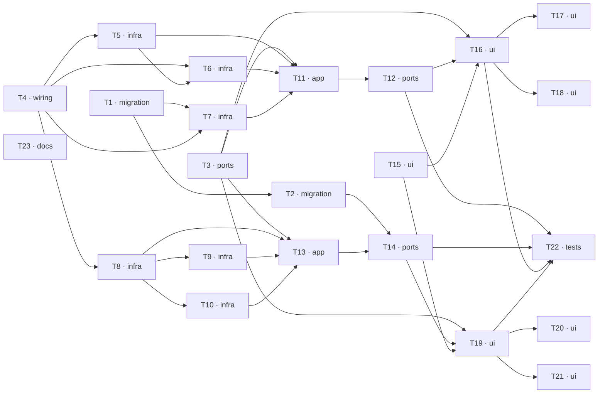

# Epic — dashboards

> **Spec:** [spec.md](../spec.md) · **Design:** [sad.md](../sad.md) · **Data model:**
> [data-model.md](../data-model.md) · **API:** [openapi.yaml](../contracts/openapi.yaml) · **ADRs:**
> [adr/](../adr/) · **UI:** [design-handoff.md](../design-handoff.md) · **Glossary:**
> [CONTEXT.md](../CONTEXT.md)

**Size:** `L` · **Route:** `full` · **Surfaces:** `web-frontend`, `backend-service`

## Goal

Give both levels of the product the read across the records they already keep. A member entering a
Warehouse reads its demand risk, inbound timing, purchasing pipeline and receipt quality in one
screen; a Workspace Member holding the one new authority tells which Warehouse needs attention
without entering any of them. Every figure states what it counts and what it leaves out, or is not
drawn ([spec.md §2](../spec.md)).

## Scope

- **In:** a new server module `dashboards` with eight read queries and two REST controllers; four
  new read-only repositories in `shared/domain/repositories/`; one `WorkspacePermissionId` catalogue
  entry with its migration and its grant to every existing Workspace Owner Role; one index on
  `purchase_draft_line_rejections`; the `APP_TIMEZONE` configuration value; a new
  `@warehouser/contracts/dashboards` subpath; the Warehouse Dashboard replacing
  `modules/warehouse`'s placeholder page; a new flat `modules/workspace-dashboard` owning
  `/workspace/dashboard` plus the Workspace rail's second entry; chart primitives and scale helpers
  in `apps/web/src/shared/`; ten `--chart-*` variables; two locale namespaces; and the four
  upstream rule amendments the Workspace surface rests on.
- **Out:** every non-goal in [spec.md §3](../spec.md) — configuration, filters, date ranges,
  drill-through, export, alerts, thresholds, monetary figures, stock history, cross-Warehouse Item
  identity. **Any write path** (the feature owns no command, no event use case and no handler
  module). Caching or materialization of any figure. Read rate limiting. A charting dependency
  ([ADR 0002](../adr/0002-charting-without-a-charting-dependency.md), Accepted). A hover tooltip
  (ruled out at this gate). **AC-09**, which is served by shipped code this feature does not
  touch and holds by inheritance ([sad.md §3](../sad.md)).

## Task map

Five branches start together: the migration lane (T1 → T2), the contract (T3), the configuration
(T4), the web chart foundation (T15) and the documentation amendments (T23). The two repository
lanes — Warehouse (T5 → T6, T7) and Workspace (T8 → T9, T10) — run in parallel, and so do the two
surfaces' UI Panels once their shells land.

## Tasks

See [tracker.md](./tracker.md) for status. Machine contract: [tasks.json](../tasks.json).

| #   | Task                                                                                                            | Layer       | Blocked by         | DoD (short)                                                                                        |
| --- | --------------------------------------------------------------------------------------------------------------- | ----------- | ------------------ | -------------------------------------------------------------------------------------------------- |
| T1  | [Promote the Reason Concentration index migration](./reason-concentration-index-migration.md)                   | `migration` | —                  | Promoted, applies and reverts cleanly, the index present after up and gone after down              |
| T2  | [Promote the Permission grant migration + catalogue enum](./dashboard-permission-catalogue-migration.md)        | `migration` | T1                 | Migration + enum + vocabulary literal move together; every pre-existing Owner Role carries it      |
| T3  | [Add the contracts/dashboards subpath and both Vite aliases](./dashboards-contracts-subpath.md)                 | `ports`     | —                  | Eight schemas match openapi.yaml, both aliases registered, `web build` passes                      |
| T4  | [Introduce APP_TIMEZONE as one bound parameter](./app-timezone-configuration.md)                                | `wiring`    | —                  | `.env.example` line, ConfigService read, bound parameter; two zones bucket one instant differently |
| T5  | [Coverage Gap statement — four CTEs joined on item_id](./coverage-gap-repository.md)                            | `infra`     | T4                 | An Item with several orders AND several lines reports the quantities of one with one of each       |
| T6  | [Arrival Timing statement — two series, four exclusions](./arrival-timing-repository.md)                        | `infra`     | T4, T5             | Two series never netted; all four exclusion counts equal the rows they exclude                     |
| T7  | [Purchasing Pipeline + Reason Concentration repositories](./warehouse-purchasing-and-rejection-repositories.md) | `infra`     | T1, T4             | A draft readied yesterday reads a day old; an Undecided customer-reported Rejection counts once    |
| T8  | [Workspace scope + Demand Pressure + Purchasing Spread](./workspace-performance-repository-foundation.md)       | `infra`     | T4                 | The scope binds as an explicit uuid[] and EXPLAIN shows the index condition                        |
| T9  | [Order Flow read — twelve weeks on the recording week](./order-flow-repository-read.md)                         | `infra`     | T8                 | Three arrivals in three later weeks all report against the order’s recording week                  |
| T10 | [Receipt Reliability read — two rates, five exclusions](./receipt-reliability-repository-read.md)               | `infra`     | T8                 | Five exclusions stated; a Warehouse with no admissible line reports no rate, not zero              |
| T11 | [Panel-access predicates + four Warehouse queries](./warehouse-panel-queries.md)                                | `app`       | T3, T5, T6, T7     | Each conjunction asserted on both sides of every member, before any read is issued                 |
| T12 | [Warehouse Dashboard REST surface](./warehouse-dashboard-rest-surface.md)                                       | `ports`     | T11                | Archived-tolerant both ways; a foreign-Warehouse membership denies; no Customer field returned     |
| T13 | [Four Workspace Panel queries](./workspace-panel-queries.md)                                                    | `app`       | T3, T8, T9, T10    | No query takes a Workspace identifier; Order Flow names no Warehouse                               |
| T14 | [Workspace Dashboard REST surface](./workspace-dashboard-rest-surface.md)                                       | `ports`     | T2, T13            | A member without the Permission is denied with a body disclosing no Warehouse count                |
| T15 | [Chart primitives, tokens, scales and locales](./chart-primitives-and-tokens.md)                                | `ui`        | —                  | No charting package added; every series readable with colour removed                               |
| T16 | [Warehouse Dashboard shell — loader, grid, reflow, denial](./warehouse-dashboard-shell-ui.md)                   | `ui`        | T3, T12, T15       | Exactly the permitted reads dispatched; nothing issued after paint or on a refusal                 |
| T17 | [Coverage Gap + Reason Concentration Panels](./coverage-gap-and-reason-concentration-panels-ui.md)              | `ui`        | T16                | Real tables with a header row; no Remainder Row while nothing is gathered                          |
| T18 | [Arrival Timing + Purchasing Pipeline Panels](./arrival-timing-and-purchasing-pipeline-panels-ui.md)            | `ui`        | T16                | All four Arrival Timing exclusion counts render from their own projection fields                   |
| T19 | [workspace-dashboard module, route and gated rail entry](./workspace-dashboard-module-ui.md)                    | `ui`        | T3, T14, T15       | The denial renders at the address rather than redirecting; the rail entry is gated                 |
| T20 | [Demand Pressure + Purchasing Spread Panels](./demand-pressure-and-purchasing-spread-panels-ui.md)              | `ui`        | T19                | Demand Pressure on a quantity scale; a count printed in every heat-grid cell                       |
| T21 | [Order Flow + Receipt Reliability Panels](./order-flow-and-receipt-reliability-panels-ui.md)                    | `ui`        | T19                | Every mark direct-labelled; a no-rate Warehouse is unplotted and named in the footnote             |
| T22 | [Extend the four hand-enumerated structural gates](./hand-enumerated-gate-extensions.md)                        | `tests`     | T12, T14, T16, T19 | Each extension shown to fail on a deliberate violation before being reverted                       |
| T23 | [Amend the four upstream rules this feature rests on](./cross-feature-invariant-amendments.md)                  | `docs`      | —                  | All three Workspace amendments reviewed and landed together                                        |

## Serialized lanes

`implement` serializes tasks whose `files_hint` overlap, and every `migration` task regardless:

| Lane                                       | Tasks        | Why                                                    |
| ------------------------------------------ | ------------ | ------------------------------------------------------ |
| `apps/server/migrations/`                  | T1 → T2      | Ordered migration sequence                             |
| `warehouse-demand-coverage.repository.ts`  | T5 → T6      | Two methods of one file                                |
| `workspace-performance-read.repository.ts` | T8 → T9, T10 | Three methods of one file                              |
| `dashboards/usecases/usecase.module.ts`    | T11, T13     | Both register queries                                  |
| `dashboards/rest/` + `app.module.ts`       | T12, T14     | Both register controllers; one gate may close the pair |
| `docs/features/dashboards/spec.md`         | T6, T23      | Both amend the specification                           |

The eight `ui` tasks are **not** auto-serialized: each Panel pair owns its own component files, so
T17/T18 and T20/T21 run in parallel.

## Risks / Hard rules

- **Aggregation integrity (AC-06a).** Every statement combining two independent one-to-many
  relationships aggregates each in its own CTE and joins afterwards on a key. A single fan-out join
  multiplies one quantity by the other's row count. This is the headline integration case in
  [sad.md §10](../sad.md) and the defect [spec.md §7](../spec.md) says costs more trust than the
  surface earns in a quarter.
- **Exclusions are fields, never client derivations.** [spec.md §6](../spec.md) sets exclusion
  accounting at 100%, and the only way to hold it is to make every excluded count a column of the
  same statement.
- **Read-only guarantee: 0 writes.** The feature opens no transaction and owns no command.
  `@Transactional()` appears nowhere in it.
- **A withheld Panel is absent, never empty.** No frame, title, count, placeholder or gap may make
  its absence inferable (AC-02a, AC-13). The denial names no Panel and no Permission.
- **Two places must agree on each conjunction Panel's authorization.** A handler declaring an
  observed Permission its query never asserts discloses silently
  ([ADR 0001](../adr/0001-conjunction-gated-panel-reads.md)); the both-sides test is mandatory.
- **The hand-enumerated gates will not notice this feature unless extended** (T22). Omitting any of
  them leaves the new code unchecked **with every suite green** ([sad.md §8](../sad.md)).
- **Two silent-failure changes.** The new contracts subpath breaks only `pnpm --filter
@warehouser/web build`, and the `shared-types` enum edit only after a package rebuild. Both are in
  every gate for that reason.
- **The §6 latency targets cannot be proven here.** The integration tier is PGlite; load and
  concurrency specs pass there for the wrong reasons. The p95 targets are verified against a real
  PostgreSQL deployment or they are not verified ([sad.md §10](../sad.md)).
- **Ship blockers outside this task set.** `purchase_drafts.reference` collides permanently from the
  10 000th Purchase Draft ([data-model.md § Drift detected](../data-model.md)), owed by `ordering`'s
  owner; and [spec.md §6.1](../spec.md)'s "the same rate limiting as every other read" describes a
  control that does not exist — the application rate-limits writes only.
- **Never bypass the Git hooks.** No `--no-verify`, no `HUSKY=0`, no `core.hooksPath` override. The
  staged-file lint is stricter than `pnpm lint` and judges files it never reaches.

## Decisions taken at this gate (2026-09-21)

| Question                                                                                 | Ruling                                                                                                           |
| ---------------------------------------------------------------------------------------- | ---------------------------------------------------------------------------------------------------------------- |
| [ADR 0002](../adr/0002-charting-without-a-charting-dependency.md) — charting dependency? | **Accepted: none.** Every mark is a positioned box over `shared/utils/chart-scale.ts`                            |
| Which bucket holds a late Ready draft (AC-07)?                                           | **The first bucket**, beside the Overdue demand, as drawn in `z8UrQP`                                            |
| Does a hover tooltip ship?                                                               | **No.** Every value is already a direct label, a numeric column or an axis tick                                  |
| Do the upstream amendments belong to this epic?                                          | **Yes — one `docs` task**, T23                                                                                   |
| §6 row-bounding vs one-screen at 20 Warehouses                                           | **The design's rule stands:** rows flex 20–26 px, then the Panel scrolls internally; `spec.md` §6 amended by T23 |
