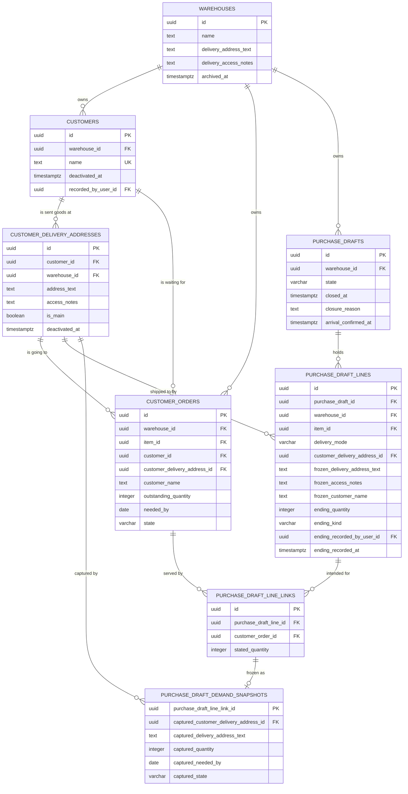

# Data model — delivery-addresses

Two new relations, and — unlike `ordering` — **five shipped relations that already carry rows**.
This model inherits the persistence architecture in
[`docs/system/server-architecture.md`](../../system/server-architecture.md) and
[ADR 21-07 PostgreSQL persistence with TypeORM](../../system/adr/21-07-2026-postgresql-with-typeorm.md)
without specialising it: PostgreSQL, TypeORM entities in `shared/domain/entities/`, specialized
concrete repositories in `shared/domain/repositories/`, reviewed forward-only migration classes, and
`synchronize` disabled in every environment. Feature domain objects never carry TypeORM decorators
and repositories never return them; mapping happens in each module's `domain/mappers/` above the
repository boundary, per
[Creating a server repository](../../system/guides/creating-a-server-repository.md).

Staged migrations live in [`./migrations/`](./migrations/) and are **not** in the live tree. They
were applied over seeded pre-release rows, reverted, and replayed against a real PostgreSQL server,
and every constraint below was probed with representative rows — 59 probes, 59 as expected. See
[`_audit/data-model-2026-09-02.md`](./_audit/data-model-2026-09-02.md), which also records the one
verification the local environment could not perform.

Two `spec.md` §8 questions were due at this stage and are answered here rather than deferred:

- **Freeze by value or by reference (second question).** By value, as `sad.md` §4 and §6.8 take it.
  A frozen line stores the address text, the access notes and the customer name it was read out
  with; the live reference stays only while the line is editable. See
  [`purchase_draft_lines`](#purchase_draft_lines).
- **Case-sensitive or folded name uniqueness (seventh question).** Case-sensitive, following the
  existing non-normalising precedent (`warehouses.name`, `roles.name`, `items.sku`,
  `customer_orders.customer_name` are all collation `C`), and expressed as a **database
  constraint** so concurrency cannot produce two. `"Acme Ltd"` and `"ACME LTD"` are two Customers;
  `spec.md` §7's fragmentation KPI is the trigger to revisit it. See [`customers`](#customers).

## ER diagram

Only the relations this feature creates or changes are drawn. `items`, `packaging_types`,
`item_stock_adjustments` and `arrival_allocations` are untouched and are omitted.

`warehouse_id` is carried on `customers` and on `customer_delivery_addresses` and is drawn into
every composite reference, exactly as `ordering` does. That is what turns "every Customer and
Delivery Address is reachable only through the Warehouse that owns it" (`sad.md` quality goal 2)
from a check the application must remember into a reference the database will not let you break.

## Entities

### `customers`

Aggregate root. Owns the per-Warehouse name, activation, and — through its addresses — where its
goods may be sent.

| Column                | Type        | Constraints                                | Notes                                               |
| --------------------- | ----------- | ------------------------------------------ | --------------------------------------------------- |
| `id`                  | UUID        | PK, app-generated                          |                                                     |
| `warehouse_id`        | UUID        | NOT NULL, FK → `warehouses(id)` RESTRICT   |                                                     |
| `name`                | TEXT        | NOT NULL, collation `C`, trimmed non-empty | Deterministic, non-normalising; follows `items.sku` |
| `deactivated_at`      | timestamptz | NULL, `>= created_at`                      | Inactive when set; reactivation clears it (AC-06)   |
| `recorded_by_user_id` | UUID        | NOT NULL, FK → `users(id)` RESTRICT        | "the member who recorded it and when" (AC-01)       |
| `created_at`          | timestamptz | NOT NULL DEFAULT now()                     |                                                     |
| `updated_at`          | timestamptz | NOT NULL DEFAULT now()                     |                                                     |

**Aggregate root:** root.
**Constraints:** UNIQUE `(warehouse_id, name)` — a customer name identifies at most one Customer
within a Warehouse, **active or Inactive alike** (AC-03, AC-03c), never across Warehouses (AC-03a),
and deactivation does not release it (AC-06). UNIQUE `(id, warehouse_id)` exists purely as a
composite reference target.
**Access patterns:** name availability and the Customer list, ordered by name →
`uq_customers_warehouse_name`.

Activation is a nullable instant rather than a boolean, matching `warehouses.archived_at` and
`items.deactivated_at` — the repo's existing way of saying "withdrawn, reversibly, at a known time".

Nothing denormalizes the name. A Customer Order and a live Purchase Draft Line reach it through
`customer_id`, which is what makes AC-03b — correcting the name changes nothing that names the
Customer — true by construction rather than by a cascade.

### `customer_delivery_addresses`

| Column           | Type        | Constraints                          | Notes                                                 |
| ---------------- | ----------- | ------------------------------------ | ----------------------------------------------------- |
| `id`             | UUID        | PK, app-generated                    |                                                       |
| `customer_id`    | UUID        | NOT NULL                             |                                                       |
| `warehouse_id`   | UUID        | NOT NULL                             | Carried for the composite reference below             |
| `address_text`   | TEXT        | NOT NULL, trimmed non-empty          | Text a member types; never interpreted (`spec.md` §3) |
| `access_notes`   | TEXT        | NULL, trimmed non-empty when present | Gate codes, windows — confidential (`sad.md` §8)      |
| `is_main`        | BOOLEAN     | NOT NULL DEFAULT false               | AC-11's default destination                           |
| `deactivated_at` | timestamptz | NULL, `>= created_at`                | Not offered when set (AC-06a)                         |
| `created_at`     | timestamptz | NOT NULL DEFAULT now()               |                                                       |
| `updated_at`     | timestamptz | NOT NULL DEFAULT now()               |                                                       |

**Aggregate root:** `customers` — an address has no life apart from the Customer that owns it, which
is why it is not its own module either (`sad.md` §4).
**Constraints:**

- Composite FK `(customer_id, warehouse_id)` → `customers(id, warehouse_id)` — an address belongs to
  exactly one Customer of exactly one Warehouse.
- Partial UNIQUE index on `(customer_id) WHERE is_main` — **at most one Main address per Customer**
  (AC-04, AC-05). Partial rather than plain, because every other address of that Customer carries
  `false` and a plain unique constraint would admit only one non-Main address.
- `chk_customer_delivery_addresses_main_is_active` — an Inactive address is never the Main one. This
  is the constraint that makes AC-06b structural: deactivating the Main address and moving the flag
  to a remaining active one has to happen in one transaction, and a once-Main address that is
  reactivated comes back as an ordinary address rather than as a second Main one.
- UNIQUE `(id, customer_id)` — the reference target a Customer Order uses, so "an order names an
  address of the Customer it already names" is proven by the reference (AC-11c).
- UNIQUE `(id, warehouse_id)` — the reference target a Direct to Customer line uses (AC-12).

**Access patterns:** one Customer's addresses, its active set, its active-address count, and the
`FOR UPDATE` last-active read of `sad.md` §6.3 → `idx_customer_delivery_addresses_customer_active`.

The Warehouse's own Delivery Address is deliberately **not** a row here — see
[`warehouses`](#warehouses-changed).

### `customer_orders` (changed)

| Column                         | Type | Constraints                                                                  | Notes                                          |
| ------------------------------ | ---- | ---------------------------------------------------------------------------- | ---------------------------------------------- |
| `customer_id`                  | UUID | NULL, composite FK → `customers(id, warehouse_id)` RESTRICT                  | **New.** AC-11, AC-12                          |
| `customer_delivery_address_id` | UUID | NULL, composite FK → `customer_delivery_addresses(id, customer_id)` RESTRICT | **New.** AC-11, AC-11b, AC-11c                 |
| `customer_name`                | TEXT | **NOT NULL dropped**; still collation `C`, trimmed non-empty when present    | Now the typed-name column only (AC-11a, AC-24) |

Every other column is exactly as `ordering` shipped it.

**Constraints:** `chk_customer_orders_customer_identity` — an order names **a Customer with one of
its Delivery Addresses, or a typed customer name with no address; never both and never neither**.
`sad.md` §7 asks for this as a check rather than a convention, and every row `ordering` shipped
satisfies the typed-name side of it untouched.

Two consequences worth naming, because they are the reason for the shape:

- A Customer-naming order carries **no** `customer_name`. The name is read live from `customers`,
  which is what makes AC-03b hold without a rewrite anywhere.
- The address reference goes through `customer_id`, not through `warehouse_id`. One reference
  therefore proves "the address belongs to the Customer this order names" (AC-11c); the Warehouse
  follows transitively, because the address belongs to the Customer and the Customer belongs to the
  order's Warehouse. A redirection to another Customer's address is refused by the reference itself.

**Access patterns:** one Customer's Unfulfilled orders, earliest needed-by first (AC-08) →
`idx_customer_orders_customer_unfulfilled`.

`sad.md` §6 flags that the Main address is stored **as a reference resolved at record time**. That
is what this model does, and it is deliberate: marking a different address Main afterwards moves no
existing Customer Order, because the order names an address and not "the Main one"
(`CONTEXT.md` §Invariants). The `sad.md` §11 request to confirm it at `data-model` is discharged
here.

### `purchase_draft_lines` (changed)

| Column                         | Type        | Constraints                                                                              | Notes                                               |
| ------------------------------ | ----------- | ---------------------------------------------------------------------------------------- | --------------------------------------------------- |
| `delivery_mode`                | VARCHAR(24) | **New.** NOT NULL DEFAULT `'via_warehouse'`, `IN ('via_warehouse','direct_to_customer')` | Backfilled for every pre-existing row (AC-13)       |
| `customer_delivery_address_id` | UUID        | **New.** NULL, composite FK → `customer_delivery_addresses(id, warehouse_id)` RESTRICT   | The live destination, Direct to Customer only       |
| `frozen_delivery_address_text` | TEXT        | **New.** NULL, trimmed non-empty when present                                            | Captured at Ready for Ordering (AC-16)              |
| `frozen_access_notes`          | TEXT        | **New.** NULL, trimmed non-empty when present                                            | Captured with it                                    |
| `frozen_customer_name`         | TEXT        | **New.** NULL, trimmed non-empty when present                                            | Direct to Customer only                             |
| `ending_quantity`              | INTEGER     | **Renamed** from `received_quantity`; NULL, `>= 0` when present                          | What arrived, or what the customer received (AC-19) |
| `ending_kind`                  | VARCHAR(24) | **New.** NULL, `IN ('arrival','direct_delivery')`                                        | AC-20                                               |
| `ending_recorded_by_user_id`   | UUID        | **New.** NULL, FK → `users(id)` RESTRICT                                                 | AC-20a "naming when and by whom"                    |
| `ending_recorded_at`           | timestamptz | **New.** NULL                                                                            |                                                     |

**Constraints:**

- `chk_purchase_draft_lines_delivery_mode_address` — a Direct to Customer line names a Customer
  Delivery Address and a Via Warehouse line names none. **AC-14 needs no clause of its own:** the
  Warehouse's own address is columns on `warehouses` and has no identifier this column could hold,
  so a direct line naming it is structurally impossible and the command's refusal is about the
  member's submitted intent, not about a row the database might otherwise accept.
- `chk_purchase_draft_lines_ending_attribution` — the quantity, the kind, the member and the time
  arrive together or not at all.
- `chk_purchase_draft_lines_ending_matches_mode` — an Arrival Confirmation only on a Via Warehouse
  line, a Direct Delivery only on a Direct to Customer one (AC-20), as a schema fact rather than a
  command's memory.
- `chk_purchase_draft_lines_frozen_capture_shape` — access notes and a customer name never stand
  without the captured address text, and a customer name is captured only on a Direct to Customer
  line (`sad.md` §6.8 step 5).

**The freeze is a write of values, and that is the whole point.** There is no live reference left on
a frozen line for an edit in place to travel along, which is how AC-17 becomes structural rather
than remembered. The `customer_delivery_address_id` column stays populated on a frozen direct line —
it is what the by-line read and the ownership check use — but nothing reads it as the frozen
statement, and no write path targets it once the draft leaves `draft` (`sad.md` §6.7, §6.8).

`ending_quantity` is deliberately unbounded above: what arrived, or what the customer said arrived,
is bounded neither above nor below by what was ordered.

The rename of `received_quantity` is a decision this stage takes and `tasks` must carry: the column
now also holds a figure the dock never saw, and a column named for the dock holding it is the
misnaming a later reader trips over. It touches `PurchaseDraftLineEntity`,
`ArrivalConfirmationRepository` and `PurchaseDraftReadRepository` — all of which
[ADR 0002](./adr/0002-per-line-purchase-draft-endings.md) already rewrites.

### `purchase_draft_demand_snapshots` (changed)

| Column                                  | Type | Constraints                                                    | Notes                        |
| --------------------------------------- | ---- | -------------------------------------------------------------- | ---------------------------- |
| `captured_customer_delivery_address_id` | UUID | **New.** NULL, FK → `customer_delivery_addresses(id)` RESTRICT | The comparison key (AC-18)   |
| `captured_delivery_address_text`        | TEXT | **New.** NULL, trimmed non-empty when present                  | The frozen statement (AC-18) |

**Constraints:** `chk_purchase_draft_demand_snapshots_captured_address_pairing` — the key and the
statement are captured together or not at all. _Not at all_ is the legitimate case of a link to a
Customer Order recorded by typed name, which names no address and remains linkable to a Via
Warehouse line exactly as before (AC-11a, AC-15b).

**Two columns rather than one, and this is a decision the sources left open.** `spec.md` §8's second
question settles that the frozen value is _text_, and the text column is that. The identifier
alongside it is the **comparison key**, not a second freshness rule: Address Drift is an identity
comparison — "is this order going to a different Delivery Address than the one frozen for it"
(`CONTEXT.md`) — and AC-18a stops the report when the order is redirected _back_, which is an
identity event. Comparing the text instead would report drift when a member merely corrects a typo
in an address that was never redirected, which is not what `CONTEXT.md` defines Address Drift to be.
The text is what AC-18 shows the member; the identifier is what decides whether there is anything to
show. Neither can be dropped without losing one of the two.

**Access patterns:** the drift comparison per draft → the existing
`idx_purchase_draft_demand_snapshots_line_id`; the current address is reached through
`customer_orders.customer_delivery_address_id`, so the added columns change no access path.

### `purchase_drafts` (changed)

No column is added, dropped or renamed. One constraint is relaxed.

`chk_purchase_drafts_closure_path` admitted exactly two ways to reach Closed and **required** one of
them. This release adds a third — the draft closes when the last of its lines has an ending
(AC-19, [ADR 0002](./adr/0002-per-line-purchase-draft-endings.md)) — which writes neither the
whole-draft arrival attribution nor a reason. "Exactly one of the two" therefore becomes "never
both", plus the pairing of the arrival columns that the original check also carried.

`arrival_confirmed_by_user_id` and `arrival_confirmed_at` are **retained, not dropped**. `sad.md` §7
leaves the choice here: they are the only record of which member confirmed the arrival of every
draft closed before this release, and dropping them would discard it for no gain. No new write path
names them. `chk_purchase_drafts_transition_order` keeps `arrival_confirmed_at = closed_at`, which
stays true of the historical rows and is vacuous for every new one.

### `warehouses` (changed)

| Column                  | Type | Constraints                                   | Notes                               |
| ----------------------- | ---- | --------------------------------------------- | ----------------------------------- |
| `delivery_address_text` | TEXT | **New.** NULL, trimmed non-empty when present | The Warehouse's one address (AC-10) |
| `delivery_access_notes` | TEXT | **New.** NULL, trimmed non-empty when present | Its access notes                    |

**Constraints:** `chk_warehouses_delivery_notes_require_address` — access notes describe how to get
into a place, and there is no place until the address is recorded.

Both are nullable until recorded, which is exactly the state AC-16a refuses a freeze from. There is
no `deactivated_at` and no `is_main`, because a Warehouse has exactly one address, corrects it in
place, and never makes it Inactive (`CONTEXT.md`). Sharing one polymorphic address relation with
`customer_delivery_addresses` would force a nullable owner column, an owner discriminator and two
disjoint constraint sets onto one relation to save a shape members never see — `sad.md` §4 rejects
it and this model follows.

## Indexes

Every index is justified by a named query from `sad.md` §6, and each was confirmed to be the plan
PostgreSQL actually chooses (`_audit` § Plan checks). Attribution columns (`recorded_by_user_id`,
`ending_recorded_by_user_id`) are **not** indexed: no read filters on them, `users` rows are never
deleted, and the repo already leaves such foreign keys unindexed — the same reasoning `ordering`
recorded.

| Index                                                                        | Columns                       | Query it serves                                                                                               |
| ---------------------------------------------------------------------------- | ----------------------------- | ------------------------------------------------------------------------------------------------------------- |
| `uq_customers_warehouse_name` (unique)                                       | `warehouse_id, name`          | §6.2.3 name availability (AC-03, AC-03c); the Customer list, ordered by name                                  |
| `uq_customers_id_warehouse` (unique)                                         | `id, warehouse_id`            | Composite reference target only                                                                               |
| `uq_customer_delivery_addresses_customer_main` (unique, partial `is_main`)   | `customer_id`                 | §6.2.5 the Main address of a Customer (AC-11); enforces one Main per Customer (AC-05)                         |
| `idx_customer_delivery_addresses_customer_active`                            | `customer_id, deactivated_at` | §6.2/§6.6 a Customer's addresses and its active-address count; §6.3 the `FOR UPDATE` last-active read (AC-07) |
| `uq_customer_delivery_addresses_id_customer` (unique)                        | `id, customer_id`             | Composite reference target only (AC-11c)                                                                      |
| `uq_customer_delivery_addresses_id_warehouse` (unique)                       | `id, warehouse_id`            | Composite reference target only (AC-12)                                                                       |
| `idx_customer_orders_customer_unfulfilled` (partial `state = 'unfulfilled'`) | `customer_id, needed_by`      | §6.6 one Customer's awaiting list, already ordered by needed-by (AC-08)                                       |

The awaiting-list index carries its `state = 'unfulfilled'` predicate for the same reason
`ordering`'s demand index does: `sad.md` §8 requires the read's cost to stay bounded by what the
Customer is still waiting for rather than by everything they ever ordered. The verified plan on the
staged schema is an `Index Scan` with no sort step, because the index already returns rows in
needed-by order.

### Indexes `sad.md` §7 asks about and this model deliberately does **not** add

- **The by-line read by Warehouse, draft state and Delivery Mode (AC-22).** It is already served:
  the shipped `idx_purchase_drafts_warehouse_state_created` bounds the read to one Warehouse's
  frozen drafts, `idx_purchase_draft_lines_draft_id` fetches their lines, and the split by mode is a
  projection over rows the read has already fetched. A `(warehouse_id, delivery_mode)` index on
  `purchase_draft_lines` would serve only the reverse plan, which at the `spec.md` §1 scale is not
  the one to optimize for. Revisit with the paging trigger, not before.
- **The drift comparison.** Adding two captured columns to `purchase_draft_demand_snapshots` changes
  no access path: the snapshot rows are still reached by
  `idx_purchase_draft_demand_snapshots_line_id` and the current Customer Order by its primary key.
- **`customer_orders.customer_delivery_address_id`.** No query filters on it — the demand and Customer
  Order reads _dereference_ it by primary key, and nothing scans orders by address, because
  deactivating an address deliberately leaves the orders naming it alone (AC-06a).

## Constraints the model deliberately does **not** express

Named here so a later reviewer does not "fix" their absence. `sad.md` §7 asks for each of these to be
expressed **or explicitly rejected as inexpressible**; these are the rejections.

- **"A Customer always keeps at least one active Delivery Address" (AC-07).** A transition rule, not
  a row rule, exactly as `sad.md` §7 states. As a row constraint it would have to hold across the
  multi-statement window in which a Customer and its first address are written, and it would refuse a
  legitimate future data repair rather than the member action it exists to refuse. It is evaluated
  under `FOR UPDATE` over the Customer's address rows at the moment of deactivation (§6.3).
  _Probed: deactivating a non-Main address is accepted by the schema; the refusal is the command's._
- **"A Direct to Customer line agrees with its links" (AC-15, AC-15a).** A transition rule evaluated
  at three moments (`sad.md` §4). As a constraint it would need a cross-row predicate and would
  refuse the intermediate states a member legitimately passes through.
- **"A frozen line carries non-null captured address text."** Cross-row: the draft's state lives on
  `purchase_drafts` and a `CHECK` on `purchase_draft_lines` cannot read it. Denormalizing the draft
  state onto the line to make it expressible would buy one check at the cost of a second copy of the
  state every transition would have to keep true. The freeze command writes them together in one
  transaction and `sad.md` §10 requires the integration test.
- **"A frozen line's Delivery Mode and Delivery Address never change" (AC-17)** and **"an ending is
  recorded once" (AC-20a)**. State-guarded conditional updates inside the owning command —
  `UPDATE … WHERE state = 'draft'` and `UPDATE … WHERE ending_kind IS NULL`, zero affected rows
  raising a typed refusal. The schema supports them but the transitions are the enforcement.
- **"A Closed draft has an ending on every line."** Cross-row, and the relaxed
  `chk_purchase_drafts_closure_path` is deliberately silent on it. It is the conditional update of
  §6.10: the closure is predicated on no line remaining without an ending, so two concurrent last
  endings cannot both close the draft. **`data-model` owns the shape** (`sad.md` §6 flag): a
  `NOT EXISTS` guard on the `UPDATE` rather than a re-count under the lock already held, because the
  guard makes the predicate and the write one statement and therefore one decision.
- **On-hand Quantity is never derived from an ending (AC-21).** Nothing in the schema connects
  `purchase_draft_lines.ending_quantity` to `items.on_hand_quantity`. That is AC-21 expressed as an
  absence, and it is unchanged from `ordering`.

## Concurrency, locks and transactions

The lock order is `ordering`'s, extended rather than replaced (`sad.md` §8): the Purchase Draft row,
then its lines, then the Customer Orders in ascending identifier order. Within `customers`, a
Customer's address rows are locked in ascending identifier order. This is repository behaviour, not
schema, but the indexes above are what make each step an indexed lookup rather than a scan.

- Every multi-step outcome is owned by one `@Transactional()` command or service; repositories join
  the shared transaction context and open none of their own.
- Conditions are re-evaluated against locked rows at the moment the change is recorded: the
  last-active-address condition (§6.3), the redirect eligibility (§6.5), the direct-line agreement
  (§6.7, §6.8) and the ending bounds (§6.10).
- Freeze, each line's ending, the last-line closure and the whole-draft closure are conditional
  updates on the prior state. Zero affected rows is a typed concurrency refusal, never a silent
  no-op.
- Database constraints are the final arbiter under concurrency — `uq_customers_warehouse_name` and
  `uq_customer_delivery_addresses_customer_main` especially — and expected conflicts map to stable
  application errors with no layer catching, logging and rethrowing.
- Derivation stays read-time: Address Drift, Coverage and Demand Lines have no stored copy, so
  nothing needs reconciliation and no background job exists to write one.
- **PGlite cannot prove any of this.** The integration tier has one backend, so the lock order and
  the conditional-update races are asserted by _shape_. `sad.md` §11 already records that the true
  races stay unproven until a real-PostgreSQL tier exists; this model does not improve on it.

## Repository boundaries

Repositories are specialized around a cohesive persistence operation, live in
`shared/domain/repositories/`, contain no private methods, import nothing from a feature module, and
accept and return shared persistence entities only. `sad.md` §5 names them. Three are worth calling
out against the anti-patterns:

- `CustomerDirectoryRepository` answers name availability **and** returns the Customer list with each
  Customer's active-address count in one read, rather than exposing a table-shaped read per relation
  that every caller must combine.
- `CustomerAddressBookRepository` owns the address set, the Main-address transition and the
  last-active-address condition **under lock** as one operation — the whole point being that the
  condition and the write cannot be separated by another transaction.
- `PurchaseDraftReadRepository` computes Address Drift inside the comparison it already performs
  against the snapshot rows. There is no second copy to go stale, which is what makes
  `spec.md` §6 "Address-drift freshness" structural rather than a job's promise.

New persistence entities are `CustomerEntity` and `CustomerDeliveryAddressEntity`; `CustomerOrderEntity`,
`PurchaseDraftLineEntity`, `DemandSnapshotEntryEntity` and `WarehouseEntity` gain the columns above.
Mapping to feature domain objects belongs in `customers|customer-orders|purchase-drafts|warehouses`
`/domain/mappers/`.

## Security

`spec.md` §6.1 raises the classification: this feature adds where a customer physically is, and the
access notes that describe how to get through the door. Four consequences for this model:

- **No index or constraint keys on an address or an access note**, so neither can leak through an
  error message naming a constraint. The one uniqueness constraint that names member-supplied text
  is `uq_customers_warehouse_name`, which is unavoidable — AC-03 requires the refusal to name the
  Customer already holding the name, so that disclosure is specified rather than accidental, and it
  is scoped to a Warehouse the actor already holds `CUSTOMERS:CREATE` in.
- **Free text is text.** `address_text`, `access_notes`, `frozen_delivery_address_text`,
  `frozen_access_notes` and `warehouses.delivery_access_notes` are stored as submitted and rendered
  as text, never as markup and never as a link. The schema trims them and rejects blanks; it does not
  attempt to police their content.
- **Redaction is not a schema concern and must not become one.** `CUSTOMERS:WATCH` shapes the
  _projection_ (`sad.md` §4, ADR 0001). Nothing here stores a redacted copy, and no column exists
  whose only purpose is to be withheld.
- **Test fixtures use `example.test` addresses and placeholder names only.** The staged verification
  used `1 Depot Road, Springfield` and `Acme Ltd`; no real-looking address, gate code or personal
  name entered a seed, a fixture or this document.

## Test fixtures

Factories belong in `apps/server/test/factories/`, not in `migrations/`.

- `aCustomer(overrides)` — an active Customer of a given Warehouse with a unique placeholder name;
  `anInactiveCustomer` for the deactivated case.
- `aCustomerDeliveryAddress(overrides)` — an active address of a given Customer, defaulting to that
  Customer's Warehouse so a cross-Warehouse case must be written deliberately; `aMainDeliveryAddress`
  sets the flag, `anInactiveDeliveryAddress` the instant.
- `aCustomerOrder(overrides)` gains two shapes rather than one: `aCustomerOrderNamingACustomer`
  (Customer + address, no typed name) and `aTypedNameCustomerOrder` (typed name, no Customer, no
  address). Having both as first-class factories is what stops AC-24's distinction from being tested
  in only one direction.
- `aDirectToCustomerLine(overrides)` and `aViaWarehouseLine(overrides)` — the two Delivery Modes,
  each with the address shape its mode requires; `aFrozenLine` adds the captured address, notes and
  customer name so drift and ending tests start from a legal frozen record.
- `aWarehouseWithDeliveryAddress(overrides)` — and, importantly, the default `aWarehouse` keeps **no**
  address, so AC-16a's refusal is the default state a test has to opt out of rather than opt into.

## Migrations

| Staged file                                                                                         | Class                                          | What it does                                                                                                                              |
| --------------------------------------------------------------------------------------------------- | ---------------------------------------------- | ----------------------------------------------------------------------------------------------------------------------------------------- |
| [`01-create-customer-schema.ts`](./migrations/01-create-customer-schema.ts)                         | `CreateCustomerSchema1786700000000`            | `customers` and `customer_delivery_addresses`: 2 tables, 6 checks, 3 foreign keys, 4 unique constraints, 2 indexes (one a partial unique) |
| [`02-add-delivery-destinations.ts`](./migrations/02-add-delivery-destinations.ts)                   | `AddDeliveryDestinations1786700100000`         | 14 added columns and 1 renamed across 5 shipped relations, 2 backfills, 13 checks added and 2 replaced, 5 foreign keys, 1 partial index   |
| [`03-grant-delivery-address-permissions.ts`](./migrations/03-grant-delivery-address-permissions.ts) | `GrantDeliveryAddressPermissions1786700200000` | 4 Warehouse Permissions + 1 Workspace Permission, each granted idempotently to its protected Role                                         |

None is in the live tree. Promotion is a rename to
`1786700000000-CreateCustomerSchema.ts` / `1786700100000-AddDeliveryDestinations.ts` /
`1786700200000-GrantDeliveryAddressPermissions.ts`; the class names already carry those timestamps,
which sort after the last shipped migration (`1786600200000-AddPurchaseDraftReference`). No shipped
migration is edited.

### Safe evolution against populated relations

This is the part `ordering` never had to do. Two columns become mandatory against rows that already
exist, and both use expand / backfill / contract:

1. **`purchase_draft_lines.delivery_mode`** — added nullable, backfilled to `via_warehouse` (the mode
   every existing line was ordered under), given that value as its `DEFAULT` so AC-13's "every new
   line starts as Via Warehouse" is a schema fact, and only then made `NOT NULL`.
2. **The per-line ending attribution** — `ending_kind`, `ending_recorded_by_user_id` and
   `ending_recorded_at` are backfilled from each line's draft `arrival_confirmed_*` columns for every
   line that already carries a quantity, before
   `chk_purchase_draft_lines_ending_attribution` is added. A line carrying a quantity whose draft
   has no arrival attribution would make that `ADD CONSTRAINT` fail — deliberately, and loudly,
   rather than being silently repaired, because such a row would mean the shipped arrival path wrote
   something this model cannot explain.

One relaxation runs the other way: `customer_orders.customer_name` **drops** `NOT NULL`, which is
widening and needs no backfill — every existing row satisfies the new
`chk_customer_orders_customer_identity` on its typed-name side.

No `CREATE INDEX CONCURRENTLY` is used. The two indexes on the new relations are created on empty
tables in the same migration; `idx_customer_orders_customer_unfulfilled` is created on a populated
`customer_orders`, which takes a brief `SHARE` lock — acceptable at the `spec.md` §1 scale and inside
the migration transaction, and the alternative would have to run outside it.

### What a revert costs

Both `down` methods fully reverse their `up` and were verified by applying, reverting and replaying
against a real server with rows present. Two of them repair data on the way back, and the cost is
stated here rather than discovered:

- **`customer_name`'s `NOT NULL` is restored**, so an order that named a Customer is given that
  Customer's name as it reads at the moment of the revert. The schema reverses completely; the
  domain distinction does not — afterwards that order is indistinguishable from one typed by hand.
- **A draft closed by the per-line path is repaired** before the stricter closure check comes back,
  because the old constraint admits no such row. It takes the whole-draft Arrival Confirmation
  attribution from the last ending recorded on it — the faithful mapping, since `closed_at` is that
  same instant. A Closed draft the repair cannot reach is given a reason saying so. **Without these
  repairs the revert aborts part-way**; that was observed, not assumed, and the audit records the
  failing constraint.

### Never run `migration:generate` in this repository

`apps/server/package.json` exposes it, and running it against the shipped entities and the shipped
schema produces a 368-statement migration that **drops every `chk_*` constraint, every column
`DEFAULT` and every `C` collation in the database**. That is not drift: it is the repo's convention
that constraints, defaults and collations live in migrations while entities carry only column names
and types. Migrations here are written by hand. The scan behind this claim is in the audit.
