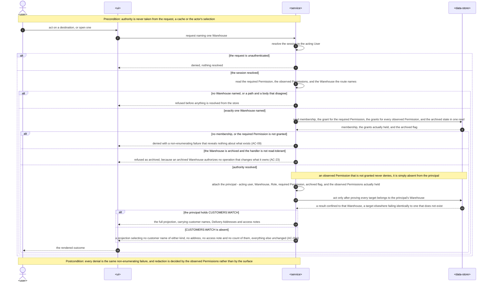
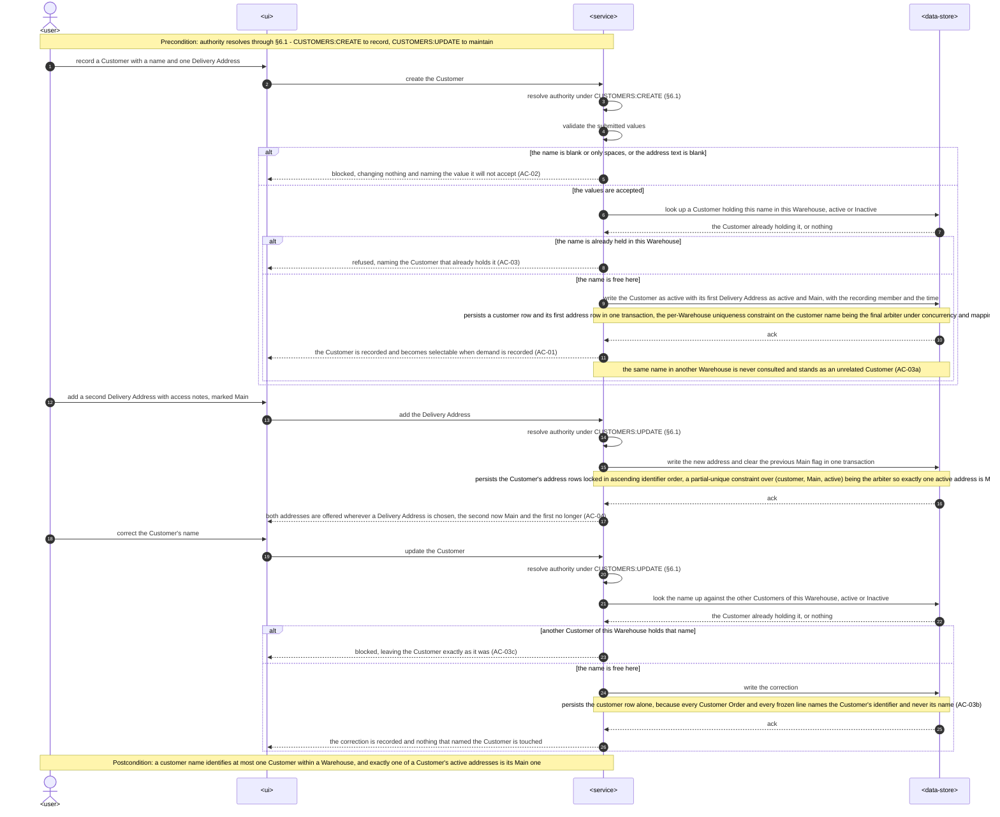
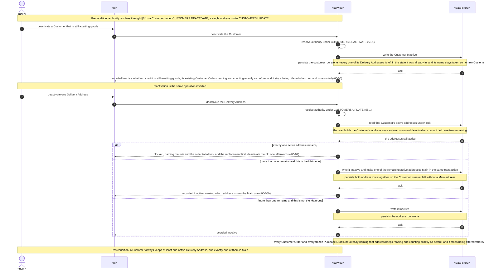
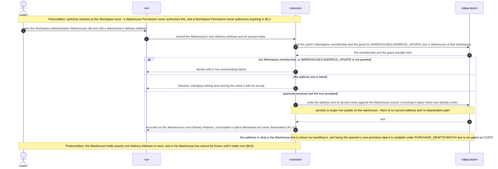
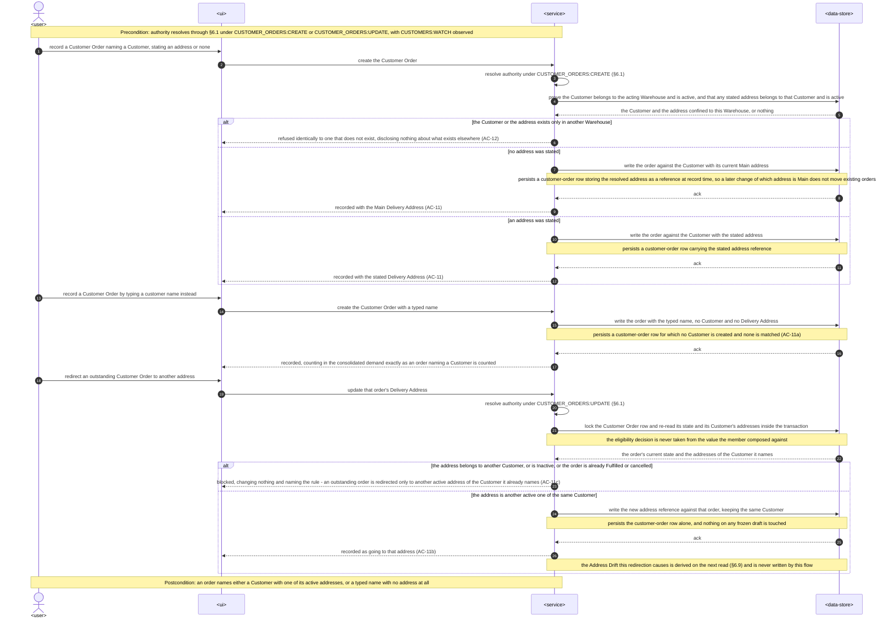
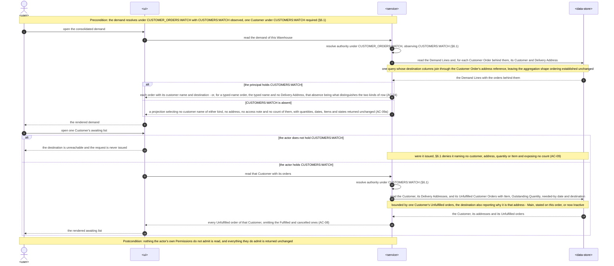
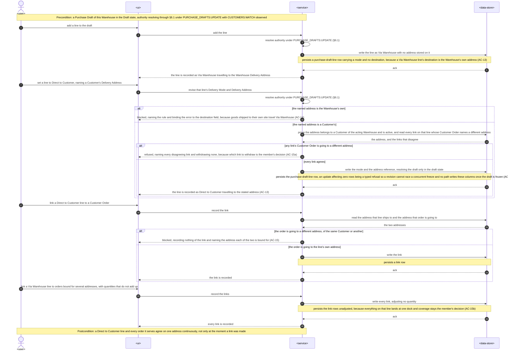
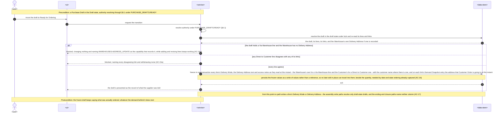
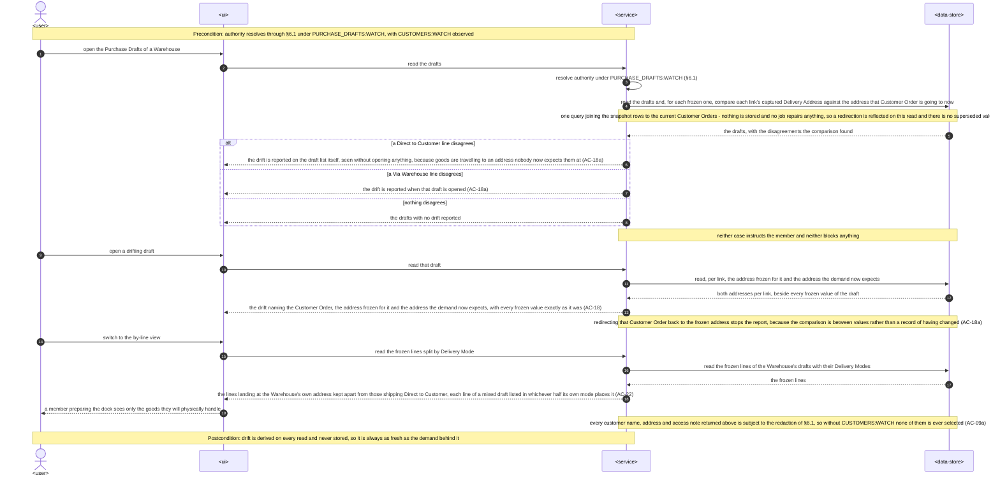
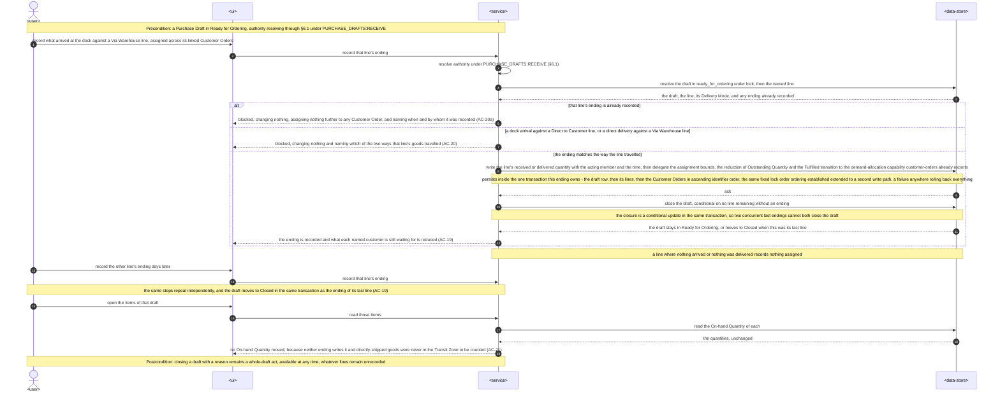

# Software Architecture Description — delivery-addresses

## 1. Context and quality goals

`ordering` shipped the loop this feature attaches to. `apps/server/src` now holds `items`,
`customer-orders` and `purchase-drafts` beside `access`, `auth`, `users`, `warehouses` and
`workspaces`; a Customer Order carries `customer_name` as free text
(`shared/domain/entities/customer-order.entity.ts`), a Purchase Draft Line carries an Item, a
quantity, a Packaging Type and a Value-adding Note but no destination
(`purchase-draft-line.entity.ts`), a Warehouse carries a name and an archival timestamp and nothing
else (`warehouse.entity.ts`), and one whole-draft `ConfirmPurchaseDraftArrivalCommand` is the single
act that ends a draft. There is no customer record, no address anywhere in the product, and exactly
one ending.

This feature adds the destination. It introduces two durable records a Warehouse owns — the Customer
and its Delivery Addresses — gives the Warehouse itself one Delivery Address, puts a Delivery Mode
and a Delivery Address on every Purchase Draft Line, freezes both with the rest of the line, reports
Address Drift when the demand behind a frozen line moves, and replaces the whole-draft arrival with
an ending recorded per line. It also does something no feature here has done before: it brings data
that **fifteen already-shipped surfaces** carry — the customer name — under a Permission those
surfaces do not declare.

The architecture must satisfy these quality goals, in priority order:

1. **Customer identity is readable only under `CUSTOMERS:WATCH`, on every surface including the ones
   that predate this feature.** A member holding `PURCHASE_DRAFTS:WATCH` and `CUSTOMER_ORDERS:WATCH`
   but not `CUSTOMERS:WATCH` reads drafts, demand and drift with every customer name, address, access
   note and count withheld — a Customer's name and a name typed onto an order alike — and keeps
   everything their own Permissions do admit (`spec.md` AC-09, AC-09a, §6.1 "Customer disclosure
   through an ordering surface" and "through a count", §6 "Authorization coverage").
2. **Every Customer and Delivery Address is reachable only through the Warehouse that owns it**, under
   a Permission the actor holds in that Warehouse; a cross-Warehouse target is indistinguishable from
   a missing one and discloses nothing (`spec.md` AC-03a, AC-12, AC-23, §6.1 "Cross-Warehouse customer
   reach").
3. **A frozen line's Delivery Mode and Delivery Address are structurally unwritable.** Zero recorded
   changes after Ready for Ordering; recording an ending and moving to Closed are the only permitted
   additions and are not changes (`spec.md` AC-17, §6 "Frozen-address integrity", §6.1 "Redirection as
   a back door onto a frozen record").
4. **A Direct to Customer line agrees with its demand continuously**, checked when a link is made,
   when the line is revised, and again when the draft enters Ready for Ordering — never only at the
   moment the link was made (`spec.md` AC-15, AC-15a, §6 "Direct-line agreement").
5. **Address Drift is derived on every read** from the frozen snapshot and the Customer Orders that
   exist at that moment, never stored and never repaired by a job; a redirected order is reflected on
   the next read (`spec.md` AC-18, AC-18a, §6 "Address-drift freshness"; `CONTEXT.md` §Invariants).
6. **Each line's ending is atomic and happens once.** One line's received or delivered quantity, every
   Allocation made from it and every resulting Outstanding Quantity are written together or not at all,
   and the draft moves to Closed exactly when the last line has an ending (`spec.md` AC-19, AC-20a,
   §6 "Ending atomicity").
7. **The reads stay within their targets at the `spec.md` §1 scale** — roughly 500 Customers and
   1 500 Delivery Addresses per Warehouse on top of what `ordering` already assumes — with every list
   returned whole rather than paged (`spec.md` §6).
8. **Every capability the feature introduces, reads included, declares an explicit Permission rule and
   a Warehouse ownership check**, and the web omits the entries, destinations and controls the actor
   cannot use (`spec.md` AC-09, §6 "Authorization coverage").

The specification is `Draft` and carries eight open questions (`spec.md` §8). Five are due _before
design_ and are treated here: the Permission-composition question is **resolved in §4 and
[ADR 0001](./adr/0001-observed-permission-redaction.md)** by extending the shared authorization stage
rather than by weakening AC-09a; the per-line closure question is **resolved in §4, §6.10 and
[ADR 0002](./adr/0002-per-line-purchase-draft-endings.md)** under its stated default; the
direct-delivery remedy, the `WAREHOUSES:ADDRESS_UPDATE` level and the `PURCHASE_DRAFTS:RECEIVE` reuse
take their stated defaults unchanged. The eighth — carrying four amendments back to `ordering` as a
change request — was due before this stage and **has not happened**; §11 records it as a gate rather
than treating it as done. All eight are restated in §11.

The UI approval gate the `web-frontend` surface requires is already satisfied:
[`design-handoff.md`](./design-handoff.md) records eleven frames approved on 2026-09-01 with eleven
published HTML previews ([frontend architecture](../../system/frontend-architecture.md) §"UI design
boundary"). Its § Implementation constraints name `modules/demand/`; §8 Naming below settles that
against the module the repository actually ships.

## 2. Constraints inherited from `docs/system`

- The repository stays a browser SPA plus a NestJS modular monolith with shared boundary schemas in
  `packages/contracts` ([architecture map](../../system/architecture-map.md)). No new container, no new
  runtime, no new deployable, no new third-party dependency.
- Server code follows the entity-related module, flat-module, inward-dependency, command/query,
  service-as-extraction and thin-controller boundaries in
  [server architecture](../../system/server-architecture.md) and
  [adding a server module](../../system/guides/adding-a-server-module.md). A module is named for the
  entity whose invariants it enforces, modules never nest, and placement follows the owning-entity rule
  with the scope-of-exercise tiebreak
  ([scope-of-exercise ADR](../../system/adr/18-08-2026-scope-of-exercise-placement-tiebreak.md),
  [domain-owned flat modules](../../system/adr/14-08-2026-domain-owned-flat-modules.md)).
- Authentication and transport-level authorization stay in `shared/guards/`. This feature reuses
  `SessionAuthGuard`, `WarehouseAccessGuard`, `WorkspaceAccessGuard`, `@RequiredPermission`,
  `@RequiredWorkspacePermission` and `@ArchivedTolerantRead`. It adds **no third guard** and **no
  second authority vocabulary**; the two-level model and its two separate Permission types are
  unchanged ([workspaces ADR 0001](../workspaces/adr/0001-two-level-request-authorization.md)). What it
  does add — one optional decorator and one field on the existing principal — is a proposed deviation,
  recorded below and in [ADR 0001](./adr/0001-observed-permission-redaction.md).
- Persistence stays PostgreSQL through TypeORM. Shared TypeORM entities live in
  `shared/domain/entities/`; specialized concrete repositories live in `shared/domain/repositories/`,
  are shaped around a cohesive persistence operation rather than a table, hold no private methods, and
  never import a feature module
  ([creating a server repository](../../system/guides/creating-a-server-repository.md)). Every schema
  change is a reviewed forward-only migration with runtime synchronization disabled
  ([PostgreSQL/TypeORM ADR](../../system/adr/21-07-2026-postgresql-with-typeorm.md)).
- An atomic operation is owned by one `@Transactional()` command or service; repositories obtain their
  manager from the shared transaction context and open none of their own.
- Zod owns validation. Web/server shapes live in `packages/contracts/<module>` and are consumed through
  the module subpath; `rest/dtos/` files are thin `createZodDto` adapters that redefine nothing
  ([Zod ADR](../../system/adr/12-07-2026-schema-validation-with-zod.md),
  [adding and using contracts](../../system/guides/adding-and-using-contracts.md)).
- Refusals are named predicates plus named error factories under `<module>/domain/errors/`, asserted
  with `assert`, propagated without local `try/catch`, and mapped once at the global exception filter
  into the shared envelope with a stable `ErrorCode`
  ([server error handling](../../system/guides/server-error-handling.md),
  [error-handling ADR](../../system/adr/24-07-2026-server-error-handling.md)).
- A use case is never a pass-through and a service is an extraction, never a default layer
  ([server use case boundaries](../../system/guides/server-use-case-boundaries.md),
  [server architecture](../../system/server-architecture.md) §Services).
- RTK Query owns all server state through the one injected API slice and its shared base query; derived
  server data never becomes an ordinary Redux slice; a route awaits the data its destination paints
  through a module-owned loader that imports no page and no component
  ([frontend architecture](../../system/frontend-architecture.md),
  [RTK Query ADR](../../system/adr/02-08-2026-rtk-query-for-web-api-calls.md)).
- Every web control that depends on authority is a `WarehousePermissionGate` or
  `WorkspacePermissionGate`, or a descriptor carrying a `permission` field filtered by
  `usePermittedItems` inside a React Aria collection. There is no capability table and no component
  takes a capability as a prop
  ([declarative permission gates ADR](../../system/adr/19-08-2026-declarative-permission-gates.md)).
- Components call the generated `use<Endpoint>Mutation` hook directly; success toasts are registry
  entries in `shared/alerts/mutation-actions.ts`; the field-error policy is the endpoint's
  `transformErrorResponse`
  ([generated mutation hooks ADR](../../system/adr/19-08-2026-generated-mutation-hooks-in-components.md)).
- A collection of records is a HeroUI `Table`; a cell renders a component, not an expression, and a row
  renderer calls no hook and closes over no live state
  ([HeroUI Table ADR](../../system/adr/27-08-2026-heroui-table-for-web-data-tables.md)). A dialog opened
  from a row goes through `useActionDialog` + `ActionDialogHost`
  ([reducer-driven action dialogs ADR](../../system/adr/27-08-2026-reducer-driven-action-dialogs.md),
  [web action dialogs](../../system/guides/web-action-dialogs.md)); a validated modal is
  `FormModalDialog` and a single-decision modal is `ConfirmAlertDialog`
  ([web dialogs](../../system/guides/web-dialogs.md)).
- Web paths are declared once in `shared/constants/routes.ts`; components follow one-component-per-file,
  ownership nesting and the two-hop prop budget, and every conditional follows
  [writing web components](../../system/guides/writing-web-components.md) §6 — no `if`/`else if` chain
  and no element ternary — with `shared/components/Conditional` as the only in-JSX form
  ([placing web components](../../system/guides/placing-web-components.md),
  [writing web conditional components](../../system/guides/writing-web-conditional-components.md),
  [placing web hooks](../../system/guides/placing-web-hooks.md),
  [placing web tests](../../system/guides/placing-web-tests.md)).
- User-visible copy lives in module-named namespaces served from `public/locales/<language>/` with
  en/uk parity ([localization ADR](../../system/adr/27-07-2026-bundled-centralized-web-translations.md),
  [localization guide](../../system/guides/adding-and-maintaining-web-localization.md)); HeroUI v3 and
  the `HeroUI v3 · Design System` board are the visual foundation
  ([HeroUI design principles](../../system/guides/heroui-design-principles.md)).
- Structured Pino logs are the only diagnostic and measurement mechanism. This feature adds no telemetry
  SDK, tracing, metrics exporter, collector or feature-specific telemetry abstraction, and `spec.md` §7
  is explicit that every KPI is an operator query
  ([Pino ADR](../../system/adr/27-07-2026-structured-logging-with-pino.md),
  [logging-instead-of-telemetry ADR](../../system/adr/03-08-2026-structured-logging-instead-of-telemetry.md)).
- BullMQ and Redis are **not installed** and must not be treated as available
  ([server architecture](../../system/server-architecture.md) §"Runtime applications"). This feature
  introduces no asynchronous work, so it adds no `handlers/` layer, no event schema under
  `shared/events/` and no worker dependency, and stays compatible with the later
  `main.rest.ts`/`main.worker.ts` split.
- `WriteRateLimitGuard` and `@WriteRateLimited()` already exist in `shared/guards/`. `spec.md` §6.1
  requires the new mutations to be rate limited "on the same terms as the ordering mutations", so this
  feature **declares** the existing decorator on its write handlers rather than introducing a second
  mechanism ([ordering ADR 0003](../ordering/adr/0003-per-member-write-rate-limit.md)).

### Proposed deviation

**One optional metadata key and one field on `AccessCurrentUser`.** `WarehouseAccessGuard` today reads
`@RequiredPermission`, resolves `permissionIds[0]` against the acting membership, and attaches a
principal carrying exactly one `permissionId`. AC-09a needs a read that is _authorized_ by
`PURCHASE_DRAFTS:WATCH` while its _projection_ depends on whether the same actor also holds
`CUSTOMERS:WATCH` — which the current stage cannot express, and whose naive attempt fails silently
because a surplus Permission is simply not evaluated (`spec.md` §8, first question). §4 and
[ADR 0001](./adr/0001-observed-permission-redaction.md) extend the stage with an `@ObservedPermission`
decorator and an `observedPermissionIds` field on the principal. It is a change to shared authorization
infrastructure introduced by one feature, so it is named here as a deviation and **must be promoted to
`docs/system` in this same change**, not the next one — the authorization stage is documented in
[workspaces ADR 0001](../workspaces/adr/0001-two-level-request-authorization.md) and a reader of that
ADR alone would find it incomplete.

### Two consequences that are easy to mistake for deviations

- **Existing shipped tables change.** Unlike `ordering`, this feature adds columns to
  `customer_orders`, `purchase_draft_lines`, `purchase_draft_demand_snapshots` and `warehouses`, and
  removes the whole-draft arrival columns' role from `purchase_drafts`. That is ordinary forward-only
  migration work under the [PostgreSQL/TypeORM ADR](../../system/adr/21-07-2026-postgresql-with-typeorm.md);
  existing migrations are still never edited.
- **One shipped REST route is withdrawn and replaced.** `POST /purchase-drafts/{id}/arrival` becomes two
  per-line sub-resources (§7). No versioning policy exists to violate — `api/v1` has never been
  published outside this repository — but the route-table baseline and the `purchase-drafts` contract
  change deliberately, which §10 makes a reviewed task.

## 3. Scope and target surfaces

`target_surfaces: ['web-frontend', 'backend-service']`. No `worker`, `cli`, `mobile-app`, `desktop-app`
or `library-sdk` surface is touched. The 390 px frames in [`design-handoff.md`](./design-handoff.md) are
the responsive rendering of the same `web-frontend` surface, not a `mobile-app` surface.

### In scope

| Surface           | Change                                                                                                                                                                                                                                                                                                                                                                                                                                                                                |
| ----------------- | ------------------------------------------------------------------------------------------------------------------------------------------------------------------------------------------------------------------------------------------------------------------------------------------------------------------------------------------------------------------------------------------------------------------------------------------------------------------------------------- |
| `backend-service` | One new module `customers` (Customer identity and lifecycle, its Delivery Addresses, the Main-address invariant, the awaiting-list read). Extend `warehouses` (the Warehouse's own Delivery Address), `customer-orders` (customer reference, Delivery Address, redirection, redacted demand projection) and `purchase-drafts` (Delivery Mode and Delivery Address per line, the direct-line agreement check, the extended freeze, Address Drift, per-line endings, the by-line read). |
| Shared server     | New TypeORM entities and specialized repositories in `shared/domain/`; `@ObservedPermission` in `shared/decorators/` with the matching resolution in `WarehouseAccessGuard` and `AccessCurrentUserRepository`; `observedPermissionIds` on `AccessCurrentUser`. No new guard.                                                                                                                                                                                                          |
| `web-frontend`    | One new route-owned module `modules/customer` (the Customers destination) plus one sidebar entry; extend `modules/customer-order` (destination on the demand row, the redirect dialog, the customer picker), `modules/purchase-draft` (the per-line `DELIVERY` block, drift presentation, the By-line view, the two ending dialogs) and `modules/workspace` (the Warehouse Delivery Address section in the warehouse detail pane).                                                    |
| Shared boundary   | New `packages/contracts/customers` subpath; extend the `customer-orders`, `purchase-drafts` and `workspaces` subpaths. Four `PermissionId` members, one `WorkspacePermissionId` member and the feature's stable `ErrorCode` members in `packages/shared-types`.                                                                                                                                                                                                                       |
| Persistence       | Forward-only migrations for the two new relations, the added columns on four shipped relations, the backfill of the default Delivery Mode on existing draft lines, and a catalogue/grant migration inserting the five new Permissions and granting them to every `warehouse_manager` and Workspace-owner Role.                                                                                                                                                                        |

### Out of scope

- Everything `spec.md` §3 and `CONTEXT.md` §"Out of scope" exclude: Locations, Stock balances, Stock
  Movements and put-away; suppliers as records and supplier addresses; dispatch, carriers, tracking and
  shipping cost; address validation, geocoding, maps and distance; proof that a Direct Delivery
  happened; sharing Customers across a Workspace; merging two Customers.
- Any change to the Workspace/Warehouse authority _model_, to Warehouse archival, or to who may grant
  the five new Permissions. They are ordinary assignable Permissions administered by the shipped
  `access` and `workspaces` surfaces.
- Any change to the meaning of an existing Permission. `PURCHASE_DRAFTS:WATCH` still authorizes reading
  a draft; what it stops carrying is customer identity, which it never had a rule for.
- Backfilling, matching or merging the customer names already typed onto Customer Orders. AC-11a and
  AC-24 require them to stay exactly as they are.
- Any asynchronous work, queue, scheduled job or third-party integration.
- Paging. `spec.md` §1 fixes the scale at which lists are returned whole; outgrowing it is the explicit
  trigger to revisit `spec.md` §6, recorded in §11.

## 4. Solution strategy

**One new entity-owned module per side; the Warehouse's address belongs to `warehouses`.** Customer and
Delivery Address carry one cohesive invariant set — a name unique per Warehouse that deactivation never
releases, at least one active address, exactly one Main one — so they are one flat top-level server
module `customers` and one route-owned web module `modules/customer`, exactly as
[ADR 18-08](../../system/adr/18-08-2026-scope-of-exercise-placement-tiebreak.md) and
[ADR 14-08](../../system/adr/14-08-2026-domain-owned-flat-modules.md) already prescribe. The Delivery
Address is not its own module: it has no life apart from the Customer that owns it and every one of its
rules is a rule about that Customer. The **Warehouse Delivery Address is a different record with
different rules** — exactly one, corrected in place, never Inactive, no Main — and its subject is the
Warehouse record, which `workspaces` already classifies as a Workspace Capability. It therefore extends
`warehouses` and is written under `WAREHOUSES:ADDRESS_UPDATE` through `WorkspaceAccessGuard`, beside
renaming and archiving. Sharing one polymorphic address table between the two would force a nullable
owner column, an owner discriminator and two disjoint constraint sets onto one relation to save a shape
members never see; the shapes stay separate and the _presentation_ is what is shared (`CONTEXT.md`).

**Customer identity is redacted at the projection, not denied at the guard.** AC-09a is not "require
both Permissions": a member without `CUSTOMERS:WATCH` still reads the draft, the demand and the drift —
only the customer names, addresses, access notes and counts are withheld. So the required Permission
stays exactly one per handler and the guard's denial semantics are untouched; what changes is that a
handler may additionally declare `@ObservedPermission(PermissionId.CUSTOMERS_WATCH)`, which the guard
resolves in the _same_ membership read it already performs and attaches to `AccessCurrentUser` as
`observedPermissionIds`. An observed Permission never denies anything; it only tells the query which
projection to build. Every read that can carry customer identity — the consolidated demand, the
Customer Order list, the draft list, one draft, the by-line view, the drift detail — builds its redacted
form from that one field, so the rule lives in one place rather than in fifteen. Because the withheld
value is _never selected into the response_, redaction is a property of the projection rather than a
filter applied after it. See [ADR 0001](./adr/0001-observed-permission-redaction.md).

**A Delivery Address is a reference while it is editable and a value once it is frozen.** A Customer
Order names `customer_delivery_address_id`, so correcting the address text corrects it everywhere it is
still live, and redirection is a change of that one column. Entering Ready for Ordering **captures the
text**: the frozen line stores the address and its access notes as they read at that instant, alongside
the customer name, and each frozen link's Demand Snapshot entry captures the address its Customer Order
was going to at that instant. That is `spec.md` §8's second question taken at its stated default, and it
is what makes the frozen draft one statement made at one moment rather than a row with two freshness
rules. It also makes AC-17 structural: there is no live reference left for an edit in place to travel
along.

**The direct-line agreement is a set comparison run at three moments, not a trigger.** A Direct to
Customer line ships to exactly one `customer_delivery_address_id`; a link is legal only when its Customer
Order names that same address. The check is one repository read — "which of this line's links name a
Delivery Address other than the line's?" — invoked by the link command, by the line-revision command and
by the freeze command, and it **names every disagreeing link without withdrawing any** (AC-15a), because
which link to drop is the member's decision. A Via Warehouse line runs no such check and keeps
`ordering`'s deliberately loose linking (AC-15b). Expressing the rule as a shared read in
`purchase-drafts/domain/services/` rather than as three copies is the first extraction trigger in
[server architecture](../../system/server-architecture.md) §Services, and it is the reason the rule
cannot be "required at the link and forgotten afterwards".

**A Via Warehouse line needs the Warehouse to have an address before it can be frozen.** AC-16a is a
freeze precondition, not a line-level one: adding and revising lines on a Warehouse with no address
keeps working, and only the transition refuses. It is one predicate over one value the freeze command
already reads, and the refusal names `WAREHOUSES:ADDRESS_UPDATE` as the capability that unblocks it.

**Address Drift extends the Demand Snapshot that already exists.** `purchase_draft_demand_snapshots`
already captures each linked Customer Order's quantity, needed-by date and state at the freeze; this
feature adds the captured Delivery Address to the same row. A Drift Signal stays a value comparison
between those captured rows and the Customer Orders now, computed inside
`PurchaseDraftReadRepository`'s existing query — never stored, never repaired by a job, and therefore
fresh on the next read by construction (`spec.md` §6 "Address-drift freshness"). Address Drift joins the
Drift Signals `ordering` already reports rather than becoming a parallel mechanism; what is new is only
_where_ it surfaces, which is presentation: on the draft list for a Direct to Customer line and on the
opened draft for a Via Warehouse line (AC-18a).

**A draft's ending moves from the draft to the line.** A dock arrival and a direct delivery on one draft
fall on different days, so one whole-draft act cannot express them. Each line records its own ending —
an Arrival Confirmation for a Via Warehouse line, a Direct Delivery for a Direct to Customer line, each
refused against the other mode (AC-20) and each recordable once (AC-20a) — and the draft moves to Closed
when the last line has one. The atomicity guarantee `ordering` held for a whole confirmation is scoped
down to one line's ending, which is exactly what `spec.md` §6 "Ending atomicity" now states. Ownership is
unchanged from [ordering ADR 0002](../ordering/adr/0002-arrival-confirmation-ownership.md): the command,
the state guard and the received or delivered quantity are `purchase-drafts`; the demand effect is
delegated to the `DemandAllocationService` that `customer-orders` already exports, inside the one
`@Transactional()` boundary the ending owns. Closing with a reason stays a whole-draft act available at
any time and closes the draft whatever lines remain unrecorded (`spec.md` §8, sixth question, at its
stated default). See [ADR 0002](./adr/0002-per-line-purchase-draft-endings.md).

**Permission is necessary, never sufficient — unchanged.** `WarehouseAccessGuard` proves the actor holds
the declared Permission in the Warehouse the route names; every command and query then proves that each
Customer, Delivery Address, Customer Order, draft, line and link it touches belongs to
`principal.warehouseId`, and a target in another Warehouse produces the same non-enumerating failure as a
target that does not exist (AC-12). This is the rule `access`, `workspaces` and `ordering` already apply,
reused rather than re-decided.

**Archiving withdraws writes and leaves reads exactly as they were — unchanged.** Every read handler this
feature adds declares `@ArchivedTolerantRead()`; no mutating handler does. AC-23 then follows from the
guard that already ships, and the narrow class admitted by
[workspaces ADR 0003](../workspaces/adr/0003-archived-tolerant-membership-edge-mutations.md) gains no
member.

**The web mirrors the split and gates three datasets independently.** One new route-owned module
(`modules/customer`) with a loader that dispatches only under `CUSTOMERS:WATCH`, so a refused address
issues zero requests; the demand, draft and workspace changes stay inside the modules that already own
those destinations. The **customer picker** has more than one consumer (record a Customer Order, redirect
one), so it stays in `modules/customer` and is reached through that module's declared public surface
rather than promoted to `shared/`. Client-side redaction is presentation only: the browser gates what it
_renders_, and the server independently never _sends_ what the actor may not read.

## 5. Building blocks and ownership

### Server and shared boundary

| Building block                                       | Ownership and responsibility                                                                                                                                                                                                                                                                                                                                                                                                                                                                                                                                                                                                                                                                                                                                                                                                                                                                                |
| ---------------------------------------------------- | ----------------------------------------------------------------------------------------------------------------------------------------------------------------------------------------------------------------------------------------------------------------------------------------------------------------------------------------------------------------------------------------------------------------------------------------------------------------------------------------------------------------------------------------------------------------------------------------------------------------------------------------------------------------------------------------------------------------------------------------------------------------------------------------------------------------------------------------------------------------------------------------------------------- |
| `customers/domain`                                   | Customer name, Delivery Address text and access-note value objects; predicates for a blank name, a blank address, name availability, the last-active-address condition and Main-address membership; named error factories for a taken customer name, an unavailable Customer or address, a cross-Customer address, an Inactive address and the last-active-address refusal. No NestJS, HTTP or TypeORM imports.                                                                                                                                                                                                                                                                                                                                                                                                                                                                                             |
| `customers/domain/services`                          | `CustomerAddressBookService` — the operations more than one command needs: assert the Customer resolves in the acting Warehouse, assert an address belongs to that Customer and is active, and reassign the Main address when the current Main one is deactivated (AC-06b). Registered on the `UsecaseModule` and **not** exported; nothing outside `customers` calls it.                                                                                                                                                                                                                                                                                                                                                                                                                                                                                                                                   |
| `customers/domain/mappers`                           | Customer and Delivery Address ↔ shared persistence entities, invoked above the repository boundary.                                                                                                                                                                                                                                                                                                                                                                                                                                                                                                                                                                                                                                                                                                                                                                                                         |
| `customers/usecases`                                 | Commands: record a Customer; correct its name; deactivate/reactivate it; add, revise, mark-Main, deactivate and reactivate a Delivery Address. Queries: list the Warehouse's Customers with their active-address count and state; read one Customer with its Delivery Addresses and the Unfulfilled Customer Orders it awaits (AC-08); list the active Customers and addresses a picker offers.                                                                                                                                                                                                                                                                                                                                                                                                                                                                                                             |
| `warehouses/usecases` (extended)                     | One command: record or correct the Warehouse's own Delivery Address and access notes (AC-10). Authorized by `WAREHOUSES:ADDRESS_UPDATE` through `WorkspaceAccessGuard`; never deactivates.                                                                                                                                                                                                                                                                                                                                                                                                                                                                                                                                                                                                                                                                                                                  |
| `customer-orders` (extended)                         | Recording and amending a Customer Order accepts an optional Customer and Delivery Address, defaulting to the Customer's Main one (AC-11). A new `RedirectCustomerOrderCommand` owns AC-11b/AC-11c. The consolidated-demand and Customer Order queries build the redacted or full projection from `observedPermissionIds`. `DemandAllocationService` is unchanged.                                                                                                                                                                                                                                                                                                                                                                                                                                                                                                                                           |
| `purchase-drafts/domain` (extended)                  | Delivery Mode value object and predicates: a Direct to Customer line never names the Warehouse's own address (AC-14); a line's ending matches its mode (AC-20); an ending is recorded once (AC-20a); every line has an ending (closure). Error factories for a mode/address change after freeze, a disagreeing link set, a missing Warehouse Delivery Address, a wrong-mode ending and a repeated ending.                                                                                                                                                                                                                                                                                                                                                                                                                                                                                                   |
| `purchase-drafts/domain/services` (extended)         | `PurchaseDraftAssemblyService` gains the direct-line agreement check the link, revision and freeze commands share. A `PurchaseDraftLineEndingService` is created **only if** the two ending commands share a rule beyond the shared repository operation; a service exactly one command calls is forbidden ([use case boundaries](../../system/guides/server-use-case-boundaries.md)).                                                                                                                                                                                                                                                                                                                                                                                                                                                                                                                      |
| `purchase-drafts/usecases` (extended)                | Line commands carry Delivery Mode and Delivery Address; the freeze command captures the address text, the customer name and each link's captured address, and refuses on a missing Warehouse address or a disagreeing link set. `ConfirmPurchaseDraftArrivalCommand` is **replaced** by `ConfirmPurchaseDraftLineArrivalCommand` and `RecordPurchaseDraftLineDeliveryCommand`. A new query serves the by-line view.                                                                                                                                                                                                                                                                                                                                                                                                                                                                                         |
| `*/rest`                                             | Thin controllers under `api/v1/warehouses/:warehouseId/...` (`api/v1/workspace/warehouses/:warehouseId/...` for the Warehouse address), guarded by `SessionAuthGuard` plus the matching access guard, declaring exactly one `@RequiredPermission`/`@RequiredWorkspacePermission`, `@ObservedPermission(...)` on the reads that can carry customer identity, `@ArchivedTolerantRead()` on reads only, and `@WriteRateLimited()` on the new writes. DTOs are `createZodDto` adapters that redefine nothing.                                                                                                                                                                                                                                                                                                                                                                                                   |
| `shared/decorators/observed-permission.decorator.ts` | **New.** Declares Permissions whose grant is _resolved and reported_ but never required. Carries no denial power by construction — the guard never consults it when deciding `canActivate`. [ADR 0001](./adr/0001-observed-permission-redaction.md).                                                                                                                                                                                                                                                                                                                                                                                                                                                                                                                                                                                                                                                        |
| `shared/guards/warehouse-access.guard.ts`            | Extended: resolves the required Permission exactly as today **and** the declared observed Permissions in the same membership read, then attaches `observedPermissionIds` to the principal. Denial semantics, archived handling and the "no `warehouseId`, no authority" rule are unchanged.                                                                                                                                                                                                                                                                                                                                                                                                                                                                                                                                                                                                                 |
| `shared/access/access-current-user.ts`               | `AccessCurrentUser` gains `readonly observedPermissionIds: readonly PermissionId[]`, empty when the handler declares none. Still frozen, still never returned to the browser.                                                                                                                                                                                                                                                                                                                                                                                                                                                                                                                                                                                                                                                                                                                               |
| `shared/domain/entities`                             | **New:** `CustomerEntity`, `CustomerDeliveryAddressEntity`. **Extended:** `CustomerOrderEntity` (customer and Delivery Address references), `PurchaseDraftLineEntity` (Delivery Mode, live address reference, frozen address/notes/customer-name values, per-line ending attribution), `DemandSnapshotEntryEntity` (captured Delivery Address), `WarehouseEntity` (own Delivery Address and access notes). Each new relation carries the `warehouse_id` its ownership rule needs.                                                                                                                                                                                                                                                                                                                                                                                                                           |
| `shared/domain/repositories`                         | **New:** `CustomerDirectoryRepository` (name availability and the Customer list in one read), `CustomerAddressBookRepository` (the address set, the Main-address transition and the last-active-address condition under lock), `CustomerAwaitingDemandRepository` (one Customer's Unfulfilled orders with Item, Outstanding Quantity, needed-by date and destination). **Extended:** `CustomerOrderLifecycleRepository` (redirection under lock), `ConsolidatedDemandRepository` (destination columns), `PurchaseDraftAssemblyRepository` (mode/address writes and the disagreeing-link read), `PurchaseDraftFreezeRepository` (address capture), `PurchaseDraftReadRepository` (Address Drift and the by-line projection), `ArrivalConfirmationRepository` (per-line ending and the last-line closure). Persistence entities and persistence-oriented values only; no private methods; no feature imports. |
| `packages/shared-types`                              | Four `PermissionId` members (`CUSTOMERS:WATCH`, `:CREATE`, `:UPDATE`, `:DEACTIVATE`), one `WorkspacePermissionId` member (`WAREHOUSES:ADDRESS_UPDATE`), and stable `ErrorCode` members namespaced `customers.*` plus additions under `customer_orders.*` and `purchase_drafts.*`. Labels stay catalogue data in the database.                                                                                                                                                                                                                                                                                                                                                                                                                                                                                                                                                                               |
| `packages/contracts/customers` (+ extensions)        | Strict request/response schemas for every endpoint in §7. Customer-identity-bearing projections model the withheld case **in the schema** — the field is absent, not null-and-optional-by-accident — so a redaction bug is a contract violation rather than a rendering artefact.                                                                                                                                                                                                                                                                                                                                                                                                                                                                                                                                                                                                                           |
| `apps/server/migrations`                             | One schema migration for the two new relations and the added columns, including the backfill that sets every existing `purchase_draft_lines` row to Via Warehouse; one catalogue/grant migration inserting the five Permissions and granting them, following `1786600100000-GrantOrderingPermissions`. Existing migrations are not edited.                                                                                                                                                                                                                                                                                                                                                                                                                                                                                                                                                                  |

### Web

| Building block                                                                   | Ownership and responsibility                                                                                                                                                                                                                                                                                                                                                                                                                              |
| -------------------------------------------------------------------------------- | --------------------------------------------------------------------------------------------------------------------------------------------------------------------------------------------------------------------------------------------------------------------------------------------------------------------------------------------------------------------------------------------------------------------------------------------------------- |
| `modules/customer/{route,page}.tsx`                                              | The Customers destination at `ROUTES.WAREHOUSE_CUSTOMERS`, a child of `warehouseRoute`, declared before `warehouseCatchAllRoute`. List-and-detail at 1440, two screens at 390. Frames `KRDln`, `b7gaH9`.                                                                                                                                                                                                                                                  |
| `modules/customer/loaders`                                                       | Dispatches the Customer list read, gated on `CUSTOMERS:WATCH` so a refused address issues no request. Imports no page and no component.                                                                                                                                                                                                                                                                                                                   |
| `modules/customer/{api,components,hooks,schemas,alerts}`                         | Customer and Delivery Address endpoints injected into the shared API slice; `Delivery/Customer Card` (`r80F1`), `Address Row` (`LdZmY`), `Awaiting Row` (`zw3n9`) and `Awaiting Card Mobile` (`XXFuv`); the record/correct/deactivate and address dialogs through `useActionDialog` + `ActionDialogHost`. Exposes the **customer and address picker** on its declared public surface.                                                                     |
| `modules/customer-order/*` (extended)                                            | `Delivery/Customer Order Row` (`GGjUJ`) and `Card Mobile` (`T0O6LF`) carry the destination line and the "recorded by typed name — no delivery address" text; the record dialog gains the customer and address fields; a redirect dialog is added. Frames `Kvxj3`, `g505i3`.                                                                                                                                                                               |
| `modules/purchase-draft/*` (extended)                                            | `Delivery/Draft Line` (`jnl1h`) with the `DELIVERY` block and its `radiogroup` mode control; `Dock Line Row` (`DFncO`) and the `By draft / By line` toggle; drift on the list card for a direct line and inside the draft for a via-warehouse line; the two 720 px ending dialogs replacing the whole-draft arrival modal. Delivery mode and ending state are total `Record<…, ReactElement>` render lookups. Frames `cvX6h`, `TVcmE`, `zj46c`, `b4NNRD`. |
| `modules/workspace/.../WarehouseDetailPane.tsx` (extended)                       | A Delivery address section between the name form and the people list, gated by `WorkspacePermissionGate` on `WAREHOUSES:ADDRESS_UPDATE`. Frame `e12gwk`.                                                                                                                                                                                                                                                                                                  |
| `shared/constants/routes.ts`                                                     | `ROUTE_SEGMENTS.CUSTOMERS = 'customers'` and `ROUTES.WAREHOUSE_CUSTOMERS`. No path literal is repeated anywhere else.                                                                                                                                                                                                                                                                                                                                     |
| `shared/layouts/Sidebar.tsx`                                                     | One entry appended to `warehouseNavList` inside its own `WarehousePermissionGate` for `CUSTOMERS:WATCH`, absent rather than disabled. Position is Items → Customers → Access per the handoff, subject to its own open question (§11).                                                                                                                                                                                                                     |
| `shared/alerts/mutation-actions.ts`                                              | Success-toast registry entries for each new mutation, including the two consequences a member cannot otherwise see: that a redirection created drift, and that a direct delivery moved no stock.                                                                                                                                                                                                                                                          |
| `shared/icons/`                                                                  | Three new hand-rolled Lucide-geometry icons: `contact`, `map-pin`, `package-check`. `map-pin` is load-bearing — its absence is what says "typed name, no address" — so the accompanying text carries the same meaning for a screen reader.                                                                                                                                                                                                                |
| `public/locales/{en,uk}/{customer,customer-order,purchase-draft,workspace}.json` | One new module namespace plus additions to three shipped ones, with full en/uk key parity.                                                                                                                                                                                                                                                                                                                                                                |

`AccessCurrentUser` is never returned to the browser; `observedPermissionIds` is a server-side
projection input only. The web reads the actor's own capability projection through
`useHasPermission`/`WarehousePermissionGate` exactly as it does today, and `CUSTOMERS:WATCH` flows
through that unchanged mechanism with no new client concept.

## 6. Runtime view

Participants are generic: `<user>` (the acting member), `<ui>` (the browser application), `<service>`
(the server building blocks of §5) and `<data-store>` (the persistent store). Concrete modules, guards,
tables and technologies are named in §4, §5 and §7, not here. Every mutating step carries a persist note
so `data-model` can derive the constraints, indexes and locks it must express. The feature introduces no
asynchronous work — no queue, event, scheduled job or third-party callback (§2, §3) — so every flow is a
synchronous request → response and none of them carries an idempotency key, a retry note or a
dead-letter branch. Each flow's numbered steps are followed by the Mermaid diagram drawn from them.

§6.1 is the authorization spine every other flow depends on; the later flows state that they resolved
authority through it rather than repeating its steps.

### 6.1 Protected Warehouse-scoped operation, with an observed Permission

1. `<user>` acts on a destination; `<ui>` issues a request that names exactly one Warehouse in its path.
2. `<service>` authenticates the session. No session → denied, nothing resolved.
3. `<service>` reads the Permission the handler **requires**, the Permissions it **observes**, and the
   Warehouse the route names. A request naming no Warehouse, or naming one in the path that disagrees
   with one in the body, is refused before anything is resolved from the store.
4. `<service>` reads the actor's membership in that Warehouse from `<data-store>`, together with the
   grants for the required Permission **and** every observed Permission in one read, and the Warehouse's
   archived state. _(Read note: one membership point lookup by (user, warehouse); one bounded grant read
   restricted to the declared Permission identifiers; one Warehouse lookup. Authority is never taken
   from the request, a cache or the actor's selection — `spec.md` §6 "Authority staleness".)_
5. No membership, or the **required** Permission not granted → denied with a non-enumerating failure. An
   observed Permission that is not granted **never denies**; it is simply absent from the principal.
6. Warehouse archived and the handler is not read-tolerant → refused as archived. Read-tolerant → allowed.
7. `<service>` attaches the principal: acting user, Warehouse, Role, required Permission, archived flag,
   and the observed Permissions the actor actually holds.
8. The command or query proves every target it touches belongs to the principal's Warehouse. A target in
   another Warehouse fails identically to one that does not exist.
9. A query that can carry customer identity builds its projection from the principal's observed
   Permissions: with `CUSTOMERS:WATCH`, the full projection; without it, a projection in which no
   customer name, Delivery Address, access note or customer count is ever selected.

### 6.2 Record a Customer and maintain its Delivery Addresses

1. `<user>` records a Customer with a name and one Delivery Address. Authority resolves through §6.1
   under `CUSTOMERS:CREATE`.
2. `<service>` rejects a blank or whitespace-only name and a blank address text, changing nothing and
   naming the value it will not accept (AC-02).
3. `<service>` asks `<data-store>` whether that name is already held in this Warehouse, active or
   Inactive. Held → refused, naming the Customer that holds it (AC-03). The same name in another
   Warehouse is not a conflict and is not disclosed (AC-03a).
4. `<service>` writes the Customer as active and its first Delivery Address as active and Main, with the
   recording member and the time. _(Persist note: one transaction; a per-Warehouse uniqueness constraint
   on the customer name is the final arbiter under concurrency, and its violation maps to the same typed
   refusal as step 3.)_
5. `<user>` adds a second Delivery Address with access notes and marks it Main. `<service>` writes the new
   address and clears the previous Main flag **in one transaction**, so exactly one active address is
   Main at every instant (AC-04, AC-05). _(Persist note: the Customer's address rows are locked in
   ascending identifier order; a partial-unique constraint over (customer, Main, active) is the arbiter.)_
6. `<user>` corrects the Customer's name. `<service>` re-runs step 3 against the other Customers of the
   Warehouse, refuses a collision leaving the Customer exactly as it was (AC-03c), and otherwise records
   the correction — every Customer Order and every frozen line keeps naming the same Customer, because
   they name its identifier and never its name (AC-03b).

### 6.3 Deactivate a Customer or one of its Delivery Addresses

1. `<user>` deactivates a Customer. Authority resolves through §6.1 under `CUSTOMERS:DEACTIVATE`.
2. `<service>` records it Inactive whether or not it is still awaiting goods, leaves every one of its
   Delivery Addresses in the state it was already in, and keeps its name taken. Existing Customer Orders
   read and count exactly as before; the Customer stops being offered when demand is recorded. Reactivation
   is the same operation inverted (AC-06).
3. `<user>` deactivates one Delivery Address. Authority resolves under `CUSTOMERS:UPDATE`.
4. `<service>` reads that Customer's active addresses under lock. Exactly one remaining → refused, naming
   the rule and the order to follow: add the replacement first (AC-07). _(Persist note: the read is
   `FOR UPDATE` over the Customer's address rows so two concurrent deactivations cannot both see two
   remaining.)_
5. Otherwise `<service>` records it Inactive. If it was the Main one, the same transaction makes one of the
   remaining active addresses Main and the response names which (AC-06b).
6. Every Customer Order and every frozen Purchase Draft Line already naming that address keeps reading and
   counting exactly as before; the address stops being offered wherever one is chosen (AC-06a).

### 6.4 Record the Warehouse's own Delivery Address

1. `<user>` opens the Workspace administration Warehouses tab and edits a Warehouse's delivery address.
2. Authority resolves at the **Workspace** level: the actor's Workspace membership and
   `WAREHOUSES:ADDRESS_UPDATE`, over a Warehouse of their Workspace. A Warehouse Permission never
   authorizes this and a Workspace Permission never authorizes anything in §6.2.
3. `<service>` rejects blank address text, then writes the address and its access notes against the
   Warehouse record, correcting in place when one already exists. _(Persist note: a single-row update on
   the Warehouse; there is no second address and no deactivation path.)_
4. That address is what a Via Warehouse line is shown as travelling to. It is the operator's own premises
   data, so it is readable by any member holding `PURCHASE_DRAFTS:WATCH` in that Warehouse and is **not**
   gated on `CUSTOMERS:WATCH` (AC-10).

### 6.5 Record, amend and redirect a Customer Order

1. `<user>` records a Customer Order naming a Customer and optionally a Delivery Address. Authority
   resolves through §6.1 under `CUSTOMER_ORDERS:CREATE`, with `CUSTOMERS:WATCH` observed.
2. `<service>` proves the Customer belongs to the acting Warehouse and is active, and that the stated
   address belongs to that Customer and is active. A Customer or address of another Warehouse fails
   identically to one that does not exist and discloses nothing (AC-12).
3. No address stated → the Customer's current Main one is recorded. _(Persist note: the Main address is
   resolved and stored as a reference at record time; a later change of which address is Main does not
   move existing orders.)_
4. `<user>` records a Customer Order by typing a customer name instead. `<service>` stores the typed name,
   no Customer and no Delivery Address, creates no Customer and matches none (AC-11a).
5. `<user>` redirects an outstanding Customer Order to another of the same Customer's active addresses.
   Authority resolves under `CUSTOMER_ORDERS:UPDATE`, with `CUSTOMERS:WATCH` observed.
6. `<service>` refuses an address of another Customer, an Inactive address, and any order that is already
   Fulfilled or cancelled — changing nothing and naming the rule (AC-11c). _(Persist note: the Customer
   Order row is locked and its state re-read inside the transaction; the eligibility decision is never
   taken from the value the member composed against.)_
7. Otherwise `<service>` writes the new address reference against that order, keeping the same Customer.
   Nothing on any frozen draft is touched; the drift the redirection causes is derived on the next read
   (§6.9), never written by this flow (AC-11b).

### 6.6 Read the consolidated demand, and one Customer's awaiting list

1. `<user>` opens the consolidated demand. Authority resolves through §6.1 under `CUSTOMER_ORDERS:WATCH`,
   with `CUSTOMERS:WATCH` observed.
2. `<service>` reads the Demand Lines exactly as `ordering` does and, for each Customer Order behind them,
   its Customer and Delivery Address. _(Read note: one query; the destination columns join through the
   Customer Order's address reference, and the aggregation shape `ordering` established is unchanged.)_
3. Holding `CUSTOMERS:WATCH`, the actor receives each order with its customer name and destination, or —
   for a typed-name order — the typed name and **no** Delivery Address, that absence being what
   distinguishes the two kinds of row (AC-24).
4. Not holding it, the projection never selects a customer name of either kind, an address, an access note
   or any count of them; quantities, dates, Items and states are returned unchanged (AC-09a).
5. `<user>` opens one Customer. Authority resolves under `CUSTOMERS:WATCH`.
6. `<service>` returns that Customer, its Delivery Addresses, and every Unfulfilled Customer Order of that
   Customer with its Item, Outstanding Quantity, needed-by date and destination, omitting Fulfilled and
   cancelled orders (AC-08). _(Read note: bounded by one Customer's Unfulfilled orders; the destination
   also reports *why* it is that address — Main, stated on this order, or now Inactive.)_
7. Lacking `CUSTOMERS:WATCH`, the destination is unreachable and the request is never issued; the denial
   names no customer, address, quantity or Item and exposes no count (AC-09).

### 6.7 Set a line's Delivery Mode and Delivery Address, and link it to demand

1. `<user>` adds a line to a Draft-state Purchase Draft. Authority resolves through §6.1 under
   `PURCHASE_DRAFTS:UPDATE`, with `CUSTOMERS:WATCH` observed.
2. `<service>` records every new line as **Via Warehouse** travelling to the Warehouse's own Delivery
   Address; no address is stored on the line, because a Via Warehouse line's destination _is_ the
   Warehouse's (AC-13).
3. `<user>` sets a line to Direct to Customer and names a Customer's Delivery Address.
4. `<service>` refuses the Warehouse's own address on a Direct to Customer line, naming the rule and
   binding the error to the destination field (AC-14). It proves the named address belongs to a Customer
   of the acting Warehouse and is active.
5. `<service>` reads every link on that line whose Customer Order names a different Delivery Address. Any
   found → the change is refused, **every** disagreeing link is named, and none is withdrawn (AC-15a).
6. Otherwise `<service>` writes the mode and the address reference against the line. _(Persist note: the
   write resolves the draft only in the `draft` state — an update affecting zero rows is a typed refusal —
   so a revision cannot race a concurrent freeze.)_
7. `<user>` links a Direct to Customer line to a Customer Order. `<service>` refuses any order going to a
   different address, whether of the same Customer or another, naming the address each of the two is bound
   for and recording nothing (AC-15).
8. `<user>` links a Via Warehouse line to Customer Orders bound for several different addresses, with link
   quantities that do not add up. `<service>` records every link and adjusts no quantity: everything on
   that line lands at one dock and coverage stays the member's decision (AC-15b).

### 6.8 Move a Purchase Draft to Ready for Ordering

1. `<user>` moves a draft to Ready for Ordering. Authority resolves through §6.1 under
   `PURCHASE_DRAFTS:READY`.
2. `<service>` resolves the draft in the `draft` state under lock and re-reads its lines and links.
3. The draft holds a Via Warehouse line and the Warehouse has no Delivery Address → the transition is
   refused, nothing changes, the refusal names `WAREHOUSES:ADDRESS_UPDATE` as the capability that records
   it, and adding and revising lines keeps working (AC-16a).
4. Any Direct to Customer line disagrees with any of its links → the transition is refused and every
   disagreeing link is named, withdrawing none (AC-15a).
5. Otherwise `<service>` freezes, in one transaction: every line's Delivery Mode; **the Delivery Address
   text and access notes as they read at that instant** — the Warehouse's own for a Via Warehouse line,
   the Customer's for a Direct to Customer one — together with the customer name where there is one, which
   is the Direct to Customer case only; and, on each link's
   Demand Snapshot entry, the Delivery Address that Customer Order was going to at that instant, beside the
   quantity, needed-by date and state already captured. _(Persist note: one transaction; the capture is a
   write of values, not a reference, so no later edit in place can travel into it. AC-16.)_
6. The draft is presented as the record of what the supplier was told. From this point no path writes a
   line's Delivery Mode or Delivery Address: the assembly write paths resolve only `draft`-state drafts,
   and the ending and closure paths name neither column (AC-17).

### 6.9 Read Purchase Drafts, Address Drift, and the by-line split

1. `<user>` opens the Purchase Drafts of a Warehouse. Authority resolves through §6.1 under
   `PURCHASE_DRAFTS:WATCH`, with `CUSTOMERS:WATCH` observed.
2. `<service>` reads the drafts and, for each frozen one, compares each link's captured Delivery Address
   against the address that Customer Order is going to **now**. _(Read note: one query joining the snapshot
   rows to the current Customer Orders; nothing is stored and no job repairs anything, so a redirection is
   reflected on this read and there is no superseded value to serve — `spec.md` §6 "Address-drift
   freshness".)_
3. A disagreement on a **Direct to Customer** line is reported on the draft list itself, where the member
   sees it without opening anything, because goods are travelling to an address nobody now expects them at.
   A disagreement on a **Via Warehouse** line is reported when the draft is opened. Neither instructs the
   member and neither blocks anything (AC-18a).
4. Opening a draft returns, per link, the address frozen for it and the address the demand now expects, and
   every frozen value of the draft exactly as it was (AC-18).
5. Redirecting the Customer Order back to the frozen address stops the report, because the comparison is
   between values rather than a record of having changed.
6. `<user>` switches to the by-line view. `<service>` returns the frozen lines of the Warehouse's drafts
   split by Delivery Mode — those landing at the Warehouse's own address apart from those shipping Direct to
   Customer — listing each line of a mixed draft in whichever half its own mode places it (AC-22).
7. Every customer name, address and access note in steps 2–6 is subject to the redaction of §6.1 step 9.

### 6.10 Record a line's ending, and close the draft

1. `<user>` records what arrived at the dock against a Via Warehouse line, assigning it across that line's
   linked Customer Orders. Authority resolves through §6.1 under `PURCHASE_DRAFTS:RECEIVE`.
2. `<service>` resolves the draft in `ready_for_ordering` under lock, then the named line. A line whose
   ending is already recorded → refused, nothing changes, nothing is assigned, and the refusal names when
   and by whom (AC-20a).
3. A dock arrival against a Direct to Customer line, or a direct delivery against a Via Warehouse line →
   refused, naming which of the two ways that line's goods travelled (AC-20).
4. `<service>` writes the line's received or delivered quantity with the acting member and the time, then
   delegates the demand effect — the assignment bounds, the reduction of Outstanding Quantity and the
   Fulfilled transition — to the demand-allocation capability `customer-orders` already exports, inside the
   **one** transaction this ending owns. A line where nothing arrived or nothing was delivered records
   nothing assigned. _(Persist note: one transaction; the draft row, then its lines, then the Customer
   Orders in ascending identifier order — the same fixed lock order `ordering` established, extended to a
   second write path. A failure anywhere rolls back everything: `spec.md` §6 "Ending atomicity".)_
5. The draft stays in Ready for Ordering for as long as any of its lines has no ending, and moves to Closed
   in the same transaction as the ending of its **last** line. _(Persist note: the closure is a conditional
   update predicated on no line remaining without an ending, so two concurrent last endings cannot both
   close it.)_
6. `<user>` records the other line's ending days later; steps 2–5 repeat independently (AC-19).
7. No Item's On-hand Quantity changes in either case: neither ending writes it, and directly-shipped goods
   were never in the Transit Zone to be counted (AC-21).
8. Closing a draft with a reason remains a whole-draft act, available at any time, closing the draft
   whatever lines remain unrecorded.

### Flags raised while drawing these flows

- §6.5 step 3 stores the Main address **as a reference resolved at record time**. `data-model` must confirm
  that marking a different address Main afterwards does not move existing Customer Orders — the
  specification says the order names an address, not "the Main one".
- §6.9 step 2 adds a second comparison to a query that already compares quantity, needed-by date and state.
  `data-model` owns whether that stays one query or fans out, and §10 requires the correctness test with
  many links per draft and many drafts per Warehouse, not only a timing measurement.
- §6.10 introduces a **second** write path over the same Customer Order rows as the amendment path. The
  fixed lock order is not optional; a third path adopting a different one reintroduces the deadlock.
- **§6.4 is the one flow that does not resolve through the §6.1 spine.** Its authority is Workspace-level
  (`WAREHOUSES:ADDRESS_UPDATE` over a Warehouse of the actor's Workspace), so the Warehouse-scoped guard
  every other flow relies on does not apply to it. `api` and `tasks` must not infer the Warehouse guard
  from the fact that the route names a Warehouse.
- **The AC-09 denial is drawn on two levels, and only one of them enforces it.** §6.6 shows `<ui>` never
  issuing the request when `CUSTOMERS:WATCH` is absent, with the §6.1 server denial as the note beside it.
  The server denial is the guarantee; the withheld destination is defence in depth. A test that exercises
  only the UI branch does not cover AC-09.
- **§6.10 closes the draft with a conditional update inside the ending's own transaction.** Drawing it made
  the ordering explicit — the ending is written, then the closure is attempted predicated on no line
  remaining without an ending. `data-model` owns whether that predicate is expressed as a `NOT EXISTS`
  guard on the update or as a re-count under the lock already held.
- **The §6 block order deviates from §4 for one pair, deliberately.** §6.6 realizes US-04, which §4 places
  before US-05, but §6.6 also carries AC-24 (US-06) and reads the consolidated demand that §6.5 writes, so
  it is drawn after §6.5 rather than before §6.4 (US-05). Every other block follows §4. Coverage is
  unaffected — the deviation is narrative order only.

## 7. Data and interface impact

### Data

- **New durable concepts.** Customer (Warehouse-scoped, name, activation state, recording attribution);
  Customer Delivery Address (Customer-scoped and therefore Warehouse-scoped, address text, access notes,
  Main flag, activation state).
- **Existing concepts that change** — this is the part that separates this feature from `ordering`:
  - Customer Order gains an optional Customer reference and an optional Delivery Address reference. The
    existing typed `customer_name` column is **kept and never rewritten** (AC-11a, AC-24).
  - Purchase Draft Line gains a Delivery Mode, an optional live Delivery Address reference (Direct to
    Customer only), the frozen address text and frozen access notes captured at Ready for Ordering, the
    frozen customer name captured with them on a Direct to Customer line and absent on a Via Warehouse one,
    and its own ending: recorded quantity, ending kind, acting member and time.
  - Demand Snapshot entry gains the Delivery Address captured for its Customer Order at the freeze.
  - Warehouse gains its own Delivery Address text and access notes, both nullable until recorded.
  - Purchase Draft's whole-draft arrival attribution is superseded by the per-line ending. `data-model`
    decides whether those columns are dropped or retained as the record of drafts closed before this
    release; either way no new write targets them.
- **Constraints `data-model` must express or explicitly reject as inexpressible:** a customer name unique
  per Warehouse across active and Inactive alike, and never across Warehouses; a Delivery Address belonging
  to exactly one Customer of exactly one Warehouse; **at most one Main address per Customer among its
  active addresses**; a Customer Order naming a Customer and a Delivery Address of its own Warehouse, and
  an address of the Customer it names; a Direct to Customer line naming a Customer Delivery Address and a
  Via Warehouse line naming none; a line's ending recorded at most once; a frozen line carrying non-null
  captured address text; and **a Customer Order naming a Customer or a typed customer name, never both and
  never neither** — every row `ordering` shipped satisfies the typed-name side of it, so `data-model` should
  express it as a check rather than leave AC-11a and AC-24's distinction to convention.
- **Deliberately _not_ constraints.** "A Customer always keeps at least one active Delivery Address"
  (AC-07) is a **transition** rule, not a row rule. No Customer should ever rest with zero active
  addresses, but the condition is evaluated under lock at the moment of deactivation (§6.3): as a row
  constraint it would have to hold across the multi-statement window in which a Customer and its first
  address are written, and it would refuse a legitimate future data repair rather than the member action it
  is meant to refuse. "A Direct to Customer line agrees with its links" is likewise a transition rule
  evaluated at three moments (§4); expressing it as a constraint would require a cross-row predicate and
  would refuse the intermediate states a member legitimately passes through.
- **Not expressible as a row constraint:** "a frozen line's Delivery Mode and Delivery Address never
  change" and "an ending is recorded once" are state-guarded transitions inside the owning command (§4,
  §6.8, §6.10). `data-model` owns the lock and conditional-update shape; an architecture check plus
  integration tests are the evidence (§10).
- **Migrations are forward-only and must assume pre-existing rows**, unlike `ordering`'s. The added
  Delivery Mode column is backfilled to Via Warehouse for every existing `purchase_draft_lines` row — the
  mode every one of them was ordered under (`CONTEXT.md`: Via Warehouse "is the existing behaviour of
  every Purchase Draft Line") — before the column is made non-nullable. Existing migrations are not
  edited; the local rollback-and-replay procedure in `apps/server/migrations/README.md` stands.
- **Index design `data-model` owns**, driven by §6: customer-name availability per Warehouse; the Customer
  list and its active-address counts; a Customer's addresses with the Main and active predicates; one
  Customer's Unfulfilled orders by Customer and state; the demand join through the Customer Order's address
  reference; the drift comparison (snapshot by draft, Customer Order by identifier, now carrying an address
  column); the by-line read by Warehouse, draft state and Delivery Mode; and the locked reads in §6.3, §6.5
  and §6.10.
- **The name-uniqueness question (`spec.md` §8, seventh).** Uniqueness follows the existing case-sensitive,
  non-normalising precedent, which is what the `spec.md` §7 fragmentation KPI is there to test. Whichever
  answer `data-model` records, it must be the **database constraint** rather than an application check, so
  concurrency cannot produce two.
- **The freeze-by-value question (`spec.md` §8, second)** is taken at its stated default in §4 and §6.8:
  the address text, the access notes and the customer name are captured together, on the line and on each
  frozen link alike.

### HTTP and shared contracts

The `api` stage owns exact paths, methods and status codes. The shape decisions this design fixes:

| Subject                    | Route shape                                                                           | Permission (required / observed)             | Class    |
| -------------------------- | ------------------------------------------------------------------------------------- | -------------------------------------------- | -------- |
| Customers                  | `GET /customers`                                                                      | `CUSTOMERS:WATCH`                            | read     |
| One Customer with awaiting | `GET /customers/{customerId}`                                                         | `CUSTOMERS:WATCH`                            | read     |
| Customer                   | `POST /customers`, `PATCH /customers/{customerId}`                                    | `CUSTOMERS:CREATE`, `:UPDATE`                | mutating |
| Customer activation        | `POST` / `DELETE /customers/{customerId}/deactivation`                                | `CUSTOMERS:DEACTIVATE`                       | mutating |
| Delivery Addresses         | `POST /customers/{customerId}/delivery-addresses`, `PATCH …/{addressId}`              | `CUSTOMERS:UPDATE`                           | mutating |
| Main Delivery Address      | `PUT /customers/{customerId}/delivery-addresses/{addressId}/main`                     | `CUSTOMERS:UPDATE`                           | mutating |
| Address activation         | `POST` / `DELETE /customers/{customerId}/delivery-addresses/{addressId}/deactivation` | `CUSTOMERS:UPDATE`                           | mutating |
| Warehouse Delivery Address | `PUT /api/v1/workspace/warehouses/{warehouseId}/delivery-address`                     | `WAREHOUSES:ADDRESS_UPDATE` (Workspace)      | mutating |
| Consolidated demand        | `GET /demand`                                                                         | `CUSTOMER_ORDERS:WATCH` / `CUSTOMERS:WATCH`  | read     |
| Customer Orders            | `GET /customer-orders`                                                                | `CUSTOMER_ORDERS:WATCH` / `CUSTOMERS:WATCH`  | read     |
| Customer Order             | `POST /customer-orders`, `PATCH /customer-orders/{id}`                                | `:CREATE`, `:UPDATE` / `CUSTOMERS:WATCH`     | mutating |
| Redirection                | `PUT /customer-orders/{id}/delivery-address`                                          | `CUSTOMER_ORDERS:UPDATE` / `CUSTOMERS:WATCH` | mutating |
| Purchase Drafts            | `GET /purchase-drafts`, `GET /purchase-drafts/{id}`                                   | `PURCHASE_DRAFTS:WATCH` / `CUSTOMERS:WATCH`  | read     |
| Frozen lines by mode       | `GET /purchase-draft-lines`                                                           | `PURCHASE_DRAFTS:WATCH` / `CUSTOMERS:WATCH`  | read     |
| Line delivery              | `PATCH /purchase-drafts/{id}/lines/{lineId}` (mode and address)                       | `PURCHASE_DRAFTS:UPDATE` / `CUSTOMERS:WATCH` | mutating |
| Freeze                     | `POST /purchase-drafts/{id}/readiness`                                                | `PURCHASE_DRAFTS:READY`                      | mutating |
| Line arrival at the dock   | `POST /purchase-drafts/{id}/lines/{lineId}/arrival`                                   | `PURCHASE_DRAFTS:RECEIVE`                    | mutating |
| Line delivery to customer  | `POST /purchase-drafts/{id}/lines/{lineId}/direct-delivery`                           | `PURCHASE_DRAFTS:RECEIVE`                    | mutating |
| Closure with a reason      | `POST /purchase-drafts/{id}/closure` (unchanged)                                      | `PURCHASE_DRAFTS:CLOSE`                      | mutating |

Unless prefixed otherwise, every route is under `api/v1/warehouses/{warehouseId}`.

- **`POST /purchase-drafts/{id}/arrival` is withdrawn.** The two per-line sub-resources replace it. Making
  the ending kind a payload field instead would put AC-20's refusal behind a submitted value; a distinct
  route makes "which of the two ways that line's goods travelled" a routing fact
  ([ADR 0002](./adr/0002-per-line-purchase-draft-endings.md)).
- **Redirection is its own sub-resource**, not a field on the Customer Order `PATCH`. AC-11c's rules — same
  Customer, active address, outstanding order only — are the redirection's rules and not the amendment's,
  and a shared payload would let one path's validation stand in for the other's. This follows the
  transitions-as-sub-resources shape `ordering` §7 established.
- **The by-line read is `/purchase-draft-lines`, not `/purchase-drafts/lines`**, so no literal segment
  competes with a `{draftId}` parameter — the reason `ordering` serves `/packaging-types` at the top level.
  `tests/refactor/route-table.spec.mjs` asserts no method-and-path pair is served twice.
- **The Warehouse Delivery Address is written at the Workspace prefix** because its Permission is a
  Workspace Permission and `WorkspaceAccessGuard` is what resolves one; it is **read** from the
  Warehouse-scoped draft and line projections under `PURCHASE_DRAFTS:WATCH`, because a member who prepares
  the dock may hold no Workspace Role at all. It is the operator's own premises data and is not gated on
  `CUSTOMERS:WATCH`.
- **Every projection that can carry customer identity models both forms in its schema.** The redacted form
  omits the fields rather than nulling them, so a redaction failure fails contract validation on the way
  out instead of reaching a screen.
- The contract must additionally cover stable failure codes for: a taken customer name, a blank name or
  address, an unavailable or cross-Warehouse Customer or address, an Inactive address, a cross-Customer
  address, the last-active-address refusal, a redirect of a Fulfilled or cancelled order, the Warehouse's
  own address on a direct line, a disagreeing link set (carrying every disagreeing link), a missing
  Warehouse Delivery Address at freeze, a mode or address change after freeze, an ending against the wrong
  mode, a repeated ending, a concurrent transition, and the rate limit.
- List responses are returned whole and deterministically ordered at the `spec.md` §1 scale. No endpoint
  accepts a Drift Signal, a derived destination or a count as input.
- No queue, event, CLI, SDK or worker interface is introduced.

## 8. Cross-cutting concerns

### Security and privacy

- **This feature's own quality goal 1 is a security control.** `CUSTOMERS:WATCH` is a new confidentiality
  boundary over data fifteen shipped surfaces already ship. The mechanism is one field on the principal
  read by every identity-bearing projection (§4); the evidence is a projection test per surface, not a
  review pass (§10). A surface that forgets it fails silently and undetectably in production, which is
  exactly why §10 requires an architecture check that every read carrying a customer-identity field also
  declares the observed Permission.
- **An observed Permission can never widen access.** It is consulted only after the required Permission has
  already admitted the request, it is resolved from the store on that same request, and the guard's
  `canActivate` decision does not read it. Declaring one on a handler cannot make a denied request succeed.
- **Materially more sensitive data than `ordering` held.** An address plus its access notes says where the
  customer is and how to get through the door. Access notes are treated at the same classification as the
  Customer that carries them: never logged, never in an error detail, never in a denial payload, never in a
  toast. The global filter's existing rule against logging unrestricted request bodies covers the write
  paths and must be verified for the new ones.
- **Counts disclose existence.** No count, badge or total of Customers or Delivery Addresses is served to,
  or rendered for, an actor lacking `CUSTOMERS:WATCH` — including the sidebar entry, which is absent rather
  than empty (`spec.md` §6.1 "Customer disclosure through a count").
- **Free text is text.** Address text and access notes are stored as submitted and rendered as text, never
  as markup and never as a link. Gate and door codes members record there exist outside every handling this
  specification assumes, which `spec.md` §6.1 states and this design does not improve on.
- **Cross-Warehouse targets** return the same non-enumerating failure as a missing target and never disclose
  that a Customer or address exists elsewhere (AC-12).
- **Redirection is not a back door.** The redirection write path names one column on one Customer Order; no
  frozen column of any draft appears in any statement it issues. Asserted by an integration test per frozen
  field, not only by review.
- **Rate limiting.** The new mutations declare the shipped `@WriteRateLimited()`, inheriting both the limit
  and the per-instance gap recorded in
  [ordering ADR 0003](../ordering/adr/0003-per-member-write-rate-limit.md). No second mechanism is added.
- **The security review `spec.md` §6.1 requires** must cover, in addition to the `ordering` list: every
  pre-existing surface that carries a customer name, proving each withholds it without `CUSTOMERS:WATCH`;
  an identity-bearing read that declares no observed Permission; an observed Permission used as if it were
  required, or a required one used as if it were observed; a customer name, address or access note in a log
  line, error detail, denial payload or toast; a count reaching an actor who may not read the records; a
  frozen delivery column reachable through the redirection, ending or closure payload; and the Warehouse's
  own access notes reaching a member of another Warehouse.

### Authorization coverage

Every handler this feature adds falls into class 2 of the classification `workspaces` §8 established —
**Warehouse-Permission**: a `PermissionId` declared together with a `warehouseId` route parameter, resolved
by `WarehouseAccessGuard` — except the Warehouse Delivery Address write, which is a **Workspace-Permission**
handler resolved by `WorkspaceAccessGuard`, the class the shipped `WarehouseController` already belongs to.
No handler here belongs to the infrastructure-exempt, session-only or self-projection classes, and none is
an archived-tolerant **mutation**, so
[workspaces ADR 0003](../workspaces/adr/0003-archived-tolerant-membership-edge-mutations.md)'s narrow class
gains no member. `@ObservedPermission` **adds no class**: it never decides admission, so a handler's class is
still fixed by the Permission it requires.

Handler metadata is asserted today in each controller's own spec (`*.controller.spec.ts`), not by a
repository-wide check; there is no `apps/server`-wide authorization-coverage suite to extend. This feature
therefore **adds** the one check its quality goal 1 depends on (§10, Architecture): every read whose response
schema can carry a customer-identity field must declare the observed Permission. Metadata coverage is not
sufficient evidence on its own; §10 also requires an integration test per endpoint proving the denial, and a
redaction test per projection proving the withholding.

### Consistency and concurrency

- Every multi-step outcome is owned by one `@Transactional()` command or service composed of specialized
  repository operations that join the shared transaction context. Nothing opens its own transaction.
- **Conditions are re-evaluated against locked rows at the moment the change is recorded**, never against the
  values the member composed against: the last-active-address condition (§6.3), the redirect eligibility
  (§6.5), the direct-line agreement (§6.7, §6.8) and the ending bounds (§6.10).
- **The lock order is `ordering`'s, extended rather than replaced:** the Purchase Draft row, then its lines,
  then the Customer Orders it touches in ascending identifier order. The per-line ending path follows it
  exactly as the whole-draft confirmation did. Within `customers`, a Customer's address rows are locked in
  ascending identifier order.
- **State transitions are conditional updates, not read-then-write.** The freeze, each line's ending, the
  last-line closure and the whole-draft closure each resolve their subject only in the state they are legal
  from; an update affecting zero rows is a typed concurrency refusal rather than a silent no-op. Two members
  recording the last two endings of a draft cannot both close it.
- Database constraints are the final arbiter under concurrency — the per-Warehouse customer name and the
  one-Main-address rule especially — and expected conflicts map to stable application errors with no layer
  catching, logging and rethrowing. This is the pattern `workspaces` and `ordering` already apply.
- Derivation stays read-time: Address Drift, Coverage and Demand Lines have no stored copy, so nothing needs
  reconciliation and no background job exists to write one.
- **PGlite cannot prove any of the concurrency claims above.** The integration tier has one backend
  ([server architecture](../../system/server-architecture.md) §"What this tier cannot test"), so the lock
  order and the conditional-update races are asserted by _shape_ — the statements issued and the zero-row
  refusal path — and the true race remains unproven until a real-PostgreSQL tier exists. §11 records this
  rather than letting a green suite imply otherwise.

### Performance and diagnostics

- The authorization stage stays one indexed membership point lookup, one bounded grant read and one Warehouse
  lookup. Adding observed Permissions widens the grant read's `IN` list by at most one identifier and adds
  **no round trip**, so the `spec.md` §6 50 ms p95 target is unaffected by construction.
- The Customer list and the one-Customer read are bounded by one Warehouse's Customers and one Customer's
  Unfulfilled orders, not by history — Fulfilled and cancelled orders are excluded by the same predicates the
  indexes carry (250 ms p95).
- The demand and draft reads gain join columns rather than a second query, and Address Drift is computed
  inside the comparison the drift query already performs, which is what keeps `spec.md` §6's "no regression
  against the target `ordering` already holds" honest (400 ms p95).
- Structured Pino timing through the existing `shared/logger/with-operation-timing.ts` measures each read and
  mutation against its §6 target. No telemetry is added.
- **`spec.md` §6's throughput target has no suite to run in.**
  [server architecture](../../system/server-architecture.md) §"What this tier cannot test" records that the
  load smokes were removed along with the real-PostgreSQL tier, "which asserted p95 latency and throughput
  that only mean something against the server the application actually runs on", and instructs that neither
  kind of spec be added back without reintroducing that tier. No load-smoke spec exists in `apps/server`
  today. This design does not add one that would pass for the wrong reason; §11 carries the gap.
- Every `spec.md` §7 KPI is an operator query against the deployment's own records, read on a stated cadence.
  Nothing is collected continuously and no metric is emitted.

### Web state, freshness and accessibility

- RTK Query tags connect Customers, addresses, demand, Customer Orders, drafts, frozen lines and drift, so a
  redirection refreshes the drift view and a deactivation refreshes every picker. Warehouse-scoped entries are
  keyed by Warehouse; switching refetches rather than reusing another Warehouse's data, and a Customer never
  crosses that boundary in cache or in a picker.
- Loading is the route's `pendingComponent`; error, empty and success stay with the narrowest component that
  can coordinate them, so a permitted actor whose read failed reaches an error state rather than an empty
  surface.
- The approved design's states are the contract: loading, the empty customer list, the absent-nav denial, the
  withheld-identity projection, the archived Warehouse, the cross-Warehouse refusal, the last-active-address
  refusal, the automatic Main reassignment, the not-offered Inactive address, the disagreeing-link refusal,
  the own-address-on-a-direct-line refusal, the ready-refused-no-warehouse-address state, both wrong-ending
  refusals, Address Drift in both of its placements, and the success toasts.
- Accessibility follows [`design-handoff.md`](./design-handoff.md) § Accessibility in full: the delivery-mode
  control is a real `radiogroup` named "How it travels"; a frozen line exposes `aria-disabled` with the reason
  once for the whole line; **a missing Delivery Address is announced as text, never merely as an absent icon**;
  each ending dialog's running assignment total is a live region; row kebabs name their subject; an address is
  wrapped, never truncated into ambiguity; and state is never colour alone.

### Naming

- The web module for the Demand destination is **`modules/customer-order`** — the module the repository
  actually ships. [`design-handoff.md`](./design-handoff.md) § Implementation constraints writes
  `modules/demand/`, which is the name `ordering`'s handoff used and `ordering`'s SAD §8 already settled
  against for the same reason: a Demand Line is a derived view, there is no Demand entity, and the module's
  mutations are all Customer Order lifecycle. The destination, its sidebar label and its copy stay **Demand**.
- The new web module is **`modules/customer`** (singular, after the web convention) and the new server module
  is **`customers`** (plural, after the server convention). Neither convention is changed.
- The i18n namespace for the new module is `customer.json`; the demand, draft and workspace additions extend
  their existing namespaces.
- `WAREHOUSES:ADDRESS_UPDATE` keeps the `WAREHOUSES:` prefix of the Workspace vocabulary it belongs to, beside
  `WAREHOUSES:RENAME` and `WAREHOUSES:ARCHIVE`, which is what makes its level readable at the declaration site.

## 9. ADR index

| ADR                                                   | Decision                                                                                                                                                                                                            | Status   |
| ----------------------------------------------------- | ------------------------------------------------------------------------------------------------------------------------------------------------------------------------------------------------------------------- | -------- |
| [0001](./adr/0001-observed-permission-redaction.md)   | Extend the shared authorization stage with an observed (never-required) Permission carried on `AccessCurrentUser`, and redact customer identity in the projection rather than denying the request                   | Accepted |
| [0002](./adr/0002-per-line-purchase-draft-endings.md) | Record a Purchase Draft's ending per line — an arrival or a direct delivery, each refused against the other mode — and close the draft when the last line has one, superseding the whole-draft Arrival Confirmation | Accepted |

Inherited system decisions — flat domain-owned module placement and the scope-of-exercise tiebreak, two-level
request authorization and the shared guards, PostgreSQL/TypeORM persistence and reviewed migrations, Zod
contracts, typed errors behind a global filter, structured logging without telemetry, RTK Query data flow,
declarative permission gates, generated mutation hooks in components, HeroUI `Table` for tabular data,
reducer-driven action dialogs, and the UI approval workflow — are not re-decided here. Inherited **feature**
decisions reused unchanged: `ordering`'s entity-owned module split (ADR 0001), its Arrival-Confirmation
ownership split between `purchase-drafts` and `customer-orders` (ADR 0002, whose _ownership_ survives while
its _granularity_ is superseded by ADR 0002 here), and its write rate limit (ADR 0003).

The remaining feature choices do not pass the
[blast-radius gate](../../../ai/skills/design/references/blast-radius.md) and are recorded inline: separate
Customer-owned and Warehouse-owned address shapes rather than one polymorphic relation (§4 — fixed by
`CONTEXT.md`'s differing invariants, one module); freezing the Delivery Address by value (§4, §6.8 — the
`spec.md` §8 stated default, one downstream stage); the direct-line agreement as a shared read invoked at
three moments (§4 — the prescribed service-extraction shape, one module); Address Drift extending the existing
Demand Snapshot (§4 — the mechanism `ordering` shipped); redirection and the two endings as sub-resources
(§7 — the shape `ordering` §7 established); and `modules/customer-order` over `modules/demand` (§8 — already
decided in `ordering` §8).

## 10. Verification strategy

| Level                  | Required evidence                                                                                                                                                                                                                                                                                                                                                                                                                                                                                                                          |
| ---------------------- | ------------------------------------------------------------------------------------------------------------------------------------------------------------------------------------------------------------------------------------------------------------------------------------------------------------------------------------------------------------------------------------------------------------------------------------------------------------------------------------------------------------------------------------------ |
| Domain unit            | Blank name and blank address rules; name availability across active and Inactive; the last-active-address condition; Main-address membership and reassignment; Delivery Mode rules — a direct line never names the Warehouse's own address, an ending matches its line's mode, an ending is recorded once; the every-line-has-an-ending closure predicate.                                                                                                                                                                                 |
| Use-case unit          | Every new and changed command and query against controlled repository doubles: cross-Warehouse Customers and addresses refused identically to missing ones; the redirect refusals; the disagreeing-link set naming **every** disagreement and withdrawing none; the freeze refusal on a missing Warehouse address; capture-by-value at the freeze; both wrong-ending refusals; no On-hand change on either ending.                                                                                                                         |
| Redaction unit         | **One test per identity-bearing projection**, on both sides of `CUSTOMERS:WATCH`: the consolidated demand, the Customer Order list, the draft list, one draft, the by-line view, the drift detail. Withheld means the field is absent, a typed name is withheld exactly as a Customer's name is, no count survives, and everything else is unchanged.                                                                                                                                                                                      |
| Guard unit             | The extended `WarehouseAccessGuard`: an observed Permission that is not granted never denies; a required Permission that is not granted still denies; the observed set on the principal is exactly the granted subset; declaring only observed Permissions and no required one is still a denial; archived handling and the ambiguous-`warehouseId` refusal are unchanged.                                                                                                                                                                 |
| Repository integration | Per-Warehouse customer-name uniqueness and the same name allowed in two Warehouses; the one-Main-address constraint under a concurrent second mark; the last-active-address read under lock; the drift comparison with many links per draft and many drafts per Warehouse; capture-by-value surviving a later edit of the source address; conditional-update transitions affecting zero rows.                                                                                                                                              |
| Command integration    | One line's ending writing its quantity, its Allocations and the resulting Outstanding Quantities together or not at all, including an injected failure mid-way; the draft closing exactly when the last line's ending lands and not before; the second ending on one line refused; a redirection racing a freeze.                                                                                                                                                                                                                          |
| REST contract          | Every endpoint validates its shared schema and maps stable errors; every mutating endpoint is denied on an archived Warehouse and every read succeeds on one; every endpoint is denied without its Permission and permitted with it; no denial discloses existence; **no frozen delivery column is reachable through the redirection, ending or closure payload**; the withdrawn `POST /purchase-drafts/{id}/arrival` is gone.                                                                                                             |
| Architecture           | Every new handler classified per §8; **every read whose response schema can carry a customer-identity field declares `@ObservedPermission(CUSTOMERS:WATCH)`** — the check that makes goal 1 mechanical rather than remembered; controllers call use cases only; `customers` domain code imports no framework; no module imports another module's `domain/errors/`, predicates or DTOs; shared repositories import no feature module; `customers` does not import `purchase-drafts`.                                                        |
| Web                    | The Customers entry absent and the destination unreachable without `CUSTOMERS:WATCH`, with zero requests from the refused loader; identity withheld across demand, drafts and drift for a member holding the other two watch Permissions; per-Warehouse cache keying and refetch on switch; archived read-only rendering; tag invalidation from a redirection to the drift view and from a deactivation to every picker; the `radiogroup` mode control; the announced missing-address text; en/uk parity; the approved responsive layouts. |
| Performance/operations | Authorization, customer-read, demand/draft-read and mutation p95 targets; the demand read measured at the `spec.md` §1 scale with accumulated Closed drafts; structured timing fields present; migrations applied **and reverted** against the real development database, including the Via Warehouse backfill against pre-existing rows.                                                                                                                                                                                                  |

Trace every check to an `AC-*` in `spec.md` during `plan-tests`. Migrations are verified against the real
development database rather than by tests. The security review required by `spec.md` §6.1 is a release gate;
the UI approval gate is already satisfied by [`design-handoff.md`](./design-handoff.md).

**Four repository-level gates this feature will trip and must reconcile in the same change:**

1. `tests/refactor/route-table.spec.mjs` compares the resolved HTTP route table against
   `tests/refactor/route-table.baseline.json`. Roughly fifteen added routes **and one withdrawn one** require
   a deliberate, reviewed baseline regeneration; it may never be silenced. (The `chunk-manifest` and
   `split-cases` gates the `ordering` SAD names were retired with the `refactor-warehouse-components` change
   request and no longer exist; `baseline-artifacts.spec.mjs` and `placement-decision.spec.mjs` remain and are
   not tripped by a new module.)
2. `apps/web/src/i18n.spec.ts` asserts the flattened locale key set against
   `apps/web/src/test/locale-baseline.json`, so **every new translation key fails it** until that capture is
   regenerated. Regenerate it in the existing file's key order — sorting is functionally equivalent but buries
   the real change in a whole-file reordering diff — and verify the diff removes no key and changes no value.
3. **Every new `@warehouser/contracts/customers` import in `apps/web` needs _two_ aliases in
   `apps/web/vite.config.ts`** — `'@warehouser/contracts/customers'` → `packages/contracts/src/customers/index.ts`
   **and** a bare `'customers'` → `packages/contracts/src/customers`, because `packages/contracts/tsconfig.json`
   sets `baseUrl: src` and contracts' own cross-module imports are bare. Missing them breaks **only**
   `pnpm --filter @warehouser/web build`; the entire test suite stays green. This is exactly how `ordering`
   left `apps/web` unbuildable across several commits with every gate reporting green, so the build command is
   part of this feature's definition of done and not an optional extra.
4. `apps/web` has **no integration-test script**, so an "integration tier" verdict for the web half is
   recorded as non-red rather than green. The web evidence in the table above is the vitest tier.

## 11. Risks and open questions

| Risk or question                                                                                                                                                                                                                                                                                                                                                 | Treatment / owner                                                                                                                                                                                                                                                                                                                                                                                                                                                              |
| ---------------------------------------------------------------------------------------------------------------------------------------------------------------------------------------------------------------------------------------------------------------------------------------------------------------------------------------------------------------- | ------------------------------------------------------------------------------------------------------------------------------------------------------------------------------------------------------------------------------------------------------------------------------------------------------------------------------------------------------------------------------------------------------------------------------------------------------------------------------ |
| `spec.md` §8 (8th, due **before `design`**): the four amendments to `ordering` — narrowing its loose-linking boundary, crossing its "ends where the goods arrive" non-goal, replacing its once-per-draft closure, and extending its Demand Snapshot — were to be raised as a change request against `ordering`. **No `docs/change-requests/ordering-*` exists.** | **Outstanding gate.** This design proceeds under the stated default: `spec.md`'s wording is the proposed amendment and this SAD implements it. A reviewer reading `ordering` alone still finds it contradicted, and the closure change reaches **every** Purchase Draft rather than only those with a direct line. Raise before `tasks`. PM.                                                                                                                                   |
| `spec.md` §8 (1st, before `design`): can a required Permission be composed with the one an ordering surface already declares?                                                                                                                                                                                                                                    | **Resolved in §4 and [ADR 0001](./adr/0001-observed-permission-redaction.md)** — not by composing two _required_ Permissions, which AC-09a does not actually ask for, but by an observed Permission that shapes the projection. The failure mode the question warns about — the surplus Permission silently not evaluated — is what §10's architecture check exists to catch. Tech Lead.                                                                                       |
| `spec.md` §8 (6th, before `design`): does per-line closure change how a draft is closed with a reason, and may lines remain unrecorded?                                                                                                                                                                                                                          | **Resolved in §4, §6.10 and [ADR 0002](./adr/0002-per-line-purchase-draft-endings.md)** under the stated default: closing with a reason stays a whole-draft act, available at any time, closing the draft whatever lines remain unrecorded. Tech Lead.                                                                                                                                                                                                                         |
| `spec.md` §8 (3rd, before `design`): the remedy when a Direct Delivery is recorded and the customer says nothing arrived.                                                                                                                                                                                                                                        | Stated default taken: out of scope. Nothing in §7 forecloses a later reversal capability, and no code assumes an ending is irreversible beyond refusing a second one. PM.                                                                                                                                                                                                                                                                                                      |
| `spec.md` §8 (4th, before `design`): is `WAREHOUSES:ADDRESS_UPDATE` a Workspace or a Warehouse Permission?                                                                                                                                                                                                                                                       | Stated default taken: Workspace, consistent with renaming and archiving, and implemented at the Workspace prefix (§7). The consequence is real and named: a member who works in the Warehouse but holds no Workspace Role cannot record its gate code. Revisit if operators report it. PM.                                                                                                                                                                                     |
| `spec.md` §8 (5th, before `design`): is a direct delivery `PURCHASE_DRAFTS:RECEIVE` or its own Permission?                                                                                                                                                                                                                                                       | Stated default taken: reuse. The two endings are separate routes under one Permission, so splitting it later is a decorator change on one handler rather than a re-cut. PM.                                                                                                                                                                                                                                                                                                    |
| `spec.md` §8 (2nd and 7th, before `data-model`): freeze by value or by reference; case-sensitive or folded name uniqueness.                                                                                                                                                                                                                                      | Both defaults are taken and handed to `data-model` in §7 with the shape they imply. Uniqueness must be a database constraint whichever answer is recorded. Tech Lead.                                                                                                                                                                                                                                                                                                          |
| **`@ObservedPermission` is new shared authorization infrastructure introduced by one feature** (§2 proposed deviation).                                                                                                                                                                                                                                          | Promote it to `docs/system` **in this change**, not the next: the authorization stage is documented in [workspaces ADR 0001](../workspaces/adr/0001-two-level-request-authorization.md) and in `server-index.md`, and a reader of those alone would find the stage incompletely described. Tech Lead + Security Lead.                                                                                                                                                          |
| **Retrofitting fifteen shipped surfaces under a Permission they never declared** is the largest and least visible part of this feature. A missed surface leaks silently and forever.                                                                                                                                                                             | Two mechanical defences rather than a review pass: §10's architecture check ties an identity-bearing response schema to the observed declaration, and §7 makes the redacted form a distinct contract shape so a leak fails validation. `tasks` must enumerate the surfaces from the §1 inventory rather than from memory. Security Lead + Backend Lead.                                                                                                                        |
| **The concurrency claims in §8, and `spec.md` §6's throughput target, cannot be proven by the automated suite.** PGlite has one backend, and the real-PostgreSQL tier and its load smokes were removed by decision.                                                                                                                                              | Recorded rather than hidden. The lock order and the conditional-update refusals are asserted by statement shape and zero-row behaviour; the true races and the 50 ops/s target stay unproven until a real-PostgreSQL tier is reintroduced, which [server architecture](../../system/server-architecture.md) requires before either kind of spec returns. Do not add specs that would pass for the wrong reason, and do not report the target as met. Backend Lead + Tech Lead. |
| **The withdrawn `POST /purchase-drafts/{id}/arrival` route** breaks the shipped `purchase-drafts` contract and the shipped arrival dialog.                                                                                                                                                                                                                       | Deliberate, reviewed, and paired: the contract, the route-table baseline, the server command and the web dialog change in one task, and `tasks` must not land the server half first. Backend Lead + Frontend Lead.                                                                                                                                                                                                                                                             |
| **The Delivery Mode backfill runs against pre-existing rows**, which no migration in this repository has had to do before.                                                                                                                                                                                                                                       | Backfill to Via Warehouse — the mode every existing line was ordered under — before the column is made non-nullable, and verify by applying **and reverting** against the development database with rows present (§10). Backend Lead.                                                                                                                                                                                                                                          |
| A new contracts subpath breaks only the web **build** while every test stays green (§10, gate 3).                                                                                                                                                                                                                                                                | `pnpm --filter @warehouser/web build` is part of this feature's definition of done. Frontend Lead.                                                                                                                                                                                                                                                                                                                                                                             |
| [`design-handoff.md`](./design-handoff.md) § Open questions: the `By draft / By line` toggle is pinned by no acceptance criterion.                                                                                                                                                                                                                               | AC-22 requires the separation and names no mechanism. Either add a criterion to `spec.md` §5 or let the toggle ship as an explicitly unpinned presentation choice — decide before `tasks`. PM.                                                                                                                                                                                                                                                                                 |
| `design-handoff.md` § Open questions: the nav position of `Customers`, and whether the shipped demand row component is extended or replaced.                                                                                                                                                                                                                     | Both are source-layout and visual-placement choices with no server consequence; confirm at `tasks` and `implement`. Frontend Lead.                                                                                                                                                                                                                                                                                                                                             |
| §8 Naming: this document places the Demand destination in `modules/customer-order`, while `design-handoff.md` writes `modules/demand/`.                                                                                                                                                                                                                          | `modules/customer-order` is what the repository ships and what `ordering` §8 settled; the destination, label and copy stay **Demand**. Confirm at `tasks`. Frontend Lead.                                                                                                                                                                                                                                                                                                      |
| §6 flags: the Main address is stored as a reference resolved at record time, so re-marking a different address Main does not move existing orders.                                                                                                                                                                                                               | Believed correct against AC-11 and `CONTEXT.md`, but it is an inference rather than a stated criterion. Confirm at `data-model`. PM + Tech Lead.                                                                                                                                                                                                                                                                                                                               |
| The `spec.md` §1 scale bounds every unpaged list this feature adds.                                                                                                                                                                                                                                                                                              | Outgrowing it is the explicit trigger to revisit `spec.md` §6 and introduce paging, not a silent regression. Tech Lead.                                                                                                                                                                                                                                                                                                                                                        |
| The repository still runs one REST bootstrap despite the documented two-runtime target.                                                                                                                                                                                                                                                                          | This feature adds no asynchronous work, no `handlers/` layer and no queue dependency, so it stays compatible with the later split. Tech Lead.                                                                                                                                                                                                                                                                                                                                  |
