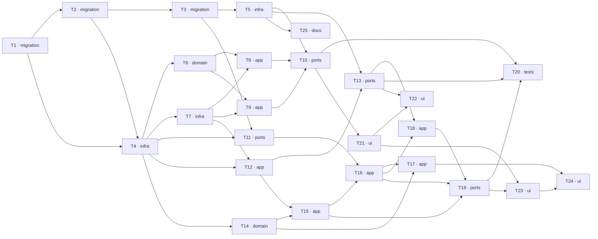

# Epic — delivery-addresses

> **Spec:** [spec.md](../spec.md) · **Design:** [sad.md](../sad.md) · **Data model:** [data-model.md](../data-model.md) · **API:** [openapi.yaml](../contracts/openapi.yaml) · **Test plan:** [test-plan.md](../test-plan.md) · **ADRs:** [adr/](../adr/) · **UI:** [design-handoff.md](../design-handoff.md)

**Size:** `L` · **Route:** `full` · **Surfaces:** `web-frontend`, `backend-service`

## Goal

Make a customer a record a Warehouse maintains once, carrying the places its goods may be sent; make
every line of a supplier order state where its goods travel and by which of the two routes; and
announce, while the goods are still in motion, when a frozen line's Delivery Address has stopped
matching where the demand behind it now goes. Shipping this epic turns a typed customer name into a
destination the record is accountable for ([spec.md §2](../spec.md)).

## Scope

- **In:** one new server module (`customers`) and one new web module (`modules/customer`); extensions
  to `warehouses`, `customer-orders`, `purchase-drafts` and `modules/workspace`; new shared
  authorization infrastructure (`@ObservedPermission`); a new `@warehouser/contracts/customers`
  subpath and three extended ones; three forward-only migrations against **populated** relations; and
  the retrofit that brings every already-shipped surface carrying a customer name under
  `CUSTOMERS:WATCH`.
- **Out:** Locations, stock balances and put-away; suppliers and supplier addresses; dispatch,
  carriers, tracking and shipping cost; address validation, geocoding and maps; proof that a Direct
  Delivery happened; sharing Customers across a Workspace; merging two Customers; backfilling or
  matching the customer names already typed onto Customer Orders; paging; any asynchronous work
  ([spec.md §3](../spec.md), [sad.md §3](../sad.md)).

## Task map

Eleven phases. The widest parallel branch is phase 4 — `T5` (shared authorization), `T6` and `T7`
(the customers domain and its repositories), `T11` (the Warehouse address slice) and `T14` (the
purchase-draft delivery domain) have no dependency on each other.

## Tasks

See [tracker.md](./tracker.md) for status. Machine contract: [tasks.json](../tasks.json).

| #   | Task                                                                                                                                                                                       | Layer       | Blocked by    | DoD (short)                                                                                                   |
| --- | ------------------------------------------------------------------------------------------------------------------------------------------------------------------------------------------ | ----------- | ------------- | ------------------------------------------------------------------------------------------------------------- |
| T1  | [Promote the customer-schema migration: two relations, their checks, keys and the partial unique Main-address index](./create-customer-schema-migration.md)                                | `migration` | —             | Two new relations, their constraints and the partial unique Main-address index apply and revert cleanly       |
| T2  | [Promote the delivery-destinations migration: 14 columns across five shipped relations, with the Via Warehouse and ending-attribution backfills](./add-delivery-destinations-migration.md) | `migration` | T1            | 14 columns across five shipped relations, backfilled against pre-existing rows, apply **and revert**          |
| T3  | [Promote the Permission grant migration and add the feature's PermissionId, WorkspacePermissionId and ErrorCode members](./grant-delivery-address-permissions-migration.md)                | `migration` | T2            | Five Permissions granted idempotently; every PermissionId and ErrorCode member exported                       |
| T4  | [Add the two new shared persistence entities and extend the four shipped ones, registered on DomainModule](./delivery-persistence-entities.md)                                             | `infra`     | T1, T2        | Two new and four changed entities resolve on DomainModule and round-trip a row each                           |
| T5  | [Add @ObservedPermission, resolve it in WarehouseAccessGuard, and carry observedPermissionIds on AccessCurrentUser](./observed-permission-stage.md)                                        | `infra`     | T3            | An observed Permission never denies; a required one still does; the principal carries the granted subset      |
| T6  | [Build the customers domain: value objects, predicates, error factories, mappers and CustomerAddressBookService](./customers-domain.md)                                                    | `domain`    | T4            | The blank, availability, last-active-address and Main-membership rules pass with no framework import          |
| T7  | [Add the three customers specialized repositories: directory, address book and awaiting demand](./customers-repositories.md)                                                               | `infra`     | T4            | Three repositories answer their question in one read, under lock where the rule needs it                      |
| T8  | [Add the Customer lifecycle commands: record, correct the name, deactivate and reactivate](./customer-lifecycle-commands.md)                                                               | `app`       | T6, T7        | A Customer is recorded, corrected and deactivated; a taken name and a foreign Warehouse are refused alike     |
| T9  | [Add the Delivery Address book commands: add, revise, mark Main, deactivate and reactivate](./delivery-address-book-commands.md)                                                           | `app`       | T6, T7        | Exactly one Main address at rest; the last active one is refused under lock                                   |
| T10 | [Serve the customers REST surface with its queries and the new @warehouser/contracts/customers subpath](./customers-rest-surface.md)                                                       | `ports`     | T5, T8, T9    | Eight endpoints validate, deny non-disclosingly, and present no count without CUSTOMERS:WATCH                 |
| T11 | [Record the Warehouse's own Delivery Address end to end: Workspace-guarded command, route, contract and detail-pane section](./warehouse-delivery-address.md)                              | `ports`     | T3, T4        | The Warehouse address is recorded at the Workspace prefix and rendered in the detail pane                     |
| T12 | [Give a Customer Order its destination and add the redirection command](./customer-order-destination.md)                                                                                   | `app`       | T4, T7        | An order defaults to the Main address; redirection moves an outstanding order and refuses the rest            |
| T13 | [Redact customer identity in the demand and Customer Order projections and serve their REST surface](./demand-identity-redaction.md)                                                       | `ports`     | T5, T12       | One redaction test per projection; withheld means the field is absent, not null                               |
| T14 | [Extend the purchase-drafts domain with Delivery Mode, the ending rules and the closure predicate](./purchase-draft-delivery-domain.md)                                                    | `domain`    | T4            | Delivery Mode, the two ending rules and the closure predicate pass as pure predicates                         |
| T15 | [Set a line's Delivery Mode and Delivery Address, and enforce the direct-line agreement at the link and the revision](./line-delivery-and-agreement.md)                                    | `app`       | T12, T14      | The disagreeing-link read exists once and refuses at the link and the revision, withdrawing nothing           |
| T16 | [Freeze the delivery statement by value and refuse the two conditions that make a freeze unsound](./purchase-draft-freeze-capture.md)                                                      | `app`       | T11, T15      | The freeze captures address, notes and customer name by value and refuses the two unsound conditions          |
| T17 | [Replace the whole-draft arrival with per-line endings and withdraw POST /purchase-drafts/{id}/arrival](./per-line-endings.md)                                                             | `app`       | T14, T16      | One line's ending is all-or-nothing; the draft closes on the last one; the whole-draft route is gone          |
| T18 | [Report Address Drift and serve the by-line split from the read repository](./address-drift-and-by-line-read.md)                                                                           | `app`       | T13, T16      | Drift is computed per read and never stored; the by-line projection splits by mode                            |
| T19 | [Serve the purchase-drafts REST surface: line delivery, readiness, the by-line read and the redacted draft reads](./purchase-drafts-rest-surface.md)                                       | `ports`     | T15, T16, T18 | Every draft endpoint validates both projection forms; no frozen column is reachable by payload                |
| T20 | [Add the architecture check that ties an identity-bearing response schema to its observed-Permission declaration](./authorization-coverage-checks.md)                                      | `tests`     | T10, T13, T19 | Removing one observed declaration fails the build                                                             |
| T21 | [Build the Customers web destination with its address book, awaiting list, dialogs and the shared customer picker](./customers-destination-ui.md)                                          | `ui`        | T10           | The destination is absent without the Permission, issues zero requests, and the web build passes              |
| T22 | [Carry the destination onto the Demand surface and add the redirect dialog](./demand-destination-ui.md)                                                                                    | `ui`        | T13, T21      | The pin is absent for a typed-name order and the text says so to a screen reader                              |
| T23 | [Add the per-line DELIVERY block, the drift presentation split by mode, and the By-line view](./purchase-draft-delivery-ui.md)                                                             | `ui`        | T19, T21      | The DELIVERY block, the mode radiogroup, the split drift presentation and the By-line view render as approved |
| T24 | [Replace the whole-draft arrival modal with the two 720px per-line ending dialogs](./line-ending-dialogs-ui.md)                                                                            | `ui`        | T17, T23      | Two 720px ending dialogs replace the arrival modal; no call to the withdrawn route remains                    |
| T25 | [Raise the ordering change request and promote @ObservedPermission into docs/system](./ordering-change-request-and-system-docs.md)                                                         | `docs`      | T5            | Ordering is no longer self-contradictory and the observed-Permission stage is in docs/system                  |

## Lanes `implement` will serialize

Tasks whose `files_hint` sets overlap share a lane and are committed in sequence, not in parallel.

| Lane                                        | Tasks                   | Why                                                                                                                                                                                                                          |
| ------------------------------------------- | ----------------------- | ---------------------------------------------------------------------------------------------------------------------------------------------------------------------------------------------------------------------------- |
| `apps/server/migrations/`                   | T1 → T2 → T3            | `layer: migration` is serialized regardless; the three must land in timestamp order.                                                                                                                                         |
| `customers.module.ts`, `usecases/commands/` | T6, T8, T9              | One module's registration and command directory.                                                                                                                                                                             |
| `tests/refactor/route-table.baseline.json`  | T10, T11, T13, T17, T19 | The baseline is regenerated once per ports task and **never silenced**.                                                                                                                                                      |
| `packages/contracts/src/purchase-drafts/`   | **T17 ↔ T24**           | **Compile-coupled pair.** The withdrawn whole-draft arrival route breaks the shipped contract and the shipped dialog together; `implement` may close both with one gate and one commit. The server half must not land first. |
| `apps/web/src/test/locale-baseline.json`    | T11, T21, T22, T23, T24 | Every new translation key fails `i18n.spec.ts` until the capture is regenerated.                                                                                                                                             |

## Risks / Hard rules

These are constraints a task must not violate, not advice.

- **Frozen-address integrity** ([spec.md §6](../spec.md)) — 0 recorded changes to a line's delivery
  mode or Delivery Address after Ready for Ordering. The recorded endings and the move to Closed are
  the only permitted additions. T16 makes this structural by capturing the address **by value**, so
  no live reference survives for an edit to travel along.
- **Authorization coverage** ([spec.md §6](../spec.md), [sad.md §11](../sad.md)) — 100% of this
  feature's capabilities carry an explicit Permission rule and Warehouse ownership check, **reads
  included**, and 100% of the pre-existing surfaces carrying customer identity are brought under
  `CUSTOMERS:WATCH`. The retrofit is "the largest and least visible part of this feature"; T20's
  static check and T13/T19's distinct redacted contract shape are the two mechanical defences that
  replace a review pass.
- **No count is ever a leak** ([spec.md §6.1](../spec.md)) — no count, badge or total reveals how
  many Customers or Delivery Addresses exist to a member who may not read them, on any surface.
- **Direct-line agreement is continuous** ([spec.md §6](../spec.md), AC-15a) — checked at the link,
  the revision **and** the freeze. The system names every disagreement and withdraws none; which
  link to drop is the member's decision.
- **Ending atomicity** ([spec.md §6](../spec.md)) — one line's ending writes its quantity, its
  Allocations and every resulting Outstanding Quantity together or not at all.
- **On-hand isolation** ([spec.md §6](../spec.md), AC-21) — 0 changes to any Item's On-hand Quantity
  from an arrival or a direct delivery; directly-shipped goods were never in the Transit Zone.
- **Authority staleness** ([spec.md §6](../spec.md)) — every authorization decision re-reads Roles,
  Permissions and memberships from the store inside the request being authorized.
- **`pnpm --filter @warehouser/web build` is part of the definition of done**
  ([sad.md §10](../sad.md) gate 3) — a new contracts subpath needs _two_ vite aliases, and missing
  them breaks **only** the build while the entire test suite stays green. This is exactly how
  `ordering` left `apps/web` unbuildable across several commits with every gate reporting green.
- **Never run `migration:generate`** ([data-model.md](../data-model.md)) — against the shipped
  entities it emits a 368-statement migration that drops every `chk_*` constraint.
- **The concurrency and throughput targets cannot be proven here** ([sad.md §11](../sad.md)) —
  PGlite has one backend and the real-PostgreSQL tier was removed by decision. Lock order and
  conditional-update refusals are asserted by statement shape and zero-row behaviour. Do not add
  specs that would pass for the wrong reason, and **do not report the 50 ops/s target as met**.

## Decisions confirmed at this stage

- **The `ordering` change request** ([sad.md §11](../sad.md), due before `tasks`) — raised as **T25**
  inside this epic, sequenced early and blocking nothing, rather than left as a §11 note.
- **The `By draft / By line` toggle** ([design-handoff.md § Open questions](../design-handoff.md)) —
  ships as an **explicitly unpinned** presentation choice. AC-22 requires the separation and names no
  mechanism, so changing the toggle later needs no spec amendment. Recorded in T23.
- **Module naming** ([sad.md §11](../sad.md)) — the Demand destination lives in
  `modules/customer-order`, which is what the repository ships and what `ordering` §8 settled; the
  destination, label and copy stay **Demand**. `design-handoff.md`'s `modules/demand/` is superseded.
- **Nav position of `Customers`** — index 4, between `Items` and `Access`, per the approved handoff.
