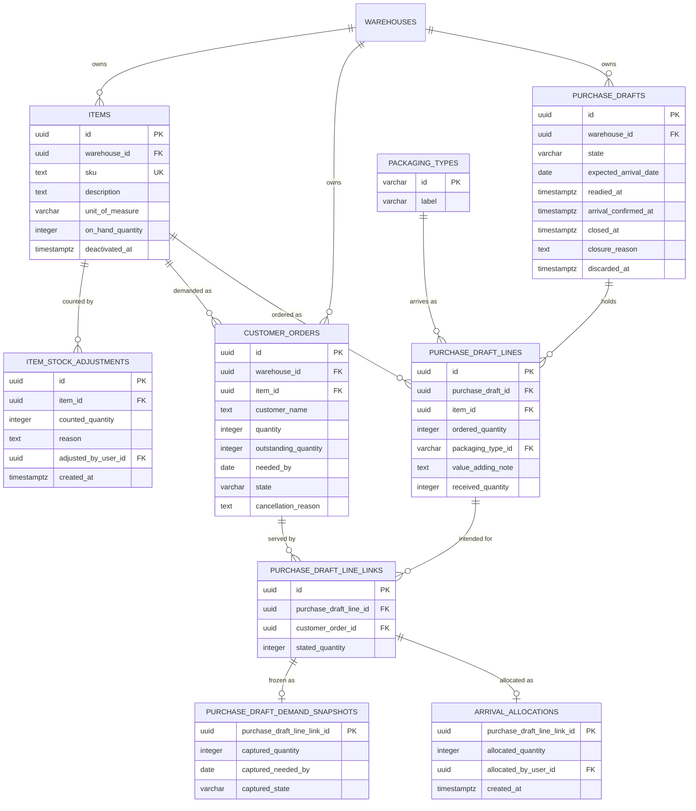

# Data model — ordering

Nine new relations, no change to any shipped one. This model inherits the persistence architecture
in [`docs/system/server-architecture.md`](../../system/server-architecture.md) and
[ADR 21-07 PostgreSQL persistence with TypeORM](../../system/adr/21-07-2026-postgresql-with-typeorm.md)
without specialising it: PostgreSQL, TypeORM entities in `shared/domain/entities/`, specialized
concrete repositories in `shared/domain/repositories/`, reviewed migration classes, and
`synchronize` disabled in every environment. Feature domain objects never carry TypeORM decorators
and repositories never return them; mapping happens in each module's `domain/mappers/` above the
repository boundary, per
[Creating a server repository](../../system/guides/creating-a-server-repository.md).

Staged migrations live in [`./migrations/`](./migrations/) and are **not** in the live tree. They
were applied, reverted and re-applied against a throwaway database, and every constraint below was
probed with representative rows — see [`_audit/data-model-2026-08-25.md`](./_audit/data-model-2026-08-25.md).

## ER diagram



`warehouse_id` is carried on `items`, `customer_orders`, `purchase_drafts`, `purchase_draft_lines`
and `purchase_draft_line_links` and is drawn into every composite reference. That is what turns
"everything belongs to one Warehouse" from a check the application must remember into a reference
the database will not let you break (AC-03, AC-11).

## Entities

### `items`

Aggregate root. Owns SKU uniqueness, activation, and the current On-hand Quantity.

| Column             | Type        | Constraints                                | Notes                                                   |
| ------------------ | ----------- | ------------------------------------------ | ------------------------------------------------------- |
| `id`               | UUID        | PK, app-generated                          |                                                         |
| `warehouse_id`     | UUID        | NOT NULL, FK → `warehouses(id)` RESTRICT   |                                                         |
| `sku`              | TEXT        | NOT NULL, collation `C`, trimmed non-empty | Deterministic comparison; `C` follows `warehouses.name` |
| `description`      | TEXT        | NOT NULL, trimmed non-empty                | Always correctable (AC-06b)                             |
| `unit_of_measure`  | VARCHAR(32) | NOT NULL, trimmed non-empty                | Exactly one per Item                                    |
| `on_hand_quantity` | INTEGER     | NOT NULL DEFAULT 0, `>= 0`                 | A new Item starts with nothing on hand (AC-06, AC-09)   |
| `deactivated_at`   | timestamptz | NULL, `>= created_at`                      | Inactive when set; reactivation clears it (AC-06d)      |
| `created_at`       | timestamptz | NOT NULL DEFAULT now()                     |                                                         |
| `updated_at`       | timestamptz | NOT NULL DEFAULT now()                     |                                                         |

**Aggregate root:** root.
**Constraints:** UNIQUE `(warehouse_id, sku)` — a SKU identifies at most one Item within a Warehouse
and never across them (AC-07, AC-07a), and deactivation does not release it (AC-06d). UNIQUE
`(id, warehouse_id)` exists purely as a composite reference target.
**Access patterns:** SKU lookup and the Item list → `uq_items_warehouse_sku`.

Activation is modelled as a nullable instant rather than a boolean, matching `warehouses.archived_at`
— the repo's existing way of saying "withdrawn, reversibly, at a known time".

### `item_stock_adjustments`

Append-only history. The row is written once and never updated, so it carries no `updated_at` —
the same shape `sessions` already uses.

| Column                | Type        | Constraints                         | Notes                                 |
| --------------------- | ----------- | ----------------------------------- | ------------------------------------- |
| `id`                  | UUID        | PK, app-generated                   |                                       |
| `item_id`             | UUID        | NOT NULL                            |                                       |
| `warehouse_id`        | UUID        | NOT NULL                            |                                       |
| `counted_quantity`    | INTEGER     | NOT NULL, `>= 0`                    | The figure the member counted (AC-09) |
| `reason`              | TEXT        | NOT NULL, trimmed non-empty         | Never optional (AC-09a)               |
| `adjusted_by_user_id` | UUID        | NOT NULL, FK → `users(id)` RESTRICT |                                       |
| `created_at`          | timestamptz | NOT NULL DEFAULT now()              |                                       |

**Aggregate root:** `items`.
**Constraints:** composite FK `(item_id, warehouse_id)` → `items(id, warehouse_id)`.
**Access patterns:** the latest reason for an Item → `idx_item_stock_adjustments_item_created`.

This history is written in the same transaction as the Item's new figure (§6.3), and it is what makes
the `spec.md` §8 Stock default — converting each figure into one opening Movement — implementable
later without inventing provenance.

### `customer_orders`

Aggregate root. Owns Outstanding Quantity, the needed-by date, and the Fulfilled transition.

| Column                 | Type        | Constraints                                            | Notes                                             |
| ---------------------- | ----------- | ------------------------------------------------------ | ------------------------------------------------- |
| `id`                   | UUID        | PK, app-generated                                      |                                                   |
| `warehouse_id`         | UUID        | NOT NULL, FK → `warehouses(id)` RESTRICT               |                                                   |
| `item_id`              | UUID        | NOT NULL, composite FK → `items(id, warehouse_id)`     | Demand names an Item of its own Warehouse (AC-03) |
| `customer_name`        | TEXT        | NOT NULL, collation `C`, trimmed non-empty             | Personal data — see Security below                |
| `quantity`             | INTEGER     | NOT NULL, `> 0`                                        | A positive whole number (AC-02)                   |
| `outstanding_quantity` | INTEGER     | NOT NULL, `>= 0`, `<= quantity`                        | Reduced only by Allocation                        |
| `needed_by`            | DATE        | NOT NULL                                               | Calendar date, not an instant                     |
| `state`                | VARCHAR(16) | NOT NULL, `IN ('unfulfilled','fulfilled','cancelled')` |                                                   |
| `cancellation_reason`  | TEXT        | NULL, trimmed non-empty when present                   | Present exactly when cancelled (AC-19a)           |
| `recorded_by_user_id`  | UUID        | NOT NULL, FK → `users(id)` RESTRICT                    | AC-01                                             |
| `cancelled_by_user_id` | UUID        | NULL, FK → `users(id)` RESTRICT                        |                                                   |
| `cancelled_at`         | timestamptz | NULL, `>= created_at`                                  |                                                   |
| `created_at`           | timestamptz | NOT NULL DEFAULT now()                                 |                                                   |
| `updated_at`           | timestamptz | NOT NULL DEFAULT now()                                 |                                                   |

**Aggregate root:** root.
**Constraints:** `chk_customer_orders_state_outstanding` — an Unfulfilled order is waiting for
something (`outstanding > 0`) and a Fulfilled one is waiting for nothing (`outstanding = 0`); a
cancelled one is unconstrained, because cancellation removes it from the demand without rewriting
what it asked for (AC-17a, AC-19). `chk_customer_orders_cancellation_attribution` — the reason, the
member and the time arrive together or not at all (AC-19a).
**Access patterns:** the demand aggregation → `idx_customer_orders_unfulfilled_demand`; the whole
list → `idx_customer_orders_warehouse_created`; "is this Item named" → `idx_customer_orders_item_id`.

### `packaging_types`

Seeded catalogue, system-managed, extended only through migrations (`CONTEXT.md` §Invariants).
Follows the shape of the existing `permissions` catalogue.

| Column       | Type         | Constraints                 | Notes                                             |
| ------------ | ------------ | --------------------------- | ------------------------------------------------- |
| `id`         | VARCHAR(32)  | PK, `~ '^[a-z][a-z0-9_]*$'` | `loose_items`, `cartons`, `pallets`, `cable_coil` |
| `label`      | VARCHAR(100) | NOT NULL, non-empty         |                                                   |
| `created_at` | timestamptz  | NOT NULL DEFAULT now()      |                                                   |
| `updated_at` | timestamptz  | NOT NULL DEFAULT now()      |                                                   |

The identifier is pattern-checked rather than enumerated, so a later migration can add an entry
without a schema change — which is exactly the extension path the invariant allows.

### `purchase_drafts`

Aggregate root. Owns the freeze, the close-once rule, and the terminal states.

| Column                         | Type        | Constraints                                                        | Notes                                            |
| ------------------------------ | ----------- | ------------------------------------------------------------------ | ------------------------------------------------ |
| `id`                           | UUID        | PK, app-generated                                                  |                                                  |
| `warehouse_id`                 | UUID        | NOT NULL, FK → `warehouses(id)` RESTRICT                           |                                                  |
| `state`                        | VARCHAR(24) | NOT NULL, `IN ('draft','ready_for_ordering','closed','discarded')` |                                                  |
| `expected_arrival_date`        | DATE        | NULL                                                               | Unstated until the supplier is spoken to (AC-10) |
| `created_by_user_id`           | UUID        | NOT NULL, FK → `users(id)` RESTRICT                                |                                                  |
| `readied_by_user_id`           | UUID        | NULL, FK → `users(id)` RESTRICT                                    | AC-14                                            |
| `readied_at`                   | timestamptz | NULL, `>= created_at`                                              |                                                  |
| `arrival_confirmed_by_user_id` | UUID        | NULL, FK → `users(id)` RESTRICT                                    | AC-17                                            |
| `arrival_confirmed_at`         | timestamptz | NULL, `= closed_at` when set                                       | Written once (AC-17b)                            |
| `closed_by_user_id`            | UUID        | NULL, FK → `users(id)` RESTRICT                                    |                                                  |
| `closed_at`                    | timestamptz | NULL, `>= readied_at`                                              |                                                  |
| `closure_reason`               | TEXT        | NULL, trimmed non-empty when present                               | AC-21                                            |
| `discarded_by_user_id`         | UUID        | NULL, FK → `users(id)` RESTRICT                                    | AC-24                                            |
| `discarded_at`                 | timestamptz | NULL, `>= created_at`                                              |                                                  |
| `created_at`                   | timestamptz | NOT NULL DEFAULT now()                                             |                                                  |
| `updated_at`                   | timestamptz | NOT NULL DEFAULT now()                                             |                                                  |

**Aggregate root:** root.
**Constraints:**

- `chk_purchase_drafts_readiness_attribution` — `ready_for_ordering` and `closed` carry a freeze
  attribution; `draft` and `discarded` carry none. This is what makes "a draft that has been made
  ready is never Discarded" a schema fact rather than a command's memory (AC-24a).
- `chk_purchase_drafts_closure_path` — a Closed draft was closed by **exactly one** of Arrival
  Confirmation or a member's reasoned closure, never both and never neither (AC-17, AC-21, AC-21a).
- `chk_purchase_drafts_discard_attribution`, `chk_purchase_drafts_closure_attribution` — each
  terminal state carries its member and its time, and no other state carries them.

**Access patterns:** the draft list and the open-draft predicate Coverage joins against →
`idx_purchase_drafts_warehouse_state_created`.

### `purchase_draft_lines`

| Column              | Type        | Constraints                                        | Notes                                              |
| ------------------- | ----------- | -------------------------------------------------- | -------------------------------------------------- |
| `id`                | UUID        | PK, app-generated                                  |                                                    |
| `purchase_draft_id` | UUID        | NOT NULL                                           |                                                    |
| `warehouse_id`      | UUID        | NOT NULL                                           |                                                    |
| `item_id`           | UUID        | NOT NULL, composite FK → `items(id, warehouse_id)` | AC-11                                              |
| `ordered_quantity`  | INTEGER     | NOT NULL, `> 0`                                    |                                                    |
| `packaging_type_id` | VARCHAR(32) | NULL, FK → `packaging_types(id)` RESTRICT          | AC-12, AC-13                                       |
| `value_adding_note` | TEXT        | NULL, trimmed non-empty when present               | Rendered as text, never markup (§6.1)              |
| `received_quantity` | INTEGER     | NULL, `>= 0` when present                          | NULL until arrival; `0` when nothing came (AC-17b) |
| `created_at`        | timestamptz | NOT NULL DEFAULT now()                             |                                                    |
| `updated_at`        | timestamptz | NOT NULL DEFAULT now()                             |                                                    |

**Aggregate root:** `purchase_drafts`.
**Constraints:** composite FK `(purchase_draft_id, warehouse_id)` → `purchase_drafts(id, warehouse_id)`.
UNIQUE `(id, purchase_draft_id, warehouse_id)` is the reference target a link uses, so one reference
proves line, draft and Warehouse together.

Both halves of the Pre-receipt Requirement are nullable because AC-10 creates a draft without them
and AC-12 states them later; AC-14a requires only that a ready draft holds at least one line.

`received_quantity` is deliberately unbounded above: what arrived is whatever physically arrived,
bounded neither above nor below by what was ordered (AC-17, `CONTEXT.md` §Invariants).

### `purchase_draft_line_links`

The many-to-many join that carries a stated quantity and claims nothing.

| Column                   | Type        | Constraints                                                  | Notes                                    |
| ------------------------ | ----------- | ------------------------------------------------------------ | ---------------------------------------- |
| `id`                     | UUID        | PK, app-generated                                            |                                          |
| `purchase_draft_line_id` | UUID        | NOT NULL                                                     |                                          |
| `purchase_draft_id`      | UUID        | NOT NULL                                                     | Carried for the Coverage join; see below |
| `warehouse_id`           | UUID        | NOT NULL                                                     |                                          |
| `customer_order_id`      | UUID        | NOT NULL, composite FK → `customer_orders(id, warehouse_id)` | AC-11                                    |
| `stated_quantity`        | INTEGER     | NOT NULL, `> 0`                                              | Never reconciled with anything (AC-11a)  |
| `created_at`             | timestamptz | NOT NULL DEFAULT now()                                       |                                          |
| `updated_at`             | timestamptz | NOT NULL DEFAULT now()                                       |                                          |

**Aggregate root:** `purchase_drafts`.
**Constraints:** UNIQUE `(purchase_draft_line_id, customer_order_id)` — one link per (line, order)
pair. UNIQUE `(id, purchase_draft_line_id, customer_order_id)` is the reference target the snapshot
and the allocation both use.

`purchase_draft_id` is denormalized so the Coverage aggregation reaches the draft's state in one join
instead of two. It is not a cache: `fk_purchase_draft_line_links_line` references
`purchase_draft_lines(id, purchase_draft_id, warehouse_id)`, so a link whose draft column disagreed
with its line's could not be written at all.

### `purchase_draft_demand_snapshots`

The demand exactly as it stood at the freeze. Written once, never updated — divergence is reported
as a Drift Signal instead (AC-16).

| Column                        | Type        | Constraints                                            | Notes                    |
| ----------------------------- | ----------- | ------------------------------------------------------ | ------------------------ |
| `purchase_draft_line_link_id` | UUID        | PK                                                     | At most one row per link |
| `purchase_draft_line_id`      | UUID        | NOT NULL                                               |                          |
| `customer_order_id`           | UUID        | NOT NULL                                               |                          |
| `captured_quantity`           | INTEGER     | NOT NULL, `> 0`                                        |                          |
| `captured_needed_by`          | DATE        | NOT NULL                                               |                          |
| `captured_state`              | VARCHAR(16) | NOT NULL, `IN ('unfulfilled','fulfilled','cancelled')` |                          |
| `created_at`                  | timestamptz | NOT NULL DEFAULT now()                                 |                          |

**Aggregate root:** `purchase_drafts` — the snapshot belongs to the draft and is frozen with it.
**Constraints:** "at most one Demand Snapshot row per link" is the primary key itself, not a check.
Composite FK `(purchase_draft_line_link_id, purchase_draft_line_id, customer_order_id)` →
`purchase_draft_line_links(id, purchase_draft_line_id, customer_order_id)`, so a snapshot cannot
name a Customer Order its link does not join.
**Access patterns:** the drift comparison per draft → `idx_purchase_draft_demand_snapshots_line_id`.

Storing captured values rather than a touch log is what makes "a value amended and then put back as
it was reports no drift" true by construction (AC-16).

### `arrival_allocations`

| Column                        | Type        | Constraints                         | Notes                                              |
| ----------------------------- | ----------- | ----------------------------------- | -------------------------------------------------- |
| `purchase_draft_line_link_id` | UUID        | PK                                  | Arrival happens once, so a link allocates once     |
| `purchase_draft_line_id`      | UUID        | NOT NULL                            |                                                    |
| `customer_order_id`           | UUID        | NOT NULL                            |                                                    |
| `allocated_quantity`          | INTEGER     | NOT NULL, `> 0`                     | A line with no demand left records no row (AC-17b) |
| `allocated_by_user_id`        | UUID        | NOT NULL, FK → `users(id)` RESTRICT | AC-17                                              |
| `created_at`                  | timestamptz | NOT NULL DEFAULT now()              |                                                    |

**Aggregate root:** `purchase_drafts` (written by Arrival Confirmation, which the draft owns —
[ADR 0002](./adr/0002-arrival-confirmation-ownership.md)).
**Constraints:** the same composite FK the snapshot uses. "An Allocation names a Customer Order its
line is actually linked to" (AC-18) is therefore **proven by the reference**, not re-checked in
application code — the allocation is addressed _through_ the link rather than beside it.
**Access patterns:** the locked allocated-total read → `idx_arrival_allocations_customer_order_id`;
the per-line arrival bound → `idx_arrival_allocations_line_id`.

## Indexes

Every index below is justified by a named query from `sad.md` §6. Attribution columns
(`*_by_user_id`) are **not** indexed: no read filters on them, `users` rows are never deleted, and
the repo already leaves such foreign keys unindexed (`warehouse_memberships.user_id` has no
dedicated index). Indexing them would be the "just in case" this stage is supposed to avoid.

| Index                                              | Columns                                                                | Query it serves                                                                              |
| -------------------------------------------------- | ---------------------------------------------------------------------- | -------------------------------------------------------------------------------------------- |
| `uq_items_warehouse_sku` (unique)                  | `warehouse_id, sku`                                                    | §6.2.2 SKU lookup; the Item list and picker (AC-06a, AC-07)                                  |
| `idx_item_stock_adjustments_item_created`          | `item_id, created_at`                                                  | The latest adjustment reason beside an Item's figure (AC-08)                                 |
| `idx_customer_orders_unfulfilled_demand`           | `warehouse_id, item_id, needed_by` **partial** `state = 'unfulfilled'` | §6.5 demand aggregation — total Outstanding Quantity and earliest needed-by per Item (AC-04) |
| `idx_customer_orders_warehouse_created`            | `warehouse_id, created_at, id`                                         | `GET /customer-orders`, returned whole and deterministically ordered                         |
| `idx_customer_orders_item_id`                      | `item_id`                                                              | §6.2.5 "is this Item named by demand" — the fixed-SKU refusal (AC-06c)                       |
| `idx_purchase_drafts_warehouse_state_created`      | `warehouse_id, state, created_at`                                      | §6.8 draft list; the open-draft predicate Coverage joins against (AC-16a, AC-21a)            |
| `idx_purchase_draft_lines_draft_id`                | `purchase_draft_id`                                                    | §6.8 single-draft read; §6.9 lock order over a draft's lines                                 |
| `idx_purchase_draft_lines_item_id`                 | `item_id`                                                              | §6.2.5 "is this Item named by a draft line" (AC-06c)                                         |
| `uq_purchase_draft_line_links_line_order` (unique) | `purchase_draft_line_id, customer_order_id`                            | The links of one line; enforces one link per pair                                            |
| `idx_purchase_draft_line_links_customer_order_id`  | `customer_order_id`                                                    | §6.5 Coverage — which drafts link to this demand and for how much (AC-20)                    |
| `idx_purchase_draft_line_links_draft_id`           | `purchase_draft_id`                                                    | §6.8 the links of one draft, for the drift comparison                                        |
| `idx_purchase_draft_demand_snapshots_line_id`      | `purchase_draft_line_id`                                               | §6.8 snapshot rows beside current demand (AC-16)                                             |
| `idx_arrival_allocations_customer_order_id`        | `customer_order_id`                                                    | §6.10 the locked allocated-total read behind the amendment floor (AC-19b)                    |
| `idx_arrival_allocations_line_id`                  | `purchase_draft_line_id`                                               | §6.9 the per-line assignment bound (AC-18)                                                   |

The demand index carries its `state = 'unfulfilled'` predicate deliberately: `sad.md` §8 requires the
read's cost to stay bounded by outstanding demand rather than by accumulated history. A verified
plan on the staged schema uses it and returns rows already grouped by `item_id`:

```text
GroupAggregate
  Group Key: item_id
  ->  Index Scan using idx_customer_orders_unfulfilled_demand on customer_orders
        Index Cond: (warehouse_id = $1)
```

### The non-fan-out requirement

`sad.md` §6.5 flags that the demand read combines two independent one-to-many aggregations — Customer
Orders per Item, and links per Customer Order. Expressed as one `GROUP BY` over both joins, each
total is multiplied by the other's row count. The schema does not fix this on its own; the repository
must aggregate them **separately and then join** (two grouped subqueries, or a lateral aggregate),
which the two indexes above serve independently. This is a correctness property, so it belongs in an
integration test and not only in a performance one.

## Constraints the model deliberately does **not** express

Named here so a later reviewer does not "fix" their absence.

- **A link's stated quantity is never reconciled** with the line quantity, the Customer Order
  quantity, or any other link. AC-11a requires both a second line linking to one order and links whose
  quantities do not add up to the line to be recorded unchanged. A database constraint here would
  contradict the specification. _Probed: both accepted._
- **A needed-by date in the past** is refused at write time (AC-02a, AC-19) but is not a CHECK: a row
  legitimately ages past its date, and a constraint would make every existing order un-updatable the
  day after it came due.
- **"A frozen draft never changes"** and **"Arrival Confirmation happens at most once"** are not row
  constraints. They are state-guarded conditional updates inside the owning command — `UPDATE … WHERE
state = 'draft'`, zero affected rows raising a typed refusal (§4, §6.7, §6.9). The schema supports
  them (`chk_purchase_drafts_closure_path`, the allocation primary key) but the transitions are the
  enforcement. Evidence is an architecture check plus integration tests (§10).
- **"Outstanding Quantity ≥ 0"** is enforced, but the AC-19b floor — never amend below what has
  already been allocated — is not: it depends on a `SUM` over `arrival_allocations` and is evaluated
  against locked rows inside the transaction (§6.10). It must never be silently clamped.
- **On-hand Quantity is never derived** from arrival. Nothing in the schema connects
  `arrival_allocations` to `items.on_hand_quantity`, which is AC-18a expressed as an absence.

## Concurrency, locks and transactions

The lock order `sad.md` §8 fixes — the Purchase Draft row, then its lines, then the Customer Orders
in ascending identifier order — is what keeps §6.9 and §6.10 from deadlocking on the same rows from
two directions. It is repository behaviour, not schema, but the indexes above are what make each step
of it an indexed lookup rather than a scan.

- Both flows own one `@Transactional()` boundary on the service; repositories join the shared
  transaction context and never open their own (`creating-a-server-repository.md`).
- Freeze, arrival, closure and discard are conditional updates on the prior state. Zero affected rows
  is a typed concurrency refusal, never a silent no-op — the same mechanism for all four, implemented
  once (§6.7/§6.9 flag).
- Expected conflicts map to stable application errors; no layer catches, logs and rethrows. This
  reuses the `ACCESS_CONCURRENT_CHANGE` / `WORKSPACE_CONCURRENT_CHANGE` pattern rather than
  re-deciding it.

## Repository boundaries

Repositories are specialized around a cohesive persistence operation, live in
`shared/domain/repositories/`, contain no private methods, import nothing from a feature module, and
accept and return shared persistence entities only. `sad.md` §5 names them:
`ItemCatalogueRepository`, `ItemStockAdjustmentRepository`, `CustomerOrderLifecycleRepository`,
`ConsolidatedDemandRepository`, `PurchaseDraftAssemblyRepository`, `PurchaseDraftReadRepository`,
`PurchaseDraftFreezeRepository`, `ArrivalConfirmationRepository`, `DemandAllocationRepository`,
`PackagingTypeCatalogueRepository`.

Two are worth calling out against the anti-patterns:

- `ItemCatalogueRepository` answers "is this Item named by any Customer Order **or** any Purchase
  Draft Line" in **one** query across two tables (§6.2.5) rather than exposing two table-shaped
  reads the caller must combine.
- `ConsolidatedDemandRepository` is one purpose-built query, not a composition of table reads — which
  is what makes the freshness guarantee structural: there is no second copy to go stale.

Persistence entities are `ItemEntity`, `ItemStockAdjustmentEntity`, `CustomerOrderEntity`,
`PackagingTypeEntity`, `PurchaseDraftEntity`, `PurchaseDraftLineEntity`,
`PurchaseDraftLineLinkEntity`, `DemandSnapshotEntryEntity`, `ArrivalAllocationEntity` in
`shared/domain/entities/`. Mapping to feature domain objects belongs in
`items|customer-orders|purchase-drafts/domain/mappers/`.

## Security

`customer_orders.customer_name` is the first personal data in the product and raises the whole
Warehouse's data classification to confidential (`spec.md` §6.1). Three consequences for this model:

- No index or constraint keys on the customer name, so it never leaks through an error message
  naming a constraint.
- Free-text columns — `value_adding_note`, `item_stock_adjustments.reason`, `cancellation_reason`,
  `closure_reason` — are stored as text and rendered as text, never as markup or a link. The schema
  trims them and rejects blanks; it does not attempt to police their content.
- Test fixtures use `example.test` addresses and placeholder names only.

## Test fixtures

Factories belong in `apps/server/test/factories/`, not in `migrations/`.

- `anItem(overrides)` — an active Item of a given Warehouse with a unique SKU and nothing on hand.
- `anOnHandAdjustment(overrides)` — a counted figure with a reason and an acting member.
- `aCustomerOrder(overrides)` — an Unfulfilled order with `outstanding_quantity = quantity` and a
  future needed-by date; `aFulfilledCustomerOrder` and `aCancelledCustomerOrder` for the other states.
- `aPurchaseDraft(overrides)` — a draft-state draft; `aFrozenPurchaseDraft` adds lines, links and the
  captured Demand Snapshot so drift and arrival tests start from a legal frozen record.
- `aPurchaseDraftLine`, `aPurchaseDraftLineLink`, `anArrivalAllocation` — the child rows, each
  defaulting to the parent's Warehouse so a cross-Warehouse case must be written deliberately.

Customer names are placeholders (`Buyer One`); no real-looking PII enters a seed or a fixture.

## Migrations

| Staged file                                                                         | Class                                   | What it does                                                                             |
| ----------------------------------------------------------------------------------- | --------------------------------------- | ---------------------------------------------------------------------------------------- |
| [`01-create-ordering-schema.ts`](./migrations/01-create-ordering-schema.ts)         | `CreateOrderingSchema1786600000000`     | The nine relations, their constraints and indexes, plus the four-row Packaging Type seed |
| [`02-grant-ordering-permissions.ts`](./migrations/02-grant-ordering-permissions.ts) | `GrantOrderingPermissions1786600100000` | The sixteen Permissions, granted to every existing `warehouse_manager` Role              |

Both are forward-only and assume no pre-existing rows, which is true by construction: none of these
relations exists. No shipped migration is edited and no existing table, key or constraint is altered,
so **no expand/backfill/contract sequence is required** — there is no destructive or new-non-null
change against populated data anywhere in this feature.

Every statement runs inside the migration transaction; no `CREATE INDEX CONCURRENTLY` is used, and
none is warranted, because every index is created on an empty table in the same migration that
creates it. Both `down` methods fully reverse their `up`, verified by applying and reverting against
a real database.

Migration 02 follows `apps/server/migrations/README.md` § Extending a Permission catalogue: insert
the catalogue rows, then grant them with an idempotent `INSERT … SELECT … WHERE NOT EXISTS`, because
provisioning only granted the set known when each Role was created. Its `down` removes the grants
before the catalogue rows, since `role_permissions` references `permissions` with `ON DELETE
RESTRICT`.

Promotion into `apps/server/migrations/` is a rename to
`1786600000000-CreateOrderingSchema.ts` / `1786600100000-GrantOrderingPermissions.ts`; the class
names already carry those timestamps, which sit after the last shipped migration
(`1786525200000-AddActiveWarehouseSelection`).
