# Software Architecture Description — ordering

## 1. Context and quality goals

The implemented system knows who a Warehouse's members are and what each of them may do, and nothing
else. `apps/server/src` holds `auth`, `users`, `access`, `warehouses` and `workspaces`; every one of
them owns access or ownership data. No table in `apps/server/migrations` holds a good, a customer or
an order, so there is no business data for the two-level authorization model finished in `workspaces`
to protect.

This feature introduces the first of it. It adds three durable business concepts a Warehouse
owns — the Item, the Customer Order and the Purchase Draft — and the loop that joins them: demand is
recorded per customer, consolidated per Item, answered by a draft a member assembles, frozen when
the member phones the supplier, and closed when the goods arrive and are attributed back to the
named customers waiting for them. It also adds the first personal data the product has held
(`spec.md` §6.1) and the first sixteen Warehouse Permissions whose subject is business rather than
access data.

The architecture must satisfy these quality goals, in priority order:

1. Every Item, Customer Order and Purchase Draft is reachable only through the Warehouse that owns
   it, and only under a Permission the actor holds **in that Warehouse**; a cross-Warehouse target is
   indistinguishable from a missing one and discloses nothing (`spec.md` AC-03, AC-07a, AC-11, AC-23,
   §6.1 "Cross-Warehouse demand reach").
2. A Purchase Draft that has reached Ready for Ordering is structurally unwritable except by Arrival
   Confirmation and closure. Zero recorded changes to its lines, ordered quantities, links, Expected
   Arrival Date or Pre-receipt Requirements after the freeze (`spec.md` AC-15, §6 "Frozen-record
   integrity", §6.1 "Allocation as a back door onto a frozen record").
3. One Arrival Confirmation records every received quantity, every Allocation and every resulting
   Outstanding Quantity together, or records none of them (`spec.md` AC-17, AC-18, §6 "Arrival
   atomicity").
4. Demand Lines, Coverage and Drift Signals are derived on every read from the Customer Orders and
   Purchase Draft Lines that exist at that moment, never stored and never repaired by a background
   job (`spec.md` AC-04, AC-16, AC-20, §6 "Demand-derivation freshness"; `CONTEXT.md` §Invariants).
5. The consolidated demand read stays within 400 ms at p95 at the `spec.md` §1 scale — roughly 2 000
   Items, 5 000 Unfulfilled Customer Orders and 250 open Purchase Drafts per Warehouse — while
   returning Demand Lines, their Coverage and On-hand Quantity whole rather than paged.
6. Every user-accessible capability the feature introduces, reads included, declares an explicit
   Permission rule and a Warehouse ownership check, and the web omits the navigation entries,
   destinations and controls the actor cannot use (`spec.md` AC-05, AC-22, §6 "Authorization
   coverage").
7. The concurrent seams — two members confirming one arrival, a Customer Order amended while it is
   being assigned against, two members freezing one draft — resolve deterministically rather than
   merging (`spec.md` §8, fifth open question, whose default this design implements in §8).

The specification is `Draft` and carries six open questions (`spec.md` §8). The three due _before
design_ are treated here: the concurrency seams are resolved in §8; the Warehouse-archival question
is left with the accepted `workspaces` behaviour and raised upstream; the On-hand reconciliation
question is answered structurally in §7 by keeping the adjustment history convertible. All six are
restated as gates in §11.

The UI approval gate this feature's `web-frontend` surface requires is already satisfied:
[`design-handoff.md`](./design-handoff.md) records ten frames approved on 2026-08-25
([frontend architecture](../../system/frontend-architecture.md) §"UI design boundary"). Its own
§ Implementation constraints defer module placement to this document's §5, which §5 and §8 settle.

## 2. Constraints inherited from `docs/system`

- The repository stays a browser SPA plus a NestJS modular monolith with shared boundary schemas in
  `packages/contracts` ([architecture map](../../system/architecture-map.md)). No new container, no
  new runtime and no new deployable is introduced.
- Server code follows the entity-related module, flat-module, inward-dependency, command/query,
  domain-service and thin-controller boundaries in
  [server architecture](../../system/server-architecture.md) and
  [adding a server module](../../system/guides/adding-a-server-module.md). A module is named for the
  entity whose invariants it enforces; modules never nest
  ([domain-owned flat modules](../../system/adr/14-08-2026-domain-owned-flat-modules.md)).
- Authentication and transport-level authorization stay in `shared/guards/`. This feature reuses
  `SessionAuthGuard` and `WarehouseAccessGuard` with `@RequiredPermission(...)` and
  `@ArchivedTolerantRead()` exactly as `workspaces` shipped them; it adds no third guard for
  authorization and no second authority vocabulary
  ([workspaces ADR 0001](../workspaces/adr/0001-two-level-request-authorization.md)).
- Persistence stays PostgreSQL through TypeORM. Shared TypeORM entities live in
  `shared/domain/entities/`; specialized concrete repositories live in `shared/domain/repositories/`,
  are shaped around a cohesive persistence operation rather than a table, hold no private methods,
  and never import a feature module
  ([creating a server repository](../../system/guides/creating-a-server-repository.md)). Every schema
  change is a reviewed forward-only migration with runtime synchronization disabled
  ([PostgreSQL/TypeORM ADR](../../system/adr/21-07-2026-postgresql-with-typeorm.md)).
- An atomic operation is owned by one `@Transactional()` injectable service or command; repositories
  obtain their manager from the shared transaction context and never open one of their own
  ([creating a server repository](../../system/guides/creating-a-server-repository.md) §"Transactions
  and errors").
- Zod owns validation. Web/server shapes live in `packages/contracts/<module>` and are consumed
  through the module subpath; `rest/dtos/` files are thin `createZodDto` adapters that redefine
  nothing ([Zod ADR](../../system/adr/12-07-2026-schema-validation-with-zod.md),
  [adding and using contracts](../../system/guides/adding-and-using-contracts.md)).
- Refusals are named predicates plus named error factories under `<module>/domain/errors/`, asserted
  with `assert`, propagated without local `try/catch`, and mapped once at the global exception filter
  into the shared envelope with a stable `ErrorCode`
  ([server error handling](../../system/guides/server-error-handling.md),
  [server error-handling ADR](../../system/adr/24-07-2026-server-error-handling.md)).
- RTK Query owns all server state through the one injected API slice and its shared base query;
  Redux Toolkit owns only cross-module client state, and derived server data never becomes an
  ordinary slice. A route awaits the data its destination paints through a module-owned loader
  ([frontend architecture](../../system/frontend-architecture.md),
  [RTK Query ADR](../../system/adr/02-08-2026-rtk-query-for-web-api-calls.md)).
- Every web control that depends on authority is a `WarehousePermissionGate`, or a descriptor
  carrying a `permission` field filtered by `usePermittedItems` inside a React Aria collection. There
  is no capability table and no component takes a capability as a prop
  ([declarative permission gates ADR](../../system/adr/19-08-2026-declarative-permission-gates.md)).
- Components call the generated `use<Endpoint>Mutation` hook directly; success toasts are registry
  entries in `shared/alerts/mutation-actions.ts`, and the field-error policy is the endpoint's
  `transformErrorResponse`
  ([generated mutation hooks ADR](../../system/adr/19-08-2026-generated-mutation-hooks-in-components.md)).
- Web paths are declared once in `shared/constants/routes.ts`; components follow the
  one-component-per-file, ownership-nesting and two-hop prop rules, and every conditional follows
  [writing web components](../../system/guides/writing-web-components.md) §6 — no `if`/`else if`
  chain and no element ternary — with `shared/components/Conditional` as the only in-JSX form
  ([placing web components](../../system/guides/placing-web-components.md),
  [writing web conditional components](../../system/guides/writing-web-conditional-components.md)).
- Every modal workflow is `FormModalDialog` when anything is validated and `ConfirmAlertDialog` when
  there is one decision and nothing to fill in
  ([writing web dialogs](../../system/guides/web-dialogs.md)).
- User-visible copy lives in module-named namespaces served from `public/locales/<language>/`, and
  HeroUI v3 plus the `HeroUI v3 · Design System` board is the visual foundation
  ([localization ADR](../../system/adr/27-07-2026-bundled-centralized-web-translations.md),
  [HeroUI design principles](../../system/guides/heroui-design-principles.md)).
- Structured Pino logs are the only diagnostic and measurement mechanism. This feature adds no
  telemetry SDK, tracing, metrics exporter, collector or feature-specific telemetry abstraction, and
  `spec.md` §7 is honest that every KPI is an operator query rather than instrumentation
  ([Pino ADR](../../system/adr/27-07-2026-structured-logging-with-pino.md),
  [logging-instead-of-telemetry ADR](../../system/adr/03-08-2026-structured-logging-instead-of-telemetry.md)).
- BullMQ and Redis are **not installed** and must not be treated as available
  ([server architecture](../../system/server-architecture.md) §"Runtime applications"). This feature
  introduces no asynchronous work, so it adds no `handlers/` layer, no event schema under
  `shared/events/` and no worker dependency, and stays compatible with the later
  `main.rest.ts`/`main.worker.ts` split.

One proposed deviation and two consequences that are easy to mistake for deviations:

- **Proposed deviation.** `spec.md` §6.1 requires recording demand, creating drafts and adjusting
  On-hand Quantity to be rate limited to 60 recorded changes per minute per member. No rate-limiting
  mechanism exists anywhere in the repository and `docs/system` does not describe one. §8 and
  [ADR 0003](./adr/0003-per-member-write-rate-limit.md) introduce one as a shared NestJS guard, and
  record that a per-instance in-memory counter enforces the limit per running instance rather than
  globally. This is new cross-cutting infrastructure proposed by a feature; it must be promoted to
  `docs/system` the moment a second feature declares it.
- Three new server modules and three new web modules are added at once. That is
  [ADR 14-08](../../system/adr/14-08-2026-domain-owned-flat-modules.md) applied literally to three
  new entities, and the explicit consequence recorded in
  [ADR 18-08](../../system/adr/18-08-2026-scope-of-exercise-placement-tiebreak.md) — "future
  in-Warehouse entities ... become flat top-level sibling modules" — not a new structural rule. See
  [ADR 0001](./adr/0001-entity-owned-ordering-modules.md).
- Two `shared/domain/repositories/` operations read rows belonging to more than one of the three new
  modules in a single query. That is the prescribed shape for a cohesive multi-entity persistence
  operation ([creating a server repository](../../system/guides/creating-a-server-repository.md)),
  not a module-boundary breach: those repositories know persistence entities only, and no module
  imports another module's domain internals.

## 3. Scope and target surfaces

`target_surfaces: ['web-frontend', 'backend-service']`. No `worker`, `cli`, `mobile-app`,
`desktop-app` or `library-sdk` surface is touched. The mobile frames in
[`design-handoff.md`](./design-handoff.md) are the responsive 390px rendering of the same
`web-frontend` surface, not a `mobile-app` surface.

### In scope

| Surface           | Change                                                                                                                                                                                                                                                                                                                                                                                                  |
| ----------------- | ------------------------------------------------------------------------------------------------------------------------------------------------------------------------------------------------------------------------------------------------------------------------------------------------------------------------------------------------------------------------------------------------------- |
| `backend-service` | Add three modules: `items` (Item catalogue, SKU rules, activation, On-hand Quantity and its adjustment record), `customer-orders` (Customer Order lifecycle, the consolidated demand read with Coverage, and the exported allocation service), `purchase-drafts` (draft assembly, Pre-receipt Requirements, the freeze and its Demand Snapshot, Drift Signals, Arrival Confirmation, closure, discard). |
| Shared server     | New TypeORM entities and specialized repositories in `shared/domain/`; a `WriteRateLimitGuard` in `shared/guards/`; no change to `SessionAuthGuard`, `WarehouseAccessGuard`, `@RequiredPermission` or `@ArchivedTolerantRead`.                                                                                                                                                                          |
| `web-frontend`    | Add three route-owned modules under the existing Warehouse layout — `modules/customer-order` (the Demand destination), `modules/purchase-draft`, `modules/item` — plus their sidebar entries, loaders, endpoints, dialogs, alerts, locales and eight new icons.                                                                                                                                         |
| Shared boundary   | Add `packages/contracts/{items,customer-orders,purchase-drafts}` subpaths; add sixteen `PermissionId` members and the feature's stable `ErrorCode` members to `packages/shared-types`.                                                                                                                                                                                                                  |
| Persistence       | Forward-only migrations for the nine new relations and the Packaging Type catalogue seed, and a catalogue/grant migration that inserts the sixteen Permissions and grants them to every `warehouse_manager` Role.                                                                                                                                                                                       |

### Out of scope

- Everything `spec.md` §3 and `CONTEXT.md` §"Out of scope" exclude: suppliers as records, pricing,
  purchase-order transmission, Stock Movements, Stock balances, Locations, put-away, dispatch,
  reorder points, forecasting, verification that a Pre-receipt Requirement was met, cross-Warehouse
  demand consolidation, and merging two Items.
- Any change to the Workspace level, to Warehouse archival, to Role or Permission administration, or
  to who may grant the sixteen new Permissions. They are ordinary assignable Warehouse Permissions
  administered by the shipped `access` surface.
- Any asynchronous work, queue, scheduled job or third-party integration.
- Paging. `spec.md` §1 fixes the scale at which lists are returned whole; outgrowing it is the
  explicit trigger to revisit §6, recorded in §11.

## 4. Solution strategy

**Three entity-owned modules per side, not one `ordering` module.** Item, Customer Order and
Purchase Draft each carry a distinct, self-contained invariant set — SKU uniqueness and activation;
Outstanding Quantity, the needed-by date and the Fulfilled transition; the freeze, the
at-least-one-line rule and close-once. `docs/system`'s placement rule names a module for the entity
whose invariants it enforces, so three entities give three flat sibling modules on the server
(`items`, `customer-orders`, `purchase-drafts`) and three on the web (`modules/item`,
`modules/customer-order`, `modules/purchase-draft`). The seams between them are almost all **reads**
— the demand line needs on-hand and coverage, the draft needs its links' current demand — and a read
across entities is exactly what a specialized shared repository is for. See
[ADR 0001](./adr/0001-entity-owned-ordering-modules.md).

**Derived on read, one query, never materialized.** Demand Lines, Coverage and Drift Signals are
comparisons over rows that already exist. `CONTEXT.md` §Invariants forbids storing them, and storing
them would create exactly the reconciliation problem `spec.md` §6 "Demand-derivation freshness"
rules out. Each is one purpose-built query in a specialized repository — `ConsolidatedDemandRepository`
joins Customer Orders, Items and link rows; `PurchaseDraftReadRepository` joins the Demand Snapshot
against current Customer Orders — rather than several table-shaped reads composed in memory. The
freshness guarantee is then structural: there is no second copy to go stale.

**Freezing is a state-guarded transition, and frozen means the write paths do not exist.** Ready for
Ordering is not a flag a command checks and could forget. `purchase-drafts` exposes assembly
operations that resolve a draft **only in the `draft` state** at the repository level
(`UPDATE ... WHERE state = 'draft'`, zero affected rows raising a typed refusal), so a mutation
against a frozen draft cannot half-apply and cannot race a concurrent freeze. Arrival Confirmation
and closure are separate operations with their own state guards, writing only received quantities,
Allocations, the closure reason and the move to Closed. That is `spec.md` AC-15 and the §6
"Frozen-record integrity" target expressed as the shape of the write path rather than as a check.

**The Demand Snapshot is captured rows, not a re-derivation.** Entering Ready for Ordering writes one
row per linked Customer Order carrying that order's quantity, needed-by date and state at that
instant. A Drift Signal is a value comparison between those rows and the Customer Orders now, which
is what makes "amended and put back as it was reports no drift" (AC-16) true without a touch log.
The snapshot belongs to the draft and is frozen with it.

**Arrival Confirmation is owned by `purchase-drafts` and delegates the demand effect.** Its subject is
the draft, so the command, the state guard and the received quantities are `purchase-drafts`. The
effect on demand — the bounds in AC-18, the reduction of Outstanding Quantity and the Fulfilled
transition — are Customer Order invariants, so they are applied by an allocation service
`customer-orders` exports, called from inside the one `@Transactional()` boundary the confirmation
owns. Propagation keeps it a single transaction, satisfying `spec.md` §6 "Arrival atomicity" without
either module enforcing the other's rules. See
[ADR 0002](./adr/0002-arrival-confirmation-ownership.md).

**Permission is necessary, never sufficient.** `WarehouseAccessGuard` proves that the actor holds the
declared Permission in the Warehouse the route names, and attaches `AccessCurrentUser`. Every command
and query then proves that each Item, Customer Order, Purchase Draft, line and link it touches
belongs to `principal.warehouseId`; a target in another Warehouse produces the same non-enumerating
failure as a target that does not exist (AC-03, AC-11, §6.1 "Cross-Warehouse demand reach"). This is
the rule `access` and `workspaces` already apply, reused rather than re-decided.

**Archiving withdraws writes and leaves reads exactly as they were.** Every read handler the feature
adds declares `@ArchivedTolerantRead()`; no mutating handler does. AC-23 then follows from the guard
that already ships: an archived Warehouse denies every change to what it holds while its watch
capabilities keep authorizing reads on unchanged Permission terms. The feature adds no
archived-tolerant mutation and therefore no new member of the narrow class
[workspaces ADR 0003](../workspaces/adr/0003-archived-tolerant-membership-edge-mutations.md) admits.

**On-hand Quantity is a set-to-a-count operation with a mandatory reason, recorded as history.** It is
never expressed as a delta and nothing else in the release writes it — Arrival Confirmation included
(AC-18a). Each adjustment writes both the Item's current figure and an immutable adjustment row
carrying the count, the reason, the acting member and the time. That history is what makes the
`spec.md` §8 default for the Stock question — "superseded outright, with the introducing release
converting each figure into one opening Movement" — implementable later without inventing provenance.

**The catalogue is data, seeded by migration.** Packaging Type is system-managed and extended only
through migrations (`CONTEXT.md` §Invariants), so it is a seeded relation referenced by
`purchase_draft_lines`, read through a Warehouse-scoped endpoint under `PURCHASE_DRAFTS:WATCH` — the
same shape `access` already uses for the Permission catalogue. Members neither create nor rename one.

**The web mirrors the server split and reaches across through declared surfaces.** Three
route-owned modules, each a child of the existing Warehouse layout, each with a loader that gates its
dispatch on the destination's watch Permission so a refused address issues zero requests. Two pickers
have more than one consumer — the Item picker (record demand, draft a line) and the Customer Order
picker (link a draft line) — so each stays in its owning module and is reached through that module's
declared public surface rather than promoted to `shared/`.

## 5. Building blocks and ownership

### Server and shared boundary

| Building block                                               | Ownership and responsibility                                                                                                                                                                                                                                                                                                                                                                                                                                                                                                                                                                                       |
| ------------------------------------------------------------ | ------------------------------------------------------------------------------------------------------------------------------------------------------------------------------------------------------------------------------------------------------------------------------------------------------------------------------------------------------------------------------------------------------------------------------------------------------------------------------------------------------------------------------------------------------------------------------------------------------------------ |
| `items/domain`                                               | Item value objects (SKU, description, Unit of Measure, On-hand Quantity, adjustment reason), the predicates behind SKU correctability and whole/non-negative quantities, and named error factories for a taken SKU, a fixed SKU, an unavailable Item and a missing reason. No NestJS, HTTP or TypeORM imports.                                                                                                                                                                                                                                                                                                     |
| `items/domain/services`                                      | `ItemCatalogueService` (create, correct, deactivate, reactivate) and `OnHandAdjustmentService` (`@Transactional()`: set the counted figure and write its adjustment row together).                                                                                                                                                                                                                                                                                                                                                                                                                                 |
| `items/usecases`                                             | Commands: create, update, deactivate, reactivate an Item; adjust On-hand Quantity. Queries: list the Warehouse's Items with on-hand and the latest adjustment reason; list active Items for a picker.                                                                                                                                                                                                                                                                                                                                                                                                              |
| `customer-orders/domain`                                     | Customer name, demand quantity, needed-by date and cancellation-reason value objects; predicates and error factories for a past needed-by date, a quantity below what is already allocated, a non-Unfulfilled allocation target and an over-Outstanding assignment.                                                                                                                                                                                                                                                                                                                                                |
| `customer-orders/domain/services`                            | `CustomerOrderLifecycleService` (record, amend, cancel — `@Transactional()`) and **`DemandAllocationService`**, exported from the module's use-case module: applies Allocations to linked Customer Orders under lock, enforces the AC-18 bounds, recomputes Outstanding Quantity and the Fulfilled state.                                                                                                                                                                                                                                                                                                          |
| `customer-orders/usecases`                                   | Commands: record, amend, cancel. Queries: the consolidated demand (Demand Lines with total Outstanding Quantity, earliest needed-by date, On-hand Quantity and Coverage); the Unfulfilled Customer Orders behind one Demand Line; the linkable Customer Orders a draft line may name.                                                                                                                                                                                                                                                                                                                              |
| `purchase-drafts/domain`                                     | Ordered/link/received quantity, Value-adding Note, Expected Arrival Date and closure-reason value objects; predicates for a mutable draft, a discardable draft and a closable draft; error factories for a frozen draft, an empty draft, an unknown Packaging Type, a discarded-after-ready attempt, a second confirmation and a concurrent transition.                                                                                                                                                                                                                                                            |
| `purchase-drafts/domain/services`                            | `PurchaseDraftAssemblyService`, `PurchaseDraftFreezeService` (`@Transactional()`: guarded transition plus Demand Snapshot capture), `ArrivalConfirmationService` (`@Transactional()`: received quantities, delegation to `DemandAllocationService`, move to Closed), `PurchaseDraftClosureService` (close with reason, discard).                                                                                                                                                                                                                                                                                   |
| `purchase-drafts/domain/mappers`                             | Draft, line, link, snapshot entry and allocation ↔ shared persistence entities, invoked above the repository boundary. Sibling `mappers/` directories exist in `items` and `customer-orders` on the same terms.                                                                                                                                                                                                                                                                                                                                                                                                    |
| `purchase-drafts/usecases`                                   | Commands: create, revise, ready, confirm arrival, close, discard. Queries: the Warehouse's drafts with per-draft drift presence and state; one draft with its lines, links, Pre-receipt Requirements, per-link drift detail and Allocations; the Packaging Type catalogue.                                                                                                                                                                                                                                                                                                                                         |
| `*/rest`                                                     | Thin controllers under `api/v1/warehouses/:warehouseId/...`, guarded by `SessionAuthGuard, WarehouseAccessGuard`, declaring exactly one `@RequiredPermission(...)` and — on reads only — `@ArchivedTolerantRead()`. DTOs are `createZodDto` adapters over the contract subpaths and redefine nothing.                                                                                                                                                                                                                                                                                                              |
| `shared/domain/entities`                                     | `ItemEntity`, `ItemStockAdjustmentEntity`, `CustomerOrderEntity`, `PackagingTypeEntity`, `PurchaseDraftEntity`, `PurchaseDraftLineEntity`, `PurchaseDraftLineLinkEntity`, `DemandSnapshotEntryEntity`, `ArrivalAllocationEntity`. Each carries the `warehouse_id` its ownership rule needs.                                                                                                                                                                                                                                                                                                                        |
| `shared/domain/repositories`                                 | `ItemCatalogueRepository` (SKU uniqueness and "is this Item already named" in one read), `ItemStockAdjustmentRepository`, `CustomerOrderLifecycleRepository` (amend/cancel with the locked allocated-total read), `ConsolidatedDemandRepository`, `PurchaseDraftAssemblyRepository` (state-guarded writes), `PurchaseDraftReadRepository` (snapshot versus current demand), `PurchaseDraftFreezeRepository`, `ArrivalConfirmationRepository`, `DemandAllocationRepository`, `PackagingTypeCatalogueRepository`. Persistence entities and persistence-oriented values only; no private methods; no feature imports. |
| `shared/guards/write-rate-limit.guard.ts`                    | New. Counts recorded changes per member per minute for the handlers that declare `@WriteRateLimited()` and refuses beyond the limit with a non-enumerating failure. Composed **after** the access guards so a denial cannot be used to probe. See [ADR 0003](./adr/0003-per-member-write-rate-limit.md).                                                                                                                                                                                                                                                                                                           |
| `packages/shared-types`                                      | The sixteen `PermissionId` members from `spec.md` §6.1, and stable `ErrorCode` members namespaced `items.*`, `customer_orders.*` and `purchase_drafts.*`. Labels stay catalogue data in the database, as with every existing Permission.                                                                                                                                                                                                                                                                                                                                                                           |
| `packages/contracts/{items,customer-orders,purchase-drafts}` | Strict request/response schemas for every endpoint in §7, each exposed through its own package subpath. No endpoint accepts a Demand Line, a Coverage figure or a Drift Signal as input — all three are derived and read-only.                                                                                                                                                                                                                                                                                                                                                                                     |
| `apps/server/migrations`                                     | One schema migration for the nine relations plus the Packaging Type seed, and one catalogue migration inserting the sixteen Permissions and granting them to every `warehouse_manager` Role, following `1786025100000-GrantUsersManagementPermissions`. Existing migrations are not edited.                                                                                                                                                                                                                                                                                                                        |

`AccessCurrentUser` is never returned to the browser. The web receives only the projections in §7,
and every mutation is authorized again from PostgreSQL.

### Web

| Building block                                                         | Ownership and responsibility                                                                                                                                                                                                                                                                            |
| ---------------------------------------------------------------------- | ------------------------------------------------------------------------------------------------------------------------------------------------------------------------------------------------------------------------------------------------------------------------------------------------------- |
| `modules/customer-order/{route,page}.tsx`                              | The Demand destination at `ROUTES.WAREHOUSE_DEMAND`, a child of `warehouseRoute`. Composes the Demand table, the expandable Customer Order sub-rows and the record/amend/cancel workflows. Frames `G6jhw`, `SjdPo`.                                                                                     |
| `modules/customer-order/loaders`                                       | Dispatches the consolidated-demand read, gated on `CUSTOMER_ORDERS:WATCH` so a refused address issues no request. Imports no page and no component.                                                                                                                                                     |
| `modules/customer-order/{api,components,hooks,schemas,alerts}`         | Demand and Customer Order endpoints injected into the shared API slice; `Ordering/Demand Row`, `Customer Order Row` and their mobile cards; the record/amend/cancel dialogs; browser-only form schemas; module feedback adapters. Exposes the **Customer Order picker** on its declared public surface. |
| `modules/purchase-draft/{route,page}.tsx`                              | `ROUTES.WAREHOUSE_PURCHASE_DRAFTS`. List-and-detail at 1440, two screens at 390; the three tabs; the frozen treatment, the Drift Signal presentation and the arrival modal. Frames `yGhkK`, `F0SpRx`, `O42LHI`.                                                                                         |
| `modules/purchase-draft/{loaders,api,components,hooks,schemas,alerts}` | Drafts list and single-draft reads gated on `PURCHASE_DRAFTS:WATCH`; `Draft Card`, `Draft Line`, `Link Row`; the ready/close/discard/arrival dialogs. Draft state is a total `Record<State, ReactElement>` render lookup, never an `if`/`else if` chain.                                                |
| `modules/item/{route,page}.tsx` and the rest of the module             | `ROUTES.WAREHOUSE_ITEMS`. The Item table with the on-hand figure **and** its reason line, the create/correct/deactivate dialogs and the on-hand adjustment dialog. Frames `XIvAZ`, `VHU6r`. Exposes the **Item picker** on its declared public surface.                                                 |
| `shared/constants/routes.ts`                                           | Three `ROUTE_SEGMENTS` (`DEMAND`, `PURCHASE_DRAFTS`, `ITEMS`) and the three `ROUTES.WAREHOUSE_*` addresses they resolve to. No path literal is repeated anywhere else.                                                                                                                                  |
| `router.ts`                                                            | Three new children of `warehouseRoute`, declared **before** `warehouseCatchAllRoute` so the splat keeps ranking last.                                                                                                                                                                                   |
| `shared/layouts/Sidebar.tsx`                                           | Three entries appended to `warehouseNavList` after `Dashboard` and `Access`, each wrapped in its own `WarehousePermissionGate` so a missing watch Permission makes the entry absent rather than disabled.                                                                                               |
| `shared/alerts/mutation-actions.ts`                                    | Success-toast registry entries for each new mutation. Failure copy states that nothing changed.                                                                                                                                                                                                         |
| `shared/icons/`                                                        | Eight new Lucide-geometry icons: `clipboard-list`, `file-text`, `package`, `chevron-up`, `calendar`, `lock`, `truck`, `corner-down-right`, following the existing hand-rolled pattern.                                                                                                                  |
| `public/locales/{en,uk}/{customer-order,purchase-draft,item}.json`     | Module copy in module-named namespaces with full key parity. Shared validation, error and success copy stays in its existing namespace.                                                                                                                                                                 |

Partial read authority is a first-class UI state: `ITEMS:WATCH`, `CUSTOMER_ORDERS:WATCH` and
`PURCHASE_DRAFTS:WATCH` independently control which nav entries exist, which destinations are
reachable, and which requests are issued at all. The UI never requests a dataset the actor may not
read.

## 6. Runtime view

Participants are generic: `<user>` (the acting member), `<ui>` (the browser application), `<service>`
(the server building blocks of §5) and `<data-store>` (the persistent store). Concrete modules,
guards, tables and technologies are named in §4, §5 and §7, not here. Every mutating step carries a
persist note so `data-model` can derive the constraints, indexes and locks it must express. The
feature introduces no asynchronous work — no queue, event, scheduled job or third-party callback
(§2, §3) — so every flow below is synchronous request → response. The `sequences` stage adds the
Mermaid diagram for each flow; the numbered steps here are the source it draws from.

§6.1 is the authorization spine every other flow depends on; the later flows state that they resolved
authority through it instead of repeating its steps.

### 6.1 Protected Warehouse-scoped operation

1. `<ui>` issues a request whose path names exactly one Warehouse.
2. `<service>` resolves the session cookie to the acting User; an unauthenticated request is denied
   before anything else is read.
3. `<service>` reads the declared Permission from handler metadata, resolves the actor's membership,
   Role and Role-Permission membership for that (User, Warehouse) pair from `<data-store>`, and
   denies when any of them is missing. A request that names no Warehouse, or names two that disagree,
   is refused before resolution.
4. When the Warehouse is archived, `<service>` denies unless the handler declared read tolerance
   (AC-23).
5. `<service>` attaches the resolved principal and invokes one command or query, which proves every
   target it touches belongs to the principal's Warehouse before acting (AC-03, AC-11).
6. A denial at any step returns the same non-enumerating failure and discloses no customer, Item,
   quantity or date (AC-05, §6.1 "Customer disclosure through denial").

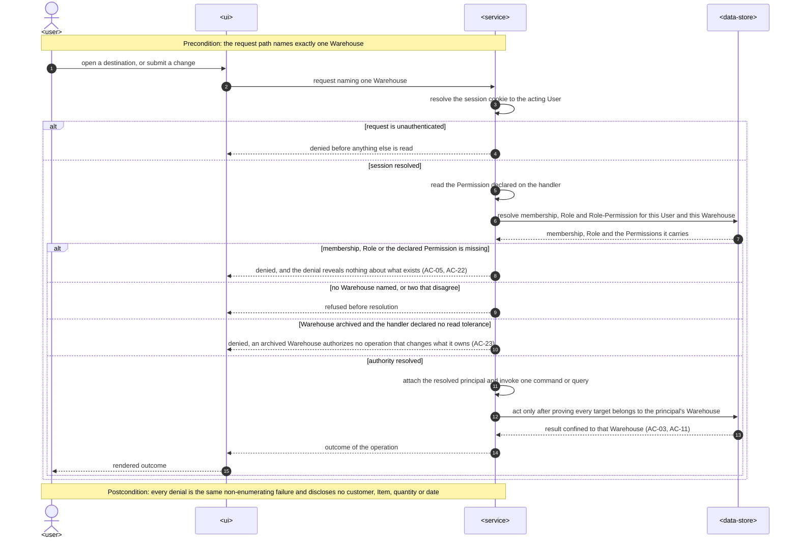

### 6.2 Maintain the Item catalogue

1. `<user>` submits a SKU, a description and a Unit of Measure. Authority resolves through §6.1 under
   `ITEMS:CREATE`.
2. `<service>` validates the values and asks `<data-store>` for an Item with that SKU **in this
   Warehouse**.
3. When one exists, `<service>` refuses and names the Item already holding the SKU (AC-07). The same
   SKU in another Warehouse is not consulted and is not an obstacle (AC-07a).
4. Otherwise `<service>` persists the Item as active with nothing on hand. _Persists: item row keyed
   by (warehouse, SKU); informs the per-Warehouse SKU uniqueness constraint._
5. Correcting an Item (`ITEMS:UPDATE`) re-reads whether any Customer Order or Purchase Draft Line
   names it in one query. Description and Unit of Measure are always correctable (AC-06b); the SKU is
   correctable only while nothing names the Item, and is otherwise refused with the reason (AC-06c).
6. Deactivating (`ITEMS:DEACTIVATE`) flips the Item to inactive. Records already naming it keep
   naming it and keep counting; the SKU stays taken; reactivation is the same operation inverted
   (AC-06d). _Persists: item activation state._

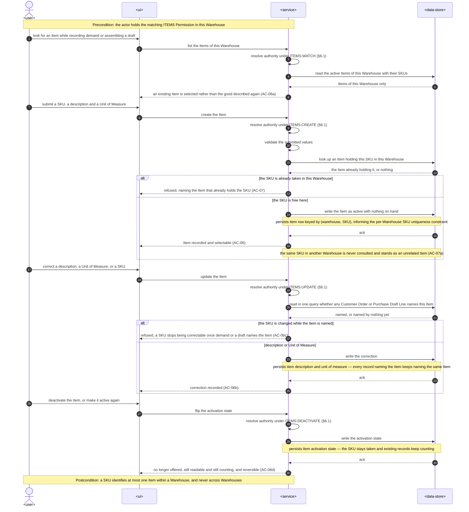

### 6.3 Adjust On-hand Quantity

1. `<user>` submits a counted figure and a reason. Authority resolves through §6.1 under
   `ITEM_STOCK:ADJUST`.
2. `<service>` refuses a negative or non-whole figure (AC-09) and refuses a missing reason (AC-09a),
   changing nothing.
3. Inside one transaction `<service>` writes the Item's new On-hand Quantity **and** an adjustment row
   carrying the count, the reason, the acting member and the time. _Persists: item on-hand figure and
   one immutable adjustment row; the pair is atomic._
4. The next consolidated-demand read shows the new figure beside that Item (AC-08). Nothing else in
   the release writes the figure, Arrival Confirmation included (AC-18a).

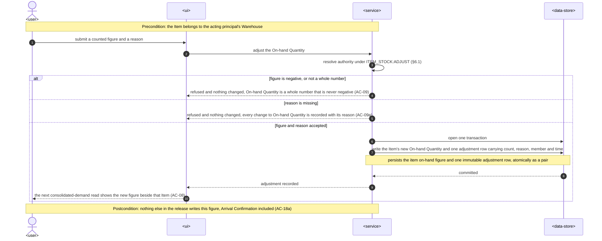

### 6.4 Record a Customer Order

1. `<user>` submits a customer name, an Item of this Warehouse, a quantity and a needed-by date.
   Authority resolves through §6.1 under `CUSTOMER_ORDERS:CREATE`.
2. `<service>` refuses a zero, negative or non-whole quantity and an empty customer name, naming the
   value it will not accept (AC-02); it refuses a needed-by date already past (AC-02a).
3. `<service>` resolves the named Item **within the principal's Warehouse**. An Item of another
   Warehouse resolves to nothing and produces the same refusal as a missing one, disclosing nothing
   about where it exists (AC-03).
4. `<service>` persists the Customer Order as Unfulfilled with Outstanding Quantity equal to the
   quantity recorded, plus the acting member and the time. _Persists: customer order row scoped to the
   Warehouse and the Item; informs the (warehouse, state, item) index the demand read needs._

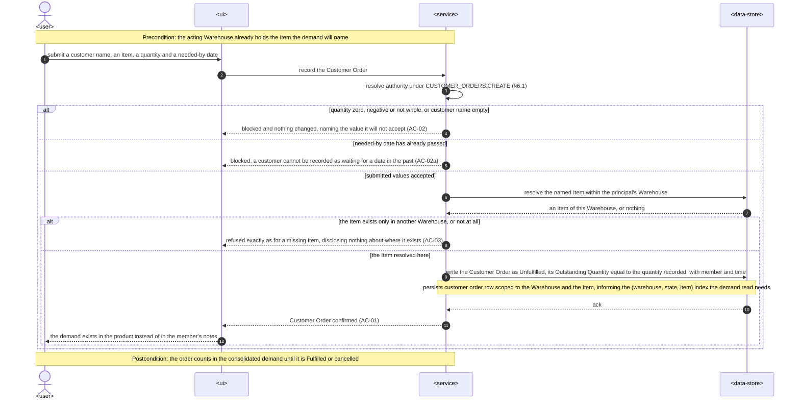

### 6.5 Read the consolidated demand

1. Authority resolves through §6.1 under `CUSTOMER_ORDERS:WATCH`, which tolerates an archived
   Warehouse.
2. `<service>` issues **one** query that, for the Warehouse, groups Unfulfilled Customer Orders by
   Item into total Outstanding Quantity and earliest needed-by date, attaches each Item's current
   On-hand Quantity, and attaches Coverage — which Purchase Drafts link to that demand and for what
   stated quantity — counting only drafts that are neither Closed nor Discarded (AC-04, AC-20,
   AC-21a).
3. The two one-to-many aggregations (Customer Orders per Item, links per Customer Order) are combined
   without fan-out, so neither total is multiplied by the other's row count. _Read shape: informs the
   index design and the aggregation strategy `data-model` owns._
4. Fulfilled and cancelled Customer Orders are absent from every total (AC-04, AC-17a).
5. `<service>` returns the Demand Lines whole; nothing is paged at the `spec.md` §1 scale.

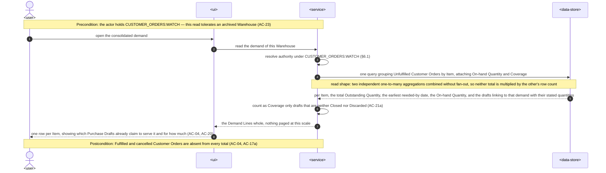

### 6.6 Assemble and revise a Purchase Draft

1. `<user>` creates a draft with lines, per-line links stating how much of the line is intended for a
   customer, and optionally an Expected Arrival Date. Authority resolves through §6.1 under
   `PURCHASE_DRAFTS:CREATE`.
2. `<service>` proves every named Item and every linked Customer Order belongs to the principal's
   Warehouse and refuses otherwise, naming the same-Warehouse rule (AC-11).
3. `<service>` persists the draft in the `draft` state with its lines and links, plus the acting
   member and the time. _Persists: draft, line and link rows, each carrying the Warehouse._
4. Subsequent revisions (`PURCHASE_DRAFTS:UPDATE`) add or remove a line, change an Item or quantity,
   add, re-quantify or remove a link, and set a Packaging Type from the catalogue and a Value-adding
   Note. Each write resolves the draft **only in the `draft` state**; the draft stays in it (AC-10a,
   AC-12).
5. A Packaging Type outside the catalogue is refused with the catalogue listed (AC-13).
6. Two links to one Customer Order, and links whose quantities do not add to the line quantity, are
   both recorded unchanged, because a link claims nothing (AC-11a).

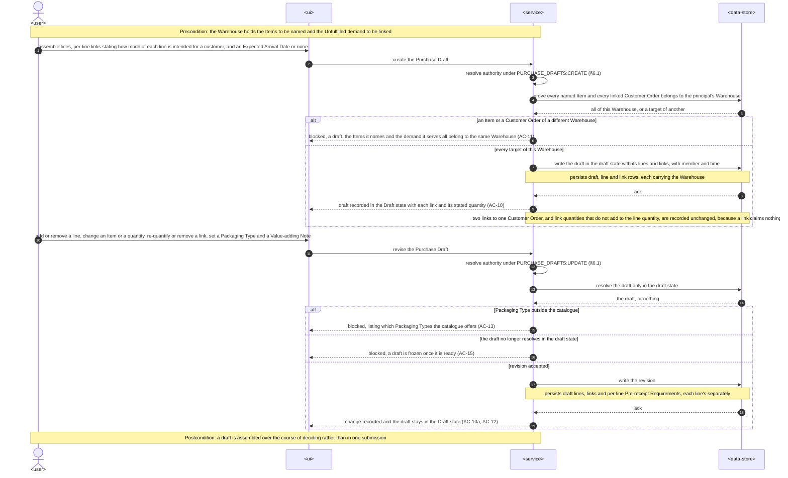

### 6.7 Move a Purchase Draft to Ready for Ordering

1. Authority resolves through §6.1 under `PURCHASE_DRAFTS:READY`.
2. Inside one transaction `<service>` resolves the draft **only in the `draft` state** and refuses
   when it holds no line (AC-14a).
3. `<service>` reads the quantity, needed-by date and state of every Customer Order the draft's lines
   link to, and writes one Demand Snapshot row per link. _Persists: snapshot rows belonging to the
   draft._
4. `<service>` moves the draft to Ready for Ordering with the acting member and the time. The
   transition is conditional on the prior state, so the second of two concurrent attempts affects no
   row and is refused rather than merged (§8). _Persists: draft state, frozen-at member and time._
5. From this point the assembly write paths resolve nothing: a change to lines, quantities, links,
   Expected Arrival Date or Pre-receipt Requirements is refused with the reason and the two operations
   still possible (AC-15).

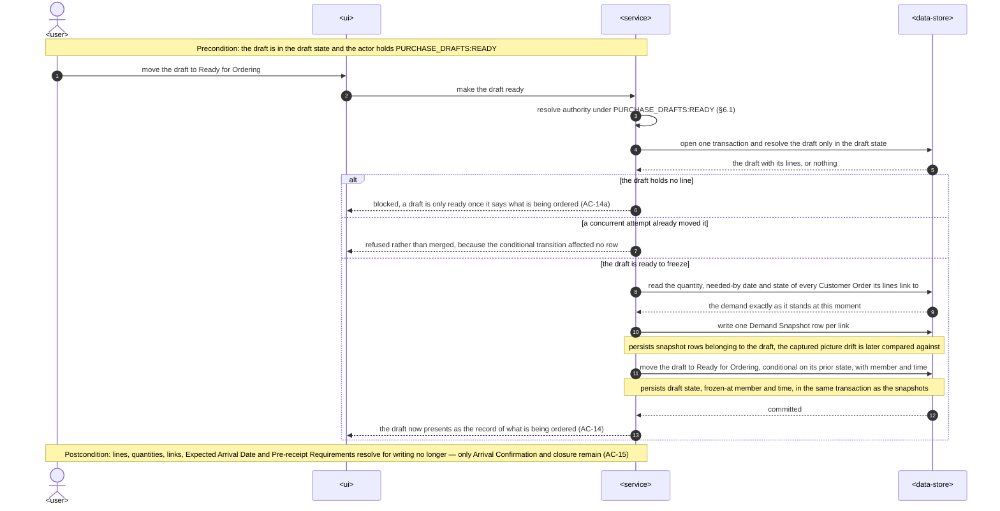

### 6.8 Read Purchase Drafts and their Drift Signals

1. Authority resolves through §6.1 under `PURCHASE_DRAFTS:WATCH`, which tolerates an archived
   Warehouse.
2. For the list, `<service>` returns each draft with its state and whether any of its snapshot rows
   differs in value from the Customer Order it names now, so drafts carrying a Drift Signal are
   distinguishable from those still matching their demand (AC-16a).
3. For one draft, `<service>` returns the frozen contents plus, per link, what differs — cancelled,
   quantity changed, date moved, or become Fulfilled through another draft's arrival — always as a
   comparison against the snapshot, never a touch log, so a value put back as it was reports nothing
   (AC-16).
4. No step of this flow writes anything to the draft.

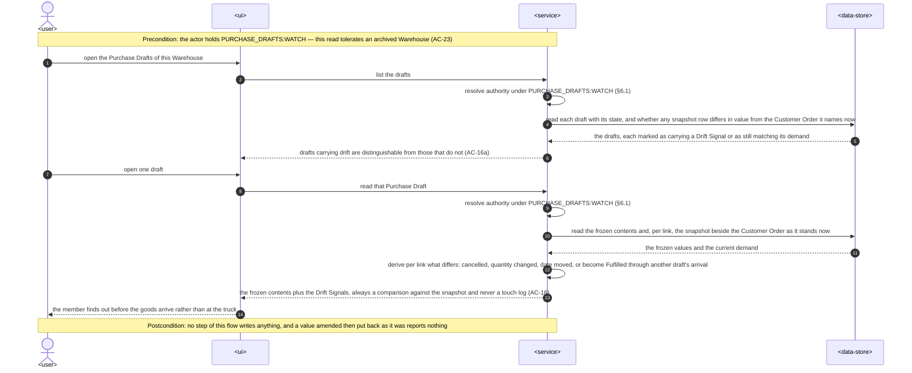

### 6.9 Confirm an arrival and allocate what arrived

1. Authority resolves through §6.1 under `PURCHASE_DRAFTS:RECEIVE`.
2. `<service>` opens one transaction and locks the draft row, its lines, and then the linked Customer
   Orders in ascending identifier order, in that fixed order (§8).
3. `<service>` refuses when the draft is not in Ready for Ordering, so a second confirmation of one
   draft cannot occur (AC-17b, §8).
4. `<service>` records the quantity that actually arrived for each line, whether it falls short of or
   exceeds the quantity ordered, and whether it is nothing at all (AC-17, `CONTEXT.md` §Invariants).
5. `<service>` hands the per-line assignments to the demand side, which re-checks against the values
   just locked that no line's assignments exceed its received quantity, that no Customer Order is
   assigned more than it is still waiting for, and that no assignment names a cancelled or Fulfilled
   order. Any failure refuses the whole confirmation, records nothing of it, and names each failing
   bound (AC-18).
6. `<service>` writes the Allocations, reduces each assigned Customer Order's Outstanding Quantity and
   marks as Fulfilled any that reaches nothing (AC-17a). A line whose linked demand has all gone
   records its received quantity and no Allocation (AC-17b).
7. `<service>` moves the draft to Closed and commits. Every write in steps 4–7 lands together or not
   at all (`spec.md` §6 "Arrival atomicity"). _Persists: line received quantities, allocation rows,
   customer order outstanding quantity and state, draft state — one transaction._
8. No Item's On-hand Quantity changes (AC-18a).

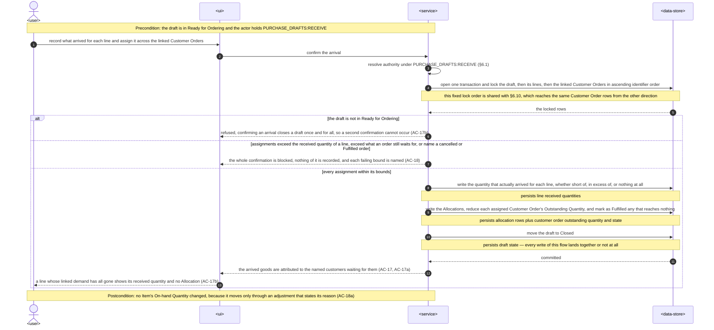

### 6.10 Amend or cancel a Customer Order

1. Authority resolves through §6.1 under `CUSTOMER_ORDERS:UPDATE` or `CUSTOMER_ORDERS:CANCEL`.
2. For an amendment, `<service>` locks the Customer Order and reads the total already allocated to it
   in the same transaction, refusing a quantity below that total and leaving the order untouched
   (AC-19b). A needed-by date already past is refused (AC-19).
3. `<service>` writes the change with the acting member and the time, recomputes Outstanding Quantity,
   and returns a raised Fulfilled order to Unfulfilled so it re-enters the consolidated demand
   (AC-19). _Persists: customer order quantity, needed-by date, outstanding quantity, state._
4. For a cancellation, `<service>` records the reason, the acting member and the time, and removes the
   order from the consolidated demand (AC-19a).
5. Neither operation writes anything to any linked frozen draft. The next read of that draft compares
   its snapshot against the new values and reports the Drift Signal (§6.8, AC-16, AC-19a).

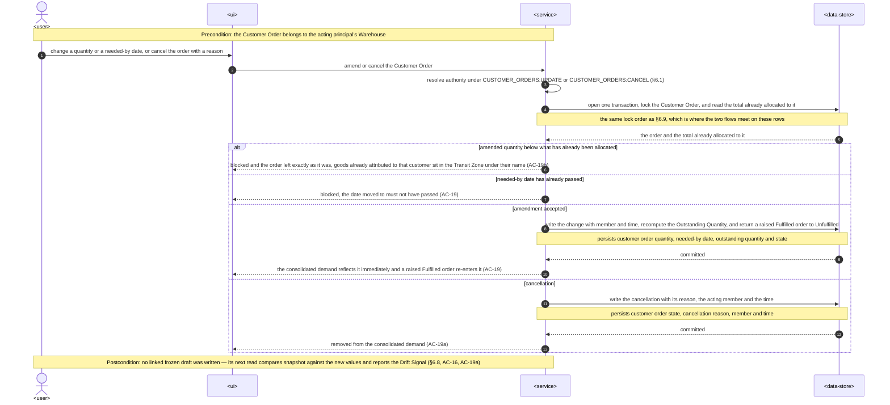

### 6.11 Close a frozen draft, or discard one that was never made ready

1. Authority resolves through §6.1 under `PURCHASE_DRAFTS:CLOSE` or `PURCHASE_DRAFTS:DISCARD`.
2. Closing resolves the draft **only in Ready for Ordering**, records the closure reason, the acting
   member and the time, and moves it to Closed. Frozen contents stay readable; no linked Customer
   Order's Outstanding Quantity changes (AC-21). _Persists: draft state, closure reason, member,
   time._
3. Discarding resolves the draft **only in the `draft` state** and refuses a draft that has been made
   ready, with the reason (AC-24a). It records the discard with the acting member and the time and
   leaves every linked Customer Order exactly as it was (AC-24).
4. From either terminal state the draft presents as Coverage no longer, so the demand it once claimed
   reads as covered by no draft (AC-21a, AC-24).

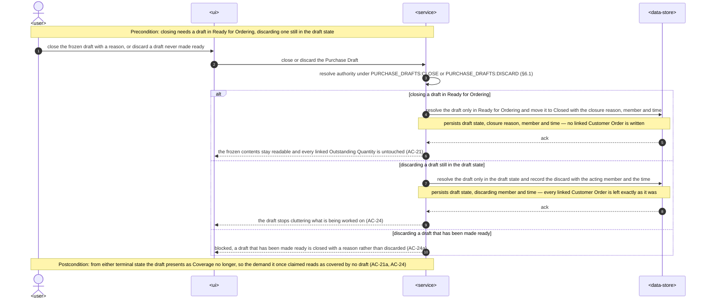

### 6.12 Operate the three destinations in the web application

1. `<user>` opens a Warehouse. The shell renders only the nav entries whose watch Permission the actor
   holds in that Warehouse; the others are absent, not disabled.
2. Choosing a destination runs its route loader, which gates each dispatch on that destination's watch
   Permission and awaits the data the destination paints, so the page mounts with its dataset present
   and no component declares a waiting state of its own.
3. `<ui>` derives every mutating control from the current capability projection **and** handles a
   server denial independently, because the server re-checks at the moment the change is recorded
   rather than when the member composed it (§8).
4. A committed mutation invalidates the tags of every affected view — demand, drafts and Items are
   connected, so an Arrival Confirmation refreshes the demand and an amendment refreshes the drafts'
   Drift Signals on the next read (`spec.md` §6 "Demand-derivation freshness").
5. Warehouse-scoped cache entries are keyed by Warehouse, so switching Warehouses refetches rather
   than reusing another Warehouse's data.
6. An archived Warehouse renders its watch destinations exactly as before with mutating controls
   visible-and-disabled and their reason exposed (AC-23).

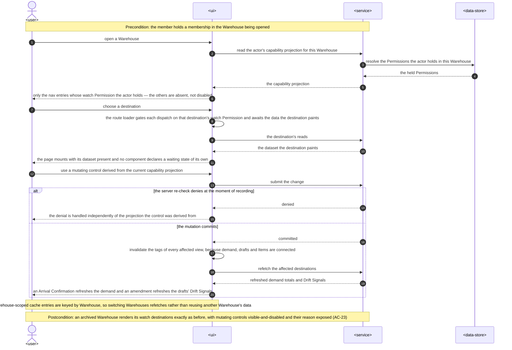

### Flags raised while drawing these flows

- §6.5 combines two independent one-to-many aggregations. Expressed naively as one `GROUP BY` over
  both joins it multiplies both totals. `data-model` owns the non-fan-out shape and the indexes
  behind it; a correctness test for it belongs in the integration tier, not only a performance one.
- §6.9 and §6.10 touch the same Customer Order rows from two directions, which is where a deadlock
  would appear. §8 fixes one lock order for both; `data-model` owns the lock statements.
- §6.7 and §6.9 are both conditional-on-state transitions of one row. They are the same mechanism and
  should be implemented once, not twice.

## 7. Data and interface impact

### Data

- **New durable concepts.** Item (Warehouse-scoped, SKU, description, Unit of Measure, activation
  state, current On-hand Quantity); Item stock adjustment (counted figure, reason, acting member,
  time — append-only); Customer Order (Warehouse-scoped, customer name, Item, quantity, needed-by
  date, Outstanding Quantity, state, cancellation reason); Packaging Type catalogue (seeded, four
  rows); Purchase Draft (Warehouse-scoped, state, Expected Arrival Date, creation/freeze/close
  attribution, closure reason); Purchase Draft Line (Item, ordered quantity, Packaging Type,
  Value-adding Note, received quantity); Purchase Draft Line Link (line, Customer Order, stated
  quantity); Demand Snapshot entry (link, captured quantity, captured needed-by date, captured
  state); Arrival Allocation (line, Customer Order, assigned quantity, acting member, time).
- **No existing concept changes.** No shipped table, key or constraint is altered, and no existing
  migration is edited. Every new relation carries the Warehouse that owns it.
- **Constraints `data-model` must express or explicitly reject as inexpressible:** a SKU unique per
  Warehouse and never across Warehouses; an Item, Customer Order and Purchase Draft each belonging to
  exactly one Warehouse; a Customer Order and a Purchase Draft Line naming an Item of their own
  Warehouse; a link joining a line and a Customer Order of one Warehouse (a composite reference
  through the Warehouse column is the candidate shape); every demanded and ordered quantity a
  positive whole number; every received, allocated, Outstanding and On-hand quantity a whole number
  that is never negative; an Allocation naming a Customer Order its line is actually linked to; at
  most one Demand Snapshot row per link; and Packaging Type referential integrity.
- **Deliberately _not_ constraints.** A link's stated quantity is never reconciled with the line
  quantity, the Customer Order quantity or any other link (AC-11a) — a database constraint here would
  contradict the specification. "Outstanding Quantity ≥ 0" is an invariant of the amendment rule
  (AC-19b) rather than a floor applied at write time; it must never be silently clamped.
- **Not expressible as a row constraint:** "a frozen draft never changes" and "Arrival Confirmation
  happens at most once" are state-guarded transitions inside the owning command (§4, §6.7, §6.9).
  `data-model` owns the lock and conditional-update shape; an architecture check plus integration
  tests are the evidence (§10).
- **Migrations are forward-only and assume no pre-existing rows**, which is true by construction:
  none of these relations exists. Existing migrations are not edited; the local rollback-and-replay
  procedure in `apps/server/migrations/README.md` is how a developer rebuilds a schema.
- **Index design `data-model` owns**, driven by §6: the demand aggregation (Warehouse + state + Item
  on Customer Orders), the coverage aggregation (link by Customer Order, link by line, draft by state),
  the drift comparison (snapshot by draft, Customer Order by identifier), the per-Warehouse SKU lookup
  and Item listing, the draft list by Warehouse and state, and the locked reads in §6.9 and §6.10.
- **The Stock question (`spec.md` §8, second).** The adjustment history is append-only and carries the
  count, reason, member and time precisely so the stated default — each figure converted into one
  opening Movement — is implementable by a later release without inventing provenance. This design
  asserts nothing about which of the two answers is taken.

### HTTP and shared contracts

The `api` stage owns exact paths, methods and status codes. The shape decisions this design fixes:

| Subject              | Route shape (prefix `api/v1/warehouses/{warehouseId}`) | Permission                | Class    |
| -------------------- | ------------------------------------------------------ | ------------------------- | -------- |
| Items                | `GET /items`                                           | `ITEMS:WATCH`             | read     |
| Item                 | `POST /items`, `PATCH /items/{itemId}`                 | `ITEMS:CREATE`, `:UPDATE` | mutating |
| Item activation      | `POST`/`DELETE /items/{itemId}/deactivation`           | `ITEMS:DEACTIVATE`        | mutating |
| On-hand adjustment   | `POST /items/{itemId}/on-hand-adjustments`             | `ITEM_STOCK:ADJUST`       | mutating |
| Consolidated demand  | `GET /demand`                                          | `CUSTOMER_ORDERS:WATCH`   | read     |
| Customer Orders      | `GET /customer-orders`                                 | `CUSTOMER_ORDERS:WATCH`   | read     |
| Customer Order       | `POST /customer-orders`, `PATCH /customer-orders/{id}` | `:CREATE`, `:UPDATE`      | mutating |
| Cancellation         | `POST /customer-orders/{id}/cancellation`              | `CUSTOMER_ORDERS:CANCEL`  | mutating |
| Packaging Types      | `GET /packaging-types`                                 | `PURCHASE_DRAFTS:WATCH`   | read     |
| Purchase Drafts      | `GET /purchase-drafts`, `GET /purchase-drafts/{id}`    | `PURCHASE_DRAFTS:WATCH`   | read     |
| Draft assembly       | `POST /purchase-drafts`, `PATCH` on draft/line/link    | `:CREATE`, `:UPDATE`      | mutating |
| Freeze               | `POST /purchase-drafts/{id}/readiness`                 | `PURCHASE_DRAFTS:READY`   | mutating |
| Arrival Confirmation | `POST /purchase-drafts/{id}/arrival`                   | `PURCHASE_DRAFTS:RECEIVE` | mutating |
| Closure              | `POST /purchase-drafts/{id}/closure`                   | `PURCHASE_DRAFTS:CLOSE`   | mutating |
| Discard              | `DELETE /purchase-drafts/{id}`                         | `PURCHASE_DRAFTS:DISCARD` | mutating |

- Every route names its Warehouse in the path, because that is the only way `WarehouseAccessGuard`
  resolves authority ([workspaces ADR 0001](../workspaces/adr/0001-two-level-request-authorization.md)).
- The Packaging Type catalogue is served at `/packaging-types` rather than under `/purchase-drafts/`
  so no literal segment competes with a `{draftId}` parameter; `tests/refactor/route-table.spec.mjs`
  asserts that no method-and-path pair is served twice.
- Freeze, arrival, closure and discard are **transitions addressed as their own sub-resources**, not
  a `state` field on a general draft `PATCH`. A general state field would put the frozen-record rule
  behind a payload value; a distinct route lets each transition declare its own Permission, which
  AC-22 requires.
- The contract must cover: Item reads including on-hand and its latest reason; Item create/correct/
  activation; the on-hand adjustment; the consolidated demand projection (Demand Line with total
  Outstanding Quantity, earliest needed-by date, On-hand Quantity, Coverage references and quantities);
  Customer Order reads and lifecycle; the Packaging Type catalogue; the draft list with per-draft
  drift presence and state; one draft with lines, links, Pre-receipt Requirements, per-link drift
  detail, received quantities and Allocations; every transition payload; and stable failure codes for
  validation, authorization, an unavailable or cross-Warehouse target, a taken SKU, a fixed SKU, a
  past needed-by date, a quantity below what is allocated, an unknown Packaging Type, a frozen draft,
  an empty draft, a discard after ready, a second confirmation, a failing assignment bound, a
  concurrent transition and the rate limit.
- List responses are returned whole and deterministically ordered at the `spec.md` §1 scale. No
  endpoint accepts a Demand Line, a Coverage figure or a Drift Signal as input.
- No queue, event, CLI, SDK or worker interface is introduced.

## 8. Cross-cutting concerns

### Security and privacy

- Authentication grants no authority. A valid session with no membership in the named Warehouse is
  denied every capability here, reads included.
- All sixteen Permissions are Warehouse Permissions typed as `PermissionId`, so declaring a Workspace
  Permission on one of these handlers fails to compile
  ([workspaces ADR 0001](../workspaces/adr/0001-two-level-request-authorization.md)).
- Cross-Warehouse targets return the same non-enumerating failure as a missing target and never
  disclose existence (AC-03, AC-11). A denial names no customer, Item, quantity or date (AC-05).
- **First personal data.** A customer name is personal data for a sole trader or private buyer, and
  no customer record exists outside the Customer Orders naming it. It appears in no log line, no error
  detail and no denial payload; the global filter's existing rule against logging unrestricted request
  bodies covers the write paths and must be verified for the new ones.
- **Free text is text.** The Value-adding Note, the adjustment reason and the cancellation and closure
  reasons are stored as submitted and rendered as text, never as markup or a link. Each is confidential
  data of the same classification as the record carrying it.
- **Arrival is not a back door.** The confirmation write path resolves only received quantities,
  Allocations, the closure of the draft and its state; the frozen columns are not in any statement it
  issues. That is asserted by an integration test per frozen field, not only by review.
- **Rate limiting.** `spec.md` §6.1 requires 60 recorded changes per minute per member across
  recording demand, creating drafts and adjusting On-hand Quantity. `WriteRateLimitGuard` composes
  after the access guards, counts per acting member, and refuses beyond the limit without revealing
  anything about existing records. With one running instance this is exactly the stated limit; with N
  instances and per-instance counters the effective limit is N × 60. That gap is recorded in
  [ADR 0003](./adr/0003-per-member-write-rate-limit.md) and in §11 rather than glossed.
- **The security review `spec.md` §6.1 requires** must cover: a handler reachable without a
  `warehouseId`; a mutating handler that declared `@ArchivedTolerantRead()`; a new handler with no
  Permission metadata; a cross-Warehouse Item, Customer Order, draft, line or link reaching a command;
  identifier enumeration through any of the new reads; a frozen field reached through the arrival or
  closure payload; customer names in logs or error details; free text rendered as markup; and the
  rate limit under concurrent members.

### Authorization coverage

Every handler this feature adds falls into class 2 of the classification `workspaces` §8 established
— **Warehouse-Permission**: a `PermissionId` declared together with a `warehouseId` route parameter,
resolved by `WarehouseAccessGuard`. No handler here belongs to the infrastructure-exempt,
session-only or self-projection classes, and none is an archived-tolerant **mutation**, so the narrow
class admitted by
[workspaces ADR 0003](../workspaces/adr/0003-archived-tolerant-membership-edge-mutations.md) gains no
member. Each class-2 handler is additionally classified **read** (declares `@ArchivedTolerantRead()`)
or **mutating** (does not), per the table in §7. The existing architecture check extends over the new
controllers unchanged. Metadata coverage is not sufficient evidence on its own; §10 requires an
integration test per endpoint proving the denial.

### Consistency and concurrency

This resolves `spec.md` §8's fifth open question under its stated default.

- Every multi-step outcome is owned by one `@Transactional()` service composed of specialized
  repository operations that join the shared transaction context. Nothing opens its own transaction.
- **Bounds are re-checked against locked rows at the moment the change is recorded**, never against
  the values the member composed against. AC-18's three bounds and AC-19b's floor are evaluated after
  the relevant Customer Order rows are locked in the same transaction.
- **One lock order, everywhere:** the Purchase Draft row, then its lines, then the Customer Orders it
  touches in ascending identifier order. §6.9 and §6.10 both follow it, which is what keeps two
  members — one confirming an arrival, one amending an order it links to — from deadlocking.
- **State transitions are conditional updates, not read-then-write.** Freeze, arrival, closure and
  discard each resolve the draft only in the state they are legal from; an update affecting zero rows
  is a typed concurrency refusal rather than a silent no-op. The second of two competing transitions
  is refused rather than merged.
- Database constraints are the final arbiter under concurrency; expected conflicts map to stable
  application errors, and no layer catches, logs and rethrows. This is the pattern `workspaces`
  already applies for `ACCESS_CONCURRENT_CHANGE` and `WORKSPACE_CONCURRENT_CHANGE`, reused rather
  than re-decided.
- Derivation is read-time, so nothing needs reconciliation and no background job exists to write one.

### Performance and diagnostics

- The authorization stage is unchanged from `workspaces`: one indexed point lookup plus one bounded
  Permission read, independent of how many Items, Customer Orders or drafts the Warehouse holds
  (`spec.md` §6, 50 ms p95).
- The consolidated demand read is one query whose cost is bounded by the Unfulfilled Customer Orders
  and open drafts of one Warehouse, not by history: Fulfilled, cancelled, Closed and Discarded rows
  are excluded by the same predicates the indexes carry. That is what makes the 400 ms p95 target hold
  as the Warehouse accumulates closed drafts.
- Structured Pino timing through the existing `shared/logger/with-operation-timing.ts` measures each
  read and mutation against its §6 target. No telemetry is added.
- The load smoke test follows `apps/server/src/workspaces/workspaces-load-smoke.integration.spec.ts`
  and exercises at least 50 protected operations per second per instance for ten minutes.
- Every `spec.md` §7 KPI is an operator query against the deployment's own records, read on a stated
  cadence. Nothing is collected continuously and no metric is emitted.

### Web state, freshness and accessibility

- RTK Query tags connect demand, Customer Orders, Items, on-hand, drafts and Drift Signals, so a
  mutation on any one refreshes every affected view. Warehouse-scoped entries are keyed by Warehouse.
- Loading is the route's `pendingComponent`; error, empty and success stay with the narrowest
  component that can coordinate them, so a permitted actor whose read failed reaches an error state
  rather than an empty surface.
- The approved design's states are the contract: loading, both empty states, the absent-nav denial,
  the archived Warehouse, the frozen refusal, the Drift Signal and its amended-then-put-back case, the
  cross-Warehouse refusal, the fixed-SKU refusal, the not-offered inactive Item, the stopped-covering
  closed draft, the refused assignment and the success toasts.
- Accessibility follows [`design-handoff.md`](./design-handoff.md) § Accessibility in full: state is
  never colour alone, frozen fields expose disabled state **and** the reason, the arrival modal's
  running assignment total is a live region, and dialogs restore focus.

### Naming

- The web module for the Demand destination is **`modules/customer-order`**, not `modules/demand`.
  A Demand Line is a derived view (`CONTEXT.md`), there is no Demand entity, and the module's
  mutations are all Customer Order lifecycle. [ADR 14-08](../../system/adr/14-08-2026-domain-owned-flat-modules.md)
  names a module for the entity whose invariants it enforces, and
  [ADR 18-08](../../system/adr/18-08-2026-scope-of-exercise-placement-tiebreak.md) states that a name
  addresses a domain rather than a screen. `design-handoff.md` § Implementation constraints writes
  `modules/demand/` while explicitly deferring placement to this section; the destination, its
  sidebar label and its user-visible copy stay **Demand** either way. §11 carries this for the
  Frontend Lead to confirm.
- The i18n namespaces follow the modules: `customer-order.json`, `purchase-draft.json`, `item.json`.
- Server modules are plural after the existing convention (`items`, `customer-orders`,
  `purchase-drafts`); web modules are singular after theirs (`item`, `customer-order`,
  `purchase-draft`). Neither convention is changed by this feature.

## 9. ADR index

| ADR                                                  | Decision                                                                                                                                                        | Status   |
| ---------------------------------------------------- | --------------------------------------------------------------------------------------------------------------------------------------------------------------- | -------- |
| [0001](./adr/0001-entity-owned-ordering-modules.md)  | Three entity-owned modules per side rather than one `ordering` module; cross-entity reads go through specialized shared repositories                            | Accepted |
| [0002](./adr/0002-arrival-confirmation-ownership.md) | Arrival Confirmation owned by `purchase-drafts`, applying demand effects through an allocation service `customer-orders` exports, in one propagated transaction | Accepted |
| [0003](./adr/0003-per-member-write-rate-limit.md)    | The `spec.md` §6.1 write rate limit as a shared NestJS guard with a per-instance in-memory counter, with the multi-instance gap recorded                        | Accepted |

Inherited system decisions — flat domain-owned module placement, two-level request authorization and
the shared guards, PostgreSQL/TypeORM persistence and reviewed migrations, Zod contracts, typed
errors behind a global filter, structured logging without telemetry, RTK Query data flow, declarative
permission gates, generated mutation hooks in components, and the UI approval workflow — are not
re-decided here.

The remaining feature choices do not pass the
[blast-radius gate](../../../ai/skills/design/references/blast-radius.md) and are recorded
inline: derived-on-read Demand Lines, Coverage and Drift Signals (§4, fixed by `CONTEXT.md`
§Invariants); the Demand Snapshot as captured rows rather than a document (§4, §7 — one module and
one downstream stage); state-guarded conditional transitions and the single lock order (§8 — the
pattern `workspaces` already applies); transitions addressed as sub-resources rather than a `state`
field (§7); the Packaging Type catalogue as a seeded relation (§4, fixed by `CONTEXT.md`); and the
append-only adjustment history (§4, §7).

## 10. Verification strategy

| Level                  | Required evidence                                                                                                                                                                                                                                                                                                                                                                                                                   |
| ---------------------- | ----------------------------------------------------------------------------------------------------------------------------------------------------------------------------------------------------------------------------------------------------------------------------------------------------------------------------------------------------------------------------------------------------------------------------------- |
| Domain unit            | SKU format and correctability; whole/positive/non-negative quantity rules; the past needed-by date rule; Outstanding Quantity arithmetic and the Unfulfilled ↔ Fulfilled transitions; the amend-below-allocated floor; draft mutability, at-least-one-line, discard-after-ready and close-once predicates; Packaging Type catalogue membership.                                                                                     |
| Use-case unit          | Every command and query against controlled repository doubles: cross-Warehouse targets refused identically to missing ones; the AC-18 bounds; drift comparison including amended-then-put-back; Coverage excluding Closed and Discarded drafts; no On-hand change on arrival.                                                                                                                                                       |
| Guard unit             | Each new handler's metadata: exactly one `PermissionId`, a `warehouseId` route parameter, read tolerance on reads only. `WriteRateLimitGuard`: composition after the access guards, per-member counting, non-enumerating refusal, and window reset.                                                                                                                                                                                 |
| Repository integration | Per-Warehouse SKU uniqueness and the same SKU allowed in two Warehouses; the demand aggregation returning correct totals with **both** many Customer Orders per Item and many links per Customer Order (the fan-out case in §6); snapshot capture; conditional-update transitions affecting zero rows; the fixed lock order under concurrent sessions.                                                                              |
| Command integration    | Arrival Confirmation writing received quantities, Allocations, Outstanding Quantities and the Closed state together or not at all, including an injected failure mid-way; two concurrent confirmations of one draft with exactly one succeeding; two concurrent freezes likewise; an amendment racing an assignment against the same order.                                                                                         |
| REST contract          | Every endpoint validates its shared schema and maps stable errors; every mutating endpoint is denied on an archived Warehouse and every read succeeds on one; every endpoint is denied without its Permission and permitted with it; no denial discloses existence; no frozen field is reachable through the arrival or closure payload.                                                                                            |
| Architecture           | Every new handler classified per §8; controllers call use cases only; `items`, `customer-orders` and `purchase-drafts` domain code imports no framework; no module imports another module's `domain/errors/`, predicates or DTOs; `customer-orders` does not import `purchase-drafts`; shared repositories import no feature module.                                                                                                |
| Web                    | Absent nav entries and unreachable destinations without a watch Permission; zero requests from a refused loader; per-Warehouse cache keying and refetch on switch; archived read-only rendering; tag invalidation across demand, drafts and Items; independent handling of server denial for every mutating control; translated copy with en/uk parity; focus, keyboard and live-region behaviour; the approved responsive layouts. |
| Performance/operations | Authorization, demand-read, item/draft-read and mutation p95 targets; the demand read measured at the `spec.md` §1 scale **with** accumulated Closed drafts; 50 ops/s smoke load for ten minutes; structured timing fields present; migrations applied and reverted against the development database.                                                                                                                               |

Trace every check to an `AC-*` in `spec.md` during `plan-tests`. Migrations are verified by applying
and reverting them against the real development database rather than by tests. The security review
required by `spec.md` §6.1 is a release gate; the UI approval gate is already satisfied by
[`design-handoff.md`](./design-handoff.md).

**Two repository-level gates this feature will trip and must reconcile in the same change:**
`tests/refactor/route-table.spec.mjs` compares the resolved HTTP route table against
`route-table.baseline.json`, so roughly twenty new routes require a deliberate, reviewed baseline
regeneration; and `tests/refactor/chunk-manifest.spec.mjs` freezes a chunk manifest that three new
web modules with loaders invalidate. Neither is optional and neither may be silenced. A third suite,
`tests/refactor/split-cases.spec.mjs`, is **already failing** on `master` for an unrelated stale path
and is not this feature's to fix.

## 11. Risks and open questions

| Risk or question                                                                                                                                                       | Treatment / owner                                                                                                                                                                                                                                        |
| ---------------------------------------------------------------------------------------------------------------------------------------------------------------------- | -------------------------------------------------------------------------------------------------------------------------------------------------------------------------------------------------------------------------------------------------------- |
| `spec.md` §8 (1st, due before `design`): may a Warehouse be archived while it holds frozen drafts whose goods were already ordered by phone? Unresolved.               | Design proceeds under the stated default — AC-23 as written, the accepted `workspaces` rule. Changing it is an amendment to `workspaces` AC-11 and must be raised as a change request there, not decided here. Tech Lead, before `tasks`.                |
| `spec.md` §8 (2nd, due before `design`): how On-hand Quantity is reconciled when the Stock Movement ledger lands. Unresolved.                                          | Design takes neither answer. The append-only adjustment history (§4, §7) makes the stated default implementable later without inventing provenance, and no code here assumes supersession. PM, before the Stock feature is specified.                    |
| `spec.md` §8 (5th, due before `design`): behaviour of the arrival, amendment and freeze seams under concurrency.                                                       | **Resolved in §8** under the stated default: bounds re-checked against locked rows, one fixed lock order, conditional-update transitions refusing the second of two competitors. Integration tests in §10 are the evidence. Tech Lead.                   |
| `spec.md` §8 (3rd, before `tasks`): is merging two Items in scope? (6th, before `data-model`): does a Customer Order need a customer identifier beyond the typed name? | Both take their stated defaults — merging out of scope, typed name only. The Item and Customer Order shapes in §7 assume nothing that would block either later. PM.                                                                                      |
| `design-handoff.md` § Open questions: the drift-count badge on the `Purchase drafts` nav entry is pinned by no acceptance criterion.                                   | It must read from the drafts projection the destination already fetches and must not become a second request. Either add a criterion to `spec.md` §5 or drop the badge before `tasks`. PM + Frontend Lead.                                               |
| `design-handoff.md` § Preview evidence: `previews/` is empty because the Pencil renderer channel was wedged.                                                           | The `.pen` frames and node IDs are the contract, so implementation is not blocked. Capture the ten PNGs before `implement`. Frontend Lead.                                                                                                               |
| §8 Naming: this document places the Demand destination in `modules/customer-order`, while `design-handoff.md` writes `modules/demand/` and defers placement here.      | Confirm at `tasks`. The user-visible destination, label and copy are **Demand** under either name, so the choice is a source-layout one with no visual consequence. Frontend Lead.                                                                       |
| The rate limit is per running instance, so N instances give an effective N × 60 (ADR 0003).                                                                            | Recorded rather than hidden, and revisited when Redis lands and a shared counter becomes available at no new infrastructure cost. Security Lead + Tech Lead.                                                                                             |
| Rate limiting is new cross-cutting infrastructure introduced by one feature (§2, proposed deviation).                                                                  | Promote it to `docs/system` with a system-level document the moment a second feature declares `@WriteRateLimited()`. Tech Lead.                                                                                                                          |
| The consolidated demand read combines two independent one-to-many aggregations and will double-count if written as one naive `GROUP BY` (§6 flags).                    | `data-model` owns the non-fan-out query shape; §10 requires a correctness test with many orders per Item **and** many links per order, not only a performance measurement. Backend Lead.                                                                 |
| §6.9 and §6.10 lock the same Customer Order rows from two directions.                                                                                                  | One fixed lock order in §8, exercised by a concurrent integration test. If a third write path appears it adopts the same order or the deadlock returns. Backend Lead.                                                                                    |
| Three server modules and three web modules land at once, which is a large surface for one release.                                                                     | ADR 0001 keeps the boundaries mechanical and the seams read-only except for one. `tasks` should order Items first, then Customer Orders and the demand read, then Purchase Drafts, so each layer lands against something that already exists. Tech Lead. |
| The demand read's 400 ms p95 is stated at the `spec.md` §1 scale, which the design meets without paging.                                                               | Outgrowing that scale is the explicit trigger to revisit `spec.md` §6 and introduce paging; `HeroUI/Pagination` is already on the design board. It is not a silent regression against this target. Tech Lead.                                            |
| Adding ~20 routes and three web modules trips two frozen repository baselines (§10).                                                                                   | Both baselines are regenerated deliberately as reviewed tasks in this change, never silenced. `split-cases.spec.mjs` is a pre-existing `master` failure and stays out of scope. Backend Lead + Frontend Lead.                                            |
| The repository still runs one REST bootstrap despite the documented two-runtime target.                                                                                | This feature adds no asynchronous work, no `handlers/` layer and no queue dependency, so it stays compatible with the later split. Tech Lead.                                                                                                            |
