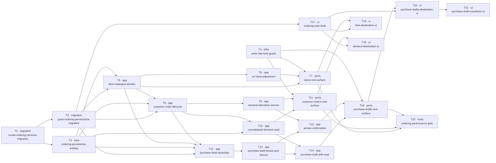

# Epic — ordering

> **Spec:** [spec.md](../spec.md) · **Design:** [sad.md](../sad.md) · **Data model:** [data-model.md](../data-model.md) · **API:** [openapi.yaml](../contracts/openapi.yaml) · **UI:** [design-handoff.md](../design-handoff.md) · **ADRs:** [adr/](../adr/)
>
> **Size:** XL · **Route:** `full` · **Surfaces:** `web-frontend`, `backend-service`

## Goal

Make end-customer demand answerable inside the product: recorded per customer, consolidated per Item
beside what the Transit Zone already holds, answered by a Purchase Draft a member assembles and
freezes when they phone the supplier, and closed when the goods arrive and are attributed back to the
named customers waiting for them ([spec §2](../spec.md)). Shipping this epic gives the Warehouse its
first business data and the first sixteen Permissions whose subject is business rather than access.

## Scope

- **In:** three server modules (`items`, `customer-orders`, `purchase-drafts`), nine shared
  persistence entities and ten specialized repositories, a `WriteRateLimitGuard`, three
  `packages/contracts` subpaths, sixteen `PermissionId` members and the feature's `ErrorCode`
  members, two forward-only migrations, and three route-owned web modules
  (`modules/item`, `modules/customer-order`, `modules/purchase-draft`) with their sidebar
  entries, loaders, dialogs, icons and locales.
- **Out:** everything [spec §3](../spec.md) and [sad §3 Out of scope](../sad.md) exclude — suppliers
  as records, pricing, purchase-order transmission, Stock Movements and balances, Locations,
  put-away, dispatch, reorder points, forecasting, verification that a Pre-receipt Requirement was
  met, cross-Warehouse demand consolidation, merging two Items, any asynchronous work, and paging.

## Task map

**Parallel branches.** T1 and T4 start together. Once T2 lands, the entire web lane (T17 → T18/T19/T20
→ T21) runs alongside the server lanes. Within the server, the Items lane (T5 → T6 → T7), the
Customer Orders lane (T8 → T9/T10 → T11) and the Purchase Drafts lane (T12 → T13 → T14/T15 → T16)
overlap as their dependencies clear — the ordering [sad §11](../sad.md) asks for: Items first, then
Customer Orders and the demand read, then Purchase Drafts, so each layer lands against something that
already exists.

**Serialized lanes** (`implement` derives these from overlapping `files_hint`, no schema change):

| Lane                      | Tasks         | Shared file                                              |
| ------------------------- | ------------- | -------------------------------------------------------- |
| Migration sequence        | T1, T2        | `layer: migration` is always serialized                  |
| Route table               | T7, T11, T16  | `tests/refactor/route-table.baseline.json`               |
| Chunk manifest            | T18, T19, T20 | `apps/web/src/test/baselines/module-chunk-manifest.json` |
| Items module              | T5, T6        | `apps/server/src/items/usecases/`                        |
| Customer Orders module    | T8, T9        | `apps/server/src/customer-orders/usecases/`              |
| Purchase Draft web module | T20, T21      | `apps/web/src/modules/purchase-draft/`                   |

## Tasks

See [tracker.md](./tracker.md) for status. Machine contract: [tasks.json](../tasks.json).

| #   | Task                                                                                                                                                                            | Layer       | Blocked by     | DoD (short)                                                                                                         |
| --- | ------------------------------------------------------------------------------------------------------------------------------------------------------------------------------- | ----------- | -------------- | ------------------------------------------------------------------------------------------------------------------- |
| T1  | [Stage the ordering schema migration: nine relations, their constraints and indexes, and the Packaging Type seed](./create-ordering-schema-migration.md)                        | `migration` | —              | The staged migration is promoted to apps/server/migrations, applies and reverts cleanly against the development…    |
| T2  | [Stage the Permission catalogue migration and add the feature's PermissionId and ErrorCode members](./grant-ordering-permissions-migration.md)                                  | `migration` | T1             | The staged migration is promoted, applies and reverts cleanly, inserts the sixteen Permissions and idempotently…    |
| T3  | [Add the nine shared persistence entities and register them on DomainModule](./ordering-persistence-entities.md)                                                                | `infra`     | T1             | All nine entities map to the migrated relations, each carries the warehouse_id its ownership rule needs and the…    |
| T4  | [Add WriteRateLimitGuard and the @WriteRateLimited() decorator to shared/guards](./write-rate-limit-guard.md)                                                                   | `infra`     | —              | Guard unit tests prove per-member per-minute counting, window reset, composition after SessionAuthGuard and…        |
| T5  | [Build the items domain and the Item catalogue: value objects, SKU rules, activation, repository and use cases](./item-catalogue-domain.md)                                     | `app`       | T2, T3         | Domain unit tests cover SKU format and correctability and the activation predicates; use-case unit tests against…   |
| T6  | [Build the On-hand Quantity adjustment: mandatory reason, current figure and append-only history in one transaction](./on-hand-adjustment.md)                                   | `app`       | T5             | An integration test proves the Item figure and its adjustment row are written together or not at all; unit tests…   |
| T7  | [Expose the items REST surface: contracts subpath, controllers, DTOs and module wiring](./items-rest-surface.md)                                                                | `ports`     | T5, T6, T4     | Every items endpoint in contracts/openapi.yaml validates its shared schema and maps stable errors; contract tests…  |
| T8  | [Build the customer-orders domain and lifecycle: record, amend and cancel under the locked allocated-total read](./customer-order-lifecycle.md)                                 | `app`       | T2, T3, T5     | Unit tests prove a zero, negative, fractional quantity, an empty customer name and a past needed-by date are each…  |
| T9  | [Build DemandAllocationService and its repository, exported for Arrival Confirmation](./demand-allocation-service.md)                                                           | `app`       | T8             | Unit tests prove each AC-18 bound refuses the whole confirmation; an integration test proves the bounds are…        |
| T10 | [Build ConsolidatedDemandRepository as one non-fan-out query and the demand queries over it](./consolidated-demand-read.md)                                                     | `app`       | T3, T8         | A repository integration test with many Customer Orders per Item and many links per Customer Order proves no…       |
| T11 | [Expose the customer-orders and demand REST surface: contracts subpath, controllers, DTOs and module wiring](./customer-orders-rest-surface.md)                                 | `ports`     | T10, T9, T4    | Every customer-orders and demand endpoint validates its shared schema and maps stable errors; contract tests prove… |
| T12 | [Build the purchase-drafts domain and draft assembly: lines, links, Pre-receipt Requirements and the state-guarded write path](./purchase-draft-assembly.md)                    | `app`       | T2, T3, T5, T8 | Integration tests prove every assembly write resolves the draft only in the draft state and affects zero rows…      |
| T13 | [Build the freeze with its Demand Snapshot capture, and closure and discard as guarded transitions](./purchase-draft-freeze-and-closure.md)                                     | `app`       | T12            | An integration test proves freezing captures one snapshot row per link with the quantity, needed-by date and state… |
| T14 | [Build PurchaseDraftReadRepository and the drift queries comparing the snapshot against current demand](./purchase-draft-drift-read.md)                                         | `app`       | T13, T10       | Integration tests prove a Drift Signal is reported for an amended, cancelled or newly Fulfilled linked Customer…    |
| T15 | [Build Arrival Confirmation: received quantities, delegated Allocations and the move to Closed in one transaction](./arrival-confirmation.md)                                   | `app`       | T13, T9        | An integration test with an injected mid-way failure proves received quantities, Allocations, Outstanding…          |
| T16 | [Expose the purchase-drafts REST surface: contracts subpath, transition sub-resources, controllers and module wiring](./purchase-drafts-rest-surface.md)                        | `ports`     | T14, T15, T4   | Every purchase-drafts endpoint validates its shared schema and maps stable errors; contract tests prove each…       |
| T17 | [Add the ordering web shell: three routes, router children, permission-gated sidebar entries, eight icons and three i18n namespaces](./ordering-web-shell.md)                   | `ui`        | T2             | Router tests prove the three children resolve before warehouseCatchAllRoute; sidebar tests prove each entry is…     |
| T18 | [Build the Items destination: table with on-hand and its reason, the create/correct/deactivate dialogs and the Item picker](./item-destination-ui.md)                           | `ui`        | T17, T7        | Component tests prove the on-hand cell renders the figure and its reason line, that a refused loader issues zero…   |
| T19 | [Build the Demand destination: consolidated table, expandable Customer Order sub-rows, record/amend/cancel and the Customer Order picker](./demand-destination-ui.md)           | `ui`        | T17, T11       | Component tests prove the six demand cells and the coverage chips render, that a Fulfilled or cancelled order…      |
| T20 | [Build the Purchase drafts destination: list and detail, the three tabs, line and link editing, the frozen treatment and the Drift Signal](./purchase-drafts-destination-ui.md) | `ui`        | T17, T16       | Component tests prove draft state renders through a total Record<State, ReactElement> lookup rather than a…         |
| T21 | [Build the Purchase draft transition dialogs: ready, close, discard and the 720px arrival modal](./purchase-draft-transitions-ui.md)                                            | `ui`        | T20            | Component tests prove the arrival modal's running assignment total is a live region, that a refused assignment…     |
| T22 | [Add the ordering load smoke and the structured timing assertions for the section 6 latency targets](./ordering-performance-gate.md)                                            | `tests`     | T7, T11, T16   | The smoke test sustains at least 50 protected operations per second per instance for ten minutes and asserts the…   |

## Risks / Hard rules

A task that breaks one of these violates [spec §6](../spec.md) or [sad §11](../sad.md) and must be
sent back rather than merged.

- **Frozen-record integrity.** Zero recorded changes to a draft's lines, ordered quantities, links,
  Expected Arrival Date or Pre-receipt Requirements after Ready for Ordering. Received quantities,
  Allocations, the closure reason and the move to Closed are the only permitted additions. Enforced
  by the shape of the write path (T12, T13), not by a check a command could forget.
- **Arrival atomicity.** One Arrival Confirmation records every received quantity, every Allocation
  and every resulting Outstanding Quantity together, or records none of them (T15).
- **Nothing derived is stored.** Demand Lines, Coverage and Drift Signals are computed on every read
  from the rows that exist at that moment. No materialization, no background repair job (T10, T14).
- **Permission is necessary, never sufficient.** Every command and query proves each Item, Customer
  Order, draft, line and link belongs to `principal.warehouseId`; a cross-Warehouse target fails
  identically to a missing one and discloses nothing (T5, T8, T12, and every `ports` task).
- **Authorization coverage is 100%.** Every user-accessible capability, reads included, declares an
  explicit Permission rule and a Warehouse ownership check. Reads declare
  `@ArchivedTolerantRead()`; no mutating handler does.
- **On-hand moves only through an adjustment with a reason.** Arrival Confirmation included (T6, T15).
- **A link claims nothing.** Link quantities are never reconciled with the line, the Customer Order
  or another link — in the schema, the server or the client (T12, T20).
- **Two frozen baselines are regenerated, never silenced.** `route-table.baseline.json` (T7, T11,
  T16) and `module-chunk-manifest.json` (T18, T19, T20). `tests/refactor/split-cases.spec.mjs` is
  a **pre-existing `master` failure** and is explicitly not this feature's to fix.
- **No telemetry.** Every [spec §7](../spec.md) KPI is an operator query against the deployment's own
  records. Structured timing logs are not telemetry and nothing is collected continuously.

## Decisions taken at this stage

- **Web module naming.** The Demand destination lives in `modules/customer-order`, per
  [sad §8 Naming](../sad.md), which `design-handoff.md` explicitly defers to. The user-visible
  destination, sidebar label and copy stay **Demand**. Closes the `sad.md` §11 item.
- **Drift-count nav badge: dropped.** It was pinned by no acceptance criterion
  ([sad §11](../sad.md)). US-08 is served by the Drift Signal on the drafts list (AC-16a) and the
  per-link detail (AC-16). Re-adding the badge requires a `spec.md` §5 criterion first.
- **Task count: 22, above the 12–20 band** the
  [size matrix](../../../../ai/skills/_shared/size-matrix.md) gives for L/XL. Atomicity is the
  binding constraint: this XL release lands three server modules, three web modules and ~26
  endpoints, and splitting further was preferred to tasks that could not be reviewed in one sitting.

## Still open, carried into implementation

- `previews/` is empty — the Pencil renderer channel was wedged during the design session. The
  `.pen` frames and node IDs are the contract, so implementation is not blocked; capture the ten
  PNGs before `implement` (Frontend Lead, [sad §11](../sad.md)).
- Warehouse archival while frozen drafts are outstanding stays as `workspaces` AC-11 has it
  (AC-23). Changing it is a change request against `workspaces`, not a decision here.
- How On-hand Quantity is reconciled when the Stock Movement ledger lands is untaken. The
  append-only adjustment history keeps both answers implementable (PM).
