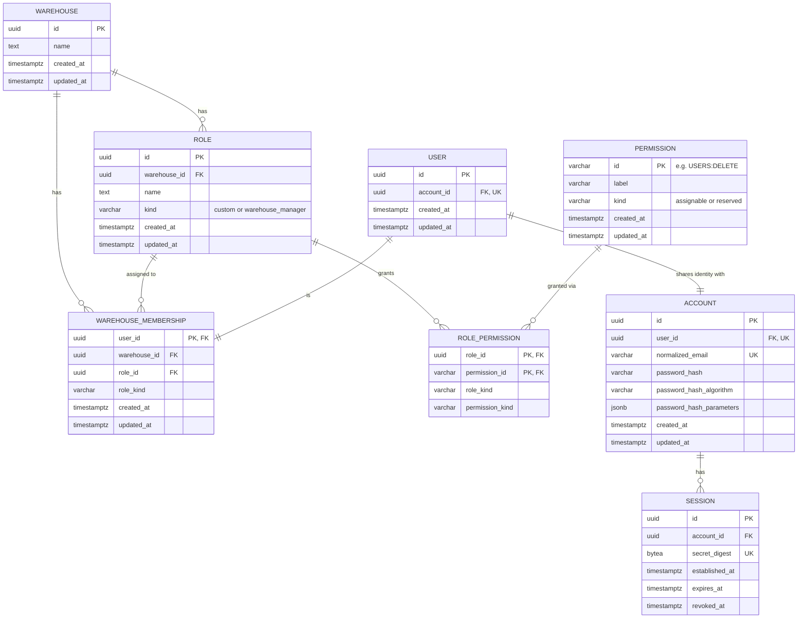

# Data model — users-management

## ER diagram

<!-- Every entity below already exists (`auth`/`access` schema). This feature adds no table, column,
or index — it reads and writes the existing shapes under new authorization rules, plus three new
`permissions` catalogue rows granted to every existing `warehouse_manager` Role. -->

`sad.md` §7 states, and this stage confirms: **no new entity concept is introduced.** `AccountEntity`,
`UserEntity`, `WarehouseMembershipEntity`, `SessionEntity`, `RoleEntity`, `RolePermissionEntity`, and
`PermissionEntity` (`apps/server/src/shared/domain/entities/*.ts`) are reused unchanged. The one
required schema-adjacent change is data, not structure: three new `permissions` catalogue rows,
granted to every existing `warehouse_manager` Role (AC-17) — see [Migrations](#migrations).

A single UUID identifies one member end-to-end: `AccountEntity.id === AccountEntity.userId ===
UserEntity.id === UserEntity.accountId` (enforced today by `chk_accounts_user_identity_pair` and
`chk_users_account_identity_pair`), and that same value is `WarehouseMembershipEntity.userId` and
`SessionEntity.accountId`. Every method below takes one `identityId`/`userId` string, not a pair.

## Entities

### `permissions` (reused; new catalogue rows only)

| Column       | Type         | Constraints                             | Notes                                                                                                        |
| ------------ | ------------ | --------------------------------------- | ------------------------------------------------------------------------------------------------------------ |
| `id`         | VARCHAR(64)  | PK, `chk_permissions_identifier` format | `USERS:EMAIL_UPDATE`, `USERS:PASSWORD_CHANGE`, `USERS:DELETE` (new); `USERS:CREATE` (already exists, reused) |
| `label`      | VARCHAR(100) | NOT NULL, non-empty                     | e.g. "Update user email"                                                                                     |
| `kind`       | VARCHAR(16)  | NOT NULL, `assignable` \| `reserved`    | all four are `assignable`                                                                                    |
| `created_at` | timestamptz  | NOT NULL DEFAULT now()                  |                                                                                                              |
| `updated_at` | timestamptz  | NOT NULL DEFAULT now()                  |                                                                                                              |

**Aggregate root:** root (catalogue).
**Access patterns:** none new — reuses `RoleLifecycleRepository`/`AccessCurrentUserRepository` reads.
**Constraints:** no schema change. Table, `uq_permissions_id_kind`, `chk_permissions_identifier`,
`chk_permissions_kind` are unchanged.

### `role_permissions` (reused; new grant rows only)

No column or constraint changes. The staged migration inserts one row per
(`warehouse_manager` Role × {`USERS:CREATE`, `USERS:EMAIL_UPDATE`, `USERS:PASSWORD_CHANGE`,
`USERS:DELETE`}) that does not already exist, satisfying AC-17 for every Warehouse that existed
before this feature ships. `chk_role_permissions_reserved_exclusive` is satisfied unconditionally
(`role_kind = 'warehouse_manager'`).

### `warehouse_memberships` (reused, unchanged)

Read (scoped, locked) and written (inserted on creation, deleted on removal) exactly as `access`'s
own commands already do. `roleKind` is always written as `'custom'` for a newly created member —
`AC-20` forbids assigning the reserved `warehouse_manager` kind through creation, so `users` never
writes that value.

### `accounts` / `users` (reused, unchanged)

Written by creation (insert, no `sessions` row — unlike registration), email change (update
`normalized_email`), password change (update `password_hash`/`password_hash_algorithm`/
`password_hash_parameters`), and deletion (hard delete). `uq_accounts_normalized_email` is the
existing global-uniqueness enforcement AC-05 relies on; `AuthenticationRepository
.findAccountByNormalizedEmail` (reused, unmodified) is the app-level pre-check.

### `sessions` (reused, unchanged — see deletion sequencing note below)

Password change revokes (soft: `revoked_at` set, row kept) every non-revoked Session for the
target's Account (AC-06). Deletion removes them (hard delete) — see
[Deletion sequencing](#deletion-sequencing-a-schema-constraint-the-sad-narrative-must-satisfy).
Email change touches no Session row (AC-04).

## Deletion sequencing: a schema constraint the SAD narrative must satisfy

`sad.md` §6.4 narrates deletion as "revoke every Session for the target's Account, delete the
Warehouse Membership row, delete the target's Account+User pair." Read literally, "revoke" (an
`UPDATE ... SET revoked_at = ...`, row retained) cannot be followed by deleting the `accounts` row:
`fk_sessions_account_id` (`sessions.account_id → accounts.id`) is `ON DELETE RESTRICT` and **not**
deferrable (`1753444800000-CreateAuthSchema.ts`), so it is checked immediately on the `DELETE FROM
accounts` statement itself — any surviving `sessions` row (revoked or not) for that account blocks
it. This is not a new constraint this feature adds; it already governs the schema today, and this is
the first feature to attempt an `accounts` delete against it.

**Resolution — no schema change.** `DeleteMemberCommand`'s persistence step must hard-delete the
target's `sessions` rows (not merely revoke them) before deleting `accounts`, in this order, inside
the one transaction the command already owns:

1. `DELETE FROM warehouse_memberships WHERE user_id = :identityId` — satisfies the immediate
   `fk_warehouse_memberships_user_id` (`RESTRICT`, not deferred) before `users` is deleted.
2. `DELETE FROM sessions WHERE account_id = :identityId` — satisfies the immediate
   `fk_sessions_account_id` (`RESTRICT`, not deferred) before `accounts` is deleted.
3. `DELETE FROM users WHERE id = :identityId` and `DELETE FROM accounts WHERE id = :identityId`, in
   either order — the circular `fk_accounts_user_id` / `fk_users_account_id` pair is
   `INITIALLY DEFERRED`, so it is only checked at `COMMIT`, by which point neither row exists and the
   constraint is trivially satisfied (the same deferred pairing that already lets registration insert
   both rows together).

This still satisfies AC-08's "ends any of the target's existing sessions": a deleted Session cannot
authenticate a request, which is a strictly stronger guarantee than revocation. It does **not**
change the meaning of "ends...sessions" for password-change (AC-06), where the `accounts` row
survives and revocation (not deletion) remains correct and reversible-in-spirit (a new password
still requires re-authentication). No FK, index, or table changes. Reused rows only.
`MemberLifecycleRepository`/`AuthenticationRepository` method signatures below reflect this order.

## Repository boundaries

Per [server architecture](../../system/server-architecture.md) and
[Creating a server repository](../../system/guides/creating-a-server-repository.md): no
`BaseRepository`, no repository interfaces, no feature-owned persistence adapters. Every method
below operates on shared persistence entities only and is injected into `users`' commands.

### `MemberLifecycleRepository` (new — `shared/domain/repositories/member-lifecycle.repository.ts`)

| Method                                                                                        | Operation                                                                                                                                                                                                                                                                                                          | Used by                                                            |
| --------------------------------------------------------------------------------------------- | ------------------------------------------------------------------------------------------------------------------------------------------------------------------------------------------------------------------------------------------------------------------------------------------------------------------ | ------------------------------------------------------------------ |
| `lockMembership(warehouseId, userId): Promise<WarehouseMembershipEntity \| null>`             | `SELECT ... FOR UPDATE` on `warehouse_memberships`, scoped by `warehouse_id`, same pessimistic-write pattern as `RoleLifecycleRepository.lockCustomRole`/`ManagerTransferRepository.lockMembers`. A missing row is indistinguishable from cross-Warehouse (AC-09) — same shape the guard/`access` already produce. | email-change, password-change, delete (target)                     |
| `findRoleGrantedPermissionIds(roleId): Promise<string[]>`                                     | `SELECT permission_id FROM role_permissions WHERE role_id = :roleId` — PK `(role_id, permission_id)` already indexes this.                                                                                                                                                                                         | AC-16 (selected Role vs. creator), AC-19 (target's Role vs. actor) |
| `insertMembership(input: { userId, warehouseId, roleId, roleKind: 'custom' }): Promise<void>` | `INSERT INTO warehouse_memberships` for the newly created identity. `roleKind` is always `'custom'` (AC-20).                                                                                                                                                                                                       | creation                                                           |
| `deleteMembership(warehouseId, userId): Promise<void>`                                        | `DELETE FROM warehouse_memberships WHERE warehouse_id = ... AND user_id = ...` — step 1 of [deletion sequencing](#deletion-sequencing-a-schema-constraint-the-sad-narrative-must-satisfy).                                                                                                                         | deletion                                                           |

Creation additionally reuses `RoleLifecycleRepository.lockCustomRole(warehouseId, roleId)` (already
exists) instead of a new lock method, matching `sad.md` §4's "for creation, the selected Role row
[is] locked before its current state is re-checked" — no new repository needed for that lock.

### `AuthenticationRepository` (extended — `shared/domain/repositories/authentication.repository.ts`)

| Method                                                                                                         | Operation                                                                                                                                                                                                                                                                                                                                                  | Used by         |
| -------------------------------------------------------------------------------------------------------------- | ---------------------------------------------------------------------------------------------------------------------------------------------------------------------------------------------------------------------------------------------------------------------------------------------------------------------------------------------------------- | --------------- |
| `createIdentity(input: { account: DeepPartial<AccountEntity>; user: DeepPartial<UserEntity> }): Promise<void>` | `INSERT` `accounts` + `users`, no `sessions` row — the same two inserts `createRegistration` performs, minus the session insert.                                                                                                                                                                                                                           | creation        |
| `updateEmail(accountId, normalizedEmail, updatedAt): Promise<boolean>`                                         | `UPDATE accounts SET normalized_email = ..., updated_at = ... WHERE id = :accountId`                                                                                                                                                                                                                                                                       | email-change    |
| `updateCredential(accountId, credential: { hash, algorithm, parameters }, updatedAt): Promise<boolean>`        | `UPDATE accounts SET password_hash = ..., password_hash_algorithm = ..., password_hash_parameters = ..., updated_at = ... WHERE id = :accountId`                                                                                                                                                                                                           | password-change |
| `revokeSessionsByAccountId(accountId, at): Promise<number>`                                                    | `UPDATE sessions SET revoked_at = :at WHERE account_id = :accountId AND revoked_at IS NULL` — bulk sibling of the existing single-digest `revokeSessionByDigest`; served by the existing `idx_sessions_account_id`. Returns the affected count so the repository integration test can assert only the target account's Sessions moved (`sad.md` §11 risk). | password-change |
| `deleteSessionsByAccountId(accountId): Promise<void>`                                                          | `DELETE FROM sessions WHERE account_id = :accountId` — step 2 of [deletion sequencing](#deletion-sequencing-a-schema-constraint-the-sad-narrative-must-satisfy); served by `idx_sessions_account_id`.                                                                                                                                                      | deletion        |
| `deleteIdentity(identityId): Promise<void>`                                                                    | `DELETE FROM users WHERE id = :identityId` then `DELETE FROM accounts WHERE id = :identityId` (order immaterial — deferred FK pair) — step 3 of deletion sequencing.                                                                                                                                                                                       | deletion        |

`findAccountByNormalizedEmail` (existing) is reused unmodified for the AC-05 global-uniqueness
pre-check on both creation and email-change.

### Reused, unmodified

- `RoleLifecycleRepository.findMemberRole` / `.findCustomRole` / `.lockCustomRole` — target
  membership lookup and custom-Role validation/locking (`access`-authored, already shared).
- `AccessCurrentUserRepository.resolveCurrentAccess` — the actor's full Permission-ID set for the
  AC-16/AC-19 superset comparisons.

## Indexes

No new index is introduced. Every operation this feature performs is served by an index that
already exists:

| Index                                      | Columns                  | Query it serves                                                          |
| ------------------------------------------ | ------------------------ | ------------------------------------------------------------------------ |
| `warehouse_memberships` PK                 | `user_id`                | target lookup/lock by identity (email-change, password-change, delete)   |
| `idx_warehouse_memberships_warehouse_user` | `warehouse_id, user_id`  | `lockMembership` scoped-by-Warehouse read (AC-09 hiding)                 |
| `role_permissions` PK                      | `role_id, permission_id` | `findRoleGrantedPermissionIds` (AC-16, AC-19)                            |
| `uq_accounts_normalized_email`             | `normalized_email`       | `findAccountByNormalizedEmail` (AC-05, create + email-change)            |
| `accounts` PK                              | `id`                     | `updateEmail`, `updateCredential`, `deleteIdentity`                      |
| `idx_sessions_account_id`                  | `account_id`             | `revokeSessionsByAccountId` (AC-06), `deleteSessionsByAccountId` (AC-08) |
| `uq_roles_id_kind` / `roles` PK            | `id`, `id, kind`         | `lockCustomRole` (creation, AC-16/AC-20)                                 |

## Migrations

One staged, reversible migration —
[`migrations/01-grant-users-management-permissions.ts`](./migrations/01-grant-users-management-permissions.ts)
— owns AC-17. It:

1. Inserts three `permissions` rows: `USERS:EMAIL_UPDATE`, `USERS:PASSWORD_CHANGE`, `USERS:DELETE`
   (all `kind = 'assignable'`), matching the existing `chk_permissions_identifier`/`chk_permissions_kind`
   shape `1785859200000-CreateAccessSchema.ts` established.
2. Grants `USERS:CREATE`, `USERS:EMAIL_UPDATE`, `USERS:PASSWORD_CHANGE`, `USERS:DELETE` to every
   `role` row whose `kind = 'warehouse_manager'`, idempotently (`INSERT ... SELECT ... WHERE NOT
EXISTS`), so it is safe to include the already-granted `USERS:CREATE` for defensive completeness
   without double-inserting.
3. On `down`, deletes only the `role_permissions` rows for the three **new** permission IDs, then
   the three new `permissions` rows — `USERS:CREATE`'s pre-existing grants are never touched by
   `down`, since this migration is not what created them.

No table, column, or index migration is needed — confirmed by the analysis above. Expand/backfill/
contract sequencing does not apply: this is a pure additive catalogue insert plus idempotent grant
rows, with no non-null column added to an existing table and no destructive change.

## Non-schema follow-ups (not this stage's deliverable, flagged for `tasks`)

- `packages/shared-types/src/enums/permission-id.ts` needs `USERS_EMAIL_UPDATE`,
  `USERS_PASSWORD_CHANGE`, `USERS_DELETE` added to the `PermissionId` const, matching the three new
  catalogue IDs exactly (string literal parity is load-bearing — the migration and the enum must
  agree byte-for-byte).
- `access/usecases/commands/provision-initial-access.command.ts`'s `MANAGER_PERMISSION_IDS` constant
  must gain the three new IDs too — otherwise a Warehouse registered _after_ this feature ships would
  not receive them, silently reopening AC-17 for every future Warehouse. The migration only fixes
  Warehouses that already exist.
- `access/usecases/queries/list-access-members.query.ts` / `AccessReadRepository
.listMembersAndAssignments` / the `AccessMemberRead` shape need an `email` field for the Members
  workspace to render/label rows (approved design handoff; flagged as open in `sad.md` §11). This
  needs **no schema change** — `accounts.normalized_email` already holds it — only a join added to
  the existing query: `INNER JOIN accounts ON accounts.user_id = membership.user_id` (`accounts
.user_id` is already indexed via `uq_accounts_user_id`). This is an `access`-owned read-path
  change, not new `users` persistence, resolving the tension between `sad.md` §7 ("this feature does
  not change that read path") and §11 ("confirm... this is a read-path change owned by access") in
  favor of §11: the read needs the join, but `users` does not own or modify it.

## Test fixtures

`apps/server/src/test/factories/` currently has no persistence-entity factories — this feature is
the first consumer needing them (`Account`/`User`/`Session` currently existing test suites build
domain objects like `Account.create(...)` directly, not via a shared factory). Add:

- `accountEntityFactory(overrides?)` — builds a valid `DeepPartial<AccountEntity>` (matching UUID
  identity-pairing invariant, valid scrypt-shaped credential fields).
- `userEntityFactory(overrides?)` — builds a valid `DeepPartial<UserEntity>` whose `id`/`accountId`
  match a given `AccountEntity`.
- `warehouseMembershipEntityFactory(overrides?)` — builds a valid `custom`-kind membership row for a
  given Warehouse/Role.
- `sessionEntityFactory(overrides?)` — builds a valid, non-revoked `SessionEntity` for a given
  Account, for the revoke/delete integration tests (AC-06, AC-08).

No fixture uses a real-looking email or password; use `example.test` domains and clearly synthetic
values only, per the skill's PII guard.
