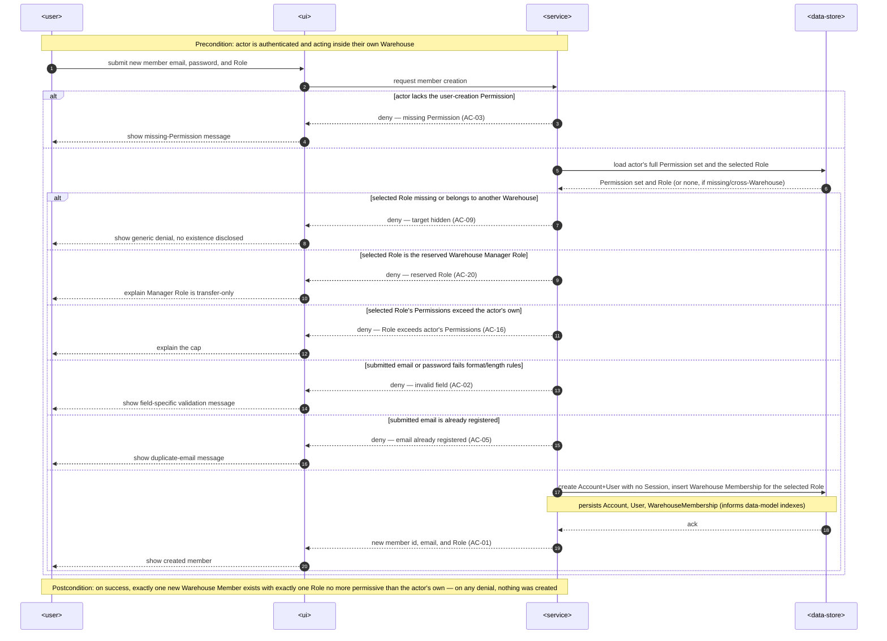
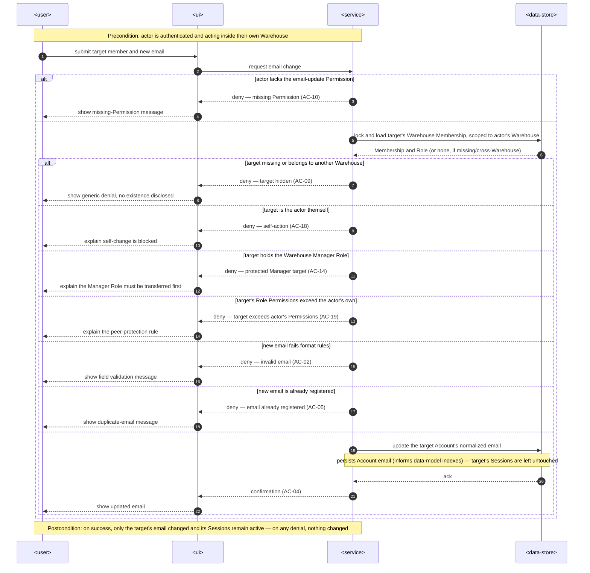
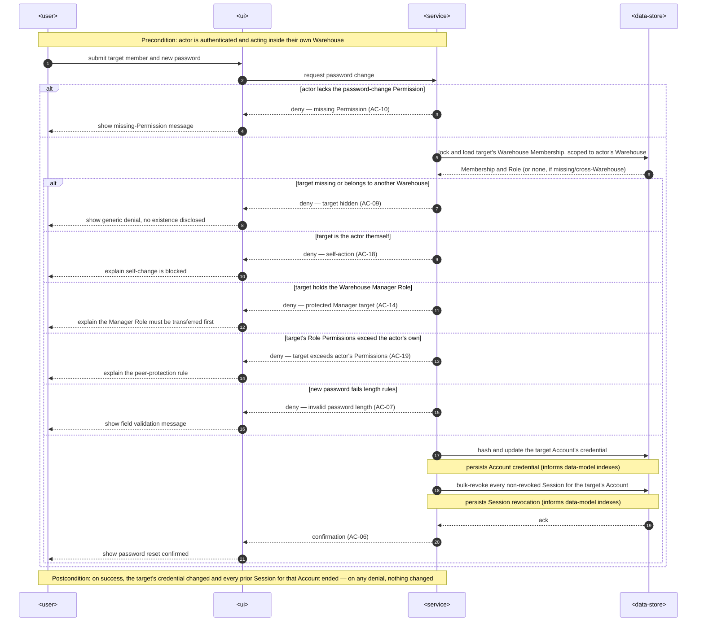
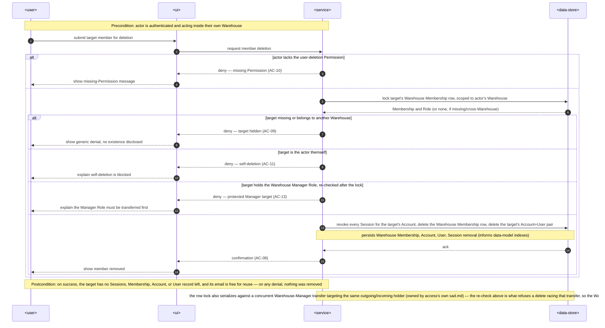
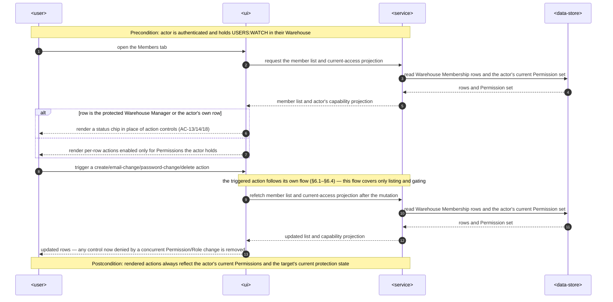

# Software Architecture Description — users-management

## 1. Context and quality goals

Registration provisions exactly one Warehouse Manager per Warehouse and the access feature built
every invariant a second member depends on, but no capability exists yet to add, correct, or remove
a Warehouse Member. This feature closes that gap: a permissioned Warehouse Member creates new
members, corrects their email, resets their password, and removes them, entirely within the
Warehouse-scoped authorization boundary access already enforces.

The architecture must satisfy these quality goals, in priority order:

1. A newly created Warehouse Member's Role never grants more Permissions than its creator currently
   holds, and the reserved Warehouse Manager Role can never be obtained through creation.
2. The Warehouse Manager Role holder can never be deleted or have their credentials changed by
   another member until the Role is explicitly transferred away, even under a concurrent transfer.
3. Every one of the four lifecycle actions (create, email-change, password-change, delete) is
   individually permissioned, Warehouse-scoped, and hides cross-Warehouse targets exactly as access
   already does for its own administration actions.
4. Create/email-change/password-change/delete each complete atomically: identity, credential, and
   Warehouse membership never end up partially written or partially removed.
5. Deleting or changing credentials against a target ends exactly the sessions the specification
   requires (all of them on deletion or password change, none on an email change) and never touches
   the acting member's own record.
6. Creation, email-change, and password-change meet their respective latency targets at p95 and the
   feature sustains the specified throughput (`spec.md` §6).

The specification is Approved. Because this feature adds a user-visible Members workspace, the
approved Pencil [`design-handoff.md`](./design-handoff.md) is already recorded and remains the gate
for any further visible change.

## 2. Constraints inherited from `docs/system`

- The repository remains a browser SPA plus NestJS modular monolith, with shared REST schemas in
  `packages/contracts` ([architecture map](../../system/architecture-map.md)).
- Server code follows the entity-related module, inward-dependency, command/query, domain-service,
  and thin-controller boundaries in [server architecture](../../system/server-architecture.md). A
  module is named for the business capability it owns and stays independent until reuse is genuine
  — the basis for both the new `users` module (§4) and
  [ADR-0001](./adr/0001-shared-credential-rules-for-member-lifecycle.md).
- Authorization guards are shared transport infrastructure under `shared/guards`; this feature reuses
  `SessionAuthGuard` and `WarehouseAccessGuard` as-is and introduces no new guard
  ([access feature SAD](../access/sad.md) §5). Business ownership/target-scoping rules stay in the
  owning application boundary, per the same document.
- PostgreSQL and TypeORM own persistence. New TypeORM entities and specialized concrete repositories
  live under `shared/domain`, and every schema change uses a reversible migration with runtime
  synchronization disabled
  ([PostgreSQL/TypeORM ADR](../../system/adr/21-07-2026-postgresql-with-typeorm.md)).
- Zod schemas in `packages/contracts` own web/server request and response shapes; server-only
  metadata and browser-only form state stay local
  ([Zod ADR](../../system/adr/12-07-2026-schema-validation-with-zod.md)).
- RTK Query owns member-lifecycle requests and cached server state; Redux Toolkit owns only
  cross-route client state and TanStack Router guards read the live store through selectors
  ([frontend architecture](../../system/frontend-architecture.md) and
  [RTK Query ADR](../../system/adr/02-08-2026-rtk-query-for-web-api-calls.md)).
- Expected denials and invariant failures use stable typed errors and the global exception filter;
  controllers do not translate failures locally
  ([server error-handling ADR](../../system/adr/24-07-2026-server-error-handling.md)).
- User-visible copy uses the centralized `access` (or feature-appropriate) namespace, and HeroUI plus
  repository tokens remain the visual foundation, per the approved
  [design handoff](./design-handoff.md) and
  [localization ADR](../../system/adr/27-07-2026-bundled-centralized-web-translations.md).
- Structured Pino logs are the diagnostic and performance-measurement mechanism; this feature adds no
  telemetry SDK, tracing, metrics exporter, or feature-specific telemetry abstraction
  ([logging ADR](../../system/adr/27-07-2026-structured-logging-with-pino.md) and
  [logging-without-telemetry ADR](../../system/adr/03-08-2026-structured-logging-instead-of-telemetry.md)).
- Session identity is the opaque, server-resolved cookie model accepted for auth; "ending sessions"
  means revoking the affected `Session` records, never a client-side-only sign-out
  ([auth session ADR](../auth/adr/0001-server-managed-opaque-cookie-sessions.md)).

## 3. Scope and target surfaces

### In scope

| Surface           | Change                                                                                                                                                                                                                                                                                                                         |
| ----------------- | ------------------------------------------------------------------------------------------------------------------------------------------------------------------------------------------------------------------------------------------------------------------------------------------------------------------------------ |
| `backend-service` | Add a `users` module owning create/email-change/password-change/delete for a Warehouse Member: authorization-gated commands, the identity/membership persistence they need, and the new `USERS:EMAIL_UPDATE`, `USERS:PASSWORD_CHANGE`, `USERS:DELETE` Permissions granted to every existing and future Warehouse Manager Role. |
| `web-frontend`    | Replace the placeholder `MemberRoleActions` with a full Members workspace in the existing Access Administration page's Members tab: list, create, edit-email, reset-password, and delete, per the approved design handoff.                                                                                                     |
| Shared boundary   | Add `users` contracts and stable error codes for creation, email/password change, and deletion. Promote email/password validation and hashing to shared server infrastructure ([ADR-0001](./adr/0001-shared-credential-rules-for-member-lifecycle.md)).                                                                        |
| Persistence       | Add columns/queries needed to create and remove an Account+User+WarehouseMembership triple outside registration, change an Account's email/password, and bulk-revoke a target's sessions. Exact shape belongs to `data-model.md`.                                                                                              |

### Out of scope

Self-service password change/reset, reversible deactivation, a display-name/profile field, forced
password rotation, email-ownership re-verification, and delivering a new member's credential to them
are excluded, per `spec.md` §3. No queue, worker, CLI, or SDK surface is introduced. The `access`
module's own Role CRUD, assignment, and manager-transfer capabilities are unchanged; this feature
consumes their invariants and repositories but does not modify them.

## 4. Solution strategy

Create a `users` server module owning the Warehouse Member lifecycle capability: create, change
email, change password, delete. It sits beside `access` and `auth` rather than inside either,
because it owns a cohesive capability neither existing module owns — `access` owns Role/Permission
structure and Warehouse membership _assignment_, `auth` owns self-service authentication — while this
feature is the _manager-driven_ lifecycle of the identity and membership row together. Following the
server architecture's module rule, `users` is created now because this capability is genuinely new,
not because reuse is anticipated.

Every `users` REST endpoint composes the existing `SessionAuthGuard` and `WarehouseAccessGuard`
exactly as `access`'s own endpoints do, declaring one of the four Permissions
(`USERS:CREATE` reused, `USERS:EMAIL_UPDATE`, `USERS:PASSWORD_CHANGE`, `USERS:DELETE` new) through
the existing `@RequiredPermission` metadata. The guard attaches the same `AccessCurrentUser` shape
`access` already defines; `users` commands never re-implement permission resolution.

`users` commands depend only on **shared** infrastructure, never on another feature module's private
code:

- the shared `AccessCurrentUserRepository.resolveCurrentAccess` read (already used by
  `access/usecases/queries/read-current-access.query.ts`) to obtain the acting member's _complete_
  current Permission set — the single `permissionId` the guard attaches is the one that satisfied
  the route's requirement, not the actor's full set, and AC-16/AC-19's "never exceeds the actor's own
  Permissions" comparisons need the full set;
- the shared `RoleLifecycleRepository.findMemberRole`/`findCustomRole` reads (already used by
  `access`'s own `AssignMemberRoleCommand`) to resolve a target's membership row and to validate a
  selected Role is a custom, in-Warehouse Role — the same lookup `access` uses, not a reimplementation;
- one new specialized repository, `MemberLifecycleRepository` (`shared/domain/repositories/`), for
  the operations no existing repository performs: reading a Role's granted Permission-ID set (for the
  AC-16/AC-19 superset comparisons against an arbitrary Role, not the caller's own), inserting a new
  Warehouse Membership row for a newly created identity, and removing a membership row on deletion;
- the shared `AuthenticationRepository` (`shared/domain/repositories/`, currently `auth`-authored but
  already placed under `shared/`), extended with identity-lifecycle operations beyond its current
  registration/sign-in scope: creating an Account+User pair with no Session, updating an Account's
  normalized email or credential, deleting an Account+User pair, and bulk-revoking every non-revoked
  Session for a target Account — distinct from the existing single-digest revocation `SignOutCommand`
  uses;
- the shared email/password value objects, predicates, and scrypt hashing functions promoted from
  `auth/domain/*` by [ADR-0001](./adr/0001-shared-credential-rules-for-member-lifecycle.md), so
  format validation and hashing are identical to registration without `users` importing any
  `auth`-owned domain object.

Every command runs inside one transaction (`@Transactional()`, the same decorator `access` and `auth`
already use) and follows the same pessimistic-locking discipline `access`'s
`TransferWarehouseManagerCommand`/`DeleteRoleCommand` established: the target's Warehouse Membership
row (and, for creation, the selected Role row) is locked before its current state is re-checked, so a
concurrent manager transfer and a concurrent delete/credential-change attempt against the same
outgoing or incoming manager serialize on that row rather than racing (AC-15). No new locking
primitive is introduced.

Creation never issues a Session for the new identity — unlike registration, which immediately signs
the new identity in. The new member authenticates later through the existing, unmodified sign-in
command (AC-12 requires no change there). Deletion and password-change revoke every existing Session
for the target's Account in the same transaction as the credential/membership write; an email change
explicitly leaves sessions untouched (AC-04).

New stable error codes for this feature's own domain invariants (self-action, protected-Manager
target, Permission-exceeded target, reserved-Role selection) live under `users/domain/errors/`,
following the exact `docs/system` error-handling pattern `access/domain/errors/access.errors.ts`
already demonstrates: named predicate-backed factories, no ad hoc `ApplicationError` construction at
the call site. The cross-Warehouse-hiding and missing-Permission denials (AC-09, AC-03/AC-10) reuse
the same `ACCESS_DENIED`/target-hidden shape the guard and `access` module already produce, since
they are the identical authorization-boundary condition, not a new one this feature owns.

## 5. Building blocks and ownership

### Backend and shared boundary

| Building block                                                                                                      | Ownership and responsibility                                                                                                                                                                                                                                                              |
| ------------------------------------------------------------------------------------------------------------------- | ----------------------------------------------------------------------------------------------------------------------------------------------------------------------------------------------------------------------------------------------------------------------------------------- |
| `users/domain`                                                                                                      | Typed errors and predicates for self-action, protected-Manager-target, Permission-exceeded-target, and reserved-Role-selection rules. No NestJS, HTTP, or TypeORM imports.                                                                                                                |
| `users/usecases/commands`                                                                                           | `CreateMemberCommand`, `ChangeMemberEmailCommand`, `ChangeMemberPasswordCommand`, `DeleteMemberCommand`. Each receives the caller's `AccessCurrentUser` and validated input; each owns one transaction boundary.                                                                          |
| `users/rest`                                                                                                        | A `UsersController` under a new base path, thin Zod DTO adapters, and route-level `@RequiredPermission` declarations. Invokes commands only; no business rules.                                                                                                                           |
| `shared/domain/repositories/member-lifecycle.repository.ts`                                                         | New specialized repository: Role Permission-ID reads for superset checks, Warehouse Membership insert (creation) and delete (deletion), and the pessimistic-write lock helpers creation/deletion need. Operates on shared persistence entities only; does not import `users` or `access`. |
| `shared/domain/repositories/authentication.repository.ts` (extended)                                                | Adds session-less identity creation, email/credential update, identity deletion, and bulk session revocation by Account, alongside its existing registration/sign-in operations. Still `auth`-authored infrastructure, now also consumed by `users`.                                      |
| `shared/domain/repositories/role-lifecycle.repository.ts` / `access-current-user.repository.ts` (reused, unchanged) | Supply target-membership lookup, custom-Role validation, and the caller's full Permission-ID set. `users` consumes them as shared infrastructure; it does not modify `access`'s files.                                                                                                    |
| `shared/domain/security/` (new, per [ADR-0001](./adr/0001-shared-credential-rules-for-member-lifecycle.md))         | Email/password format predicates, normalization, value objects, and scrypt hashing — promoted from `auth/domain/*` and shared by `auth` and `users`.                                                                                                                                      |
| `packages/contracts/users` (new)                                                                                    | Strict request/response schemas for creation, email change, password change, and deletion, reusing `packages/contracts/access`'s `permissionIdSchema`/role-name segmentation conventions where shapes overlap.                                                                            |
| `packages/shared-types`                                                                                             | Adds `USERS:EMAIL_UPDATE`, `USERS:PASSWORD_CHANGE`, `USERS:DELETE` to `PermissionId`, and this feature's new `ErrorCode` entries.                                                                                                                                                         |

`users` never imports `access/*` or `auth/*` feature-owned files directly; every dependency above is
either genuinely shared infrastructure or a shared repository/security module promoted for this
reason. This preserves the same decoupling `access`'s own SAD already established for registration.

### Web

| Building block                                                              | Ownership and responsibility                                                                                                                                                                                                                   |
| --------------------------------------------------------------------------- | ---------------------------------------------------------------------------------------------------------------------------------------------------------------------------------------------------------------------------------------------- |
| `modules/access/api/`                                                       | Injects the four new `users` endpoints into the shared RTK Query API slice, alongside the existing access endpoints, with invalidation tags covering the member list and current-access projection.                                            |
| `modules/access/components/access-administration/` (extended)               | Replaces `MemberRoleActions.tsx` with the approved Members workspace: list with per-row actions, Create Member modal/sheet, and the edit-email/reset-password/delete dialogs sharing the existing `RoleDialog`/`DeletionDialog` shell.         |
| `modules/access/components/access-workspace/AccessWorkspace.tsx` (extended) | The existing "members" `Tab` renders the new Members workspace (gated by `USERS:WATCH`/the four new Permissions) instead of the current read-only `MembersDatasetCard`, mirroring how the "roles" tab already swaps in `AccessAdministration`. |
| `modules/access/hooks/useAccessAdministrationActions.ts` (extended)         | Adds the four new mutation handlers, following the existing success/field-error mapping pattern used for role mutations.                                                                                                                       |
| `public/locales/<language>/access.json`                                     | Adds Members-workspace copy (creation, edit-email, reset-password, deletion, protected/self states) under the existing `access` namespace, per the approved design handoff.                                                                    |

No new web route, module directory, or top-level page is introduced; the design handoff's
implementation constraint (extend the existing Access Administration page) is authoritative for
frontend placement.

## 6. Runtime view

### 6.1 Create a Warehouse Member

1. `SessionAuthGuard` + `WarehouseAccessGuard` resolve the caller's `AccessCurrentUser` under
   `USERS:CREATE`, exactly as any other protected `access`/`users` route.
2. `CreateMemberCommand` loads the caller's full Permission-ID set
   (`AccessCurrentUserRepository.resolveCurrentAccess`) and the selected Role
   (`RoleLifecycleRepository.findCustomRole`, scoped to the caller's Warehouse).
3. It rejects a missing/cross-Warehouse Role, the reserved Warehouse Manager Role (AC-20), and a
   Role whose Permission-ID set (`MemberLifecycleRepository`) is not a subset of the caller's own
   (AC-16).
4. It validates email/password format with the shared predicates (AC-02) and the global email
   uniqueness rule against `AuthenticationRepository.findAccountByNormalizedEmail` (AC-05) — the same
   check `RegisterCommand` already performs.
5. In one transaction, it hashes the password with the shared hashing function, creates the
   Account+User pair with no Session (`AuthenticationRepository`, extended), and inserts the
   Warehouse Membership row for the selected Role (`MemberLifecycleRepository`).
6. Any failure rolls back the whole attempt; success returns the new member's identifier, email, and
   Role to the caller (AC-01).

### 6.2 Change a member's email

1. Guard resolves the caller under `USERS:EMAIL_UPDATE`.
2. `ChangeMemberEmailCommand` locks and loads the target's Warehouse Membership
   (`RoleLifecycleRepository.findMemberRole`, scoped to the caller's Warehouse) — a missing row is
   indistinguishable from a cross-Warehouse target (AC-09).
3. It rejects self-targeting (AC-18), a target currently holding the Warehouse Manager Role (AC-14),
   and a target whose current Role's Permission-ID set is not a subset of the target's own action
   set relative to the caller — i.e. the target holds a Permission the caller lacks (AC-19).
4. It validates the new email's format (AC-02) and global uniqueness (AC-05), then updates the
   Account's normalized email (`AuthenticationRepository`, extended) in the same transaction.
5. Sessions are left untouched (AC-04); the command returns confirmation to the caller.

### 6.3 Change a member's password

Identical to 6.2 under `USERS:PASSWORD_CHANGE`, with password length validation (AC-07) in place of
email format, and one difference at the final step: after updating the hashed credential, the
command bulk-revokes every non-revoked Session for the target's Account
(`AuthenticationRepository.revokeSessionsByAccountId`, extended) in the same transaction, so a stale
browser cannot continue using the old credential's session (AC-06).

### 6.4 Delete a Warehouse Member

1. Guard resolves the caller under `USERS:DELETE`.
2. `DeleteMemberCommand` locks the target's Warehouse Membership row (same lock primitive
   `TransferWarehouseManagerCommand`/`DeleteRoleCommand` already use) within the caller's Warehouse.
3. It rejects self-deletion (AC-11) and a target currently holding the Warehouse Manager Role
   (AC-13). Because the row is locked before this check, a concurrent manager transfer targeting the
   same row serializes against this transaction — whichever commits first, the other re-checks fresh
   state and is refused if the precondition no longer holds (AC-15).
4. In one transaction it revokes every Session for the target's Account, deletes the Warehouse
   Membership row, and deletes the target's Account+User pair — freeing the email for reuse (AC-08).
5. Any failure rolls back the entire removal; success confirms the deletion to the caller.

### 6.5 Review and act on members in the web application

1. The Members tab requests the member list only under `USERS:WATCH`, exactly as the existing Roles
   tab gates its own data.
2. Per-row actions (edit email, reset password, delete) and the "Create member" action derive from
   the current capability projection (`USERS:CREATE`/`USERS:EMAIL_UPDATE`/`USERS:PASSWORD_CHANGE`/
   `USERS:DELETE`), exactly as `access`'s Roles workspace already derives its own actions.
3. The protected Warehouse Manager row and the caller's own row render their chip in place of action
   controls (AC-13/14/18), per the approved design handoff.
4. After any mutation, RTK Query invalidates the member list and current-access projection; a denial
   caused by a concurrent Permission or Role change removes stale controls on refetch, matching
   `access`'s existing behavior.

### 6.6 Use-case and acceptance-criteria coverage

Every `spec.md` §4 user story maps to at least one flow above:

| User story                                                | Flow(s)                                                             |
| --------------------------------------------------------- | ------------------------------------------------------------------- |
| US-01 Onboard a new team member                           | §6.1                                                                |
| US-02 Correct a member's email                            | §6.2                                                                |
| US-03 Reset a member's password                           | §6.3                                                                |
| US-04 Offboard a former team member                       | §6.4                                                                |
| US-05 Start working with an assigned identity             | N/A — reuses `auth`'s existing, unmodified sign-in flow (see below) |
| US-06 Keep the Warehouse Manager protected                | §6.2, §6.3, §6.4                                                    |
| US-07 Prevent minting a more powerful account than my own | §6.1                                                                |
| US-08 Gain the new capabilities without a separate step   | N/A — deploy-time migration (see below)                             |

Every `spec.md` §5 acceptance criterion maps to a flow, a branch, or an explicit non-runtime N/A:

| AC                                               | Where shown                                                                                                                               |
| ------------------------------------------------ | ----------------------------------------------------------------------------------------------------------------------------------------- |
| AC-01 create happy path                          | §6.1 happy-path branch                                                                                                                    |
| AC-02 invalid email/password on create           | §6.1 `alt` branch                                                                                                                         |
| AC-03 missing create Permission                  | §6.1 `alt` branch                                                                                                                         |
| AC-04 email-change happy path                    | §6.2 happy-path branch                                                                                                                    |
| AC-05 duplicate email (create/email-change)      | §6.1 and §6.2 `alt` branches                                                                                                              |
| AC-06 password-change happy path                 | §6.3 happy-path branch                                                                                                                    |
| AC-07 invalid password length                    | §6.3 `alt` branch                                                                                                                         |
| AC-08 delete happy path                          | §6.4 happy-path branch                                                                                                                    |
| AC-09 cross-Warehouse target hidden              | §6.1–§6.4 `alt` branches                                                                                                                  |
| AC-10 missing Permission (email/password/delete) | §6.2–§6.4 `alt` branches                                                                                                                  |
| AC-11 self-deletion                              | §6.4 `alt` branch                                                                                                                         |
| AC-12 sign in with initial credentials           | N/A — non-runtime for this feature: reuses `auth`'s existing sign-in command unchanged (`sad.md` §4); no `users` runtime path is involved |
| AC-13 protected-Manager deletion                 | §6.4 `alt` branch                                                                                                                         |
| AC-14 protected-Manager credential change        | §6.2, §6.3 `alt` branches                                                                                                                 |
| AC-15 transfer/delete race                       | §6.4 — the pessimistic-lock re-check (same branch as AC-13) plus the trailing `Note` on serialization against a concurrent transfer       |
| AC-16 Role exceeds creator's Permissions         | §6.1 `alt` branch                                                                                                                         |
| AC-17 Manager Role gains new Permissions         | N/A — non-runtime: applied by a deploy-time Permission-catalogue migration (`data-model.md` owns it), not a request flow                  |
| AC-18 self email/password change                 | §6.2, §6.3 `alt` branches                                                                                                                 |
| AC-19 peer credential takeover                   | §6.2, §6.3 `alt` branches                                                                                                                 |
| AC-20 reserved Manager Role at creation          | §6.1 `alt` branch                                                                                                                         |

No §4 user story and no §5 acceptance criterion is left uncovered.

## 7. Data and interface impact

### Data

- No new entity concept is introduced: creation and deletion operate on the existing `AccountEntity`,
  `UserEntity`, `WarehouseMembershipEntity`, and `SessionEntity` shapes `auth` and `access` already
  define. `data-model.md` must resolve exact repository method signatures on
  `AuthenticationRepository` and the new `MemberLifecycleRepository`, and confirm no schema migration
  is required beyond the Permission catalogue update below (the existing tables already support
  every operation this feature performs).
- A migration must insert `USERS:EMAIL_UPDATE`, `USERS:PASSWORD_CHANGE`, and `USERS:DELETE` into the
  Permission catalogue as assignable Permissions and grant each, together with the already-assignable
  `USERS:CREATE`, directly to every existing Warehouse Manager Role (AC-17) — the same catalogue
  mechanism `1785859200000-CreateAccessSchema.ts` already establishes for seeding Manager Permissions.
  `data-model.md` owns the exact migration.
- Deletion is a hard delete of the Account+User pair and the Warehouse Membership row; no soft-delete
  or tombstone column is introduced, consistent with the approved permanent-removal requirement
  (`spec.md` §3).
- Bulk session revocation is a new `AuthenticationRepository` write shaped like the existing
  `revokeSessionByDigest`, but keyed by `accountId` and unbounded by digest — `data-model.md` should
  confirm the existing `sessions(account_id)` access path is indexed for this bulk `UPDATE`.

### HTTP and shared contracts

The API stage owns exact paths, verbs, and status codes. The contract must cover:

- create-member input (email, initial password, roleId) and its success/validation/duplicate-email/
  Permission-exceeded/reserved-Role-selection responses;
- email-change and password-change input (each a single field) and their success/validation/
  protected-Manager/Permission-exceeded/self-action/duplicate-email (email only) responses;
- delete-member input (target identifier only) and its success/self-deletion/protected-Manager
  responses;
- the shared cross-Warehouse/missing-Permission denial shape already used by `access`'s own endpoints,
  reused rather than redefined.

List/read access for the Members tab continues to use `access`'s existing `GET
/api/v1/access/members` endpoint and `USERS:WATCH` Permission — this feature does not change that
read path, only what the write actions can do to the rows it returns.

No queue, event contract, CLI, SDK, or worker interface is introduced.

## 8. Cross-cutting concerns

### Security and privacy

- Every lifecycle action is independently Permission-gated and Warehouse-scoped through the existing
  guard; none can be reached through a shared code path that skips the check.
- Privilege-escalation-at-creation (AC-16), Warehouse-Manager-minting-at-creation (AC-20),
  Warehouse-Manager removal/credential-takeover (AC-13/14), peer-credential-takeover (AC-19),
  self-credential-change (AC-18), transfer/delete race (AC-15), and self-deletion (AC-11) are each
  enforced in `users` domain code and covered by dedicated integration tests, per `spec.md` §6.1.
- Duplicate-email disclosure on creation/email-change intentionally matches the existing sign-up
  disclosure; this feature introduces no new information-disclosure surface.
- The security review required by `spec.md` §6.1 must additionally cover: the new bulk
  session-revocation write (correct `accountId` scoping, no cross-account revocation), and that
  `users` commands cannot be reached without the `WarehouseAccessGuard` composition (mirroring
  `access`'s own authorization-coverage architecture test, §"Authorization coverage" below).

### Authorization coverage

`users`'s REST controller must pass the same focused architecture test `access`'s SAD already
requires: every authenticated business handler declares a Permission and is Warehouse-scoped, or is
explicitly documented as infrastructure-exempt. No new test mechanism is introduced; `users`'s
controller is added to the existing scan's coverage.

### Consistency and concurrency

Every command uses the existing `@Transactional()` boundary and the same pessimistic row-locking
discipline `access`'s manager-transfer and role-deletion commands already established. Database
constraints (Warehouse Membership's existing uniqueness/foreign-key shape) remain the final arbiter
under concurrency; no new constraint type is introduced.

### Performance and diagnostics

`MemberLifecycleRepository` and the extended `AuthenticationRepository` methods use one indexed query
per lookup, matching the existing repositories' shape. Structured Pino logs record duration, outcome
code, operation, and non-sensitive identifiers for each lifecycle action; no email, password, or
password hash is ever logged. Load smoke tests exercise the specification's 30 ops/s target
(`spec.md` §6).

### Web state, freshness, and accessibility

RTK Query tags connect the member list, current-access projection, and (for password-change) no
client-visible session state — the acting member's own session is never affected by any action this
feature performs. Loading, empty, protected-row, self-row, denied, validation, success, and
rollback-safe error states follow the approved design handoff exactly; no additional design gate is
needed for this feature's UI.

## 9. ADR index

- [0001 — Shared credential validation and hashing for member lifecycle](./adr/0001-shared-credential-rules-for-member-lifecycle.md) —
  promotes email/password rules and hashing out of `auth/domain/*` into shared server
  infrastructure so `users` reuses them without depending on `auth`'s private domain model.

The new-module placement, guard/repository reuse, transaction/locking discipline, and REST/RTK Query
conventions are direct applications of already-accepted system architecture and the access feature's
own precedent; they do not pass the blast-radius gate independently and are recorded inline in §4–§5.

## 10. Verification strategy

| Level                  | Required evidence                                                                                                                                                                                                   |
| ---------------------- | ------------------------------------------------------------------------------------------------------------------------------------------------------------------------------------------------------------------- |
| Domain unit            | Self-action, protected-Manager-target, Permission-exceeded-target, and reserved-Role-selection predicates; shared email/password predicates and hashing (moved, not reimplemented — reuse `auth`'s existing suite). |
| Repository integration | `MemberLifecycleRepository` Role-Permission reads and membership insert/delete; extended `AuthenticationRepository` identity create/update/delete and bulk session revocation, against PostgreSQL.                  |
| Command integration    | Atomic creation, email-change, password-change, and deletion; every AC-11/13/14/15/16/18/19/20 precondition; rollback on injected failure; concurrent transfer-vs-delete/credential-change race (AC-15).            |
| REST contract          | Every endpoint validates shared schemas, maps stable errors, prevents ID enumeration, and denies missing Permission and cross-Warehouse targets (AC-09, AC-10).                                                     |
| Architecture           | `users`'s controller is Permission-gated/Warehouse-scoped or explicitly infrastructure-exempt; `users/domain` has no framework imports; `users` imports no `access/*` or `auth/*` feature-owned file.               |
| Web                    | Hidden actions for missing Permissions, protected/self-row presentation, direct-request denial handling, cache invalidation after mutations and Permission changes, translated feedback, focus/keyboard behavior.   |
| Performance/operations | Creation/change/deletion p95 targets, 30 ops/s smoke load, structured timing fields with no credential leakage.                                                                                                     |

Trace these checks to every `AC-*` in `spec.md` during `plan-tests`. Run the normal server,
contracts, web, lint, typecheck, and build gates after focused suites. The security review is a
release gate; the Pencil design handoff is already approved.

## 11. Risks and open questions

| Risk or question                                                                                                                                                                   | Treatment / owner                                                                                                                                                                                       |
| ---------------------------------------------------------------------------------------------------------------------------------------------------------------------------------- | ------------------------------------------------------------------------------------------------------------------------------------------------------------------------------------------------------- |
| Moving `auth`'s email/password code to `shared/domain/security/` regresses an existing auth behavior.                                                                              | Move the existing test suite alongside the code with no behavior change; re-run `auth`'s full suite as part of this feature's gate, not just `users`'s new tests. Backend Lead.                         |
| A future module adds a reference to a deleted Warehouse Member's identifier (audit/created-by field).                                                                              | Deferred per `spec.md` §8; no such module exists yet. Tech Lead owns the decision when one is proposed.                                                                                                 |
| The dormant `USERS:UPDATE` Permission's fate is unresolved.                                                                                                                        | Leave dormant and unused per `spec.md` §8's default; do not repurpose it for any of this feature's four new capabilities. Tech Lead, due before `tasks users-management`.                               |
| Bulk session revocation by `accountId` is a new write shape; an incorrect `WHERE` clause could revoke the wrong account's sessions.                                                | Cover with a dedicated repository integration test asserting only the target account's sessions are revoked; code review focuses on this method specifically. Backend Lead.                             |
| The Members tab's current read path (`GET /access/members`) does not yet return email — needed to render/identify rows and to label icon-only actions accessibly (design handoff). | Confirm with `data-model.md`/`api` stage whether that read must be extended to include email; this is a read-path change owned by `access`, not a new `users` capability. Backend Lead + Frontend Lead. |
| The repository still uses a single REST bootstrap despite the documented two-runtime target.                                                                                       | Add only REST-side `users` code for this feature; no worker dependency is introduced. Tech Lead.                                                                                                        |
