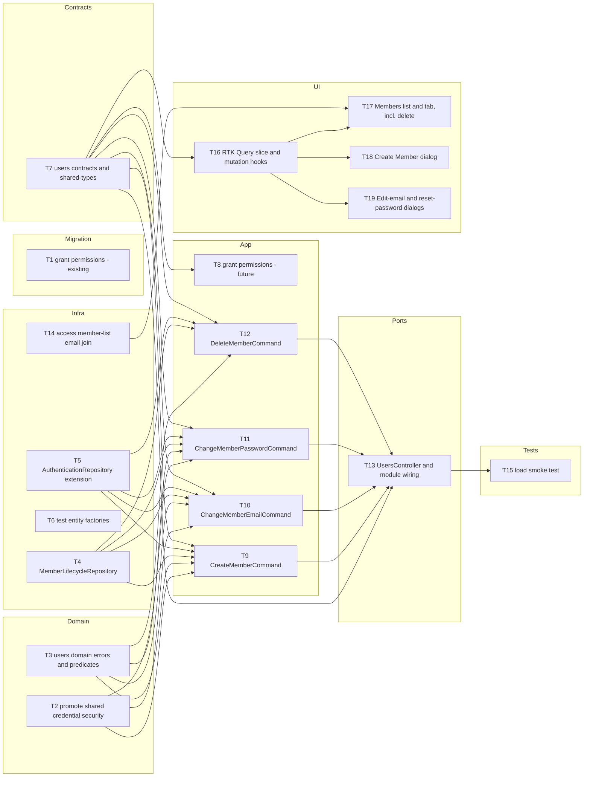

# Epic — users-management

> **Spec:** [spec.md](../spec.md) · **Design:** [sad.md](../sad.md) · **Data model:** [data-model.md](../data-model.md) · **API:** [openapi.yaml](../contracts/openapi.yaml) · **ADRs:** [adr/](../adr/) · **Design handoff:** [design-handoff.md](../design-handoff.md)

## Goal

Let a permissioned Warehouse Member grow their Warehouse's team beyond the single self-registered
Warehouse Manager — create, correct-email, reset-password, and delete a Warehouse Member — while
preserving the exactly-one-Manager, exactly-one-Role, and never-exceeds-creator's-Permissions
invariants (`spec.md` §2).

## Scope

- **In:** a new `users` server module (domain/usecases/rest), shared repository and security
  extensions, a Permission-catalogue migration, and a Members workspace replacing the placeholder
  `MemberRoleActions` in the existing Access Administration page — per `sad.md` §3.
- **Out:** self-service password change/reset, reversible deactivation, a profile/display-name
  field, forced password rotation, email-ownership re-verification, and credential delivery to the
  new member — per `spec.md` §3.

## Task map

`T1`, `T2`, `T3`, `T4`, `T5`, `T6`, `T7`, and `T14` have no dependencies and can start in parallel on
day one; `T6` (test factories) has no arrows above only because nothing else names it explicitly in
`files_hint`, but every command task (`T9`–`T12`) and repository task (`T4`, `T5`) consumes it in
practice.

## Tasks

See [tracker.md](./tracker.md) for status. Machine contract: [tasks.json](../tasks.json).

| #   | Task                                                      | Layer     | Blocked by            | DoD (short)                                                                |
| --- | --------------------------------------------------------- | --------- | --------------------- | -------------------------------------------------------------------------- |
| T1  | Grant USERS:\* to existing Warehouse Managers (migration) | migration | —                     | Staged migration promotes, applies/reverts cleanly (AC-17)                 |
| T2  | Promote shared credential security (ADR-0001)             | domain    | —                     | email/password/hashing moved, `auth` suite stays green                     |
| T3  | Users domain errors and invariant predicates              | domain    | —                     | self-action/protected-Manager/exceeds-Permissions/reserved-Role unit tests |
| T4  | MemberLifecycleRepository                                 | infra     | —                     | lock/read/insert/delete repo integration tests                             |
| T5  | Extend AuthenticationRepository                           | infra     | —                     | identity-lifecycle + bulk-session repo integration tests                   |
| T6  | Persistence-entity test factories                         | infra     | —                     | Account/User/Membership/Session factories                                  |
| T7  | users contracts + shared-types                            | ports     | —                     | Zod schemas match openapi.yaml; PermissionId/ErrorCode extended            |
| T8  | Grant USERS:\* to future Warehouse Managers               | app       | T7                    | new-Warehouse integration test (AC-17)                                     |
| T9  | CreateMemberCommand                                       | app       | T2, T3, T4, T5, T7    | AC-01/02/05/09/12/16/20 command integration tests                          |
| T10 | ChangeMemberEmailCommand                                  | app       | T2, T3, T4, T5, T7    | AC-04/05/09/14/18/19 command integration tests                             |
| T11 | ChangeMemberPasswordCommand                               | app       | T2, T3, T4, T5, T7    | AC-06/07/09/14/18/19 command integration tests                             |
| T12 | DeleteMemberCommand                                       | app       | T3, T4, T5, T7        | AC-08/09/11/13/15 command integration tests, incl. race                    |
| T13 | UsersController + module wiring                           | ports     | T7, T9, T10, T11, T12 | REST contract tests, architecture scan, AppModule registration             |
| T14 | Access member-list email join                             | infra     | —                     | list-access-members returns email                                          |
| T15 | Load smoke test                                           | tests     | T13                   | ≥30 ops/s, p95 targets met                                                 |
| T16 | RTK Query slice + mutation hooks                          | ui        | T7                    | 4 mutations + invalidation tags + hook handlers                            |
| T17 | Members list + tab wiring, incl. delete                   | ui        | T16, T14              | list/row/chip/delete states per design handoff                             |
| T18 | Create Member dialog                                      | ui        | T16                   | create form + error states per design handoff                              |
| T19 | Edit-email / reset-password dialogs                       | ui        | T16                   | 2 dialogs + error states per design handoff                                |

**Total:** 19 tasks.

## Risks / Hard rules

- `users` never imports `access/*` or `auth/*` feature-owned files directly — only shared
  infrastructure (`sad.md` §4, §8 Authorization coverage). T13's architecture-scan DoD enforces this.
- Deletion must hard-delete `sessions` and `warehouse_memberships` before `accounts`/`users`, in the
  exact order `data-model.md` §"Deletion sequencing" specifies, or the `ON DELETE RESTRICT` foreign
  keys reject the transaction. T12 owns this.
- No schema/table/column/index change is in scope — only the Permission-catalogue migration (T1) and
  additive contract/enum changes (T7). Do not add a migration beyond the staged one.
- Every lifecycle action stays individually Permission-gated and Warehouse-scoped through the
  existing `SessionAuthGuard`/`WarehouseAccessGuard` composition — no new guard is introduced
  (`sad.md` §2).
- No self-service password change/reset, reversible deactivation, profile field, forced rotation,
  email re-verification, or credential-delivery channel — these are explicit non-goals (`spec.md`
  §3); do not let any task grow into one.
- The dormant `USERS:UPDATE` Permission stays dormant and unused — do not repurpose it for any of
  this feature's four new capabilities (`spec.md` §8, `sad.md` §11).
