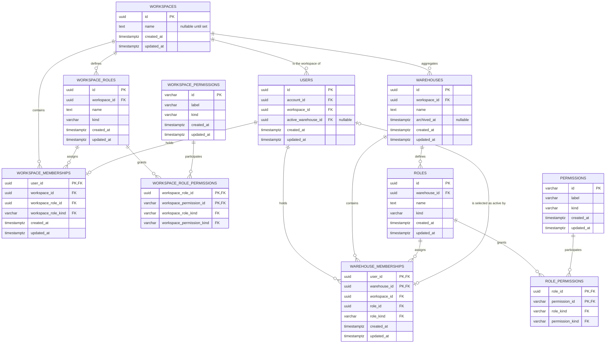

# Data model — workspaces

This model specializes the PostgreSQL/TypeORM baseline in
[`docs/system/server-architecture.md`](../../system/server-architecture.md), the system
[`sad.md`](../../system/sad.md), and the accepted
[PostgreSQL/TypeORM ADR](../../system/adr/21-07-2026-postgresql-with-typeorm.md). TypeORM entities
stay in `apps/server/src/shared/domain/entities/`, specialized concrete repositories in
`apps/server/src/shared/domain/repositories/`
([creating a server repository](../../system/guides/creating-a-server-repository.md)), feature
mappers stay above the repository boundary, every schema change is a reviewed migration, and runtime
`synchronize` remains `false`. No deviation from those rules is proposed.

The Workspace authority level is persisted as **parallel relations** rather than as a scope
discriminator on the approved Warehouse ones, per
[ADR 0002](./adr/0002-parallel-workspace-authority-tables.md). Every constraint created by
`1785859200000-CreateAccessSchema` keeps its current strength; the only approved relation this
release reshapes is `warehouse_memberships`, whose key changes because a member may now belong to
several Warehouses ([`sad.md`](./sad.md) §7).

Migrations are forward-only and assume empty tables. [`spec.md`](./spec.md) §1 (fourth boundary)
authorizes that: no deployment holds Warehouse, membership or Role data that must survive this
change, and the schema is rebuilt by rolling every migration back and running them again. The staged
migrations **assert** emptiness rather than backfilling, so the precondition fails loudly instead of
silently. Existing migrations are not edited.

## ER diagram

`ACCOUNTS` and `SESSIONS` are unchanged by this feature and are omitted.

## Entities

All entity IDs are application-generated UUIDs, matching the implemented auth and access schemas.
Workspace, Warehouse and Workspace Role names use PostgreSQL `text COLLATE "C"`: equality and
uniqueness are bytewise, case-sensitive, and do not normalize submitted Unicode. The promoted
`shared/domain/value-objects/access-name.ts` value object ([`sad.md`](./sad.md) §5) stays
authoritative for trimming, rejecting Unicode control and format characters, and counting at most
100 user-perceived characters with `Intl.Segmenter`. Database checks backstop non-empty,
already-trimmed storage and deliberately do not substitute code-point length for the specified
grapheme count — the same division `access` already uses.

### `workspaces`

| Column       | Type        | Constraints                                   | Notes                                                         |
| ------------ | ----------- | --------------------------------------------- | ------------------------------------------------------------- |
| `id`         | UUID        | PK                                            | Application-generated Workspace identity.                     |
| `name`       | TEXT        | NULL, `COLLATE "C"`, non-empty-when-set CHECK | NULL is the unnamed state presented as a placeholder (AC-29). |
| `created_at` | TIMESTAMPTZ | NOT NULL, DEFAULT `CURRENT_TIMESTAMP`         | Registration provisioning time.                               |
| `updated_at` | TIMESTAMPTZ | NOT NULL, DEFAULT `CURRENT_TIMESTAMP`         | Set explicitly by persistence writes.                         |

**Aggregate root:** root — the outermost ownership boundary.

**Access patterns:** resolve the actor's own Workspace by ID → primary key; lock the Workspace row
first in every Workspace-level lifecycle command → primary key (see
[Transactions and locking](#repository-boundaries-transactions-and-locking)).

**Constraints:** Workspace names are intentionally not unique (AC-29). `chk_workspaces_name_stored_trimmed`
accepts NULL or a non-empty already-trimmed value, which is the only difference from the approved
Warehouse-name rules.

### `workspace_permissions`

| Column       | Type         | Constraints                                 | Notes                                                  |
| ------------ | ------------ | ------------------------------------------- | ------------------------------------------------------ |
| `id`         | VARCHAR(64)  | PK, stable identifier CHECK                 | For example `WAREHOUSES:ARCHIVE`; never user-editable. |
| `label`      | VARCHAR(100) | NOT NULL, non-empty CHECK                   | System-managed catalogue label (AC-18).                |
| `kind`       | VARCHAR(16)  | NOT NULL, CHECK in `assignable`, `reserved` | Governs custom Workspace Role eligibility.             |
| `created_at` | TIMESTAMPTZ  | NOT NULL, DEFAULT `CURRENT_TIMESTAMP`       | Catalogue introduction time.                           |
| `updated_at` | TIMESTAMPTZ  | NOT NULL, DEFAULT `CURRENT_TIMESTAMP`       | Set by explicit catalogue migrations only (AC-35).     |

**Aggregate root:** system Workspace Permission catalogue — a separate vocabulary from `permissions`,
never read or written together with it (ADR 0002).

**Access patterns:** validate submitted Workspace Permission identifiers → primary key; list the
assignable catalogue ordered by identifier (AC-32) → index `idx_workspace_permissions_kind_id`.

**Constraints:** identifiers are uppercase namespace/action pairs
(`^[A-Z][A-Z0-9_]*:[A-Z][A-Z0-9_]*$`). `uq_workspace_permissions_id_kind` carries the classification
into Workspace Role membership so a reserved Permission cannot reach a custom Role.

**Seeded rows (16):** the initial Workspace Owner set from [`spec.md`](./spec.md) §1 —
`WORKSPACE:RENAME`, `WORKSPACE_ROLES:{WATCH,CREATE,UPDATE,DELETE,ASSIGN}`,
`WORKSPACE_MEMBERS:{WATCH,ADD,REMOVE}`, `WAREHOUSES:{WATCH,CREATE,RENAME,ARCHIVE}`,
`WAREHOUSE_MEMBERSHIPS:{ASSIGN,REVOKE}` as `assignable`, and `WORKSPACE_OWNER_ROLE:REASSIGN` as
`reserved`.

### `workspace_roles`

| Column         | Type        | Constraints                                    | Notes                                          |
| -------------- | ----------- | ---------------------------------------------- | ---------------------------------------------- |
| `id`           | UUID        | PK                                             | Application-generated Workspace Role identity. |
| `workspace_id` | UUID        | NOT NULL, FK → `workspaces(id)`                | Immutable owning Workspace.                    |
| `name`         | TEXT        | NOT NULL, `COLLATE "C"`, non-empty CHECK       | Exact, case-sensitive Workspace-local name.    |
| `kind`         | VARCHAR(24) | NOT NULL, CHECK in `custom`, `workspace_owner` | Protected lifecycle discriminator (AC-16).     |
| `created_at`   | TIMESTAMPTZ | NOT NULL, DEFAULT `CURRENT_TIMESTAMP`          | Role creation time.                            |
| `updated_at`   | TIMESTAMPTZ | NOT NULL, DEFAULT `CURRENT_TIMESTAMP`          | Name or Permission-membership update time.     |

**Aggregate root:** `workspaces`.

**Access patterns:** list a Workspace's Roles ordered by name (AC-32) and reject a duplicate exact
name (AC-15) → unique constraint `uq_workspace_roles_workspace_name`; resolve a Role under the
actor's Workspace → `uq_workspace_roles_id_workspace_kind`; find the protected Owner Role, and find
every Owner Role during a catalogue release (AC-35) → partial unique index
`uq_workspace_roles_one_owner_per_workspace`.

**Constraints:** `(workspace_id, name)` is bytewise unique, so differently cased and differently
normalized names stay distinct (AC-15). The partial unique index permits at most one
`workspace_owner` Role per Workspace. `uq_workspace_roles_id_kind` backs the Role-Permission
composite foreign key; `uq_workspace_roles_id_workspace_kind` backs the membership composite foreign
key. Registration provisioning supplies the protected Role named `Workspace Owner`, mirroring the
`Warehouse Manager` Role the access level already provisions.

### `workspace_role_permissions`

| Column                      | Type        | Constraints                                          | Notes                                         |
| --------------------------- | ----------- | ---------------------------------------------------- | --------------------------------------------- |
| `workspace_role_id`         | UUID        | PK, composite FK → `workspace_roles(id, kind)`       | Grant-owning Workspace Role.                  |
| `workspace_permission_id`   | VARCHAR(64) | PK, composite FK → `workspace_permissions(id, kind)` | Granted catalogue Workspace Permission.       |
| `workspace_role_kind`       | VARCHAR(24) | NOT NULL                                             | Constraint-carried Role classification.       |
| `workspace_permission_kind` | VARCHAR(16) | NOT NULL                                             | Constraint-carried Permission classification. |

**Aggregate root:** `workspace_roles`.

**Access patterns:** decide whether the actor's Workspace Role grants the declared Workspace
Permission ([`sad.md`](./sad.md) §6.2) → primary key `(workspace_role_id, workspace_permission_id)`;
list a Role's Permission membership (AC-32) → the same Role-leading primary key; find every
protected Owner Role affected by a catalogue release (AC-35) → index
`idx_workspace_role_permissions_permission_id`.

**Constraints:** the two composite foreign keys stop the carried classifications from drifting.
CHECK `workspace_role_kind = 'workspace_owner' OR workspace_permission_kind = 'assignable'` makes
granting `WORKSPACE_OWNER_ROLE:REASSIGN` to a custom Workspace Role unrepresentable (AC-18). The
Role-side foreign key is `ON DELETE CASCADE`, so deleting a custom Workspace Role removes its grants;
the Permission-side is `ON DELETE RESTRICT`, so a catalogue entry cannot vanish from under a Role.

### `workspace_memberships`

| Column                | Type        | Constraints                                                        | Notes                                            |
| --------------------- | ----------- | ------------------------------------------------------------------ | ------------------------------------------------ |
| `user_id`             | UUID        | PK, composite FK → `users(id, workspace_id)`                       | At most one Workspace membership per User.       |
| `workspace_id`        | UUID        | NOT NULL, part of both composite FKs                               | Always the User's own Workspace.                 |
| `workspace_role_id`   | UUID        | NOT NULL                                                           | The one Workspace Role held.                     |
| `workspace_role_kind` | VARCHAR(24) | NOT NULL, composite FK → `workspace_roles(id, workspace_id, kind)` | Proves a same-Workspace Role assignment.         |
| `created_at`          | TIMESTAMPTZ | NOT NULL, DEFAULT `CURRENT_TIMESTAMP`                              | Workspace membership grant time (AC-19).         |
| `updated_at`          | TIMESTAMPTZ | NOT NULL, DEFAULT `CURRENT_TIMESTAMP`                              | Latest Role reassignment or Owner transfer time. |

**Aggregate root:** `workspaces` membership aggregate; `users` owns the identity edge.

**Access patterns:** fresh Workspace-principal lookup by authenticated User
([`sad.md`](./sad.md) §6.2, `spec.md` §6 "Authority staleness") → primary key `user_id`; list
Workspace Members and their Role assignments in deterministic User order (AC-33) → index
`idx_workspace_memberships_workspace_user`; lock and move every Member of a deleted Workspace Role
(AC-17) → index `idx_workspace_memberships_role_id`; resolve and lock the current Owner (AC-21a,
AC-22, AC-26 – AC-28) → partial unique index `uq_workspace_memberships_one_owner`.

**Constraints:** `user_id` as the sole primary key is what makes "exactly one Workspace Role per
Workspace Member" a schema guarantee rather than a code rule — it is available precisely because a
User belongs to exactly one Workspace (`spec.md` §3). The composite foreign key into
`users(id, workspace_id)` proves the membership is in the User's own Workspace; the composite foreign
key into `workspace_roles(id, workspace_id, kind)` proves the Role belongs to that same Workspace
(AC-28, AC-34). The partial unique index allows at most one `workspace_owner` assignment per
Workspace and is the final arbiter under a concurrent Owner transfer.

### `users` (changed)

| Column                | Type | Constraints                                                                  | Notes                                                   |
| --------------------- | ---- | ---------------------------------------------------------------------------- | ------------------------------------------------------- |
| `workspace_id`        | UUID | **new**, NOT NULL, FK → `workspaces(id)` DEFERRABLE INITIALLY DEFERRED       | Set when the User is created and never re-derived.      |
| `active_warehouse_id` | UUID | **new**, NULL, composite FK → `warehouse_memberships(user_id, warehouse_id)` | Stored Active Warehouse selection; NULL = no selection. |

Existing columns (`id`, `account_id`, `created_at`, `updated_at`) and the approved
`chk_users_account_identity_pair` check are unchanged.

**Aggregate root:** `users` stays its own root; `workspace_id` is a plain reference to its owning
Workspace, not an authority relation (ADR 0002).

**Access patterns:** read the other Users of the Workspace that `WORKSPACE_MEMBERS:WATCH` covers
(AC-33) → index `idx_users_workspace_id`; read the stored selection with the actor context
([`sad.md`](./sad.md) §6.8) → primary key.

**Constraints:** `uq_users_id_workspace` on `(id, workspace_id)` is the unique constraint both
membership tables reference, which is how "a User's memberships never leave their Workspace" becomes
expressible. The Workspace foreign key is `DEFERRABLE INITIALLY DEFERRED`, matching the
accounts↔users precedent in `1753444800000-CreateAuthSchema`, so registration bootstrap may insert
the User and the Workspace in either order inside its one transaction (AC-01, AC-02).
`fk_users_active_warehouse` references the membership key, so a selection can only ever name a
Warehouse the member holds a membership in, and it is declared
`ON DELETE SET NULL (active_warehouse_id)` so withdrawing that membership clears the selection in the
same statement (AC-25b, [`sad.md`](./sad.md) §6.6). Under PostgreSQL's default `MATCH SIMPLE` the
reference is not checked while `active_warehouse_id` is NULL, which is exactly the "never chosen"
state of AC-03b.

### `warehouses` (changed)

| Column         | Type        | Constraints                              | Notes                                             |
| -------------- | ----------- | ---------------------------------------- | ------------------------------------------------- |
| `workspace_id` | UUID        | **new**, NOT NULL, FK → `workspaces(id)` | Every Warehouse belongs to exactly one Workspace. |
| `archived_at`  | TIMESTAMPTZ | **new**, NULL, ordering CHECK            | NULL = not archived; restoring clears it (AC-11). |

Existing columns (`id`, `name`, `created_at`, `updated_at`) and
`chk_warehouses_name_stored_trimmed` are unchanged.

**Aggregate root:** `workspaces`.

**Access patterns:** list the Workspace's Warehouses with archived state in deterministic order
(AC-33) → index `idx_warehouses_workspace_name`; re-count the Workspace's non-archived Warehouses
under lock before archiving (AC-11a) → the same index; read archived state during the Warehouse
guard's principal resolution ([`sad.md`](./sad.md) §6.3) → primary key.

**Constraints:** `uq_warehouses_id_workspace` on `(id, workspace_id)` backs the membership composite
reference. `archived_at` is a nullable timestamp rather than a boolean, following the
`sessions.revoked_at` precedent: it records reversible withdrawal _and_ when it happened.
`chk_warehouses_archival_order` keeps `archived_at >= created_at`, mirroring
`chk_sessions_revocation_order`.

### `warehouse_memberships` (re-keyed)

| Column         | Type        | Constraints                                                        | Notes                                                       |
| -------------- | ----------- | ------------------------------------------------------------------ | ----------------------------------------------------------- |
| `user_id`      | UUID        | PK (**was** the sole PK), composite FK → `users(id, workspace_id)` | Member.                                                     |
| `warehouse_id` | UUID        | **now PK**, composite FK → `warehouses(id, workspace_id)`          | The Warehouse this membership is in.                        |
| `workspace_id` | UUID        | **new**, NOT NULL, part of both composite FKs                      | Carried so both sides can be proven to share one Workspace. |
| `role_id`      | UUID        | NOT NULL                                                           | Assigned Role (unchanged).                                  |
| `role_kind`    | VARCHAR(24) | NOT NULL, composite FK → `roles(id, warehouse_id, kind)`           | Proves same-Warehouse Role assignment (unchanged).          |
| `created_at`   | TIMESTAMPTZ | NOT NULL, DEFAULT `CURRENT_TIMESTAMP`                              | Grant time (AC-23).                                         |
| `updated_at`   | TIMESTAMPTZ | NOT NULL, DEFAULT `CURRENT_TIMESTAMP`                              | Latest assignment or Manager-transfer time.                 |

**Aggregate root:** `warehouses` membership aggregate.

**Access patterns:** resolve the principal for exactly one (User, Warehouse) pair
([`sad.md`](./sad.md) §6.3) → the new composite primary key; list the member's own Warehouses for
the actor context and the switcher (AC-03, AC-03b) → the `user_id` prefix of that primary key; check
whether a candidate holds any Warehouse membership in this Workspace (AC-20) → the same prefix; list
one Warehouse's members (approved access AC-21) → index
`idx_warehouse_memberships_warehouse_user`; list the Users of the Workspace with the Warehouses each
belongs to (AC-33) → index `idx_warehouse_memberships_workspace_user`; lock and replace every
assignment of a deleted Role → index `idx_warehouse_memberships_role_id`; resolve and lock the
current Manager → partial unique index `uq_warehouse_memberships_one_manager`.

**Constraints:** the composite primary key `(user_id, warehouse_id)` is what makes "a User holds at
most one Role in any one Warehouse" a schema guarantee (AC-25) **and** what keeps the Warehouse
guard's read a point lookup whose cost does not grow with the number of Warehouses a member belongs
to (`spec.md` §6, quality goal 5) — the previous single-column key could not express either. The two
new composite foreign keys, taken together, make a cross-Workspace membership unrepresentable
(AC-24). The approved role composite foreign key and
`uq_warehouse_memberships_one_manager` are preserved unchanged, so no Warehouse guarantee is weakened
(ADR 0002).

### Unchanged approved relations

`permissions`, `roles`, `role_permissions`, `accounts` and `sessions` are untouched by this feature.
No constraint created by `1785859200000-CreateAccessSchema` or `1753444800000-CreateAuthSchema` is
dropped, relaxed or renamed.

## Constraints deliberately not expressed in the schema

| Rule                                                                    | Why not a constraint                                                                                                                                                                                      | What guarantees it instead                                                                                                                                                                              |
| ----------------------------------------------------------------------- | --------------------------------------------------------------------------------------------------------------------------------------------------------------------------------------------------------- | ------------------------------------------------------------------------------------------------------------------------------------------------------------------------------------------------------- |
| A Workspace has **at least** one Owner (AC-26 – AC-28)                  | SQL cannot require at least one child row for every parent. The partial unique index expresses only _at most_ one.                                                                                        | Registration provisioning creates it; Owner transfer is a single locked operation; Workspace membership removal refuses the Owner (AC-21a). Reconciliation reports the unexpressible zero-Owner case.   |
| A Warehouse has **at least** one Manager (AC-07, AC-12, AC-36)          | Same shape; already the approved access position.                                                                                                                                                         | Unchanged from [`docs/features/access/data-model.md`](../access/data-model.md).                                                                                                                         |
| A Workspace keeps at least one non-archived Warehouse (AC-11a)          | A cross-row aggregate over a sibling set; not a row constraint.                                                                                                                                           | A locked re-count inside the archiving command — see [Transactions and locking](#repository-boundaries-transactions-and-locking).                                                                       |
| A Workspace Member holds a Warehouse membership (AC-20)                 | **Must not** be a constraint: AC-21 requires Workspace membership to survive losing every Warehouse membership. A database constraint here would violate the specification ([`sad.md`](./sad.md) §4, §7). | A command-time precondition checked once, when Workspace membership is granted.                                                                                                                         |
| The Active Warehouse is not archived ([`sad.md`](./sad.md) §6.8)        | `archived_at` lives on `warehouses`, not on the membership the selection references; enforcing it would make archiving fail on other people's rows.                                                       | The selection command refuses an archived Warehouse, and the actor-context read derives the _effective_ selection, so a newly archived Warehouse stops being effective without any row being rewritten. |
| At most 100 user-perceived characters in a name (AC-08, AC-15a, AC-29a) | PostgreSQL length functions count code points, not graphemes; a `char_length` check would reject or accept the wrong strings.                                                                             | The shared name value object with `Intl.Segmenter`; the database checks only non-empty and already-trimmed storage.                                                                                     |

## Indexes

Unique constraints create their corresponding PostgreSQL indexes; only additional indexes are listed
with their serving query. Every foreign key is indexed by a primary, unique, or explicit index below.

| Index                                          | Columns / predicate                                                | Query it serves                                                                                                                                                                               |
| ---------------------------------------------- | ------------------------------------------------------------------ | --------------------------------------------------------------------------------------------------------------------------------------------------------------------------------------------- |
| `workspace_memberships_pkey`                   | `user_id`                                                          | Workspace guard principal resolution, [`sad.md`](./sad.md) §6.2 (one point lookup, `spec.md` §6).                                                                                             |
| `workspace_role_permissions_pkey`              | `workspace_role_id, workspace_permission_id`                       | The declared-Permission grant check in the same guard read, and a Role's Permission membership (AC-32).                                                                                       |
| `uq_workspace_roles_workspace_name`            | `workspace_id, name` (unique)                                      | Exact duplicate rejection (AC-15) and deterministic Workspace Role listing (AC-32).                                                                                                           |
| `uq_workspace_roles_id_kind`                   | `id, kind` (unique)                                                | Classification-safe Workspace Role-Permission foreign key (AC-18).                                                                                                                            |
| `uq_workspace_roles_id_workspace_kind`         | `id, workspace_id, kind` (unique)                                  | Same-Workspace assignment lookup and the membership foreign key (AC-19b, AC-34).                                                                                                              |
| `uq_workspace_roles_one_owner_per_workspace`   | `workspace_id` where `kind = 'workspace_owner'`                    | Protected Owner Role lookup (AC-16) and the AC-35 catalogue grant over every Owner Role.                                                                                                      |
| `idx_workspace_permissions_kind_id`            | `kind, id`                                                         | Bounded assignable-catalogue read (AC-32) and submitted-Permission validation (AC-18).                                                                                                        |
| `idx_workspace_role_permissions_permission_id` | `workspace_permission_id, workspace_role_id`                       | Reverse Permission-membership lookup during a catalogue release (AC-35).                                                                                                                      |
| `idx_workspace_memberships_workspace_user`     | `workspace_id, user_id`                                            | Workspace Members and their Role assignments in deterministic order (AC-33).                                                                                                                  |
| `idx_workspace_memberships_role_id`            | `workspace_role_id`                                                | Lock and move every Member of a deleted Workspace Role (AC-17, [`sad.md`](./sad.md) §6.7).                                                                                                    |
| `uq_workspace_memberships_one_owner`           | `workspace_id` where `workspace_role_kind = 'workspace_owner'`     | Owner lookup, transfer locking, and the sole-Owner arbiter under concurrency (AC-26 – AC-28).                                                                                                 |
| `idx_users_workspace_id`                       | `workspace_id, id`                                                 | The other Users of the Workspace that `WORKSPACE_MEMBERS:WATCH` covers (AC-33).                                                                                                               |
| `idx_warehouses_workspace_name`                | `workspace_id, name, id`                                           | Warehouse list with archived state (AC-33) and the locked non-archived re-count (AC-11a).                                                                                                     |
| `warehouse_memberships_pkey`                   | `user_id, warehouse_id` (**changed**)                              | Warehouse guard principal resolution for the named Warehouse ([`sad.md`](./sad.md) §6.3); the `user_id` prefix serves the member's own Warehouse list (AC-03b) and the AC-20 candidate check. |
| `idx_warehouse_memberships_workspace_user`     | `workspace_id, user_id, warehouse_id` (**new**)                    | Users of the Workspace with the Warehouses each belongs to (AC-33).                                                                                                                           |
| `idx_warehouse_memberships_warehouse_user`     | `warehouse_id, user_id` (unchanged)                                | One Warehouse's members and assignments (approved access AC-21).                                                                                                                              |
| `idx_warehouse_memberships_role_id`            | `role_id` (unchanged)                                              | Lock and replace all assignments during Role deletion.                                                                                                                                        |
| `uq_warehouse_memberships_one_manager`         | `warehouse_id` where `role_kind = 'warehouse_manager'` (unchanged) | Manager lookup, transfer locking, and the at-most-one invariant (AC-36).                                                                                                                      |

Both authorization hot paths are two point lookups against a primary key and stay independent of the
other level's row volume: Workspace → `workspace_memberships(user_id)` then
`workspace_role_permissions(workspace_role_id, workspace_permission_id)`; Warehouse →
`warehouse_memberships(user_id, warehouse_id)` then `role_permissions(role_id, permission_id)`, with
`warehouses.archived_at` read by primary key in the same round trip.

All new tables are empty apart from the sixteen-row catalogue and every altered table is empty by the
release precondition, so `CREATE INDEX CONCURRENTLY` is unnecessary and every staged migration stays
inside its transaction. No index is created without a query above.

## Repository boundaries, transactions and locking

New specialized repositories under `apps/server/src/shared/domain/repositories/`, each shaped around
a cohesive operation, free of feature-module imports, and obtaining its manager from
`getEntityManager(this.dataSource)` so it joins the caller's transaction:

- `WorkspaceCurrentUserRepository.resolveRequiredWorkspacePermission` — the §6.2 guard read:
  membership by `user_id`, then the single `(workspace_role_id, workspace_permission_id)` grant.
  Returns persistence-oriented scope only; never a domain object, never a client claim.
- `WorkspaceReadRepository` — Workspace identity and name, Workspace Roles with their Permission
  membership, the catalogue, Workspace Members with Roles, the other Users of the Workspace with the
  Warehouses each belongs to, and the Workspace's Warehouses with archived state. Every query is
  constrained by `workspace_id` in SQL and deterministically ordered.
- `WorkspaceRoleLifecycleRepository` — scoped Workspace Role create/update/delete, Permission
  membership replacement, and the atomic assigned-Role replacement (`UPDATE workspace_memberships
SET workspace_role_id = $replacement` then `DELETE FROM workspace_roles`), mirroring
  `RoleLifecycleRepository`.
- `WorkspaceMembershipRepository` — add, remove and reassign a Workspace membership; locking reads
  for the Owner and the target.
- `WorkspaceOwnerTransferRepository.transfer` — locks the Workspace row, then both membership rows in
  `user_id` order, rechecks their composite Role relations, and updates both assignments in one
  statement so the statement transitions directly between valid states, exactly as
  `ManagerTransferRepository` does one level down.
- `WarehouseLifecycleRepository` — create a Warehouse in a Workspace, rename it, set and clear
  `archived_at`, and the locked non-archived re-count.
- `WarehouseMembershipAssignmentRepository` — the narrow assignable-Roles read (projected to
  `id, name` in SQL, not filtered after the fact), membership insert, and membership delete.
- `WorkspaceProvisioningRepository.provisionWorkspace` — joins the outer registration transaction and
  inserts the Workspace, its protected Owner Role, that Role's catalogue grants and the registrant's
  Workspace membership. It fails if any required Workspace Permission identifier is absent, mirroring
  `AccessProvisioningRepository`.

Changed existing repositories:

- `AccessCurrentUserRepository` — every membership lookup takes `(userId, warehouseId)` instead of
  `userId`, and the result carries the Warehouse's `archived_at`.
- `AccessProvisioningRepository` — stops inserting the `warehouses` row (that moves to
  `workspaces`); it receives a `warehouseId` and inserts only the protected Manager Role, its grants
  and the membership, which now also carries `workspace_id`.
- `RoleLifecycleRepository`, `ManagerTransferRepository`, `MemberLifecycleRepository` — every
  membership write supplies `workspace_id` and every membership match is by the composite key.

**Lock order.** Workspace-level lifecycle commands lock the `workspaces` row first, establishing one
lock order at that level, then lock the specific Workspace Role, membership, Warehouse or Warehouse
membership rows. Warehouse-level commands keep the approved order and lock the `warehouses` row
first. Because no Warehouse-level command takes a Workspace lock, the two orders cannot form a cycle.

This is a specialization of [`sad.md`](./sad.md) §6.5, which draws the archiving lock as "lock the
Workspace's Warehouse rows and re-count" and explicitly delegates the lock shape here. Locking the
parent `workspaces` row is strictly stronger: it serializes concurrent archivings _and_ a concurrent
Warehouse creation, so the AC-11a re-count
(`SELECT count(*) FROM warehouses WHERE workspace_id = $1 AND archived_at IS NULL`) cannot see a
phantom, and it costs one row lock instead of one per Warehouse.

Every multi-step outcome is owned by one `@Transactional()` service or command
([creating a server repository](../../system/guides/creating-a-server-repository.md) §"Transactions
and errors"): registration bootstrap, Warehouse creation, archiving, assigned Workspace Role
deletion, Owner transfer, Manager transfer, and membership assignment/revocation. Database
constraints are the final arbiter under concurrency and each command re-checks its preconditions
after acquiring its locks. Expected constraint conflicts map to stable typed application errors
through the existing predicates and assertion factories; no layer catches, logs and rethrows.

## Staged migrations

Feature-local ordinals under [`./migrations/`](./migrations/). They are **not** in the live
`apps/server/migrations/` tree; `tasks` promotes them there with real timestamps. Each implements
reversible `up`/`down` via `MigrationInterface`/`QueryRunner`, and every step is transactional — no
`CREATE INDEX CONCURRENTLY`, no operation that must run outside a migration transaction.

| Order | File                                      | Applies                                                                                                                                                                                                                  | Reverses                                                                  |
| ----- | ----------------------------------------- | ------------------------------------------------------------------------------------------------------------------------------------------------------------------------------------------------------------------------ | ------------------------------------------------------------------------- |
| 01    | `01-create-workspace-authority-schema.ts` | `workspaces`, `workspace_permissions` + the 16-row catalogue, `workspace_roles`, `workspace_role_permissions`                                                                                                            | Drops all four in dependency order.                                       |
| 02    | `02-add-workspace-relations.ts`           | Asserts `users`/`warehouses` empty; adds `users.workspace_id`, `warehouses.workspace_id`, `warehouses.archived_at`, the two composite uniques and their indexes                                                          | Drops the columns, constraints and indexes.                               |
| 03    | `03-create-workspace-memberships.ts`      | `workspace_memberships` with both composite foreign keys and the sole-Owner partial unique index                                                                                                                         | Drops the table.                                                          |
| 04    | `04-rekey-warehouse-memberships.ts`       | Asserts `warehouse_memberships` empty; swaps the primary key to `(user_id, warehouse_id)`, adds `workspace_id`, replaces the two plain foreign keys with Workspace-carrying composites, adds the Workspace listing index | Asserts empty, restores the single-column key and the plain foreign keys. |
| 05    | `05-add-active-warehouse-selection.ts`    | `users.active_warehouse_id` and its `ON DELETE SET NULL (active_warehouse_id)` composite reference                                                                                                                       | Drops the constraint and the column.                                      |

Ordering is forced by dependency: 02 must precede 03 and 04 because both reference
`users(id, workspace_id)`; 04 must precede 05 because the selection references the new membership
key.

Two `up` steps assert emptiness and throw a message naming the rollback-and-replay procedure rather
than backfilling. `04.down` asserts emptiness too, because a set of multi-Warehouse memberships
cannot be re-keyed by User alone. That assertion is the honest limit of reversibility here: these
migrations are reversible as _schema_, not as _data_, which is exactly what `spec.md` §1 (fourth
boundary) authorizes. Once real Workspaces exist, a future change to any of these shapes needs
expand/backfill/contract instead.

`05` uses raw SQL for one constraint because the column-list form of `ON DELETE SET NULL`
(PostgreSQL 15+; this repository runs `postgres:17-alpine`) is outside TypeORM's `OnDeleteType`
union. Without the column list PostgreSQL would attempt to null `users.id` as well.

A future release introducing a Workspace Permission follows `01`'s catalogue shape and the existing
`1786025100000-GrantUsersManagementPermissions` pattern: an idempotent insert into
`workspace_permissions`, an idempotent `INSERT ... SELECT` granting it to every
`kind = 'workspace_owner'` Role, and a `down` that removes both (AC-35).

## Test fixtures

Fixture factories belong in colocated tests or `apps/server/src/test/factories`, never in
`migrations/`. Identities use `example.test` addresses and synthetic UUIDs; no real-looking personal
data is placed in a migration or a seed.

- `buildWorkspace(overrides)` — a Workspace, unnamed by default so the AC-29 placeholder path is the
  default fixture.
- `buildWorkspacePermission(overrides)` — an `assignable` catalogue entry by default; `reserved` is
  explicit.
- `buildWorkspaceRole(overrides)` — a Workspace-local custom Workspace Role; the `workspace_owner`
  kind is explicit.
- `buildWorkspaceMembership(overrides)` — pairs a User with a same-Workspace Workspace Role.
- `buildWarehouse(overrides)` — extended with `workspaceId` and a null `archivedAt`.
- `buildWarehouseMembership(overrides)` — extended with `workspaceId` and now keyed by
  (User, Warehouse).
- `persistWorkspaceGraph(overrides)` — persists a Workspace, its Owner Role and grants, two
  Warehouses (one archived), their Roles, and memberships for several Users in one integration-test
  transaction; the fixture the composite-key, sole-Owner and selection-clearing integration checks in
  [`sad.md`](./sad.md) §10 build on.
