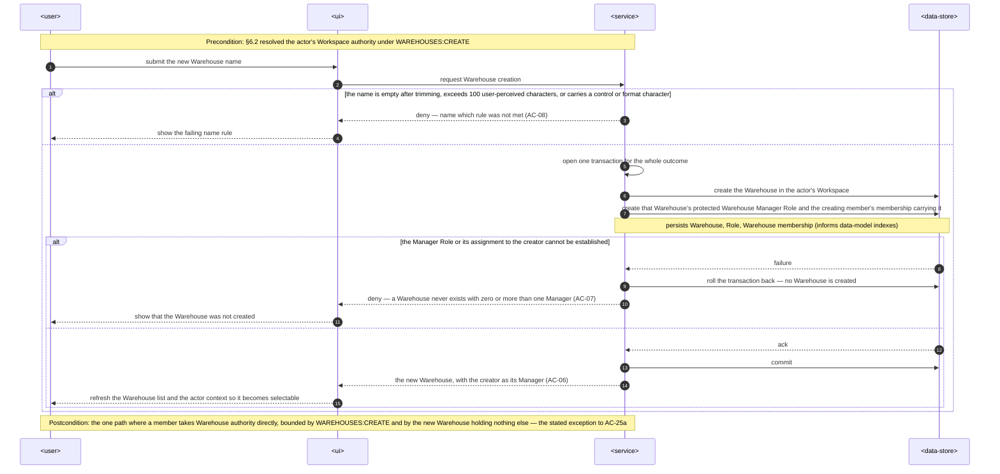
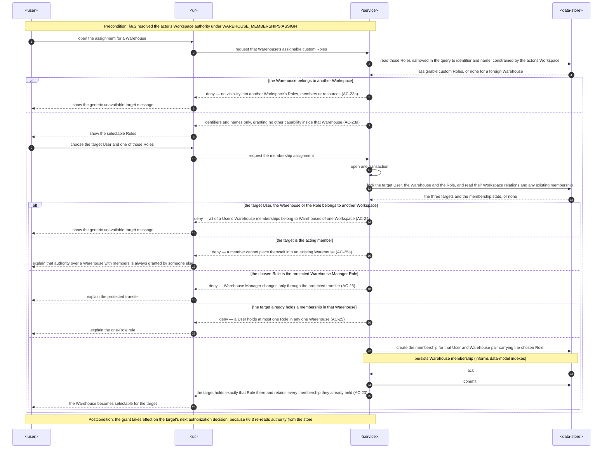
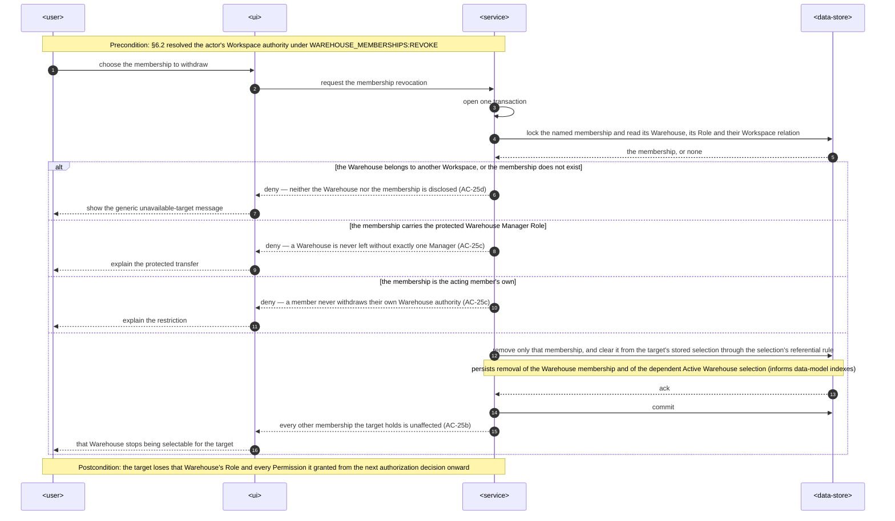
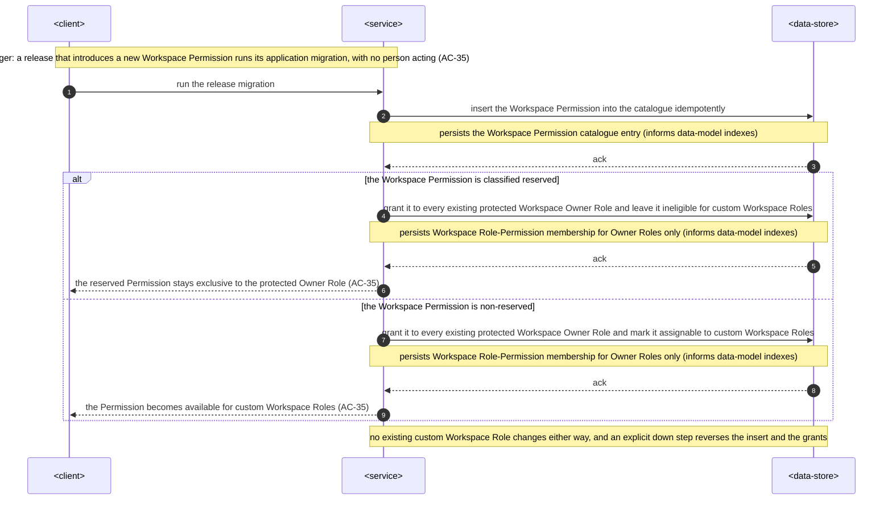

# Software Architecture Description — workspaces

## 1. Context and quality goals

The implemented system treats the Warehouse as the outermost ownership boundary. `warehouse_memberships`
is keyed by `user_id` alone, `WarehouseAccessGuard` resolves the actor's single membership from the
session's `userId` with no Warehouse named anywhere in the request, and the only way a Warehouse comes
into existence is `ProvisionInitialAccessCommand` running inside registration. Nothing owns the
Warehouse record after that moment.

This feature inserts the Workspace above the Warehouse as a second ownership and authorization level,
gives the Workspace level sole ownership of the Warehouse lifecycle and of Workspace membership, and
makes every Warehouse-scoped request name the Warehouse it applies to so that a member may hold
memberships in several Warehouses without authority ever travelling between them.

The architecture must satisfy these quality goals, in priority order:

1. A Workspace Permission never authorizes an operation inside a Warehouse, a Warehouse Permission
   never authorizes a Workspace capability, and neither reaches across a Workspace boundary
   (`spec.md` AC-24, AC-31, AC-34).
2. A Warehouse-scoped request that does not unambiguously name exactly one Warehouse is refused
   rather than resolved to the actor's selection or any other default; the Active Warehouse is never
   an input to an authorization decision (`spec.md` AC-03a, §6.1 "Warehouse confusion").
3. Registration bootstrap, Warehouse creation, assigned Workspace Role deletion, Workspace Owner
   transfer, and Warehouse Manager transfer each preserve every invariant in one database
   transaction (`spec.md` §6 "Lifecycle atomicity").
4. Workspace Role reassignment, Workspace membership removal, Warehouse membership withdrawal, and
   archiving take effect on the next authorization decision, which always re-reads authority from
   PostgreSQL rather than from a session or token (`spec.md` §6 "Revocation freshness", "Authority
   staleness").
5. Authorization stays within 50 ms at p95 at both levels, and the Warehouse authorization stage does
   not grow with the number of Warehouses a member belongs to (`spec.md` §6).
6. Every user-accessible Workspace capability declares a Workspace Permission rule and a Workspace
   ownership check, and the web omits controls, navigation entries, and destinations the actor cannot
   use (`spec.md` AC-30, §6 "Workspace authorization coverage").

The specification is `Draft` and carries two open questions (`spec.md` §8). This design proceeds under
the defaults recorded there and re-states both as gates in §11. Because the feature changes
user-visible navigation, adds Workspace administration, and adds Warehouse selection, an approved
Pencil `design-handoff.md` remains a gate before UI implementation tasks are finalized
([frontend architecture](../../system/frontend-architecture.md) §"UI design boundary").

## 2. Constraints inherited from `docs/system`

- The repository stays a browser SPA plus a NestJS modular monolith with shared boundary schemas in
  `packages/contracts` ([architecture map](../../system/architecture-map.md)). No new container is
  introduced.
- Server code follows the entity-related module, inward-dependency, command/query, domain-service and
  thin-controller boundaries in [server architecture](../../system/server-architecture.md).
  Authentication and transport-level authorization guards stay in `shared/guards/`; business ownership
  rules stay in the owning application boundary.
- Persistence stays PostgreSQL through TypeORM. Shared TypeORM entities stay in
  `shared/domain/entities/`, specialized concrete repositories in `shared/domain/repositories/`
  shaped around a cohesive operation and free of feature-module imports
  ([creating a server repository](../../system/guides/creating-a-server-repository.md)), and every
  schema change is a reviewed migration with runtime synchronization disabled
  ([PostgreSQL/TypeORM ADR](../../system/adr/21-07-2026-postgresql-with-typeorm.md)).
- Atomic operations use `@Transactional()` on the injectable service or command that owns the complete
  operation, and repositories obtain their manager from the shared transaction context
  ([creating a server repository](../../system/guides/creating-a-server-repository.md) §"Transactions
  and errors").
- Zod owns validation. Web/server shapes live in `packages/contracts`; server-only and browser-only
  shapes stay local ([Zod ADR](../../system/adr/12-07-2026-schema-validation-with-zod.md),
  [adding and using contracts](../../system/guides/adding-and-using-contracts.md)).
- Denials and invariant failures are stable typed errors raised through predicates and assertion
  factories and mapped once at the global exception filter; controllers add no local `try/catch`
  ([server error handling](../../system/guides/server-error-handling.md),
  [server error-handling ADR](../../system/adr/24-07-2026-server-error-handling.md)).
- RTK Query owns all server state and request lifecycle through the one injected API slice and its
  shared base query; Redux Toolkit owns only cross-module client state, and server-owned resource data
  never becomes an ordinary slice. TanStack Router guards read the live store through selectors
  ([frontend architecture](../../system/frontend-architecture.md),
  [RTK Query ADR](../../system/adr/02-08-2026-rtk-query-for-web-api-calls.md)).
- Web paths are declared once in `shared/constants/routes.ts`; components follow the ownership-nesting,
  one-component-per-file and two-hop prop rules
  ([placing web components](../../system/guides/placing-web-components.md),
  [writing web components](../../system/guides/writing-web-components.md)).
- User-visible copy lives in module-named namespaces served from `public/locales/<language>/`, and
  HeroUI v3 plus the `HeroUI v3 · Design System` board remains the visual foundation
  ([localization ADR](../../system/adr/27-07-2026-bundled-centralized-web-translations.md),
  [HeroUI design principles](../../system/guides/heroui-design-principles.md)).
- Structured Pino logs are the only diagnostic and measurement mechanism. This feature adds no
  telemetry SDK, tracing, metrics exporter, collector, or feature-specific telemetry abstraction
  ([Pino ADR](../../system/adr/27-07-2026-structured-logging-with-pino.md),
  [logging-instead-of-telemetry ADR](../../system/adr/03-08-2026-structured-logging-instead-of-telemetry.md)).
- BullMQ and Redis are not installed and must not be treated as available
  ([server architecture](../../system/server-architecture.md) §"Runtime applications"). This feature
  introduces no asynchronous work, so it adds no `handlers/` layer and no worker dependency.

No deviation from `docs/system` is proposed. Two consequences of applying these rules are recorded
here because they are easy to mistake for deviations:

- Warehouse-scoped REST paths change shape (§7). That is required by quality goal 2, not by a new
  transport rule; the existing controller/DTO/guard boundaries are unchanged.
- The `warehouse_memberships` primary key changes and existing migrations are **not** edited. The
  schema rebuild described in `spec.md` §1 (roll every migration back, run them again) is the local
  developer procedure that makes forward-only migrations safe to write without backfill; it is not a
  licence to rewrite shipped migrations.

## 3. Scope and target surfaces

`target_surfaces: ['web-frontend', 'backend-service']`. No `worker`, `cli`, `mobile-app`,
`desktop-app`, or `library-sdk` surface is touched.

### In scope

| Surface           | Change                                                                                                                                                                                                                                                                                                                                                                                                                                                                                                                                                       |
| ----------------- | ------------------------------------------------------------------------------------------------------------------------------------------------------------------------------------------------------------------------------------------------------------------------------------------------------------------------------------------------------------------------------------------------------------------------------------------------------------------------------------------------------------------------------------------------------------ |
| `backend-service` | Add the `workspaces` module owning the Workspace, Workspace Roles, the Workspace Permission catalogue, Workspace membership, the Warehouse lifecycle (create, rename, archive, restore) and Warehouse-membership assignment/revocation. Add `WorkspaceAccessGuard`. Rework `WarehouseAccessGuard` to resolve the membership in the Warehouse the request names and to carry archived state. Move registration bootstrap orchestration to `workspaces`, which delegates the protected Warehouse Manager Role to `access`. Add the Active Warehouse selection. |
| `web-frontend`    | Add the `workspace` route-owned module for Workspace administration (Workspace rename, Workspace Roles and catalogue, Workspace Members and Users, Warehouses and their lifecycle, membership assignment/revocation, Owner transfer). Add the Warehouse switcher to the application shell, make every Warehouse-scoped request carry its Warehouse, and gate navigation and controls on Workspace capabilities.                                                                                                                                              |
| Shared boundary   | Add `packages/contracts/workspaces` schemas, the actor-context projection, a separate `WorkspacePermissionId` vocabulary and new stable error codes in `packages/shared-types`, and rename/re-shape the Warehouse-scoped access contracts that now name a Warehouse.                                                                                                                                                                                                                                                                                         |
| Persistence       | Add Workspaces, Workspace Permissions, Workspace Roles, Workspace Role-Permissions and Workspace memberships; add `workspace_id` to Users and Warehouses; add Warehouse archived state; make a Warehouse membership keyed by (User, Warehouse); add the Active Warehouse selection. Exact columns, constraints, indexes and migration order belong to `data-model`.                                                                                                                                                                                          |

### Out of scope

Permanent Warehouse deletion, membership in more than one Workspace, member-defined Workspace
Permission definitions, Workspace-level stock/reporting/billing, and preservation of pre-existing
Warehouse/membership/Role records are excluded by `spec.md` §3. No queue, event, scheduled job, CLI,
SDK, or worker interface is introduced. Paging for Workspace and Warehouse lists is out of scope at
the scale stated in `spec.md` §1 (fifth boundary); outgrowing it is the explicit trigger to revisit,
not a silent regression.

## 4. Solution strategy

**One new module at the outer level; the Warehouse level stays Workspace-unaware.** `workspaces`
becomes the server module that owns everything whose subject is the Workspace, the Warehouse record,
or a membership edge into a Warehouse. `access` keeps everything whose subject is a resource a
Warehouse owns: its Roles, its Permission catalogue reads, its member/Role assignment, and the
protected Warehouse Manager transfer. This is the specification's own boundary rule (`spec.md` §1,
first boundary) expressed as module ownership, and it fixes the dependency direction: `workspaces`
imports `access`'s exported use-case module, `access` never imports `workspaces`, and `auth` calls
only `workspaces` for registration bootstrap. No `forwardRef()` and no cycle
([server architecture](../../system/server-architecture.md) §"Dependency direction").

**The fixed level stays implicit; the plural level is named.** A User belongs to exactly one Workspace
and never selects it, so Workspace-scoped requests carry no Workspace identifier and the guard derives
it from the actor. A member may belong to several Warehouses, so every Warehouse-scoped request names
its Warehouse in the route path and the guard resolves the membership for that exact pair. A request
that omits it cannot reach a handler at all, which is how AC-03a is enforced structurally rather than
by a check each command could forget. See [ADR 0001](./adr/0001-two-level-request-authorization.md).

**Two sibling guards, two metadata keys, two typed vocabularies.** `WorkspaceAccessGuard` reads
`@RequiredWorkspacePermission(...)`, resolves the actor's Workspace membership, Workspace Role and
Workspace Role-Permission membership in one indexed read, and attaches a frozen
`WorkspaceCurrentUser`. The reworked `WarehouseAccessGuard` reads `@RequiredPermission(...)` plus the
route's `warehouseId`, resolves the (User, Warehouse) membership and its Role-Permission membership,
and attaches the existing `AccessCurrentUser` extended with `warehouseId` proven from the request and
the Warehouse's archived state. `PermissionId` and `WorkspacePermissionId` are separate types, so
passing a Workspace Permission to `@RequiredPermission` fails to compile — level confusion becomes a
type error before it can become an authorization bug.

**Archiving withdraws writes, not reads.** An archived Warehouse must still serve AC-12a reads to its
members while refusing every change to a resource it owns (AC-11, AC-12). The guard therefore denies
an archived Warehouse by default and a Warehouse-scoped **read** handler declares its tolerance
explicitly; the Workspace-level operations over that Warehouse record are unaffected because they run
through the Workspace guard, which never consults Warehouse archived state.

**Permission is necessary, never sufficient.** As in `access`, controllers pass the attached principal
into commands and queries, and each use case proves that every target Workspace Role, Workspace
Member, User, Warehouse or membership belongs to `principal.workspaceId` — a cross-Workspace
identifier is indistinguishable from a missing one at the domain boundary (AC-10, AC-24, AC-25d,
AC-34). Two Workspace Permissions deliberately carry a narrow read at the other level
(`WAREHOUSE_MEMBERSHIPS:ASSIGN` over a Warehouse's assignable custom Roles, limited to identifiers and
names; `WORKSPACE_MEMBERS:WATCH` over the Users of the Workspace and the Warehouses they belong to).
Those reads are served by dedicated `workspaces` queries with projections narrowed in SQL, not by
reusing an `access` query and filtering afterwards.

**Workspace authority mirrors Warehouse authority in parallel tables, not in a scoped generalization
of the existing ones.** Workspace Roles, the Workspace Permission catalogue, its membership table and
its protected-Role kind are new relations that mirror the approved Warehouse shapes one level up. The
existing `roles`, `permissions`, `role_permissions` and `warehouse_memberships` relations keep their
current meaning, so no approved Warehouse constraint is weakened to accommodate a second scope. See
[ADR 0002](./adr/0002-parallel-workspace-authority-tables.md).

**The Active Warehouse is server-persisted presentation state with no authority.** AC-03 requires the
selection to follow the member rather than the device, so it is stored per User and read back through
RTK Query — never a Redux slice (server-owned data), never a cookie or session claim (it would then be
an authorization input). The stored value is constrained to a Warehouse the member actually belongs
to, and the actor-context read derives the _effective_ selection at read time: the stored selection
when it is still a live, non-archived membership, otherwise AC-03b's single-membership rule, otherwise
none. No background reconciliation rewrites rows, and a withdrawn membership or a newly archived
Warehouse cannot leave a member pointing at authority they no longer hold.

**Registration bootstrap becomes one orchestration inside the existing transaction.**
`RegisterCommand` already owns a `@Transactional()` boundary. It stops calling
`ProvisionInitialAccessCommand` and instead calls a `workspaces` provisioning service that creates the
Workspace, its protected Workspace Owner Role and initial Workspace Permission membership, the Owner's
Workspace membership, then the first Warehouse — delegating that Warehouse's protected Manager Role and
membership to `access`'s exported provisioning service. Propagation keeps all of it in the one
transaction, so AC-02 rolls the whole outcome back. `access` receives a `warehouseId` and a `userId`
and learns nothing about Workspaces.

**Membership creation elsewhere sets the Workspace relation at creation time.** `users`'
`CreateMemberCommand` must write the new User's `workspace_id` from the Workspace owning the Warehouse
the member is created in (`spec.md` §1, second boundary). The relation is never re-derived from
memberships afterwards, and AC-21 depends on that: a Workspace Member who loses every Warehouse
membership keeps their Workspace Role, so the "candidate already belongs to a Warehouse of this
Workspace" rule of AC-20 is a command-time precondition and must **not** become a database constraint.

## 5. Building blocks and ownership

### Backend and shared boundary

| Building block                                                 | Ownership and responsibility                                                                                                                                                                                                                                                                                                                                                                                                                                                                                                                                                                         |
| -------------------------------------------------------------- | ---------------------------------------------------------------------------------------------------------------------------------------------------------------------------------------------------------------------------------------------------------------------------------------------------------------------------------------------------------------------------------------------------------------------------------------------------------------------------------------------------------------------------------------------------------------------------------------------------- |
| `workspaces/domain`                                            | Workspace, Workspace Role, Workspace Permission membership, Warehouse lifecycle state, predicates, and typed errors for the protected Owner Role, reserved Workspace Permissions, the sole-Owner rule, and the last-non-archived-Warehouse rule. No NestJS, HTTP or TypeORM imports.                                                                                                                                                                                                                                                                                                                 |
| `shared/domain/value-objects`                                  | `access/domain/value-objects/access-name.ts` is promoted here unchanged. Workspace names, Warehouse names (whose lifecycle moves to `workspaces`) and Workspace Role names use the same approved rules, so the trigger in [server architecture](../../system/server-architecture.md) §"Source structure" — keep code in its module until genuinely reused — is met. `workspaces` must not import `access` domain internals, exactly as `users` did not import `auth`'s credential rules ([users-management ADR 0001](../users-management/adr/0001-shared-credential-rules-for-member-lifecycle.md)). |
| `workspaces/domain/services`                                   | Reusable lifecycle rules and transaction owners: registration provisioning, Warehouse lifecycle, Workspace Role membership and assigned-Role replacement, Workspace membership, Owner transfer, Warehouse-membership assignment/revocation, Active Warehouse selection.                                                                                                                                                                                                                                                                                                                              |
| `workspaces/domain/mappers`                                    | Translate `workspaces` domain objects to and from shared persistence entities above the repository boundary.                                                                                                                                                                                                                                                                                                                                                                                                                                                                                         |
| `workspaces/usecases/commands`                                 | Rename the Workspace; create/update/delete a custom Workspace Role (with replacement); add/remove a Workspace Member; move a Workspace Member to another Workspace Role; transfer Workspace Owner; create/rename/archive/restore a Warehouse; assign/revoke a Warehouse membership; set the Active Warehouse.                                                                                                                                                                                                                                                                                        |
| `workspaces/usecases/queries`                                  | Workspace Roles and the Workspace Permission catalogue under `WORKSPACE_ROLES:WATCH`; Workspace Members, their Workspace Roles, the other Users of the Workspace and the Warehouses each belongs to under `WORKSPACE_MEMBERS:WATCH`; the Workspace's Warehouses and archived state under `WAREHOUSES:WATCH`; a Warehouse's assignable custom Roles narrowed to id and name under `WAREHOUSE_MEMBERSHIPS:ASSIGN`; the actor-context projection.                                                                                                                                                       |
| `workspaces/rest`                                              | Thin controllers over the actor's own Workspace plus the Warehouse-record and membership-edge routes, with `createZodDto` adapters over `@warehouser/contracts/workspaces`. Controllers invoke commands/queries only and take the principal from shared request infrastructure.                                                                                                                                                                                                                                                                                                                      |
| `access` (existing module)                                     | Unchanged responsibilities, re-scoped to the named Warehouse: Role lifecycle, catalogue reads, member Role assignment, Warehouse Manager transfer. Exports a Warehouse-provisioning service (protected Manager Role + membership for a given Warehouse and User) that `workspaces` calls. Its former Warehouse-row creation moves out.                                                                                                                                                                                                                                                               |
| `users` (existing module)                                      | `CreateMemberCommand` sets the new User's Workspace relation from the Warehouse's Workspace and writes a (User, Warehouse) membership. Its member-lifecycle predicates and credential rules are unchanged.                                                                                                                                                                                                                                                                                                                                                                                           |
| `auth` (existing module)                                       | `RegisterCommand` keeps its transaction boundary and calls `workspaces` provisioning instead of `access` provisioning. Session establishment, credentials and cookie transport are unchanged.                                                                                                                                                                                                                                                                                                                                                                                                        |
| `shared/guards/workspace-access.guard.ts`                      | Composes after `SessionAuthGuard`, reads required-Workspace-Permission metadata, resolves fresh Workspace authority, denies missing authority, attaches `WorkspaceCurrentUser`. Decides no target ownership.                                                                                                                                                                                                                                                                                                                                                                                         |
| `shared/guards/warehouse-access.guard.ts`                      | Reworked: reads required-Permission metadata **and** the route's `warehouseId`, refuses a request that names no Warehouse, resolves the (User, Warehouse) membership and Permission, refuses an archived Warehouse unless the handler declares read tolerance, attaches `AccessCurrentUser`.                                                                                                                                                                                                                                                                                                         |
| `shared/decorators/required-workspace-permission.decorator.ts` | Sibling of the existing `required-permission.decorator.ts`, keyed separately and typed to `WorkspacePermissionId`.                                                                                                                                                                                                                                                                                                                                                                                                                                                                                   |
| `shared/access/workspace-current-user.ts`                      | Frozen `WorkspaceCurrentUser` (`userId`, `workspaceId`, `workspaceRoleId`, `workspaceRoleKind`, `permissionId`), mirroring `access-current-user.ts`. Server-local; never a client claim.                                                                                                                                                                                                                                                                                                                                                                                                             |
| `shared/access/access-request.ts`                              | Gains the optional `workspace` principal alongside the existing `access` principal.                                                                                                                                                                                                                                                                                                                                                                                                                                                                                                                  |
| `shared/domain/entities`                                       | New entities for Workspace, Workspace Permission, Workspace Role, Workspace Role-Permission and Workspace membership; `UserEntity` gains the Workspace relation and Active Warehouse selection; `WarehouseEntity` gains the Workspace relation and archived state; `WarehouseMembershipEntity` becomes keyed by (User, Warehouse).                                                                                                                                                                                                                                                                   |
| `shared/domain/repositories`                                   | New specialized operations: Workspace-principal resolution, Workspace reads, Workspace Role lifecycle, Workspace membership, Owner transfer, Warehouse lifecycle, Warehouse-membership assignment/revocation, Warehouse selection, and Workspace+Warehouse registration provisioning. `AccessCurrentUserRepository` gains the Warehouse in its lookup and returns archived state. Repositories stay feature-agnostic and free of private methods.                                                                                                                                                    |
| `packages/contracts/workspaces`                                | Strict request/response schemas for Workspace administration, the Warehouse lifecycle, membership assignment/revocation, the narrow assignable-Roles read, the actor-context projection, and the selection write. Existing `contracts/access` shapes are re-scoped to a named Warehouse.                                                                                                                                                                                                                                                                                                             |
| `packages/shared-types`                                        | `WorkspacePermissionId` as a separate vocabulary from `PermissionId`, plus new stable error codes for level confusion, archived Warehouse, last non-archived Warehouse, sole Owner, self-assignment and cross-Workspace targets. Labels stay catalogue data.                                                                                                                                                                                                                                                                                                                                         |
| `apps/server/migrations`                                       | Forward-only reviewed migrations: the Workspace schema and catalogue, the Warehouse/User Workspace relations, archived state, the membership key change, and the selection. Existing migrations are not edited.                                                                                                                                                                                                                                                                                                                                                                                      |

Neither principal is ever returned to the browser. The web receives only the projections in §7, and
every mutation is authorized again from PostgreSQL.

### Web

| Building block                                 | Ownership and responsibility                                                                                                                                                                                                                                        |
| ---------------------------------------------- | ------------------------------------------------------------------------------------------------------------------------------------------------------------------------------------------------------------------------------------------------------------------- |
| `modules/workspace/route.tsx`, `page.tsx`      | Own the Workspace administration route (`ROUTES.WORKSPACE`) and coordinate loading, partial read authority, workflows, confirmation, errors and navigation. Route guard redirects when no Workspace capability opens the destination.                               |
| `modules/workspace/api`                        | Inject the Workspace administration endpoints into the shared API slice with tags for Workspace Roles, catalogue, Members, Users, Warehouses and the actor context, so a mutation refreshes every affected view.                                                    |
| `modules/workspace/components`                 | Render the approved Workspace Role list/editor, Workspace Permission selection, Workspace Member management, Warehouse list with archived state and lifecycle actions, membership assignment/revocation, and Owner transfer.                                        |
| `modules/workspace/hooks`, `schemas`, `alerts` | Workspace capability derivation mirroring `modules/access/hooks/useAccessCapabilities.ts`, browser-only form validation, and Workspace-specific feedback adapters.                                                                                                  |
| `shared/api/workspace-context-api.ts`          | The actor-context query (Workspace identity and Permissions, memberships, effective Active Warehouse) and the selection mutation, placed beside the existing `shared/api/access-permissions-api.ts` because the application shell — not one module — consumes them. |
| `shared/hooks`, `shared/components`            | `useWorkspacePermissions` and a Workspace-level gate mirroring `usePermissions`/`PermissionGate`, kept separate so the two vocabularies never mix in one gate.                                                                                                      |
| `shared/layouts/Sidebar.tsx`, `RootLayout.tsx` | Add the Warehouse switcher to the shell and add the Workspace navigation entry, omitted entirely when every capability behind it is unavailable (AC-30).                                                                                                            |
| `modules/access/*`                             | Every Warehouse-scoped query and mutation carries the selected Warehouse, so cache entries are per-Warehouse and a switch refetches rather than reusing another Warehouse's data. Archived Warehouses render read-only.                                             |
| `modules/auth/sign-up`                         | Unchanged input; the response's initial projection now also carries Workspace identity.                                                                                                                                                                             |
| `public/locales/<language>/workspace.json`     | Workspace-specific labels, the unnamed-Workspace placeholder, archived state copy and explanations, mirrored across `en` and `uk`. Shared validation/error/success copy stays in its existing namespace.                                                            |

Partial read authority is a first-class UI state at this level too: `WORKSPACE_ROLES:WATCH` reveals
Workspace Roles and the catalogue, `WORKSPACE_MEMBERS:WATCH` reveals Members and Users, and
`WAREHOUSES:WATCH` reveals Warehouses. The UI must not request a dataset the actor may not read.

## 6. Runtime view

Participants are generic: `<user>` (the acting person), `<ui>` (the browser application), `<service>`
(the server building blocks of §5) and `<data-store>` (the persistent store). Concrete modules,
guards, tables and technologies are named in §4, §5 and §7, not here. Every mutating step carries a
persist note so `data-model` can derive the indexes and constraints it must express. The feature
introduces no asynchronous work — no queue, event, scheduled job or third-party callback (§2, §3) —
so every flow below is synchronous request → response.

Two flows are the authorization spine the rest depend on: §6.2 for Workspace-scoped operations and
§6.3 for Warehouse-scoped ones. Later flows state which spine resolved their authority instead of
repeating its steps.

### 6.1 Registration bootstrap

1. The sign-up form submits the existing shared credentials-plus-Warehouse-name contract.
2. `RegisterCommand` validates credentials, creates Account, User and Session, then calls the
   `workspaces` provisioning service inside its existing transaction.
3. Provisioning creates the unnamed Workspace, the protected Workspace Owner Role, its initial
   Workspace Permission membership from the release catalogue, and the registrant's Workspace
   membership; it then creates the first Warehouse in that Workspace and delegates the protected
   Warehouse Manager Role and the registrant's Warehouse membership to `access`.
4. The User's Workspace relation is written as part of the same outcome. With exactly one membership,
   AC-03b makes that Warehouse the effective selection without anyone choosing.
5. Only after commit does the controller set the session cookie and return the current User plus the
   initial Workspace and Warehouse projection. Any failure rolls back every object and right (AC-02).

The HTTP boundary risk is unchanged from `auth`: a success response lost after commit cannot roll back
PostgreSQL and must not trigger automatic registration replay.

```mermaid
sequenceDiagram
    autonumber
    participant U as <user>
    participant UI as <ui>
    participant S as <service>
    participant D as <data-store>

    Note over U,S: Precondition: the Visitor holds no Account, and no Workspace, Warehouse or membership exists for them
    U->>UI: submit credentials and the first Warehouse name
    UI->>S: request registration
    S->>S: open one transaction for the whole outcome
    S->>D: read whether the submitted email is already registered
    D-->>S: existing Account or none
    alt credentials or the Warehouse name fail their rules, or the email is already registered
        S-->>UI: deny — nothing was created (AC-02)
        UI-->>U: show the failing rule
    else
        S->>D: create Account, User and Session
        S->>D: create the unnamed Workspace, its protected Workspace Owner Role and that Role's initial Workspace Permission membership
        S->>D: create the registrant's Workspace membership and the User's Workspace relation
        S->>D: create the first Warehouse in that Workspace, its protected Warehouse Manager Role and the registrant's Warehouse membership
        Note over S,D: persists Account, User, Session, Workspace, Workspace Role, Workspace Role-Permission, Workspace membership, Warehouse, Role, Warehouse membership (informs data-model indexes)
        alt any object or right in that set cannot be created
            D-->>S: failure
            S->>D: roll the whole transaction back
            S-->>UI: deny — registration did not complete and none of those objects exist (AC-02)
            UI-->>U: show that registration did not complete
        else
            D-->>S: ack
            S->>D: commit
            S-->>UI: establish the session and return the current User with the initial Workspace and Warehouse projection (AC-01)
            UI-->>U: show immediate access to the first Warehouse
        end
    end
    Note over U,S: Postcondition: exactly one Workspace with exactly one Owner and exactly one Warehouse with exactly one Manager — or nothing at all; holding that single membership makes it the effective selection under AC-03b
```

### 6.2 Protected Workspace operation

1. `SessionAuthGuard` resolves the cookie to `userId`.
2. `WorkspaceAccessGuard` reads the declared Workspace Permission and loads the actor's Workspace
   membership, Workspace Role and Role-Permission membership from PostgreSQL. Missing membership or a
   missing Permission ends the request with a typed denial (AC-30).
3. It attaches `WorkspaceCurrentUser`; Warehouse archived state is never consulted, which is what
   keeps rename, restore, membership assignment/revocation and Manager transfer available over an
   archived Warehouse (AC-11).
4. The controller passes the principal and validated input to the command or query.
5. The use case constrains every target by `principal.workspaceId`. A Workspace Role, Member, User,
   Warehouse or membership from another Workspace is reported as unavailable without disclosing
   existence (AC-10, AC-24, AC-25d, AC-34).
6. The global filter returns the safe contract; structured logs record operation, outcome code,
   duration and non-sensitive identifiers only.

```mermaid
sequenceDiagram
    autonumber
    participant UI as <ui>
    participant S as <service>
    participant D as <data-store>

    Note over UI,S: Precondition: the route declares a required Workspace Permission and carries no Workspace identifier; the actor holds a session
    UI->>S: request a Workspace-scoped capability
    S->>D: resolve the session to the acting User
    D-->>S: acting User or none
    alt no valid session
        S-->>UI: deny — not authenticated; authentication alone grants no authority
    else
        S->>D: read the actor's Workspace membership, Workspace Role and that Role's Workspace Permission membership
        Note over S,D: one indexed point lookup plus one bounded Permission read; authority is re-read here on every request, never taken from the session (spec §6 "Authority staleness")
        D-->>S: Workspace principal or none
        alt the actor is not a Workspace Member, or the Role does not carry the declared Workspace Permission
            S-->>UI: deny — access is not permitted (AC-30)
        else the handler declared the other level's Permission
            Note over S: the two levels use separate metadata keys and separate identifier types, so this guard resolves nothing and the mistake is a compile error before it can be a runtime hole (AC-31)
            S-->>UI: deny — no Workspace authority resolved
        else
            S->>S: attach the frozen Workspace principal; Warehouse archived state is never consulted at this level (AC-11)
            S->>D: read the target Workspace Role, Member, User, Warehouse or membership constrained by the principal's Workspace
            D-->>S: target or none
            alt the target belongs to another Workspace, or does not exist
                S-->>UI: deny — target unavailable, existence not disclosed (AC-10, AC-24, AC-25d, AC-34)
            else
                S->>D: apply the operation within the actor's own Workspace
                D-->>S: ack
                S-->>UI: safe result
            end
        end
    end
    Note over UI,S: Postcondition: every effect is confined to the actor's Workspace; structured logs record operation, outcome code, duration and non-sensitive identifiers only
```

### 6.2a Rename the Workspace

1. A Workspace is created without a name and is presented with a placeholder until one is set.
2. `WORKSPACE:RENAME` authorizes setting it and later changing it; the approved name rules apply
   unchanged, and no uniqueness is enforced across Workspaces.

```mermaid
sequenceDiagram
    autonumber
    participant U as <user>
    participant UI as <ui>
    participant S as <service>
    participant D as <data-store>

    Note over U,S: Precondition: §6.2 resolved the actor's Workspace authority under WORKSPACE:RENAME; the Workspace is unnamed or already carries a name
    U->>UI: submit the new Workspace name
    UI->>S: request the Workspace rename
    alt the actor lacks the rename Workspace Permission
        S-->>UI: deny — access is not permitted (AC-30)
        UI-->>U: omit the control rather than presenting it unusable
    else the name is empty after trimming, exceeds 100 user-perceived characters, or carries a control or format character
        S-->>UI: deny — name which rule was not met (AC-29a)
        UI-->>U: show the failing name rule; the existing name or unnamed state is left as it was
    else
        S->>D: store the trimmed name with its submitted Unicode preserved and no normalization applied
        Note over S,D: persists the Workspace name (informs data-model indexes)
        D-->>S: ack
        S-->>UI: the renamed Workspace (AC-29)
        UI-->>U: present the name in place of the unnamed-Workspace placeholder
    end
    Note over U,S: Postcondition: a valid name may duplicate another Workspace's name
```

### 6.3 Protected Warehouse operation

1. The request names its Warehouse in the route path; a request that does not cannot match a
   Warehouse-scoped route at all (AC-03a).
2. `WarehouseAccessGuard` resolves the membership for exactly that (User, Warehouse) pair and the
   Permission granted by the Role of _that_ membership, so a Permission held in another Warehouse
   grants nothing here (AC-05) and a member with no membership there is denied without disclosure
   (AC-04).
3. The guard loads the Warehouse's archived state in the same read. An archived Warehouse is denied
   unless the handler declares read tolerance, which is how AC-12 refuses changes while AC-12a keeps
   retained Roles, memberships and records readable and marked archived.
4. The use case constrains targets by `principal.warehouseId`, exactly as today.
5. The actor's stored selection takes no part in any step above.

```mermaid
sequenceDiagram
    autonumber
    participant UI as <ui>
    participant S as <service>
    participant D as <data-store>

    Note over UI,S: Precondition: the route names its Warehouse in the path, declares a required Warehouse Permission, and is classified read or mutating (§8)
    UI->>S: request a Warehouse-scoped capability for a named Warehouse
    alt the request does not unambiguously name exactly one Warehouse
        Note over UI,S: no Warehouse-scoped route matches, so no handler is reached and the actor's selection is never substituted (AC-03a)
        S-->>UI: refuse — the Warehouse was not named
    else
        S->>D: resolve the session to the acting User
        D-->>S: acting User or none
        S->>D: read the membership for exactly this User and Warehouse pair, the Permission membership of that membership's Role, and the Warehouse's archived state
        Note over S,D: one indexed point lookup that must not grow with the number of Warehouses the member belongs to (spec §6)
        D-->>S: Warehouse principal with archived state, or none
        alt the actor holds no membership in the named Warehouse
            S-->>UI: deny — the Warehouse's contents are not disclosed (AC-04)
        else the Permission is held only through the Role of another Warehouse
            S-->>UI: deny — authority is always that of the membership held in the Warehouse being acted on (AC-05)
        else the handler declared a Workspace Permission instead
            S-->>UI: deny — no Warehouse authority resolved; the two vocabularies never substitute for each other (AC-31)
        else the Warehouse is archived and the handler is classified mutating
            S-->>UI: deny — the Warehouse is archived; the membership, its Role and every membership in other Warehouses are unaffected (AC-12)
        else the Warehouse is archived and the handler declared read tolerance
            S->>D: read that Warehouse's retained Roles, memberships and records
            D-->>S: retained data
            S-->>UI: allow the read and mark the Warehouse as archived (AC-12a)
        else
            S->>S: attach the Warehouse principal with the Warehouse proven from the request path
            S->>D: apply the operation constrained by that same Warehouse
            D-->>S: ack
            S-->>UI: safe result
        end
    end
    Note over UI,S: Postcondition: the actor's stored Active Warehouse took no part in any step above (spec §6.1 "Warehouse confusion")
```

### 6.4 Add a Warehouse

1. A member authorized by `WAREHOUSES:CREATE` submits a Warehouse name.
2. The Warehouse lifecycle service opens one transaction, validates the name against the approved
   name rules, and creates the Warehouse in `principal.workspaceId`.
3. It delegates the protected Warehouse Manager Role and the creating member's membership in that new
   Warehouse to `access`.
4. If the Manager Role or its assignment cannot be established, the whole outcome rolls back — a
   Warehouse never exists with zero or several Managers (AC-07).
5. Commit invalidates the Warehouse list and the actor context, so the new Warehouse becomes
   selectable for the creator (AC-06). This is the one path where a member takes Warehouse authority
   directly; it is bounded by `WAREHOUSES:CREATE` and by the new Warehouse holding nothing else.



### 6.4a Rename a Warehouse

1. `WAREHOUSES:RENAME` is a Workspace capability because its subject is the Warehouse record, so it
   runs through §6.2 and stays available while that Warehouse is archived (AC-11).
2. The approved Warehouse name rules are unchanged, and a valid name may duplicate another's.

```mermaid
sequenceDiagram
    autonumber
    participant U as <user>
    participant UI as <ui>
    participant S as <service>
    participant D as <data-store>

    Note over U,S: Precondition: §6.2 resolved the actor's Workspace authority under WAREHOUSES:RENAME; renaming remains available while the Warehouse is archived (AC-11)
    U->>UI: submit the Warehouse and its new name
    UI->>S: request the Warehouse rename
    S->>D: read that Warehouse constrained by the actor's Workspace
    D-->>S: the Warehouse, or none
    alt the Warehouse belongs to another Workspace, or does not exist
        S-->>UI: deny — Workspace Permissions never override Workspace ownership, and existence is not disclosed (AC-10)
        UI-->>U: show the generic unavailable-target message
    else the name is empty after trimming, exceeds 100 user-perceived characters, or carries a control or format character
        S-->>UI: deny — name which rule was not met (AC-08)
        UI-->>U: show the failing name rule
    else
        S->>D: store the trimmed name with its submitted Unicode preserved and no normalization applied
        Note over S,D: persists the Warehouse name (informs data-model indexes)
        D-->>S: ack
        S-->>UI: the renamed Warehouse (AC-09)
        UI-->>U: the new name is what members of that Warehouse see
    end
    Note over U,S: Postcondition: a valid name may duplicate another Warehouse's name
```

### 6.5 Archive and restore a Warehouse

1. A member authorized by `WAREHOUSES:ARCHIVE` submits the Warehouse and the intended state.
2. The command locks the Workspace's Warehouse rows, re-counts non-archived Warehouses, and refuses
   archiving the last one (AC-11a). The lock is what makes two concurrent archivings safe.
3. Archiving sets archived state only. Roles, memberships and records are retained and stay readable;
   restoring clears it and the Warehouse is operable again with everything intact (AC-11).
4. Failure leaves archived state, memberships and Roles unchanged (AC-13).
5. Commit invalidates the Warehouse list, the actor context of affected members, and that Warehouse's
   Warehouse-scoped caches. Members whose effective selection was that Warehouse fall back per §4.

```mermaid
sequenceDiagram
    autonumber
    participant U as <user>
    participant UI as <ui>
    participant S as <service>
    participant D as <data-store>

    Note over U,S: Precondition: §6.2 resolved the actor's Workspace authority under WAREHOUSES:ARCHIVE, which governs both withdrawing and restoring
    U->>UI: submit the Warehouse and the intended archived state
    UI->>S: request the archived-state change
    S->>S: open one transaction
    S->>D: lock the Workspace's Warehouse rows and re-count those not archived
    Note over S,D: the lock is what makes two concurrent archivings safe; data-model owns the lock shape
    D-->>S: the Workspace's Warehouses with their archived state, or none for a foreign target
    alt the Warehouse belongs to another Workspace, or does not exist
        S->>D: roll back
        S-->>UI: deny — existence is not disclosed (AC-10)
        UI-->>U: show the generic unavailable-target message
    else archiving, and it is the only Warehouse of the Workspace that is not already archived
        S->>D: roll back
        S-->>UI: deny — a Workspace always keeps at least one Warehouse that is not archived (AC-11a)
        UI-->>U: explain that members are never left without a site to work in
    else
        S->>D: set the archived state only, retaining every Role, membership and record
        Note over S,D: persists the Warehouse archived state (informs data-model indexes)
        alt the change cannot complete
            D-->>S: failure
            S->>D: roll the transaction back
            S-->>UI: deny — archived state, memberships and Roles are unchanged (AC-13)
            UI-->>U: show that the change did not complete
        else
            D-->>S: ack
            S->>D: commit
            S-->>UI: the Warehouse's new archived state (AC-11)
            UI-->>U: invalidate the Warehouse list, the affected actor contexts and that Warehouse's scoped caches
        end
    end
    Note over U,S: Postcondition: an archived Warehouse stops being selectable and refuses every change to a resource it owns, while restoring makes it operable again with its Roles and memberships intact; members whose effective selection it was fall back per §4
```

### 6.6 Assign and revoke a Warehouse membership from the Workspace level

1. Under `WAREHOUSE_MEMBERSHIPS:ASSIGN` the actor first reads the target Warehouse's assignable custom
   Roles, narrowed in SQL to identifier and name; the read grants no other capability inside that
   Warehouse and nothing at all in another Workspace's Warehouse (AC-23a).
2. The assignment command locks the target User, Warehouse and Role, then proves all three belong to
   `principal.workspaceId`, that the target is not the actor (AC-25a), that the Role is custom rather
   than the protected Manager Role, and that no membership for that (User, Warehouse) exists (AC-25).
3. Revocation under `WAREHOUSE_MEMBERSHIPS:REVOKE` refuses the Manager membership and the actor's own
   membership (AC-25c), removes only the named membership, and leaves every other membership intact
   (AC-25b). A revoked membership clears that member's stored selection through the selection's
   referential rule.
4. Both operations take effect on the next authorization decision because §6.3 re-reads authority.

#### Assign a Warehouse membership



#### Revoke a Warehouse membership



### 6.6a Manage Workspace membership

1. Workspace membership is granted deliberately rather than inherited: `WORKSPACE_MEMBERS:ADD`
   requires the candidate to already hold a Warehouse membership in a Warehouse of the Workspace,
   which is a command-time precondition and deliberately **not** a database constraint (§4, AC-21).
2. `WORKSPACE_ROLES:ASSIGN` moves an existing Workspace Member between custom Workspace Roles, and
   `WORKSPACE_MEMBERS:REMOVE` withdraws Workspace membership while leaving every Warehouse membership
   intact. Neither may touch the current Workspace Owner.

#### Add and remove a Workspace Member

```mermaid
sequenceDiagram
    autonumber
    participant U as <user>
    participant UI as <ui>
    participant S as <service>
    participant D as <data-store>

    Note over U,S: Precondition: §6.2 resolved the actor's Workspace authority under WORKSPACE_MEMBERS:ADD or WORKSPACE_MEMBERS:REMOVE
    U->>UI: choose a candidate to add, or a Workspace Member to remove
    alt adding a Workspace Member
        UI->>S: request the Workspace membership with a custom Workspace Role
        S->>D: read the candidate, their Warehouse memberships in this Workspace and any existing Workspace membership
        D-->>S: candidate state, or none
        alt the candidate belongs to another Workspace, or does not exist
            S-->>UI: deny — existence is not disclosed (AC-34)
            UI-->>U: show the generic unavailable-target message
        else the candidate holds no Warehouse membership in any Warehouse of this Workspace
            S-->>UI: deny — only people who already belong to a Warehouse of this Workspace can become Workspace Members (AC-20)
            UI-->>U: explain the precondition
        else the candidate is already a Workspace Member
            S-->>UI: deny — the candidate already holds a Workspace Role (workspace.member_exists)
            UI-->>U: explain that an existing Member's Workspace Role is reassigned, not added again
        else the chosen Workspace Role is the protected Owner Role
            S-->>UI: deny — Workspace Owner changes only through the protected transfer action (AC-22, workspace.owner_transfer_required)
            UI-->>U: explain the protected transfer
        else
            S->>D: create the Workspace membership carrying exactly that one custom Workspace Role
            Note over S,D: persists Workspace membership (informs data-model indexes)
            D-->>S: ack
            S-->>UI: the candidate holds exactly that one Workspace Role and gains the capabilities it grants (AC-19)
            UI-->>U: confirm the addition
        end
    else removing a Workspace Member
        UI->>S: request the Workspace membership removal
        S->>D: read the target's Workspace membership and Workspace Role
        D-->>S: the membership, or none
        alt the target belongs to another Workspace, or is not a Workspace Member
            S-->>UI: deny — existence is not disclosed (AC-34)
            UI-->>U: show the generic unavailable-target message
        else the target is the current Workspace Owner
            S-->>UI: deny — Workspace Owner must be transferred first (AC-21a)
            UI-->>U: explain that a Workspace is never left without exactly one Owner
        else
            S->>D: remove the Workspace membership only, leaving every Warehouse membership and Role intact
            Note over S,D: persists removal of the Workspace membership (informs data-model indexes)
            D-->>S: ack
            S-->>UI: the target keeps every Warehouse membership and loses every Workspace capability (AC-19a)
            UI-->>U: confirm the removal
        end
    end
    Note over U,S: Postcondition: Workspace membership survives the loss of every Warehouse membership and ends only through this explicit removal (AC-21); capability changes apply from the next authorization decision onward
```

#### Move a Workspace Member to another Workspace Role

```mermaid
sequenceDiagram
    autonumber
    participant U as <user>
    participant UI as <ui>
    participant S as <service>
    participant D as <data-store>

    Note over U,S: Precondition: §6.2 resolved the actor's Workspace authority under WORKSPACE_ROLES:ASSIGN
    U->>UI: choose a Workspace Member and a different custom Workspace Role
    UI->>S: request the Workspace Role reassignment
    S->>D: read the target's Workspace membership and the chosen Workspace Role, both constrained by the actor's Workspace
    D-->>S: the target and the Role, or none
    alt the target or the Role belongs to another Workspace, or does not exist
        S-->>UI: deny — existence is not disclosed (AC-34)
        UI-->>U: show the generic unavailable-target message
    else the chosen Role is the protected Workspace Owner Role, or the target is the current Workspace Owner
        S-->>UI: deny — Workspace Owner can change only through the protected transfer action (AC-22)
        UI-->>U: explain the protected transfer
    else
        S->>D: replace the target's Workspace Role with the chosen custom Workspace Role
        Note over S,D: persists the Workspace membership Role assignment (informs data-model indexes)
        D-->>S: ack
        S-->>UI: the target holds exactly that one Workspace Role (AC-19b)
        UI-->>U: confirm; no Warehouse membership or Role changed
    end
    Note over U,S: Postcondition: the previous Workspace Role's capabilities stop applying from the next authorization decision onward
```

### 6.7 Workspace Role lifecycle and Owner transfer

1. Custom Workspace Role create/update/delete mirrors `access`'s approved Role lifecycle one level up:
   exact per-Workspace name uniqueness with case-sensitive comparison, catalogue-membership validation
   that rejects unknown and reserved Workspace Permissions, and immutability of the protected Owner
   Role (AC-14 – AC-18).
2. Deleting an **assigned** custom Workspace Role requires both deletion and assignment authority
   (AC-17d), takes a replacement custom Workspace Role of the same Workspace, and moves every affected
   Member and deletes the Role in one repository operation inside one transaction (AC-17, AC-17b). It
   is refused when no other custom Workspace Role exists (AC-17c).
3. Owner transfer requires the reserved `WORKSPACE_OWNER_ROLE:REASSIGN`, a different Workspace Member
   of the same Workspace, and a custom Workspace Role for the outgoing Owner. One transaction promotes
   the recipient and reassigns the former Owner; the sole-Owner uniqueness constraint plus row locks
   preserve exactly one Owner under concurrent attempts (AC-26 – AC-28).
4. Ordinary assignment can neither grant the Owner Role nor move the current Owner (AC-22), and
   Workspace membership removal refuses the current Owner (AC-21a).
5. Commit invalidates Workspace Roles, Members and both affected actor contexts.

#### Custom Workspace Role lifecycle

```mermaid
sequenceDiagram
    autonumber
    participant U as <user>
    participant UI as <ui>
    participant S as <service>
    participant D as <data-store>

    Note over U,S: Precondition: §6.2 resolved the actor's Workspace authority under WORKSPACE_ROLES:CREATE, :UPDATE or :DELETE
    U->>UI: create, rename, re-permission or delete a custom Workspace Role
    UI->>S: request the Workspace Role change
    S->>D: read the Workspace's Workspace Roles, the Workspace Permission catalogue and the target Role's current assignments
    D-->>S: Roles, catalogue and assignment counts
    alt the target is the protected Workspace Owner Role
        S-->>UI: deny — the protected Workspace Role is system-managed (AC-16)
        UI-->>U: explain that it cannot be renamed, deleted or re-permissioned
    else the submitted name is empty after trimming, exceeds 100 user-perceived characters, or carries a control or format character
        S-->>UI: deny — name which Workspace Role-name rule was not met (AC-15a)
        UI-->>U: show the failing name rule
    else another Workspace Role already uses that exact name in this Workspace
        S-->>UI: deny — Workspace Role names are unique within the Workspace, while differently cased names stay distinct (AC-15)
        UI-->>U: explain the exact-name rule
    else a chosen Workspace Permission is absent from the catalogue or reserved to the Owner Role, or a Permission identifier or label was changed
        S-->>UI: deny — Workspace Permission definitions are system-managed (AC-18)
        UI-->>U: explain the catalogue rule
    else deleting an assigned Role while the actor lacks the Workspace Role-assignment Permission
        S-->>UI: deny — moving the affected Members to a replacement is an assignment (AC-17d)
        UI-->>U: explain that deleting an unassigned Role stays available to them
    else deleting an assigned Role that is the Workspace's only custom Workspace Role
        S-->>UI: deny — another custom Workspace Role must exist first (AC-17c)
        UI-->>U: explain that every Member holds exactly one Role and the protected Role is never assigned this way
    else deleting an assigned Role, with a replacement custom Workspace Role of the same Workspace selected
        S->>S: open one transaction
        S->>D: move every affected Workspace Member to the replacement and delete the Role in one repository operation
        Note over S,D: persists Workspace membership Role assignments and the Workspace Role deletion (informs data-model indexes)
        alt any affected Member cannot be moved, or the deletion cannot complete
            D-->>S: failure
            S->>D: roll the transaction back
            S-->>UI: deny — no Workspace Role assignment and no Workspace Role changed (AC-17b)
            UI-->>U: show that the deletion did not complete
        else
            D-->>S: ack
            S->>D: commit
            S-->>UI: every affected Member moved and the Role deleted as one outcome (AC-17)
            UI-->>U: confirm; no Member is left without exactly one Workspace Role
        end
    else deleting an unassigned Role
        S->>D: delete that Workspace Role
        Note over S,D: persists the Workspace Role deletion (informs data-model indexes)
        D-->>S: ack
        S-->>UI: deleted, with no Workspace Role assignment changed (AC-17a)
        UI-->>U: confirm
    else
        S->>D: store the created or updated Role with its assignable Workspace Permission membership, the empty set included, preserving the name's submitted Unicode
        Note over S,D: persists Workspace Role and Workspace Role-Permission membership (informs data-model indexes)
        D-->>S: ack
        S-->>UI: the Role is available for assignment within that Workspace (AC-14, AC-14a)
        UI-->>U: confirm
    end
    Note over U,S: Postcondition: a changed Workspace Permission membership is used by subsequent authorization decisions, which §6.2 re-reads from the store
```

#### Transfer Workspace Owner

```mermaid
sequenceDiagram
    autonumber
    participant U as <user>
    participant UI as <ui>
    participant S as <service>
    participant D as <data-store>

    Note over U,S: Precondition: the reserved owner-transfer Workspace Permission belongs only to the protected Workspace Owner Role and is ineligible for custom Workspace Roles
    U->>UI: choose the recipient and the custom Workspace Role the outgoing Owner will take
    UI->>S: request the Workspace Owner transfer
    S->>S: open one transaction
    S->>D: lock both Workspace memberships and read the Workspace's custom Workspace Roles
    D-->>S: the two memberships and the available Roles
    alt the actor is not the current Owner, or lacks the reserved owner-transfer Permission
        S->>D: roll back
        S-->>UI: deny — exactly one current Workspace Owner is preserved (AC-27)
        UI-->>U: explain that only the Owner transfers ownership
    else the recipient is the actor, is not a Workspace Member, or is a Member of another Workspace
        S->>D: roll back
        S-->>UI: deny — exactly one current Workspace Owner is preserved (AC-28)
        UI-->>U: show the generic unavailable-recipient message
    else the Workspace has no custom Workspace Role for the outgoing Owner to receive
        S->>D: roll back
        S-->>UI: deny — a custom Workspace Role must be created first (AC-26a)
        UI-->>U: explain that the outgoing Owner must end the transfer holding exactly one Workspace Role
    else
        S->>D: promote the recipient to the protected Owner Role and reassign the former Owner to the selected custom Role in one operation
        Note over S,D: persists both Workspace membership Role assignments; the sole-Owner uniqueness constraint is the final arbiter under concurrency (informs data-model indexes)
        alt the sole-Owner constraint rejects a concurrent transfer
            D-->>S: conflict
            S->>D: roll the transaction back
            S-->>UI: deny — exactly one current Workspace Owner is preserved (AC-27, AC-28)
            UI-->>U: show that the transfer did not complete
        else
            D-->>S: ack
            S->>D: commit
            S-->>UI: the recipient is the sole Owner and the former Owner holds the selected custom Role as one outcome (AC-26)
            UI-->>U: refresh Workspace Roles, Members and both affected actor contexts
        end
    end
    Note over U,S: Postcondition: the Workspace has exactly one Workspace Owner and every Workspace Member holds exactly one Workspace Role
```

### 6.7a Transfer Warehouse Manager

1. Warehouse Manager transfer stays an `access` responsibility re-scoped to the named Warehouse (§5),
   so it resolves authority through §6.3 rather than §6.2.
2. AC-11 keeps it available while that Warehouse is archived, which the §6.3 read/mutating
   classification does not yet express — see the flags at the end of §6.

```mermaid
sequenceDiagram
    autonumber
    participant U as <user>
    participant UI as <ui>
    participant S as <service>
    participant D as <data-store>

    Note over U,S: Precondition: §6.3 resolved the actor as the Warehouse Manager of the named Warehouse; AC-11 keeps this transfer available while that Warehouse is archived
    U->>UI: choose the recipient and the custom Role of that Warehouse the outgoing Manager will take
    UI->>S: request the Warehouse Manager transfer for the named Warehouse
    S->>S: open one transaction
    S->>D: lock both memberships in that Warehouse and read the Warehouse's custom Roles
    D-->>S: the memberships and Roles, or none
    alt the recipient holds no membership in that Warehouse, is the outgoing Manager themself, or no custom Role of that Warehouse was selected
        S->>D: roll back
        S-->>UI: deny — exactly one current Warehouse Manager is preserved (AC-36a)
        UI-->>U: explain that Manager moves only between members of that same Warehouse and that the outgoing Manager must end holding exactly one Role there
    else
        S->>D: move the protected Manager Role to the recipient's membership and the selected custom Role to the outgoing Manager's membership in one operation
        Note over S,D: persists both Warehouse membership Role assignments; the one-Manager-per-Warehouse uniqueness constraint is the final arbiter under concurrency (informs data-model indexes)
        alt the one-Manager constraint rejects a concurrent transfer
            D-->>S: conflict
            S->>D: roll the transaction back
            S-->>UI: deny — exactly one current Warehouse Manager is preserved (AC-36a)
            UI-->>U: show that the transfer did not complete
        else
            D-->>S: ack
            S->>D: commit
            S-->>UI: the recipient's membership carries the Manager Role and the outgoing Manager's carries the selected custom Role as one outcome (AC-36)
            UI-->>U: confirm
        end
    end
    Note over U,S: Postcondition: the Warehouse ends with exactly one Manager, and every membership either party holds in another Warehouse is unaffected (AC-36)
```

### 6.8 Select the Active Warehouse

1. The member submits the Warehouse to work in. This route is session-authenticated and declares no
   Permission, because selecting is not a capability over a Warehouse resource; the command itself
   proves a live membership in that Warehouse and that it is not archived (AC-04, AC-11).
2. The selection is stored against the member, so it is the same wherever they next sign in and
   persists until changed (AC-03).
3. The actor-context read returns the effective selection derived per §4; the stored value is never
   consulted by any authorization decision.
4. Switching invalidates Warehouse-scoped caches so the newly selected Warehouse's data and
   capabilities are fetched for that Warehouse rather than reused from the previous one.

```mermaid
sequenceDiagram
    autonumber
    participant U as <user>
    participant UI as <ui>
    participant S as <service>
    participant D as <data-store>

    Note over U,S: Precondition: this route is session-authenticated and declares no Permission, because selecting is not a capability over a Warehouse resource; the command proves the membership itself
    U->>UI: choose the Warehouse to work in
    UI->>S: request the Active Warehouse selection
    S->>D: read the actor's membership in that Warehouse together with its archived state
    D-->>S: a live membership with archived state, or none
    alt the actor holds no membership in that Warehouse
        S-->>UI: deny — the current selection is unchanged and the Warehouse's contents are not disclosed (AC-04)
        UI-->>U: leave the previous selection in place
    else the Warehouse is archived
        S-->>UI: deny — an archived Warehouse stops being selectable (AC-11)
        UI-->>U: keep it listed but marked as not selectable
    else
        S->>D: store the selection against the member rather than the device
        Note over S,D: persists the User's Active Warehouse selection, constrained to a Warehouse they hold a membership in (informs data-model indexes)
        D-->>S: ack
        S-->>UI: the selection is retained and persists until changed (AC-03)
        UI-->>U: invalidate the Warehouse-scoped caches so this Warehouse's own data and capabilities are fetched
    end
    UI->>S: read the actor context
    S->>D: read the stored selection together with the member's live, non-archived memberships
    D-->>S: stored selection and memberships
    alt the stored selection is still a live, non-archived membership
        S-->>UI: that Warehouse is the effective selection (AC-03)
    else the member holds exactly one live membership
        S-->>UI: that single membership becomes the effective selection, with no one choosing it (AC-03b)
    else
        S-->>UI: no effective selection — the system never chooses between several memberships on the member's behalf (AC-03b)
    end
    Note over U,S: Postcondition: the selection follows the member wherever they next sign in, and is never read by any authorization decision (spec §6.1 "Stale selection")
```

### 6.9 Workspace Permission catalogue release

A release that introduces a Workspace Permission adds it to the catalogue and, when it is
non-reserved, grants it to every existing protected Workspace Owner Role in the same migration, with
no person acting and no custom Workspace Role changed (AC-35). A Workspace Permission classified as
reserved is added to the catalogue and to the Owner Role but stays ineligible for custom Workspace
Roles. This mirrors the existing `1786025100000-GrantUsersManagementPermissions` migration pattern,
including its idempotent insert and its explicit `down`.



### 6.10 Administer a Workspace in the web application

1. After authentication the shell loads the actor context: Workspace identity and name (or the unnamed
   placeholder), Workspace Permissions, the member's Warehouses, and the effective selection.
2. The navigation entry and the Workspace route appear only when a capability behind them exists;
   otherwise both are omitted rather than shown empty or unusable (AC-30).
3. The page requests Workspace Roles/catalogue, Members/Users, and Warehouses independently, each
   under its own watch Permission, and renders only the mutations present in the projection.
4. The Warehouse switcher lists the member's memberships, marks archived ones as not selectable, and
   writes the selection through §6.8.
5. After any mutation RTK Query invalidation refreshes the actor context and every affected list, so a
   capability the actor just lost stops being offered. A denial from a concurrent revocation surfaces
   the normalized safe explanation.

```mermaid
sequenceDiagram
    autonumber
    participant U as <user>
    participant UI as <ui>
    participant S as <service>
    participant D as <data-store>

    Note over U,S: Precondition: the actor is authenticated; the browser holds no authority and every projection is re-derived from the store
    U->>UI: open the application after authentication
    UI->>S: request the actor context
    S->>D: read Workspace identity and name, the actor's Workspace Permissions, their Warehouses with archived state, and the stored selection
    D-->>S: the actor-context projection
    S-->>UI: Workspace identity or the unnamed placeholder, Permissions, memberships and the effective selection
    alt every capability behind the Workspace destination is unavailable to this actor
        UI-->>U: omit the navigation entry and the destination entirely, rather than presenting either empty or unusable (AC-30)
    else
        UI-->>U: show the Workspace navigation entry
        U->>UI: open the Workspace administration page
        par each dataset is requested independently under its own watch Permission
            UI->>S: request the Workspace Roles and the Workspace Permission catalogue
            S-->>UI: Roles and catalogue when the Role-watch Permission is held (AC-32), otherwise a denial disclosing nothing (AC-34)
        and
            UI->>S: request the Workspace Members, their Workspace Roles, the other Users of the Workspace and the Warehouses each belongs to
            S-->>UI: Members and Users when the member-watch Permission is held (AC-33), otherwise a denial disclosing nothing (AC-34)
        and
            UI->>S: request the Workspace's Warehouses with their archived state
            S-->>UI: Warehouses when the Warehouse-watch Permission is held (AC-33), otherwise a denial disclosing nothing (AC-34)
        end
        UI-->>U: render only the sections the projection allows and only the mutations it carries (AC-30)
        U->>UI: switch Warehouse from the shell switcher
        UI->>S: write the selection through §6.8
        S-->>UI: the effective selection
        UI-->>U: list the member's memberships with archived ones marked not selectable (AC-11)
    end
    Note over U,S: Postcondition: after any mutation, invalidation refreshes the actor context and every affected list, so a capability the actor just lost stops being offered; a denial from a concurrent revocation surfaces the normalized safe explanation
```

### Flags raised while drawing these flows

Recorded here for `design` to reconcile; nothing above was silently changed.

- **AC-11 versus the §6.3 read/mutating classification. — RESOLVED by
  [ADR 0003](./adr/0003-archived-tolerant-membership-edge-mutations.md).** AC-11 keeps the protected
  Warehouse Manager transfer available on an archived Warehouse, but §5 keeps that transfer in
  `access` as a Warehouse-scoped mutating operation, and §6.3 denies exactly that. §4's reasoning
  ("the Workspace-level operations over that Warehouse record are unaffected") does not cover it,
  because this operation resolves authority through the Warehouse guard. Either the transfer needed a
  third classification — an archived-tolerant mutation, which the §8 coverage check did not admit — or
  its handler had to be Workspace-guarded. §6.7a draws it as Warehouse-scoped and noted the conflict
  rather than choosing. **Resolution:** the third classification, narrowed to membership-edge
  mutations, with `transferWarehouseManager` as its only member; Workspace-guarding it was rejected
  because US-13/AC-36 make the outgoing Warehouse Manager the actor, and a Warehouse Manager need not
  be a Workspace Member. §8 Authorization coverage below admits the class; the same resolution closes
  `api-sync-report.md` **OQ-1**. Owner: Tech Lead + Security Lead.
- **AC-31 is only half a runtime concern.** The type split between `PermissionId` and
  `WorkspacePermissionId` makes level confusion a compile error (§4), so only its runtime half — two
  separate metadata keys, so the wrong guard resolves nothing — is drawn, in §6.2 and §6.3.
- **No new participant was needed.** Every flow uses only participants §5 already declares; no
  `<message-bus>` or `<external-system>` appears, consistent with §2's statement that BullMQ and Redis
  are not available and this feature introduces no asynchronous work.
- **No decision here passes the blast-radius gate**, so no ADR is proposed. The archived-tolerance
  question above becomes ADR-worthy only if it is resolved by adding a third handler classification.
  It **was** resolved that way, so [ADR 0003](./adr/0003-archived-tolerant-membership-edge-mutations.md)
  records it and §9 indexes it.

## 7. Data and interface impact

### Data

- New durable concepts: Workspace (name nullable until set), the Workspace Permission catalogue with
  an assignable/reserved classification, Workspace Role with a system-managed kind distinguishing the
  protected Owner Role, Workspace Role-Permission membership, and exactly one Workspace membership per
  Workspace Member.
- Existing concepts change: `users` gains a non-null Workspace relation and a nullable Active
  Warehouse selection; `warehouses` gains a non-null Workspace relation and archived state;
  `warehouse_memberships` becomes keyed by (User, Warehouse) instead of by User, while the existing
  one-Manager-per-Warehouse uniqueness and the same-Warehouse Role foreign key are preserved.
- Constraints `data-model` must express or explicitly reject as inexpressible: exactly one Owner per
  Workspace; exactly one Workspace Role per Workspace Member; Workspace Roles and assignments never
  crossing Workspaces; every Warehouse membership of a User being in a Warehouse of that User's
  Workspace (a composite reference through the Workspace relation is the candidate shape); the Active
  Warehouse always being a Warehouse the member holds a membership in, cleared when that membership is
  withdrawn; exact per-Workspace Workspace-Role-name uniqueness under the same `C` collation the
  approved Role names already use; and catalogue referential integrity.
- Deliberately **not** a constraint: "a Workspace Member holds a Warehouse membership". AC-20 makes it
  a precondition at grant time and AC-21 requires it to survive losing every membership, so a database
  constraint would violate the specification.
- "A Workspace keeps at least one non-archived Warehouse" is not expressible as a row constraint; it
  is a locked re-count inside the archiving command (§6.5). `data-model` owns the lock shape.
- Name validation reuses the approved rules by promoting the existing `AccessName` value object to
  `shared/domain/value-objects/` unchanged (§5): trim, count user-perceived characters with the same
  grapheme segmenter, reject Unicode control/format characters, store submitted Unicode without
  normalization, no uniqueness for Workspace or Warehouse names. Workspace names additionally allow the
  unset state, which is the Workspace-level wrapper's only addition.
- Migrations are forward-only and assume no pre-existing rows, which `spec.md` §1 (fifth boundary)
  authorizes: the non-null Workspace relations are added without backfill and the membership key
  change needs no data rewrite. Existing migrations are not edited; the rollback-and-replay procedure
  is how a developer rebuilds a local schema.
- `data-model` also owns index design for the two guard reads (a point lookup per level that must not
  grow with the number of memberships), the Warehouse and Workspace list reads, and the assigned-Role
  replacement operation.

### HTTP and shared contracts

The `api` stage owns exact paths, methods and status codes. The shape decisions this design fixes:

- Workspace-scoped routes carry no Workspace identifier and resolve the actor's Workspace from the
  session.
- Every Warehouse-scoped route names its Warehouse in the path. This re-shapes the existing
  `/api/v1/access/*` endpoints **and the four `/api/v1/users/*` handlers**, all of which currently
  imply the actor's single Warehouse — a deliberate breaking change with no deployed consumer other
  than this repository's web application. `apps/server/src/users/rest/controllers/users.controller.ts`
  guards all four (`USERS:CREATE`, `USERS:EMAIL_UPDATE`, `USERS:PASSWORD_CHANGE`, `USERS:DELETE`)
  with `SessionAuthGuard, WarehouseAccessGuard` and resolves the actor's single membership from the
  session, so under AC-03a none of them survives either; they move to
  `/api/v1/warehouses/{warehouseId}/users/...` together with their DTOs, contracts and RTK Query
  endpoints (`api-sync-report.md` **F-2**, resolved).
- Warehouse-record and membership-edge routes (create, rename, archive, restore, assign membership,
  revoke membership, read a Warehouse's assignable Roles) are Workspace-scoped routes even though a
  Warehouse identifier appears in their path, because their subject is the record or the edge.

The contract must cover: the actor-context projection (Workspace identity/name/unnamed state,
Workspace Permissions, the member's Warehouses with archived state, effective selection); the
Warehouse-scoped capability projection for a named Warehouse; Workspace rename; Workspace Role reads
and the catalogue; Workspace Member and Workspace User reads including the Warehouses each belongs to;
Warehouse reads with archived state; custom Workspace Role create/update/delete-with-replacement;
Workspace membership add/remove and Workspace Role assignment; Owner transfer; Warehouse create,
rename, archive and restore; Warehouse membership assign and revoke; the narrow assignable-Roles read;
the selection write; and stable failure codes for validation, authorization, cross-Workspace or
unavailable target, protected Role, reserved Permission, archived Warehouse, last non-archived
Warehouse, sole Owner, self-assignment and concurrency, all through the existing error envelope.

List responses are returned whole and deterministically ordered at the scale in `spec.md` §1; the
existing cursor page shape is retained where it already exists so paging can be introduced without a
contract break. No endpoint accepts a Workspace Permission definition or label mutation, and no
endpoint accepts a capability projection back as proof of authority.

No queue, event, CLI, SDK or worker interface is introduced.

## 8. Cross-cutting concerns

### Security and privacy

- Authentication grants no authority at either level. A valid session with no Workspace membership is
  denied every Workspace capability, and one with no membership in the named Warehouse is denied every
  Warehouse capability.
- The two vocabularies are separate types checked by separate guards against separate metadata keys, so
  level confusion (AC-31) is a compile error rather than a runtime hole.
- Cross-Workspace and cross-Warehouse misses return the same non-enumerating failure as a missing
  target, and never disclose existence (AC-10, AC-25d, AC-34).
- Self-escalation is closed at the command boundary: membership assignment never targets the actor,
  never grants the protected Manager Role, and never creates a second Role for one User in one
  Warehouse; membership revocation never removes the actor's own membership or the Manager's; Workspace
  membership removal and ordinary assignment never touch the current Owner.
- The stored selection is presentation state. It is never read by a guard or use case for
  authorization, and the effective-selection derivation means a stale selection cannot outlive the
  membership behind it.
- Reserved Workspace Permission membership and protected Workspace Role lifecycle are validated in
  domain code and backed by database constraints where expressible.
- The security review required by `spec.md` §6.1 must cover: a Warehouse-scoped handler reachable
  without a `warehouseId`; a handler declaring the wrong level's Permission; missing metadata on a new
  handler; archived-tolerance declared on a mutating handler; direct use-case invocation bypassing a
  guard; identifier enumeration at both levels; concurrent Owner and Manager transfers; concurrent
  archiving of the last two Warehouses; assigned Workspace Role deletion; and catalogue migration.

### Authorization coverage

The existing architecture check that classifies every user-accessible handler extends to two levels. A
handler outside authentication must fall into exactly one of these classes:

1. **Workspace-Permission** — declares a `WorkspacePermissionId`, resolved by the Workspace guard.
2. **Warehouse-Permission** — declares a `PermissionId` **together with** a `warehouseId` route
   parameter, resolved by the Warehouse guard.
3. **Infrastructure-exempt** — explicitly listed, with a reason.
4. **Session-only with a documented membership check** — the selection route in §6.8 is the only
   member of this class.
5. **Self-projection read** — a read whose subject is the actor's own capabilities, membership-scoped
   and declaring **no** Permission, because requiring a Permission to read one's own capabilities
   would be circular. Members: `GET /api/v1/workspace/context` (which must answer for a User who is
   no Workspace Member at all, since that empty projection is exactly how AC-30 makes the web omit
   every Workspace control and destination) and `GET /api/v1/warehouses/{warehouseId}/access/current`.
   Resolves `api-sync-report.md` **OQ-2**.

Warehouse-scoped handlers (class 2) must additionally be classified **read** (archived-tolerant),
**mutating** (denied on an archived Warehouse — AC-12), or **archived-tolerant membership-edge
mutation**. That third classification is admitted by
[ADR 0003](./adr/0003-archived-tolerant-membership-edge-mutations.md) and is deliberately narrow: it
covers only mutations whose subject is the relationship between a User and a Warehouse, never the
Warehouse record, its name, its archived state or anything it contains. In this release it has exactly
one member, `transferWarehouseManager` (AC-11, AC-36), resolving `api-sync-report.md` **OQ-1**. A
handler declaring archived tolerance while mutating fails the check unless it is in that admitted
list, and each addition needs an explicit membership-edge justification at review.

Metadata coverage alone is not sufficient evidence; unit and integration tests still prove each
concrete ownership rule.

### Consistency and concurrency

Every multi-step outcome is owned by one `@Transactional()` service or command and composed of
specialized repository operations that join the shared transaction context. Database constraints are
the final arbiter under concurrency, and commands re-check preconditions after acquiring their locks —
registration bootstrap, Warehouse creation, archiving the last Warehouse, assigned Workspace Role
deletion, Owner transfer and Manager transfer all follow that pattern. Expected constraint conflicts
map to stable application errors; no layer catches, logs and rethrows.

### Performance and diagnostics

Each level's guard performs one indexed point lookup for the membership plus one bounded
Permission-membership read, so the Warehouse authorization stage is independent of how many Warehouses
a member belongs to (`spec.md` §6). Structured Pino timing through the existing
`withOperationTiming` helper measures both authorization stages, Workspace reads and mutations, and
Warehouse selection, with no telemetry added. The load smoke test exercises at least 50 Workspace
operations per second per instance for ten minutes. Invariant reconciliation is reported through
structured operational logs and never silently repaired.

### Web state, freshness and accessibility

RTK Query tags connect the actor context, Workspace Roles, catalogue, Members, Users, Warehouses and
every Warehouse-scoped list, so any mutation refreshes each affected view and a lost capability stops
being offered. Warehouse-scoped cache entries are keyed by Warehouse so switching never shows another
Warehouse's data. The server stays authoritative during races. Loading, empty, partial-authority,
archived, denied, validation, success and rollback-safe states all require explicit Pencil designs, as
does the Warehouse switcher and the unnamed-Workspace placeholder. Dialogs restore focus, expose
accessible names and descriptions, support keyboard operation, and never communicate archived or
protected state by color alone.

### Naming

`docs/features/workspaces/CONTEXT.md` records that the pre-existing web "workspace" component naming
(`modules/access/components/access-workspace/`) is presentation vocabulary carrying no domain meaning.
The new domain module is `modules/workspace/`. The collision is documentation-level only and no rename
is in scope; reviewers and implementers must read the path, not the word.

## 9. ADR index

| ADR                                                               | Decision                                                                                                                                      | Status   |
| ----------------------------------------------------------------- | --------------------------------------------------------------------------------------------------------------------------------------------- | -------- |
| [0001](./adr/0001-two-level-request-authorization.md)             | Two sibling guards with separate metadata and vocabularies; the Warehouse is named in the route path                                          | Accepted |
| [0002](./adr/0002-parallel-workspace-authority-tables.md)         | Workspace Roles/Permissions/membership as parallel relations rather than a scope discriminator on the Warehouse ones                          | Accepted |
| [0003](./adr/0003-archived-tolerant-membership-edge-mutations.md) | A third Warehouse-scoped classification — the archived-tolerant membership-edge mutation — instead of Workspace-guarding the Manager transfer | Accepted |

Inherited system decisions — module placement, PostgreSQL/TypeORM persistence and migrations, Zod
contracts, the shared-guard location, error handling, logging without telemetry, RTK Query data flow,
and the UI approval workflow — are not re-decided here. The remaining feature choices (Active
Warehouse storage and effective-selection derivation, forward-only migrations, `workspaces` → `access`
delegation for Warehouse provisioning, and promoting the name value object to `shared/domain/`) do not
pass the blast-radius gate and are recorded inline in §4, §5 and §7. Archived-tolerance is the
exception: it grew a third handler classification enforced by the §8 release gate, which is why it is
ADR 0003 rather than an inline note.
The last of those follows the precedent already set by
[users-management ADR 0001](../users-management/adr/0001-shared-credential-rules-for-member-lifecycle.md)
rather than re-deciding it.

## 10. Verification strategy

| Level                  | Required evidence                                                                                                                                                                                                                                                                                                      |
| ---------------------- | ---------------------------------------------------------------------------------------------------------------------------------------------------------------------------------------------------------------------------------------------------------------------------------------------------------------------- |
| Domain unit            | Workspace name rules including the unset state; exact and case-sensitive Workspace Role name behaviour; assignable versus reserved Workspace Permissions; protected Owner Role immutability; replacement, transfer, archiving and last-non-archived preconditions.                                                     |
| Guard unit             | Both guards: session composition, correct metadata key, missing membership, membership in a different Warehouse, Permission held only in another Warehouse, a request naming no Warehouse, archived denial versus declared read tolerance, and safe principal shape.                                                   |
| Repository integration | Composite membership key, one-Owner and one-Manager uniqueness, same-Workspace membership constraint, selection referential behaviour on revocation, catalogue seeding and extension, fresh authority reads, and transaction participation against PostgreSQL.                                                         |
| Command integration    | Atomic registration bootstrap; Warehouse creation rollback when the Manager Role fails; archiving the last Warehouse refused under concurrency; assigned/unassigned Workspace Role deletion; Owner and Manager transfers under concurrent attempts; assignment and revocation restrictions; injected-failure rollback. |
| REST contract          | Every endpoint validates its shared schema, maps stable errors, prevents enumeration, denies the wrong level's Permission, denies cross-Workspace targets, and rejects a Warehouse-scoped call without a Warehouse.                                                                                                    |
| Architecture           | Every user-accessible handler outside authentication is classified per §8; Warehouse-scoped handlers declare read or mutating; controllers call use cases only; `workspaces/domain` has no framework imports; `access` does not import `workspaces`.                                                                   |
| Web                    | Partial read authority at both levels; omitted navigation and controls; per-Warehouse cache keying and refetch on switch; archived read-only rendering; direct-request denial handling; invalidation after authority changes; translated feedback; focus and keyboard behaviour; responsive approved layouts.          |
| Performance/operations | Both authorization p95 targets; independence from membership count; read/mutation and selection p95; 50 ops/s smoke load; structured timing fields; migration apply/revert against the development database; invariant reconciliation output.                                                                          |

Trace every check to an `AC-*` in `spec.md` during `plan-tests`. Run the contracts, server and web
lint, test and build gates after the focused suites. Migrations are verified by applying and reverting
them against the real development database rather than by tests. The security review and the approved
Pencil handoff are release gates.

## 11. Risks and open questions

| Risk or question                                                                                                                                                                                                             | Treatment / owner                                                                                                                                                                                                   |
| ---------------------------------------------------------------------------------------------------------------------------------------------------------------------------------------------------------------------------- | ------------------------------------------------------------------------------------------------------------------------------------------------------------------------------------------------------------------- |
| `spec.md` §8: the approved Access spec excludes multi-Warehouse membership and the approved Users-management spec creates a User without a Workspace relation — both reversed here. Unresolved, and was due before `design`. | Design proceeds under the spec's stated default: raise a change request against each approved feature so they are superseded rather than silently edited. Must be resolved before `tasks`. Tech Lead.               |
| `spec.md` §8: what a member is shown when their selected Warehouse is archived or their membership withdrawn.                                                                                                                | §4's effective-selection derivation already implements the stated default without a background job; the presentation of the fallback still needs the `design-ui` decision. PM + Frontend Lead.                      |
| A new handler declares the wrong level's Permission, or a Warehouse-scoped handler forgets its `warehouseId`.                                                                                                                | Separate types make the first a compile error; the §8 coverage check makes the second a failing architecture test. Both are release gates. Tech Lead.                                                               |
| Archived-tolerance is declared on a handler that mutates, silently reopening AC-12.                                                                                                                                          | Guard denies by default; the coverage check requires an explicit read/mutating classification, and integration tests assert a denial per mutating Warehouse-scoped endpoint. Backend Lead + Security Lead.          |
| The same-Workspace-membership and one-Owner invariants may not be fully expressible as database constraints.                                                                                                                 | `data-model` resolves composite references, partial uniqueness and lock strategy, or records the inexpressible part with the command-level guarantee and a PostgreSQL concurrency test. Backend Lead.               |
| Re-shaping the existing `/api/v1/access/*` paths **and the four `/api/v1/users/*` handlers** breaks every current web call at once (`api-sync-report.md` **F-2**).                                                           | Contract and web changes ship in the same release with no external consumer; `api` records the old-to-new mapping for all of them and the `tasks` order keeps server and web in step. Backend Lead + Frontend Lead. |
| Two capability projections plus per-Warehouse caching make web freshness harder to reason about than the single projection today.                                                                                            | One actor-context query owns Workspace-level truth, one per-Warehouse query owns Warehouse-level truth, both invalidated by tag; no component re-derives authority from another source. Frontend Lead.              |
| Guard reads double per request at the two levels and could regress the 50 ms target.                                                                                                                                         | One indexed point lookup plus one bounded Permission read per level, only the level a handler declares, measured by the existing timing helper against the §6 target. Backend Lead.                                 |
| Forward-only migrations assume empty tables for the new non-null relations.                                                                                                                                                  | `spec.md` §1 (fifth boundary) authorizes it; migrations assert emptiness rather than backfilling, and the rebuild procedure is documented in `apps/server/migrations/README.md` alongside the change. Backend Lead. |
| The repository still runs one REST bootstrap despite the documented two-runtime target.                                                                                                                                      | This feature adds no asynchronous work, no `handlers/` layer and no queue dependency, so it stays compatible with the later root-module split. Tech Lead.                                                           |
| Workspace administration, the Warehouse switcher, archived state and the unnamed-Workspace placeholder are not visually approved.                                                                                            | Run `/design-ui workspaces`; do not finalize UI implementation tasks before explicit approval is recorded in `design-handoff.md`. Product + Frontend Lead.                                                          |
