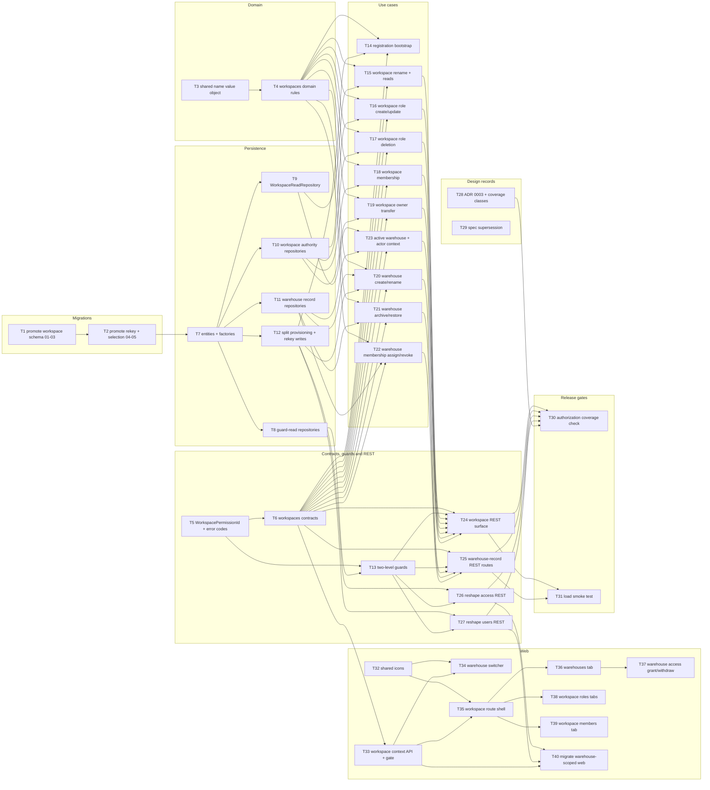

# Epic — workspaces

> **Spec:** [spec.md](../spec.md) · **Design:** [sad.md](../sad.md) · **Data model:** [data-model.md](../data-model.md) · **API:** [openapi.yaml](../contracts/openapi.yaml) · **Sync report:** [api-sync-report.md](../contracts/api-sync-report.md) · **ADRs:** [adr/](../adr/) · **Design handoff:** [design-handoff.md](../design-handoff.md)

## Goal

Insert the Workspace above the Warehouse as a second ownership and authorization boundary, give the
Workspace level sole ownership of the Warehouse lifecycle and of Workspace membership, and make every
Warehouse-scoped request name the Warehouse it applies to — so one organization can operate several
sites under a single identity and a member can hold memberships in several Warehouses without
authority ever travelling between them (`spec.md` §2).

## Scope

- **In:** a new `workspaces` server module (domain/usecases/rest), a second `WorkspaceAccessGuard`
  beside a reworked `WarehouseAccessGuard`, five schema migrations, new and re-keyed shared
  repositories and entities, `packages/contracts/workspaces` plus a separate `WorkspacePermissionId`
  vocabulary, a new `modules/workspace` web module, the Warehouse switcher in the application shell,
  and the breaking re-shape of every existing `/api/v1/access/*` and `/api/v1/users/*` route with its
  web callers — per `sad.md` §3.
- **Out:** permanent Warehouse deletion, membership in more than one Workspace, member-defined
  Workspace Permission definitions, Workspace-level stock/reporting/billing, preservation of
  pre-existing Warehouse/membership/Role records, and paging for the Workspace and Warehouse lists —
  per `spec.md` §3 and `sad.md` §3.

## Decisions taken at this stage

Five items were parked upstream as "due before `tasks`". All are resolved here; three by the feature
owner, two under a stated default.

| Item                                                                                            | Resolution                                                                                                                                                                                                                                                                                                                                                                                                                                                             | Where it lands       |
| ----------------------------------------------------------------------------------------------- | ---------------------------------------------------------------------------------------------------------------------------------------------------------------------------------------------------------------------------------------------------------------------------------------------------------------------------------------------------------------------------------------------------------------------------------------------------------------------- | -------------------- |
| **OQ-1** — Warehouse Manager transfer on an archived Warehouse                                  | Stays Warehouse-guarded at its `/api/v1/warehouses/{warehouseId}/access/manager-transfer` path and gains a **third** handler classification: an archived-tolerant mutation whose subject is a membership edge. Moving it under the Workspace guard was rejected because US-13/AC-36 make the Warehouse Manager the actor, and a Warehouse Manager need not be a Workspace Member at all. `sad.md` §6 says this resolution passes the blast-radius gate → **ADR 0003**. | T28, enforced by T30 |
| **OQ-2** — `sad.md` §8 admits no self-projection read                                           | The classification gains a fourth class, "self-projection read", covering `GET /api/v1/workspace/context` (must answer for a non-Member — that empty projection _is_ AC-30) and `GET /api/v1/warehouses/{warehouseId}/access/current` (requiring a Permission to read one's own capabilities would be circular).                                                                                                                                                       | T28, enforced by T30 |
| **F-2** — the breaking surface is wider than `sad.md` §7 names                                  | Accepted as found: all four `users` handlers re-shape too. Sized as its own task rather than folded into the `access` re-shape.                                                                                                                                                                                                                                                                                                                                        | T27, T40             |
| **F-3** — `sad.md` §6.6a lumps two causes into one deny message                                 | The contract already carries two named codes (`workspace.member_exists`, `workspace.owner_transfer_required`); the command emits the cause-specific message.                                                                                                                                                                                                                                                                                                           | T18 (DoD)            |
| **F-4** / `spec.md` §8 — approved `access` and `users-management` specs contradict this feature | Recorded as an in-epic supersession note in both approved specs with a back-link, rather than two separate change-request pipelines — neither approved feature is being re-implemented, and `workspaces` **is** the change.                                                                                                                                                                                                                                            | T29                  |

Also settled: the ~10 missing Lucide icon components are **hand-rolled** following the existing
`shared/icons/*Icon.tsx` pattern; no icon-library dependency is added (`design-handoff.md`
§Open questions). → T32.

## Task map

Six tasks start on day one with no dependencies: **T1** (migrations), **T3** (shared name value
object), **T5** (the two vocabularies), **T28** and **T29** (design records), **T32** (icons). The
graph then opens into five long-running parallel branches — persistence, use cases, the two REST
re-shapes, the workspace web module, and the shell — that only reconverge at the two release gates.

## Tasks

See [tracker.md](./tracker.md) for status. Machine contract: [tasks.json](../tasks.json).

| #   | Task                                                     | Layer     | Blocked by                            | DoD (short)                                                          |
| --- | -------------------------------------------------------- | --------- | ------------------------------------- | -------------------------------------------------------------------- |
| T1  | Promote workspace authority schema migrations (01–03)    | migration | —                                     | Applies/reverts cleanly; 16-row catalogue seeded (AC-35)             |
| T2  | Promote re-key + selection migrations (04–05)            | migration | T1                                    | `warehouse_memberships` keyed by (user, warehouse); selection column |
| T3  | Promote `AccessName` + add the Workspace name wrapper    | domain    | —                                     | Moved suite green; unset-state unit tests                            |
| T4  | `workspaces` domain predicates, errors and invariants    | domain    | T3                                    | Unit tests per invariant; no framework imports                       |
| T5  | `WorkspacePermissionId` + new stable error codes         | ports     | —                                     | Type-level test proves level confusion is a compile error            |
| T6  | `packages/contracts/workspaces` schemas                  | ports     | T5                                    | Every schema matches its OpenAPI component                           |
| T7  | Workspace entities, changed entities, test factories     | infra     | T2                                    | Persist/read integration test; `persistWorkspaceGraph`               |
| T8  | Guard-read repositories (both levels)                    | infra     | T7                                    | Two point lookups; independent of membership count                   |
| T9  | `WorkspaceReadRepository`                                | infra     | T7                                    | Five projections, `workspace_id`-constrained in SQL                  |
| T10 | Workspace Role / membership / Owner-transfer repos       | infra     | T7                                    | Atomic replacement + concurrent-transfer arbiter test                |
| T11 | Warehouse lifecycle + membership repos                   | infra     | T7                                    | Locked non-archived re-count under concurrency                       |
| T12 | Split provisioning; re-key existing Warehouse writes     | infra     | T7                                    | `access` provisioning takes a `warehouseId`; composite writes        |
| T13 | `WorkspaceAccessGuard` + reworked `WarehouseAccessGuard` | ports     | T5, T8                                | Guard unit tests incl. unnamed-Warehouse refusal (AC-03a)            |
| T14 | Registration bootstrap in `workspaces` provisioning      | app       | T4, T6, T12                           | One transaction; injected failure leaves nothing (AC-01/02)          |
| T15 | Workspace rename + configuration queries                 | app       | T4, T6, T9                            | AC-29/29a/32/33/34 integration tests                                 |
| T16 | Workspace Role create + update                           | app       | T4, T6, T10                           | AC-14/14a/15/15a/16/18 integration tests                             |
| T17 | Workspace Role deletion with replacement                 | app       | T4, T6, T10                           | AC-17/17a/17b/17c/17d integration tests                              |
| T18 | Workspace membership add / remove / reassign             | app       | T4, T6, T10                           | AC-19/19a/19b/20/21/21a/22 integration tests                         |
| T19 | Workspace Owner transfer                                 | app       | T4, T6, T10                           | AC-26/26a/27/28 incl. concurrent transfer                            |
| T20 | Warehouse create + rename                                | app       | T4, T6, T11, T12                      | AC-06/07/08/09/10 integration tests                                  |
| T21 | Warehouse archive + restore                              | app       | T4, T6, T11                           | AC-10/11/11a/13 incl. last-Warehouse race                            |
| T22 | Warehouse membership assign / revoke + assignable Roles  | app       | T4, T6, T11                           | AC-23/23a/24/25/25a/25b/25c/25d integration tests                    |
| T23 | Active Warehouse selection + actor-context query         | app       | T6, T9, T11                           | Effective-selection derivation, no row rewritten (AC-03/03b)         |
| T24 | Workspace-level REST controller + module wiring          | ports     | T6, T13, T15, T16, T17, T18, T19, T23 | REST contract tests for every `/api/v1/workspace/*` path             |
| T25 | Warehouse-record and membership-edge REST routes         | ports     | T6, T13, T20, T21, T22                | Workspace-guarded, unaffected by archived state                      |
| T26 | Re-shape the `access` REST surface                       | ports     | T12, T13                              | Read/mutating declared; manager-transfer per ADR 0003                |
| T27 | Re-shape the `users` REST surface                        | ports     | T12, T13                              | 4 handlers re-pathed; member gets the Workspace relation             |
| T28 | ADR 0003 + `sad.md` §8 classification reconciliation     | docs      | —                                     | ADR Accepted; OQ-1, OQ-2, F-2, F-3 marked resolved                   |
| T29 | Record the supersession of the two approved specs        | docs      | —                                     | `access` + `users-management` amended; `spec.md` §8 closed           |
| T30 | Two-level authorization-coverage architecture check      | tests     | T24, T25, T26, T27, T28               | Fails an unclassified or wrongly-tolerant handler                    |
| T31 | Workspace load smoke test + timing coverage              | tests     | T24, T25                              | ≥50 ops/s for 10 min; both p95 targets met                           |
| T32 | Missing shared icon components                           | ui        | —                                     | 10 hand-rolled icons; no new dependency                              |
| T33 | Workspace actor-context API, capability hook, gate       | ui        | T6                                    | Non-Member derives no capability, requests no dataset                |
| T34 | Warehouse switcher in the application shell              | ui        | T32, T33                              | Desktop header + mobile context bar per `n7Th5`/`ciqhD`              |
| T35 | `modules/workspace` route, page shell, tabs, i18n        | ui        | T32, T33                              | Nav entry and destination absent without capability (AC-30)          |
| T36 | Warehouses tab: list, detail pane, lifecycle dialogs     | ui        | T35                                   | Archived + last-Warehouse states per `N840R`/`yUU5P`                 |
| T37 | Warehouse access grant / withdrawal from the detail pane | ui        | T36                                   | Narrow assignable-Roles read; Manager row protected                  |
| T38 | Workspace roles + Permissions tabs                       | ui        | T35                                   | Reserved row disabled with reason; delete-with-replacement           |
| T39 | Workspace members tab + Owner transfer                   | ui        | T35                                   | Owner row `Protected`, offers transfer only                          |
| T40 | Migrate the Warehouse-scoped web surface                 | ui        | T26, T27, T33                         | Per-Warehouse cache keys; archived read-only                         |

**Total:** 40 tasks, ~34 person-days.

> **On the task count.** [`size-matrix.md`](../../../../.claude/skills/_shared/size-matrix.md) bands
> `L/XL` at 12–20 tasks. This feature carries 57 acceptance criteria, 35 API operations across 29
> paths, 5 migrations, 2 new modules on 2 surfaces, and a breaking re-shape of the entire existing
> HTTP surface. Holding to 20 tasks would mean multi-day, >500 LOC tasks, which the atomicity rule
> forbids — so atomicity won. Read the count as evidence the feature sits above the `L` band, not as
> over-decomposition.

## Lanes (serialized by overlapping `files_hint`)

`implement` serializes tasks whose file sets overlap. Three lanes are deliberate:

- **T1 → T2** — `layer: migration` is always serialized; the ordinals are dependency-forced anyway.
- **T24 / T25** — both register controllers in `workspaces/rest/` and the same use-case module.
- **T35 → T36 / T37 / T38 / T39** — all five edit `public/locales/en/workspace.json`. T35 establishes
  the namespace and its key skeleton from the approved copy; the tab tasks add their own keys. The
  three tab branches would otherwise run in parallel — this lane is the price of the single
  namespace file `design-handoff.md` §Implementation constraints mandates.

`packages/contracts/src/access/` and `packages/contracts/src/users/` are **not** split into
standalone contract tasks: re-scoping them breaks their existing implementers at compile time, so
each is folded into the task that re-implements against it (T26, T27 respectively).

## Risks / Hard rules

- **`access` never imports `workspaces`.** `workspaces` imports `access`'s exported provisioning
  service; the reverse direction is a cycle. No `forwardRef()`. Asserted by T30 (`sad.md` §4).
- **A Workspace Permission never authorizes inside a Warehouse and vice versa.** Two types, two
  metadata keys, two guards. Level confusion must stay a compile error (T5) _and_ a runtime miss
  (T13) — do not let a task introduce a shared or generic `PermissionId` (`sad.md` §4, AC-31).
- **A Warehouse-scoped request that names no Warehouse is refused, never resolved.** The Active
  Warehouse is presentation state and is never read by a guard or use case (`spec.md` AC-03a, §6.1
  "Warehouse confusion"). T23 must not expose the stored selection to any authorization path.
- **"A Workspace Member holds a Warehouse membership" must not become a database constraint.** AC-20
  makes it a grant-time precondition; AC-21 requires membership to survive losing every Warehouse
  membership. `data-model.md` §"Constraints deliberately not expressed" is binding on T7 and T18.
- **Archived tolerance is declared only on reads and on the one membership-edge mutation ADR 0003
  admits.** Any other archived-tolerant mutation silently reopens AC-12; T30 fails the build for it.
- **Migrations are forward-only and assert emptiness rather than backfilling.** Existing migrations
  are never edited; developers rebuild by rolling back and replaying (`spec.md` §1, fourth boundary).
  T1/T2 must not add a backfill.
- **The Warehouse detail pane never renders a person's Warehouse Role.** `WORKSPACE_MEMBERS:WATCH`
  does not cover it; joining it in exceeds the actor's read and invites AC-31 confusion
  (`design-handoff.md` §"The level boundary is part of the design"). Binding on T36 and T37.
- **No dataset is requested for a watch Permission the actor lacks** — at either level, on any tab
  (AC-30, AC-34). Binding on T33, T35, T36, T38, T39.
- **No telemetry.** Timing evidence comes from the existing `withOperationTiming` structured fields
  only (repository `AGENTS.md`, `sad.md` §8). Binding on T31.
